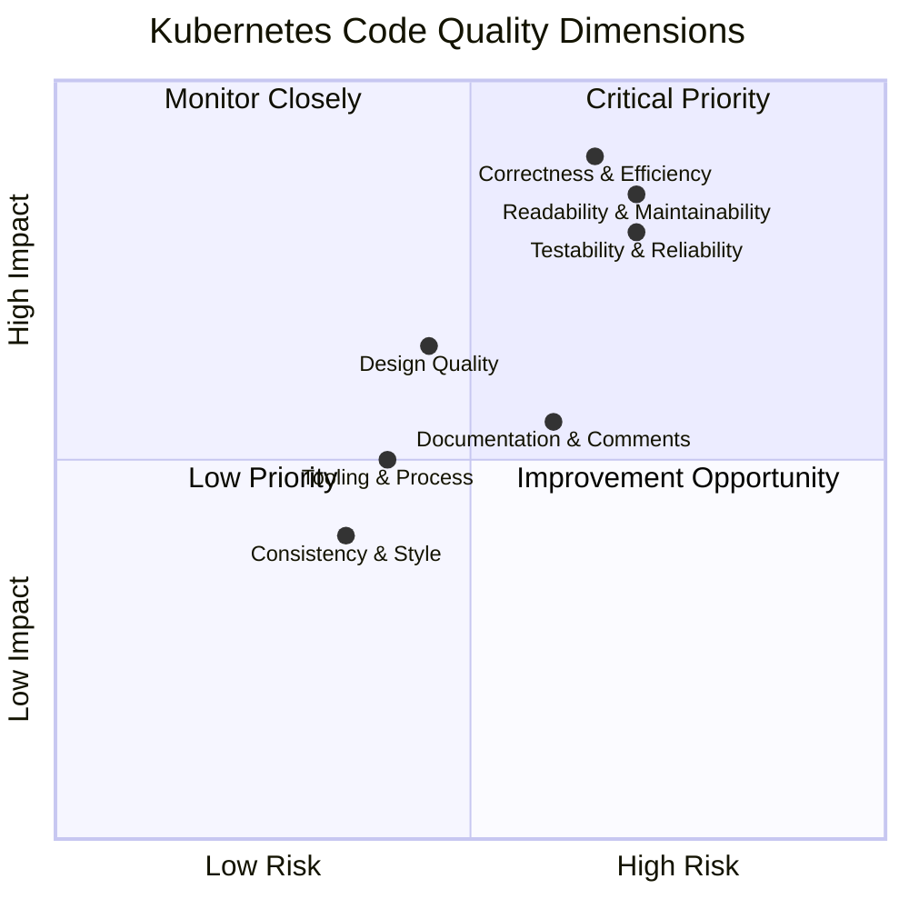

# Kubernetes Code Quality Audit — Overview

## Audit Metadata

| Field | Value |
|-------|-------|
| **Repository** | `k8s.io/kubernetes` (Kubernetes) |
| **Primary Language** | Go 1.25.0 (`godebug default=go1.25`) |
| **Total Go Files** (excl. `vendor/`, `third_party/`) | 12,272 |
| **Total Test Files** (`*_test.go`) | 2,847 |
| **Total Directories** (excl. `vendor/`, `third_party/`, `.git/`) | 4,533 |
| **Top-Level `pkg/` Packages** | 30 |
| **CLI Entrypoints (`cmd/`)** | 25 |
| **Staging Modules (`staging/src/k8s.io/`)** | 31 |
| **Admission Controller Plugins (`plugin/pkg/admission/`)** | 25 directories |
| **Verification Scripts (`hack/verify-*`)** | 54 |
| **Generated Files** (zz_generated: 885, pb.go: 193, swagger_doc: 60) | 1,138 total |
| **Audit Date** | 2026-03-10 |
| **Commit Context** | Main branch analysis |
| **Audit Scope** | Code quality — not security (see `audit-results/` for security audit) |

---

## Table of Contents

- [Analysis Scope](#analysis-scope)
- [Explicit Limitations](#explicit-limitations)
- [Codebase Quality Assessment](#codebase-quality-assessment)
- [Risk Rating Summary](#risk-rating-summary)
- [Quality Dimension Visualization](#quality-dimension-visualization)
- [Key Findings Summary](#key-findings-summary)
- [Document Index](#document-index)
- [Relationship to Existing Security Audit](#relationship-to-existing-security-audit)
- [Codebase Statistics Summary](#codebase-statistics-summary)

---

## Analysis Scope

### What Was Analyzed

This audit covers the entire non-vendor, non-generated Go source tree of the Kubernetes main repository. Specifically:

| Area | Scope | File Count |
|------|-------|------------|
| `pkg/` | 30 top-level packages including kubelet, controller, scheduler, registry, proxy, volume, apis | ~2,223 source + ~799 test Go files |
| `cmd/` | 25 CLI entrypoints (kube-apiserver, kube-controller-manager, kube-scheduler, kube-proxy, kubelet, kubeadm, kubectl, plus 18 utility/doc-generation commands) | 25 command directories |
| `plugin/pkg/admission/` | 25 admission controller plugin directories (admit, alwayspullimages, certificates, deny, eventratelimit, gc, limitranger, namespace, noderestriction, priority, resourcequota, security, serviceaccount, storage, and 11 more) | 25 plugin directories |
| `staging/src/k8s.io/` | 31 staging modules (client-go, apimachinery, apiserver, kubectl, kubelet, api, component-base, controller-manager, code-generator, and 22 more) — analyzed for cross-module consistency | 31 modules |
| `test/` | E2E tests (25 categories), conformance, integration, compatibility, node tests, fuzz tests — analyzed for testability assessment | 17 test sub-directories |
| `hack/` | 54 verification scripts, 10+ update scripts, library scripts, make-rules, golangci-lint configurations | ~350 config/script files |
| `build/` | Build scripts, dependency manifest (`dependencies.yaml`), Dockerfiles | Build infrastructure |

### Entry Points Examined

The audit analyzed the following critical entry points to trace architectural patterns through the codebase:

- **Controller constructors**: `NewDeploymentController`, `NewController` (job), `NewStatefulSetController`, `NewReplicaSetController`, `NewDaemonSetsController` — traced through `pkg/controller/*/`
- **Kubelet lifecycle**: `NewMainKubelet` constructor (704 lines), `Run`, `SyncPod` — traced through `pkg/kubelet/`
- **Scheduler core**: `schedule_one.go` scheduling cycle, `framework/` plugin interfaces — traced through `pkg/scheduler/`
- **API server setup**: `pkg/controlplane/instance.go`, REST storage registration via `pkg/registry/core/rest/storage_core.go` (`NewRESTStorage` at 410 lines)
- **Admission plugins**: `Validate`/`Admit` interface conformance across all 25 `plugin/pkg/admission/` directories
- **Proxy rule generation**: `syncProxyRules` implementations across iptables (806 lines), ipvs, and nftables backends in `pkg/proxy/`

### How Analysis Was Conducted

All analysis was performed through **static code inspection only** — no runtime execution, profiling, or benchmarking:

- **Pattern analysis** via `grep`, `find`, and targeted file inspection across Go source files
- **AST-level inspection** for function sizes, exported symbol inventories, and naming convention analysis
- **Configuration file parsing** of `hack/golangci.yaml`, `hack/golangci-hints.yaml`, `Makefile`, `build/dependencies.yaml`, and all `hack/verify-*` scripts
- **Test file mapping** correlating `*_test.go` files against production files per package for testability assessment
- **Cross-module comparison** of implementation patterns (error handling, logging, context propagation) across `pkg/` sub-packages

---

## Explicit Limitations

The following limitations apply to this audit. Consumers of this documentation should interpret findings within these boundaries:

1. **No runtime profiling or benchmarking performed.** All efficiency assessments in [04_CORRECTNESS_AND_EFFICIENCY.md](04_CORRECTNESS_AND_EFFICIENCY.md) are based on static code inspection. Actual performance characteristics may differ from static analysis conclusions.

2. **No security vulnerability scanning conducted.** Security assessment is covered by the existing `audit-results/` directory (OWASP compliance scorecard, SARIF reports, vulnerability assessments, SBOM). This code quality audit complements but does not duplicate that work. Security-relevant correctness risks identified during this audit are flagged but not treated as a security audit.

3. **Generated code noted but not quality-assessed.** Files matching `zz_generated.*.go` (885 files), `*.pb.go` (193 files), and `types_swagger_doc_generated.go` (60 files) are identified by `.gitattributes` as `linguist-generated`. These are excluded from quality metrics. Source: `.gitattributes:7-12`.

4. **`vendor/` and `third_party/` directories excluded.** All third-party code is out of scope for quality assessment.

5. **Staging modules analyzed for cross-module consistency only.** The 31 staging modules under `staging/src/k8s.io/` were examined for consistency with their corresponding `pkg/` interfaces and naming conventions, but deep internal auditing of each staging module was not performed.

6. **Analysis based on static inspection — dynamic behavior inferred where noted.** Where findings depend on runtime behavior (goroutine lifecycle, channel blocking, context cancellation propagation), the `INFERRED` flag is applied per the structured finding format.

7. **Test coverage assessed by file presence, not runtime coverage.** The test-to-production file ratios reported in [06_TESTABILITY_AND_RELIABILITY.md](06_TESTABILITY_AND_RELIABILITY.md) are based on `*_test.go` file counts, not instrumented runtime coverage data.

---

## Codebase Quality Assessment

The Kubernetes codebase is a large-scale Go monorepo that has evolved over a decade of multi-contributor, multi-SIG development. Its maturity is reflected in robust tooling infrastructure (54 verification scripts, tiered golangci-lint configurations, comprehensive Makefile targets), well-defined API patterns (REST storage strategies, admission controller interfaces, informer/lister conventions), and a substantial test corpus (~2,847 test files). However, the scale and longevity of the project have produced systemic quality challenges: accumulated naming inconsistencies across controller implementations, oversized functions in critical paths (kubelet constructor, proxy rule generation), uneven test coverage (from 17% in `pkg/apis` to 107% in `pkg/api`), and a God Object pattern in the kubelet struct (~110 fields, 169 methods).

The overall quality profile can be characterized as **strong macro-level engineering with accumulated micro-level debt**. The project demonstrates disciplined enforcement of formatting (gofmt), import ordering, boilerplate compliance, and API conventions through its `hack/verify-*` infrastructure. At the same time, cross-cutting concerns such as error handling, logging migration, context propagation, and documentation completeness show inconsistency across modules — a natural consequence of the project's scale and distributed ownership model.

### 1. Code Consistency & Style

**Risk Rating: Medium** — See [01_CONSISTENCY_AND_STYLE.md](01_CONSISTENCY_AND_STYLE.md)

The Kubernetes codebase exhibits strong macro-level consistency enforced by mature tooling. The `hack/golangci.yaml` configuration enables 13 linters (depguard, forbidigo, ginkgolinter, gocritic, govet, ineffassign, kubeapilinter, logcheck, revive, sorted, staticcheck, testifylint, unused) with a 30-minute timeout, and the stricter `hack/golangci-hints.yaml` provides additional checks for code patterns. Formatting enforcement via `hack/verify-gofmt.sh` ensures uniform code style across the repository.

However, systemic micro-level inconsistencies have accumulated over a decade of multi-contributor development. Controller type naming diverges between `{Resource}Controller` (dominant pattern used by Deployment, StatefulSet, ReplicaSet) and bare `Controller` (Job) or plural `DaemonSetsController` (DaemonSet). The same inconsistency propagates to constructor names (`NewDeploymentController` vs `NewController`). Import alias conventions, logging migration state (contextual logging enabled for kubelet and proxy but not for controllers), and cross-backend proxy constant naming (KUBE- prefix in iptables/ipvs vs lowercase in nftables) add further micro-level divergence. These inconsistencies are individually minor but collectively create friction for contributors navigating across modules.

### 2. Readability & Maintainability

**Risk Rating: High** — See [02_READABILITY_AND_MAINTAINABILITY.md](02_READABILITY_AND_MAINTAINABILITY.md)

The codebase contains several critically oversized functions that concentrate excessive logic into single code paths. The `NewMainKubelet` constructor spans approximately 704 lines, initializing every kubelet subsystem in a monolithic sequence. The `syncProxyRules` function in the iptables proxy backend reaches 806 lines of rule generation logic. The `convertToAPIContainerStatuses` function spans 419 lines, and `makeEnvironmentVariables` reaches 251 lines. These outliers violate single-responsibility principles and create high cognitive load for reviewers and maintainers.

The 30 top-level packages under `pkg/` exhibit highly variable sizes — from 1 source file in `pkg/windows/` to 440 source files in `pkg/kubelet/` — reflecting organic growth rather than deliberate architectural partitioning. Dead code signals are present: 62 `// Deprecated:` markers exist across `pkg/`, and the repository includes `hack/verify-deadcode-elimination.sh` confirming awareness of the issue. Separation of concerns is generally well-maintained at the package level but degrades within large packages, particularly kubelet, where the main struct accumulates responsibilities across pod management, volume management, container runtime, node status, eviction, probing, image management, and more.

### 3. Design Quality

**Risk Rating: Medium** — See [03_DESIGN_QUALITY.md](03_DESIGN_QUALITY.md)

Error handling follows the standard Go `if err != nil` pattern with high consistency. Across `pkg/`, 173 files use `fmt.Errorf` with `%w` for error wrapping, 132 files use `errors.Is` for sentinel checks, and 13 files use `errors.As` for typed error assertions. However, error handling strategy diverges across modules: some controllers silently swallow errors (logging without propagation), while others wrap and return consistently. The deployment controller alone contains 91 `if err != nil` blocks, demonstrating the density of error handling in controller code.

The most significant design concern is the God Object anti-pattern in the kubelet. The `Kubelet` struct (DESIGN-018) contains approximately 110 fields and 169 methods, making it the single highest-coupling point in the codebase. The `VolumePluginMgr` (DESIGN-020) with 22 repetitive lookup methods, and the core REST storage wiring function `NewRESTStorage` (DESIGN-019) at 410 lines, represent additional structural accumulation. The 68 design findings across abstraction quality, error handling, input validation, anti-patterns, and configuration analysis reflect a codebase with solid foundational patterns that has accumulated design debt in concentrated areas.

### 4. Correctness & Efficiency

**Risk Rating: High** — See [04_CORRECTNESS_AND_EFFICIENCY.md](04_CORRECTNESS_AND_EFFICIENCY.md)

Concurrency patterns present the highest correctness risk surface. The codebase spawns goroutines via `go func` in 53 production files under `pkg/`, with 72 files using `context.TODO()` (indicating incomplete context propagation) and 39 files using `context.Background()`. The controller boilerplate exhibits significant redundancy: tombstone extraction logic (CORR-001), `resolveControllerRef` implementations (CORR-002), `Run()` method structures (CORR-003), ResourceVersion equality checks (CORR-004), and enqueue helpers (CORR-005) are duplicated across multiple controllers with minor variations rather than being extracted into shared utilities.

Correctness risks include fragile logic paths in the scheduler (scheduling decisions based on cached state with documented staleness assumptions), proxy rule generation (iptables rule ordering dependencies without formal invariant enforcement), and kubelet pod lifecycle management (complex state machine transitions spread across multiple files). The 34 correctness findings represent areas where undocumented assumptions, concurrent access patterns, or duplicated logic create potential for subtle defects.

### 5. Documentation & Comments

**Risk Rating: High** — See [05_DOCUMENTATION_AUDIT.md](05_DOCUMENTATION_AUDIT.md)

Public API documentation coverage is uneven across the repository. The `pkg/kubelet/` main package (440 source files) lacks a package-level documentation comment (DOC-001), as does `pkg/scheduler/` (DOC-002). Of the ~44 sub-packages under `pkg/kubelet/`, only 25 have `doc.go` files (DOC-003); 20+ critical subsystems including container runtime, node shutdown, plugin management, probing, and status reporting lack package-level documentation. Similarly, 15 controller sub-packages including deployment, garbagecollector, nodelifecycle, and statefulset lack `doc.go` files (DOC-004).

While the repository contains 298 `doc.go` files across `pkg/` overall, the distribution is uneven. The golangci-lint configuration (Source: `hack/golangci.yaml:62-69`) **exempts all packages except `cmd/kubeadm`** from the "exported symbols must be documented" rule — meaning the vast majority of exported types and functions across `pkg/` are not required to carry documentation comments by the linting infrastructure. This represents a systemic gap in documentation enforcement. The 35 documentation findings span package-level gaps, outdated comments, and missing documentation for complex algorithmic logic.

### 6. Testability & Reliability

**Risk Rating: High** — See [06_TESTABILITY_AND_RELIABILITY.md](06_TESTABILITY_AND_RELIABILITY.md)

Test file ratios vary dramatically across packages, revealing uneven testability investment:

| Package | Source Files | Test Files | Test Ratio |
|---------|-------------|------------|------------|
| `pkg/api` | 26 | 28 | 107% |
| `pkg/scheduler` | 127 | 82 | 64% |
| `pkg/volume` | 124 | 71 | 57% |
| `pkg/kubelet` | 440 | 235 | 53% |
| `pkg/registry` | 279 | 145 | 51% |
| `pkg/proxy` | 78 | 37 | 47% |
| `pkg/controller` | 420 | 120 | **28%** |
| `pkg/apis` | 539 | 93 | **17%** |

The `pkg/controller/` test ratio of 28% (TEST-001) is critically low for a package managing 30+ controller reconciliation loops. The garbage collector controller has the lowest individual ratio at approximately 15% (20 production / 3 test files, TEST-002). The kubelet's massive dependency surface (~110 struct fields) impedes unit testability (TEST-003), requiring extensive mock infrastructure for even simple tests. Package-level mutable variables in kubelet complicate test isolation (TEST-005). The 32 testability findings catalog coupling clusters, hidden side effects, and non-deterministic behavior patterns.

### 7. Tooling & Process

**Risk Rating: Medium** — See [07_TOOLING_AND_PROCESS.md](07_TOOLING_AND_PROCESS.md)

The repository demonstrates mature quality tooling infrastructure. The 54 `hack/verify-*` scripts enforce formatting (gofmt), linting (golangci-lint), boilerplate compliance, codegen freshness, import conventions, dead code elimination, feature gate hygiene, vendor consistency, and more. The Makefile provides comprehensive targets including `all`, `verify`, `test`, `test-integration`, `lint`, `release`, and `update`. The tiered golangci-lint configuration (`golangci.yaml` for mandatory checks, `golangci-hints.yaml` for advisory checks, both generated from `golangci.yaml.in`) represents a thoughtful approach to incremental quality improvement.

However, notable gaps exist in the tooling landscape. No pre-commit hook framework is detected (TOOL-001) — quality gates are enforced only at CI time, not locally. No GitHub Actions workflow files exist in `.github/` (TOOL-002), with CI managed externally (likely via Prow). No in-repository code coverage reporting configuration is detected (TOOL-003). No automated dependency update tooling (Dependabot or Renovate) configuration exists (TOOL-004). The dependency management relies on `build/dependencies.yaml` with zeitgeist (v0.5.4) for external dependency version verification. These are assessed as INFERRED absences — the tooling may exist in external infrastructure not visible from the repository alone.

---

## Risk Rating Summary

| Dimension | Risk Rating | Key Concern | Document Reference |
|-----------|-------------|-------------|-------------------|
| Code Consistency & Style | **Medium** | Controller naming divergence, logging migration incomplete, cross-backend constant naming | [01_CONSISTENCY_AND_STYLE.md](01_CONSISTENCY_AND_STYLE.md) |
| Readability & Maintainability | **High** | Monolithic functions (kubelet 704 lines, proxy 806 lines), extreme package size variance | [02_READABILITY_AND_MAINTAINABILITY.md](02_READABILITY_AND_MAINTAINABILITY.md) |
| Design Quality | **Medium** | Kubelet God Object (110 fields), 25 anti-pattern instances, error handling inconsistency | [03_DESIGN_QUALITY.md](03_DESIGN_QUALITY.md) |
| Correctness & Efficiency | **High** | Controller boilerplate duplication, context.TODO() proliferation (72 files), goroutine lifecycle risks | [04_CORRECTNESS_AND_EFFICIENCY.md](04_CORRECTNESS_AND_EFFICIENCY.md) |
| Documentation & Comments | **High** | Exported doc enforcement disabled for all but kubeadm, kubelet/scheduler missing package docs | [05_DOCUMENTATION_AUDIT.md](05_DOCUMENTATION_AUDIT.md) |
| Testability & Reliability | **High** | Controller test ratio 28%, APIs test ratio 17%, kubelet God Object impedes testability | [06_TESTABILITY_AND_RELIABILITY.md](06_TESTABILITY_AND_RELIABILITY.md) |
| Tooling & Process | **Medium** | No pre-commit hooks, no in-repo CI workflows, no coverage reporting; strong verify-script infrastructure | [07_TOOLING_AND_PROCESS.md](07_TOOLING_AND_PROCESS.md) |

**Summary:** 4 of 7 dimensions rated **High** risk. 3 of 7 dimensions rated **Medium** risk. No dimensions rated **Critical** or **Low**. The High-risk dimensions (Maintainability, Correctness, Documentation, Testability) represent the most immediate improvement opportunities, while the Medium-risk dimensions (Consistency, Design, Tooling) reflect mature but incomplete quality infrastructure.

---

## Quality Dimension Visualization

**Interpretation:**

- **Critical Priority (High Risk, High Impact):** Readability & Maintainability, Correctness & Efficiency, and Testability & Reliability fall in this quadrant. These dimensions have the highest combination of risk and potential impact on the project's operational quality.
- **Monitor Closely (Low Risk, High Impact):** Design Quality approaches this boundary — foundational patterns are strong but concentrated debt in the kubelet struct requires monitoring.
- **Improvement Opportunity (High Risk, Low Impact):** Documentation & Comments carries high risk but relatively lower operational impact compared to correctness and testability.
- **Low Priority (Low Risk, Low Impact):** Consistency & Style and Tooling & Process fall in this area — both benefit from existing infrastructure and pose lower immediate risk.

---

## Key Findings Summary

### Code Consistency & Style (16 findings)

- **CONS-001:** Controller type naming is inconsistent across `pkg/controller/` — Job uses bare `Controller`, DaemonSet uses plural `DaemonSetsController`, diverging from the `{Resource}Controller` convention. Source: `pkg/controller/job/job_controller.go:84`, `pkg/controller/daemon/daemon_controller.go:87`. [CONFIRMED]
- **CONS-002:** Controller constructor naming follows the same inconsistency — `NewController` (Job) vs `NewDeploymentController` (Deployment). Source: `pkg/controller/job/job_controller.go:172`. [CONFIRMED]
- **CONS-005:** Inconsistent `doc.go` presence across controller sub-packages — some have package documentation files while 15 sub-packages lack them entirely. [CONFIRMED]
- **CONS-007:** Proxy backend constant naming conventions diverge between iptables/ipvs (KUBE- prefix) and nftables (lowercase, no prefix). [CONFIRMED]
- **CONS-003:** Controller receiver variable `jm` uses legacy "manager" mnemonic inconsistent with the `{prefix}c` convention used by other controllers. [CONFIRMED]

### Readability & Maintainability (45 findings)

- **MAINT-001:** `NewMainKubelet` is a ~704-line monolithic constructor that initializes every kubelet subsystem in sequence. Source: `pkg/kubelet/kubelet.go`. [CONFIRMED]
- **MAINT-002:** `syncProxyRules` is an 806-line iptables rule generation function concentrating all proxy rule logic in a single method. Source: `pkg/proxy/iptables/`. [CONFIRMED]
- **MAINT-003:** `convertToAPIContainerStatuses` is a 419-line status conversion function in the kubelet. [CONFIRMED]
- **MAINT-006:** `makeEnvironmentVariables` is a 251-line environment variable construction function. [CONFIRMED]
- **MAINT-008:** `getPhase` is a 224-line pod phase determination function. [CONFIRMED]

### Design Quality (68 findings)

- **DESIGN-018:** The `Kubelet` struct is a God Object with ~110 fields and 169 methods — the single highest-coupling point in the codebase. Source: `pkg/kubelet/kubelet.go:1132-1520`. [CONFIRMED]
- **DESIGN-019:** Core REST storage wiring is a single-function God orchestrator (`NewRESTStorage`) at 410 lines. Source: `pkg/registry/core/rest/storage_core.go:154-565`. [CONFIRMED]
- **DESIGN-001:** Inconsistent `HandleCrash` variant across controllers — StatefulSet uses `HandleCrashWithContext(ctx)` while others use `HandleCrash()`. [CONFIRMED]
- **DESIGN-022:** Deep nesting (5 levels) in deployment `deletePod` method. Source: `pkg/controller/deployment/deployment_controller.go:362-403`. [CONFIRMED]
- **DESIGN-020:** `VolumePluginMgr` with 22 repetitive lookup methods as central volume registry. Source: `pkg/volume/plugins.go:425+`. [CONFIRMED]

### Correctness & Efficiency (34 findings)

- **CORR-001:** Duplicated tombstone extraction boilerplate across all controllers — identical type assertion and error handling logic repeated in every controller's event handler. [CONFIRMED]
- **CORR-002:** Identical `resolveControllerRef` implementation duplicated across controllers rather than extracted to shared utility. [CONFIRMED]
- **CORR-003:** Near-identical `Run()` method structure across all controllers — informer sync, worker goroutine launch, shutdown pattern repeated per controller. [CONFIRMED]
- **CORR-004:** Duplicated `ResourceVersion` equality check in update handlers across controllers. [CONFIRMED]
- **CORR-005:** Identical enqueue helper functions duplicated per controller. [CONFIRMED]

### Documentation & Comments (35 findings)

- **DOC-001:** Missing package-level doc comment for kubelet — the largest component (440 source files) lacks a package-level `// Package kubelet ...` comment. Source: `pkg/kubelet/kubelet.go:17`. [CONFIRMED]
- **DOC-002:** Missing package-level doc comment for scheduler. Source: `pkg/scheduler/scheduler.go:17`. [CONFIRMED]
- **DOC-003:** 20+ kubelet sub-packages missing `doc.go` files — container, metrics, nodeshutdown, pluginmanager, pod, prober, status, and 13+ more. [CONFIRMED]
- **DOC-004:** 15 controller sub-packages missing `doc.go` files — deployment, disruption, garbagecollector, nodelifecycle, statefulset, and 10 more. [CONFIRMED]
- **DOC-005:** 7 scheduler sub-packages missing `doc.go` — including critical `framework/` and `backend/` packages. [CONFIRMED]

### Testability & Reliability (32 findings)

- **TEST-001:** Controller package has critically low test file ratio at 28% — 420 source files vs. 120 test files. [CONFIRMED]
- **TEST-002:** Garbage collector has lowest test ratio among core controllers (~15% — 20 production / 3 test files). [CONFIRMED]
- **TEST-003:** Kubelet core struct has 389 lines with massive dependency surface (~110 fields) impeding unit testability. [CONFIRMED]
- **TEST-004:** Kubelet eviction sub-package has low test ratio (27%) for safety-critical eviction logic. [CONFIRMED]
- **TEST-005:** Kubelet uses mutable package-level variables that complicate test isolation. [CONFIRMED]

### Tooling & Process (16 findings)

- **TOOL-001:** No pre-commit hook framework detected — quality gates enforced only at CI time, not locally. [INFERRED — absence of `.pre-commit-config.yaml`, `.githooks/`, or `husky` configuration]
- **TOOL-002:** No GitHub Actions workflow files present — CI managed externally (likely Prow). [INFERRED — `.github/` contains only issue/PR templates]
- **TOOL-003:** No in-repository code coverage reporting configuration detected. [INFERRED]
- **TOOL-004:** No automated dependency update tooling (Dependabot/Renovate) configuration detected. [INFERRED]
- **TOOL-005:** No cyclomatic or cognitive complexity measurement tooling configured. [INFERRED]

---

## Document Index

| # | Document | Description | Risk Rating |
|---|----------|-------------|-------------|
| 00 | **Overview** (this document) | Executive summary, risk ratings, key findings, navigation hub | — |
| 01 | [Consistency & Style](01_CONSISTENCY_AND_STYLE.md) | Naming conventions, formatting patterns, architectural consistency, cross-module divergence (16 findings) | **Medium** |
| 02 | [Readability & Maintainability](02_READABILITY_AND_MAINTAINABILITY.md) | Function size outliers, dead code, duplication, separation of concerns (45 findings) | **High** |
| 03 | [Design Quality](03_DESIGN_QUALITY.md) | Error handling patterns, anti-pattern catalog, abstraction quality, hardcoded values (68 findings) | **Medium** |
| 04 | [Correctness & Efficiency](04_CORRECTNESS_AND_EFFICIENCY.md) | Concurrency risks, correctness assumptions, redundant logic, fragile paths (34 findings) | **High** |
| 05 | [Documentation Audit](05_DOCUMENTATION_AUDIT.md) | Comment quality, public API doc gaps, outdated comments, doc infrastructure (35 findings) | **High** |
| 06 | [Testability & Reliability](06_TESTABILITY_AND_RELIABILITY.md) | Test coverage map, coupling inventory, hidden side effects, non-determinism (32 findings) | **High** |
| 07 | [Tooling & Process](07_TOOLING_AND_PROCESS.md) | Linter config, verify scripts, CI/CD pipeline, dependency management (16 findings) | **Medium** |
| 08 | [Improvement Roadmap](08_IMPROVEMENT_ROADMAP.md) | Prioritized P0–P3 recommendations cross-referencing all findings | — |
| 09 | [Quality Risk Assessment](09_QUALITY_RISK_ASSESSMENT.md) | Risk register, change risk map, architectural risks, maintainability forecast | — |

**Total Findings Across All Documents:** 246 unique cataloged findings

---

## Relationship to Existing Security Audit

The `audit-results/` directory contains a complementary security-focused audit deliverable set that was produced separately from this code quality audit. The security audit includes:

- **OWASP Top 10 2021 Compliance Scorecard** (`audit-results/owasp-compliance.md`) — Overall compliance score of 65% (6.5/10 categories), identifying 20 findings across 2 Critical, 5 High, and 13 Medium severity levels. Key findings include path traversal vulnerabilities in kubelet (CWE-22), SHA1 usage in apiserver token cache (CWE-326/327), and a critical CVE-2024-24790 in `golang.org/x/net` dependency.
- **Remediation Roadmap** (`audit-results/remediation-roadmap.md`) — Prioritized remediation plan for 21 vulnerabilities (1 Critical, 3 High, 14 Medium, 3 Low) organized by component (Dependency/Supply Chain, API Server, Kubelet, Client Libraries, Controllers, Authentication, Build/Scripts).
- **SARIF Reports** (`audit-results/sarif/`) — Machine-readable security scan results from gosec, semgrep, and Trivy.
- **Dependency Analysis** (`audit-results/dependencies/`) — License compliance, SBOM, and vulnerable dependency reports.

**Scope Boundary:** This code quality audit complements but does not duplicate the security audit. Where correctness risks identified in this audit have security implications (e.g., CORR findings involving goroutine lifecycle or context misuse that could lead to resource leaks), they are documented from a code quality perspective and cross-referenced to the improvement roadmap. Dedicated security vulnerability scanning and CVSS scoring remain in the `audit-results/` scope.

---

## Codebase Statistics Summary

### Repository-Wide Metrics

| Metric | Count |
|--------|-------|
| Total Go source files (excl. vendor/third_party) | 12,272 |
| Total test files (`*_test.go`) | 2,847 |
| Non-test Go source files | 9,425 |
| Total directories (excl. vendor/third_party/.git) | 4,533 |
| Generated files (zz_generated + pb.go + swagger_doc) | 1,138 |
| Markdown files across repository | ~309 |
| Shell scripts | ~291 |
| YAML files | ~5,608 |
| `doc.go` files in `pkg/` | 298 |
| `// Deprecated:` markers in `pkg/` | 62 |
| Files with `Convert_`/`SetDefaults_` naming patterns | 292 |
| Files spawning goroutines (`go func`) in `pkg/` | 53 |
| Files using `context.TODO()` in `pkg/` | 72 |
| Files using `context.Background()` in `pkg/` | 39 |
| Files using error wrapping (`fmt.Errorf %w`) in `pkg/` | 173 |
| Files using `errors.Is` in `pkg/` | 132 |
| Files using `errors.As` in `pkg/` | 13 |

### Per-Package Go File Distribution (`pkg/`)

| Package | Source Files | Test Files | Test Ratio | Assessment Priority |
|---------|-------------|------------|------------|-------------------|
| `pkg/apis` | 539 | 93 | 17% | High — API type definitions, low test coverage |
| `pkg/kubelet` | 440 | 235 | 53% | Critical — largest component, God Object risk |
| `pkg/controller` | 420 | 120 | 28% | Critical — 30+ controllers, low test ratio |
| `pkg/registry` | 279 | 145 | 51% | High — API storage layer |
| `pkg/scheduler` | 127 | 82 | 64% | High — core scheduling logic |
| `pkg/volume` | 124 | 71 | 57% | Medium — plugin architecture |
| `pkg/proxy` | 78 | 37 | 47% | High — network proxy, monolithic functions |
| `pkg/util` | 51 | 24 | 47% | Medium — shared utilities |
| `pkg/controlplane` | 40 | 21 | 52% | Medium — control plane setup |
| `pkg/api` | 26 | 28 | 107% | Low — well-covered |
| `pkg/kubeapiserver` | 15 | 5 | 33% | Medium — API server config |
| `pkg/probe` | 10 | 6 | 60% | Low — probe utilities |
| `pkg/credentialprovider` | 9 | 8 | 88% | Low — well-covered |
| `pkg/serviceaccount` | 9 | 7 | 77% | Low — service account handling |
| `pkg/quota` | 8 | 5 | 62% | Low — quota management |
| `pkg/securitycontext` | 7 | 2 | 28% | Low — small package |
| `pkg/printers` | 5 | 3 | 60% | Low — output formatting |
| `pkg/routes` | 5 | 1 | 20% | Low — small package |
| `pkg/generated` | 4 | 1 | 25% | Low — generated code |
| `pkg/security` | 4 | 2 | 50% | Low — security utilities |
| `pkg/auth` | 3 | 2 | 66% | Low — auth helpers |
| `pkg/kubectl` | 3 | 2 | 66% | Low — kubectl utilities |
| `pkg/client` | 2 | 6 | 300% | Low — client helpers, test-heavy |
| `pkg/capabilities` | 2 | 1 | 50% | Low — capabilities |
| `pkg/cluster` | 2 | 0 | 0% | Low — minimal package |
| `pkg/features` | 2 | 2 | 100% | Low — feature gates |
| `pkg/fieldpath` | 2 | 1 | 50% | Low — field path utilities |
| `pkg/kubemark` | 2 | 0 | 0% | Low — kubemark simulation |
| `pkg/certauthorization` | 1 | 0 | 0% | Low — single file |
| `pkg/windows` | 1 | 0 | 0% | Low — Windows-specific |

### Key Infrastructure Counts

| Infrastructure Component | Count |
|-------------------------|-------|
| CLI entrypoints (`cmd/`) | 25 (10 production binaries + 6 doc generators + 9 utility tools) |
| Staging modules (`staging/src/k8s.io/`) | 31 |
| Admission controller plugins | 25 directories |
| Verification scripts (`hack/verify-*`) | 54 |
| Update/generation scripts (`hack/update-*`) | ~10 |
| golangci-lint enabled linters | 13 (depguard, forbidigo, ginkgolinter, gocritic, govet, ineffassign, kubeapilinter, logcheck, revive, sorted, staticcheck, testifylint, unused) |
| Makefile targets | 18 (all, ginkgo, verify, quick-verify, update, test, test-integration, test-e2e-node, test-cmd, clean, lint, release, release-images, release-skip-tests, quick-release-images, package, cross, help) |
| E2E test categories (`test/e2e/`) | 25 |
| External dependencies in `build/dependencies.yaml` | 12+ pinned versions (zeitgeist, CNI, CoreDNS, crictl, protoc, etcd, golang, node-problem-detector) |

---

*This document serves as the entry point and navigational hub for the Kubernetes Code Quality Audit documentation set. For detailed findings, evidence, and recommendations, follow the links to the individual audit documents listed in the [Document Index](#document-index) above. For prioritized improvement actions, see [08_IMPROVEMENT_ROADMAP.md](08_IMPROVEMENT_ROADMAP.md). For risk projections, see [09_QUALITY_RISK_ASSESSMENT.md](09_QUALITY_RISK_ASSESSMENT.md).*
