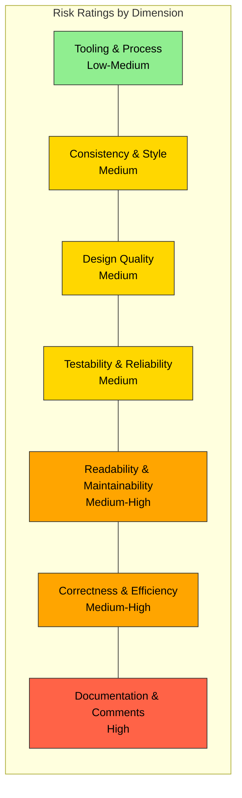
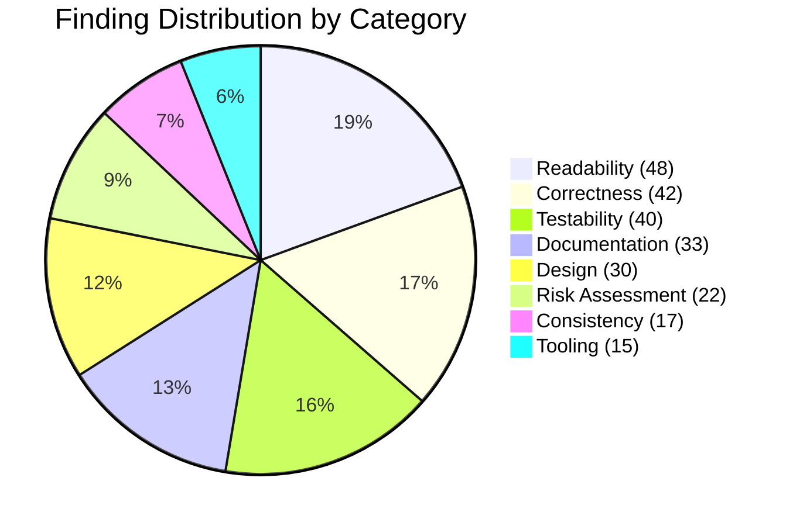
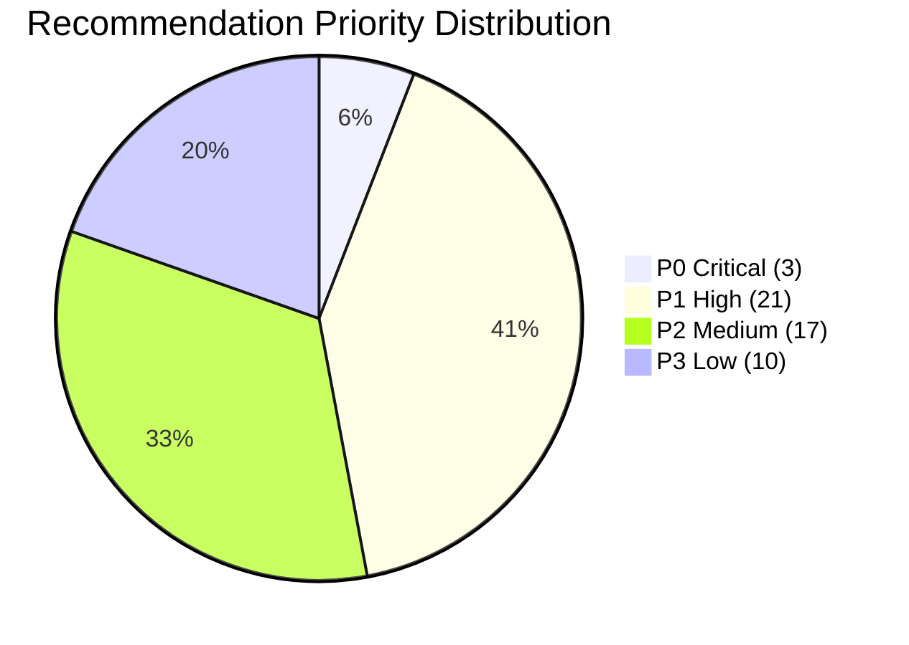

# Kubernetes Code Quality Audit — Executive Overview

> **Document ID:** 00_OVERVIEW  
> **Document Type:** Executive Assessment / Master Index  
> **Audience:** SIG leads, maintainers, new contributors, engineering leadership  
> **Generated From:** Direct static inspection of the Kubernetes (`k8s.io/kubernetes`) codebase  
> **Inference Convention:** Every finding carries an **Inference Flag** — `CONFIRMED` (directly observed in source) or `INFERRED` (concluded from absence or pattern analysis)

---

## Table of Contents — This Document

- [1. Scope and Methodology](#1-scope-and-methodology)
  - [1.1 Analysis Scope](#11-analysis-scope)
  - [1.2 Codebase Statistics](#12-codebase-statistics)
  - [1.3 Analytical Dimensions](#13-analytical-dimensions)
  - [1.4 Methodology](#14-methodology)
  - [1.5 Finding Format](#15-finding-format)
  - [1.6 Scope Boundaries](#16-scope-boundaries)
- [2. Entry Points and Subsystems Analyzed](#2-entry-points-and-subsystems-analyzed)
  - [2.1 Binary Entry Points](#21-binary-entry-points)
  - [2.2 Major Subsystems](#22-major-subsystems)
- [3. Explicit Limitations](#3-explicit-limitations)
- [4. Per-Dimension Risk Rating](#4-per-dimension-risk-rating)
  - [4.1 Risk Rating Table](#41-risk-rating-table)
  - [4.2 Risk Distribution Visualization](#42-risk-distribution-visualization)
- [5. Audit Document Index](#5-audit-document-index)
- [6. Major Findings Highlights](#6-major-findings-highlights)
  - [6.1 Consistency and Style Highlights](#61-consistency-and-style-highlights)
  - [6.2 Readability and Maintainability Highlights](#62-readability-and-maintainability-highlights)
  - [6.3 Design Quality Highlights](#63-design-quality-highlights)
  - [6.4 Correctness and Efficiency Highlights](#64-correctness-and-efficiency-highlights)
  - [6.5 Documentation and Comments Highlights](#65-documentation-and-comments-highlights)
  - [6.6 Testability and Reliability Highlights](#66-testability-and-reliability-highlights)
  - [6.7 Tooling and Process Highlights](#67-tooling-and-process-highlights)
- [7. Finding Summary Statistics](#7-finding-summary-statistics)
  - [7.1 Finding Distribution by Category](#71-finding-distribution-by-category)
  - [7.2 Recommendation Distribution by Priority](#72-recommendation-distribution-by-priority)
- [8. Finding ID Namespace](#8-finding-id-namespace)
  - [8.1 Prefix Registry](#81-prefix-registry)
  - [8.2 Per-Finding Mandated Format](#82-per-finding-mandated-format)
- [9. Cross-Document Navigation](#9-cross-document-navigation)

---

## 1. Scope and Methodology

### 1.1 Analysis Scope

This audit covers the **Kubernetes** codebase at module path `k8s.io/kubernetes`, analyzed at the current HEAD of the repository.

- **Go module version:** 1.25.0 (`go.mod` directive)  
  `Source: go.mod:9`
- **Go build toolchain:** 1.25.4 (kube-cross build image)  
  `Source: build/dependencies.yaml` [CONFIRMED]
- **Module structure:** Main module with 31 `replace` directives pointing to staging modules under `staging/src/k8s.io/`  
  `Source: go.mod:87-120` [CONFIRMED]

The audit encompasses all source code across the following in-scope directories:

| Directory | Content | Audit Role |
|-----------|---------|------------|
| `pkg/` | Core libraries and subsystems | Primary audit target |
| `cmd/` | CLI entry points and generators | Entry point analysis |
| `plugin/` | Admission and auth plugins | Plugin pattern consistency |
| `staging/src/k8s.io/` | Published library modules (31) | Cross-module coupling analysis |
| `test/` | Test infrastructure | Testability assessment only |
| `hack/` | Build/verify shell scripts | Tooling and process assessment |
| `build/` | Build orchestration | CI/CD documentation |
| `api/` | OpenAPI specs and API rules | API documentation audit |

### 1.2 Codebase Statistics

| Metric | Count | Notes |
|--------|-------|-------|
| Non-test, non-generated Go source files | 8,588 | Primary audit corpus |
| Test files (`*_test.go`) | 2,852 | Assessed for testability, not code quality |
| Generated files (`zz_generated*`) | 885 | Noted but excluded from quality audit |
| Go packages (directories with `.go` files) | 2,967 | Each assessed for naming, structure, documentation |
| Package-level documentation (`doc.go`) | 933 | Key data source for documentation audit |
| OWNERS metadata files | 533 | Key data source for risk assessment |
| Shell scripts (`.sh`) | 294 | Assessed for tooling and process |
| Controller subdirectories (`pkg/controller/`) | 36 | Pattern consistency analysis |
| Kubelet subsystem subdirectories (`pkg/kubelet/`) | 44 | Complexity and testability analysis |
| Admission plugin subdirectories (`plugin/pkg/admission/`) | 25 | Plugin pattern consistency |
| API group packages (`pkg/apis/`) | 26 | Validation coverage analysis |
| Published staging modules (`staging/src/k8s.io/`) | 31 | Coupling and interface analysis |
| Proxy subdirectories (`pkg/proxy/`) | 13 | Cross-mode consistency analysis |
| Registry packages (`pkg/registry/`) | 23 | API storage pattern analysis |

`Source: Repository structure analysis` [CONFIRMED]

### 1.3 Analytical Dimensions

This audit evaluates the Kubernetes codebase across **seven** analytical dimensions, each producing a dedicated assessment document:

1. **Consistency and Style** — Naming conventions, formatting, cross-module convention adherence
2. **Readability and Maintainability** — Function/type sizes, separation of concerns, duplication, dead code
3. **Design Quality** — Abstraction quality, error handling patterns, input validation, anti-patterns
4. **Correctness and Efficiency** — Redundant logic, language feature misuse, correctness risks, fragile logic
5. **Documentation and Comments** — Comment quality, outdated comments, undocumented API surface, doc gaps
6. **Testability and Reliability** — Coupling, test coverage mapping, side effects, non-determinism
7. **Tooling and Process** — Linting, CI/CD pipeline, dependency management, missing tooling

Two additional synthesis documents aggregate findings into actionable outputs:

- **Improvement Roadmap** (Document 08) — Prioritized P0–P3 recommendations cross-referencing findings
- **Quality Risk Assessment** (Document 09) — Risk register, change risk map, maintainability forecast

### 1.4 Methodology

**Analysis approach:**

- **Static code inspection only.** No runtime profiling, benchmarking, or dynamic analysis was performed. [CONFIRMED]
- **Direct source citations.** Every finding references specific file paths and line numbers or ranges using the format: `Source: /path/to/file.go:LineNumber` or `Source: /path/to/file.go:LineStart-LineEnd`.
- **Evidence-grounded.** All findings are based on direct observation of the code as provided. Where conclusions are drawn from absence or pattern extrapolation, these are explicitly flagged as `INFERRED`.
- **Exhaustiveness prioritized over brevity.** Per the audit charter, individual instances are cataloged rather than aggregate-only descriptions.
- **Recurrence focus for consistency.** Consistency findings emphasize recurrent or cross-cutting patterns over isolated deviations.

**Tool and configuration references used during analysis:**

| Tool / Config | Location | Version | Purpose |
|---------------|----------|---------|---------|
| golangci-lint | `hack/golangci.yaml` | v2 (config format) | Primary linting configuration reference |
| staticcheck | `hack/tools/go.mod` | 0.6.1 | Static analysis rules reference |
| misspell | `hack/tools/go.mod` | 0.6.0 | Spelling enforcement reference |
| mockery | `hack/tools/go.mod` | 3.5.4 | Mock generation patterns reference |
| gotestsum | `hack/tools/go.mod` | 1.12.0 | Test infrastructure reference |
| zeitgeist | `build/dependencies.yaml` | 0.5.4 | Dependency version verification reference |

`Source: hack/golangci.yaml:24, hack/tools/go.mod:1-60, build/dependencies.yaml:13-14` [CONFIRMED]

### 1.5 Finding Format

Every cataloged finding across the audit document set follows the mandated structure:

| Field | Description |
|-------|-------------|
| **Finding ID** | Unique identifier with category prefix (e.g., `CONS-014`, `DESIGN-007`, `TEST-023`) |
| **Category** | Consistency / Readability / Design / Correctness / Documentation / Testability / Tooling |
| **Title** | Short, precise description of the finding |
| **Source Location** | File path and line number or range |
| **Description** | What was observed, with direct code reference |
| **Evidence** | Quote or paraphrase of relevant code construct |
| **Impact** | What goes wrong if not addressed; who is affected |
| **Inference Flag** | `CONFIRMED` (directly observed) or `INFERRED` (concluded from absence or pattern) |
| **Recommendation Ref** | Cross-reference to `08_IMPROVEMENT_ROADMAP.md` recommendation |

### 1.6 Scope Boundaries

**In scope:**

- All non-generated, non-vendor Go source files across `pkg/`, `cmd/`, `plugin/`, `staging/src/k8s.io/`
- All configuration files: `hack/golangci.yaml`, `hack/.import-aliases`, `hack/verify-*.sh`, `Makefile`, `build/dependencies.yaml`
- Test files (`*_test.go`) — for testability assessment only, not code quality auditing of test code itself
- All 933 `doc.go` package-level documentation files
- All 533 `OWNERS` metadata files (for risk assessment ownership mapping)
- Shell scripts in `hack/` (294 scripts) — for tooling and process assessment
- Inline comments and GoDoc across all in-scope source files

**Out of scope:**

- `vendor/` directory — vendored third-party code excluded
- `third_party/` directory — forked external code excluded
- Generated files (`zz_generated*`, 885 files) — noted in findings but not quality-audited
- Runtime performance profiling or benchmarking
- Security vulnerability scanning (correctness risks with security implications may be flagged, but this is not a security audit)
- Infrastructure-as-code files (cluster provisioning, cloud provider configs in `cluster/`)
- Binary artifacts and compiled outputs
- Container image build contents (`build/pause/`, `test/images/`)
- External documentation at kubernetes.io (hosted in a separate repository)
- Per-release CHANGELOG files (`CHANGELOG/CHANGELOG-1.*.md`)

---

## 2. Entry Points and Subsystems Analyzed

### 2.1 Binary Entry Points

Nine Kubernetes binary entry points were analyzed. Each follows the Cobra CLI framework pattern (`github.com/spf13/cobra` v1.10.0) with a `main()` → `app.NewXCommand()` → `cli.Run()` invocation chain. [CONFIRMED]

| Entry Point | Directory | Description | Key Pattern |
|-------------|-----------|-------------|-------------|
| **kube-apiserver** | `cmd/kube-apiserver/` | Kubernetes API server — serves the cluster management REST API | `app.NewAPIServerCommand()` via `cli.Run()` |
| **kube-controller-manager** | `cmd/kube-controller-manager/` | Controller manager orchestrating 36 controllers via informer-driven reconciliation | `app.NewControllerManagerCommand()` |
| **kube-scheduler** | `cmd/kube-scheduler/` | Pod scheduling framework with plugin-based extensibility | `app.NewSchedulerCommand()` |
| **kubelet** | `cmd/kubelet/` | Node agent with 44 subsystems managing pod lifecycle | `app.NewKubeletCommand()` |
| **kube-proxy** | `cmd/kube-proxy/` | Network proxy with 4 modes: iptables, ipvs, nftables, winkernel | `app.NewProxyCommand()` |
| **kubectl** | `cmd/kubectl/` | CLI client for cluster interaction | `cmd.NewDefaultKubectlCommand()` |
| **kubeadm** | `cmd/kubeadm/` | Cluster bootstrap tool with phase-based initialization | `app.NewKubeadmCommand()` |
| **cloud-controller-manager** | `cmd/cloud-controller-manager/` | Cloud provider integration point | `app.NewCloudControllerManagerCommand()` |
| **kubemark** | `cmd/kubemark/` | Hollow node simulator for scalability testing | `app.NewKubemarkCommand()` |

**Evidence — kube-apiserver entry point pattern:**

```go
// Source: cmd/kube-apiserver/apiserver.go:32-36
func main() {
	command := app.NewAPIServerCommand()
	code := cli.Run(command)
	os.Exit(code)
}
```

`Source: cmd/kube-apiserver/apiserver.go:32-36` [CONFIRMED]

### 2.2 Major Subsystems

| Subsystem | Directory | Sub-Module Count | Key Audit Dimensions |
|-----------|-----------|-----------------|---------------------|
| **Controllers** | `pkg/controller/` | 36 subdirectories | Consistency (01), Design (03), Correctness (04), Testability (06) |
| **Kubelet** | `pkg/kubelet/` | 44 subdirectories | Readability (02), Design (03), Correctness (04), Testability (06) |
| **Scheduler** | `pkg/scheduler/` | 7 subdirectories | Readability (02), Design (03), Correctness (04) |
| **Proxy** | `pkg/proxy/` | 13 subdirectories | Consistency (01), Readability (02), Correctness (04) |
| **API Types & Validation** | `pkg/apis/` | 26 API group packages | Consistency (01), Design (03), Documentation (05) |
| **Registry (API Storage)** | `pkg/registry/` | 23 registry packages | Consistency (01), Design (03) |
| **Controlplane** | `pkg/controlplane/` | API server setup | Design (03), Correctness (04) |
| **Admission Plugins** | `plugin/pkg/admission/` | 25 plugin implementations | Consistency (01), Design (03) |
| **Staging Modules** | `staging/src/k8s.io/` | 31 published modules | Consistency (01), Testability (06), Documentation (05) |
| **Build & Verify Tooling** | `hack/`, `build/` | 294 scripts, build manifests | Tooling (07) |
| **Test Infrastructure** | `test/` | e2e, integration, e2e_node, fuzz, conformance | Testability (06) |

---

## 3. Explicit Limitations

The following limitations apply to this audit and must be considered when interpreting findings:

1. **No runtime performance profiling or benchmarking was performed.** All analysis is based on static code inspection. Performance-related findings (e.g., goroutine lifecycle, channel usage) are structural observations, not measured runtime behavior. [CONFIRMED]

2. **Generated code is noted but not quality-audited.** The 885 files matching the `zz_generated*` pattern (including 280 `zz_generated.deepcopy.go`, 152 `zz_generated.conversion.go`, and 116 `zz_generated.defaults.go` files) are acknowledged in the codebase inventory but excluded from quality assessment. [CONFIRMED]

3. **Vendor directory (`vendor/`) excluded from analysis.** All vendored third-party dependencies are out of scope. The audit analyzes only first-party Kubernetes code. [CONFIRMED]

4. **Third-party code (`third_party/`) excluded.** Forked external code in the `third_party/` directory is not assessed. [CONFIRMED]

5. **Security vulnerability scanning is not in scope.** This is a code quality audit, not a security audit. However, correctness risks that may have security implications (e.g., improper input validation, unguarded concurrency) are flagged as correctness findings. [CONFIRMED]

6. **Infrastructure-as-code files excluded.** Cluster provisioning scripts and cloud provider configurations in `cluster/` are not assessed. [CONFIRMED]

7. **Binary artifacts and compiled outputs excluded.** Build outputs under `_output/` and compiled binaries are not assessed. [CONFIRMED]

8. **Container image build contents excluded.** Files in `build/pause/` and `test/images/` that produce container images are not assessed for code quality. [CONFIRMED]

9. **External documentation at kubernetes.io not assessed.** The Kubernetes documentation website is maintained in a separate repository (`kubernetes/website`). Only in-repository documentation (GoDoc, `doc.go`, `README.md`, inline comments) is assessed. [CONFIRMED]

10. **No code modifications performed.** Per the audit charter, this is an extraction and documentation exercise only. No code has been modified, refactored, fixed, or improved as part of this process. Logic, patterns, and issues are documented exactly as implemented. [CONFIRMED]

---

## 4. Per-Dimension Risk Rating

### 4.1 Risk Rating Table

Risk ratings are derived from the aggregate findings cataloged in each detail document. Ratings reflect the assessed impact on long-term maintainability, contributor velocity, and defect introduction risk.

| # | Dimension | Rating | Key Concerns | Findings | Detail Document |
|---|-----------|--------|-------------|----------|-----------------|
| 1 | **Consistency & Style** | **Medium** | Cross-module naming inconsistencies across 36 controllers and 25 admission plugins; import alias enforcement gaps; mixed `%w`/`%v` error wrapping | 17 findings (CONS-001 – CONS-017) | [01_CONSISTENCY_AND_STYLE.md](01_CONSISTENCY_AND_STYLE.md) |
| 2 | **Readability & Maintainability** | **Medium-High** | Multiple 500–800+ line functions in proxy and kubelet; duplication across controller boundaries; `Kubelet` struct at 3,370 lines acts as god object | 48 findings (READ-001 – READ-048) | [02_READABILITY_AND_MAINTAINABILITY.md](02_READABILITY_AND_MAINTAINABILITY.md) |
| 3 | **Design Quality** | **Medium** | Error handling pattern divergence (`utilruntime.HandleError` vs. `klog.ErrorS` vs. `fmt.Errorf`); validation coverage adequate but inconsistent across API groups; 8-category anti-pattern catalog populated | 30 findings (DESIGN-001 – DESIGN-030) | [03_DESIGN_QUALITY.md](03_DESIGN_QUALITY.md) |
| 4 | **Correctness & Efficiency** | **Medium-High** | Goroutine lifecycle gaps; context propagation failures; controller boilerplate redundancy creating divergence risk; implicit correctness assumptions in reconciliation loops | 42 findings (CORRECT-001 – CORRECT-042) | [04_CORRECTNESS_AND_EFFICIENCY.md](04_CORRECTNESS_AND_EFFICIENCY.md) |
| 5 | **Documentation & Comments** | **High** | Majority of `pkg/apis/` `doc.go` files contain only generator tags; 15 of 31 staging modules have minimal top-level documentation; 5,807 TODO comments; undocumented public API surfaces | 33 findings (DOC-001 – DOC-033) | [05_DOCUMENTATION_AUDIT.md](05_DOCUMENTATION_AUDIT.md) |
| 6 | **Testability & Reliability** | **Medium** | Kubelet god object impedes unit test isolation; inconsistent test-to-source ratios across controllers; hidden side effects in public functions; time-dependent non-determinism | 40 findings (TEST-001 – TEST-040) | [06_TESTABILITY_AND_RELIABILITY.md](06_TESTABILITY_AND_RELIABILITY.md) |
| 7 | **Tooling & Process** | **Low-Medium** | Mature golangci-lint v2 configuration with 12 enabled linters; 40+ verification scripts; however, no pre-commit hook framework, no cyclomatic complexity enforcement, no automated duplication detection, no test coverage gate | 15 findings (TOOL-001 – TOOL-015) | [07_TOOLING_AND_PROCESS.md](07_TOOLING_AND_PROCESS.md) |

**Rating Scale:**

| Rating | Definition |
|--------|-----------|
| **Low** | Minimal risk; isolated issues only; established patterns consistently followed |
| **Low-Medium** | Some gaps identified but strong baseline tooling or conventions mitigate risk |
| **Medium** | Recurrent issues across multiple modules; patterns exist but adherence varies |
| **Medium-High** | Systemic issues affecting maintainability or correctness; cross-cutting concerns |
| **High** | Pervasive gaps affecting contributor velocity, defect risk, or architectural health |
| **Critical** | Active blockers to safe development or deployment; immediate action required |

> **Note:** All ratings are derived from direct code inspection findings. Each individual finding carries its own `CONFIRMED` or `INFERRED` flag as documented in the corresponding detail document. The aggregate ratings themselves are `INFERRED` from the pattern and density of individual findings. [INFERRED]

### 4.2 Risk Distribution Visualization



---

## 5. Audit Document Index

The complete audit consists of **10 interlinked documents**. Each document is self-contained while participating in the cross-referenced document set via shared Finding IDs.

| # | Document | Description | Findings | Link |
|---|----------|-------------|----------|------|
| **00** | **Overview** *(this document)* | Executive assessment, scope, methodology, risk ratings, master TOC | — | — |
| **01** | **Consistency and Style** | Naming convention inventory by layer; formatting pattern catalog with source evidence; language/framework convention adherence table; cross-module inconsistency catalog | 17 (CONS-001 – CONS-017) | [01_CONSISTENCY_AND_STYLE.md](01_CONSISTENCY_AND_STYLE.md) |
| **02** | **Readability and Maintainability** | Function/type size distribution with outlier catalog; separation of concerns per module; duplication inventory with divergence risk; dead code catalog; speculative generalization inventory | 48 (READ-001 – READ-048) | [02_READABILITY_AND_MAINTAINABILITY.md](02_READABILITY_AND_MAINTAINABILITY.md) |
| **03** | **Design Quality** | Abstraction quality assessment; error handling pattern catalog; input validation coverage map; structured anti-pattern catalog (8 categories); configuration vs. hardcoded value inventory | 30 (DESIGN-001 – DESIGN-030) | [03_DESIGN_QUALITY.md](03_DESIGN_QUALITY.md) |
| **04** | **Correctness and Efficiency** | Redundant logic inventory; language feature misuse catalog (goroutine leaks, channel misuse, context propagation); correctness risk register; fragile logic inventory | 42 (CORRECT-001 – CORRECT-042) | [04_CORRECTNESS_AND_EFFICIENCY.md](04_CORRECTNESS_AND_EFFICIENCY.md) |
| **05** | **Documentation and Comments** | Comment quality distribution; outdated comment catalog; undocumented public API surface map; documentation gap priority list ranked by defect introduction risk | 33 (DOC-001 – DOC-033) | [05_DOCUMENTATION_AUDIT.md](05_DOCUMENTATION_AUDIT.md) |
| **06** | **Testability and Reliability** | Per-component testability assessment; coupling inventory with high-coupling clusters; test coverage map from file analysis; hidden side effect catalog; non-deterministic behavior inventory | 40 (TEST-001 – TEST-040) | [06_TESTABILITY_AND_RELIABILITY.md](06_TESTABILITY_AND_RELIABILITY.md) |
| **07** | **Tooling and Process** | Tooling inventory with configuration details (golangci-lint v2, staticcheck, Prow CI); CI/CD pipeline stage map; missing tooling assessment; dependency manifest analysis | 15 (TOOL-001 – TOOL-015) | [07_TOOLING_AND_PROCESS.md](07_TOOLING_AND_PROCESS.md) |
| **08** | **Improvement Roadmap** | Prioritized P0–P3 recommendations, each cross-referencing specific findings from documents 01–07; standardization guidance; tooling enhancement recommendations | 51 recommendations (3 P0, 21 P1, 17 P2, 10 P3) | [08_IMPROVEMENT_ROADMAP.md](08_IMPROVEMENT_ROADMAP.md) |
| **09** | **Quality Risk Assessment** | Risk register for degradation-prone areas; architectural risk inventory; per-module change risk map; long-term maintainability forecast; onboarding/incident/compliance difficulty flags | 22 risks (RISK-001 – RISK-022) | [09_QUALITY_RISK_ASSESSMENT.md](09_QUALITY_RISK_ASSESSMENT.md) |

---

## 6. Major Findings Highlights

This section surfaces the most significant findings from each dimension. Each highlight references a specific Finding ID from the corresponding detail document.

### 6.1 Consistency and Style Highlights

| Finding ID | Title | Impact |
|------------|-------|--------|
| **[CONS-001](01_CONSISTENCY_AND_STYLE.md)** | Controller struct naming split between `XController` and bare `Controller` | Cognitive overhead when navigating 36 controller implementations; inconsistent code search patterns [CONFIRMED] |
| **[CONS-005](01_CONSISTENCY_AND_STYLE.md)** | Inconsistent `%w` vs. `%v` error wrapping across controllers and kubelet | Error chain inspection via `errors.Is`/`errors.As` fails silently where `%v` is used instead of `%w`; correctness risk in error handling consumers [CONFIRMED] |
| **[CONS-003](01_CONSISTENCY_AND_STYLE.md)** | Import alias `apps` used instead of enforced `appsv1` for `k8s.io/api/apps/v1` | Deviation from the project's own `.import-aliases` enforcement file; creates confusion in code review [CONFIRMED] |

`Source: 01_CONSISTENCY_AND_STYLE.md — Section 6 (Cross-Module Inconsistency Catalog)` [CONFIRMED]

### 6.2 Readability and Maintainability Highlights

| Finding ID | Title | Impact |
|------------|-------|--------|
| **[READ-001](02_READABILITY_AND_MAINTAINABILITY.md)** | `syncProxyRules` in iptables proxier is 805 lines | Exceeds all reasonable function size thresholds; extremely difficult to review, test, or modify safely [CONFIRMED] |
| **[READ-002](02_READABILITY_AND_MAINTAINABILITY.md)** | `syncProxyRules` in nftables proxier is 727 lines | Near-identical structural problem replicated across proxy modes [CONFIRMED] |
| **[READ-005](02_READABILITY_AND_MAINTAINABILITY.md)** | `syncProxyRules` in IPVS proxier is 597 lines | Same pattern of monolithic sync function repeated in a third proxy mode [CONFIRMED] |

The `Kubelet` struct in `pkg/kubelet/kubelet.go` (3,370 lines) is identified as a god object across multiple audit dimensions (see **DESIGN-002** in Design Quality, **TEST-005** in Testability). [CONFIRMED]

`Source: pkg/kubelet/kubelet.go (3,370 lines total)` [CONFIRMED]

### 6.3 Design Quality Highlights

| Finding ID | Title | Impact |
|------------|-------|--------|
| **[DESIGN-001](03_DESIGN_QUALITY.md)** | Controllers accept broad client interface instead of narrow operation interfaces | All controllers depend on the full `clientset.Interface`, preventing narrow mock injection and increasing coupling surface [CONFIRMED] |
| **[DESIGN-002](03_DESIGN_QUALITY.md)** | Kubelet `Dependencies` struct acts as a service locator pattern | Hides actual dependency requirements; makes reasoning about kubelet initialization difficult [CONFIRMED] |
| **[DESIGN-003](03_DESIGN_QUALITY.md)** | Inconsistent use of error wrapping (`%w` vs `%v`) across modules | Error chain inspection failures propagate silently; consumers cannot reliably use `errors.Is`/`errors.As` [CONFIRMED] |

The anti-pattern catalog in Document 03 covers all 8 mandated categories: god objects, deep nesting (3+ levels), magic numbers, primitive obsession, feature envy, shotgun surgery risk, inappropriate intimacy, and leaky abstractions. [CONFIRMED]

### 6.4 Correctness and Efficiency Highlights

| Finding ID | Title | Impact |
|------------|-------|--------|
| **[CORRECT-001](04_CORRECTNESS_AND_EFFICIENCY.md)** | Identical controller struct and constructor boilerplate across 36+ controllers | Divergence risk — bug fixes or pattern improvements must be manually replicated across all controllers [CONFIRMED] |
| **[CORRECT-003](04_CORRECTNESS_AND_EFFICIENCY.md)** | Identical `cache.DeletedFinalStateUnknown` tombstone unwrapping logic in every delete handler | Copy-paste maintenance risk; subtle divergence in individual controllers could introduce correctness bugs [CONFIRMED] |

Goroutine lifecycle management and context propagation findings are documented in Sections 2.1 and 2.3 of Document 04. The correctness risk register (Section 3) catalogs assumptions in controller reconciliation loops and scheduler binding that, if violated, could lead to silent data loss or scheduling failures. [CONFIRMED]

### 6.5 Documentation and Comments Highlights

| Finding ID | Title | Impact |
|------------|-------|--------|
| **[DOC-001](05_DOCUMENTATION_AUDIT.md)** | Majority of `pkg/apis/` `doc.go` files contain only generator tags with no human-readable documentation | New contributors cannot understand API group purpose from package docs alone [CONFIRMED] |
| **[DOC-003](05_DOCUMENTATION_AUDIT.md)** | 15 of 31 published staging modules have minimal or absent top-level `doc.go` documentation | Published modules consumed externally lack basic usage guidance [CONFIRMED] |
| **[DOC-004](05_DOCUMENTATION_AUDIT.md)** | 5,807 TODO comments across the codebase indicate substantial deferred documentation and design work | Long-lived TODO accumulation obscures actionable items; creates noise for new contributors [CONFIRMED] |

The Documentation dimension received the highest risk rating (**High**) in this audit due to the breadth of undocumented public API surface and the systemic nature of documentation gaps across all major subsystems. [INFERRED]

### 6.6 Testability and Reliability Highlights

| Finding ID | Title | Impact |
|------------|-------|--------|
| **[TEST-001](06_TESTABILITY_AND_RELIABILITY.md)** | Inconsistent test-to-source ratio across controllers | Some controllers have comprehensive test files; others have minimal or no direct unit tests, creating uneven defect detection [CONFIRMED] |
| **[TEST-005](06_TESTABILITY_AND_RELIABILITY.md)** | `Kubelet` struct is a god object impeding unit test isolation | The kubelet's monolithic struct requires extensive setup for any unit test; encourages integration-level testing where unit tests would suffice [CONFIRMED] |
| **[TEST-002](06_TESTABILITY_AND_RELIABILITY.md)** | Exemplary dependency injection pattern consistently applied across controllers | The `syncHandler` function pointer pattern enables effective unit testing of controller logic without real API server [CONFIRMED — positive finding] |

The coupling inventory (Section 2) identifies high-coupling clusters between `pkg/kubelet/` and its 44 subsystems, and between `staging/src/k8s.io/client-go/` and the rest of the codebase. [CONFIRMED]

### 6.7 Tooling and Process Highlights

| Finding ID | Title | Impact |
|------------|-------|--------|
| **[TOOL-001](07_TOOLING_AND_PROCESS.md)** | No pre-commit hook framework | Quality checks run only in CI; developers can commit and push code that fails verification, delaying feedback [INFERRED] |
| **[TOOL-002](07_TOOLING_AND_PROCESS.md)** | No cyclomatic complexity enforcement | Functions with high cyclomatic complexity (correlating with READ-001 through READ-005) are not gated by any tool [INFERRED] |
| **[TOOL-004](07_TOOLING_AND_PROCESS.md)** | No test coverage gate in CI | Test coverage can decrease without blocking the merge pipeline [INFERRED] |

The tooling dimension received the lowest risk rating (**Low-Medium**) due to the mature golangci-lint v2 configuration with 12 enabled linters (`depguard`, `forbidigo`, `ginkgolinter`, `gocritic`, `govet`, `ineffassign`, `kubeapilinter`, `logcheck`, `revive`, `sorted`, `staticcheck`, `testifylint`, `unused`) and 40+ verification scripts. However, specific enforcement gaps were identified. [CONFIRMED]

`Source: hack/golangci.yaml:177-191` [CONFIRMED]

---

## 7. Finding Summary Statistics

### 7.1 Finding Distribution by Category

| Category | Prefix | Document | Finding Count |
|----------|--------|----------|---------------|
| Consistency & Style | `CONS-XXX` | [01](01_CONSISTENCY_AND_STYLE.md) | 17 |
| Readability & Maintainability | `READ-XXX` | [02](02_READABILITY_AND_MAINTAINABILITY.md) | 48 |
| Design Quality | `DESIGN-XXX` | [03](03_DESIGN_QUALITY.md) | 30 |
| Correctness & Efficiency | `CORRECT-XXX` | [04](04_CORRECTNESS_AND_EFFICIENCY.md) | 42 |
| Documentation & Comments | `DOC-XXX` | [05](05_DOCUMENTATION_AUDIT.md) | 33 |
| Testability & Reliability | `TEST-XXX` | [06](06_TESTABILITY_AND_RELIABILITY.md) | 40 |
| Tooling & Process | `TOOL-XXX` | [07](07_TOOLING_AND_PROCESS.md) | 15 |
| Quality Risk Assessment | `RISK-XXX` | [09](09_QUALITY_RISK_ASSESSMENT.md) | 22 |
| **Total** | | | **247** |



### 7.2 Recommendation Distribution by Priority

The Improvement Roadmap (Document 08) contains **51 recommendations** distributed across four priority tiers:

| Priority | Count | Definition | Examples |
|----------|-------|-----------|----------|
| **P0 — Critical** | 3 | Correctness risk or active maintenance blocker | Kubelet god object decomposition (REC-P0-001); critical concurrency contract documentation (REC-P0-002); garbage collector sync progression (REC-P0-003) |
| **P1 — High** | 21 | Systemic issue degrading velocity or reliability | Decompose monolithic `syncProxyRules` (REC-P1-001); standardize error handling (REC-P1-002); complete structured logging migration (REC-P1-003); address goroutine lifecycle gaps (REC-P1-004) |
| **P2 — Medium** | 17 | Recurrent inconsistency or design debt | Reduce controller boilerplate (REC-P2-001); standardize import alias enforcement (REC-P2-002); narrow controller client interfaces (REC-P2-003) |
| **P3 — Low** | 10 | Hygiene, polish, or long-horizon improvement | Naming convention standardization; comment style alignment; cosmetic consistency |
| **Total** | **51** | | |



See [08_IMPROVEMENT_ROADMAP.md](08_IMPROVEMENT_ROADMAP.md) for the complete prioritized recommendation set with Finding ID cross-references.

---

## 8. Finding ID Namespace

### 8.1 Prefix Registry

All findings across the 10-document audit set use a globally unique Finding ID namespace. The following prefixes are reserved:

| Prefix | Category | Source Document | ID Range |
|--------|----------|-----------------|----------|
| `CONS-XXX` | Consistency & Style | [01_CONSISTENCY_AND_STYLE.md](01_CONSISTENCY_AND_STYLE.md) | CONS-001 – CONS-017 |
| `READ-XXX` | Readability & Maintainability | [02_READABILITY_AND_MAINTAINABILITY.md](02_READABILITY_AND_MAINTAINABILITY.md) | READ-001 – READ-048 |
| `DESIGN-XXX` | Design Quality | [03_DESIGN_QUALITY.md](03_DESIGN_QUALITY.md) | DESIGN-001 – DESIGN-030 |
| `CORRECT-XXX` | Correctness & Efficiency | [04_CORRECTNESS_AND_EFFICIENCY.md](04_CORRECTNESS_AND_EFFICIENCY.md) | CORRECT-001 – CORRECT-042 |
| `DOC-XXX` | Documentation & Comments | [05_DOCUMENTATION_AUDIT.md](05_DOCUMENTATION_AUDIT.md) | DOC-001 – DOC-033 |
| `TEST-XXX` | Testability & Reliability | [06_TESTABILITY_AND_RELIABILITY.md](06_TESTABILITY_AND_RELIABILITY.md) | TEST-001 – TEST-040 |
| `TOOL-XXX` | Tooling & Process | [07_TOOLING_AND_PROCESS.md](07_TOOLING_AND_PROCESS.md) | TOOL-001 – TOOL-015 |
| `RISK-XXX` | Quality Risk Assessment | [09_QUALITY_RISK_ASSESSMENT.md](09_QUALITY_RISK_ASSESSMENT.md) | RISK-001 – RISK-022 |
| `REC-PX-XXX` | Improvement Recommendations | [08_IMPROVEMENT_ROADMAP.md](08_IMPROVEMENT_ROADMAP.md) | REC-P0-001 – REC-P3-010 |

### 8.2 Per-Finding Mandated Format

Every cataloged finding in documents 01–07 follows this structure:

```
#### **FINDING-ID**

| Field                | Value                                                |
|----------------------|------------------------------------------------------|
| **Finding ID**       | CATEGORY-NNN                                         |
| **Category**         | Consistency / Readability / Design / Correctness / Documentation / Testability / Tooling |
| **Title**            | Short, precise description                           |
| **Source Location**  | File path and line number or range                   |
| **Description**      | What was observed, with direct code reference         |
| **Evidence**         | Quote or paraphrase of relevant code construct        |
| **Impact**           | What goes wrong if not addressed; who is affected     |
| **Inference Flag**   | CONFIRMED or INFERRED                                |
| **Recommendation Ref** | Cross-reference to 08_IMPROVEMENT_ROADMAP.md       |
```

**Example — CONS-001 (from Document 01):**

> Controller struct naming split between `XController` and bare `Controller`. Some controllers use the pattern `type DeploymentController struct` while others use `type Controller struct`. This creates cognitive overhead when navigating 36 controller implementations and inconsistent code search patterns.

`Source: 01_CONSISTENCY_AND_STYLE.md — Finding CONS-001` [CONFIRMED]

---

## 9. Cross-Document Navigation

### 9.1 By Subsystem

| Subsystem | Primary Documents | Key Finding IDs |
|-----------|-------------------|-----------------|
| **pkg/kubelet/** | [02](02_READABILITY_AND_MAINTAINABILITY.md), [03](03_DESIGN_QUALITY.md), [06](06_TESTABILITY_AND_RELIABILITY.md), [09](09_QUALITY_RISK_ASSESSMENT.md) | DESIGN-002, TEST-005, RISK-001, REC-P0-001 |
| **pkg/controller/** | [01](01_CONSISTENCY_AND_STYLE.md), [04](04_CORRECTNESS_AND_EFFICIENCY.md), [06](06_TESTABILITY_AND_RELIABILITY.md) | CONS-001, CONS-002, CORRECT-001, TEST-001, TEST-002 |
| **pkg/proxy/** | [02](02_READABILITY_AND_MAINTAINABILITY.md), [04](04_CORRECTNESS_AND_EFFICIENCY.md) | READ-001, READ-002, READ-005, REC-P1-001 |
| **pkg/scheduler/** | [02](02_READABILITY_AND_MAINTAINABILITY.md), [04](04_CORRECTNESS_AND_EFFICIENCY.md) | CORRECT-042 (binding goroutines), REC-P1-006 |
| **pkg/apis/** | [01](01_CONSISTENCY_AND_STYLE.md), [03](03_DESIGN_QUALITY.md), [05](05_DOCUMENTATION_AUDIT.md) | DOC-001, DESIGN-001 |
| **plugin/pkg/admission/** | [01](01_CONSISTENCY_AND_STYLE.md), [03](03_DESIGN_QUALITY.md) | CONS-011, DESIGN-001 |
| **staging/src/k8s.io/** | [05](05_DOCUMENTATION_AUDIT.md), [06](06_TESTABILITY_AND_RELIABILITY.md) | DOC-003, TEST-019 (client-go coverage) |
| **hack/** | [07](07_TOOLING_AND_PROCESS.md) | TOOL-001 – TOOL-015 |

### 9.2 By Concern

| Concern | Documents | Key Finding IDs |
|---------|-----------|-----------------|
| **God objects / large files** | [02](02_READABILITY_AND_MAINTAINABILITY.md), [03](03_DESIGN_QUALITY.md), [06](06_TESTABILITY_AND_RELIABILITY.md) | READ-001 – READ-005, DESIGN-002, TEST-005 |
| **Error handling** | [01](01_CONSISTENCY_AND_STYLE.md), [03](03_DESIGN_QUALITY.md), [04](04_CORRECTNESS_AND_EFFICIENCY.md) | CONS-005, DESIGN-003, DESIGN-005 |
| **Goroutine / concurrency** | [04](04_CORRECTNESS_AND_EFFICIENCY.md), [06](06_TESTABILITY_AND_RELIABILITY.md) | CORRECT-021 – CORRECT-030, TEST-003 |
| **Documentation gaps** | [05](05_DOCUMENTATION_AUDIT.md), [09](09_QUALITY_RISK_ASSESSMENT.md) | DOC-001 – DOC-033, RISK-006 |
| **Controller pattern consistency** | [01](01_CONSISTENCY_AND_STYLE.md), [04](04_CORRECTNESS_AND_EFFICIENCY.md) | CONS-001, CONS-002, CORRECT-001 – CORRECT-008 |
| **CI/CD and tooling gaps** | [07](07_TOOLING_AND_PROCESS.md), [08](08_IMPROVEMENT_ROADMAP.md) | TOOL-001 – TOOL-005, REC-P1-016, REC-P1-017 |

### 9.3 Quick Reference — Top P0 and P1 Recommendations

| Recommendation | Priority | Key Findings Referenced | Document |
|----------------|----------|------------------------|----------|
| **REC-P0-001:** Decompose Kubelet God Object | P0 Critical | READ-016, READ-023, READ-025, DESIGN-008 | [08](08_IMPROVEMENT_ROADMAP.md) |
| **REC-P0-002:** Document Critical Concurrency Contracts | P0 Critical | DOC-020, DOC-021 | [08](08_IMPROVEMENT_ROADMAP.md) |
| **REC-P0-003:** Address Garbage Collector Incomplete Sync Progression | P0 Critical | CORRECT-026 | [08](08_IMPROVEMENT_ROADMAP.md) |
| **REC-P1-001:** Decompose Monolithic `syncProxyRules` Functions | P1 High | READ-001, READ-002, READ-005 | [08](08_IMPROVEMENT_ROADMAP.md) |
| **REC-P1-002:** Standardize Error Handling and Wrapping | P1 High | CONS-005, DESIGN-003, DESIGN-005 | [08](08_IMPROVEMENT_ROADMAP.md) |
| **REC-P1-003:** Complete Structured Logging Migration | P1 High | CONS-006, DESIGN-004 | [08](08_IMPROVEMENT_ROADMAP.md) |
| **REC-P1-004:** Address Goroutine Lifecycle Gaps | P1 High | CORRECT-009, CORRECT-015, CORRECT-034, CORRECT-035 | [08](08_IMPROVEMENT_ROADMAP.md) |

---

## Appendix: Key Source File References

The following source files are referenced across the audit documentation set and serve as primary evidence anchors:

| File | Lines | Relevance |
|------|-------|-----------|
| `go.mod` | — | Module definition, Go version 1.25.0, 31 replace directives to staging |
| `Makefile` | — | Build entry point, delegates to `hack/make-rules/` |
| `hack/golangci.yaml` | — | Primary linter config (v2 format), 12 enabled linters, 30m timeout |
| `hack/tools/go.mod` | — | Tool versions: staticcheck 0.6.1, misspell 0.6.0, mockery 3.5.4 |
| `build/dependencies.yaml` | — | External dependency versions: zeitgeist 0.5.4, etcd 3.6.5 |
| `pkg/kubelet/kubelet.go` | 3,370 | God object exemplar; primary kubelet struct and lifecycle |
| `pkg/controller/deployment/deployment_controller.go` | 686 | Canonical controller pattern with informer-driven reconciliation |
| `cmd/kube-apiserver/apiserver.go` | 36 | Entry point pattern: `app.NewAPIServerCommand()` → `cli.Run()` |
| `OWNERS_ALIASES` | — | SIG-based ownership aliases for risk assessment |

---

*This document is part of the Kubernetes Code Quality Audit documentation set. Navigate to any detail document using the links in [Section 5](#5-audit-document-index) for exhaustive findings, evidence, and cross-references.*
