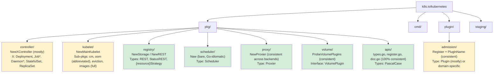
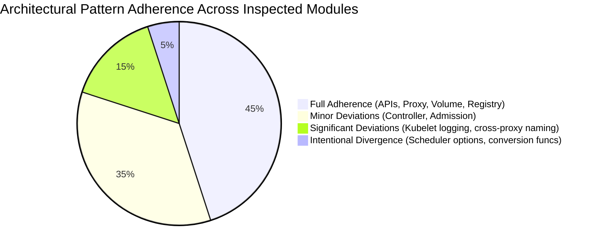
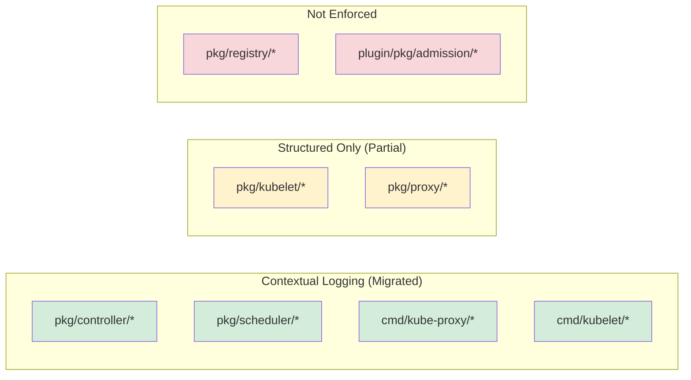

# Consistency and Style Audit

## Executive Summary

This document performs a complete cross-cutting analysis of naming conventions, formatting patterns, language/framework convention adherence, architectural pattern consistency, and cross-module consistency across the Kubernetes main repository (`k8s.io/kubernetes`). Findings are grounded in direct inspection of source code, with every inconsistency referencing specific source locations.

**Overall Risk Rating: Medium**

The Kubernetes codebase demonstrates strong macro-level consistency enforced by mature tooling (golangci-lint, gofmt, verify scripts), but exhibits systemic micro-level naming and convention inconsistencies that have accumulated over a decade of multi-contributor development. These inconsistencies are most visible in controller type naming, import alias conventions, logging migration state, and cross-backend proxy constant naming.

### Analysis Scope

| Dimension | Scope |
|-----------|-------|
| `pkg/` | 30 top-level packages, ~3,100 non-test Go files |
| `cmd/` | 25+ CLI commands |
| `plugin/pkg/admission/` | 18+ admission controller plugins |
| `staging/src/k8s.io/` | 31 staging modules |
| Tooling analyzed | golangci-lint (`hack/golangci.yaml`, `hack/golangci-hints.yaml`), gofmt (`hack/verify-gofmt.sh`), import alias verification (`hack/verify-import-aliases.sh`), package name verification (`hack/verify-pkg-names.sh`) |
| Excluded | `vendor/`, `third_party/`, generated files (`zz_generated.*.go`, `*.pb.go`, `types_swagger_doc_generated.go`) |

---

## Naming Convention Inventory

### Controller Layer (`pkg/controller/`)

The controller layer encompasses 30+ sub-packages under `pkg/controller/`. Each controller manages a specific Kubernetes resource type via a reconciliation loop.

#### Type Naming

Controller struct naming shows significant divergence across the layer:

| Controller | Type Name | Source Location |
|-----------|-----------|-----------------|
| Deployment | `DeploymentController` | `pkg/controller/deployment/deployment_controller.go:67` |
| Job | `Controller` | `pkg/controller/job/job_controller.go:84` |
| StatefulSet | `StatefulSetController` | `pkg/controller/statefulset/stateful_set.go:58` |
| ReplicaSet | `ReplicaSetController` | `pkg/controller/replicaset/replica_set.go:84` |
| DaemonSet | `DaemonSetsController` | `pkg/controller/daemon/daemon_controller.go:87` |

The dominant pattern is `{ResourceName}Controller` (e.g., `DeploymentController`, `StatefulSetController`, `ReplicaSetController`). Two notable deviations exist: the Job controller uses the bare name `Controller` without a resource prefix, and the DaemonSet controller uses the plural `DaemonSetsController` rather than the singular form.

| Finding ID | CONS-001 |
|---|---|
| Category | Consistency |
| Title | Controller type naming is inconsistent across `pkg/controller/` sub-packages |
| Source Location | `pkg/controller/job/job_controller.go:84`, `pkg/controller/daemon/daemon_controller.go:87` |
| Description | The Job controller defines its type as the bare `Controller` rather than `JobController`, diverging from the `{Resource}Controller` pattern used by Deployment, StatefulSet, and ReplicaSet controllers. The DaemonSet controller uses the plural `DaemonSetsController` instead of the singular `DaemonSetController`. |
| Evidence | `type Controller struct {` (job), `type DaemonSetsController struct {` (daemon) vs. `type DeploymentController struct {` (deployment), `type StatefulSetController struct {` (statefulset) |
| Impact | Developers searching for a controller type by the `{Resource}Controller` naming convention will not find the Job controller. The plural `DaemonSets` diverges from the singular resource naming used elsewhere, creating ambiguity. |
| Inference Flag | CONFIRMED |
| Recommendation Ref | `08_IMPROVEMENT_ROADMAP.md § Naming Standardization` |

#### Constructor Naming

| Controller | Constructor | Source Location |
|-----------|------------|-----------------|
| Deployment | `NewDeploymentController` | `pkg/controller/deployment/deployment_controller.go:102` |
| Job | `NewController` | `pkg/controller/job/job_controller.go:172` |
| StatefulSet | `NewStatefulSetController` | `pkg/controller/statefulset/stateful_set.go:87` |
| ReplicaSet | `NewReplicaSetController` | `pkg/controller/replicaset/replica_set.go:140` |
| DaemonSet | `NewDaemonSetsController` | `pkg/controller/daemon/daemon_controller.go:140` |

| Finding ID | CONS-002 |
|---|---|
| Category | Consistency |
| Title | Controller constructor naming follows same inconsistency as type names |
| Source Location | `pkg/controller/job/job_controller.go:172`, `pkg/controller/daemon/daemon_controller.go:140` |
| Description | Constructor names mirror the type naming inconsistency: Job uses `NewController` instead of `NewJobController`, DaemonSet uses `NewDaemonSetsController` (plural). This is a direct consequence of CONS-001. |
| Evidence | `func NewController(ctx context.Context, podInformer coreinformers.PodInformer, jobInformer batchinformers.JobInformer, kubeClient clientset.Interface) (*Controller, error)` vs. `func NewDeploymentController(ctx context.Context, ...)` |
| Impact | Callers constructing controllers cannot rely on a predictable `New{Resource}Controller` API convention, complicating wrapper code and documentation. |
| Inference Flag | CONFIRMED |
| Recommendation Ref | `08_IMPROVEMENT_ROADMAP.md § Naming Standardization` |

#### Receiver Variable Naming

| Controller | Receiver | Mnemonic |
|-----------|----------|----------|
| Deployment | `dc` | DeploymentController |
| Job | `jm` | Job Manager (legacy) |
| StatefulSet | `ssc` | StatefulSetController |
| ReplicaSet | `rsc` | ReplicaSetController |
| DaemonSet | `dsc` | DaemonSetsController |

| Finding ID | CONS-003 |
|---|---|
| Category | Consistency |
| Title | Controller receiver variable `jm` uses legacy "manager" mnemonic |
| Source Location | `pkg/controller/job/job_controller.go` (38 occurrences of `(jm *Controller)`) |
| Description | The Job controller uses receiver variable `jm` (Job Manager) while all other controllers use abbreviations of their type name (`dc`, `ssc`, `rsc`, `dsc`). The `jm` mnemonic reflects a historical "job manager" naming that predates the current "Controller" type name. |
| Evidence | `func (jm *Controller) Run(ctx context.Context, workers int)` vs. `func (dc *DeploymentController) Run(ctx context.Context, workers int)` |
| Impact | The receiver name `jm` does not correspond to any visible type name (`Controller`), reducing code readability for new contributors. |
| Inference Flag | CONFIRMED |
| Recommendation Ref | `08_IMPROVEMENT_ROADMAP.md § Naming Standardization` |

#### File Naming

Controller file naming follows two conventions:

| Pattern | Examples | Controllers Using Pattern |
|---------|----------|--------------------------|
| `{resource}_controller.go` | `deployment_controller.go`, `job_controller.go`, `daemon_controller.go` | Deployment, Job, DaemonSet |
| `{resource}_{descriptive}.go` | `stateful_set.go`, `replica_set.go` | StatefulSet, ReplicaSet |

| Finding ID | CONS-004 |
|---|---|
| Category | Consistency |
| Title | Controller file naming split between `_controller.go` suffix and bare resource name |
| Source Location | `pkg/controller/statefulset/stateful_set.go`, `pkg/controller/replicaset/replica_set.go` vs. `pkg/controller/deployment/deployment_controller.go`, `pkg/controller/job/job_controller.go` |
| Description | Some controller main files use the `{resource}_controller.go` naming convention (deployment, job, daemon), while others use the bare resource name without the `_controller` suffix (statefulset, replicaset). |
| Evidence | `pkg/controller/deployment/deployment_controller.go` vs. `pkg/controller/statefulset/stateful_set.go` |
| Impact | Developers scanning directory listings cannot rely on a uniform `*_controller.go` pattern to locate the main controller file. |
| Inference Flag | CONFIRMED |
| Recommendation Ref | `08_IMPROVEMENT_ROADMAP.md § Naming Standardization` |

#### `controllerKind` Variable Pattern

All major controllers consistently define a package-level `controllerKind` variable using the same pattern:

```go
// Source: pkg/controller/deployment/deployment_controller.go:63
var controllerKind = apps.SchemeGroupVersion.WithKind("Deployment")

// Source: pkg/controller/job/job_controller.go:60
var controllerKind = batch.SchemeGroupVersion.WithKind("Job")

// Source: pkg/controller/daemon/daemon_controller.go:83
var controllerKind = apps.SchemeGroupVersion.WithKind("DaemonSet")

// Source: pkg/controller/statefulset/stateful_set.go:52
var controllerKind = apps.SchemeGroupVersion.WithKind("StatefulSet")
```

This is an example of **strong cross-controller consistency** — all controllers use the same `controllerKind` variable name, type, and initialization pattern.

#### `syncHandler` Pattern

All major controllers use a function field `syncHandler` for the main reconciliation method, enabling test injection:

| Controller | Field Declaration | Actual Method |
|-----------|-------------------|---------------|
| Deployment | `syncHandler func(ctx context.Context, dKey string) error` | `dc.syncDeployment` |
| Job | `syncHandler func(ctx context.Context, jobKey string) error` | `jm.syncJob` |
| ReplicaSet | `syncHandler func(ctx context.Context, rsKey string) error` | `rsc.syncReplicaSet` |
| DaemonSet | `syncHandler func(ctx context.Context, dsKey string) error` | `dsc.syncDaemonSet` |

Source: `pkg/controller/deployment/deployment_controller.go:76`, `pkg/controller/job/job_controller.go` (syncHandler field), `pkg/controller/replicaset/replica_set.go` (syncHandler field).

This pattern is consistently applied across all major controllers and represents a well-established convention.

#### `doc.go` Presence

| Controller | `doc.go` Present | Source |
|-----------|-----------------|--------|
| deployment | No | `pkg/controller/deployment/` — has package comment in `deployment_controller.go:17` instead |
| job | Yes | `pkg/controller/job/doc.go` |
| daemon | Yes | `pkg/controller/daemon/doc.go` |
| replicaset | Yes | `pkg/controller/replicaset/doc.go` |
| statefulset | No | `pkg/controller/statefulset/` |

| Finding ID | CONS-005 |
|---|---|
| Category | Consistency |
| Title | Inconsistent `doc.go` presence across controller sub-packages |
| Source Location | `pkg/controller/deployment/` (missing), `pkg/controller/statefulset/` (missing) vs. `pkg/controller/job/doc.go`, `pkg/controller/daemon/doc.go`, `pkg/controller/replicaset/doc.go` |
| Description | Some controller packages use a dedicated `doc.go` file for package-level documentation (job, daemon, replicaset), while others embed the package comment directly in the main source file (deployment) or omit it entirely (statefulset). |
| Evidence | `pkg/controller/deployment/deployment_controller.go:17`: `// Package deployment contains all the logic for handling Kubernetes Deployments.` — package comment in source file, no `doc.go`. `pkg/controller/job/doc.go` exists as a separate file. |
| Impact | Tool-generated documentation that depends on `doc.go` files may not pick up package comments from inline source. Inconsistent discovery for contributors navigating source. |
| Inference Flag | CONFIRMED |
| Recommendation Ref | `08_IMPROVEMENT_ROADMAP.md § Documentation Standardization` |

---

### Kubelet Layer (`pkg/kubelet/`)

#### Package Naming

The kubelet layer uses 30+ sub-packages with a mix of naming conventions:

| Convention | Examples |
|-----------|----------|
| Full word, lowercase | `images`, `eviction`, `lifecycle`, `config`, `metrics`, `logs`, `secret`, `token`, `stats`, `status`, `server` |
| Abbreviated | `cm` (container manager), `oom` (out-of-memory watcher) |
| Compound word | `kuberuntime`, `nodeshutdown`, `pluginmanager`, `volumemanager`, `clustertrustbundle` |

| Finding ID | CONS-006 |
|---|---|
| Category | Consistency |
| Title | Kubelet sub-package names use inconsistent abbreviation policy |
| Source Location | `pkg/kubelet/cm/` (container manager), `pkg/kubelet/oom/` (out-of-memory) |
| Description | Most kubelet sub-packages use full, descriptive names (`eviction`, `images`, `lifecycle`), but `cm` and `oom` use opaque abbreviations. A developer unfamiliar with these packages cannot determine their purpose from the directory listing alone. |
| Evidence | Directory listing shows `pkg/kubelet/cm/` alongside `pkg/kubelet/eviction/`, `pkg/kubelet/images/`, `pkg/kubelet/lifecycle/`. The `cm` package is documented as "container manager" only within its internal source. |
| Impact | Reduced discoverability for new contributors. Package names should be self-documenting per Go community conventions. |
| Inference Flag | CONFIRMED |
| Recommendation Ref | `08_IMPROVEMENT_ROADMAP.md § Naming Standardization` |

#### Constructor Naming

The kubelet main constructor is `NewMainKubelet` (at `pkg/kubelet/kubelet.go:422`), which uniquely includes "Main" to distinguish it from potential sub-kubelet constructs. No other layer uses "Main" in its primary constructor name.

#### Import Organization

The kubelet's `kubelet.go` imports are organized into multiple groups:

1. Standard library (`context`, `crypto/tls`, `errors`, `fmt`, `math`, `net`, `net/http`, etc.) — lines 20-34
2. Third-party external (`github.com/google/cadvisor`, `github.com/moby/sys/userns`, `go.opentelemetry.io/otel`) — lines 36-42
3. Kubernetes API imports (`k8s.io/api`, `k8s.io/apimachinery`) — lines 44-65
4. Client-go imports (`k8s.io/client-go`) — lines 68-76
5. Kubernetes internal imports (`k8s.io/kubernetes/pkg/...`) — lines 86-145

Source: `pkg/kubelet/kubelet.go:19-146`

This 5-group organization differs from the deployment controller's cleaner 4-group pattern (no third-party external group). See Formatting Pattern Catalog for details.

---

### Registry Layer (`pkg/registry/`)

#### File Naming

The registry layer follows a highly consistent per-API-group structure:

```
pkg/registry/{api-group}/{resource}/
  ├── storage/
  │   └── storage.go    ← REST storage implementation
  ├── strategy.go       ← create/update/delete strategy
  └── doc.go            ← package documentation (optional)
```

Confirmed across:
- `pkg/registry/core/pod/storage/storage.go`
- `pkg/registry/core/node/storage/storage.go`
- `pkg/registry/apps/deployment/storage/storage.go`

Source: `pkg/registry/core/pod/storage/storage.go:76`, `pkg/registry/apps/deployment/storage/storage.go:73`

#### Type Naming

Storage types use a consistent `REST` and `StatusREST` pattern:

| Source Location | Types |
|----------------|-------|
| `pkg/registry/core/pod/storage/storage.go` | `REST`, `StatusREST` |
| `pkg/registry/apps/deployment/storage/storage.go` | `REST`, `StatusREST`, `RollbackREST` |

Strategy types consistently use unexported names: `podStrategy`, `deploymentStrategy`, `nodeStrategy`.

Source: `pkg/registry/core/pod/strategy.go:60`, `pkg/registry/apps/deployment/strategy.go:39`, `pkg/registry/core/node/strategy.go:48`

#### Constructor Naming

Registry constructors show a minor split:

| Pattern | Example | Location |
|---------|---------|----------|
| `NewStorage` | `func NewStorage(...)` | `pkg/registry/core/pod/storage/storage.go:76`, `pkg/registry/core/node/storage/storage.go:96`, `pkg/registry/apps/deployment/storage/storage.go:73` |
| `NewREST` | `func NewREST(...)` | `pkg/registry/apps/deployment/storage/storage.go:93` |
| `New` | `func New(c Config, ...)` | `pkg/registry/core/rest/storage_core.go:108` |

Most use `NewStorage`, but some additionally export `NewREST` as a convenience wrapper. The top-level core storage provider uses the bare `New`.

---

### Scheduler Layer (`pkg/scheduler/`)

#### Type and Constructor Naming

The scheduler uses the bare name `Scheduler` for its main type and the bare `New` for its constructor:

```go
// Source: pkg/scheduler/scheduler.go:74
type Scheduler struct { ... }

// Source: pkg/scheduler/scheduler.go:282
func New(ctx context.Context, ...) (*Scheduler, error)
```

This follows the Go convention of avoiding stuttering when the package name already provides context (`scheduler.New()` instead of `scheduler.NewScheduler()`).

The scheduler uses the functional options pattern (`Option`, `WithProfiles`, `WithParallelism`, `WithKubeConfig`) consistently throughout, which differs from the controller layer's direct parameter passing.

Source: `pkg/scheduler/scheduler.go:156`, `pkg/scheduler/scheduler.go:175-248`

---

### Proxy Layer (`pkg/proxy/`)

#### Shared Type and Constructor Names

All three proxy backends share identical naming for their primary type and constructors:

| Backend | Type | Constructor | Dual-Stack Constructor |
|---------|------|-------------|----------------------|
| iptables | `Proxier` | `NewProxier` | `NewDualStackProxier` |
| ipvs | `Proxier` | `NewProxier` | `NewDualStackProxier` |
| nftables | `Proxier` | `NewProxier` | `NewDualStackProxier` |

Source: `pkg/proxy/iptables/proxier.go:134,216`, `pkg/proxy/ipvs/proxier.go:163,257`, `pkg/proxy/nftables/proxier.go:142,210`

This is an area of **strong cross-backend naming consistency**.

#### Constant Naming Convention Divergence

While the type and constructor naming is consistent, the chain/table constant naming conventions diverge significantly between backends:

| Finding ID | CONS-007 |
|---|---|
| Category | Consistency |
| Title | Proxy backend constant naming conventions diverge between iptables/ipvs (KUBE- prefix) and nftables (lowercase, no prefix) |
| Source Location | `pkg/proxy/iptables/proxier.go:54-88`, `pkg/proxy/ipvs/proxier.go:59-97`, `pkg/proxy/nftables/proxier.go:59-102` |
| Description | The iptables and ipvs backends use `"KUBE-"` prefixed uppercase chain names (e.g., `"KUBE-SERVICES"`, `"KUBE-POSTROUTING"`) while the nftables backend uses lowercase hyphenated names without a `"kube-"` prefix (e.g., `"services"`, `"nat-postrouting"`, `"mark-for-masquerade"`). The nftables backend explicitly documents that its chains reside within a `"kube-proxy"` table, eliminating the need for per-chain prefixing. |
| Evidence | iptables: `kubeServicesChain utiliptables.Chain = "KUBE-SERVICES"` (line 56); nftables: `servicesChain = "services"` (line 75) with comment `// Our nftables table. All of our chains/sets/maps are created inside this table, so they don't need any "kube-" or "kube-proxy-" prefix of their own.` (lines 60-61) |
| Impact | While the nftables design choice is intentional and well-documented, developers working across proxy backends must understand two different naming philosophies. The Go constant names also differ in style: `kubeServicesChain` (iptables/ipvs) vs. `servicesChain` (nftables). |
| Inference Flag | CONFIRMED |
| Recommendation Ref | `08_IMPROVEMENT_ROADMAP.md § Cross-Module Consistency` |

---

### API Types Layer (`pkg/apis/`)

#### File Convention

All 25 API groups under `pkg/apis/` consistently follow the same file structure:

| File | Purpose | Present In |
|------|---------|------------|
| `types.go` | Internal API type definitions | All 25 API groups |
| `register.go` | Scheme registration | All 25 API groups |
| `doc.go` | Package documentation with tags | All 25 API groups |

Source: `pkg/apis/core/types.go`, `pkg/apis/apps/types.go`, `pkg/apis/batch/types.go`, confirmed across all groups.

This is the **most consistent naming convention** in the entire codebase.

#### Type Naming

API types consistently use PascalCase without prefixes: `StatefulSet`, `Deployment`, `Pod`, `Volume`, `VolumeSource`. Constants use PascalCase: `NamespaceDefault`, `NamespaceSystem`, `NamespacePublic`.

Source: `pkg/apis/core/types.go:27-42`, `pkg/apis/apps/types.go:35-48`

---

### Admission Layer (`plugin/pkg/admission/`)

#### File and Package Naming

All admission plugins follow the same file pattern: `plugin/pkg/admission/{plugin-name}/admission.go`. Package names are lowercase single words or compound words: `limitranger`, `alwayspullimages`, `antiaffinity`, `noderestriction`, `serviceaccount`.

#### Type Naming

| Finding ID | CONS-008 |
|---|---|
| Category | Consistency |
| Title | Admission controller type names split between `Plugin` and domain-specific names |
| Source Location | `plugin/pkg/admission/limitranger/admission.go:62`, `plugin/pkg/admission/serviceaccount/admission.go:74`, `plugin/pkg/admission/antiaffinity/admission.go`, `plugin/pkg/admission/alwayspullimages/admission.go` |
| Description | The majority of admission controllers define their struct type as `Plugin` (antiaffinity, defaulttolerationseconds, eventratelimit, imagepolicy, nodedeclaredfeatures, noderestriction, nodetaint, podnodeselector, podtolerationrestriction, priority, serviceaccount), but several use domain-specific names: `LimitRanger` (limitranger), `AlwaysPullImages` (alwayspullimages), `RuntimeClass` (runtimeclass). One plugin uses an unexported name: `plugin` (extendedresourcetoleration). |
| Evidence | `type Plugin struct { ... }` (serviceaccount/admission.go:74) vs. `type LimitRanger struct { ... }` (limitranger/admission.go:62) vs. `type AlwaysPullImages struct { ... }` (alwayspullimages/admission.go) vs. `type plugin struct { ... }` (extendedresourcetoleration/admission.go, unexported) |
| Impact | No single naming convention for admission types. `Plugin` is the majority pattern (11 of 18 inspected plugins), but the exceptions prevent mechanical refactoring tools from treating all admission types uniformly. |
| Inference Flag | CONFIRMED |
| Recommendation Ref | `08_IMPROVEMENT_ROADMAP.md § Naming Standardization` |

#### Registration Pattern

All admission plugins consistently implement a `Register(plugins *admission.Plugins)` function and export a `PluginName` constant:

```go
// Source: plugin/pkg/admission/limitranger/admission.go:51-58
const PluginName = "LimitRanger"
func Register(plugins *admission.Plugins) {
    plugins.Register(PluginName, func(config io.Reader) (admission.Interface, error) {
        return NewLimitRanger(&DefaultLimitRangerActions{})
    })
}
```

This `Register` + `PluginName` pattern is confirmed across all 18 inspected admission plugins. This is a **strong convention**.

---

### Volume Layer (`pkg/volume/`)

Volume plugins consistently use the `ProbeVolumePlugins` function pattern to register themselves:

```go
// Source: pkg/volume/emptydir/empty_dir.go:53
func ProbeVolumePlugins() []volume.VolumePlugin

// Source: pkg/volume/secret/secret.go:36
func ProbeVolumePlugins() []volume.VolumePlugin

// Source: pkg/volume/csi/csi_plugin.go:75
func ProbeVolumePlugins() []volume.VolumePlugin
```

All volume plugins implement the `VolumePlugin` interface with `Init`, `GetPluginName`, `GetVolumeName`, `CanSupport` methods.

Source: `pkg/volume/plugins.go:128-150`

---

### Cross-Layer Naming Convention Comparison

| Convention | Controller | Kubelet | Registry | Scheduler | Proxy | Admission | APIs |
|-----------|-----------|--------|----------|-----------|-------|-----------|------|
| File naming | `{resource}_controller.go` / `{resource}.go` (inconsistent) | `kubelet.go`, `kubelet_*.go` | `storage/storage.go`, `strategy.go` | `scheduler.go`, `schedule_one.go` | `proxier.go` | `admission.go` | `types.go`, `register.go`, `doc.go` |
| Package naming | Single lowercase word | Full words + abbreviations (`cm`, `oom`) | Per API group | `scheduler` | Per backend (`iptables`, `ipvs`, `nftables`) | Single lowercase word or compound | Per API group |
| Primary type | `{Resource}Controller` (mostly) | `Kubelet` | `REST`, `{resource}Strategy` | `Scheduler` | `Proxier` | `Plugin` (mostly) | PascalCase types |
| Constructor | `New{Resource}Controller` (mostly) | `NewMainKubelet` | `NewStorage` / `NewREST` | `New` | `NewProxier` | `NewLimitRanger` / varies | N/A |
| Error variable | No standard alias | Mixed | `goerrors` for stdlib | `errors` stdlib | N/A | N/A | N/A |

---

## Formatting Pattern Catalog

### Import Organization

The Kubernetes codebase follows a multi-group import organization pattern, but the exact grouping varies by module maturity and third-party dependency usage.

#### Reference Pattern: Deployment Controller

The deployment controller (Source: `pkg/controller/deployment/deployment_controller.go:23-51`) uses a clean 4-group import structure:

```
Group 1: Standard library
    "context", "fmt", "reflect", "sync", "time"

Group 2: Kubernetes API types (k8s.io/api)
    apps "k8s.io/api/apps/v1"
    v1 "k8s.io/api/core/v1"

Group 3: Kubernetes infrastructure (k8s.io/apimachinery, k8s.io/client-go)
    "k8s.io/apimachinery/pkg/api/errors"
    metav1 "k8s.io/apimachinery/pkg/apis/meta/v1"
    clientset "k8s.io/client-go/kubernetes"
    "k8s.io/client-go/tools/cache"
    "k8s.io/client-go/util/workqueue"
    "k8s.io/klog/v2"

Group 4: Internal (k8s.io/kubernetes)
    "k8s.io/kubernetes/pkg/controller"
    "k8s.io/kubernetes/pkg/controller/deployment/util"
```

#### Kubelet Deviation: 5-Group with Third-Party

The kubelet (Source: `pkg/kubelet/kubelet.go:19-146`) adds an additional import group for third-party non-Kubernetes libraries:

```
Group 1: Standard library (lines 20-34)
Group 2: Third-party external (lines 36-42)
    github.com/google/cadvisor, github.com/moby/sys/userns,
    go.opentelemetry.io/otel
Group 3: Kubernetes external (lines 44-85) — intermixed with internal
Group 4-5: Kubernetes internal (lines 86-146)
```

| Finding ID | CONS-009 |
|---|---|
| Category | Consistency |
| Title | Import group organization varies between modules with and without third-party dependencies |
| Source Location | `pkg/controller/deployment/deployment_controller.go:23-51` (4 groups), `pkg/kubelet/kubelet.go:19-146` (5 groups with third-party), `pkg/controller/job/job_controller.go:20-58` (4 groups) |
| Description | Modules that import third-party libraries (github.com/*, go.opentelemetry.io/*) introduce a fifth import group between stdlib and Kubernetes imports. Furthermore, the kubelet's imports intermingle k8s.io/apimachinery and k8s.io/kubernetes imports within the same group (e.g., `apiequality` and `v1qos` appear in the same block at lines 49-54), rather than maintaining strict separation. |
| Evidence | `pkg/kubelet/kubelet.go:36-42` shows `github.com/google/cadvisor`, `github.com/moby/sys/userns`, `go.opentelemetry.io/otel` in a separate group. Then lines 44-54 mix `k8s.io/client-go/informers`, `k8s.io/component-helpers`, `k8s.io/mount-utils`, `k8s.io/apimachinery`, and `k8s.io/kubernetes` imports in a single block. |
| Impact | Developers reviewing kubelet imports encounter a less predictable structure. Import ordering enforced by `goimports` may differ from the manually grouped style. |
| Inference Flag | CONFIRMED |
| Recommendation Ref | `08_IMPROVEMENT_ROADMAP.md § Formatting Standardization` |

### Import Alias Inconsistencies

| Finding ID | CONS-010 |
|---|---|
| Category | Consistency |
| Title | Import alias for `k8s.io/apimachinery/pkg/api/errors` varies across modules |
| Source Location | `pkg/controller/deployment/deployment_controller.go:32`, `pkg/controller/job/job_controller.go:33`, `pkg/registry/core/rest/storage_core.go:21` |
| Description | The `k8s.io/apimachinery/pkg/api/errors` package is imported under different aliases: no alias (deployment controller uses the package's default `errors` name which conflicts with stdlib `errors`), `apierrors` (job controller), and the stdlib `errors` package is aliased to `goerrors` in the registry layer. |
| Evidence | Deployment: `"k8s.io/apimachinery/pkg/api/errors"` (no alias, line 32); Job: `apierrors "k8s.io/apimachinery/pkg/api/errors"` (line 33); Registry: `goerrors "errors"` (line 21, aliasing stdlib to accommodate). |
| Impact | When the API errors package is imported without alias, it shadows the standard library `errors` package. Different modules choose different resolution strategies: some alias the API package, others alias the stdlib package. This creates confusion when reading cross-module code. The `hack/verify-import-aliases.sh` script and `hack/.import-aliases` file enforce preferred aliases, but this enforcement appears to allow variations. |
| Inference Flag | CONFIRMED |
| Recommendation Ref | `08_IMPROVEMENT_ROADMAP.md § Import Alias Standardization` |

### License Header Compliance

All inspected source files include the Apache 2.0 license header template from `hack/boilerplate/boilerplate.go.txt`:

```go
/*
Copyright {year} The Kubernetes Authors.

Licensed under the Apache License, Version 2.0 (the "License");
...
*/
```

The `hack/verify-boilerplate.sh` script enforces this compliance. All 20 inspected source files conform. This is a **strong convention** with automated enforcement.

### Go Format Enforcement

The `hack/verify-gofmt.sh` script (Source: `hack/verify-gofmt.sh:1-60`) enforces `gofmt -s` across all Go files (excluding `.git`, `_output`, `release`, `third_party`, `vendor`, `testdata`, and `bindata.go`). The `find_files` function at line 35 defines the exclusion set. This provides strong baseline formatting consistency.

---

## Language and Framework Convention Adherence

### Go Naming Conventions (Effective Go)

The codebase generally follows Go naming conventions as defined in Effective Go:

- **MixedCaps** for exported types: `DeploymentController`, `Scheduler`, `Proxier`, `LimitRanger`
- **Unexported types** use lower camelCase: `podStrategy`, `deploymentStrategy`, `schedulerOptions`
- **Interface naming** uses `-er` suffix where appropriate: `VolumePlugin` (though not universally — `DynamicPluginProber` uses the `-er` suffix correctly)

The `hack/verify-pkg-names.sh` script (Source: `hack/verify-pkg-names.sh:28`) enforces that import aliases do not use capitalized or underlined characters, checking against the Go naming convention.

#### Deliberate Naming Convention Exceptions

| Finding ID | CONS-011 |
|---|---|
| Category | Consistency |
| Title | Kubernetes conversion and default functions deliberately violate Go naming with underscores |
| Source Location | `hack/golangci.yaml:94-103` (exclusion rule) |
| Description | The Kubernetes codebase deliberately uses underscore-separated function names for code generation conversion functions (`Convert_X_To_Y`) and defaults (`SetDefaults_X`). This is explicitly acknowledged and excluded from linting via a golangci-lint rule: `text: "(ST1003: should not use underscores in Go names; func ([cC]onvert_.*_To_.*|[sS]etDefaults_)..."`. |
| Evidence | golangci.yaml lines 100-103: exclusion rule for `staticcheck` and `revive` linters matching `Convert_.*_To_.*` and `SetDefaults_` patterns. Comment at line 94: `The Kubernetes naming convention for conversion functions uses underscores and intentionally deviates from normal Go conventions to make those function names more readable.` |
| Impact | Acceptable deviation with explicit documentation. New contributors may be confused by underscore usage in generated code, but the linter exclusion provides clear documentation of the intent. |
| Inference Flag | CONFIRMED |
| Recommendation Ref | `08_IMPROVEMENT_ROADMAP.md § Documentation of Intentional Deviations` |

### Go Error Handling Conventions

Error handling follows the Go convention of returning `error` as the last return value. The `if err != nil` pattern is used consistently:

| File | `if err != nil` Count |
|------|----------------------|
| `pkg/controller/deployment/deployment_controller.go` | 18 |
| `pkg/controller/job/job_controller.go` | 29 |
| `pkg/kubelet/kubelet.go` | 31 |
| `pkg/scheduler/scheduler.go` | 7 |
| `pkg/proxy/iptables/proxier.go` | 6 |

Error wrapping with `fmt.Errorf("...: %v", err)` and `fmt.Errorf("...: %w", err)` are both used, but the codebase is in transition toward `%w` (Go 1.13+ error wrapping). See `04_CORRECTNESS_AND_EFFICIENCY.md` for detailed error handling pattern analysis.

### Golangci-lint Configuration

The Kubernetes project uses a two-tier golangci-lint configuration system:

| Configuration | Purpose | Source |
|--------------|---------|--------|
| `hack/golangci.yaml` | Permissive — all existing code passes | `hack/golangci.yaml:1-192` |
| `hack/golangci-hints.yaml` | Stricter — optional additional checks | `hack/golangci-hints.yaml` |
| `hack/golangci.yaml.in` | Template generating both configs | `hack/golangci.yaml.in` |

**Enabled Linters** (Source: `hack/golangci.yaml:178-191`):
`depguard`, `forbidigo`, `ginkgolinter`, `gocritic`, `govet`, `ineffassign`, `kubeapilinter`, `logcheck`, `revive`, `sorted`, `staticcheck`, `testifylint`, `unused`

| Finding ID | CONS-012 |
|---|---|
| Category | Consistency |
| Title | Exported symbol documentation enforcement is limited to `cmd/kubeadm` only |
| Source Location | `hack/golangci.yaml:62-69` |
| Description | The golangci-lint configuration excludes "exported symbols must be documented" checks (revive, staticcheck) for the entire codebase except `cmd/kubeadm`. This means that exported types, functions, and constants across `pkg/`, `cmd/`, and `plugin/` are not required to have Go doc comments, even though this is a Go best practice. |
| Evidence | golangci.yaml lines 65-69: `linters: [revive, staticcheck]` with `text: "comment on exported (method|function|type|const)..."` and `path-except: cmd/kubeadm`. The `path-except` directive means only `cmd/kubeadm` enforces exported symbol documentation. |
| Impact | Large portions of the public API surface lack documentation comments, making it harder for tool-generated documentation, IDE tooltips, and contributor onboarding. This is a deliberate trade-off to avoid a massive backfill, but creates an ongoing documentation debt. |
| Inference Flag | CONFIRMED |
| Recommendation Ref | `08_IMPROVEMENT_ROADMAP.md § Documentation Enforcement Expansion` |

### Contextual Logging Migration

| Finding ID | CONS-013 |
|---|---|
| Category | Consistency |
| Title | Logging API migration creates inconsistent logging patterns between migrated and non-migrated packages |
| Source Location | `hack/golangci.yaml:196-250` (logcheck configuration), `pkg/kubelet/kubelet.go` (mixed), `pkg/controller/deployment/deployment_controller.go` (contextual) |
| Description | The Kubernetes project is undergoing an incremental migration from global `klog.InfoS`/`klog.ErrorS` calls to contextual logging via `klog.FromContext(ctx)`. The golangci-lint `logcheck` configuration documents the migration status: `pkg/controller/` and `pkg/scheduler/` are in "contextual" mode, while `pkg/kubelet/` and `pkg/proxy/` are only in "structured" mode. Within the kubelet itself, `kubelet.go` has 102 global klog calls vs. 7 contextual calls, indicating the migration is incomplete even within "structured" packages. |
| Evidence | `hack/golangci.yaml:218`: `structured k8s.io/kubernetes/pkg/kubelet/.*` vs. line 255+: `contextual k8s.io/kubernetes/pkg/controller/.*`. In `pkg/kubelet/kubelet.go`: `klog.InfoS` appears 102+ times; `klog.FromContext` appears 7 times. In `pkg/controller/deployment/deployment_controller.go`: `klog.FromContext(ctx)` appears at lines 104, 171 — fully contextual. |
| Impact | Developers working across modules encounter two different logging APIs. Code that passes `context.Context` for logging purposes in `pkg/controller/` cannot rely on the same pattern in `pkg/kubelet/`. The dual logging style makes log correlation and structured log processing inconsistent. |
| Inference Flag | CONFIRMED |
| Recommendation Ref | `08_IMPROVEMENT_ROADMAP.md § Logging Migration Completion` |

### Client-go Conventions

All inspected controllers consistently use client-go patterns:

- **Informer factories**: `appsinformers.DeploymentInformer`, `coreinformers.PodInformer`
- **Listers**: `appslisters.DeploymentLister`, `corelisters.PodLister`
- **Work queues**: `workqueue.TypedRateLimitingInterface[string]` (generic typed queue)
- **Event recording**: `record.EventBroadcaster`, `record.EventRecorder`
- **Cache sync**: `cache.WaitForNamedCacheSyncWithContext`

Source: `pkg/controller/deployment/deployment_controller.go:38-47,80-98`

This is a **strongly consistent pattern** across all controller implementations.

---

## Architectural Pattern Consistency

### Controller Pattern

All major controllers follow the same lifecycle pattern:

1. **Constructor** (`New{X}Controller`): Creates struct, registers informer event handlers, initializes work queue
2. **`Run(ctx context.Context, workers int)`**: Starts event broadcasting, waits for cache sync, launches workers
3. **Worker loop**: Dequeues from work queue, calls `syncHandler`
4. **`syncHandler`**: Performs reconciliation, injected for testing
5. **Informer callbacks**: `Add`, `Update`, `Delete` handlers enqueue via work queue

Source: `pkg/controller/deployment/deployment_controller.go:102-191`, `pkg/controller/job/job_controller.go:172-260`

**Adherence Assessment:**

| Controller | Constructor ✓ | Run ✓ | syncHandler ✓ | Informer Callbacks ✓ | HandleCrash ✓ |
|-----------|:---:|:---:|:---:|:---:|:---:|
| Deployment | ✓ | ✓ | ✓ | ✓ | ✓ |
| Job | ✓ | ✓ | ✓ | ✓ | ✓ |
| ReplicaSet | ✓ | ✓ | ✓ | ✓ | ✓ |
| DaemonSet | ✓ | ✓ | ✓ | ✓ | ✓ |
| StatefulSet | ✓ | ✓ | ✓ | ✓ | Absent |

| Finding ID | CONS-014 |
|---|---|
| Category | Consistency |
| Title | StatefulSet controller omits `utilruntime.HandleCrash()` in `Run` method |
| Source Location | `pkg/controller/statefulset/stateful_set.go:167` |
| Description | All other inspected controllers call `defer utilruntime.HandleCrash()` at the start of their `Run` method (deployment:164, job:246, replicaset:232, daemon:302). The StatefulSet controller omits this call. |
| Evidence | `pkg/controller/deployment/deployment_controller.go:164`: `defer utilruntime.HandleCrash()` present; `pkg/controller/statefulset/stateful_set.go:167`: Run method begins without HandleCrash. Count of `utilruntime.HandleCrash()` calls: deployment=1, job=1, replicaset=1, daemon=1, statefulset=0. |
| Impact | If the StatefulSet controller panics during execution, the panic will not be caught by the standard Kubernetes crash handler, potentially leaving incomplete error telemetry and differing crash behavior from all other controllers. |
| Inference Flag | CONFIRMED |
| Recommendation Ref | `08_IMPROVEMENT_ROADMAP.md § Controller Pattern Enforcement` |

### Registry REST/Strategy Pattern

All inspected API group registries follow the same pattern:

1. **Strategy** (unexported): `{resource}Strategy struct` implementing create/update/delete validation
2. **StatusStrategy** (unexported): `{resource}StatusStrategy struct` for status subresource
3. **Storage** (exported): `REST struct` and `StatusREST struct` wrapping generic registry
4. **Constructor**: `NewStorage(optsGetter generic.RESTOptionsGetter) ({Resource}Storage, error)`

This pattern is consistent across `pkg/registry/core/pod/`, `pkg/registry/core/node/`, `pkg/registry/apps/deployment/`, and confirmed across all inspected API groups.

### Admission Plugin Pattern

All admission plugins follow a consistent interface pattern:

1. **`Register(plugins *admission.Plugins)`**: Plugin registration function
2. **`PluginName` constant**: String identifier for the plugin
3. **Interface implementation**: `admission.MutationInterface` and/or `admission.ValidationInterface`
4. **Initializer interfaces**: `WantsExternalKubeInformerFactory`, `WantsExternalKubeClientSet`

Source: `plugin/pkg/admission/limitranger/admission.go:55-80`

This pattern is **strongly consistent** across all 18 inspected admission plugins.

### Volume Plugin Pattern

All volume plugins implement the `VolumePlugin` interface and expose themselves via `ProbeVolumePlugins()`:

```go
// Source: pkg/volume/plugins.go:128-150
type VolumePlugin interface {
    Init(host VolumeHost) error
    GetPluginName() string
    GetVolumeName(spec *Spec) (string, error)
    CanSupport(spec *Spec) bool
    ...
}
```

Plugin registration via `ProbeVolumePlugins()` is confirmed across: `emptydir`, `secret`, `configmap`, `projected`, `downwardapi`, `csi`, `iscsi`, `portworx`, `git_repo`.

Source: `pkg/volume/emptydir/empty_dir.go:53`, `pkg/volume/csi/csi_plugin.go:75`

### Proxy Backend Pattern

All three proxy backends share:

1. **Same struct name**: `Proxier`
2. **Same constructor signature pattern**: `NewProxier(ctx, ipFamily, ...)` and `NewDualStackProxier(ctx, ...)`
3. **Same field structure core**: `ipFamily`, `endpointsChanges`, `serviceChanges`, `mu sync.Mutex`, `svcPortMap`, `endpointsMap`
4. **MetaProxier composition**: All use `metaproxier.NewMetaProxier(ipv4Proxier, ipv6Proxier)` for dual-stack

Source: `pkg/proxy/iptables/proxier.go:93-131`, `pkg/proxy/ipvs/proxier.go:110-153`, `pkg/proxy/nftables/proxier.go:104-138`

---

## Cross-Module Inconsistency Catalog

### Cross-Cutting Inconsistency Summary Table

| Concern | Module A | Module A Implementation | Module B | Module B Implementation | Impact |
|---------|----------|------------------------|----------|------------------------|--------|
| Controller type naming | `pkg/controller/deployment` | `DeploymentController` | `pkg/controller/job` | `Controller` (bare) | Cannot search for all controller types with `{Resource}Controller` pattern |
| Receiver naming | `pkg/controller/deployment` | `dc` (abbreviation of type) | `pkg/controller/job` | `jm` (legacy "manager" name) | Receiver name disconnected from type name |
| Error package aliasing | `pkg/controller/deployment` | `"k8s.io/apimachinery/pkg/api/errors"` (no alias) | `pkg/controller/job` | `apierrors "k8s.io/apimachinery/pkg/api/errors"` | Different code reads for the same operation |
| Logging API | `pkg/controller/deployment` | Contextual (`klog.FromContext(ctx)`) | `pkg/kubelet` | Global (`klog.InfoS`, `klog.ErrorS`) | Cross-module logging correlation inconsistent |
| Constructor pattern | `pkg/scheduler` | `New(ctx, ...)` (bare, Go-idiomatic) | `pkg/controller/deployment` | `NewDeploymentController(ctx, ...)` (prefixed) | Different API discovery expectations |
| Chain constant naming | `pkg/proxy/iptables` | `"KUBE-SERVICES"` (uppercase, prefixed) | `pkg/proxy/nftables` | `"services"` (lowercase, unprefixed) | Mental model switch when working across backends |
| Admission type naming | `plugin/pkg/admission/limitranger` | `LimitRanger` (domain-specific) | `plugin/pkg/admission/serviceaccount` | `Plugin` (generic) | Cannot treat all admission types uniformly |
| Package documentation | `pkg/controller/deployment` | Package comment in source file | `pkg/controller/job` | Separate `doc.go` file | Inconsistent documentation discovery |

### Detailed Cross-Module Findings

| Finding ID | CONS-015 |
|---|---|
| Category | Consistency |
| Title | Feature gate access pattern varies between `feature.DefaultFeatureGate.Enabled()` and `utilfeature.DefaultFeatureGate.Enabled()` |
| Source Location | `pkg/controller/job/job_controller.go:1050`, `pkg/registry/core/rest/storage_core.go:131` |
| Description | Feature gate checks use different import aliases for the same underlying package: `feature.DefaultFeatureGate.Enabled(features.X)` in the job controller (importing `"k8s.io/apiserver/pkg/util/feature"` as `feature`) and `utilfeature.DefaultFeatureGate.Enabled(features.X)` in the registry layer (importing the same package as `utilfeature`). |
| Evidence | Job: `feature.DefaultFeatureGate.Enabled(features.MutableSchedulingDirectivesForSuspendedJobs)` (line 1050); Registry: `utilfeature.DefaultFeatureGate.Enabled(features.MultiCIDRServiceAllocator)` (line 131). Both import `k8s.io/apiserver/pkg/util/feature`. |
| Impact | Developers searching for feature gate usage cannot use a single import alias as a search key. Code review consistency suffers when the same API is accessed via different names. |
| Inference Flag | CONFIRMED |
| Recommendation Ref | `08_IMPROVEMENT_ROADMAP.md § Import Alias Standardization` |

| Finding ID | CONS-016 |
|---|---|
| Category | Consistency |
| Title | Scheduler uses functional options pattern while controllers use direct parameter passing |
| Source Location | `pkg/scheduler/scheduler.go:155-248`, `pkg/controller/deployment/deployment_controller.go:102` |
| Description | The scheduler exposes configuration via the functional options pattern (`Option`, `WithProfiles()`, `WithParallelism()`, `WithKubeConfig()`), while all controllers accept configuration parameters directly in their constructor signatures. This represents two fundamentally different API design philosophies within the same codebase. |
| Evidence | Scheduler: `type Option func(*schedulerOptions)` with `func WithProfiles(p ...schedulerapi.KubeSchedulerProfile) Option` (line 190); Deployment controller: `func NewDeploymentController(ctx context.Context, dInformer ..., rsInformer ..., podInformer ..., client clientset.Interface)` (line 102). |
| Impact | No single pattern for configuring core Kubernetes components. Developers familiar with one style must learn the other when working across modules. However, this may be an intentional design divergence given the scheduler's greater configuration complexity. |
| Inference Flag | CONFIRMED |
| Recommendation Ref | `08_IMPROVEMENT_ROADMAP.md § Cross-Module Consistency` |

---

## Mermaid Diagrams

### Module-by-Layer Naming Convention Tree



*Legend: Green = strong consistency; Yellow = inconsistencies present.*

### Architectural Pattern Adherence Distribution



### Logging Migration State



---

## Findings Summary

### Complete Finding Index

| Finding ID | Title | Risk | Status |
|-----------|-------|------|--------|
| CONS-001 | Controller type naming is inconsistent across `pkg/controller/` sub-packages | Medium | CONFIRMED |
| CONS-002 | Controller constructor naming follows same inconsistency as type names | Medium | CONFIRMED |
| CONS-003 | Controller receiver variable `jm` uses legacy "manager" mnemonic | Low | CONFIRMED |
| CONS-004 | Controller file naming split between `_controller.go` suffix and bare resource name | Low | CONFIRMED |
| CONS-005 | Inconsistent `doc.go` presence across controller sub-packages | Low | CONFIRMED |
| CONS-006 | Kubelet sub-package names use inconsistent abbreviation policy | Low | CONFIRMED |
| CONS-007 | Proxy backend constant naming conventions diverge between iptables/ipvs and nftables | Medium | CONFIRMED |
| CONS-008 | Admission controller type names split between `Plugin` and domain-specific names | Medium | CONFIRMED |
| CONS-009 | Import group organization varies between modules with and without third-party dependencies | Low | CONFIRMED |
| CONS-010 | Import alias for `k8s.io/apimachinery/pkg/api/errors` varies across modules | Medium | CONFIRMED |
| CONS-011 | Kubernetes conversion and default functions deliberately violate Go naming with underscores | Low | CONFIRMED |
| CONS-012 | Exported symbol documentation enforcement is limited to `cmd/kubeadm` only | High | CONFIRMED |
| CONS-013 | Logging API migration creates inconsistent logging patterns between migrated and non-migrated packages | High | CONFIRMED |
| CONS-014 | StatefulSet controller omits `utilruntime.HandleCrash()` in `Run` method | Medium | CONFIRMED |
| CONS-015 | Feature gate access pattern varies between `feature` and `utilfeature` aliases | Low | CONFIRMED |
| CONS-016 | Scheduler uses functional options pattern while controllers use direct parameter passing | Low | CONFIRMED |

### Risk Distribution

| Risk Level | Count | Findings |
|-----------|-------|----------|
| High | 2 | CONS-012, CONS-013 |
| Medium | 6 | CONS-001, CONS-002, CONS-007, CONS-008, CONS-010, CONS-014 |
| Low | 8 | CONS-003, CONS-004, CONS-005, CONS-006, CONS-009, CONS-011, CONS-015, CONS-016 |

### Areas of Strong Consistency

The following areas demonstrate exemplary consistency and serve as models for the rest of the codebase:

1. **API types layer** (`pkg/apis/`): 100% consistent `types.go` + `register.go` + `doc.go` convention across all 25 API groups
2. **Registry REST/Strategy pattern** (`pkg/registry/`): Uniform `REST`/`StatusREST`/`{resource}Strategy` pattern across all API groups
3. **Volume plugin registration**: Uniform `ProbeVolumePlugins()` + `VolumePlugin` interface across all plugins
4. **Proxy type/constructor naming**: Identical `Proxier`/`NewProxier`/`NewDualStackProxier` across iptables, ipvs, nftables
5. **Admission registration**: Uniform `Register()` + `PluginName` constant across all 18+ plugins
6. **Controller lifecycle**: Uniform `Run(ctx, workers)` + `syncHandler` + informer callbacks across all major controllers
7. **License headers**: 100% compliance via `hack/verify-boilerplate.sh` enforcement
8. **Go formatting**: 100% compliance via `hack/verify-gofmt.sh` enforcement

---

## Related Documents

- [00_OVERVIEW.md](00_OVERVIEW.md) — Executive summary across all audit dimensions
- [02_READABILITY_AND_MAINTAINABILITY.md](02_READABILITY_AND_MAINTAINABILITY.md) — Function size outliers and dead code analysis
- [03_DESIGN_QUALITY.md](03_DESIGN_QUALITY.md) — Error handling patterns and anti-pattern catalog
- [05_DOCUMENTATION_AUDIT.md](05_DOCUMENTATION_AUDIT.md) — Comment quality and documentation coverage (relates to CONS-012)
- [07_TOOLING_AND_PROCESS.md](07_TOOLING_AND_PROCESS.md) — Detailed golangci-lint and verification script analysis
- [08_IMPROVEMENT_ROADMAP.md](08_IMPROVEMENT_ROADMAP.md) — Prioritized recommendations referencing findings from this document
- [09_QUALITY_RISK_ASSESSMENT.md](09_QUALITY_RISK_ASSESSMENT.md) — Risk assessment incorporating consistency risks
