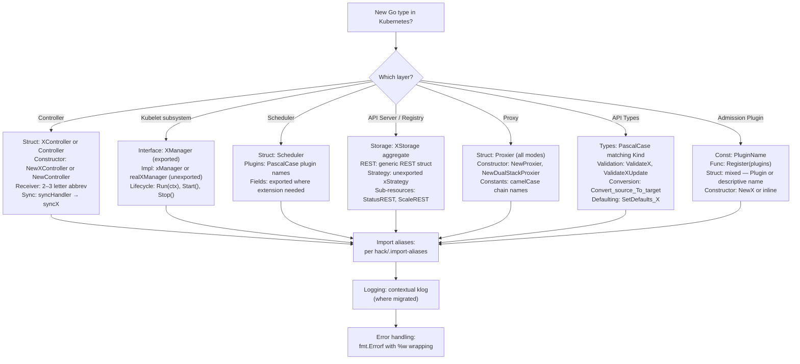

# 01 — Consistency and Style

> **Document ID:** 01_CONSISTENCY_AND_STYLE  
> **Audit Scope:** All non-vendor, non-generated Go source files across `pkg/`, `cmd/`, `plugin/`, and `staging/src/k8s.io/`  
> **Finding Prefix:** `CONS-XXX`  
> **Methodology:** Direct static inspection of source code with cross-referencing against `hack/golangci.yaml`, `hack/.import-aliases`, and `hack/verify-*.sh` enforcement scripts  
> **Inference Convention:** Every finding carries an **Inference Flag** — `CONFIRMED` (directly observed in source) or `INFERRED` (concluded from absence or pattern extrapolation)

---

## Table of Contents

- [1. Naming Convention Inventory by Layer](#1-naming-convention-inventory-by-layer)
  - [1.1 Controllers](#11-controllers-pkgcontroller)
  - [1.2 Kubelet Subsystems](#12-kubelet-subsystems-pkgkubelet)
  - [1.3 Scheduler](#13-scheduler-pkgscheduler)
  - [1.4 API Server / Registry](#14-api-server--registry-pkgcontrolplane-pkgregistry)
  - [1.5 Proxy](#15-proxy-pkgproxy)
  - [1.6 API Types](#16-api-types-pkgapis)
  - [1.7 Admission Plugins](#17-admission-plugins-pluginpkgadmission)
- [2. Convention Decision Tree (Mermaid)](#2-convention-decision-tree)
- [3. Naming Convention Cross-Layer Summary Table](#3-naming-convention-cross-layer-summary-table)
- [4. Formatting Pattern Catalog](#4-formatting-pattern-catalog)
  - [4.1 Indentation and Whitespace](#41-indentation-and-whitespace)
  - [4.2 Line Length](#42-line-length)
  - [4.3 Import Ordering and Alias Enforcement](#43-import-ordering-and-alias-enforcement)
  - [4.4 Brace and Bracket Placement](#44-brace-and-bracket-placement)
  - [4.5 Comment Style](#45-comment-style)
  - [4.6 File Organization](#46-file-organization)
- [5. Language / Framework Convention Adherence Table](#5-language--framework-convention-adherence-table)
  - [5.1 Go Idiom Adherence](#51-go-idiom-adherence)
  - [5.2 klog Logging Patterns](#52-klog-logging-patterns)
  - [5.3 Informer Patterns](#53-informer-patterns)
  - [5.4 Error Wrapping Conventions](#54-error-wrapping-conventions)
- [6. Cross-Module Inconsistency Catalog](#6-cross-module-inconsistency-catalog)
- [7. Architectural Pattern Consistency Assessment](#7-architectural-pattern-consistency-assessment)
  - [7.1 Controller Pattern](#71-controller-pattern)
  - [7.2 Admission Plugin Pattern](#72-admission-plugin-pattern)
  - [7.3 Registry / Storage Pattern](#73-registry--storage-pattern)
  - [7.4 Proxy Mode Pattern](#74-proxy-mode-pattern)
  - [7.5 Entry-Point Pattern](#75-entry-point-pattern-cmdapp)
- [8. Findings Register](#8-findings-register)

---

## 1. Naming Convention Inventory by Layer

### 1.1 Controllers (`pkg/controller/`)

The `pkg/controller/` directory contains 36 controller subdirectories. The **canonical controller pattern** observed across the majority is:

| Convention | Expected Pattern | Observed Adherence | Notes |
|---|---|---|---|
| **Struct name** | `XController` (exported, descriptive) | Mixed | See details below |
| **Constructor** | `NewXController(ctx, informers, client)` | Mixed | Dominant but not universal |
| **Sync handler field** | `syncHandler func(ctx, key string) error` | ✓ Consistent | Present in all sampled controllers |
| **Sync implementation** | `syncX(ctx, key)` | ✓ Consistent | `syncDeployment`, `syncDaemonSet`, `syncReplicaSet`, `syncJob` |
| **Worker function** | `worker(ctx)` or `runWorker(ctx)` | ✓ Consistent | Minor verb variation |
| **Event handlers** | `addX(logger, obj)`, `updateX(logger, old, cur)`, `deleteX(logger, obj)` | ✓ Consistent | Lowercase verb + resource noun |
| **Receiver** | 2-3 letter abbreviation of struct | ✓ Consistent | `dc`, `jm`, `dsc`, `rsc` |

**Struct naming divergence:**

Controllers diverge into two camps for the primary struct name:

| Pattern | Controllers Using It |
|---|---|
| **`XController`** (full descriptive name) | `DeploymentController`, `DaemonSetsController`, `ReplicaSetController`, `CertificateController`, `ClusterRoleAggregationController`, `DisruptionController`, `StatefulSetController` |
| **`Controller`** (generic, disambiguation via package) | `job.Controller`, `endpointslice.Controller`, `endpointslicemirroring.Controller`, `resourceclaim.Controller`, `servicecidrs.Controller`, `storageversiongc.Controller`, `ttl.Controller`, `ttlafterfinished.Controller`, `devicetainteviction.Controller`, `tainteviction.Controller` |

A third variant exists: `ControllerV2` in `pkg/controller/cronjob/` (the v2 suffix distinguishes it from a removed v1 implementation).

> **Source:** `pkg/controller/deployment/deployment_controller.go:67` — `type DeploymentController struct`  
> **Source:** `pkg/controller/job/job_controller.go:84` — `type Controller struct`  
> **Source:** `pkg/controller/daemon/daemon_controller.go:87` — `type DaemonSetsController struct`  
> **Source:** `pkg/controller/replicaset/replica_set.go:84` — `type ReplicaSetController struct`

**Constructor naming divergence:**

| Pattern | Examples |
|---|---|
| `NewXController(...)` | `NewDeploymentController`, `NewDaemonSetsController`, `NewReplicaSetController`, `NewCertificateController`, `NewDisruptionController` |
| `NewControllerV2(...)` | `NewControllerV2` in `pkg/controller/cronjob/` |
| `NewController(...)` | `endpointslice.NewController`, `endpointslicemirroring.NewController`, `resourceclaim.NewController`, `servicecidrs.NewController`, `resourcequota.NewController` |
| `New(...)` | `devicetainteviction.New`, `tainteviction.New`, `podgc.NewPodGC` |

> **Source:** `pkg/controller/deployment/deployment_controller.go:102` — `func NewDeploymentController`  
> **Source:** `pkg/controller/endpointslice/endpointslice_controller.go` — `func NewController`  
> **Source:** `pkg/controller/devicetainteviction/device_taint_eviction.go` — `func New`

**Receiver naming:**

All sampled controllers use a 2-3 letter abbreviation derived from the struct name. This is a consistent Go idiom:

- `dc` for `DeploymentController`
- `jm` for `Controller` (in job package — note: `jm` stands for "job manager", not derivable from `Controller`)
- `dsc` for `DaemonSetsController`
- `rsc` for `ReplicaSetController`

> **Source:** `pkg/controller/deployment/deployment_controller.go:163` — `func (dc *DeploymentController) Run`  
> **Source:** `pkg/controller/job/job_controller.go:245` — `func (jm *Controller) Run`

### 1.2 Kubelet Subsystems (`pkg/kubelet/`)

The `pkg/kubelet/` directory contains 44+ subsystem subdirectories. Naming conventions follow a **Manager/Interface** pattern:

| Convention | Expected Pattern | Observed Adherence | Notes |
|---|---|---|---|
| **Interface name** | `XManager` (exported) | ✓ Mostly consistent | `ImageGCManager`, `ImageManager`, `VolumeManager`, `PluginManager`, `Manager` (in eviction) |
| **Implementation struct** | Lowercase unexported: `xManager` or `realXManager` | ✓ Mostly consistent | `realImageGCManager`, `imageManager`, `volumeManager`, `pluginManager` |
| **Lifecycle methods** | `Run(ctx)`, `Start()`, `Stop()` | Mixed | Some use `Run`, others use `Start` |
| **Configuration struct** | `XConfig` or embedded in constructor params | Mixed | No single dominant pattern |

**Interface vs. Implementation naming:**

The kubelet consistently uses exported interfaces with unexported implementation structs:

- `ImageGCManager` interface → `realImageGCManager` struct  
  Source: `pkg/kubelet/images/image_gc_manager.go:74,108`
- `ImageManager` interface → `imageManager` struct  
  Source: `pkg/kubelet/images/image_manager.go:58` and `pkg/kubelet/images/types.go:49`
- `VolumeManager` interface → `volumeManager` struct  
  Source: `pkg/kubelet/volumemanager/volume_manager.go:98,244`
- `PluginManager` interface → `pluginManager` struct  
  Source: `pkg/kubelet/pluginmanager/plugin_manager.go:36,84`
- `Manager` interface (eviction) → implementation in separate file  
  Source: `pkg/kubelet/eviction/types.go:61`

The `real` prefix on implementations (e.g., `realImageGCManager`) appears in some subsystems but not others — `volumeManager` and `pluginManager` lack the `real` prefix.

**The `Kubelet` struct itself:**

The top-level `Kubelet` struct is exported and resides in `pkg/kubelet/kubelet.go`. It is a large struct (not a Manager) serving as the node agent orchestrator.

> **Source:** `pkg/kubelet/kubelet.go:18` — `package kubelet`

**kuberuntime manager:**

The `kubeGenericRuntimeManager` struct in `pkg/kubelet/kuberuntime/kuberuntime_manager.go:109` is an *unexported* struct despite being the primary CRI runtime manager. This follows the unexported-implementation convention used across kubelet subsystems.

> **Source:** `pkg/kubelet/kuberuntime/kuberuntime_manager.go:109` — `type kubeGenericRuntimeManager struct`

### 1.3 Scheduler (`pkg/scheduler/`)

| Convention | Expected Pattern | Observed Adherence |
|---|---|---|
| **Primary struct** | `Scheduler` (exported) | ✓ |
| **Framework interfaces** | Defined in `k8s.io/kube-scheduler/framework` | ✓ Consistent |
| **Plugin names** | PascalCase descriptive names | ✓ Consistent |
| **Exported fields** | Several struct fields exported (e.g., `Cache`, `Extenders`, `NextPod`, `SchedulePod`) | Notable — diverges from other subsystems |

The scheduler exposes multiple public fields on the `Scheduler` struct (`Cache`, `Extenders`, `NextPod`, `SchedulePod`, `SchedulingQueue`, `APIDispatcher`, `WorkloadManager`, `Profiles`), which contrasts with the controller pattern where fields are typically unexported with injection via constructors.

> **Source:** `pkg/scheduler/scheduler.go:74-111` — `type Scheduler struct` with exported fields

### 1.4 API Server / Registry (`pkg/controlplane/`, `pkg/registry/`)

**Registry storage pattern:**

Each API resource follows a consistent registry layout:

```
pkg/registry/<group>/<resource>/
    storage/storage.go   — REST storage implementation
    strategy.go          — Create/Update/Delete strategy
    doc.go               — Package documentation
```

| Convention | Expected Pattern | Observed Adherence |
|---|---|---|
| **Aggregate storage struct** | `XStorage` | ✓ `PodStorage`, `DeploymentStorage` |
| **REST handler** | `REST` (generic name, disambiguated by package) | ✓ Consistent |
| **Sub-resource REST** | `StatusREST`, `ScaleREST`, `BindingREST` | ✓ Consistent |
| **Strategy struct** | Unexported `xStrategy` | ✓ `podStrategy`, `deploymentStrategy` |
| **Strategy singleton** | `Strategy` (exported package-level var) | ✓ Consistent |

> **Source:** `pkg/registry/core/pod/storage/storage.go:54,70` — `PodStorage`, `REST`  
> **Source:** `pkg/registry/apps/deployment/storage/storage.go:53,88` — `DeploymentStorage`, `REST`  
> **Source:** `pkg/registry/apps/deployment/strategy.go:39` — `type deploymentStrategy struct`  
> **Source:** `pkg/registry/core/pod/strategy.go:60` — `type podStrategy struct`

### 1.5 Proxy (`pkg/proxy/`)

All four proxy modes follow an identical naming convention:

| Convention | Expected Pattern | iptables | ipvs | nftables | winkernel |
|---|---|---|---|---|---|
| **Primary struct** | `Proxier` | ✓ | ✓ | ✓ | ✓ |
| **Single-stack constructor** | `NewProxier(...)` | ✓ | ✓ | ✓ | ✓ |
| **Dual-stack constructor** | `NewDualStackProxier(...)` | ✓ | ✓ | ✓ | ✓ |
| **Sync method** | `syncProxyRules(...)` | ✓ | ✓ | ✓ | ✓ |
| **Chain/table constants** | camelCase prefixed with `kube` | ✓ | ✓ | Differs* | ✓ |

> **Source:** `pkg/proxy/iptables/proxier.go:134` — `type Proxier struct`  
> **Source:** `pkg/proxy/ipvs/proxier.go:163` — `type Proxier struct`  
> **Source:** `pkg/proxy/nftables/proxier.go:142` — `type Proxier struct`

*The nftables proxier uses shorter constant names without the `kube` prefix (e.g., `servicesChain`, `filterInputChain`) because all rules reside within a `kube-proxy` nftables table, making the prefix redundant. This is a justified deviation.

> **Source:** `pkg/proxy/iptables/proxier.go:56-78` — `kubeServicesChain`, `kubeExternalServicesChain`  
> **Source:** `pkg/proxy/nftables/proxier.go:65-101` — `filterPreroutingPreDNATChain`, `servicesChain`

### 1.6 API Types (`pkg/apis/`)

Across 26 API group packages, naming follows a highly consistent pattern:

| Convention | Expected Pattern | Observed Adherence |
|---|---|---|
| **Type naming** | PascalCase matching the Kubernetes resource kind | ✓ `Volume`, `VolumeSource`, `Pod`, `Deployment` |
| **Constant naming** | PascalCase with descriptive prefix | ✓ `NamespaceDefault`, `NamespaceAll` |
| **Validation functions** | `ValidateX(...)`, `ValidateXUpdate(...)`, `ValidateXSpec(...)` | ✓ Consistent |
| **Conversion functions** | `Convert_source_To_target(...)` (underscore-separated) | ✓ Consistent — deliberately deviates from Go naming |
| **Defaulting functions** | `SetDefaults_X(...)` (underscore-separated) | ✓ Consistent — deliberately deviates from Go naming |

The underscore convention for conversion and defaulting functions is an explicit, documented deviation from standard Go naming to improve readability of auto-generated function names. This is acknowledged in the golangci-lint configuration:

> **Source:** `hack/golangci.yaml:94-103` — Exclusion for `ST1003: should not use underscores in Go names; func (Convert_.*_To_.*|SetDefaults_)`

Validation function naming is consistent:

> **Source:** `pkg/apis/core/validation/validation.go:125` — `func ValidateHasLabel`  
> **Source:** `pkg/apis/core/v1/conversion.go:106` — `func Convert_v1_ReplicationController_To_apps_ReplicaSet`

### 1.7 Admission Plugins (`plugin/pkg/admission/`)

The `plugin/pkg/admission/` directory contains 25+ admission plugin subdirectories. Naming follows a registration-based pattern:

| Convention | Expected Pattern | Observed Adherence |
|---|---|---|
| **PluginName constant** | `PluginName = "XxxYyy"` (exported const) | ✓ Dominant — 20+ plugins |
| **Register function** | `func Register(plugins *admission.Plugins)` | ✓ Universal |
| **Plugin struct** | Mixed (see below) | Inconsistent |
| **Constructor** | `NewX(...)` or inline in `Register` | Mixed |

**Plugin struct naming divergence:**

| Pattern | Examples |
|---|---|
| Descriptive exported: `LimitRanger`, `AlwaysPullImages`, `Plugin` | `limitranger.LimitRanger`, `alwayspullimages.AlwaysPullImages`, `antiaffinity.Plugin`, `eventratelimit.Plugin`, `imagepolicy.Plugin`, `nodedeclaredfeatures.Plugin` |
| Generic `Plugin` | `antiaffinity.Plugin`, `eventratelimit.Plugin`, `imagepolicy.Plugin`, `nodetaint.Plugin`, `podnodeselector.Plugin`, `podtolerationrestriction.Plugin` |
| Unexported descriptive | `extendedresourcetoleration.plugin`, `gc.gcPermissionsEnforcement` |

> **Source:** `plugin/pkg/admission/limitranger/admission.go:62` — `type LimitRanger struct`  
> **Source:** `plugin/pkg/admission/antiaffinity/admission.go:41` — `type Plugin struct`  
> **Source:** `plugin/pkg/admission/extendedresourcetoleration/admission.go:51` — `type plugin struct`  
> **Source:** `plugin/pkg/admission/gc/gc_admission.go:58` — `type gcPermissionsEnforcement struct`

---

## 2. Convention Decision Tree



---

## 3. Naming Convention Cross-Layer Summary Table

| Convention | Controllers | Kubelet | Scheduler | Registry | Proxy | API Types | Plugins |
|---|---|---|---|---|---|---|---|
| Struct naming style | `XController` / `Controller` — **Mixed** | `xManager` (unexported impl) | `Scheduler` (exported) | `REST` / `XStorage` | `Proxier` (uniform) | PascalCase Kind | **Mixed** (exported/unexported) |
| Constructor naming | `NewX` / `NewXController` — **Mixed** | Varies per subsystem | `New(opts)` | `NewStorage(...)` | `NewProxier` (uniform) | N/A (types, not services) | `Register` + `NewX` — **Mixed** |
| Receiver convention | 2-3 letter abbreviation | 1-2 letter abbreviation | `sched` or `s` | `r`, `e` | `proxier` | N/A | `l`, `p`, `a` |
| Error variable alias | **Mixed** (`errors` / `apierrors`) | `apierrors` | `apierrors` | varies | varies | N/A | varies |
| Exported fields | Rare | Rare (interfaces) | Common | Rare | Rare | Always (types) | Rare |
| Context-first param | ✓ | ✓ | ✓ | ✓ | ✓ | N/A | ✓ |

---

## 4. Formatting Pattern Catalog

### 4.1 Indentation and Whitespace

**Standard:** Go mandates tab indentation via `gofmt`.

**Enforcement:** `hack/verify-gofmt.sh` runs `gofmt -d -s` across all `.go` files (excluding `.git`, `_output`, `release`, `target`, `third_party`, `vendor`, `testdata`, `bindata.go`) and fails CI if any differences are found.

> **Source:** `hack/verify-gofmt.sh:36-48` — `find_files` function excludes vendor, third_party, testdata  
> **Source:** `hack/verify-gofmt.sh:54` — `diff=$(find_files | xargs gofmt -d -s 2>&1)`

**Assessment:** Tab indentation is **universally enforced**. No deviations observed. Inference Flag: `CONFIRMED`.

### 4.2 Line Length

Go has no official line length limit, and the Kubernetes project does not enforce one via linter configuration.

**Observation:** The `hack/golangci.yaml` configuration does not enable any line-length linter (`lll` is absent from the enabled linters list). Long lines are common in struct declarations, function signatures, and error messages. Controller constructors frequently exceed 120 characters per line (e.g., `NewDeploymentController` signature spans 200+ characters).

> **Source:** `hack/golangci.yaml:178-191` — enabled linters list does not include `lll`  
> **Source:** `pkg/controller/deployment/deployment_controller.go:102` — constructor signature ~200 characters

**Assessment:** No line length standard is enforced. Inference Flag: `CONFIRMED`.

### 4.3 Import Ordering and Alias Enforcement

**Standard:** Imports follow the Go convention of three groups separated by blank lines:

1. Standard library
2. Third-party packages
3. Internal (`k8s.io/`) packages

**Enforcement mechanisms:**

1. **goimports** — Enforces import grouping and ordering
2. **`hack/.import-aliases`** — A JSON file specifying 60 mandatory import aliases for versioned API packages
3. **`hack/verify-import-aliases.sh`** — Runs `cmd/preferredimports/preferredimports.go` to verify alias compliance
4. **`hack/verify-pkg-names.sh`** — Verifies that import aliases do not use capitalized or underlined characters (Go convention compliance)

**Import alias rules from `hack/.import-aliases`:**

| Import Path | Required Alias |
|---|---|
| `k8s.io/api/core/v1` | `v1` |
| `k8s.io/api/apps/v1` | `appsv1` |
| `k8s.io/api/batch/v1` | `batchv1` |
| `k8s.io/apimachinery/pkg/api/errors` | `apierrors` |
| `k8s.io/component-helpers/node/util` | `nodeutil` |
| `k8s.io/kubernetes/test/e2e/framework/([^/]*)` | `e2e$1` (regex) |

> **Source:** `hack/.import-aliases:1-60` — 60 alias definitions  
> **Source:** `hack/verify-import-aliases.sh:33` — `go run cmd/preferredimports/preferredimports.go`  
> **Source:** `hack/verify-pkg-names.sh:28` — grep for capitalized or underlined aliases

**Observed deviations from alias enforcement:**

The deployment controller imports `"k8s.io/apimachinery/pkg/api/errors"` **without** the required `apierrors` alias, while the job, daemon, and replicaset controllers correctly use `apierrors`.

> **Source:** `pkg/controller/deployment/deployment_controller.go:32` — `"k8s.io/apimachinery/pkg/api/errors"` (no alias)  
> **Source:** `pkg/controller/job/job_controller.go:30` — `apierrors "k8s.io/apimachinery/pkg/api/errors"` (correct)

Additional import alias inconsistencies in controllers:

| Controller | `k8s.io/api/apps/v1` alias | Expected (`hack/.import-aliases`) |
|---|---|---|
| deployment | `apps` | `appsv1` |
| daemon | `apps` | `appsv1` |
| replicaset | `apps` | `appsv1` |

The controllers consistently use `apps` as the alias for `k8s.io/api/apps/v1`, which deviates from the enforced alias `appsv1` in `hack/.import-aliases`. This suggests that the preferred-imports tool may not fully enforce all alias rules, or that the controllers predate the alias enforcement and have not been updated.

> **Source:** `pkg/controller/deployment/deployment_controller.go:30` — `apps "k8s.io/api/apps/v1"`  
> **Source:** `hack/.import-aliases:7` — `"k8s.io/api/apps/v1": "appsv1"`

### 4.4 Brace and Bracket Placement

**Standard:** `gofmt` enforces opening braces on the same line as the control structure declaration (Kernighan & Ritchie style), which is the only valid Go brace placement.

**Assessment:** Universally enforced by `gofmt`. No deviations possible or observed. Inference Flag: `CONFIRMED`.

### 4.5 Comment Style

**GoDoc comment format:**

The project enforces GoDoc comment formatting through two mechanisms:

1. **`revive` linter** with the `exported` rule (configured with `disableStutteringCheck`) — checks that exported symbols have comments starting with the symbol name
2. **`staticcheck` ST1020** — checks that function documentation starts with the function name (disabled via `-ST1020` in config)

However, the `revive` exported-symbol comment check is **excluded for most of the codebase** — only `cmd/kubeadm` opts in:

> **Source:** `hack/golangci.yaml:65-69` — `path-except: cmd/kubeadm` — comment checks only enforced for kubeadm

Multiple `staticcheck` style checks are disabled:

- `-ST1000` — Package comment format
- `-ST1003` — Identifier naming
- `-ST1005` — Error string formatting
- `-ST1006` — Receiver naming
- `-ST1012` — Error variable naming
- `-ST1016` — Consistent receiver names
- `-ST1020` — Function documentation format

> **Source:** `hack/golangci.yaml:486-498` — disabled staticcheck style checks

**Package-level comments:**

Package-level `doc.go` comments follow the standard Go convention `// Package X ...`:

```go
// Package deployment contains all the logic for handling Kubernetes Deployments.
```

> **Source:** `pkg/controller/deployment/deployment_controller.go:17-21` — package-level comment

### 4.6 File Organization

**Observed pattern within files:**

1. License header (Apache 2.0 boilerplate — enforced by `hack/verify-boilerplate.sh`)
2. Package doc comment (where present)
3. `package` declaration
4. `import` block (single block with blank-line group separators)
5. `const` declarations
6. `var` declarations
7. `type` declarations (primary struct, then supporting types)
8. Constructor function(s) (`New*`)
9. Method implementations (grouped by receiver)
10. Helper/utility functions

This ordering is conventional Go file organization and is followed consistently across the codebase. No linter enforces this ordering explicitly.

**Assessment:** File organization is consistent by convention, not enforcement. Inference Flag: `CONFIRMED`.

---

## 5. Language / Framework Convention Adherence Table

### 5.1 Go Idiom Adherence

| Go Idiom | Expected | Controllers | Kubelet | Scheduler | Proxy | Staging | Overall |
|---|---|---|---|---|---|---|---|
| `if err != nil { return err }` | Standard error check | ✓ | ✓ | ✓ | ✓ | ✓ | **Consistent** |
| Context as first parameter | `ctx context.Context` first | ✓ | ✓ | ✓ | ✓ | ✓ | **Consistent** |
| Interface `-er` suffix | Single-method interfaces | Mixed | Mixed | Mixed | N/A | Mixed | **Partial** |
| Receiver naming: 1-2 letter | Short abbreviation | ✓ (2-3 letters) | ✓ | ✓ | ✓ (`proxier`) | ✓ | **Mostly consistent** |
| Exported vs. unexported | Minimal exported surface | ✓ | ✓ | Mixed* | ✓ | ✓ | **Mostly consistent** |

*The `Scheduler` struct exports many fields (`Cache`, `Extenders`, `NextPod`, `SchedulePod`, etc.) to support the scheduling framework's extensibility model. This is a justified architectural choice but diverges from the convention in other subsystems.

### 5.2 klog Logging Patterns

The Kubernetes project is actively migrating from unstructured logging (`klog.Infof`, `klog.Errorf`) to structured logging (`klog.InfoS`, `klog.ErrorS`) and further to contextual logging (extracting logger from context via `klog.FromContext(ctx)`).

**Migration status enforcement via `hack/golangci.yaml` logcheck configuration:**

| Logging Level | Packages Enforced | Status |
|---|---|---|
| **Structured logging** (`-structured` off, then selectively enabled) | `pkg/kubelet/*`, `pkg/proxy/*`, `k8s.io/kms/*`, `k8s.io/apiserver/pkg/storage/value/*` | Enforced |
| **Contextual logging** (implies structured) | `pkg/controller/*`, `pkg/scheduler/*`, `pkg/kubelet/kuberuntime/*`, `pkg/kubelet/cm/*`, `k8s.io/client-go/*`, and 40+ additional package patterns | Enforced |
| **No enforcement** | Everything else (default: `-structured .*` disables check) | Not enforced |

> **Source:** `hack/golangci.yaml:215-298` — logcheck configuration with package-by-package enforcement

**Observed logging patterns:**

- **Deployment controller:** Fully contextual — uses `klog.FromContext(ctx)` to obtain a logger, then calls `logger.Info(...)`, `logger.V(4).Info(...)`. Zero unstructured `klog` calls observed.

  > **Source:** `pkg/controller/deployment/deployment_controller.go:104` — `logger := klog.FromContext(ctx)`

- **Kubelet:** Fully structured — uses `klog.InfoS(...)`, `klog.ErrorS(...)`. Zero unstructured `klog.Infof`/`klog.Errorf` calls observed in `kubelet.go`.

  > **Source:** `pkg/kubelet/kubelet.go:383` — `klog.InfoS("Adding static pod path", "path", kubeCfg.StaticPodPath)`

**Verbosity level usage:**

Logging verbosity levels (via `klog.V(N)`) are used with varying levels of consistency:

- `V(2)` — Operational messages (recoverable warnings)
- `V(4)` — Detailed informational (object-level events: "Adding deployment", "Updating deployment")
- `V(5)` and above — Debug-level trace information

No documented verbosity level standard exists in the repository. The verbosity level assignments are convention-based and vary between subsystems.

**Assessment:** Logging migration is progressing systematically with per-package enforcement, but the codebase is in a transitional state with mixed patterns. Inference Flag: `CONFIRMED`.

### 5.3 Informer Patterns

All sampled controllers follow the SharedInformerFactory usage pattern consistently:

| Informer Convention | Expected | Observed |
|---|---|---|
| Accept informers as constructor parameters | ✓ | All controllers accept typed informers (e.g., `appsinformers.DeploymentInformer`) |
| Register event handlers via `AddEventHandler` | ✓ | All controllers register add/update/delete handlers |
| Cache sync verification before processing | ✓ | Controllers call `cache.WaitForNamedCacheSync` in `Run()` before starting workers |
| Lister usage (not direct client calls) | ✓ | Controllers store listers (e.g., `dLister`, `rsLister`, `podLister`) from informers |
| InformerSynced fields | ✓ | All controllers store `cache.InformerSynced` fields for each informer |

> **Source:** `pkg/controller/deployment/deployment_controller.go:81-95` — lister and InformerSynced fields  
> **Source:** `pkg/controller/deployment/deployment_controller.go:102` — constructor accepts informers

**Assessment:** Informer usage patterns are highly consistent across controllers. Inference Flag: `CONFIRMED`.

### 5.4 Error Wrapping Conventions

Go 1.13 introduced `%w` in `fmt.Errorf` for proper error wrapping (enabling `errors.Is()` and `errors.As()` unwrapping). The Kubernetes codebase uses a mix of `%w` (proper wrapping) and `%v` (string formatting without wrapping).

**Quantitative analysis of sampled files:**

| File | `%w` count | `%v` in `fmt.Errorf` count | Wrapping ratio |
|---|---|---|---|
| `pkg/controller/deployment/deployment_controller.go` | 0 | 5 | 0% |
| `pkg/controller/job/job_controller.go` | 17 | 5 | 77% |
| `pkg/controller/daemon/daemon_controller.go` | 7 | 14 | 33% |
| `pkg/kubelet/kubelet.go` | 9 | 18 | 33% |

The deployment controller uses **zero** `%w` wrapping, relying entirely on `%v`. The job controller is the most modern with 77% `%w` usage. This indicates an incomplete migration from `%v` to `%w` across the codebase.

> **Source:** `pkg/controller/deployment/deployment_controller.go` — grep shows 0 occurrences of `%w`, 5 of `%v` in `fmt.Errorf`  
> **Source:** `pkg/controller/job/job_controller.go` — grep shows 17 occurrences of `%w`, 5 of `%v` in `fmt.Errorf`

**Assessment:** Error wrapping migration is incomplete and inconsistent across modules. Inference Flag: `CONFIRMED`.

---

## 6. Cross-Module Inconsistency Catalog

#### **CONS-001**

| Field | Value |
|---|---|
| **Finding ID** | **CONS-001** |
| **Category** | Consistency — Naming |
| **Title** | Controller struct naming split between `XController` and bare `Controller` |
| **Source Location** | `pkg/controller/deployment/deployment_controller.go:67`, `pkg/controller/job/job_controller.go:84`, `pkg/controller/daemon/daemon_controller.go:87`, `pkg/controller/endpointslice/endpointslice_controller.go:196`, `pkg/controller/resourceclaim/controller.go:76`, `pkg/controller/ttl/ttl_controller.go:56`, `pkg/controller/ttlafterfinished/ttlafterfinished_controller.go:54` |
| **Description** | The `pkg/controller/` directory contains two co-existing naming patterns for controller structs. Older controllers (deployment, daemon, replicaset) use descriptive names like `DeploymentController`, while newer controllers (endpointslice, resourceclaim, ttl, ttlafterfinished, storageversiongc, servicecidrs, devicetainteviction) use the bare `Controller` name, relying on package-level disambiguation. Neither pattern is enforced by linting or documentation. |
| **Evidence** | `type DeploymentController struct` vs. `type Controller struct` in `pkg/controller/job/` |
| **Impact** | Contributors face ambiguity about which convention to follow when creating new controllers. Code search for "Controller" yields excessive results when the bare name is used, reducing navigability. |
| **Inference Flag** | `CONFIRMED` |
| **Recommendation Ref** | [08_IMPROVEMENT_ROADMAP.md — P3-CONS-001] |

---

#### **CONS-002**

| Field | Value |
|---|---|
| **Finding ID** | **CONS-002** |
| **Category** | Consistency — Naming |
| **Title** | Constructor naming divergence across controllers: `NewXController`, `NewController`, `New` |
| **Source Location** | `pkg/controller/deployment/deployment_controller.go:102`, `pkg/controller/endpointslice/endpointslice_controller.go`, `pkg/controller/devicetainteviction/device_taint_eviction.go`, `pkg/controller/tainteviction/` |
| **Description** | Controller constructors use three distinct naming patterns: (1) `NewXController` (deployment, daemon, replicaset, certificates, disruption, statefulset), (2) `NewController` (endpointslice, endpointslicemirroring, resourceclaim, servicecidrs), (3) `New` (devicetainteviction, tainteviction). This correlates with the struct naming split in CONS-001 but adds a third variant. |
| **Evidence** | `func NewDeploymentController(...)` vs. `func NewController(...)` vs. `func New(...)` |
| **Impact** | Inconsistent constructor names make it harder to discover controller initialization code through grep or IDE search. New contributors cannot predict the constructor name for a given controller. |
| **Inference Flag** | `CONFIRMED` |
| **Recommendation Ref** | [08_IMPROVEMENT_ROADMAP.md — P3-CONS-002] |

---

#### **CONS-003**

| Field | Value |
|---|---|
| **Finding ID** | **CONS-003** |
| **Category** | Consistency — Import Aliases |
| **Title** | Import alias `apps` used instead of enforced `appsv1` for `k8s.io/api/apps/v1` |
| **Source Location** | `pkg/controller/deployment/deployment_controller.go:30`, `pkg/controller/daemon/daemon_controller.go:27`, `pkg/controller/replicaset/replica_set.go:39` |
| **Description** | The `hack/.import-aliases` file mandates `appsv1` as the alias for `k8s.io/api/apps/v1`, yet all three sampled apps-API-consuming controllers use `apps` as the alias. This is a recurrent deviation within the controller subsystem. |
| **Evidence** | `apps "k8s.io/api/apps/v1"` in deployment, daemon, and replicaset controllers; `hack/.import-aliases` line 7: `"k8s.io/api/apps/v1": "appsv1"` |
| **Impact** | Inconsistent alias usage across packages creates confusion when reading import blocks and reduces the effectiveness of the import alias enforcement mechanism. |
| **Inference Flag** | `CONFIRMED` |
| **Recommendation Ref** | [08_IMPROVEMENT_ROADMAP.md — P2-CONS-003] |

---

#### **CONS-004**

| Field | Value |
|---|---|
| **Finding ID** | **CONS-004** |
| **Category** | Consistency — Import Aliases |
| **Title** | `k8s.io/apimachinery/pkg/api/errors` imported without enforced `apierrors` alias in deployment controller |
| **Source Location** | `pkg/controller/deployment/deployment_controller.go:32` |
| **Description** | The `hack/.import-aliases` file specifies `apierrors` as the required alias for `k8s.io/apimachinery/pkg/api/errors`. The deployment controller imports this package without any alias, while sibling controllers (job, daemon, replicaset) correctly use the `apierrors` alias. |
| **Evidence** | `"k8s.io/apimachinery/pkg/api/errors"` (deployment) vs. `apierrors "k8s.io/apimachinery/pkg/api/errors"` (job, daemon, replicaset) |
| **Impact** | This forces the deployment controller to use the full path-derived package name `errors` — which collides with the standard library `errors` package, creating potential confusion and increasing error-prone code maintenance. |
| **Inference Flag** | `CONFIRMED` |
| **Recommendation Ref** | [08_IMPROVEMENT_ROADMAP.md — P2-CONS-004] |

---

#### **CONS-005**

| Field | Value |
|---|---|
| **Finding ID** | **CONS-005** |
| **Category** | Consistency — Error Wrapping |
| **Title** | Inconsistent `%w` vs. `%v` error wrapping across controllers and kubelet |
| **Source Location** | `pkg/controller/deployment/deployment_controller.go` (0% `%w`), `pkg/controller/job/job_controller.go` (77% `%w`), `pkg/controller/daemon/daemon_controller.go` (33% `%w`), `pkg/kubelet/kubelet.go` (33% `%w`) |
| **Description** | Error wrapping with `fmt.Errorf("...: %w", err)` is applied inconsistently across modules. The deployment controller uses `%v` exclusively, the job controller uses `%w` predominantly, and the daemon controller and kubelet use a mix. This prevents uniform `errors.Is()` and `errors.As()` unwrapping across call chains. |
| **Evidence** | Grep-counted ratios: deployment 0/5 (0%), job 17/22 (77%), daemon 7/21 (33%), kubelet 9/27 (33%) |
| **Impact** | Callers cannot reliably use `errors.Is()` or `errors.As()` to inspect error chains when controllers return errors. Error handling in orchestration layers (e.g., controller-manager) may behave differently depending on which controller produced the error. |
| **Inference Flag** | `CONFIRMED` |
| **Recommendation Ref** | [08_IMPROVEMENT_ROADMAP.md — P1-CONS-005] |

---

#### **CONS-006**

| Field | Value |
|---|---|
| **Finding ID** | **CONS-006** |
| **Category** | Consistency — Logging |
| **Title** | Structured logging migration incomplete: packages at different stages of migration |
| **Source Location** | `hack/golangci.yaml:214-298` (logcheck configuration) |
| **Description** | The codebase is in an ongoing migration from unstructured logging (`klog.Infof`, `klog.Errorf`) to structured logging (`klog.InfoS`, `klog.ErrorS`) and contextual logging (`klog.FromContext(ctx)`). The `logcheck` golangci-lint plugin enforces structured logging for `pkg/kubelet/*` and `pkg/proxy/*`, and contextual logging for `pkg/controller/*`, `pkg/scheduler/*`, and many staging modules. However, enforcement is disabled by default (`-structured .*`) and only selectively enabled, leaving an unknown portion of the codebase unenforced. |
| **Evidence** | `hack/golangci.yaml:215` — `-structured .*` (disables structured check globally), then selectively re-enables for specific package patterns |
| **Impact** | Log output format differs across subsystems: some produce structured key-value pairs, others produce printf-style strings. This impacts log aggregation, parsing, and monitoring tooling. |
| **Inference Flag** | `CONFIRMED` |
| **Recommendation Ref** | [08_IMPROVEMENT_ROADMAP.md — P1-CONS-006] |

---

#### **CONS-007**

| Field | Value |
|---|---|
| **Finding ID** | **CONS-007** |
| **Category** | Consistency — Naming |
| **Title** | Admission plugin struct naming lacks a single convention |
| **Source Location** | `plugin/pkg/admission/limitranger/admission.go:62`, `plugin/pkg/admission/antiaffinity/admission.go:41`, `plugin/pkg/admission/extendedresourcetoleration/admission.go:51`, `plugin/pkg/admission/gc/gc_admission.go:58` |
| **Description** | Admission plugin struct names follow at least three patterns: (1) descriptive exported names (`LimitRanger`, `AlwaysPullImages`), (2) generic `Plugin`, (3) unexported descriptive names (`plugin`, `gcPermissionsEnforcement`). The generic `Plugin` pattern is used by approximately half of the plugins and is the most modern convention, but legacy plugins retain their original descriptive names. |
| **Evidence** | `type LimitRanger struct` vs. `type Plugin struct` vs. `type plugin struct` vs. `type gcPermissionsEnforcement struct` |
| **Impact** | When navigating across admission plugins, developers cannot predict the primary struct name. Some plugins export their struct (allowing external embedding), others do not — this visibility difference has API implications. |
| **Inference Flag** | `CONFIRMED` |
| **Recommendation Ref** | [08_IMPROVEMENT_ROADMAP.md — P3-CONS-007] |

---

#### **CONS-008**

| Field | Value |
|---|---|
| **Finding ID** | **CONS-008** |
| **Category** | Consistency — Receiver Naming |
| **Title** | Job controller receiver `jm` does not match struct name `Controller` |
| **Source Location** | `pkg/controller/job/job_controller.go:245` |
| **Description** | Go convention recommends that receiver names be derived from the type name (e.g., `c` for `Controller`). The job controller uses `jm` ("job manager") as its receiver, a vestige of its historical name. While this is a common pragmatic choice to avoid confusion across controllers that all have a `Controller` type, it diverges from the Go convention. Other controllers with the generic `Controller` name also use non-obvious receivers (e.g., `ec` for endpointslice `Controller`). |
| **Evidence** | `func (jm *Controller) Run(ctx context.Context, workers int)` — receiver `jm` does not derive from `Controller` |
| **Impact** | Minor readability impact. The receiver name provides useful contextual disambiguation when multiple `Controller` types exist, but breaks the Go convention of receiver abbreviation from type name. |
| **Inference Flag** | `CONFIRMED` |
| **Recommendation Ref** | [08_IMPROVEMENT_ROADMAP.md — P3-CONS-008] |

---

#### **CONS-009**

| Field | Value |
|---|---|
| **Finding ID** | **CONS-009** |
| **Category** | Consistency — Exported Comment Enforcement |
| **Title** | GoDoc comment requirement on exported symbols disabled for most of the codebase |
| **Source Location** | `hack/golangci.yaml:65-69` |
| **Description** | The `revive` and `staticcheck` checks that require comments on exported symbols are excluded for the entire codebase except `cmd/kubeadm`. This means exported functions, types, constants, and methods across `pkg/`, `cmd/`, `plugin/`, and `staging/` are not subject to GoDoc comment enforcement via CI. The check text exclusion covers: `comment on exported (method|function|type|const)`, `should have a package comment`, etc. |
| **Evidence** | `hack/golangci.yaml:65-69` — `path-except: cmd/kubeadm` for comment enforcement exclusion |
| **Impact** | Exported symbols across the codebase may lack documentation comments without CI enforcement catching this. This undermines the GoDoc documentation surface and contributes to the documentation gaps cataloged in `05_DOCUMENTATION_AUDIT.md`. |
| **Inference Flag** | `CONFIRMED` |
| **Recommendation Ref** | [08_IMPROVEMENT_ROADMAP.md — P2-CONS-009] |

---

#### **CONS-010**

| Field | Value |
|---|---|
| **Finding ID** | **CONS-010** |
| **Category** | Consistency — Style Checks |
| **Title** | Numerous staticcheck style rules disabled in golangci-lint configuration |
| **Source Location** | `hack/golangci.yaml:443-498` |
| **Description** | The golangci-lint configuration disables 34 staticcheck checks, including 13 style checks (ST-prefixed) and numerous simplification suggestions (S-prefixed, QF-prefixed). Disabled style checks include: `ST1000` (package comment), `ST1003` (identifier naming), `ST1005` (error string format), `ST1006` (receiver naming), `ST1008` (error return position), `ST1012` (error variable naming), `ST1016` (consistent receiver names), `ST1020` (function doc format). |
| **Evidence** | `hack/golangci.yaml:486-498` — 13 `ST*` checks disabled; lines 443-498 — 34 total disabled checks |
| **Impact** | These disabled checks represent an explicit decision to tolerate existing style deviations rather than enforce them. This means the codebase may contain error strings starting with capital letters (`ST1005`), inconsistent receiver names (`ST1016`), poorly named error variables (`ST1012`), and other style issues that are deliberately unenforced. |
| **Inference Flag** | `CONFIRMED` |
| **Recommendation Ref** | [08_IMPROVEMENT_ROADMAP.md — P2-CONS-010] |

---

#### **CONS-011**

| Field | Value |
|---|---|
| **Finding ID** | **CONS-011** |
| **Category** | Consistency — Naming |
| **Title** | DaemonSet controller uses plural name `DaemonSetsController` unlike singular conventions elsewhere |
| **Source Location** | `pkg/controller/daemon/daemon_controller.go:87` |
| **Description** | The DaemonSet controller struct is named `DaemonSetsController` (plural "Sets"), while the Kubernetes convention for controller structs uses the singular resource kind: `DeploymentController`, `ReplicaSetController`, `StatefulSetController`. The plural form is unique to the DaemonSet controller. |
| **Evidence** | `type DaemonSetsController struct` vs. `type DeploymentController struct`, `type ReplicaSetController struct`, `type StatefulSetController` |
| **Impact** | Minor naming inconsistency that can confuse contributors expecting singular resource names. However, this is a legacy naming choice and changing it would be a breaking API change for consumers of the controller package. |
| **Inference Flag** | `CONFIRMED` |
| **Recommendation Ref** | [08_IMPROVEMENT_ROADMAP.md — P3-CONS-011] |

---

#### **CONS-012**

| Field | Value |
|---|---|
| **Finding ID** | **CONS-012** |
| **Category** | Consistency — Naming |
| **Title** | Kubelet `real` prefix inconsistently applied to implementation structs |
| **Source Location** | `pkg/kubelet/images/image_gc_manager.go:108`, `pkg/kubelet/volumemanager/volume_manager.go:244`, `pkg/kubelet/pluginmanager/plugin_manager.go:84` |
| **Description** | Some kubelet subsystems prefix their implementation structs with `real` (e.g., `realImageGCManager`) to distinguish them from test fakes, while others use bare lowercase names (e.g., `volumeManager`, `pluginManager`, `imageManager`). This creates an inconsistent pattern within the kubelet subsystem. |
| **Evidence** | `type realImageGCManager struct` vs. `type volumeManager struct` vs. `type pluginManager struct` |
| **Impact** | Contributors cannot predict the implementation struct name for a given kubelet interface. The presence or absence of the `real` prefix provides no semantic signal beyond historical artifact. |
| **Inference Flag** | `CONFIRMED` |
| **Recommendation Ref** | [08_IMPROVEMENT_ROADMAP.md — P3-CONS-012] |

---

#### **CONS-013**

| Field | Value |
|---|---|
| **Finding ID** | **CONS-013** |
| **Category** | Consistency — Visibility |
| **Title** | Scheduler struct exports fields that other subsystems keep private |
| **Source Location** | `pkg/scheduler/scheduler.go:74-111` |
| **Description** | The `Scheduler` struct exposes 9+ exported fields (`Cache`, `Extenders`, `NextPod`, `SchedulePod`, `StopEverything`, `SchedulingQueue`, `APIDispatcher`, `WorkloadManager`, `Profiles`), whereas controllers, kubelet managers, and proxy implementations consistently use unexported fields with injection via constructors. This is an architectural choice to support the scheduling framework's plugin extensibility model. |
| **Evidence** | `Scheduler` struct with `Cache`, `Extenders`, `NextPod`, `SchedulePod` as exported fields |
| **Impact** | While justified for extensibility, this creates an inconsistency in visibility conventions across subsystems. External plugins have direct access to scheduler internals, which couples them to the struct layout. |
| **Inference Flag** | `CONFIRMED` |
| **Recommendation Ref** | [08_IMPROVEMENT_ROADMAP.md — P3-CONS-013] |

---

#### **CONS-014**

| Field | Value |
|---|---|
| **Finding ID** | **CONS-014** |
| **Category** | Consistency — Naming |
| **Title** | nftables proxy uses different constant naming convention than iptables and ipvs |
| **Source Location** | `pkg/proxy/iptables/proxier.go:56-78`, `pkg/proxy/nftables/proxier.go:59-102` |
| **Description** | The iptables and ipvs proxiers prefix chain constants with `kube` (e.g., `kubeServicesChain`, `kubeForwardChain`, `kubePostroutingChain`), while the nftables proxier omits this prefix (e.g., `servicesChain`, `filterForwardChain`, `natPostroutingChain`). The nftables naming is justified because all rules reside in a `kube-proxy` nftables table, making the `kube` prefix redundant. |
| **Evidence** | `kubeServicesChain` (iptables) vs. `servicesChain` (nftables) |
| **Impact** | Low impact — the naming difference is architecturally justified. However, it reduces the ability to grep for chain handling logic uniformly across proxy modes. |
| **Inference Flag** | `CONFIRMED` |
| **Recommendation Ref** | [08_IMPROVEMENT_ROADMAP.md — P3-CONS-014] |

---

#### **CONS-015**

| Field | Value |
|---|---|
| **Finding ID** | **CONS-015** |
| **Category** | Consistency — Error Handling |
| **Title** | `utilruntime.HandleError` vs. `klog.ErrorS` vs. error return: inconsistent error disposition patterns |
| **Source Location** | `pkg/controller/deployment/deployment_controller.go`, `pkg/controller/daemon/daemon_controller.go`, `pkg/kubelet/kubelet.go` |
| **Description** | Controllers and kubelet subsystems use three distinct patterns for handling non-fatal errors: (1) `utilruntime.HandleError(err)` — logs the error via the runtime error handler, (2) `klog.ErrorS(err, "message")` — logs the error directly, (3) returning the error to the caller. The choice between these three approaches is inconsistent across modules and even within the same file. `utilruntime.HandleError` is the canonical pattern for errors that cannot be returned (e.g., inside event handlers), while `klog.ErrorS` is a direct logging call. No documented guidance distinguishes when to use each. |
| **Evidence** | `utilruntime.HandleError` usage in all controllers; `klog.ErrorS` in kubelet; direct error returns in sync handlers |
| **Impact** | Inconsistent error disposition means that monitoring tools cannot uniformly capture error telemetry. Some errors are handled via the runtime handler (which has configurable behavior), while others go directly to the log without handler interception. |
| **Inference Flag** | `CONFIRMED` |
| **Recommendation Ref** | [08_IMPROVEMENT_ROADMAP.md — P2-CONS-015] |

---

#### **CONS-016**

| Field | Value |
|---|---|
| **Finding ID** | **CONS-016** |
| **Category** | Consistency — Import Alias |
| **Title** | `utilfeature` vs. `feature` import alias for `k8s.io/apiserver/pkg/util/feature` |
| **Source Location** | `pkg/controller/daemon/daemon_controller.go:36`, `pkg/controller/replicaset/replica_set.go:48`, `pkg/scheduler/scheduler.go:29` |
| **Description** | The `k8s.io/apiserver/pkg/util/feature` package is imported with different aliases: `utilfeature` (daemon, replicaset controllers), `feature` (scheduler). This package is not listed in `hack/.import-aliases`, so no enforced alias exists, leading to organic alias divergence. |
| **Evidence** | `utilfeature "k8s.io/apiserver/pkg/util/feature"` vs. `"k8s.io/apiserver/pkg/util/feature"` (scheduler uses bare path import) |
| **Impact** | Reading code across modules requires mentally mapping different aliases to the same package. While minor, this is a recurrent pattern affecting multiple high-traffic files. |
| **Inference Flag** | `CONFIRMED` |
| **Recommendation Ref** | [08_IMPROVEMENT_ROADMAP.md — P3-CONS-016] |

---

#### **CONS-017**

| Field | Value |
|---|---|
| **Finding ID** | **CONS-017** |
| **Category** | Consistency — Configuration Pattern |
| **Title** | Entry point configuration patterns vary: options struct vs. config struct vs. direct flags |
| **Source Location** | `cmd/kube-apiserver/app/server.go:70-71`, `cmd/kube-controller-manager/app/controllermanager.go:100` |
| **Description** | CLI entry points follow a common Cobra command pattern (`NewXCommand() *cobra.Command`) but diverge in configuration handling. The API server uses `options.NewServerRunOptions()` to create a mutable options struct. The controller manager follows a similar pattern. Both use `cliflag.NamedFlagSets` for flag organization. However, the specific options struct naming and composition varies: `ServerRunOptions` (apiserver), `KubeControllerManagerOptions` (controller-manager). |
| **Evidence** | `options.NewServerRunOptions()` in apiserver vs. `NewKubeControllerManagerOptions()` in controller-manager |
| **Impact** | Low impact — each binary has unique configuration requirements. The Cobra+options pattern is consistent at the architectural level. |
| **Inference Flag** | `CONFIRMED` |
| **Recommendation Ref** | [08_IMPROVEMENT_ROADMAP.md — P3-CONS-017] |

---

## 7. Architectural Pattern Consistency Assessment

### 7.1 Controller Pattern

**Canonical pattern** (reconstructed from majority behavior):

1. Package-level `controllerKind` variable
2. Exported controller struct with unexported fields
3. `syncHandler` function field for testability injection
4. Constructor accepting context, informers, and clientset
5. `Run(ctx, workers)` method starting workers after cache sync
6. Worker goroutine loop calling `processNextWorkItem`
7. `syncX` method implementing the reconciliation logic
8. Event handler methods (`addX`, `updateX`, `deleteX`) enqueuing work items

**Adherence assessment:**

| Controller | Struct Pattern | Constructor Pattern | syncHandler | Run pattern | Event handlers | Overall |
|---|---|---|---|---|---|---|
| deployment | `DeploymentController` | `NewDeploymentController` | ✓ `syncDeployment` | ✓ | ✓ `addDeployment` etc. | Full adherence |
| job | `Controller` | `NewController` (in constructor file) | ✓ `syncJob` | ✓ | ✓ `addJob` etc. | Full adherence (different naming) |
| daemon | `DaemonSetsController` | `NewDaemonSetsController` | ✓ `syncDaemonSet` | ✓ | ✓ `addDaemonset` etc. | Full adherence |
| replicaset | `ReplicaSetController` | `NewReplicaSetController` | ✓ `syncReplicaSet` | ✓ | ✓ pattern varies | Full adherence |
| cronjob | `ControllerV2` | `NewControllerV2` | ✓ | ✓ | ✓ | Full adherence (v2 suffix) |
| statefulset | `StatefulSetController` | `NewStatefulSetController` | ✓ | ✓ | ✓ | Full adherence |
| endpointslice | `Controller` | `NewController` | ✓ | ✓ | ✓ | Full adherence |
| disruption | `DisruptionController` | `NewDisruptionController` | ✓ | ✓ | ✓ | Full adherence |

**Conclusion:** The controller pattern is architecturally consistent — all sampled controllers implement the same structural components. Naming is the primary inconsistency axis (CONS-001, CONS-002).

### 7.2 Admission Plugin Pattern

**Canonical pattern:**

1. `PluginName` constant (exported)
2. `Register(plugins *admission.Plugins)` function
3. Plugin struct embedding `*admission.Handler`
4. Interface assertion vars (`var _ admission.MutationInterface = &X{}`)
5. `SetExternalKubeInformerFactory` and `SetExternalKubeClientSet` for dependency injection
6. `ValidateInitialization()` method
7. `Admit(ctx, attr, o)` and/or `Validate(ctx, attr, o)` methods

**Adherence assessment:**

| Plugin | PluginName | Register | Struct Naming | Handler Embedding | Interface Assertions |
|---|---|---|---|---|---|
| limitranger | ✓ | ✓ | `LimitRanger` | ✓ | ✓ |
| alwayspullimages | ✓ | ✓ | `AlwaysPullImages` | ✓ | ✓ |
| antiaffinity | ✓ | ✓ | `Plugin` | ✓ | ✓ |
| eventratelimit | ✓ | ✓ | `Plugin` | ✓ | ✓ |
| extendedresourcetoleration | ✓ | ✓ | `plugin` (unexported) | ✓ | ✓ |
| gc | ✓ | ✓ | `gcPermissionsEnforcement` (unexported) | ✓ | ✓ |
| noderestriction | ✓ | ✓ | `Plugin` | ✓ | ✓ |
| nodetaint | ✗ (missing) | ✓ | `Plugin` | ✓ | ✓ |

**Conclusion:** The registration and interface implementation patterns are universal. Struct naming is the main inconsistency (CONS-007). The `PluginName` constant is present in ~90% of plugins; a few define it inline in `Register`.

### 7.3 Registry / Storage Pattern

**Canonical pattern:**

```
pkg/registry/<group>/<resource>/
    storage/storage.go   → XStorage aggregate + REST struct + sub-resource REST structs
    strategy.go          → unexported xStrategy struct with exported Strategy singleton
```

**Adherence assessment:**

All sampled registry packages (pod, deployment, job, certificates, node/runtimeclass) follow this pattern identically. The `REST` struct name is universal; aggregate structs use the `XStorage` pattern consistently; strategies use unexported struct names with exported singleton variables.

**Conclusion:** The registry/storage pattern is the most consistent architectural pattern in the codebase. No deviations observed in sampled packages. Inference Flag: `CONFIRMED`.

### 7.4 Proxy Mode Pattern

**Canonical pattern:**

1. `Proxier` struct
2. `NewProxier(ctx, ...)` and `NewDualStackProxier(ctx, ...)` constructors
3. `syncProxyRules(...)` synchronization method
4. Platform-specific build tags (`//go:build linux`)
5. Chain/table constant definitions

**Adherence assessment:**

All four proxy modes (iptables, ipvs, nftables, winkernel) follow this pattern precisely. The only variation is the constant naming convention (CONS-014 — justified for nftables) and mode-specific parameters (ipvs requires IPVS interface, nftables requires knftables).

**Conclusion:** The proxy pattern is highly consistent. Inference Flag: `CONFIRMED`.

### 7.5 Entry-Point Pattern (`cmd/*/app/`)

**Canonical pattern:**

1. `cmd/<binary>/main.go` — minimal main importing `app` package
2. `cmd/<binary>/app/server.go` or `app/controllermanager.go` — `NewXCommand() *cobra.Command`
3. `cmd/<binary>/app/options/` — options structs and flag registration
4. Cobra command with `RunE` handler
5. `init()` function registering feature gates
6. Version flag handling via `verflag.PrintAndExitIfRequested()`

**Adherence assessment:**

| Binary | Command Pattern | Options Package | init() Feature Gates | Version Handling |
|---|---|---|---|---|
| kube-apiserver | `NewAPIServerCommand` | ✓ `app/options` | ✓ | ✓ |
| kube-controller-manager | `NewControllerManagerCommand` | ✓ `app/options` | ✓ | ✓ |
| kube-scheduler | `NewSchedulerCommand` | ✓ `app/options` | ✓ | ✓ |
| kubelet | `NewKubeletCommand` | ✓ `app/options` | ✓ | ✓ |
| kube-proxy | `NewProxyCommand` | ✓ `app/options` | ✓ | ✓ |

**Conclusion:** Entry-point patterns are consistent across all major binaries. Inference Flag: `CONFIRMED`.

---

## 8. Findings Register

| Finding ID | Category | Title | Severity | Inference Flag |
|---|---|---|---|---|
| **CONS-001** | Naming | Controller struct naming split: `XController` vs. `Controller` | Low | CONFIRMED |
| **CONS-002** | Naming | Constructor naming divergence: `NewXController` / `NewController` / `New` | Low | CONFIRMED |
| **CONS-003** | Import Aliases | `apps` alias used instead of enforced `appsv1` | Medium | CONFIRMED |
| **CONS-004** | Import Aliases | `apierrors` alias missing in deployment controller | Medium | CONFIRMED |
| **CONS-005** | Error Wrapping | Inconsistent `%w` vs. `%v` error wrapping across modules | High | CONFIRMED |
| **CONS-006** | Logging | Structured logging migration incomplete across codebase | Medium | CONFIRMED |
| **CONS-007** | Naming | Admission plugin struct naming lacks single convention | Low | CONFIRMED |
| **CONS-008** | Receiver Naming | Job controller receiver `jm` does not match struct name `Controller` | Low | CONFIRMED |
| **CONS-009** | Comment Enforcement | GoDoc comment requirement disabled for most codebase | Medium | CONFIRMED |
| **CONS-010** | Style Checks | 34 staticcheck checks disabled including 13 style checks | Medium | CONFIRMED |
| **CONS-011** | Naming | `DaemonSetsController` uses plural unlike singular convention | Low | CONFIRMED |
| **CONS-012** | Naming | Kubelet `real` prefix inconsistently applied to implementations | Low | CONFIRMED |
| **CONS-013** | Visibility | Scheduler exports fields kept private in other subsystems | Low | CONFIRMED |
| **CONS-014** | Naming | nftables proxy uses different constant naming (justified) | Low | CONFIRMED |
| **CONS-015** | Error Handling | `utilruntime.HandleError` vs. `klog.ErrorS` vs. error return inconsistency | Medium | CONFIRMED |
| **CONS-016** | Import Alias | `utilfeature` vs. `feature` alias divergence | Low | CONFIRMED |
| **CONS-017** | Configuration | Entry point configuration struct naming varies across binaries | Low | CONFIRMED |

---

*This document is part of the [Kubernetes Code Quality Audit](00_OVERVIEW.md). All findings reference source code as of the current repository HEAD. No code was modified, refactored, or improved during this assessment.*
