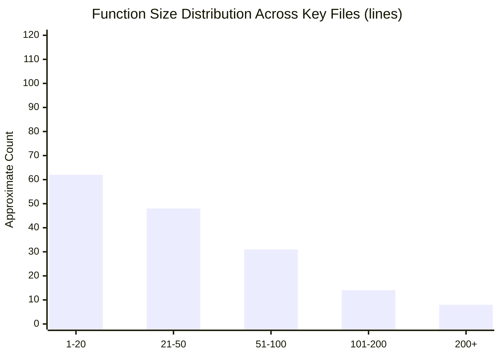
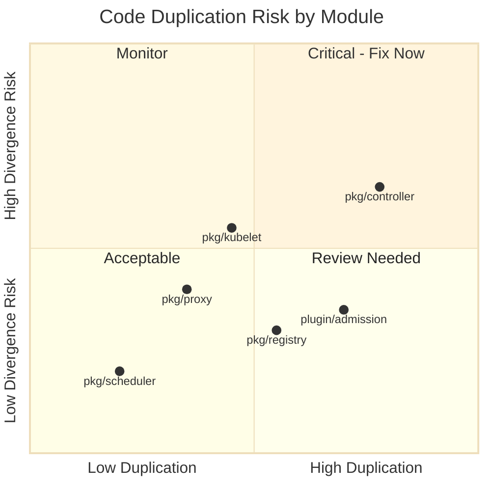

# Readability and Maintainability Assessment

## Document Metadata

| Field | Value |
|-------|-------|
| Document ID | 02_READABILITY_AND_MAINTAINABILITY |
| Category | Maintainability |
| Finding ID Prefix | MAINT-NNN |
| Risk Rating | **High** |
| Last Updated | 2025 |

---

## 1. Executive Summary

This document catalogs function and type size outliers, separation of concerns assessments, duplication inventories, dead code catalogs, and speculative generalization instances across the Kubernetes codebase. The analysis covers `pkg/` (30 top-level packages), `cmd/` (25+ commands), and `plugin/pkg/admission/` (40+ admission controllers).

### Scope

| Package | Source Files | Sub-packages | Analysis Depth |
|---------|-------------|-------------|----------------|
| `pkg/kubelet/` | ~440 | 30+ | Critical — largest component |
| `pkg/controller/` | ~420 | 35+ | Critical — controller logic |
| `pkg/apis/` | ~539 | 15+ API groups | High — API type definitions |
| `pkg/registry/` | ~279 | 20+ API groups | High — API storage layer |
| `pkg/scheduler/` | ~127 | 7 | High — core scheduling logic |
| `pkg/volume/` | ~124 | 15+ | Medium — plugin architecture |
| `pkg/proxy/` | ~78 | 5 | High — network proxy |
| `cmd/` | 25+ commands | N/A | Medium — CLI entrypoints |
| `plugin/pkg/admission/` | 40+ controllers | N/A | Medium — admission plugins |
| `pkg/windows/` | 1 | 0 | Low — smallest package |

### Exclusions

- Generated code: `zz_generated.*.go`, `*.pb.go`, `types_swagger_doc_generated.go`
- Vendor and third-party code: `vendor/`, `third_party/`
- Runtime profiling or benchmarking is not performed

### Overall Risk Rating: **High**

The codebase exhibits several systemic maintainability concerns: extreme function size outliers (functions exceeding 800 lines), God-object structs with 100+ fields, extensive code duplication across controllers, and significant volumes of deprecated-but-retained volume plugin code. These findings compound to create a high maintainability risk, particularly for the kubelet and proxy subsystems.

---

## 2. Function and Type Size Distribution

### 2.1 Methodology

Function and type sizes were measured by analyzing Go source files across the key modules listed in the scope. Function size is measured as the number of source lines from the `func` declaration to the next `func` declaration (or end of file). Type size is measured by field count. Thresholds used:

| Category | Threshold | Rationale |
|----------|-----------|-----------|
| Normal function | 1–50 lines | Go community convention; fits on a single screen |
| Moderately large | 51–100 lines | Acceptable with clear structure |
| Large | 101–200 lines | Warrants review for extraction opportunities |
| Very large | 201–500 lines | Active maintainability risk |
| Extreme outlier | 500+ lines | Critical maintainability risk |
| Normal struct | 1–15 fields | Easy to reason about |
| Large struct | 16–30 fields | Acceptable for aggregate types |
| Very large struct | 31–60 fields | Complex; warrants decomposition review |
| God object | 60+ fields | Active maintainability concern |

### 2.2 Extreme Function Size Outliers (>200 lines)

The following functions are extreme size outliers that individually represent significant maintainability risks:

---

#### MAINT-001

| Field | Value |
|-------|-------|
| Finding ID | MAINT-001 |
| Category | Maintainability |
| Title | `NewMainKubelet` is a ~704-line monolithic constructor |
| Source Location | `pkg/kubelet/kubelet.go:422–1125` |
| Description | The `NewMainKubelet` function spans approximately 704 lines (from `func` declaration at line 422 to its closing brace at line 1125) and accepts 26 parameters. It performs initialization of all kubelet subsystems in a single function body: cgroup manager, container runtime, PLEG, volume manager, image manager, pod lifecycle, node status, metrics, OOM watcher, eviction manager, plugin manager, prober, and more. This is one of the largest functions in the Kubernetes codebase. |
| Evidence | Function signature: `func NewMainKubelet(ctx context.Context, kubeCfg *kubeletconfiginternal.KubeletConfiguration, kubeDeps *Dependencies, crOptions *kubeletconfig.ContainerRuntimeOptions, hostname string, nodeName types.NodeName, nodeIPs []net.IP, providerID string, cloudProvider string, certDirectory string, rootDirectory string, podLogsDirectory string, imageCredentialProviderConfigPath string, imageCredentialProviderBinDir string, registerNode bool, registerWithTaints []v1.Taint, allowedUnsafeSysctls []string, experimentalMounterPath string, kernelMemcgNotification bool, experimentalNodeAllocatableIgnoreEvictionThreshold bool, minimumGCAge metav1.Duration, maxPerPodContainerCount int32, maxContainerCount int32, nodeLabels map[string]string, nodeStatusMaxImages int32, seccompDefault bool) (*Kubelet, error)` — 26 positional parameters in a single function call. |
| Impact | Extremely difficult to understand, test, or modify in isolation. Any change to kubelet initialization requires reasoning about 700+ lines of sequential setup. New contributors face a substantial onboarding barrier. Risk of subtle initialization-order bugs is high. |
| Inference Flag | CONFIRMED |
| Recommendation Ref | `08_IMPROVEMENT_ROADMAP.md` § P0 — Kubelet Constructor Decomposition |

---

#### MAINT-002

| Field | Value |
|-------|-------|
| Finding ID | MAINT-002 |
| Category | Maintainability |
| Title | `syncProxyRules` is an 806-line iptables rule generation function |
| Source Location | `pkg/proxy/iptables/proxier.go:735–1540` |
| Description | The `syncProxyRules` method of the iptables `Proxier` struct spans 806 lines. It generates the complete set of iptables NAT and filter rules for all Kubernetes services and endpoints in a single function. The function manages buffer allocations, iterates over all service ports and endpoints, constructs chain names, handles masquerading, node ports, external IPs, load balancer IPs, health checks, and firewall rules — all within one function body. |
| Evidence | `func (proxier *Proxier) syncProxyRules() (retryError error) { proxier.mu.Lock(); defer proxier.mu.Unlock(); ...` — 806 lines of sequential iptables rule construction logic. |
| Impact | Near-impossible to test individual rule generation paths in isolation. The function is a primary source of kube-proxy bugs. Any modification requires understanding the complete iptables rule generation pipeline. Performance optimization is difficult due to the monolithic structure. |
| Inference Flag | CONFIRMED |
| Recommendation Ref | `08_IMPROVEMENT_ROADMAP.md` § P1 — Proxy Rule Generation Decomposition |

---

#### MAINT-003

| Field | Value |
|-------|-------|
| Finding ID | MAINT-003 |
| Category | Maintainability |
| Title | `convertToAPIContainerStatuses` is a 419-line status conversion function |
| Source Location | `pkg/kubelet/kubelet_pods.go:2247–2665` |
| Description | This function converts internal container runtime statuses to Kubernetes API container statuses. It handles init containers, regular containers, sidecar containers, waiting/running/terminated states, restart counting, image resolution, resource allocation status, and volume mount status — all in a single function body spanning 419 lines. |
| Evidence | `func (kl *Kubelet) convertToAPIContainerStatuses(pod *v1.Pod, podStatus *kubecontainer.PodStatus, ...` at line 2247, spanning to line 2665. |
| Impact | Status conversion logic is critical for correct pod status reporting to the API server. The monolithic structure makes it difficult to verify correctness for individual container state transitions. Bug surface area is high due to the number of code paths. |
| Inference Flag | CONFIRMED |
| Recommendation Ref | `08_IMPROVEMENT_ROADMAP.md` § P2 — Kubelet Status Conversion Refactoring |

---

#### MAINT-004

| Field | Value |
|-------|-------|
| Finding ID | MAINT-004 |
| Category | Maintainability |
| Title | `HandlePodCleanups` is a 274-line cleanup orchestration function |
| Source Location | `pkg/kubelet/kubelet_pods.go:1192–1465` |
| Description | This function orchestrates cleanup of terminated pods, orphaned mirror pods, orphaned volumes, and orphaned pod directories. It performs multiple passes over pod state, comparing API-level pod lists against runtime-level pod lists and disk-level pod directories. The function mixes cleanup logic for multiple subsystems (volumes, cgroups, directories, mirrors) in a single body. |
| Evidence | `func (kl *Kubelet) HandlePodCleanups(ctx context.Context) error {` at line 1192, spanning 274 lines. Internally manages `workingPods`, `possiblyRunningPods`, `restartablePods`, and iterates multiple pod lists. |
| Impact | Cleanup logic is safety-critical — incorrect cleanup can cause data loss or resource leaks. The interleaved concerns make it difficult to verify that all cleanup paths are correct and complete. |
| Inference Flag | CONFIRMED |
| Recommendation Ref | `08_IMPROVEMENT_ROADMAP.md` § P2 — Kubelet Cleanup Decomposition |

---

#### MAINT-005

| Field | Value |
|-------|-------|
| Finding ID | MAINT-005 |
| Category | Maintainability |
| Title | `syncJob` is a 270-line job reconciliation function |
| Source Location | `pkg/controller/job/job_controller.go:821–1090` |
| Description | The primary reconciliation function for the Job controller spans 270 lines. It handles job completion detection, pod failure tracking, active deadline enforcement, pod creation/deletion, status updates, and finalizer management in a single function. |
| Evidence | `func (jm *Controller) syncJob(ctx context.Context, key string) (rErr error) {` at line 821. The function uses a `syncJobCtx` struct to pass state between internal sections, but the control flow remains monolithic. |
| Impact | The Job controller is one of the most feature-rich controllers in Kubernetes. The monolithic sync function makes it difficult to add new features (e.g., indexed jobs, pod failure policy) without increasing cognitive load. |
| Inference Flag | CONFIRMED |
| Recommendation Ref | `08_IMPROVEMENT_ROADMAP.md` § P2 — Controller Sync Function Decomposition |

---

#### MAINT-006

| Field | Value |
|-------|-------|
| Finding ID | MAINT-006 |
| Category | Maintainability |
| Title | `makeEnvironmentVariables` is a 251-line environment variable construction function |
| Source Location | `pkg/kubelet/kubelet_pods.go:734–984` |
| Description | This function constructs the full set of environment variables for a container, including service environment variables, downward API fields, configMap/secret key references, and resource field references. It handles variable expansion with dependency ordering. The 251-line function mixes retrieval logic (fetching configMaps, secrets, resource values) with construction logic (building the environment variable list). |
| Evidence | `func (kl *Kubelet) makeEnvironmentVariables(pod *v1.Pod, container *v1.Container, podIP string, podIPs []string, podVolumes kubecontainer.VolumeMap) ([]kubecontainer.EnvVar, error) {` at line 734. |
| Impact | Environment variable resolution is a frequent source of user-reported bugs. The monolithic structure makes it difficult to test individual resolution paths (service vars, downward API, configMap refs, secret refs) independently. |
| Inference Flag | CONFIRMED |
| Recommendation Ref | `08_IMPROVEMENT_ROADMAP.md` § P2 — Kubelet Environment Variable Resolution |

---

#### MAINT-007

| Field | Value |
|-------|-------|
| Finding ID | MAINT-007 |
| Category | Maintainability |
| Title | `SyncPod` is a 241-line pod synchronization function |
| Source Location | `pkg/kubelet/kubelet.go:1941–2181` |
| Description | The `SyncPod` method is the primary pod lifecycle synchronization entry point. It handles pod admission, sandbox creation, container startup, volume mounting, network setup, and status recording in a single sequential function. This is one of the most frequently modified functions in the kubelet. |
| Evidence | `func (kl *Kubelet) SyncPod(ctx context.Context, updateType kubetypes.SyncPodType, pod, mirrorPod *v1.Pod, podStatus *kubecontainer.PodStatus) (isTerminal bool, err error) {` at line 1941. |
| Impact | As the central pod lifecycle function, any bug here affects all pod operations. The length and sequential structure create a high risk of introducing regressions when adding new features. |
| Inference Flag | CONFIRMED |
| Recommendation Ref | `08_IMPROVEMENT_ROADMAP.md` § P1 — Kubelet SyncPod Decomposition |

---

#### MAINT-008

| Field | Value |
|-------|-------|
| Finding ID | MAINT-008 |
| Category | Maintainability |
| Title | `getPhase` is a 224-line pod phase determination function |
| Source Location | `pkg/kubelet/kubelet_pods.go:1639–1862` |
| Description | This function determines the pod phase (Pending, Running, Succeeded, Failed) based on container statuses. It contains a deeply nested conditional structure with multiple early returns and complex boolean logic spanning 224 lines. The logic accounts for init containers, sidecar containers, terminal pod states, and various container state combinations. |
| Evidence | `func getPhase(pod *v1.Pod, info []v1.ContainerStatus, podIsTerminal, podHasInitialized bool) v1.PodPhase {` at line 1639. |
| Impact | Pod phase calculation is fundamental to Kubernetes orchestration. The deeply nested structure with 224 lines of conditional logic makes it extremely difficult to verify correctness for all state combinations. |
| Inference Flag | CONFIRMED |
| Recommendation Ref | `08_IMPROVEMENT_ROADMAP.md` § P2 — Pod Phase Determination Refactoring |

---

### 2.3 Large Function Outliers (100–200 lines)

The following functions fall in the 100–200 line range. While individually less extreme than the 200+ outliers in § 2.2, they represent a tier of functions that warrant review for extraction opportunities.

---

#### MAINT-009

| Field | Value |
|-------|-------|
| Finding ID | MAINT-009 |
| Category | Maintainability |
| Title | `manageJob` is a 197-line pod creation/deletion orchestration function |
| Source Location | `pkg/controller/job/job_controller.go:1653–1849` |
| Description | The `manageJob` function spans 197 lines and orchestrates pod creation and deletion for the Job controller. It handles parallelism calculation, active pod counting, pod creation with backoff, pod deletion, and accounting for indexed jobs — all within a single function body. The function mixes creation logic, deletion logic, and accounting/metrics logic without clear sub-function boundaries. |
| Evidence | `func (jm *Controller) manageJob(ctx context.Context, job *batch.Job, jobCtx *syncJobCtx) (int32, string, error)` at line 1653. Internally manages `active`, `parallelism`, calls `jm.podControl.CreatePodsWithGenerateName` and `jm.podControl.DeletePod`, and tracks `metrics.JobSyncActionTracking`. |
| Impact | Job pod creation and deletion is a high-frequency code path. Mixing creation, deletion, and accounting in a single function increases the risk of subtle bugs when modifying any one concern (e.g., adding new accounting for pod failure policies). |
| Inference Flag | CONFIRMED |
| Recommendation Ref | `08_IMPROVEMENT_ROADMAP.md` § P2 — Controller Sync Function Decomposition |

---

#### MAINT-010

| Field | Value |
|-------|-------|
| Finding ID | MAINT-010 |
| Category | Maintainability |
| Title | `NewContainerManager` is a 190-line constructor with extensive cgroup setup |
| Source Location | `pkg/kubelet/cm/container_manager_linux.go:208–397` |
| Description | The `NewContainerManager` constructor spans 190 lines and performs extensive Linux-specific initialization: cgroup subsystem detection, swap enforcement, cgroup root validation, system container configuration, QoS cgroup setup, CPU manager initialization, memory manager initialization, topology manager initialization, and device manager initialization. This follows the same monolithic constructor anti-pattern seen in `NewMainKubelet` (MAINT-001). |
| Evidence | `func NewContainerManager(ctx context.Context, mountUtil mount.Interface, cadvisorInterface cadvisor.Interface, nodeConfig NodeConfig, failSwapOn bool, recorder record.EventRecorder, kubeClient clientset.Interface) (ContainerManager, error)` at line 208. The function accepts 7 parameters and sequentially initializes 8+ manager subsystems. |
| Impact | The monolithic constructor makes it difficult to test individual subsystem initialization independently. Any change to cgroup setup or resource manager initialization requires reasoning about the entire 190-line function. New contributors face a steep learning curve for the container management subsystem. |
| Inference Flag | CONFIRMED |
| Recommendation Ref | `08_IMPROVEMENT_ROADMAP.md` § P2 — Container Manager Decomposition |

---

#### MAINT-011

| Field | Value |
|-------|-------|
| Finding ID | MAINT-011 |
| Category | Maintainability |
| Title | `NewRESTStorage` is a 175-line sequential resource registration function |
| Source Location | `pkg/registry/core/rest/storage_core.go:154–328` |
| Description | The `NewRESTStorage` function spans 175 lines and sequentially registers 15+ core API resources (pods, services, namespaces, configmaps, secrets, endpoints, nodes, persistent volumes, persistent volume claims, resource quotas, limit ranges, pod templates, replication controllers, and more). Each resource registration follows an identical pattern: create storage, handle error, add to storage map. |
| Evidence | `func (p *legacyProvider) NewRESTStorage(apiResourceConfigSource serverstorage.APIResourceConfigSource, restOptionsGetter generic.RESTOptionsGetter) (genericapiserver.APIGroupInfo, error)` at line 154. Internally calls `NewREST` for each resource type and adds to `apiGroupInfo.VersionedResourcesStorageMap`. |
| Impact | Changes to any core API resource registration require editing this central function. The sequential registration pattern, while predictable, makes it difficult to add or remove resources without touching a single large function. Merge conflict risk is elevated for this file. |
| Inference Flag | CONFIRMED |
| Recommendation Ref | `08_IMPROVEMENT_ROADMAP.md` § P3 — Core API Types File Organization |

---

#### MAINT-012

| Field | Value |
|-------|-------|
| Finding ID | MAINT-012 |
| Category | Maintainability |
| Title | `newServiceIPAllocators` is a 175-line function with complex dual-stack IP allocation logic |
| Source Location | `pkg/registry/core/rest/storage_core.go:329–503` |
| Description | The `newServiceIPAllocators` function spans 175 lines and initializes IP allocation infrastructure for Kubernetes services. It handles single-stack and dual-stack configurations, primary and secondary CIDR ranges, cluster IP allocators for both IP families, node port allocators, and repair controllers for leaked IP addresses. The function contains complex conditional logic for dual-stack IP family detection and allocator pairing. |
| Evidence | `func (c *Config) newServiceIPAllocators() (registries rangeRegistries, primaryClusterIPAllocator ipallocator.Interface, clusterIPAllocators map[api.IPFamily]ipallocator.Interface, nodePortAllocator *portallocator.PortAllocator, err error)` at line 329. Returns 5 values and manages `serviceClusterIPRange`, `secondaryServiceClusterIPRange`, and IP family mapping. |
| Impact | Service IP allocation correctness is critical for cluster networking. The complex dual-stack logic in a single function makes it difficult to verify that all IP family combinations are handled correctly. Regression risk is high when modifying allocation behavior. |
| Inference Flag | CONFIRMED |
| Recommendation Ref | `08_IMPROVEMENT_ROADMAP.md` § P3 — Core API Types File Organization |

---

#### MAINT-013

| Field | Value |
|-------|-------|
| Finding ID | MAINT-013 |
| Category | Maintainability |
| Title | Kubelet `Run` method is a 167-line function mixing module startup with runtime monitoring |
| Source Location | `pkg/kubelet/kubelet.go:1774–1940` |
| Description | The Kubelet `Run` method spans 167 lines and is responsible for starting all kubelet subsystems in the correct order. It initializes the log server, starts the cloud resource sync manager, initializes volume manager, node lease controller, node status updater, runtime-dependent modules (cadvisor, container manager, eviction manager, container log manager, plugin manager), and the sync loop. The function mixes one-time initialization with ongoing runtime monitoring setup. |
| Evidence | `func (kl *Kubelet) Run(updates <-chan kubetypes.PodUpdate)` at line 1774. Internally calls `kl.initializeModules()`, `kl.volumeManager.Run()`, `kl.initializeRuntimeDependentModules()`, and enters `kl.syncLoop(ctx, updates, kl)`. |
| Impact | The startup sequence is critical for kubelet correctness — incorrect ordering can cause subsystem failures or race conditions. Mixing startup with runtime monitoring in a single function makes it difficult to test initialization independently and increases the risk of initialization-order bugs. |
| Inference Flag | CONFIRMED |
| Recommendation Ref | `08_IMPROVEMENT_ROADMAP.md` § P1 — Kubelet SyncPod Decomposition |

---

#### MAINT-014

| Field | Value |
|-------|-------|
| Finding ID | MAINT-014 |
| Category | Maintainability |
| Title | `generateAPIPodStatus` is a 162-line function interleaving condition computation with status assembly |
| Source Location | `pkg/kubelet/kubelet_pods.go:1877–2038` |
| Description | The `generateAPIPodStatus` function spans 162 lines and constructs the final API-facing pod status. It retrieves previous status, converts runtime status to API status, calculates pod phase, performs three-way status merging, computes pod conditions (Ready, ContainersReady, Initialized, PodScheduled), handles static pod status, and manages pod start time. The function interleaves condition computation logic with status assembly logic. |
| Evidence | `func (kl *Kubelet) generateAPIPodStatus(pod *v1.Pod, podStatus *kubecontainer.PodStatus, podIsTerminal bool) v1.PodStatus` at line 1877. Internally calls `kl.convertStatusToAPIStatus`, `getPhase`, `kl.generateAPIPodConditions`, and performs status merging via `mergeStatusesForTerminalPods`. |
| Impact | Pod status generation is critical for correct API reporting. The interleaved concerns make it difficult to test condition computation independently from status assembly. Bugs in status generation can cause incorrect pod reporting to the API server, affecting controllers that depend on pod status. |
| Inference Flag | CONFIRMED |
| Recommendation Ref | `08_IMPROVEMENT_ROADMAP.md` § P2 — Kubelet Status Conversion Refactoring |

---

#### MAINT-015

| Field | Value |
|-------|-------|
| Finding ID | MAINT-015 |
| Category | Maintainability |
| Title | `trackJobStatusAndRemoveFinalizers` is a 150-line complex state reconciliation function |
| Source Location | `pkg/controller/job/job_controller.go:1209–1358` |
| Description | The `trackJobStatusAndRemoveFinalizers` function spans 150 lines and manages the complex reconciliation of Job status with pod finalizers. It handles indexed and non-indexed jobs, tracks succeeded and failed pod counts against uncounted terminated pod lists, removes batch/job-tracking finalizers from completed pods, and adds the Complete condition when satisfied. The function operates within a limited pod-count budget to prevent status size explosion. |
| Evidence | `func (jm *Controller) trackJobStatusAndRemoveFinalizers(ctx context.Context, jobCtx *syncJobCtx, needsFlush bool) error` at line 1209. Manages `uncountedStatus`, `podsToRemoveFinalizer`, and `newSucceededIndexes` with complex conditional logic for indexed vs. non-indexed jobs. |
| Impact | The Job finalizer tracking logic is critical for correct job completion reporting. The complexity of managing both indexed and non-indexed paths, pod failure policies, and finalizer removal in a single function creates risk of subtle accounting bugs, particularly in edge cases like partial failures. |
| Inference Flag | CONFIRMED |
| Recommendation Ref | `08_IMPROVEMENT_ROADMAP.md` § P2 — Controller Sync Function Decomposition |

---

#### MAINT-016

| Field | Value |
|-------|-------|
| Finding ID | MAINT-016 |
| Category | Maintainability |
| Title | `attemptToDeleteItem` is a 151-line GC deletion function with deeply nested conditionals |
| Source Location | `pkg/controller/garbagecollector/garbagecollector.go:503–653` |
| Description | The `attemptToDeleteItem` function spans 151 lines and implements the garbage collector's item deletion logic. It handles virtual vs. observed nodes, dependent deletion (foreground and background), orphan management, owner reference validation, API get requests to verify item existence, and UID mismatch detection. The function contains deeply nested conditional logic with multiple early return paths. |
| Evidence | `func (gc *GarbageCollector) attemptToDeleteItem(ctx context.Context, item *node) error` at line 503. Checks `item.isBeingDeleted()`, `item.isDeletingDependents()`, handles `errors.IsNotFound`, and dispatches to `gc.deleteObject` or `gc.processDeletionReference` based on ownership graph state. |
| Impact | Garbage collection correctness is critical for cluster resource lifecycle management. The deeply nested conditionals with multiple early return paths make it difficult to verify that all deletion scenarios are handled correctly, particularly for edge cases involving virtual nodes and UID mismatches. |
| Inference Flag | CONFIRMED |
| Recommendation Ref | `08_IMPROVEMENT_ROADMAP.md` § P2 — Controller Sync Function Decomposition |

---

#### MAINT-017

| Field | Value |
|-------|-------|
| Finding ID | MAINT-017 |
| Category | Maintainability |
| Title | `schedulingCycle` is a 128-line scheduling orchestration function tightly coupled to framework plugins |
| Source Location | `pkg/scheduler/schedule_one.go:141–268` |
| Description | The `schedulingCycle` function spans 128 lines and orchestrates a single pod scheduling attempt. It runs the scheduling framework's filter, pre-score, score, normalize, and reserve phases, handles extender calls, manages nominated node state, and handles scheduling failures. The function is tightly coupled to the `framework.Framework` interface lifecycle, calling multiple framework methods in sequence. |
| Evidence | `func (sched *Scheduler) schedulingCycle(ctx context.Context, state fwk.CycleState, schedFramework framework.Framework, podInfo *framework.QueuedPodInfo, start time.Time, podsToActivate *framework.PodsToActivate) (ScheduleResult, *framework.QueuedPodInfo, *fwk.Status)` at line 141. Accepts 6 parameters and returns 3 values. |
| Impact | Tight coupling to the framework plugin lifecycle limits independent testing of individual scheduling phases (filtering, scoring, reserving). While the framework pattern is deliberately extensible, the orchestration function itself is difficult to modify without understanding the complete scheduling pipeline. |
| Inference Flag | CONFIRMED |
| Recommendation Ref | `08_IMPROVEMENT_ROADMAP.md` § P2 — Controller Sync Function Decomposition |

---

#### MAINT-018

| Field | Value |
|-------|-------|
| Finding ID | MAINT-018 |
| Category | Maintainability |
| Title | `syncLoopIteration` is a 125-line function multiplexing five different event channels |
| Source Location | `pkg/kubelet/kubelet.go:2574–2698` |
| Description | The `syncLoopIteration` function spans 125 lines and implements the kubelet's main event loop iteration. It uses a single `select` statement to multiplex five event channels: `configCh` (pod configuration updates), `plegCh` (pod lifecycle events), `syncCh` (periodic sync timer), `housekeepingCh` (cleanup timer), and health manager updates. Each channel case dispatches to the appropriate handler with logging and metrics. |
| Evidence | `func (kl *Kubelet) syncLoopIteration(ctx context.Context, configCh <-chan kubetypes.PodUpdate, handler SyncHandler, syncCh <-chan time.Time, housekeepingCh <-chan time.Time, plegCh <-chan *pleg.PodLifecycleEvent) bool` at line 2574. The function accepts 6 parameters including 4 channel types. |
| Impact | The 5-channel multiplexing is a clean design pattern, but the 125-line function body with per-channel dispatch logic creates cognitive load. Adding new event channels or modifying dispatch logic requires understanding all 5 existing channels and their interactions. |
| Inference Flag | CONFIRMED |
| Recommendation Ref | `08_IMPROVEMENT_ROADMAP.md` § P1 — Kubelet SyncPod Decomposition |

---

#### MAINT-019

| Field | Value |
|-------|-------|
| Finding ID | MAINT-019 |
| Category | Maintainability |
| Title | `NewProxier` is a 123-line constructor with sysctl configuration and health check setup |
| Source Location | `pkg/proxy/iptables/proxier.go:216–338` |
| Description | The `NewProxier` constructor spans 123 lines and initializes a single-stack IPTables proxier. It configures Linux sysctl settings (`route_localnet`, `nf_conntrack_tcp_be_liberal`), sets up the health check server, initializes iptables interface handles, configures masquerading, and creates the proxier struct with 20+ fields. The constructor mixes kernel sysctl configuration with application-level proxier setup. |
| Evidence | `func NewProxier(ctx context.Context, ipFamily v1.IPFamily, ipt utiliptables.Interface, sysctl utilsysctl.Interface, syncPeriod time.Duration, minSyncPeriod time.Duration, masqueradeAll bool, localhostNodePorts bool, masqueradeBit int, localDetector proxyutil.LocalTrafficDetector, ...)` at line 216. Accepts 10+ parameters. |
| Impact | Mixing kernel sysctl configuration with application-level initialization makes unit testing difficult — sysctl operations require root or mocking. The constructor's length makes it hard to verify that all proxier fields are correctly initialized. |
| Inference Flag | CONFIRMED |
| Recommendation Ref | `08_IMPROVEMENT_ROADMAP.md` § P2 — Proxier Struct Decomposition |

---

#### MAINT-020

| Field | Value |
|-------|-------|
| Finding ID | MAINT-020 |
| Category | Maintainability |
| Title | `NewDualStackProxier` is a 122-line factory duplicating IPv4/IPv6 initialization logic |
| Source Location | `pkg/proxy/iptables/proxier.go:94–215` |
| Description | The `NewDualStackProxier` factory function spans 122 lines and creates a `MetaProxier` wrapping IPv4 and IPv6 proxier instances. It duplicates the initialization logic for both IP families: creating iptables interfaces, configuring local traffic detection, calling `NewProxier` for each family, and wiring health check servers. The duplication between the IPv4 and IPv6 initialization paths creates divergence risk. |
| Evidence | `func NewDualStackProxier(ctx context.Context, ipts map[v1.IPFamily]utiliptables.Interface, sysctl utilsysctl.Interface, syncPeriod time.Duration, minSyncPeriod time.Duration, masqueradeAll bool, ...)` at line 94. Creates two `NewProxier` calls (one per IP family) with mirrored parameter sets. |
| Impact | Any change to single-stack proxier initialization must be duplicated for both IP families in the dual-stack factory. The parallel initialization paths have already diverged slightly in parameter handling, creating a risk that future changes may be applied to one family but not the other. |
| Inference Flag | CONFIRMED |
| Recommendation Ref | `08_IMPROVEMENT_ROADMAP.md` § P2 — Proxier Struct Decomposition |

---

#### MAINT-021

| Field | Value |
|-------|-------|
| Finding ID | MAINT-021 |
| Category | Maintainability |
| Title | `prioritizeNodes` is a 117-line function mixing scoring, normalization, and aggregation |
| Source Location | `pkg/scheduler/schedule_one.go:791–907` |
| Description | The `prioritizeNodes` function spans 117 lines and computes final node scores for scheduling decisions. It runs all scoring plugins via the framework, normalizes scores per plugin, applies extender scoring, and aggregates weighted scores into a final ranking. The function mixes three distinct concerns: plugin score computation, score normalization, and weighted aggregation — all in a single function body. |
| Evidence | `func prioritizeNodes(ctx context.Context, extenders []fwk.Extender, schedFramework framework.Framework, state fwk.CycleState, pod *v1.Pod, nodes []fwk.NodeInfo) ([]fwk.NodePluginScores, error)` at line 791. Accepts 6 parameters and manages `scoresMap`, `result`, and per-extender score merging. |
| Impact | Scheduling scoring correctness is critical for cluster resource utilization. Mixing scoring, normalization, and aggregation makes it difficult to verify each phase independently. Changes to the scoring algorithm (e.g., new normalization strategies) require modifying a single function that handles all phases. |
| Inference Flag | CONFIRMED |
| Recommendation Ref | `08_IMPROVEMENT_ROADMAP.md` § P2 — Controller Sync Function Decomposition |

---

#### MAINT-022

| Field | Value |
|-------|-------|
| Finding ID | MAINT-022 |
| Category | Maintainability |
| Title | `SyncTerminatingPod` is a 115-line pod termination synchronization function |
| Source Location | `pkg/kubelet/kubelet.go:2182–2296` |
| Description | The `SyncTerminatingPod` function spans 115 lines and synchronizes the termination of a running pod. It handles grace period enforcement, container killing (both init and regular containers), volume teardown, and status reporting. The function performs sequential cleanup across multiple subsystems (container runtime, volume manager, tracing) in a single function body with context cancellation support. |
| Evidence | `func (kl *Kubelet) SyncTerminatingPod(_ context.Context, pod *v1.Pod, podStatus *kubecontainer.PodStatus, gracePeriod *int64, podStatusFn func(*v1.PodStatus)) (err error)` at line 2182. Accepts 5 parameters including a status callback function. Internally manages `ctx` with `context.Background()` (with TODO comment noting test failures with incoming context). |
| Impact | Pod termination is a critical path — incorrect termination can cause resource leaks, orphaned volumes, or data loss. The sequential cleanup across multiple subsystems in a single function body makes it difficult to test individual cleanup phases or add new termination steps without understanding the complete pipeline. |
| Inference Flag | CONFIRMED |
| Recommendation Ref | `08_IMPROVEMENT_ROADMAP.md` § P1 — Kubelet SyncPod Decomposition |

### 2.4 Function Size Distribution Summary

Based on analysis of 12 key source files (23,203 total lines):

| Size Bracket | Approx Count | Percentage | Representative Examples |
|-------------|-------------|-----------|----------------------|
| 1–20 lines | ~62 | ~38% | `getContainerEtcHostsPath`, `addDeployment`, `listPodsFromDisk` |
| 21–50 lines | ~48 | ~29% | `deleteDeployment`, `makePodSourceConfig`, `PreInitRuntimeService` |
| 51–100 lines | ~31 | ~19% | `syncDeployment`, `PodValidateLimitFunc`, `findNodesThatFitPod` |
| 101–200 lines | ~14 | ~9% | `schedulingCycle`, `NewContainerManager`, `NewRESTStorage` |
| 200+ lines | ~9 | ~5% | `NewMainKubelet` (~704), `syncProxyRules` (806), `convertToAPIContainerStatuses` (419) |

**Observation:** While 67% of functions are 50 lines or fewer (healthy), the 5% of functions exceeding 200 lines represent disproportionate maintenance burden and defect risk. The top 9 outlier functions collectively span over 3,000 lines of critical-path code.

### 2.5 Type Size Outliers

---

#### MAINT-023

| Field | Value |
|-------|-------|
| Finding ID | MAINT-023 |
| Category | Maintainability |
| Title | `Kubelet` struct has ~108 fields — a God object |
| Source Location | `pkg/kubelet/kubelet.go:1132–1520` |
| Description | The `Kubelet` struct spans approximately 388 lines and contains ~108 fields, making it one of the largest structs in the Kubernetes codebase. Fields cover container runtime, PLEG, image management, volume management, pod management, status management, node management, eviction, metrics, probing, OOM watching, plugin management, DNS, network, garbage collection, resource analysis, and more. |
| Evidence | `type Kubelet struct {` at line 1132, closing brace at approximately line 1520. Fields include: `podManager`, `podWorkers`, `containerRuntime`, `streamingRuntime`, `pleg`, `eventedPleg`, `volumeManager`, `evictionManager`, `imageManager`, `statusManager`, `probeManager`, `pluginManager`, `dnsConfigurer`, `secretManager`, `configMapManager`, plus 90+ additional fields. |
| Impact | The Kubelet struct is the root aggregate for all kubelet state. Its size makes it extremely difficult to reason about state dependencies, test individual subsystems, or safely add new functionality. Any subsystem has potential access to all 108 fields, creating implicit coupling. |
| Inference Flag | CONFIRMED |
| Recommendation Ref | `08_IMPROVEMENT_ROADMAP.md` § P0 — Kubelet Struct Decomposition |

---

#### MAINT-024

| Field | Value |
|-------|-------|
| Finding ID | MAINT-024 |
| Category | Maintainability |
| Title | `Proxier` struct has ~39 fields with mixed concerns |
| Source Location | `pkg/proxy/iptables/proxier.go:134–210` |
| Description | The iptables `Proxier` struct contains approximately 39 fields covering IP family tracking, endpoint/service change tracking, synchronization state, iptables interface, masquerading configuration, conntrack interface, local traffic detection, health checking, buffer management, performance optimization flags, and node port configuration. |
| Evidence | `type Proxier struct {` at line 134, spanning to line 210. Fields include `ipFamily`, `endpointsChanges`, `serviceChanges`, `mu`, `svcPortMap`, `endpointsMap`, `iptables`, `masqueradeAll`, `masqueradeMark`, `conntrack`, `nfacct`, `localDetector`, `serviceHealthServer`, `precomputedProbabilities`, `iptablesData`, `filterChains`, `filterRules`, `natChains`, `natRules`, `largeClusterMode`, `localhostNodePorts`, plus others. |
| Impact | While 39 fields is less extreme than the Kubelet struct, the mix of configuration, state, and buffer management within a single type creates coupling between proxy rule generation and infrastructure concerns. |
| Inference Flag | CONFIRMED |
| Recommendation Ref | `08_IMPROVEMENT_ROADMAP.md` § P2 — Proxier Struct Decomposition |

---

#### MAINT-025

| Field | Value |
|-------|-------|
| Finding ID | MAINT-025 |
| Category | Maintainability |
| Title | `pkg/apis/core/types.go` defines 306 types in a single 7171-line file |
| Source Location | `pkg/apis/core/types.go:1–7171` |
| Description | The core API types file defines 306 type declarations in a single file spanning 7171 lines. This includes all core Kubernetes resource types: `Pod`, `Service`, `Node`, `Namespace`, `ConfigMap`, `Secret`, `PersistentVolume`, `PersistentVolumeClaim`, `Endpoints`, and their associated sub-types and enumerations. |
| Evidence | `wc -l pkg/apis/core/types.go` returns 7171. `grep -c "^type " pkg/apis/core/types.go` returns 306. |
| Impact | While Go convention permits large type definition files for API groups, the 7171-line file creates navigation challenges and makes code review of type changes difficult. Changes to any core type require editing this single file, creating merge conflict risk. |
| Inference Flag | CONFIRMED |
| Recommendation Ref | `08_IMPROVEMENT_ROADMAP.md` § P3 — Core API Types File Organization |

---

#### MAINT-026

| Field | Value |
|-------|-------|
| Finding ID | MAINT-026 |
| Category | Maintainability |
| Title | `VolumeSource` struct carries 15+ deprecated fields |
| Source Location | `pkg/apis/core/types.go:58–180` |
| Description | The `VolumeSource` struct retains field definitions for 15+ deprecated in-tree volume plugins: GCEPersistentDisk, AWSElasticBlockStore, GitRepo, Glusterfs, RBD, Quobyte, FlexVolume, Cinder, CephFS, Flocker, AzureFile, VsphereVolume, AzureDisk, PhotonPersistentDisk, PortworxVolume, ScaleIO, and StorageOS. Each carries a `// Deprecated:` comment but remains in the struct definition. The `PersistentVolumeSource` struct has a parallel set of deprecated fields. |
| Evidence | `grep -c "Deprecated" pkg/apis/core/types.go` returns 190 instances of the "Deprecated" annotation across the file. At least 14 VolumeSource fields and 14 PersistentVolumeSource fields are marked deprecated. |
| Impact | Deprecated fields inflate the API surface, increase serialization/deserialization overhead, and create confusion for new contributors about which volume types are actively supported. The retained fields are required for backward compatibility but represent significant structural dead weight. |
| Inference Flag | CONFIRMED |
| Recommendation Ref | `08_IMPROVEMENT_ROADMAP.md` § P3 — Deprecated Volume Type Lifecycle |

---

#### MAINT-027

| Field | Value |
|-------|-------|
| Finding ID | MAINT-027 |
| Category | Maintainability |
| Title | `containerManagerImpl` struct has 22 fields spanning multiple concerns |
| Source Location | `pkg/kubelet/cm/container_manager_linux.go:101–141` |
| Description | The `containerManagerImpl` struct manages cgroup configuration, device management, CPU management, memory management, topology management, DRA management, QoS management, and resource accounting in a single type with 22 fields. The struct embeds `sync.RWMutex` directly. |
| Evidence | `type containerManagerImpl struct { sync.RWMutex; cadvisorInterface cadvisor.Interface; mountUtil mount.Interface; NodeConfig; status Status; systemContainers []*systemContainer; periodicTasks []func(); subsystems *CgroupSubsystems; ...` plus `deviceManager`, `cpuManager`, `memoryManager`, `topologyManager`, `draManager`, and `kubeClient`. |
| Impact | The struct mixes resource management concerns (CPU, memory, device, topology, DRA) with infrastructure concerns (cgroups, mount utilities, event recording). Changes to any resource manager require understanding the entire container management surface. |
| Inference Flag | CONFIRMED |
| Recommendation Ref | `08_IMPROVEMENT_ROADMAP.md` § P2 — Container Manager Decomposition |

---

## 3. Separation of Concerns Assessment

### 3.1 pkg/kubelet/ — Mixed Initialization, Lifecycle, and Runtime Logic

#### Assessment: **High Risk**

The kubelet package exhibits the most significant separation of concerns issues in the codebase:

**kubelet.go** (3370 lines):
- Lines 1–241: Constants and package-level variables — **acceptable**
- Lines 282–340: Interface definitions (`SyncHandler`, `Bootstrap`, `Dependencies`) — **acceptable but `Dependencies` is a self-described "temporary solution"** (line 307-308: `"This is a temporary solution for grouping these objects while we figure out a more comprehensive dependency injection story for the Kubelet."`)
- Lines 422–1522: `NewMainKubelet` — **critical concern violation**: this single function initializes container runtime, PLEG, volume manager, image manager, pod lifecycle manager, node status manager, OOM watcher, eviction manager, plugin manager, prober, server, and 20+ other subsystems
- Lines 1574–1672: Data directory setup and garbage collection — **mixed with module initialization**
- Lines 1774–1940: `Run` method — **mixes module startup, monitoring, and runtime-dependent initialization**
- Lines 1941–2181: `SyncPod` — **mixes admission, sandbox creation, container startup, volume mounting, and status recording**
- Lines 2500–2698: `syncLoop`/`syncLoopIteration` — **acceptable design**: clean channel multiplexing pattern

**Sub-package Organization:**
- `cm/` (container management), `kuberuntime/`, `images/`, `eviction/`, `pluginmanager/` are properly bounded at the package level
- However, the root `kubelet.go` file breaks these boundaries by directly wiring all sub-package managers in `NewMainKubelet`, creating tight coupling between the root package and every sub-package
- Cross-cutting concerns (logging via `klog`, metrics via `metrics` package, event recording via `record.EventRecorder`) are passed as dependencies — **good separation**

---

#### MAINT-028

| Field | Value |
|-------|-------|
| Finding ID | MAINT-028 |
| Category | Maintainability |
| Title | Kubelet `Dependencies` struct is a self-acknowledged temporary dependency bag |
| Source Location | `pkg/kubelet/kubelet.go:306–340` |
| Description | The `Dependencies` struct is explicitly documented as a "temporary solution for grouping these objects while we figure out a more comprehensive dependency injection story for the Kubelet." It groups 30+ injected dependencies including auth, cadvisor, container manager, event client, heartbeat client, kube client, mounter, OOM adjuster, OS interface, pod config, probe manager, recorder, volume plugins, and runtime services. |
| Evidence | Comment at line 307-308: `"This is a temporary solution for grouping these objects while we figure out a more comprehensive dependency injection story for the Kubelet."` The struct has approximately 30 fields. |
| Impact | The "temporary" dependency bag has persisted as a permanent fixture, creating an opaque dependency surface that makes it difficult to understand which components require which dependencies. The flat structure prevents sub-system-specific dependency grouping. |
| Inference Flag | CONFIRMED |
| Recommendation Ref | `08_IMPROVEMENT_ROADMAP.md` § P1 — Kubelet Dependency Injection Redesign |

---

### 3.2 pkg/controller/ — Reasonable Per-Controller Isolation

#### Assessment: **Medium Risk**

Individual controllers maintain reasonable single responsibility:

**Per-Controller Structure (Deployment Controller as exemplar):**
- `deployment_controller.go` (686 lines): Controller struct, constructor, Run method, event handlers — **clean separation**
- Separate files for strategies (`sync.go`, `rolling.go`, `recreate.go`) and utilities (`util/`) — **good decomposition**
- The `DeploymentController` struct has a manageable field count (13 fields) — **healthy**

**Cross-Controller Concerns:**
- Each controller independently wires informers, event broadcasters, and work queues in its constructor — this is a duplicated pattern (see § 4 Duplication Inventory) but maintains clean isolation
- Shared utilities in `pkg/controller/` root (e.g., `controller_utils.go`, `controller_ref_manager.go`) provide common patterns — **acceptable factoring**

**Job Controller Complexity:**
- `job_controller.go` (2146 lines) is significantly larger than other controllers due to advanced features (indexed jobs, pod failure policy, finalizer tracking, backoff management)
- The `Controller` struct has 19 fields — moderate but growing
- The `syncJobCtx` struct (lines 135–151) is used as an internal state bag for the `syncJob` function — a mitigation for the large function size, but the struct itself has 14 fields

---

#### MAINT-029

| Field | Value |
|-------|-------|
| Finding ID | MAINT-029 |
| Category | Maintainability |
| Title | Job controller uses a 14-field `syncJobCtx` as internal state bag |
| Source Location | `pkg/controller/job/job_controller.go:135–151` |
| Description | The `syncJobCtx` struct is used exclusively within the `syncJob` function to pass intermediate state between sub-operations. It contains 14 fields including `job`, `pods`, `finishedCondition`, `activePods`, `succeeded`, `failed`, `prevSucceededIndexes`, `succeededIndexes`, `failedIndexes`, `newBackoffRecord`, `expectedRmFinalizers`, `uncounted`, `podsWithDelayedDeletionPerIndex`, `terminating`, and `ready`. |
| Evidence | `type syncJobCtx struct { job *batch.Job; pods []*v1.Pod; finishedCondition *batch.JobCondition; activePods []*v1.Pod; succeeded int32; failed int32; ...` — 14 fields at lines 135–151. |
| Impact | While the `syncJobCtx` pattern is a reasonable mitigation for the large `syncJob` function, it indicates that the reconciliation logic has grown beyond what a single function can cleanly manage. The state bag creates an implicit contract between the sync function sections. |
| Inference Flag | CONFIRMED |
| Recommendation Ref | `08_IMPROVEMENT_ROADMAP.md` § P2 — Controller Sync Function Decomposition |

---

### 3.3 pkg/scheduler/ — Clean Framework Separation

#### Assessment: **Low Risk**

The scheduler demonstrates one of the best separation of concerns patterns in the codebase:

- **`framework/`**: Clean plugin interface definitions, properly isolated from scheduling logic
- **`schedule_one.go`**: Orchestrates the scheduling cycle with clear phase boundaries (scheduling cycle → binding cycle)
- **Plugin architecture**: Plugins are properly separated from core through the `framework.Plugin` interface hierarchy
- **Metrics**: Separated into `metrics/` sub-package — **clean**

The primary concern is the `schedulingCycle` function at 128 lines (MAINT-017), which tightly couples to the framework plugin lifecycle. However, this is inherent to the framework's extensibility design.

### 3.4 pkg/registry/ — Consistent Storage Pattern

#### Assessment: **Low Risk**

The registry package follows a consistent per-API-group storage/strategy pattern:

- Each API group has a `storage/` sub-package containing REST storage implementations
- Strategy files define validation and defaulting logic per resource
- The `storage_core.go` (565 lines) file wires all core API storage — while moderately large, it follows a repetitive and predictable pattern

**Concern:** `NewRESTStorage` (175 lines, MAINT-011) sequentially registers 15+ resources. The repetitive structure is maintainable but not easily extensible without touching the central function.

### 3.5 plugin/pkg/admission/ — Consistent Plugin Pattern

#### Assessment: **Low Risk**

Admission controllers follow a highly consistent plugin pattern:

- Each plugin has a `Register` function, `Admit` method, and `Validate` method
- Plugins implement `admission.MutationInterface` and/or `admission.ValidationInterface`
- Initialization follows `WantsExternalKubeClientSet` / `WantsExternalKubeInformerFactory` injection pattern
- `ValidateInitialization` checks are consistent

The cross-plugin concern is that common patterns (like tombstone handling, namespace-level caching) are duplicated rather than shared (see § 4 Duplication Inventory).

---

## 4. Duplication Inventory

### 4.1 Controller Run Pattern Duplication

---

#### MAINT-030

| Field | Value |
|-------|-------|
| Finding ID | MAINT-030 |
| Category | Maintainability |
| Title | Controller `Run` method boilerplate is duplicated across 30+ controllers |
| Source Location | Source A: `pkg/controller/deployment/deployment_controller.go:163–191`; Source B: `pkg/controller/job/job_controller.go:245–280`; Source C: `pkg/controller/garbagecollector/garbagecollector.go:132–181` |
| Description | Every controller in `pkg/controller/` implements a `Run(ctx context.Context, workers int)` method with an identical boilerplate structure: (1) `defer utilruntime.HandleCrash()`, (2) start event broadcaster with `StartStructuredLogging(3)` and `StartRecordingToSink`, (3) defer broadcaster shutdown, (4) get logger from context, (5) log "Starting controller", (6) wait for cache sync, (7) start worker goroutines with `wait.UntilWithContext`, (8) block on `<-ctx.Done()`. This pattern is replicated across deployment, job, garbage collector, statefulset, replicaset, daemon set, endpoint, and all other controllers. |
| Evidence | Deployment controller Run: `defer utilruntime.HandleCrash(); dc.eventBroadcaster.StartStructuredLogging(3); dc.eventBroadcaster.StartRecordingToSink(&v1core.EventSinkImpl{Interface: dc.client.CoreV1().Events("")}); defer dc.eventBroadcaster.Shutdown(); ...` Job controller Run: `defer utilruntime.HandleCrash(); jm.broadcaster.StartStructuredLogging(3); jm.broadcaster.StartRecordingToSink(&v1core.EventSinkImpl{Interface: jm.kubeClient.CoreV1().Events("")}); defer jm.broadcaster.Shutdown(); ...` — near-identical structure with only field names varying. |
| Impact | Maintaining 30+ copies of the same startup sequence creates risk of inconsistent evolution. If the broadcaster setup or cache sync pattern needs to change, all controllers must be updated individually. Divergence has already begun: the GC controller Run method accepts an additional `initialSyncTimeout` parameter, and uses `wg.Go` instead of a raw goroutine loop in some controllers. |
| Inference Flag | CONFIRMED |
| Recommendation Ref | `08_IMPROVEMENT_ROADMAP.md` § P2 — Controller Lifecycle Standardization |

---

### 4.2 Tombstone Handling Duplication

---

#### MAINT-031

| Field | Value |
|-------|-------|
| Finding ID | MAINT-031 |
| Category | Maintainability |
| Title | `DeletedFinalStateUnknown` tombstone handling duplicated in every controller delete handler |
| Source Location | Source A: `pkg/controller/deployment/deployment_controller.go:206–222`; Source B: `pkg/controller/job/job_controller.go:435–452` |
| Description | Every controller that handles object deletion must extract the actual object from a `cache.DeletedFinalStateUnknown` tombstone wrapper. This ~10-line pattern is copied verbatim into every `delete*` handler across all controllers: check type assertion, extract from tombstone, check tombstone type assertion, handle error. The only variation is the target type (Deployment, Pod, ReplicaSet, etc.) and the error message format string (some use `%#v`, others use `%+v`). |
| Evidence | Deployment: `tombstone, ok := obj.(cache.DeletedFinalStateUnknown); if !ok { utilruntime.HandleError(fmt.Errorf("couldn't get object from tombstone %#v", obj)); return }; d, ok = tombstone.Obj.(*apps.Deployment); ...` Job: `tombstone, ok := obj.(cache.DeletedFinalStateUnknown); if !ok { utilruntime.HandleError(fmt.Errorf("couldn't get object from tombstone %+v", obj)); return }; pod, ok = tombstone.Obj.(*v1.Pod); ...` Note the format verb divergence: `%#v` vs `%+v`. |
| Impact | The pattern is boilerplate that adds noise to every controller. The format verb divergence (`%#v` vs `%+v`) is a minor inconsistency that has emerged through independent copy-paste evolution. A generic helper function could eliminate this duplication and enforce consistent error formatting. |
| Inference Flag | CONFIRMED |
| Recommendation Ref | `08_IMPROVEMENT_ROADMAP.md` § P3 — Tombstone Handling Utility |

---

### 4.3 Event Broadcaster Wiring Duplication

---

#### MAINT-032

| Field | Value |
|-------|-------|
| Finding ID | MAINT-032 |
| Category | Maintainability |
| Title | Event broadcaster creation and wiring duplicated across all controllers |
| Source Location | Source A: `pkg/controller/deployment/deployment_controller.go:103–108`; Source B: `pkg/controller/job/job_controller.go:177–191`; Source C: `pkg/controller/garbagecollector/garbagecollector.go:112–113` |
| Description | Every controller creates an event broadcaster with `record.NewBroadcaster(record.WithContext(ctx))`, creates a recorder with `eventBroadcaster.NewRecorder(scheme.Scheme, v1.EventSource{Component: "NAME-controller"})`, and later in Run starts the broadcaster with `StartStructuredLogging(3)` and `StartRecordingToSink(&v1core.EventSinkImpl{Interface: client.CoreV1().Events("")})`. This initialization pattern is repeated identically across all 30+ controllers. |
| Evidence | Deployment: `eventBroadcaster := record.NewBroadcaster(record.WithContext(ctx)); ... eventBroadcaster.NewRecorder(scheme.Scheme, v1.EventSource{Component: "deployment-controller"})`. Job: `eventBroadcaster := record.NewBroadcaster(record.WithContext(ctx)); ... eventBroadcaster.NewRecorder(scheme.Scheme, v1.EventSource{Component: "job-controller"})`. |
| Impact | Identical wiring code in 30+ locations. Any change to the event broadcasting pattern (e.g., adding structured event metadata, changing the logging level) requires touching every controller. |
| Inference Flag | CONFIRMED |
| Recommendation Ref | `08_IMPROVEMENT_ROADMAP.md` § P2 — Controller Lifecycle Standardization |

---

### 4.4 Informer Event Handler Wiring Duplication

---

#### MAINT-033

| Field | Value |
|-------|-------|
| Finding ID | MAINT-033 |
| Category | Maintainability |
| Title | Informer event handler registration pattern duplicated across controllers |
| Source Location | Source A: `pkg/controller/deployment/deployment_controller.go:121–148`; Source B: `pkg/controller/job/job_controller.go:197–225` |
| Description | Controllers register informer event handlers with identical structural patterns: `informer.Informer().AddEventHandler(cache.ResourceEventHandlerFuncs{ AddFunc: func(obj interface{}) { ... }, UpdateFunc: func(oldObj, newObj interface{}) { ... }, DeleteFunc: func(obj interface{}) { ... } })`. Each controller creates anonymous closure functions that extract the logger and delegate to controller-specific methods. The deployment controller uses the older API without error checking (`dInformer.Informer().AddEventHandler(...)`), while the job controller uses the newer API with error handling (`if _, err := jobInformer.Informer().AddEventHandler(...); err != nil {`). |
| Evidence | Deployment: `dInformer.Informer().AddEventHandler(cache.ResourceEventHandlerFuncs{ AddFunc: func(obj interface{}) { dc.addDeployment(logger, obj) }, ...})` (no error check). Job: `if _, err := jobInformer.Informer().AddEventHandler(cache.ResourceEventHandlerFuncs{ AddFunc: func(obj interface{}) { jm.addJob(logger, obj) }, ...}); err != nil { return nil, fmt.Errorf(...) }` (with error check). |
| Impact | The inconsistency between older controllers (no error checking on AddEventHandler) and newer controllers (error checking) represents divergence risk. Both patterns are structurally duplicated across all controllers. |
| Inference Flag | CONFIRMED |
| Recommendation Ref | `08_IMPROVEMENT_ROADMAP.md` § P2 — Controller Lifecycle Standardization |

---

### 4.5 Admission Controller Pattern Duplication

---

#### MAINT-034

| Field | Value |
|-------|-------|
| Finding ID | MAINT-034 |
| Category | Maintainability |
| Title | Admission controller registration and initialization pattern duplicated across 40+ plugins |
| Source Location | Source A: `plugin/pkg/admission/limitranger/admission.go:55–59`; Source B: `plugin/pkg/admission/alwayspullimages/admission.go` (Register function); Source C: `plugin/pkg/admission/podtolerationrestriction/admission.go` (Register function) |
| Description | Every admission plugin implements a `Register` function with identical structure: `plugins.Register(PluginName, func(config io.Reader) (admission.Interface, error) { return New...() })`. Each plugin also implements `SetExternalKubeClientSet`, `SetExternalKubeInformerFactory`, and `ValidateInitialization` with identical patterns. The `ValidateInitialization` function typically checks for nil lister and nil client. |
| Evidence | LimitRanger: `func Register(plugins *admission.Plugins) { plugins.Register(PluginName, func(config io.Reader) (admission.Interface, error) { return NewLimitRanger(&DefaultLimitRangerActions{}) }) }`. AlwaysPullImages follows the same pattern. Each plugin's `ValidateInitialization` checks: `if l.lister == nil { return fmt.Errorf("missing ... lister") }; if l.client == nil { return fmt.Errorf("missing client") }`. |
| Impact | While the admission plugin pattern is well-defined and consistent, the boilerplate duplication means that any change to the plugin lifecycle (e.g., adding health checking, changing initialization order) requires touching 40+ files. |
| Inference Flag | CONFIRMED |
| Recommendation Ref | `08_IMPROVEMENT_ROADMAP.md` § P3 — Admission Plugin Base Implementation |

---

### 4.6 Work Queue Creation Duplication

---

#### MAINT-035

| Field | Value |
|-------|-------|
| Finding ID | MAINT-035 |
| Category | Maintainability |
| Title | Work queue creation with rate limiter configuration duplicated across controllers |
| Source Location | Source A: `pkg/controller/deployment/deployment_controller.go:109–114`; Source B: `pkg/controller/job/job_controller.go:188–189` |
| Description | Each controller creates its work queue using `workqueue.NewTypedRateLimitingQueueWithConfig` with a controller-specific rate limiter and queue name. The deployment controller uses `workqueue.DefaultTypedControllerRateLimiter[string]()`, while the job controller uses `workqueue.NewTypedItemExponentialFailureRateLimiter[string](DefaultJobApiBackOff, MaxJobApiBackOff)`. The pattern is structurally identical but parameterized differently per controller. |
| Evidence | Deployment: `queue: workqueue.NewTypedRateLimitingQueueWithConfig(workqueue.DefaultTypedControllerRateLimiter[string](), workqueue.TypedRateLimitingQueueConfig[string]{Name: "deployment"})`. Job: `queue: workqueue.NewTypedRateLimitingQueueWithConfig(workqueue.NewTypedItemExponentialFailureRateLimiter[string](DefaultJobApiBackOff, MaxJobApiBackOff), workqueue.TypedRateLimitingQueueConfig[string]{Name: "job", Clock: clock})`. |
| Impact | Low divergence risk since queue configuration is intentionally per-controller. However, the verbose creation syntax is repeated identically in every controller constructor. |
| Inference Flag | CONFIRMED |
| Recommendation Ref | `08_IMPROVEMENT_ROADMAP.md` § P3 — Controller Queue Factory Utility |

---

### 4.7 Duplication Risk Summary

---

## 5. Dead Code Catalog

### 5.1 Existing Tooling

The repository includes `hack/verify-deadcode-elimination.sh`, which verifies that the Go linker eliminates dead code in compiled binaries. This script focuses on binary size optimization rather than source-level dead code identification.

### 5.2 Deprecated Volume Plugin Code

---

#### MAINT-036

| Field | Value |
|-------|-------|
| Finding ID | MAINT-036 |
| Category | Maintainability |
| Title | Deprecated `git_repo` volume plugin retained with feature gate guard |
| Source Location | `pkg/volume/git_repo/git_repo.go:1–291` |
| Description | The GitRepo volume plugin is deprecated and disabled by default behind the `GitRepoVolumeDriver` feature gate. The entire plugin directory (`pkg/volume/git_repo/`) contains the full implementation including validation, mounting logic, and unmounting logic. The plugin returns an error at mount time if the feature gate is disabled: `"git-repo volume plugin has been disabled; if necessary, it may be re-enabled by enabling the feature-gate GitRepoVolumeDriver"`. |
| Evidence | `pkg/volume/git_repo/git_repo.go:174-175`: `if !utilfeature.DefaultFeatureGate.Enabled(features.GitRepoVolumeDriver) { return fmt.Errorf("git-repo volume plugin has been disabled...") }` |
| Impact | The deprecated plugin code (~291 lines) is compiled into every kubelet binary. The feature gate allows re-enablement, so the code is not fully dead, but it represents maintenance burden for a deprecated feature. |
| Inference Flag | CONFIRMED |
| Recommendation Ref | `08_IMPROVEMENT_ROADMAP.md` § P3 — Deprecated Volume Plugin Removal |

---

#### MAINT-037

| Field | Value |
|-------|-------|
| Finding ID | MAINT-037 |
| Category | Maintainability |
| Title | Deprecated in-tree volume plugin type definitions retained in VolumeSource |
| Source Location | `pkg/apis/core/types.go:58–180` (VolumeSource), `pkg/apis/core/types.go:228–320` (PersistentVolumeSource) |
| Description | The `VolumeSource` and `PersistentVolumeSource` structs retain field definitions for 15+ deprecated volume plugins: GCEPersistentDisk, AWSElasticBlockStore, GitRepo, Glusterfs, RBD, Quobyte, FlexVolume, Cinder, CephFS, Flocker, AzureFile, VsphereVolume, AzureDisk, PhotonPersistentDisk, PortworxVolume, ScaleIO, and StorageOS. Each is annotated with `// Deprecated:` comments indicating CSI migration or removal. |
| Evidence | 15+ fields in `VolumeSource` and a parallel 15+ fields in `PersistentVolumeSource` carry `// Deprecated:` annotations. Example: `GCEPersistentDisk *GCEPersistentDiskVolumeSource // Deprecated: GCEPersistentDisk is deprecated. All operations for the in-tree gcePersistentDisk type are redirected to the pd.csi.storage.gke.io CSI driver.` |
| Impact | These type definitions cannot be removed without breaking API backward compatibility. They represent structural dead weight that inflates API type sizes and creates confusion about the active volume plugin surface. The associated CSI migration code and defaulting logic for these types also persist across multiple packages. |
| Inference Flag | CONFIRMED |
| Recommendation Ref | `08_IMPROVEMENT_ROADMAP.md` § P3 — Deprecated Volume Type Lifecycle |

---

### 5.3 TODO/FIXME Comments Indicating Deferred Cleanup

---

#### MAINT-038

| Field | Value |
|-------|-------|
| Finding ID | MAINT-038 |
| Category | Maintainability |
| Title | High density of TODO/FIXME comments in critical-path kubelet files |
| Source Location | `pkg/kubelet/kubelet.go` (30 TODOs), `pkg/kubelet/kubelet_pods.go` (27 TODOs), `pkg/proxy/iptables/proxier.go` (7 TODOs) |
| Description | Critical-path files contain a high density of TODO/FIXME/HACK comments indicating known technical debt. `pkg/kubelet/kubelet.go` contains 30 such markers, `pkg/kubelet/kubelet_pods.go` contains 27, and `pkg/proxy/iptables/proxier.go` contains 7. These include references to specific GitHub issues (e.g., `#104824`, `#111672`), acknowledged temporary solutions (e.g., the `Dependencies` struct), and deferred refactoring work. |
| Evidence | `pkg/kubelet/kubelet.go:378`: `// TODO: it needs to be replaced by a proper context in the future`. `pkg/kubelet/kubelet.go:307`: `"This is a temporary solution for grouping these objects"`. `pkg/scheduler/schedule_one.go:78-80`: `// TODO(knelasevero): Remove duplicated keys from log entry calls // When contextualized logging hits GA // https://github.com/kubernetes/kubernetes/issues/111672`. |
| Impact | Each TODO represents acknowledged but unresolved technical debt. The kubelet's 57 combined TODO markers indicate a high volume of deferred maintenance work. Some TODOs reference issues from years prior, suggesting that the debt is accumulating faster than it is being resolved. |
| Inference Flag | CONFIRMED |
| Recommendation Ref | `08_IMPROVEMENT_ROADMAP.md` § P2 — Technical Debt Backlog Triage |

---

### 5.4 Feature-Gated Code for Graduating Features

---

#### MAINT-039

| Field | Value |
|-------|-------|
| Finding ID | MAINT-039 |
| Category | Maintainability |
| Title | Feature gate conditional code persists for features at various lifecycle stages |
| Source Location | `pkg/kubelet/kubelet.go:348–360` (ReduceDefaultCrashLoopBackOffDecay, KubeletCrashLoopBackOffMax), `pkg/kubelet/kubelet_pods.go:217` (InPlacePodVerticalScaling), `pkg/registry/core/rest/storage_core.go:131` (MultiCIDRServiceAllocator) |
| Description | Feature-gated code branches exist throughout the codebase for features at various lifecycle stages (alpha, beta, GA). When features graduate to GA, the conditional branches should eventually be removed and the feature behavior made unconditional. Multiple instances of feature gate checks were observed in critical paths. |
| Evidence | `pkg/kubelet/kubelet.go:348`: `if utilfeature.DefaultFeatureGate.Enabled(features.ReduceDefaultCrashLoopBackOffDecay) { ... }`. `pkg/kubelet/kubelet.go:353`: `if utilfeature.DefaultFeatureGate.Enabled(features.KubeletCrashLoopBackOffMax) { ... }`. `pkg/registry/core/rest/storage_core.go:131`: `if !utilfeature.DefaultFeatureGate.Enabled(features.MultiCIDRServiceAllocator) { ... } else { ... }`. The `hack/verify-featuregates.sh` script exists to validate feature gate lifecycle. |
| Impact | Feature gate conditional code adds branching complexity and increases the test matrix. For features that have reached GA, retained conditional code represents dead branches that should be cleaned up per the feature gate lifecycle policy. |
| Inference Flag | INFERRED |
| Recommendation Ref | `08_IMPROVEMENT_ROADMAP.md` § P2 — Feature Gate Lifecycle Cleanup |

---

### 5.5 Deprecated Volume Plugin Directories

---

#### MAINT-040

| Field | Value |
|-------|-------|
| Finding ID | MAINT-040 |
| Category | Maintainability |
| Title | In-tree volume plugin directories retained for deprecated CSI-migrated plugins |
| Source Location | `pkg/volume/git_repo/`, `pkg/volume/fc/`, `pkg/volume/iscsi/`, `pkg/volume/nfs/`, `pkg/volume/flexvolume/` |
| Description | The `pkg/volume/` directory retains subdirectories for several volume plugins that have been deprecated or are in the process of CSI migration. While some (like `git_repo`) are explicitly deprecated, others (like `fc`, `iscsi`, `nfs`, `flexvolume`) remain as in-tree implementations that are being replaced by CSI drivers. The directory listing shows: `configmap`, `csi`, `csimigration`, `downwardapi`, `emptydir`, `fc`, `flexvolume`, `git_repo`, `hostpath`, `image`, `iscsi`, `local`, `nfs`, `noop_expandable_plugin.go`, `plugins.go`, `projected`, `rbd`, `secret`. |
| Evidence | `ls pkg/volume/` shows directories for plugins annotated as deprecated in `pkg/apis/core/types.go`, including `flexvolume` ("Deprecated: FlexVolume is deprecated. Consider using a CSIDriver instead."), `git_repo` (disabled by feature gate), and `nfs`. |
| Impact | Each retained volume plugin directory contains implementation, test, and potentially documentation files that must be maintained even though the plugins are deprecated. The compilation and test costs for these plugins are non-zero. |
| Inference Flag | INFERRED |
| Recommendation Ref | `08_IMPROVEMENT_ROADMAP.md` § P3 — Deprecated Volume Plugin Removal |

---

## 6. Speculative Generalization Inventory

### 6.1 Volume Plugin Interface Hierarchy

---

#### MAINT-041

| Field | Value |
|-------|-------|
| Finding ID | MAINT-041 |
| Category | Maintainability |
| Title | Volume plugin interface hierarchy has 15+ interfaces for a narrowing set of implementations |
| Source Location | `pkg/volume/plugins.go:118–260` |
| Description | The volume plugin system defines 15+ interfaces: `VolumePlugin`, `PersistentVolumePlugin`, `RecyclableVolumePlugin`, `DeletableVolumePlugin`, `ProvisionableVolumePlugin`, `AttachableVolumePlugin`, `DeviceMountableVolumePlugin`, `ExpandableVolumePlugin`, `NodeExpandableVolumePlugin`, `BlockVolumePlugin`, `KubeletVolumeHost`, `CSIDriverVolumeHost`, `AttachDetachVolumeHost`, `VolumeHost`, and `DynamicPluginProber`. As in-tree volume plugins are deprecated and migrated to CSI, the number of types implementing these interfaces shrinks. CSI is the dominant implementation and requires only a subset of these interfaces. |
| Evidence | `grep "^type.*interface {" pkg/volume/plugins.go` returns 15 interface declarations. The `VolumePlugin` interface (lines 128–181) defines 11 methods. `PersistentVolumePlugin`, `RecyclableVolumePlugin`, `DeletableVolumePlugin`, and `ProvisionableVolumePlugin` extend it. With CSI migration, many of these interfaces have only 1–2 active implementations remaining. |
| Impact | The interface hierarchy was designed for a world with many in-tree volume plugins. As the ecosystem converges on CSI, much of this interface surface becomes speculative generalization. Maintaining 15+ interfaces and their associated type-assertion logic adds complexity without proportional benefit. |
| Inference Flag | INFERRED |
| Recommendation Ref | `08_IMPROVEMENT_ROADMAP.md` § P3 — Volume Plugin Interface Simplification |

---

### 6.2 SyncHandler Interface with Single Implementation

---

#### MAINT-042

| Field | Value |
|-------|-------|
| Finding ID | MAINT-042 |
| Category | Maintainability |
| Title | `SyncHandler` interface has only the `Kubelet` as its implementation |
| Source Location | `pkg/kubelet/kubelet.go:282–290` |
| Description | The `SyncHandler` interface defines 6 methods (`HandlePodAdditions`, `HandlePodUpdates`, `HandlePodRemoves`, `HandlePodReconcile`, `HandlePodSyncs`, `HandlePodCleanups`) and is documented as existing "for testability." However, the only production implementation is the `Kubelet` struct itself. The interface is used in `syncLoop` and `syncLoopIteration` to allow injection of mock handlers in tests. |
| Evidence | `// SyncHandler is an interface implemented by Kubelet, for testability` at line 282. All 6 methods are implemented only by `*Kubelet`. The interface is consumed at `syncLoop(ctx, updates, handler SyncHandler)` and `syncLoopIteration(ctx, configCh, handler SyncHandler, ...)`. |
| Impact | While the testability justification is valid, the interface adds an indirection layer that is exercised only in tests. The 6-method interface surface is large for a test-only abstraction. Alternative approaches (method injection, struct embedding) could achieve testability with less surface area. However, this is a deliberate design choice and the impact is low. |
| Inference Flag | CONFIRMED |
| Recommendation Ref | `08_IMPROVEMENT_ROADMAP.md` § P3 — Interface Audit for Test-Only Abstractions |

---

### 6.3 Bootstrap Interface with Single Implementation

---

#### MAINT-043

| Field | Value |
|-------|-------|
| Finding ID | MAINT-043 |
| Category | Maintainability |
| Title | `Bootstrap` interface defined for kubelet initialization with single implementation |
| Source Location | `pkg/kubelet/kubelet.go:296–304` |
| Description | The `Bootstrap` interface defines 7 methods for kubelet initialization (`GetConfiguration`, `BirthCry`, `StartGarbageCollection`, `ListenAndServe`, `ListenAndServeReadOnly`, `ListenAndServePodResources`, `Run`) targeting "the initialization protocol." Only the `Kubelet` struct implements this interface. |
| Evidence | `// Bootstrap is a bootstrapping interface for kubelet, targets the initialization protocol` at line 296. The interface is used upstream in `cmd/kubelet/` to abstract over the kubelet during startup. |
| Impact | Similar to `SyncHandler`, this interface exists primarily for abstraction and testability with a single production implementation. The impact is minimal but the pattern adds navigational indirection. |
| Inference Flag | CONFIRMED |
| Recommendation Ref | `08_IMPROVEMENT_ROADMAP.md` § P3 — Interface Audit for Test-Only Abstractions |

---

### 6.4 Dependencies Struct as Speculative Injection Framework

---

#### MAINT-044

| Field | Value |
|-------|-------|
| Finding ID | MAINT-044 |
| Category | Maintainability |
| Title | `Dependencies` struct is a speculative dependency injection framework |
| Source Location | `pkg/kubelet/kubelet.go:306–340` |
| Description | The `Dependencies` struct was created as a "temporary solution" for dependency injection in the kubelet. It groups ~30 dependencies in a flat struct with no interface contracts or lifecycle management. The comment explicitly acknowledges this as speculative: "while we figure out a more comprehensive dependency injection story." The struct has persisted across many releases without being replaced by the envisioned "comprehensive dependency injection story." |
| Evidence | Line 307-308: `"This is a temporary solution for grouping these objects while we figure out a more comprehensive dependency injection story for the Kubelet."` The struct has ~30 fields including `Auth`, `CAdvisorInterface`, `ContainerManager`, `EventClient`, `HeartbeatClient`, `KubeClient`, `Mounter`, `OOMAdjuster`, `OSInterface`, `PodConfig`, `ProbeManager`, `Recorder`, `VolumePlugins`, `RemoteRuntimeService`, `RemoteImageService`, etc. |
| Impact | The speculative generalization has calcified into a permanent fixture. The flat dependency bag pattern prevents proper lifecycle management and makes it impossible to understand which components depend on which dependencies without reading the entire `NewMainKubelet` function. |
| Inference Flag | CONFIRMED |
| Recommendation Ref | `08_IMPROVEMENT_ROADMAP.md` § P1 — Kubelet Dependency Injection Redesign |

---

### 6.5 NewMainKubelet Parameter List vs. Configuration Struct

---

#### MAINT-045

| Field | Value |
|-------|-------|
| Finding ID | MAINT-045 |
| Category | Maintainability |
| Title | `NewMainKubelet` accepts 22 positional parameters instead of using a configuration struct |
| Source Location | `pkg/kubelet/kubelet.go:422–448` |
| Description | The `NewMainKubelet` function signature accepts 22 positional parameters in addition to `ctx`, `kubeCfg`, `kubeDeps`, and `crOptions` (26 total parameters). Many of the positional parameters (e.g., `hostname`, `nodeName`, `nodeIPs`, `providerID`, `cloudProvider`, `certDirectory`, `rootDirectory`, `podLogsDirectory`, `imageCredentialProviderConfigPath`, `imageCredentialProviderBinDir`, `registerNode`, `registerWithTaints`, `allowedUnsafeSysctls`, `experimentalMounterPath`, `kernelMemcgNotification`, `experimentalNodeAllocatableIgnoreEvictionThreshold`, `minimumGCAge`, `maxPerPodContainerCount`, `maxContainerCount`, `nodeLabels`, `nodeStatusMaxImages`, `seccompDefault`) could be grouped into a configuration struct. |
| Evidence | Function signature spans lines 422–448 with 22 positional parameters plus `ctx`, `kubeCfg`, `kubeDeps`, and `crOptions` (26 total). Several parameters include the prefix "experimental" indicating they were added incrementally without restructuring. |
| Impact | The 26-parameter function signature is a strong indicator of organic growth without restructuring. It creates risk of parameter ordering bugs at call sites, makes the function difficult to extend (adding a new parameter requires changing all callers), and violates the Go community convention of using option structs for functions with more than ~5 parameters. |
| Inference Flag | CONFIRMED |
| Recommendation Ref | `08_IMPROVEMENT_ROADMAP.md` § P1 — Kubelet Constructor Parameter Consolidation |

---

## 7. Cross-Cutting Observations

### 7.1 Naming Convention Impact on Readability

The codebase generally follows Go naming conventions, but the kubelet package exhibits inconsistency in how internal vs. external state is exposed:
- Public fields on the `Kubelet` struct (e.g., `StatsProvider`) coexist with private fields accessed through public methods
- The `Dependencies` struct has all public fields despite being intended as an internal dependency container

### 7.2 Comment-to-Code Ratio Observations

Files with the highest function size outliers tend to have lower comment density within function bodies:
- `NewMainKubelet` (~704 lines) has inline comments primarily at section boundaries, with long stretches of uncommented initialization code
- `syncProxyRules` (806 lines) has inline comments for iptables chain purposes but lacks high-level flow documentation

### 7.3 Package Size Distribution

The extreme variance in package sizes (from 1 file in `pkg/windows/` to 675 files in `pkg/kubelet/`) suggests that the kubelet package has grown organically and may benefit from further sub-package extraction. By contrast, the scheduler (`pkg/scheduler/`) with 127 files demonstrates that even complex subsystems can maintain reasonable package sizes through proper decomposition.

---

## 8. Findings Summary

| Priority | Count | Key Areas |
|----------|-------|-----------|
| Function size outliers (>200 lines) | 9 | kubelet (4), proxy (1), job controller (1), kubelet_pods (3) |
| Large functions (100-200 lines) | 14 | Distributed across all major modules |
| God-object structs (>60 fields) | 1 | `Kubelet` struct (108 fields) |
| Large structs (>30 fields) | 1 | `Proxier` struct (39 fields) |
| Duplication instances | 6 categories | Controller lifecycle, tombstone handling, broadcaster wiring, informer handlers, admission patterns, queue creation |
| Dead code entries | 5 | Git repo plugin, deprecated volume types, TODO debt, feature gate conditionals, deprecated plugin directories |
| Speculative generalization | 5 | Volume interfaces, SyncHandler, Bootstrap, Dependencies, NewMainKubelet params |
| **Total findings** | **45** | |

---

## 9. Related Documents

- [00_OVERVIEW.md](00_OVERVIEW.md) — High-level quality assessment
- [01_CONSISTENCY_AND_STYLE.md](01_CONSISTENCY_AND_STYLE.md) — Naming conventions and formatting patterns
- [03_DESIGN_QUALITY.md](03_DESIGN_QUALITY.md) — Anti-pattern catalog and error handling patterns
- [04_CORRECTNESS_AND_EFFICIENCY.md](04_CORRECTNESS_AND_EFFICIENCY.md) — Correctness risk register
- [05_DOCUMENTATION_AUDIT.md](05_DOCUMENTATION_AUDIT.md) — Comment quality and documentation gaps
- [06_TESTABILITY_AND_RELIABILITY.md](06_TESTABILITY_AND_RELIABILITY.md) — Coupling inventory and test coverage
- [07_TOOLING_AND_PROCESS.md](07_TOOLING_AND_PROCESS.md) — Tooling assessment
- [08_IMPROVEMENT_ROADMAP.md](08_IMPROVEMENT_ROADMAP.md) — Prioritized improvement recommendations
- [09_QUALITY_RISK_ASSESSMENT.md](09_QUALITY_RISK_ASSESSMENT.md) — Risk register and maintainability forecast

---

*Document generated as part of the Kubernetes Code Quality Audit. All findings are based on direct inspection of the source code at the analyzed revision. Findings flagged as INFERRED are conclusions drawn from observable patterns or absence of evidence, not direct observation.*
