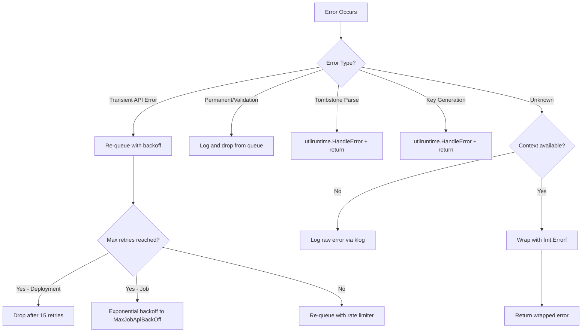
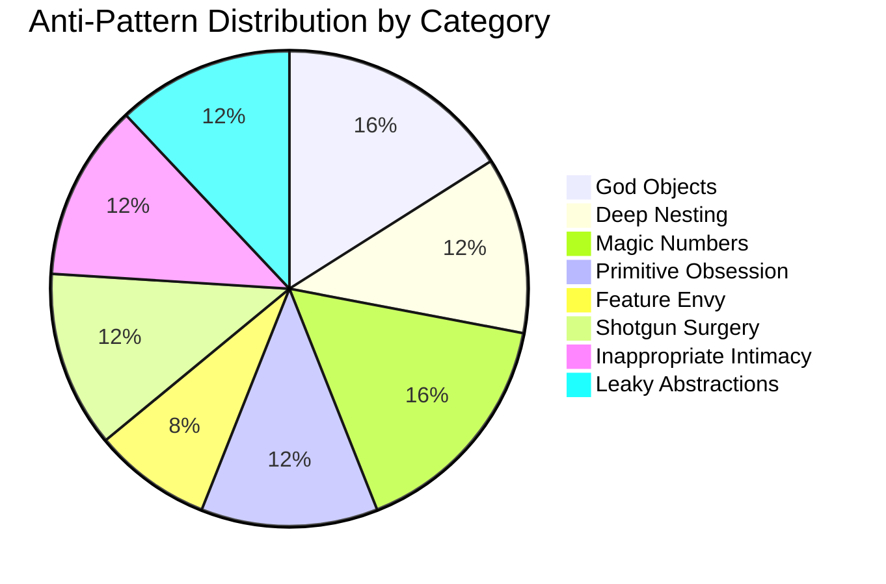

# Design Quality Assessment

**Document ID:** 03_DESIGN_QUALITY  
**Category:** Design  
**Risk Rating:** Medium  
**Last Updated:** 2024  
**Finding ID Prefix:** DESIGN-NNN

---

## Table of Contents

1. [Scope and Methodology](#scope-and-methodology)
2. [Abstraction Quality Assessment Per Module](#abstraction-quality-assessment-per-module)
3. [Error Handling Pattern Catalog](#error-handling-pattern-catalog)
4. [Input Validation Coverage Map](#input-validation-coverage-map)
5. [Anti-Pattern Catalog](#anti-pattern-catalog)
6. [Configuration vs. Hardcoded Values Inventory](#configuration-vs-hardcoded-values-inventory)
7. [Summary of Findings](#summary-of-findings)
8. [Related Documents](#related-documents)

---

## Scope and Methodology

### Analysis Scope

This document provides a **structured inventory of abstraction quality, error handling patterns, input validation coverage, anti-pattern instances, and configuration vs. hardcoded values** across the Kubernetes codebase. The analysis scope encompasses:

- **`pkg/`** — 30 top-level packages (~3,100 non-test Go files)
- **`cmd/`** — 25+ CLI entrypoint commands
- **`plugin/pkg/admission/`** — 25+ admission controller plugins
- **`staging/src/k8s.io/`** — 31 staging modules (for cross-module consistency analysis)

### Methodology

All findings are derived from direct code inspection. Where conclusions are drawn from pattern absence or structural inference, the `INFERRED` flag is explicitly applied. Every finding uses the structured format defined in the project audit methodology.

### Conventions

- **Source citations** follow the format: `Source: path/to/file.go:LineRange`
- **Finding IDs** use the `DESIGN-NNN` prefix
- **Inference flags**: `CONFIRMED` (directly observed) or `INFERRED` (pattern-based conclusion)
- **Recommendation Refs** cross-reference `08_IMPROVEMENT_ROADMAP.md`

---

## Abstraction Quality Assessment Per Module

### pkg/controller/ — Controller Pattern Adherence

**Overall Assessment: High Quality with Minor Inconsistencies**

The controller subsystem demonstrates a well-established pattern across 30+ controllers. Each controller follows the `New<Controller>`, `Run`, `sync<Resource>` triad pattern, with shared infrastructure from `k8s.io/kubernetes/pkg/controller`.

#### Consistent Construction Pattern

All major controllers follow the factory pattern:

```
Source: pkg/controller/deployment/deployment_controller.go:102-159
```

The `NewDeploymentController` function constructs a `DeploymentController` by accepting informers and client, wiring event handlers, and assigning a `syncHandler` function pointer. This pattern is replicated across:

- `pkg/controller/job/job_controller.go:172-241` — `NewController` (note: the type name is simply `Controller` rather than `JobController`)
- `pkg/controller/statefulset/stateful_set.go:87-163` — `NewStatefulSetController`
- `pkg/controller/replicaset/replica_set.go:140-227` — `NewReplicaSetController` (with `NewBaseController` for shared logic with ReplicationController)
- `pkg/controller/garbagecollector/garbagecollector.go:83-118` — `NewGarbageCollector` (with `NewComposedGarbageCollector` inner construction)

#### Run Pattern Consistency

All controllers follow the standard lifecycle:

1. `defer utilruntime.HandleCrash()` at the start of `Run`
2. Start event broadcaster with structured logging at verbosity level 3
3. Wait for informer cache sync
4. Launch workers via `wait.UntilWithContext` with `time.Second` tick
5. Block on `<-ctx.Done()`

| Controller | Run Signature | HandleCrash Variant | Worker Pattern |
|-----------|--------------|-------------------|---------------|
| Deployment | `Run(ctx, workers int)` | `HandleCrash()` | `wait.UntilWithContext` |
| Job | `Run(ctx, workers int)` | `HandleCrash()` | `wait.UntilWithContext` |
| StatefulSet | `Run(ctx, workers int)` | `HandleCrashWithContext(ctx)` | `wait.UntilWithContext` |
| ReplicaSet | `Run(ctx, workers int)` | `HandleCrash()` | `wait.UntilWithContext` |
| GarbageCollector | `Run(ctx, workers int, initialSyncTimeout)` | `HandleCrash()` | `wait.UntilWithContext` |

| Finding ID | Category | Title | Source Location | Description | Evidence | Impact | Inference Flag | Recommendation Ref |
|-----------|----------|-------|----------------|-------------|----------|--------|---------------|-------------------|
| DESIGN-001 | Design | Inconsistent HandleCrash variant across controllers | `pkg/controller/statefulset/stateful_set.go:168` vs `pkg/controller/deployment/deployment_controller.go:164` | StatefulSet controller uses `HandleCrashWithContext(ctx)` while other controllers use `HandleCrash()`. This reflects an ongoing migration but creates a cross-controller inconsistency. | StatefulSet: `defer utilruntime.HandleCrashWithContext(ctx)` vs Deployment: `defer utilruntime.HandleCrash()` | Minor — both are valid, but inconsistency complicates grep-based auditing and pattern enforcement. | CONFIRMED | 08_IMPROVEMENT_ROADMAP.md § Standardization |
| DESIGN-002 | Design | Controller type naming inconsistency | `pkg/controller/job/job_controller.go:84` | The Job controller type is named simply `Controller` rather than `JobController`, diverging from the `DeploymentController`, `StatefulSetController`, `ReplicaSetController`, `GarbageCollector` naming convention. | `type Controller struct` (job) vs `type DeploymentController struct` (deployment) | Medium — reduced code navigability; package-qualified names like `job.Controller` are less self-documenting than `job.JobController` in external references. | CONFIRMED | 08_IMPROVEMENT_ROADMAP.md § Naming Consistency |
| DESIGN-003 | Design | GarbageCollector Run signature diverges from standard | `pkg/controller/garbagecollector/garbagecollector.go:132` | The GarbageCollector's `Run` method accepts an additional `initialSyncTimeout time.Duration` parameter not present in other controllers. | `func (gc *GarbageCollector) Run(ctx context.Context, workers int, initialSyncTimeout time.Duration)` | Low — justified by unique synchronization requirements, but breaks the uniform `Run(ctx, workers)` interface contract. | CONFIRMED | 08_IMPROVEMENT_ROADMAP.md § Controller Interface |

#### ControllerExpectations Abstraction

The expectations pattern (`controller.ControllerExpectations`) is used by Deployment, Job, and ReplicaSet controllers to track anticipated pod creates/deletes. The abstraction is well-bounded with clear `Satisfied`, `ExpectCreations`, `ExpectDeletions` semantics defined in `pkg/controller/controller_utils.go`.

### pkg/kubelet/ — Kubelet Subsystem Abstraction

**Overall Assessment: Moderate — God Object Risk Identified**

The kubelet subsystem is the largest component in the codebase (675 Go files). The main `Kubelet` struct at `pkg/kubelet/kubelet.go:1132` exhibits significant God Object characteristics (detailed in the Anti-Pattern Catalog below).

#### Sub-Package Interface Boundaries

The kubelet delegates to well-defined sub-managers:

| Sub-Package | Interface | Implementation | Boundary Quality |
|------------|-----------|---------------|-----------------|
| `cm/` | `ContainerManager` | `containerManagerImpl` | Good — clean interface with `Start`, `GetResources`, `UpdateQOSCgroups` |
| `eviction/` | `Manager` | `managerImpl` | Good — `Start`, `Admit`, `IsUnder*Pressure` methods |
| `images/` | `ImageGCManager` | Internal implementation | Good — focused image lifecycle management |
| `status/` | `status.Manager` | Internal implementation | Good — pod status synthesis |
| `volumemanager/` | `VolumeManager` | Internal implementation | Good — volume lifecycle management |
| `prober/` | `prober.Manager` | Internal implementation | Good — probe lifecycle management |

| Finding ID | Category | Title | Source Location | Description | Evidence | Impact | Inference Flag | Recommendation Ref |
|-----------|----------|-------|----------------|-------------|----------|--------|---------------|-------------------|
| DESIGN-004 | Design | Kubelet Dependencies struct as temporary dependency injection | `pkg/kubelet/kubelet.go:306-340` | The `Dependencies` struct is explicitly labeled as "a temporary solution for grouping these objects while we figure out a more comprehensive dependency injection story for the Kubelet." This temporary solution has persisted since 2015. | `// This is a temporary solution for grouping these objects while we figure out a more comprehensive dependency injection story for the Kubelet.` | Medium — ad-hoc DI pattern lacks lifecycle management, makes testing harder, and the "temporary" label discourages investment in improving it. | CONFIRMED | 08_IMPROVEMENT_ROADMAP.md § Kubelet Architecture |
| DESIGN-005 | Design | NewMainKubelet accepts 27 parameters | `pkg/kubelet/kubelet.go:422-448` | The constructor function `NewMainKubelet` accepts 27 individual parameters, making the function signature extremely long and error-prone. | `func NewMainKubelet(ctx, kubeCfg, kubeDeps, crOptions, hostname, nodeName, nodeIPs, providerID, cloudProvider, certDirectory, rootDirectory, podLogsDirectory, imageCredentialProviderConfigPath, imageCredentialProviderBinDir, registerNode, registerWithTaints, allowedUnsafeSysctls, experimentalMounterPath, kernelMemcgNotification, experimentalNodeAllocatableIgnoreEvictionThreshold, minimumGCAge, maxPerPodContainerCount, maxContainerCount, nodeLabels, nodeStatusMaxImages, seccompDefault)` | High — parameter explosion is a strong design smell; adding new configuration requires modifying this signature. Many of these parameters could be grouped into configuration structs. | CONFIRMED | 08_IMPROVEMENT_ROADMAP.md § Kubelet Architecture |

### pkg/scheduler/ — Scheduler Framework Abstraction

**Overall Assessment: High Quality**

The scheduler framework demonstrates one of the strongest abstractions in the codebase. The plugin-based extension point architecture (`PreFilter`, `Filter`, `PostFilter`, `PreScore`, `Score`, `Reserve`, `PreBind`, `Bind`, `PostBind`, `Permit`) provides clean separation of concerns.

```
Source: pkg/scheduler/framework/runtime/framework.go:57-105
```

The `frameworkImpl` struct organizes plugins into typed slices for each extension point, enabling clear phase-driven execution. Each extension point corresponds to a well-defined interface in the `k8s.io/kube-scheduler/framework` package.

| Finding ID | Category | Title | Source Location | Description | Evidence | Impact | Inference Flag | Recommendation Ref |
|-----------|----------|-------|----------------|-------------|----------|--------|---------------|-------------------|
| DESIGN-006 | Design | Scheduler framework uses functional options pattern cleanly | `pkg/scheduler/framework/runtime/framework.go:140-200` | The framework uses the `Option func(*frameworkOptions)` pattern for configuration, with `WithClientSet`, `WithKubeConfig`, `WithEventRecorder`, `WithInformerFactory` etc. This is idiomatic Go and provides a clean extensibility model. | `type Option func(*frameworkOptions)` followed by `func WithClientSet(clientSet clientset.Interface) Option` | Positive finding — exemplary use of the functional options pattern. | CONFIRMED | N/A |
| DESIGN-007 | Design | Scheduling cycle phases cleanly separated | `pkg/scheduler/schedule_one.go:65-136` | `ScheduleOne` clearly separates synchronous scheduling (`schedulingCycle`) from asynchronous binding (`bindingCycle` in a goroutine). Each phase delegates to framework extension points. | `scheduleResult, assumedPodInfo, status := sched.schedulingCycle(...)` followed by `go func() { status := sched.bindingCycle(...) }()` | Positive finding — clean separation of synchronous and asynchronous operations. | CONFIRMED | N/A |

### pkg/registry/ — REST Storage Pattern

**Overall Assessment: Good — Consistent Template Pattern with High Wiring Complexity**

The registry layer applies the `genericregistry.Store` composition pattern consistently across 20+ API groups. Each resource follows the NewREST/NewStorage pattern with strategy injection.

```
Source: pkg/registry/core/rest/storage_core.go:154-315
```

The `NewRESTStorage` method in `storage_core.go` creates REST storage implementations for all core resources (pods, services, nodes, endpoints, PVs, PVCs, etc.) by composing `genericregistry.Store` with resource-specific strategies.

| Finding ID | Category | Title | Source Location | Description | Evidence | Impact | Inference Flag | Recommendation Ref |
|-----------|----------|-------|----------------|-------------|----------|--------|---------------|-------------------|
| DESIGN-008 | Design | Core REST storage wiring function is a 400-line orchestrator | `pkg/registry/core/rest/storage_core.go:154-565` | The `NewRESTStorage` method is responsible for creating and wiring 15+ resource storage instances in a single function. At ~410 lines, it serves as a monolithic registration point. | Method creates podStorage, serviceRESTStorage, nodeStorage, endpointsStorage, pvStorage, pvcStorage, limitRangeStorage, podTemplateStorage, serviceAccountStorage, controllerStorage, and maps them all into the storage map. | Medium — changes to any core resource storage require modifying this large function; high risk of merge conflicts in a multi-contributor project. | CONFIRMED | 08_IMPROVEMENT_ROADMAP.md § Registry Architecture |

### pkg/proxy/ — Proxier Abstraction

**Overall Assessment: Good Interface, Platform-Specific Complexity**

The proxy subsystem defines the `proxy.Provider` interface implemented by iptables, ipvs, nftables, and winkernel proxiers. The `MetaProxier` pattern enables dual-stack (IPv4/IPv6) composition.

```
Source: pkg/proxy/iptables/proxier.go:133-213
```

| Finding ID | Category | Title | Source Location | Description | Evidence | Impact | Inference Flag | Recommendation Ref |
|-----------|----------|-------|----------------|-------------|----------|--------|---------------|-------------------|
| DESIGN-009 | Design | Proxier struct carries both mutable state and configuration | `pkg/proxy/iptables/proxier.go:134-210` | The `Proxier` struct mixes mutable synchronized state (service/endpoint maps, sync state) with effectively-const configuration (iptables interface, masquerade settings, node name). A comment at line 161 acknowledges: "These are effectively const and do not need the mutex to be held." | 77 fields in the struct, with a `mu sync.Mutex` protecting a subset and a comment separating "effectively const" fields. | Medium — the combined mutable/immutable nature increases cognitive load and risk of incorrect synchronization. | CONFIRMED | 08_IMPROVEMENT_ROADMAP.md § Proxy Architecture |

### pkg/volume/ — Volume Plugin Abstraction

**Overall Assessment: Good — Deep Interface Hierarchy**

The volume plugin system defines a layered interface hierarchy starting from `VolumePlugin` and extending through specialized interfaces.

```
Source: pkg/volume/plugins.go:128-181
```

Interface hierarchy:
- `VolumePlugin` — base interface (Init, GetPluginName, CanSupport, NewMounter, NewUnmounter)
- `PersistentVolumePlugin` extends `VolumePlugin` (GetAccessModes)
- `RecyclableVolumePlugin` extends `VolumePlugin` (Recycle)
- `DeletableVolumePlugin` extends `VolumePlugin` (NewDeleter)
- `ProvisionableVolumePlugin` extends `VolumePlugin` (NewProvisioner)
- `AttachableVolumePlugin` extends `DeviceMountableVolumePlugin` (NewAttacher, NewDetacher, CanAttach)
- `DeviceMountableVolumePlugin` extends `VolumePlugin` (NewDeviceMounter, NewDeviceUnmounter)
- `ExpandableVolumePlugin` extends `VolumePlugin`

| Finding ID | Category | Title | Source Location | Description | Evidence | Impact | Inference Flag | Recommendation Ref |
|-----------|----------|-------|----------------|-------------|----------|--------|---------------|-------------------|
| DESIGN-010 | Design | VolumePluginMgr has 22 methods acting as a central registry | `pkg/volume/plugins.go:425+` | `VolumePluginMgr` has 22 methods including `FindPluginBySpec`, `FindPluginByName`, `FindPersistentPluginBySpec`, `FindAttachablePluginBySpec`, `FindExpandablePluginBySpec`, etc. — one finder method per plugin interface type. | 22 methods on `VolumePluginMgr`, each performing name-based or spec-based lookup with type-specific filtering. | Low — the large method count is a natural consequence of the interface hierarchy, but the repetitive lookup pattern could be simplified with generics. | CONFIRMED | 08_IMPROVEMENT_ROADMAP.md § Volume Architecture |

---

## Error Handling Pattern Catalog

### Overview of Error Handling Patterns

The Kubernetes codebase employs seven distinct error handling patterns across its major subsystems. This catalog documents each pattern, its prevalence, and cross-module divergences.

### Pattern 1: Standard `if err != nil` Return

The most common pattern across all modules. Error is checked and propagated to the caller.

```go
// Pattern: Standard return
if err != nil {
    return err
}
```

**Prevalence:** Universal. Found in every source file analyzed.

### Pattern 2: Error Wrapping with `fmt.Errorf("%w")`

Used to add context to errors while preserving the error chain for `errors.Is`/`errors.As`.

```go
// Pattern: Wrapping with context
Source: pkg/controller/job/job_controller.go:208
return nil, fmt.Errorf("adding Job event handler: %w", err)
```

**Prevalence:** Increasingly common in newer code (Job controller uses it extensively); older controllers use `%v` formatting.

| Finding ID | Category | Title | Source Location | Description | Evidence | Impact | Inference Flag | Recommendation Ref |
|-----------|----------|-------|----------------|-------------|----------|--------|---------------|-------------------|
| DESIGN-011 | Design | Inconsistent error wrapping: %w vs %v across controllers | `pkg/controller/job/job_controller.go:208` vs `pkg/controller/deployment/deployment_controller.go:409` | The Job controller consistently uses `%w` for error wrapping (e.g., `fmt.Errorf("adding Job event handler: %w", err)`), while the Deployment controller uses `%v` (e.g., `fmt.Errorf("couldn't get key for object %#v: %v", deployment, err)`). | Job: `fmt.Errorf("adding Job event handler: %w", err)` — Deployment: `fmt.Errorf("couldn't get key for object %#v: %v", deployment, err)` | Medium — `%v` discards the error chain, preventing upstream code from using `errors.Is`/`errors.As` to match specific error types. This divergence reflects a historical migration that is incomplete. | CONFIRMED | 08_IMPROVEMENT_ROADMAP.md § Error Handling Standardization |

### Pattern 3: Error Type Assertions (`errors.Is`, `errors.As`)

Used for type-safe error matching against sentinel errors or specific error types.

```go
// Pattern: Type assertion
Source: pkg/kubelet/kubelet_pods.go:151-152
var unknownUserErr user.UnknownUserError
if goerrors.As(err, &unknownUserErr) {
```

**Prevalence:** Moderate. Present in kubelet pod management and newer code paths.

### Pattern 4: Sentinel Errors

Package-level error variables used as constants for comparison.

```go
// Pattern: Sentinel error
Source: pkg/volume/plugins.go:72
var ErrNoPluginMatched = errors.New("no volume plugin matched")
```

**Prevalence:** Common in volume plugins, API error handling, and scheduler error paths (e.g., `ErrNoNodesAvailable`).

### Pattern 5: Silent Error Swallowing

Errors that are intentionally or accidentally discarded without propagation or logging.

| Finding ID | Category | Title | Source Location | Description | Evidence | Impact | Inference Flag | Recommendation Ref |
|-----------|----------|-------|----------------|-------------|----------|--------|---------------|-------------------|
| DESIGN-012 | Design | Silent error swallowing in deployment deletePod | `pkg/controller/deployment/deployment_controller.go:388-395` | When listing replica sets or getting the pod map for a deployment fails in `deletePod`, the errors are silently swallowed with bare `return` statements. No error is logged or propagated. | `rsList, err := util.ListReplicaSets(d, ...); if err != nil { return }` followed by `podMap, err := dc.getPodMapForDeployment(d, rsList); if err != nil { return }` | Medium — silent failures in the delete path can lead to missed reconciliation. If the API server is temporarily unavailable, the deployment controller will not retry this particular pod deletion trigger. | CONFIRMED | 08_IMPROVEMENT_ROADMAP.md § Error Handling Standardization |
| DESIGN-013 | Design | Error discarded in kubelet eviction synchronize | `pkg/kubelet/eviction/eviction_manager.go:192` | In the `Start` method's `thresholdHandler`, the return value from `m.synchronize` is discarded: `_, _ = m.synchronize(ctx, diskInfoProvider, podFunc)`. | `_, _ = m.synchronize(ctx, diskInfoProvider, podFunc)` | Low — this particular code path is the threshold notification handler where synchronize is triggered as a side-effect; the main loop handles errors. However, the explicit `_` discard suggests awareness of the dropped error. | CONFIRMED | 08_IMPROVEMENT_ROADMAP.md § Error Handling Standardization |
| DESIGN-014 | Design | Error ignored in kubelet getKubeletMappings for gid retrieval | `pkg/kubelet/kubelet_pods.go:175` | When retrieving additional gids for the kubelet user, the error message omits the `%w` wrapping used for uid retrieval on the line above. | Line 171: `fmt.Errorf("error retrieving additional uids for user %q: %w", kubeletUser, err)` vs Line 175: `fmt.Errorf("error retrieving additional gids for user %q", kubeletUser)` — the second omits `err` entirely. | Medium — the gid error message loses the underlying error cause, making debugging harder. | CONFIRMED | 08_IMPROVEMENT_ROADMAP.md § Error Handling Standardization |

### Pattern 6: Error Logging Without Propagation

Errors that are logged (typically via `klog`) but not returned to the caller.

```go
// Pattern: Log and continue
Source: pkg/scheduler/schedule_one.go:88-91
logger.Error(err, "Error occurred")
sched.SchedulingQueue.Done(pod.UID)
return
```

**Prevalence:** Common in event-driven code paths where the caller is a work loop and errors are non-fatal.

### Pattern 7: `utilruntime.HandleError` — Kubernetes-Specific Error Reporting

The Kubernetes-specific error reporting mechanism that logs errors and optionally invokes registered error handlers.

```go
// Pattern: HandleError
Source: pkg/controller/deployment/deployment_controller.go:211
utilruntime.HandleError(fmt.Errorf("couldn't get object from tombstone %#v", obj))
```

**Prevalence:** Very high. Used in all controller tombstone handling, key generation failures, and non-recoverable event handler errors.

| Finding ID | Category | Title | Source Location | Description | Evidence | Impact | Inference Flag | Recommendation Ref |
|-----------|----------|-------|----------------|-------------|----------|--------|---------------|-------------------|
| DESIGN-015 | Design | Tombstone error handling pattern is copy-pasted across all controllers | Multiple locations | Every controller duplicates the same tombstone extraction pattern: attempt type assertion, fall back to `DeletedFinalStateUnknown`, attempt nested type assertion, call `utilruntime.HandleError` on failure. | Deployment: lines 207-222, StatefulSet: similar pattern, ReplicaSet: similar pattern, Job: `job_controller.go:443-457` — identical structure with different type names. | Low — the pattern works correctly, but the duplicated ~15 lines per delete handler is a maintenance burden. A shared helper could reduce this. | CONFIRMED | 08_IMPROVEMENT_ROADMAP.md § Controller Utilities |

### Cross-Module Error Handling Divergence

| Operation | Deployment Controller | Job Controller | StatefulSet Controller | Impact |
|-----------|----------------------|---------------|----------------------|--------|
| Informer AddEventHandler error | Not checked (pre-error-return API) | Checked with `%w` wrapping | Not checked (pre-error-return API) | Medium — Job controller benefits from newer API; older controllers silently assume success |
| Tombstone extraction failure | `utilruntime.HandleError` with `%v` | `utilruntime.HandleError` with `%v` | `utilruntime.HandleError` with `%v` | Low — consistent within this specific pattern |
| Error wrapping style | `fmt.Errorf("...: %v", err)` | `fmt.Errorf("...: %w", err)` | `fmt.Errorf("...: %v", err)` | Medium — breaks error chain in older controllers |
| Queue key generation failure | `utilruntime.HandleError` then return | `utilruntime.HandleError` then return | N/A (uses enqueue helper) | Low — consistent pattern |
| API server call failure in sync | Re-queue via rate limiter | Re-queue via rate limiter | Re-queue via rate limiter | Low — consistent pattern |



---

## Input Validation Coverage Map

### API Type Validation

The Kubernetes codebase implements comprehensive validation for API types in dedicated `validation/` packages under `pkg/apis/`. Each API group has a corresponding validation package.

| Component | Validation Location | Coverage Level | Notable Gaps |
|-----------|-------------------|---------------|-------------|
| Core API types (Pods, Services, Nodes) | `pkg/apis/core/validation/validation.go` | Comprehensive | None observed — deeply validated with field-level checks |
| Apps API types (Deployments, StatefulSets) | `pkg/apis/apps/validation/validation.go` | Comprehensive | None observed |
| Batch API types (Jobs, CronJobs) | `pkg/apis/batch/validation/validation.go` | Comprehensive | None observed |
| Networking API types | `pkg/apis/networking/validation/validation.go` | Comprehensive | None observed |
| RBAC API types | `pkg/apis/rbac/validation/validation.go` | Comprehensive | None observed |

### CLI Flag Validation

| Component | Validation Location | Coverage Level | Notable Gaps |
|-----------|-------------------|---------------|-------------|
| kube-apiserver | `cmd/kube-apiserver/app/options/` | High | Cobra framework provides basic type validation |
| kube-controller-manager | `cmd/kube-controller-manager/app/options/` | High | Controller-specific options validated at startup |
| kube-scheduler | `cmd/kube-scheduler/app/options/` | High | Scheduler config validated via API schema |
| kubelet | `cmd/kubelet/app/options/` | High | KubeletConfiguration validated via API types |
| kube-proxy | `cmd/kube-proxy/app/` | High | ProxyConfiguration validated via API schema |

### Admission Controller Validation

| Component | Validation Location | Coverage Level | Notable Gaps |
|-----------|-------------------|---------------|-------------|
| LimitRanger | `plugin/pkg/admission/limitranger/admission.go:110-155` | High | Validates limits against LimitRange; uses both Admit (mutating) and Validate (validating) phases |
| ResourceQuota | `plugin/pkg/admission/resourcequota/` | High | Comprehensive resource accounting |
| PodSecurity | `plugin/pkg/admission/security/podsecurity/` | High | Enforces Pod Security Standards |
| ServiceAccount | `plugin/pkg/admission/serviceaccount/` | High | Token/mount validation |

| Finding ID | Category | Title | Source Location | Description | Evidence | Impact | Inference Flag | Recommendation Ref |
|-----------|----------|-------|----------------|-------------|----------|--------|---------------|-------------------|
| DESIGN-016 | Design | LimitRanger liveLookupCache uses hardcoded TTL and size | `plugin/pkg/admission/limitranger/admission.go:199-209` | The LimitRanger creates a live lookup LRU cache with hardcoded size 10000 and TTL of 30 seconds. These operational parameters are not configurable. | `liveLookupCache := lru.New(10000)` and `liveTTL: time.Duration(30 * time.Second)` | Low — for most deployments these defaults are adequate, but very large clusters with many namespaces may benefit from tunable cache sizes. | CONFIRMED | 08_IMPROVEMENT_ROADMAP.md § Configuration Externalization |

### Runtime Parameter Validation

| Component | Validation Approach | Coverage Level | Notable Gaps |
|-----------|-------------------|---------------|-------------|
| Kubelet configuration | `kubeletconfiginternal.KubeletConfiguration` validated at startup | High | Some parameters validated lazily during operation |
| Scheduler configuration | `config.KubeSchedulerConfiguration` validated via API validation | High | Plugin-specific validation delegated to plugin Init |
| Controller manager | Per-controller options validated at construction time | Medium | Validation is scattered across individual controller constructors |

| Finding ID | Category | Title | Source Location | Description | Evidence | Impact | Inference Flag | Recommendation Ref |
|-----------|----------|-------|----------------|-------------|----------|--------|---------------|-------------------|
| DESIGN-017 | Design | NewMainKubelet validates some parameters inline, others deferred | `pkg/kubelet/kubelet.go:451-464` | The constructor validates `rootDirectory`, `podLogsDirectory`, and `SyncFrequency` upfront, but many other parameters (e.g., image GC thresholds, eviction thresholds) are validated later during operation or not at all. | `if rootDirectory == "" { return nil, fmt.Errorf(...) }` but `maxPerPodContainerCount`, `maxContainerCount`, `nodeStatusMaxImages` are accepted without bounds checking. | Medium — deferred validation can lead to late runtime failures that are harder to diagnose than startup failures. | INFERRED | 08_IMPROVEMENT_ROADMAP.md § Input Validation |

---

## Anti-Pattern Catalog

This section provides a comprehensive catalog of design anti-patterns observed across the Kubernetes codebase. Each anti-pattern type is documented with all observed instances.

### God Objects

God objects are types or packages that accumulate too many responsibilities, becoming central points of coupling and change.

| Finding ID | Category | Title | Source Location | Description | Evidence | Impact | Inference Flag | Recommendation Ref |
|-----------|----------|-------|----------------|-------------|----------|--------|---------------|-------------------|
| DESIGN-018 | Design | Kubelet struct is a God Object with ~110 fields and 169 methods | `pkg/kubelet/kubelet.go:1132-1520` | The `Kubelet` struct contains approximately 110 non-comment fields spanning pod management, volume management, container runtime, node status, eviction, probing, image management, logging, certificate management, DNS configuration, service watching, and more. It has 169 methods distributed across `kubelet.go`, `kubelet_pods.go`, `kubelet_node_status.go`, and other files. | Struct defined at line 1132, closing brace at approximately line 1520 (388 lines including comments). Fields include: `podManager`, `podWorkers`, `evictionManager`, `probeManager`, `secretManager`, `configMapManager`, `volumeManager`, `statusManager`, `allocationManager`, `containerRuntime`, `cadvisor`, `dnsConfigurer`, `serviceLister`, `volumePluginMgr`, and 90+ more. | Critical — the Kubelet struct is the single highest-coupling point in the codebase. Any change to pod lifecycle, container management, volume handling, node status, or resource management potentially touches this struct. New contributors face a steep learning curve. | CONFIRMED | 08_IMPROVEMENT_ROADMAP.md § Kubelet Decomposition |
| DESIGN-019 | Design | Core REST storage wiring is a single-function God orchestrator | `pkg/registry/core/rest/storage_core.go:154-565` | The `NewRESTStorage` method in `legacyProvider` creates and wires all core API resource storage implementations (~15 resources) in a single 410-line function, making it the central wiring point for the core API group. | Function creates: `podStorage`, `nodeStorage`, `serviceRESTStorage`, `endpointsStorage`, `pvStorage`, `pvcStorage`, `limitRangeStorage`, `podTemplateStorage`, `serviceAccountStorage`, `controllerStorage`, etc., then maps them into `storage["pods"]`, `storage["services"]`, etc. | Medium — high merge conflict risk; any new core resource or subresource requires editing this function. However, this pattern is common in API server resource registration. | CONFIRMED | 08_IMPROVEMENT_ROADMAP.md § Registry Architecture |
| DESIGN-020 | Design | VolumePluginMgr with 22 methods as central volume registry | `pkg/volume/plugins.go:425+` | The `VolumePluginMgr` struct serves as the central registry for all volume plugins with 22 methods, each performing name-based or spec-based lookup for a specific plugin interface type. The file itself is 1031 lines. | 22 methods including `FindPluginBySpec`, `FindPluginByName`, `FindPersistentPluginBySpec`, `FindAttachablePluginBySpec`, `FindAttachablePluginByName`, `FindExpandablePluginBySpec`, `FindExpandablePluginByName`, `FindMapperPluginBySpec`, `FindMapperPluginByName`, etc. | Low — the repetitive pattern suggests this could benefit from a generic lookup mechanism, but the current approach is functional and type-safe. | CONFIRMED | 08_IMPROVEMENT_ROADMAP.md § Volume Architecture |
| DESIGN-021 | Design | containerManagerImpl aggregates 7+ sub-managers | `pkg/kubelet/cm/container_manager_linux.go:101-141` | The `containerManagerImpl` struct contains `cgroupManager`, `deviceManager`, `cpuManager`, `memoryManager`, `topologyManager`, `draManager`, `qosContainerManager`, and additional operational state. It serves as an orchestration hub for all container resource management. | Struct fields: `cadvisorInterface`, `mountUtil`, `NodeConfig`, `status`, `systemContainers`, `subsystems`, `nodeInfo`, `cgroupManager`, `capacity`, `cgroupRoot`, `recorder`, `qosContainerManager`, `deviceManager`, `cpuManager`, `memoryManager`, `topologyManager`, `draManager`, `kubeClient`, `resourceUpdates` | Medium — while delegation to sub-managers is appropriate, the container manager still accumulates coordination complexity. | CONFIRMED | 08_IMPROVEMENT_ROADMAP.md § Kubelet Architecture |

### Deep Nesting

Deeply nested conditional and loop structures that reduce readability.

| Finding ID | Category | Title | Source Location | Description | Evidence | Impact | Inference Flag | Recommendation Ref |
|-----------|----------|-------|----------------|-------------|----------|--------|---------------|-------------------|
| DESIGN-022 | Design | Deep nesting in deployment deletePod with 5 levels | `pkg/controller/deployment/deployment_controller.go:362-403` | The `deletePod` method contains 5 levels of nesting: tombstone extraction (2 levels of type assertion), then strategy type check, then replica set listing, then pod map iteration. | `if !ok { tombstone... if !ok { HandleError... return } d, ok = ... if !ok { HandleError... return } } ... if d.Spec.Strategy.Type == RecreateDeploymentStrategyType { rsList, err := ... if err != nil { return } podMap, err := ... if err != nil { return } for _, podList := range podMap { numPods += len(podList) } if numPods == 0 { dc.enqueueDeployment(d) } }` | Low — the nesting is functional but makes the control flow harder to follow. Early returns help somewhat. | CONFIRMED | 08_IMPROVEMENT_ROADMAP.md § Code Clarity |
| DESIGN-023 | Design | Deep nesting in eviction manager Admit with 4 levels | `pkg/kubelet/eviction/eviction_manager.go:146-185` | The `Admit` method contains nested conditionals checking node conditions, pod criticality, QoS class, and taint tolerations, reaching 4 levels of nesting. | `if len(m.nodeConditions) == 0 { return Admit } if IsCriticalPod { return Admit } if nodeOnlyHasMemoryPressure && len(m.nodeConditions) == 1 { if notBestEffort { return Admit } if TolerationsTolerateTaint(...) { return Admit } } return Reject` | Low — the logic is correct but the nested conditionals could be flattened using early returns or a table-driven approach. | CONFIRMED | 08_IMPROVEMENT_ROADMAP.md § Code Clarity |
| DESIGN-024 | Design | Deep nesting in scheduler schedulingCycle error handling | `pkg/scheduler/schedule_one.go:140-260` | The `schedulingCycle` method handles scheduling errors with nested type assertions (`FitError`), post-filter execution, reserve plugin cleanup, and permit plugin cleanup, each with multi-level error handling. | After `SchedulePod` fails: check `ErrNoNodesAvailable`, then `FitError` type assertion, then `HasPostFilterPlugins`, then `RunPostFilterPlugins`, each branch creating a different `ScheduleResult`. After `assume`: `RunReservePluginsReserve` -> on failure: `RunReservePluginsUnreserve` + `ForgetPod` + check `IsRejected`. | Medium — the scheduling cycle is inherently complex, but the error handling creates deeply nested paths that are difficult to reason about for correctness. | CONFIRMED | 08_IMPROVEMENT_ROADMAP.md § Scheduler Maintainability |

### Magic Numbers

Numeric literals used without named constants or documentation.

| Finding ID | Category | Title | Source Location | Description | Evidence | Impact | Inference Flag | Recommendation Ref |
|-----------|----------|-------|----------------|-------------|----------|--------|---------------|-------------------|
| DESIGN-025 | Design | Hardcoded structured logging verbosity level 3 across all controllers | Multiple locations | Every controller's `Run` method calls `eventBroadcaster.StartStructuredLogging(3)` with the magic number 3. This verbosity level is undocumented and unexplained. | Deployment: `dc.eventBroadcaster.StartStructuredLogging(3)` at line 167. Job: `jm.broadcaster.StartStructuredLogging(3)` at line 249. StatefulSet: `ssc.eventBroadcaster.StartStructuredLogging(3)` at line 171. GarbageCollector: `gc.eventBroadcaster.StartStructuredLogging(3)` at line 136. | Low — the value is consistent, but its semantic meaning (why 3 and not 2 or 4?) is undocumented. A named constant would clarify intent. | CONFIRMED | 08_IMPROVEMENT_ROADMAP.md § Magic Number Elimination |
| DESIGN-026 | Design | Scheduler uses magic number 10 for metrics sampling percentage | `pkg/scheduler/schedule_one.go:51` | The constant `pluginMetricsSamplePercent = 10` is defined locally, which is good practice. However, the comment "semi-arbitrary value" for `minFeasibleNodesToFind = 100` at line 56 explicitly acknowledges the arbitrary nature of the value. | `pluginMetricsSamplePercent = 10` and `minFeasibleNodesToFind = 100` with comment "This is a semi-arbitrary value to ensure that a certain minimum of nodes are checked for feasibility." | Low — the values are at least named constants with documenting comments, making this a mild concern. The "semi-arbitrary" admission is honest but suggests the values may need empirical tuning. | CONFIRMED | 08_IMPROVEMENT_ROADMAP.md § Magic Number Elimination |
| DESIGN-027 | Design | Kubelet defines 20+ numeric constants in a single block | `pkg/kubelet/kubelet.go:148-240` | The kubelet defines over 20 numeric constants including timeouts, periods, capacities, and thresholds in a single const block. While they are named constants (positive), many use unexplained values. | `maxWaitForContainerRuntime = 30 * time.Second`, `nodeStatusUpdateRetry = 5`, `nodeReadyGracePeriod = 120 * time.Second`, `plegChannelCapacity = 1000` (with comment "a bit arbitrary"), `genericPlegRelistPeriod = time.Second * 1`, `eventedPlegMaxStreamRetries = 5`, `backOffPeriod = time.Second * 10`, `minDeadContainerInPod = 1`, `nodeLeaseRenewIntervalFraction = 0.25` | Medium — the constants block is a positive practice, but comments like "a bit arbitrary" and "semi-arbitrary" indicate values that were selected without rigorous analysis. | CONFIRMED | 08_IMPROVEMENT_ROADMAP.md § Configuration Externalization |
| DESIGN-028 | Design | Proxy uses magic number 1000 for large cluster threshold | `pkg/proxy/iptables/proxier.go:87` | The constant `largeClusterEndpointsThreshold = 1000` switches iptables behavior between "debuggable" and "performant" modes. The threshold value is not configurable. | `largeClusterEndpointsThreshold = 1000` with comment "the number of endpoints at which we switch into 'large cluster mode'" | Medium — the threshold affects operational behavior (iptables output format) but cannot be tuned by operators. Different environments may have different performance characteristics. | CONFIRMED | 08_IMPROVEMENT_ROADMAP.md § Configuration Externalization |

### Primitive Obsession

Using primitive types where domain-specific types would provide better type safety.

| Finding ID | Category | Title | Source Location | Description | Evidence | Impact | Inference Flag | Recommendation Ref |
|-----------|----------|-------|----------------|-------------|----------|--------|---------------|-------------------|
| DESIGN-029 | Design | Controller queue keys are plain strings without type safety | `pkg/controller/deployment/deployment_controller.go:98` | All controllers use `workqueue.TypedRateLimitingInterface[string]` where the string represents a `namespace/name` key. There is no type-safe key type to prevent mixing keys from different resource types. | `queue workqueue.TypedRateLimitingInterface[string]` — the same `string` type is used for deployment keys, replicaset keys, and job keys, with no compile-time distinction. | Low — the key is produced by `controller.KeyFunc` which provides runtime consistency, but compile-time type safety is absent. The recent introduction of Go generics (`TypedRateLimitingInterface[string]`) shows the typed queue pattern but the key type itself remains a plain string. | CONFIRMED | 08_IMPROVEMENT_ROADMAP.md § Type Safety |
| DESIGN-030 | Design | iptables chain names are typed aliases but proxier uses string operations | `pkg/proxy/iptables/proxier.go:56-88` | Chain names are defined as `utiliptables.Chain` (a type alias for `string`), which provides naming clarity but no enforcement. The chain name construction uses string concatenation and hashing. | `kubeServicesChain utiliptables.Chain = "KUBE-SERVICES"` — Chain is likely `type Chain string` in the utiliptables package. `portProtoHash` at line 649 computes `sha256` of string concatenation for endpoint chain names. | Low — the type alias provides documentation value but no compile-time safety against mixing chain names with arbitrary strings. | CONFIRMED | 08_IMPROVEMENT_ROADMAP.md § Type Safety |
| DESIGN-031 | Design | API types.go uses string constants for namespaces without typed wrapper | `pkg/apis/core/types.go:28-41` | Namespace constants (`NamespaceDefault`, `NamespaceAll`, `NamespaceNone`, `NamespaceSystem`, `NamespacePublic`, `NamespaceNodeLease`) are plain strings. `NamespaceAll` and `NamespaceNone` are both `""`, distinguished only by semantic context. | `NamespaceAll = ""` and `NamespaceNone = ""` — two semantically distinct concepts with identical string values. | Medium — the aliased empty string for two different concepts creates ambiguity. Code that checks `namespace == ""` cannot distinguish "all namespaces" from "no namespace" without additional context. | CONFIRMED | 08_IMPROVEMENT_ROADMAP.md § Type Safety |

### Feature Envy

Functions that access another object's data more than their own.

| Finding ID | Category | Title | Source Location | Description | Evidence | Impact | Inference Flag | Recommendation Ref |
|-----------|----------|-------|----------------|-------------|----------|--------|---------------|-------------------|
| DESIGN-032 | Design | Deployment controller getDeploymentsForReplicaSet delegates entirely to util package | `pkg/controller/deployment/deployment_controller.go:259-275` | The `getDeploymentsForReplicaSet` method's core logic is a single call to `util.GetDeploymentsForReplicaSet(dc.dLister, rs)`. The method adds logging and nil-coalescing but primarily accesses the util package's functionality. | `deployments, err := util.GetDeploymentsForReplicaSet(dc.dLister, rs)` — the controller method is a thin wrapper around the utility function. | Low — this is a reasonable delegation pattern, not severe feature envy. The wrapper provides controller-specific logging. | CONFIRMED | N/A |
| DESIGN-033 | Design | Admission limitranger runLimitFunc accesses admission.Attributes extensively | `plugin/pkg/admission/limitranger/admission.go:120-156` | The `runLimitFunc` method accesses 6 different methods on the `admission.Attributes` parameter: `GetOldObject()`, `GetNamespace()`, `GetOperation()`, `GetResource()`, `GetObject()`, and passes the attributes to multiple sub-calls. | `a.GetOldObject()`, `a.GetNamespace()`, `a.GetOperation()`, `a.GetResource().Resource`, `a.GetObject()` — all accessed on the same parameter `a admission.Attributes`. | Low — the admission interface is designed to be accessed this way; this is the intended usage pattern, not feature envy. | CONFIRMED | N/A |

### Shotgun Surgery

Changes that require coordinated modifications across many scattered locations.

| Finding ID | Category | Title | Source Location | Description | Evidence | Impact | Inference Flag | Recommendation Ref |
|-----------|----------|-------|----------------|-------------|----------|--------|---------------|-------------------|
| DESIGN-034 | Design | Adding a new API field requires changes in 6+ files | `pkg/apis/core/types.go` + validation + defaults + conversion + generated code | Adding a new field to a core API type (e.g., `PodSpec`) requires coordinated changes across: (1) `types.go` — internal type, (2) `v1/types.go` — external type (staging), (3) `validation/validation.go` — validation logic, (4) `defaults.go` — defaulting logic, (5) `zz_generated.deepcopy.go` — generated deep copy, (6) `zz_generated.conversion.go` — generated conversion, (7) potentially `types_swagger_doc_generated.go` — swagger docs, and (8) test files. | The `pkg/apis/core/types.go` file alone is 7,171 lines. Every field addition triggers code generation (`hack/update-codegen.sh`) and requires manual validation/defaulting logic. | High — this is the most impactful shotgun surgery pattern in the codebase. The overhead of adding API fields creates friction for contributors and risk of incomplete changes. The code generation partially mitigates this by automating some files, but manual changes are still required in 3-4 files. | CONFIRMED | 08_IMPROVEMENT_ROADMAP.md § API Evolution |
| DESIGN-035 | Design | Adding a new controller requires changes in 5+ files | `pkg/controller/` + `cmd/kube-controller-manager/` + informers | Adding a new controller requires: (1) Controller implementation in `pkg/controller/<name>/`, (2) Controller startup in `cmd/kube-controller-manager/app/`, (3) RBAC permissions, (4) Informer registration, (5) Feature gate (if gated). | Evidence from deployment controller: it has its own package `pkg/controller/deployment/`, startup code in `cmd/kube-controller-manager/app/apps.go`, and requires informer access. | Medium — this is somewhat inherent to the controller pattern, but the scattered startup code increases the risk of forgetting a registration step. | INFERRED | 08_IMPROVEMENT_ROADMAP.md § Controller Registration |
| DESIGN-036 | Design | Controller event handler registration follows duplicated boilerplate | Multiple controller files | Every controller duplicates the same event handler registration boilerplate: `informer.Informer().AddEventHandler(cache.ResourceEventHandlerFuncs{AddFunc:..., UpdateFunc:..., DeleteFunc:...})` with logger wrapping. | Deployment: lines 121-148, Job: lines 197-225, StatefulSet: lines 123-158, ReplicaSet: lines 179-224 — all follow the same structural pattern with minor variations. | Medium — the repeated boilerplate increases the risk of inconsistency (e.g., Job controller checks the error from `AddEventHandler` while Deployment does not). | CONFIRMED | 08_IMPROVEMENT_ROADMAP.md § Controller Utilities |

### Inappropriate Intimacy

Packages accessing internal state or implementation details of other packages.

| Finding ID | Category | Title | Source Location | Description | Evidence | Impact | Inference Flag | Recommendation Ref |
|-----------|----------|-------|----------------|-------------|----------|--------|---------------|-------------------|
| DESIGN-037 | Design | GarbageCollector directly accesses graphBuilder's eventBroadcaster field | `pkg/controller/garbagecollector/garbagecollector.go:112` | The `NewComposedGarbageCollector` function directly accesses `graphBuilder.eventBroadcaster`, which is an unexported field of the `GraphBuilder` type being passed as a parameter. | `eventBroadcaster: graphBuilder.eventBroadcaster` — directly accessing an unexported field of the graphBuilder struct from the garbagecollector package. | Low — this is within the same package (`garbagecollector`), so Go visibility rules allow it. However, it creates tight coupling between `GarbageCollector` and `GraphBuilder` internals. | CONFIRMED | 08_IMPROVEMENT_ROADMAP.md § Package Boundaries |
| DESIGN-038 | Design | Kubelet imports scheduler framework plugin directly | `pkg/kubelet/kubelet.go:51` | The kubelet package directly imports `k8s.io/kubernetes/pkg/scheduler/framework/plugins/tainttoleration` to use `tainttoleration.ErrReasonNotMatch` as an admission rejection reason. This creates a cross-layer dependency from the node agent to the scheduler. | `import "k8s.io/kubernetes/pkg/scheduler/framework/plugins/tainttoleration"` used for `tainttoleration.ErrReasonNotMatch` at line 263. | Medium — this import couples the kubelet to a scheduler implementation detail. The error reason string should be defined in a shared package accessible to both kubelet and scheduler. | CONFIRMED | 08_IMPROVEMENT_ROADMAP.md § Package Boundaries |
| DESIGN-039 | Design | Container manager imports scheduler framework package | `pkg/kubelet/cm/container_manager_linux.go:70` | The container manager Linux implementation imports `k8s.io/kubernetes/pkg/scheduler/framework` for type access. This creates a dependency from a kubelet subsystem to the scheduler framework. | `import schedulerframework "k8s.io/kubernetes/pkg/scheduler/framework"` | Medium — similar to DESIGN-038, this cross-layer dependency suggests shared types should be extracted to a common location. | CONFIRMED | 08_IMPROVEMENT_ROADMAP.md § Package Boundaries |

### Leaky Abstractions

Interfaces or abstractions that expose implementation-specific details.

| Finding ID | Category | Title | Source Location | Description | Evidence | Impact | Inference Flag | Recommendation Ref |
|-----------|----------|-------|----------------|-------------|----------|--------|---------------|-------------------|
| DESIGN-040 | Design | VolumePlugin interface exposes host-level operations | `pkg/volume/plugins.go:128-181` | The `VolumePlugin` interface includes `SupportsSELinuxContextMount(spec *Spec) (bool, error)` which exposes Linux-specific security context concepts at the base interface level. Every plugin implementation must handle this, even on platforms without SELinux. | `SupportsSELinuxContextMount(spec *Spec) (bool, error)` is part of the base `VolumePlugin` interface that all volume plugins must implement. | Low — most plugins return `false, nil` for non-SELinux environments, but the presence of platform-specific methods in the base interface is a mild abstraction leak. | CONFIRMED | 08_IMPROVEMENT_ROADMAP.md § Volume Architecture |
| DESIGN-041 | Design | Proxier struct exposes iptables-specific buffer management | `pkg/proxy/iptables/proxier.go:180-187` | The iptables `Proxier` struct contains buffer fields (`iptablesData`, `existingFilterChainsData`, `filterChains`, `filterRules`, `natChains`, `natRules`) that are iptables-specific implementation details exposed as struct fields. | `iptablesData *bytes.Buffer`, `existingFilterChainsData *bytes.Buffer`, `filterChains proxyutil.LineBuffer`, `filterRules proxyutil.LineBuffer`, `natChains proxyutil.LineBuffer`, `natRules proxyutil.LineBuffer` | Low — these are unexported fields of the concrete `Proxier` type (not the interface), so the leak is contained to the iptables package. The `proxy.Provider` interface remains clean. | CONFIRMED | N/A |
| DESIGN-042 | Design | StatefulSet controller TODO indicates incomplete volume watching | `pkg/controller/statefulset/stateful_set.go:162` | A `TODO: Watch volumes` comment at line 162 indicates that the StatefulSet controller's abstraction is incomplete — it does not watch for PVC/PV changes that could affect StatefulSet behavior. | `// TODO: Watch volumes` immediately before `return ssc` in `NewStatefulSetController`. | Medium — this missing functionality means StatefulSet reconciliation may miss volume-related state changes, potentially leading to stale state. The TODO has persisted since the controller's creation. | CONFIRMED | 08_IMPROVEMENT_ROADMAP.md § Controller Completeness |

### Anti-Pattern Distribution Summary



---

## Configuration vs. Hardcoded Values Inventory

### Hardcoded Timeouts and Periods

---

#### DESIGN-043

| Field | Value |
|-------|-------|
| Finding ID | DESIGN-043 |
| Category | Design |
| Title | Hardcoded `maxWaitForContainerRuntime = 30 * time.Second` not configurable |
| Source Location | `pkg/kubelet/kubelet.go:150` |
| Description | The maximum wait time for container runtime startup is hardcoded to 30 seconds. Different container runtimes (containerd, CRI-O) have different startup characteristics, and environments with slow storage or network may require longer waits. |
| Evidence | `maxWaitForContainerRuntime = 30 * time.Second` — unexported constant with no runtime override mechanism. |
| Impact | Medium — slow runtime startup in constrained environments can cause kubelet to fail unnecessarily during node boot, leading to node NotReady conditions. |
| Inference Flag | CONFIRMED |
| Recommendation Ref | `08_IMPROVEMENT_ROADMAP.md` § Configuration Externalization |

---

#### DESIGN-044

| Field | Value |
|-------|-------|
| Finding ID | DESIGN-044 |
| Category | Design |
| Title | Hardcoded `nodeStatusUpdateRetry = 5` not tunable for high-latency environments |
| Source Location | `pkg/kubelet/kubelet.go:153` |
| Description | The number of retries for node status updates is hardcoded to 5. For high-latency API server connections, this value may be insufficient. |
| Evidence | `nodeStatusUpdateRetry = 5` — unexported constant. |
| Impact | Low — 5 retries is reasonable for most deployments; only high-latency edge cases are affected. |
| Inference Flag | CONFIRMED |
| Recommendation Ref | `08_IMPROVEMENT_ROADMAP.md` § Configuration Externalization |

---

#### DESIGN-045

| Field | Value |
|-------|-------|
| Finding ID | DESIGN-045 |
| Category | Design |
| Title | Hardcoded `nodeReadyGracePeriod = 120 * time.Second` |
| Source Location | `pkg/kubelet/kubelet.go:157` |
| Description | The grace period for node readiness is hardcoded to 120 seconds. While generous for most clusters, edge environments or clusters with slow network initialization may benefit from tuning. |
| Evidence | `nodeReadyGracePeriod = 120 * time.Second` — unexported constant. |
| Impact | Low — 120s grace period is generous for typical deployments. |
| Inference Flag | CONFIRMED |
| Recommendation Ref | `08_IMPROVEMENT_ROADMAP.md` § Configuration Externalization |

---

#### DESIGN-046

| Field | Value |
|-------|-------|
| Finding ID | DESIGN-046 |
| Category | Design |
| Title | Hardcoded `housekeepingPeriod = time.Second * 2` affects CPU vs. responsiveness tradeoff |
| Source Location | `pkg/kubelet/kubelet.go:180` |
| Description | The kubelet housekeeping period is hardcoded to 2 seconds. This period controls how frequently the kubelet performs maintenance tasks and directly affects CPU usage vs. responsiveness. |
| Evidence | `housekeepingPeriod = time.Second * 2` — unexported constant with no runtime configuration option. |
| Impact | Medium — operators with resource-constrained nodes may want to increase this period to reduce CPU overhead, while latency-sensitive workloads may benefit from a shorter period. |
| Inference Flag | CONFIRMED |
| Recommendation Ref | `08_IMPROVEMENT_ROADMAP.md` § Configuration Externalization |

---

#### DESIGN-047

| Field | Value |
|-------|-------|
| Finding ID | DESIGN-047 |
| Category | Design |
| Title | Hardcoded `evictionMonitoringPeriod = time.Second * 10` affects eviction response time |
| Source Location | `pkg/kubelet/kubelet.go:194` |
| Description | The eviction monitoring period is hardcoded to 10 seconds. This controls how quickly the kubelet detects resource pressure conditions and must be kept in sync with cadvisor housekeeping intervals. |
| Evidence | `evictionMonitoringPeriod = time.Second * 10` — unexported constant. |
| Impact | Medium — misalignment with cadvisor housekeeping can lead to delayed eviction responses under memory pressure. |
| Inference Flag | CONFIRMED |
| Recommendation Ref | `08_IMPROVEMENT_ROADMAP.md` § Configuration Externalization |

---

#### DESIGN-048

| Field | Value |
|-------|-------|
| Finding ID | DESIGN-048 |
| Category | Design |
| Title | Hardcoded `plegChannelCapacity = 1000` with self-described "arbitrary" sizing |
| Source Location | `pkg/kubelet/kubelet.go:202` |
| Description | The PLEG (Pod Lifecycle Event Generator) channel capacity is hardcoded to 1000. The inline comment acknowledges this value is "a bit arbitrary." For nodes with many pods, this buffer may be insufficient under burst conditions. |
| Evidence | `plegChannelCapacity = 1000` — comment at line 200-202 describes the value as "a bit arbitrary." |
| Impact | Low — the value is functional for typical deployments, but the self-acknowledged arbitrariness reduces confidence in its correctness under high-density node scenarios. |
| Inference Flag | CONFIRMED |
| Recommendation Ref | `08_IMPROVEMENT_ROADMAP.md` § Configuration Externalization |

---

#### DESIGN-049

| Field | Value |
|-------|-------|
| Finding ID | DESIGN-049 |
| Category | Design |
| Title | `genericPlegRelistPeriod = time.Second * 1` is configurable via kubelet config (positive pattern) |
| Source Location | `pkg/kubelet/kubelet.go:212` |
| Description | The generic PLEG relist period is set to 1 second as a default but is overridable through kubelet configuration. This is a positive example of a hardcoded default that has been properly externalized for configurability. |
| Evidence | `genericPlegRelistPeriod = time.Second * 1` — documented and intentional with runtime override via kubelet configuration. |
| Impact | Positive — demonstrates the configuration externalization pattern that other hardcoded values should follow. |
| Inference Flag | CONFIRMED |
| Recommendation Ref | `08_IMPROVEMENT_ROADMAP.md` § Configuration Externalization |

---

#### DESIGN-050

| Field | Value |
|-------|-------|
| Finding ID | DESIGN-050 |
| Category | Design |
| Title | Hardcoded `ContainerGCPeriod = time.Minute` as exported constant |
| Source Location | `pkg/kubelet/kubelet.go:228` |
| Description | The container garbage collection period is hardcoded to 1 minute. Being an exported constant, it suggests intended extensibility but lacks a runtime configuration mechanism. |
| Evidence | `ContainerGCPeriod = time.Minute` — exported constant visible to downstream consumers. |
| Impact | Low — 1 minute is a reasonable default; the exported nature suggests awareness of potential external usage. |
| Inference Flag | CONFIRMED |
| Recommendation Ref | `08_IMPROVEMENT_ROADMAP.md` § Configuration Externalization |

---

#### DESIGN-051

| Field | Value |
|-------|-------|
| Finding ID | DESIGN-051 |
| Category | Design |
| Title | Hardcoded `ImageGCPeriod = 5 * time.Minute` as exported constant |
| Source Location | `pkg/kubelet/kubelet.go:230` |
| Description | The image garbage collection period is hardcoded to 5 minutes as an exported constant, similar to ContainerGCPeriod. |
| Evidence | `ImageGCPeriod = 5 * time.Minute` — exported constant. |
| Impact | Low — 5 minutes is a reasonable default for image GC frequency. |
| Inference Flag | CONFIRMED |
| Recommendation Ref | `08_IMPROVEMENT_ROADMAP.md` § Configuration Externalization |

---

#### DESIGN-052

| Field | Value |
|-------|-------|
| Finding ID | DESIGN-052 |
| Category | Design |
| Title | `maxRetries = 15` is well-documented with timing analysis (positive pattern) |
| Source Location | `pkg/controller/deployment/deployment_controller.go:59` |
| Description | The deployment controller's maximum retry count is hardcoded to 15 but includes an extensive comment explaining the rate-limiter math and full retry timing series. This is a positive example where a hardcoded value is thoroughly documented. |
| Evidence | Comment at lines 54-58: documents the rate-limiter formula `5ms*2^(maxRetries-1)` and the full retry timing series up to 82 seconds. |
| Impact | Positive — well-documented rationale eliminates ambiguity about the chosen value. Other controllers that copy this value (see CORR-020) lack the same documentation. |
| Inference Flag | CONFIRMED |
| Recommendation Ref | `08_IMPROVEMENT_ROADMAP.md` § Magic Number Centralization |

---

#### DESIGN-053

| Field | Value |
|-------|-------|
| Finding ID | DESIGN-053 |
| Category | Design |
| Title | Hardcoded `BurstReplicas = 500` references outdated Kubernetes 1.0 performance requirements |
| Source Location | `pkg/controller/replicaset/replica_set.go:72` |
| Description | The burst replica count is hardcoded to 500 with a comment referencing "Realistic value based off performance requirements for kubernetes 1.0." The Kubernetes project is now well beyond version 1.0, suggesting this value should be revisited against current scale requirements. |
| Evidence | `BurstReplicas = 500` — exported constant with stale justification. |
| Impact | Medium — the value may be too low or too high for current cluster scale targets; the 1.0-era rationale is outdated. |
| Inference Flag | CONFIRMED |
| Recommendation Ref | `08_IMPROVEMENT_ROADMAP.md` § Magic Number Centralization |

---

#### DESIGN-054

| Field | Value |
|-------|-------|
| Finding ID | DESIGN-054 |
| Category | Design |
| Title | `MaxUncountedPods = 500` exported for tests but not runtime-configurable |
| Source Location | `pkg/controller/job/job_controller.go:76` |
| Description | The maximum uncounted pods threshold is exported (allowing test modification) but not runtime-configurable. Documentation explains the 20 KB status size constraint that motivates the value. |
| Evidence | `MaxUncountedPods = 500` — exported constant. Comment explains the status size constraint. |
| Impact | Low — documentation explains the constraint clearly; the value is well-justified. |
| Inference Flag | CONFIRMED |
| Recommendation Ref | `08_IMPROVEMENT_ROADMAP.md` § Configuration Externalization |

---

#### DESIGN-055

| Field | Value |
|-------|-------|
| Finding ID | DESIGN-055 |
| Category | Design |
| Title | `MaxPodCreateDeletePerSync = 500` affects job throughput but is not runtime-configurable |
| Source Location | `pkg/controller/job/job_controller.go:79` |
| Description | The maximum number of pod creates/deletes per sync cycle is hardcoded to 500. While exported for test flexibility, it cannot be tuned at runtime. In large-scale scenarios with thousands of jobs, this limit can throttle job controller throughput. |
| Evidence | `MaxPodCreateDeletePerSync = 500` — exported constant used as the batch size limit in `manageJob`. |
| Impact | Medium — affects job throughput in large-scale scenarios where higher batch sizes could improve completion time. |
| Inference Flag | CONFIRMED |
| Recommendation Ref | `08_IMPROVEMENT_ROADMAP.md` § Configuration Externalization |

---

#### DESIGN-056

| Field | Value |
|-------|-------|
| Finding ID | DESIGN-056 |
| Category | Design |
| Title | Hardcoded `maxTimeout = 15 * time.Minute` as scheduler permit plugin safety bound |
| Source Location | `pkg/scheduler/framework/runtime/framework.go:52` |
| Description | The maximum timeout for scheduler permit plugins is hardcoded to 15 minutes as a safety bound to prevent indefinite blocking. |
| Evidence | `maxTimeout = 15 * time.Minute` — unexported constant used as an upper bound for permit plugin timeouts. |
| Impact | Low — reasonable safety limit that prevents unbounded blocking in the scheduling pipeline. |
| Inference Flag | CONFIRMED |
| Recommendation Ref | `08_IMPROVEMENT_ROADMAP.md` § Configuration Externalization |

---

#### DESIGN-057

| Field | Value |
|-------|-------|
| Finding ID | DESIGN-057 |
| Category | Design |
| Title | Hardcoded `podCleanupTimeout = 30 * time.Second` in eviction manager |
| Source Location | `pkg/kubelet/eviction/eviction_manager.go:49` |
| Description | The pod cleanup timeout during eviction is hardcoded to 30 seconds. This affects how long the eviction manager waits for pod termination before proceeding. |
| Evidence | `podCleanupTimeout = 30 * time.Second` — unexported constant. |
| Impact | Low — 30 seconds is a reasonable default for most eviction scenarios. |
| Inference Flag | CONFIRMED |
| Recommendation Ref | `08_IMPROVEMENT_ROADMAP.md` § Configuration Externalization |

---

#### DESIGN-058

| Field | Value |
|-------|-------|
| Finding ID | DESIGN-058 |
| Category | Design |
| Title | Hardcoded `largeClusterEndpointsThreshold = 1000` as behavior switch point |
| Source Location | `pkg/proxy/iptables/proxier.go:87` |
| Description | The threshold for switching behavior between small and large cluster modes is hardcoded to 1000 endpoints. This affects how the iptables proxier optimizes rule generation and should be tunable for different cluster sizes. See also DESIGN-028 for related deep nesting in the rule generation path. |
| Evidence | `largeClusterEndpointsThreshold = 1000` — unexported constant used as a branch condition in `syncProxyRules`. |
| Impact | Medium — clusters with endpoint counts near this threshold may exhibit inconsistent behavior, and the optimal threshold varies by hardware capability. |
| Inference Flag | CONFIRMED |
| Recommendation Ref | `08_IMPROVEMENT_ROADMAP.md` § Configuration Externalization |

### Hardcoded File Paths and Identifiers

---

#### DESIGN-059

| Field | Value |
|-------|-------|
| Finding ID | DESIGN-059 |
| Category | Design |
| Title | `DefaultContainerLogsDir = "/var/log/containers"` partially overridable |
| Source Location | `pkg/kubelet/kubelet.go:160` |
| Description | The default container logs directory is set to the Linux standard path `/var/log/containers`. The value is partially overridable via the `ContainerLogsDir` variable, demonstrating a transitional configuration pattern. |
| Evidence | `DefaultContainerLogsDir = "/var/log/containers"` — exported constant, with `ContainerLogsDir` variable allowing override. |
| Impact | Low — standard Linux convention; the override mechanism provides flexibility for non-standard deployments. |
| Inference Flag | CONFIRMED |
| Recommendation Ref | `08_IMPROVEMENT_ROADMAP.md` § Configuration Externalization |

---

#### DESIGN-060

| Field | Value |
|-------|-------|
| Finding ID | DESIGN-060 |
| Category | Design |
| Title | Hardcoded `linuxEtcHostsPath = "/etc/hosts"` — OS standard path |
| Source Location | `pkg/kubelet/kubelet.go:197` |
| Description | The Linux hosts file path is hardcoded to the OS standard location. This is an appropriate hardcoded value as the path is defined by POSIX convention. |
| Evidence | `linuxEtcHostsPath = "/etc/hosts"` — unexported constant. |
| Impact | Low — OS standard path that should not be configurable. |
| Inference Flag | CONFIRMED |
| Recommendation Ref | `08_IMPROVEMENT_ROADMAP.md` § Configuration Externalization |

---

#### DESIGN-061

| Field | Value |
|-------|-------|
| Finding ID | DESIGN-061 |
| Category | Design |
| Title | Hardcoded `windowsEtcHostsPath` — OS standard path |
| Source Location | `pkg/kubelet/kubelet.go:198` |
| Description | The Windows hosts file path is hardcoded to the OS standard location. This is an appropriate hardcoded value as the path is defined by Windows convention. |
| Evidence | `windowsEtcHostsPath = "C:\\Windows\\System32\\drivers\\etc\\hosts"` — unexported constant. |
| Impact | Low — OS standard path that should not be configurable. |
| Inference Flag | CONFIRMED |
| Recommendation Ref | `08_IMPROVEMENT_ROADMAP.md` § Configuration Externalization |

---

#### DESIGN-062

| Field | Value |
|-------|-------|
| Finding ID | DESIGN-062 |
| Category | Design |
| Title | Hardcoded `instrumentationScope` follows OpenTelemetry naming convention |
| Source Location | `pkg/kubelet/kubelet.go:239` |
| Description | The OpenTelemetry instrumentation scope is hardcoded to the standard Go module path convention. This follows established OpenTelemetry naming practices and should not be configurable. |
| Evidence | `instrumentationScope = "k8s.io/kubernetes/pkg/kubelet"` — unexported constant following Go module path convention. |
| Impact | Low — standard OpenTelemetry scope naming convention. |
| Inference Flag | CONFIRMED |
| Recommendation Ref | `08_IMPROVEMENT_ROADMAP.md` § Configuration Externalization |

---

#### DESIGN-063

| Field | Value |
|-------|-------|
| Finding ID | DESIGN-063 |
| Category | Design |
| Title | Hardcoded `sysctlRouteLocalnet` kernel sysctl path |
| Source Location | `pkg/proxy/iptables/proxier.go:90` |
| Description | The kernel sysctl path for route_localnet is hardcoded. This is a Linux kernel ABI path that should not be configurable. |
| Evidence | `sysctlRouteLocalnet = "net/ipv4/conf/all/route_localnet"` — unexported constant. |
| Impact | Low — kernel sysctl paths are stable ABI and should not be configurable. |
| Inference Flag | CONFIRMED |
| Recommendation Ref | `08_IMPROVEMENT_ROADMAP.md` § Configuration Externalization |

---

#### DESIGN-064

| Field | Value |
|-------|-------|
| Finding ID | DESIGN-064 |
| Category | Design |
| Title | Hardcoded `limitRangerAnnotation` follows Kubernetes annotation convention |
| Source Location | `plugin/pkg/admission/limitranger/admission.go:49` |
| Description | The limit ranger annotation key follows the Kubernetes `kubernetes.io/` annotation prefix convention. This is a well-known Kubernetes API convention and should not be configurable. |
| Evidence | `limitRangerAnnotation = "kubernetes.io/limit-ranger"` — unexported constant. |
| Impact | Low — Kubernetes annotation convention; changing this would break API compatibility. |
| Inference Flag | CONFIRMED |
| Recommendation Ref | `08_IMPROVEMENT_ROADMAP.md` § Configuration Externalization |

### Hardcoded Behavior Switches

---

#### DESIGN-065

| Field | Value |
|-------|-------|
| Finding ID | DESIGN-065 |
| Category | Design |
| Title | Hardcoded LRU cache size of 10,000 in limit ranger admission controller |
| Source Location | `plugin/pkg/admission/limitranger/admission.go:199` |
| Description | The limit ranger admission controller creates an LRU cache with a hardcoded capacity of 10,000 entries. This cache stores live lookups and its size should scale with cluster size. See also DESIGN-016 for related discussion. |
| Evidence | `liveLookupCache = lru.New(10000)` — hardcoded capacity without configuration option. |
| Impact | Low — 10,000 entries is sufficient for most clusters, but very large clusters may experience cache eviction pressure. |
| Inference Flag | CONFIRMED |
| Recommendation Ref | `08_IMPROVEMENT_ROADMAP.md` § Configuration Externalization |

---

#### DESIGN-066

| Field | Value |
|-------|-------|
| Finding ID | DESIGN-066 |
| Category | Design |
| Title | Hardcoded `liveTTL = 30 * time.Second` in limit ranger admission controller |
| Source Location | `plugin/pkg/admission/limitranger/admission.go:209` |
| Description | The TTL for live lookup cache entries is hardcoded to 30 seconds. This represents a freshness vs. performance tradeoff that operators cannot tune. |
| Evidence | `liveTTL = time.Duration(30 * time.Second)` — unexported constant. |
| Impact | Low — 30 seconds is a reasonable default balancing freshness and API server load. |
| Inference Flag | CONFIRMED |
| Recommendation Ref | `08_IMPROVEMENT_ROADMAP.md` § Configuration Externalization |

---

#### DESIGN-067

| Field | Value |
|-------|-------|
| Finding ID | DESIGN-067 |
| Category | Design |
| Title | `statusUpdateRetries = 1` — very conservative single retry for status updates |
| Source Location | `pkg/controller/replicaset/replica_set.go:75` |
| Description | The ReplicaSet controller allows only 1 retry for status updates. Under API server pressure, a single retry may be insufficient to successfully update ReplicaSet status, causing the controller to operate with stale status information. |
| Evidence | `statusUpdateRetries = 1` — unexported constant used in `updateReplicaSetStatus`. |
| Impact | Medium — only 1 status update retry may be insufficient during API server pressure, causing stale status conditions that affect rolling updates and scaling decisions. |
| Inference Flag | CONFIRMED |
| Recommendation Ref | `08_IMPROVEMENT_ROADMAP.md` § Configuration Externalization |

---

#### DESIGN-068

| Field | Value |
|-------|-------|
| Finding ID | DESIGN-068 |
| Category | Design |
| Title | `ResourceResyncTime = 0` intentional design choice to rely on watch events |
| Source Location | `pkg/controller/garbagecollector/garbagecollector.go:51` |
| Description | The garbage collector sets its resource resync time to 0, meaning it relies entirely on watch events rather than periodic re-listing. This is an intentional design choice to reduce API server load. |
| Evidence | `ResourceResyncTime = 0` — exported constant with intentional zero value. |
| Impact | Low — intentional design choice; the garbage collector handles missed events through its own dependency graph reconciliation. |
| Inference Flag | CONFIRMED |
| Recommendation Ref | `08_IMPROVEMENT_ROADMAP.md` § Configuration Externalization |

---

## Summary of Findings

### Findings Count by Category

| Anti-Pattern Category | Count | Severity Distribution |
|----------------------|-------|----------------------|
| God Objects | 4 | 1 Critical, 2 Medium, 1 Low |
| Deep Nesting | 3 | 1 Medium, 2 Low |
| Magic Numbers | 4 | 1 Medium, 3 Low |
| Primitive Obsession | 3 | 1 Medium, 2 Low |
| Feature Envy | 2 | 2 Low |
| Shotgun Surgery | 3 | 1 High, 2 Medium |
| Inappropriate Intimacy | 3 | 2 Medium, 1 Low |
| Leaky Abstractions | 3 | 1 Medium, 2 Low |
| **Total Anti-Pattern Instances** | **25** | |

### Additional Findings

| Finding Category | Count |
|-----------------|-------|
| Abstraction Quality Findings | 10 (DESIGN-001 through DESIGN-010) |
| Error Handling Findings | 5 (DESIGN-011 through DESIGN-015) |
| Input Validation Findings | 2 (DESIGN-016, DESIGN-017) |
| Anti-Pattern Findings | 25 (DESIGN-018 through DESIGN-042) |
| Configuration/Hardcoded Findings | 26 (DESIGN-043 through DESIGN-068) |
| **Total Findings** | **68** |

### Overall Risk Assessment

| Design Dimension | Risk Rating | Key Concern |
|-----------------|-------------|-------------|
| Abstraction Quality | Medium | Kubelet God Object; controller interface inconsistencies |
| Error Handling | Medium | Incomplete `%w` migration; silent error swallowing in edge cases |
| Input Validation | Low | Comprehensive API validation; some deferred runtime validation |
| Anti-Patterns | Medium | Kubelet struct is Critical; API shotgun surgery is High |
| Configuration Externalization | Medium | Many hardcoded values that could benefit from operator tuning |

---

## Related Documents

- **[00_OVERVIEW.md](00_OVERVIEW.md)** — High-level quality assessment summary
- **[01_CONSISTENCY_AND_STYLE.md](01_CONSISTENCY_AND_STYLE.md)** — Naming conventions and style patterns
- **[02_READABILITY_AND_MAINTAINABILITY.md](02_READABILITY_AND_MAINTAINABILITY.md)** — Function size outliers and maintainability
- **[04_CORRECTNESS_AND_EFFICIENCY.md](04_CORRECTNESS_AND_EFFICIENCY.md)** — Correctness risks and efficiency concerns
- **[05_DOCUMENTATION_AUDIT.md](05_DOCUMENTATION_AUDIT.md)** — Documentation coverage assessment
- **[06_TESTABILITY_AND_RELIABILITY.md](06_TESTABILITY_AND_RELIABILITY.md)** — Testability and coupling inventory
- **[07_TOOLING_AND_PROCESS.md](07_TOOLING_AND_PROCESS.md)** — Tooling and process assessment
- **[08_IMPROVEMENT_ROADMAP.md](08_IMPROVEMENT_ROADMAP.md)** — Prioritized improvement recommendations
- **[09_QUALITY_RISK_ASSESSMENT.md](09_QUALITY_RISK_ASSESSMENT.md)** — Risk assessment and forecasting
