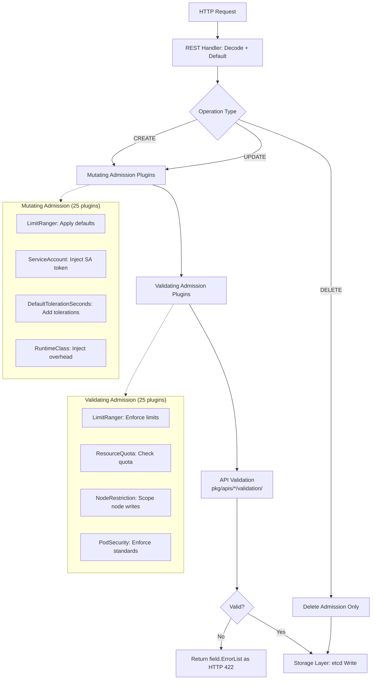

# 03 — Design Quality Assessment

> **Kubernetes Code Quality Audit — Document 03 of 10**
> Covers: Abstraction quality, error handling patterns, input validation coverage, anti-pattern catalog, and configuration vs. hardcoded value inventory.

---

## Table of Contents

- [1. Scope and Methodology](#1-scope-and-methodology)
- [2. Abstraction Quality Assessment](#2-abstraction-quality-assessment)
  - [2.1 Admission Interface Hierarchy](#21-admission-interface-hierarchy)
  - [2.2 Scheduler Framework Interfaces](#22-scheduler-framework-interfaces)
  - [2.3 Controller Pattern Abstractions](#23-controller-pattern-abstractions)
  - [2.4 Kubelet Subsystem Abstractions](#24-kubelet-subsystem-abstractions)
  - [2.5 Abstraction Quality Ratings](#25-abstraction-quality-ratings)
- [3. Error Handling Pattern Catalog](#3-error-handling-pattern-catalog)
  - [3.1 Pattern Inventory](#31-pattern-inventory)
  - [3.2 Error Handling Flow Comparison](#32-error-handling-flow-comparison)
  - [3.3 Cross-Module Divergence Assessment](#33-cross-module-divergence-assessment)
- [4. Input Validation Coverage Map](#4-input-validation-coverage-map)
  - [4.1 API Group Validation Inventory](#41-api-group-validation-inventory)
  - [4.2 Validation Pipeline Flow](#42-validation-pipeline-flow)
  - [4.3 Admission Plugin Validation Assessment](#43-admission-plugin-validation-assessment)
  - [4.4 Validation Pattern Assessment](#44-validation-pattern-assessment)
- [5. Anti-Pattern Catalog](#5-anti-pattern-catalog)
  - [5.1 God Objects / God Classes](#51-god-objects--god-classes)
  - [5.2 Deep Nesting (3+ Levels)](#52-deep-nesting-3-levels)
  - [5.3 Magic Numbers and Magic Strings](#53-magic-numbers-and-magic-strings)
  - [5.4 Primitive Obsession](#54-primitive-obsession)
  - [5.5 Feature Envy](#55-feature-envy)
  - [5.6 Shotgun Surgery Risk](#56-shotgun-surgery-risk)
  - [5.7 Inappropriate Intimacy Between Modules](#57-inappropriate-intimacy-between-modules)
  - [5.8 Leaky Abstractions](#58-leaky-abstractions)
- [6. Configuration vs. Hardcoded Value Inventory](#6-configuration-vs-hardcoded-value-inventory)
  - [6.1 Hardcoded Values Catalog](#61-hardcoded-values-catalog)
  - [6.2 Externalized Configuration Assessment](#62-externalized-configuration-assessment)
  - [6.3 Balance Assessment](#63-balance-assessment)
- [7. Finding Summary Index](#7-finding-summary-index)

---

## 1. Scope and Methodology

### 1.1 Analysis Scope

This document covers design quality across the following Kubernetes subsystems, analyzed through direct code inspection:

| Subsystem | Primary Paths | Focus Areas |
|-----------|--------------|-------------|
| **API Validation** | `pkg/apis/*/validation/` | Validation completeness, pattern consistency |
| **Admission Plugins** | `plugin/pkg/admission/*/` | Plugin abstraction, error handling |
| **Controllers** | `pkg/controller/*/` | Controller pattern, abstraction boundaries |
| **Kubelet** | `pkg/kubelet/`, `pkg/kubelet/kuberuntime/` | God object risk, abstraction leakage |
| **Scheduler** | `pkg/scheduler/framework/` | Interface design quality |
| **Proxy** | `pkg/proxy/iptables/` | Platform abstraction, hardcoded values |
| **API Server** | `cmd/kube-apiserver/app/options/` | Configuration design |
| **Admission Interfaces** | `staging/src/k8s.io/apiserver/pkg/admission/` | Interface hierarchy |

### 1.2 Methodology

- **Direct inspection** of source files listed in Section 1.1, plus supporting grep/line-count analysis across the full codebase
- **Inference Flags**: `CONFIRMED` for patterns directly observed in source; `INFERRED` for conclusions drawn from absence or structural analysis
- **No runtime profiling** — all assessments are static
- **No code modifications** — documentation only

---

## 2. Abstraction Quality Assessment

### 2.1 Admission Interface Hierarchy

**Source:** `staging/src/k8s.io/apiserver/pkg/admission/interfaces.go`

The admission interface hierarchy follows a clean, well-decomposed design:

```go
// Base interface — all admission controllers
type Interface interface {
    Handles(operation Operation) bool
}

// Mutation specialization
type MutationInterface interface {
    Interface
    Admit(ctx context.Context, a Attributes, o ObjectInterfaces) (err error)
}

// Validation specialization
type ValidationInterface interface {
    Interface
    Validate(ctx context.Context, a Attributes, o ObjectInterfaces) (err error)
}
```

**Assessment: Good**

The admission interface design is well-structured:
- Clear separation between mutation (`MutationInterface`) and validation (`ValidationInterface`) concerns
- Composable via embedding of the base `Interface`
- `Attributes` interface provides a rich, method-based API surface (15 methods) that keeps implementation details hidden
- `ObjectInterfaces` cleanly separates runtime object access (Creater, Typer, Defaulter, Convertor)
- Supporting interfaces (`ReinvocationContext`, `AnnotationsGetter`, `PluginInitializer`, `InitializationValidator`) are appropriately scoped

**Observed weakness:** The `Attributes` interface at 15 methods is approaching the boundary of interface bloat. A subset of callers may only need a few methods, but Go's implicit interface satisfaction mitigates this. Inference Flag: `CONFIRMED`.

Source: `staging/src/k8s.io/apiserver/pkg/admission/interfaces.go:30-77`

### 2.2 Scheduler Framework Interfaces

**Source:** `pkg/scheduler/framework/interface.go`

The scheduling framework uses a plugin-based architecture exposed through the `Framework` interface, which embeds `fwk.Handle` from `k8s.io/kube-scheduler/framework`:

```go
type Framework interface {
    fwk.Handle
    PreEnqueuePlugins() []fwk.PreEnqueuePlugin
    EnqueueExtensions() []fwk.EnqueueExtensions
    QueueSortFunc() fwk.LessFunc
    SignPod(ctx context.Context, pod *v1.Pod, recordPluginStats bool) fwk.PodSignature
    RunPreFilterPlugins(ctx context.Context, state fwk.CycleState, pod *v1.Pod) (...)
    RunPostFilterPlugins(ctx context.Context, state fwk.CycleState, pod *v1.Pod, ...) (...)
    RunPreBindPlugins(ctx context.Context, state fwk.CycleState, pod *v1.Pod, nodeName string) *fwk.Status
    // ... 10+ more RunXxx methods
}
```

**Assessment: Good**

The scheduler framework design demonstrates strong extensibility:
- The `fwk.Handle` embedding provides core scheduling primitives
- Plugin extension points (PreFilter, Filter, Score, Reserve, Permit, Bind) map directly to scheduling cycle phases
- `CycleState` provides a type-safe, per-cycle state container
- `fwk.Status` provides a consistent return type with status codes

**Observed weakness:** The `Framework` interface has 20+ methods, which makes it a large interface. This is justified by the scheduler's complex lifecycle but creates a high barrier for alternative implementations. The `NodeToStatus` helper type in the same file uses `map[string]*fwk.Status` with string-keyed node names, which is a mild primitive obsession (node names as raw strings). Inference Flag: `CONFIRMED`.

Source: `pkg/scheduler/framework/interface.go:162-250`

### 2.3 Controller Pattern Abstractions

**Source:** `pkg/controller/deployment/deployment_controller.go`, `pkg/controller/job/job_controller.go`

Controllers follow a consistent informer-driven reconciliation pattern:

```go
// Deployment controller — injectable syncHandler for testability
type DeploymentController struct {
    rsControl     controller.RSControlInterface   // interface for RS operations
    client        clientset.Interface              // Kubernetes client interface
    syncHandler   func(ctx context.Context, dKey string) error  // injectable
    dLister       appslisters.DeploymentLister     // informer lister
    rsLister      appslisters.ReplicaSetLister
    queue         workqueue.TypedRateLimitingInterface[string]
}
```

**Assessment: Adequate**

Strengths:
- Consistent use of `syncHandler` function injection allows testing without a running API server
- Lister interfaces provide read-only access to cached objects
- `workqueue.TypedRateLimitingInterface[string]` uses Go generics for type safety
- Informer event handlers follow a uniform pattern across all controllers

Weaknesses:
- Controllers use concrete `clientset.Interface` rather than narrow, purpose-specific interfaces. The deployment controller imports the entire Kubernetes client but only uses `Apps()` and `CoreV1()` subsets
- The `controller.RSControlInterface` pattern is used for ReplicaSet operations but the Job controller uses `controller.PodControlInterface` — the control interface abstraction is not uniformly applied across all controllers

Source: `pkg/controller/deployment/deployment_controller.go:67-99`

#### **DESIGN-001**

| Field | Value |
|-------|-------|
| **Finding ID** | DESIGN-001 |
| **Category** | Design Quality — Abstraction |
| **Title** | Controllers accept broad client interface instead of narrow operation interfaces |
| **Source Location** | `pkg/controller/deployment/deployment_controller.go:70` |
| **Description** | The `DeploymentController` accepts `clientset.Interface` (full Kubernetes API client) as a dependency, but only uses `client.AppsV1()` and `client.CoreV1().Events()`. This creates an unnecessarily wide dependency surface. |
| **Evidence** | `client clientset.Interface` — the controller constructor accepts the full client interface: `func NewDeploymentController(ctx context.Context, ..., client clientset.Interface)` |
| **Impact** | Increases coupling between controllers and the full API surface; makes unit testing require mock implementations of the entire client interface. |
| **Inference Flag** | CONFIRMED |
| **Recommendation Ref** | [08_IMPROVEMENT_ROADMAP.md — P2-DESIGN-001] |

### 2.4 Kubelet Subsystem Abstractions

**Source:** `pkg/kubelet/kubelet.go`

The kubelet defines several purpose-built interfaces for testability:

```go
// SyncHandler is an interface implemented by Kubelet, for testability
type SyncHandler interface {
    HandlePodAdditions(pods []*v1.Pod)
    HandlePodUpdates(pods []*v1.Pod)
    HandlePodRemoves(pods []*v1.Pod)
    HandlePodReconcile(pods []*v1.Pod)
    HandlePodSyncs(pods []*v1.Pod)
    HandlePodCleanups(ctx context.Context) error
}

// Bootstrap is a bootstrapping interface for kubelet
type Bootstrap interface {
    GetConfiguration() kubeletconfiginternal.KubeletConfiguration
    BirthCry()
    StartGarbageCollection()
    ListenAndServe(...)
    Run(<-chan kubetypes.PodUpdate)
}
```

**Assessment: Adequate**

Strengths:
- `SyncHandler` provides a clear pod lifecycle contract
- `Bootstrap` separates initialization from runtime operation
- `Dependencies` struct explicitly groups injected dependencies with comments noting this is a "temporary solution"
- Internal subsystems (probeManager, volumeManager, statusManager, allocationManager) are accessed through interfaces

Weaknesses:
- The `Dependencies` struct (31 fields) acts as a service locator rather than proper dependency injection
- The `Kubelet` struct itself is a 389-line struct definition with 80+ fields, making it a candidate for the God Object anti-pattern (see Section 5.1)
- Several subsystem managers are assigned via direct field mutation in `NewMainKubelet` rather than through constructor injection

Source: `pkg/kubelet/kubelet.go:282-340`

#### **DESIGN-002**

| Field | Value |
|-------|-------|
| **Finding ID** | DESIGN-002 |
| **Category** | Design Quality — Abstraction |
| **Title** | Kubelet Dependencies struct acts as a service locator pattern |
| **Source Location** | `pkg/kubelet/kubelet.go:309-340` |
| **Description** | The `Dependencies` struct groups 31 injected dependencies into a single struct, creating a service locator pattern. The struct's own comment acknowledges this: "This is a temporary solution for grouping these objects while we figure out a more comprehensive dependency injection story for the Kubelet." |
| **Evidence** | `type Dependencies struct` with fields: `Auth`, `CAdvisorInterface`, `ContainerManager`, `EventClient`, `HeartbeatClient`, `KubeClient`, `Mounter`, `OOMAdjuster`, `OSInterface`, `PodConfig`, `ProbeManager`, `Recorder`, `Subpather`, `TracerProvider`, `VolumePlugins`, `RemoteRuntimeService`, `RemoteImageService`, and more (31 total). |
| **Impact** | Makes it difficult to understand which dependencies a given operation actually requires; all components receive access to all dependencies regardless of need. The comment explicitly acknowledges the temporary nature of this design. |
| **Inference Flag** | CONFIRMED |
| **Recommendation Ref** | [08_IMPROVEMENT_ROADMAP.md — P2-DESIGN-002] |

### 2.5 Abstraction Quality Ratings

| Module | Rating | Justification |
|--------|--------|---------------|
| Admission Interfaces | **Good** | Clean Interface/MutationInterface/ValidationInterface hierarchy with well-scoped supporting interfaces |
| Scheduler Framework | **Good** | Well-designed plugin-based extensibility with consistent status handling |
| Controllers | **Adequate** | Consistent informer pattern with injectable sync handlers, but broad client dependencies |
| Kubelet | **Adequate** | Purpose-built interfaces for testability, but God Object struct and service locator Dependencies |
| Proxy | **Adequate** | Clean interface separation via `proxy.Provider`, but platform-specific details leak into types |
| API Validation | **Adequate** | Consistent `field.ErrorList` return pattern, but monolithic validation functions |

---

## 3. Error Handling Pattern Catalog

### 3.1 Pattern Inventory

The Kubernetes codebase employs six primary error handling patterns, with varying degrees of consistency across modules.

#### Pattern 1: `utilruntime.HandleError` — Fire-and-Forget Error Logging

**Description:** Errors that cannot be returned (e.g., from informer event handlers) are passed to `utilruntime.HandleError`, which logs the error and increments a metric but does not propagate it.

**Prevalence:** Found in 50+ files across `pkg/controller/`, used universally in informer event handlers.

```go
// Source: pkg/controller/deployment/deployment_controller.go:211
utilruntime.HandleError(fmt.Errorf("couldn't get object from tombstone %#v", obj))
```

**Usage Context:** Controller reconciliation loops where informer callbacks cannot return errors.

#### Pattern 2: `klog.ErrorS` — Structured Error Logging

**Description:** Structured logging of errors with key-value context. Part of the Kubernetes structured logging migration initiative.

**Prevalence:** Found in 15+ files in `pkg/kubelet/` alone; growing adoption in newer code.

```go
// Source: pkg/kubelet/kubelet.go:565-566
klog.V(2).InfoS("Failed to create an oomWatcher (running in UserNS, ignoring)", "err", err)
klog.ErrorS(err, "Failed to create an oomWatcher ...")
```

**Usage Context:** Kubelet subsystems and newer controller code. Preferred pattern for new development.

#### Pattern 3: `klog.Errorf` / `klog.Error` — Unstructured Error Logging

**Description:** Legacy unstructured error logging using printf-style formatting.

**Prevalence:** Found in only 1 file in `pkg/kubelet/` (migration nearly complete), but still present in older controller code.

```go
// Legacy pattern (being replaced)
klog.Errorf("format %v", err)
```

**Usage Context:** Older code not yet migrated to structured logging. Migration is actively underway.

#### Pattern 4: `fmt.Errorf` with `%w` — Error Wrapping (Go 1.13+)

**Description:** Standard Go error wrapping that preserves the error chain for `errors.Is()` and `errors.As()` inspection.

**Prevalence:** Inconsistently adopted. Not observed in `pkg/controller/deployment/` — controllers predominantly use `fmt.Errorf` with `%v` (which breaks the error chain) or `utilruntime.HandleError`.

```go
// Source: pkg/proxy/iptables/proxier.go:117
return nil, fmt.Errorf("unable to create ipv4 proxier: %v", err)
// Note: uses %v instead of %w — error chain is broken
```

**Usage Context:** Mixed adoption across the codebase. Newer code tends to use `%w`, but many existing callsites use `%v`.

#### Pattern 5: `errors.New` / Custom Error Types

**Description:** Static error construction and custom error types implementing the `error` interface.

**Prevalence:** Used throughout for creating base errors.

```go
// Source: pkg/kubelet/kuberuntime/kuberuntime_manager.go:98
var ErrVersionNotSupported = errors.New("runtime api version is not supported")
```

**Usage Context:** Package-level sentinel errors and specific error conditions.

#### Pattern 6: `admission.NewForbidden` — Domain-Specific Error Construction

**Description:** Admission plugins use `admission.NewForbidden` to construct admission rejection errors with structured context.

**Prevalence:** Universal in admission plugins.

```go
// Source: plugin/pkg/admission/limitranger/admission.go:130
return admission.NewForbidden(a, err)
```

**Usage Context:** All admission plugin `Admit` and `Validate` methods.

#### **DESIGN-003**

| Field | Value |
|-------|-------|
| **Finding ID** | DESIGN-003 |
| **Category** | Design Quality — Error Handling |
| **Title** | Inconsistent use of error wrapping (%w vs %v) across modules |
| **Source Location** | `pkg/proxy/iptables/proxier.go:117`, `pkg/proxy/iptables/proxier.go:125` |
| **Description** | Error wrapping with `%w` (which preserves the error chain for `errors.Is`/`errors.As`) is inconsistently adopted. The iptables proxy constructor uses `%v` instead of `%w` when wrapping errors from `NewProxier`, which breaks the error chain. This pattern is widespread — controllers also predominantly use `%v`. |
| **Evidence** | `return nil, fmt.Errorf("unable to create ipv4 proxier: %v", err)` — uses `%v` not `%w`. Similarly at line 125: `fmt.Errorf("unable to create ipv6 proxier: %v", err)`. |
| **Impact** | Callers cannot use `errors.Is()` or `errors.As()` to inspect wrapped errors, reducing error handling granularity and making programmatic error inspection unreliable. |
| **Inference Flag** | CONFIRMED |
| **Recommendation Ref** | [08_IMPROVEMENT_ROADMAP.md — P2-DESIGN-003] |

#### **DESIGN-004**

| Field | Value |
|-------|-------|
| **Finding ID** | DESIGN-004 |
| **Category** | Design Quality — Error Handling |
| **Title** | Mixed structured and unstructured logging coexist in kubelet |
| **Source Location** | `pkg/kubelet/kubelet.go:383`, `pkg/kubelet/kubelet.go:565` |
| **Description** | The kubelet code contains both structured (`klog.InfoS`, `klog.ErrorS`) and unstructured (`klog.InfoS` with inline formatting) error logging patterns. While structured logging migration is in progress, the kubelet is a critical subsystem where complete migration is important. |
| **Evidence** | Line 383: `klog.InfoS("Adding static pod path", "path", kubeCfg.StaticPodPath)` (structured). Line 394: `klog.InfoS("Adding apiserver pod source")` (structured but no key-value pairs). Both patterns coexist in `NewMainKubelet`. The kubelet directory has 15 files using `klog.ErrorS` but still 1 file using `klog.Errorf`. |
| **Impact** | Inconsistent log output format makes log aggregation, parsing, and analysis less reliable for the most critical node-level component. |
| **Inference Flag** | CONFIRMED |
| **Recommendation Ref** | [08_IMPROVEMENT_ROADMAP.md — P3-DESIGN-004] |

### 3.2 Error Handling Flow Comparison

The following diagram illustrates how errors are handled differently across the four major subsystems:

```mermaid
flowchart TB
    subgraph Controller["Controller Error Handling"]
        C1[Informer Event Handler] -->|Cannot return error| C2[utilruntime.HandleError]
        C2 --> C3[Log + Metric]
        C4[syncHandler] -->|Returns error| C5[Requeue with backoff]
        C4 -->|No error| C6[Done]
    end

    subgraph Kubelet["Kubelet Error Handling"]
        K1[Pod Sync Operation] -->|Error| K2{Severity?}
        K2 -->|Fatal| K3[klog.ErrorS + return err]
        K2 -->|Recoverable| K4[klog.InfoS/WarningS + continue]
        K2 -->|Unexpected| K5[utilruntime.HandleError]
    end

    subgraph Admission["Admission Plugin Error Handling"]
        A1[Admit/Validate Called] -->|Check preconditions| A2{Applies?}
        A2 -->|No| A3[return nil]
        A2 -->|Yes| A4[Run validation logic]
        A4 -->|Violation| A5[admission.NewForbidden]
        A4 -->|Internal error| A6[return err directly]
        A4 -->|Pass| A7[return nil]
    end

    subgraph APIServer["API Server Error Handling"]
        S1[REST Handler] -->|Decode error| S2[apierrors.NewBadRequest]
        S1 -->|Validation error| S3[field.ErrorList → apierrors]
        S1 -->|Storage error| S4[apierrors from etcd]
        S2 --> S5[HTTP Error Response]
        S3 --> S5
        S4 --> S5
    end
```



### 3.3 Cross-Module Divergence Assessment

| Error Scenario | Controllers | Kubelet | Admission Plugins | API Server |
|---------------|-------------|---------|-------------------|------------|
| **Cannot return error from callback** | `utilruntime.HandleError` | `utilruntime.HandleError` | N/A | N/A |
| **Recoverable operation failure** | Requeue via workqueue | `klog.ErrorS` + retry logic | `admission.NewForbidden` | `apierrors.NewXxx` |
| **Unexpected/impossible state** | `utilruntime.HandleError` | `klog.ErrorS` | `return err` directly | `utilruntime.HandleError` |
| **Input validation failure** | N/A (delegated to API) | Parameter validation at startup | `admission.NewForbidden` | `field.ErrorList` |
| **Error wrapping style** | `%v` (chain broken) | Mixed `%v`/`%w` | `admission.NewForbidden` wraps | `fmt.Errorf` with `%w` |

#### **DESIGN-005**

| Field | Value |
|-------|-------|
| **Finding ID** | DESIGN-005 |
| **Category** | Design Quality — Error Handling |
| **Title** | Controllers swallow errors via utilruntime.HandleError in event handlers |
| **Source Location** | `pkg/controller/deployment/deployment_controller.go:211-218` |
| **Description** | In all 50+ controller files that use `utilruntime.HandleError`, errors from informer event handlers (Add, Update, Delete) are logged and swallowed because the handler signature does not support returning errors. While this is a constraint of the informer API, the pattern means that type assertion failures on tombstone objects (a real but rare condition) are silently consumed. |
| **Evidence** | `utilruntime.HandleError(fmt.Errorf("couldn't get object from tombstone %#v", obj))` followed by `return` — the error is logged but the event is silently dropped. This pattern repeats across deployment, job, replicaset, statefulset, daemonset, and all other controllers. |
| **Impact** | Silent event loss in controllers during edge conditions (e.g., rapid deletion/creation cycles, tombstone processing). The error is logged but no retry or escalation occurs. |
| **Inference Flag** | CONFIRMED |
| **Recommendation Ref** | [08_IMPROVEMENT_ROADMAP.md — P3-DESIGN-005] |

---

## 4. Input Validation Coverage Map

### 4.1 API Group Validation Inventory

The following table maps all API groups in `pkg/apis/*/` against validation file presence and assessed completeness:

| API Group | Validation File Present | Validation File Path | Assessed Completeness |
|-----------|------------------------|---------------------|----------------------|
| `admissionregistration` | ✅ Yes | `pkg/apis/admissionregistration/validation/` | High — webhook rules, match conditions |
| `apiserverinternal` | ✅ Yes | `pkg/apis/apiserverinternal/validation/` | Adequate — storage version validation |
| `apps` | ✅ Yes | `pkg/apis/apps/validation/validation.go` | High — StatefulSet, Deployment, DaemonSet, ReplicaSet |
| `authentication` | ✅ Yes | `pkg/apis/authentication/validation/` | Adequate — token review validation |
| `authorization` | ✅ Yes | `pkg/apis/authorization/validation/` | Adequate — SAR/SSAR validation |
| `autoscaling` | ✅ Yes | `pkg/apis/autoscaling/validation/` | High — HPA metric validation |
| `batch` | ✅ Yes | `pkg/apis/batch/validation/validation.go` | High — Job, CronJob with extensive parallelism/index validation |
| `certificates` | ✅ Yes | `pkg/apis/certificates/validation/` | Adequate — CSR validation |
| `coordination` | ✅ Yes | `pkg/apis/coordination/validation/` | Adequate — Lease validation |
| `core` | ✅ Yes | `pkg/apis/core/validation/validation.go` | **Very High** — 9,600 lines, covers Pod, Service, PV/PVC, Node, Namespace, and all core types |
| `discovery` | ✅ Yes | `pkg/apis/discovery/validation/` | Adequate — EndpointSlice validation |
| `flowcontrol` | ✅ Yes | `pkg/apis/flowcontrol/validation/` | High — priority level, flow schema |
| `networking` | ✅ Yes | `pkg/apis/networking/validation/` | High — NetworkPolicy, Ingress, IngressClass |
| `node` | ✅ Yes | `pkg/apis/node/validation/` | Adequate — RuntimeClass validation |
| `policy` | ✅ Yes | `pkg/apis/policy/validation/` | Adequate — PDB validation |
| `rbac` | ✅ Yes | `pkg/apis/rbac/validation/` | High — Role, ClusterRole, bindings |
| `resource` | ✅ Yes | `pkg/apis/resource/validation/` | High — DRA resource claims and classes |
| `scheduling` | ✅ Yes | `pkg/apis/scheduling/validation/` | Adequate — PriorityClass validation |
| `storage` | ✅ Yes | `pkg/apis/storage/validation/` | High — StorageClass, CSIDriver, VolumeAttachment |
| `storagemigration` | ✅ Yes | `pkg/apis/storagemigration/validation/` | Adequate — StorageVersionMigration |

**Summary:** All 20 API groups have validation files present. No API group is missing validation entirely. Coverage is strongest in `core` (9,600 lines) and weakest in specialized API groups like `apiserverinternal` and `storagemigration` which have simpler type surfaces.

### 4.2 Validation Pipeline Flow

The following diagram shows the complete validation pipeline from API request entry to storage persistence:



### 4.3 Admission Plugin Validation Assessment

The following admission plugins perform validation beyond what `pkg/apis/*/validation/` provides:

| Plugin | Path | Additional Validation | Inference Flag |
|--------|------|----------------------|----------------|
| **LimitRanger** | `plugin/pkg/admission/limitranger/` | Enforces per-namespace resource limits on pods, validates against LimitRange objects | CONFIRMED |
| **ResourceQuota** | `plugin/pkg/admission/resourcequota/` | Enforces aggregate resource quotas at namespace level | CONFIRMED |
| **NodeRestriction** | `plugin/pkg/admission/noderestriction/` | Restricts kubelet write operations to only the node's own resources (pods, node status) | CONFIRMED |
| **ServiceAccount** | `plugin/pkg/admission/serviceaccount/` | Ensures service account exists, injects API tokens, validates secret references | CONFIRMED |
| **PodSecurity** | `plugin/pkg/admission/security/` | Enforces Pod Security Standards (Privileged, Baseline, Restricted) | CONFIRMED |
| **AlwaysPullImages** | `plugin/pkg/admission/alwayspullimages/` | Forces `imagePullPolicy: Always` for security | CONFIRMED |

#### **DESIGN-006**

| Field | Value |
|-------|-------|
| **Finding ID** | DESIGN-006 |
| **Category** | Design Quality — Validation |
| **Title** | Validation logic split across API validation and admission plugins creates dual validation paths |
| **Source Location** | `pkg/apis/core/validation/validation.go`, `plugin/pkg/admission/limitranger/admission.go:110-118` |
| **Description** | Input validation is split between two systems: `pkg/apis/*/validation/` (structural validation) and `plugin/pkg/admission/*/` (semantic/contextual validation). The LimitRanger plugin, for example, implements its own resource limit checks that partially overlap with core resource validation in `pkg/apis/core/validation/`. This dual-path architecture means a developer must understand both systems to know the full validation applied to a resource. |
| **Evidence** | LimitRanger `Admit` method (line 111) delegates to `l.actions.MutateLimit` and `Validate` (line 116) delegates to `l.actions.ValidateLimit` — these perform resource limit checks that are conceptually related to but separate from `ValidateResourceRequirements` in core validation. |
| **Impact** | Developers adding new fields may miss adding validation in either the API validation layer or the admission plugin layer, leading to validation gaps. Understanding the full validation surface requires inspecting both systems. |
| **Inference Flag** | CONFIRMED |
| **Recommendation Ref** | [08_IMPROVEMENT_ROADMAP.md — P3-DESIGN-006] |

### 4.4 Validation Pattern Assessment

#### 4.4.1 Required Field Enforcement

**Assessment: Strong** — Core validation (`pkg/apis/core/validation/validation.go`) systematically uses `field.Required` for missing mandatory fields. The `field.ErrorList` pattern provides structured, field-path-aware error reporting.

```go
// Source: pkg/apis/apps/validation/validation.go:61-63
if template == nil {
    allErrs = append(allErrs, field.Required(fldPath, ""))
}
```

#### 4.4.2 Value Range Checking

**Assessment: Strong** — Numeric ranges are validated with helper functions like `ValidateNonnegativeField`, `ValidatePositiveField`, and `field.Invalid` with descriptive error messages. The batch validation demonstrates comprehensive range checking:

```go
// Source: pkg/apis/batch/validation/validation.go:45-46
const maxParallelismForIndexedJob = 100000
const maxFailedIndexesForIndexedJob = 100_000
```

Named constants are used for limits, with clear comments explaining their purpose.

#### 4.4.3 Cross-Field Validation

**Assessment: Adequate** — Cross-field validation exists (e.g., VolumeAttributesClassName cannot be set to nil when `status.currentVolumeAttributesClassName` is not nil) but is scattered throughout the validation functions without a centralized cross-field validation registry.

```go
// Source: pkg/apis/core/validation/validation.go:2607-2613
if oldPvc.Status.CurrentVolumeAttributesClassName != nil {
    if newPvc.Spec.VolumeAttributesClassName == nil {
        allErrs = append(allErrs, field.Forbidden(..., "update to nil is forbidden..."))
    }
}
```

#### 4.4.4 Immutability Enforcement on Update

**Assessment: Strong** — The `ValidateImmutableField` helper is consistently used. Update validation functions (e.g., `ValidatePodUpdate`, `ValidateServiceUpdate`) systematically enforce field immutability using both the helper function and direct equality checks.

#### 4.4.5 Status vs. Spec Validation Separation

**Assessment: Strong** — API groups consistently separate spec validation (`ValidateXxxSpec`) from status validation (`ValidateXxxStatusUpdate`), and update validation (`ValidateXxxUpdate`) from create validation (`ValidateXxx`).

#### **DESIGN-007**

| Field | Value |
|-------|-------|
| **Finding ID** | DESIGN-007 |
| **Category** | Design Quality — Validation |
| **Title** | Core validation file (9,600 lines) is a monolithic validation module |
| **Source Location** | `pkg/apis/core/validation/validation.go:1-9600` |
| **Description** | The core API validation file at 9,600 lines is by far the largest single file in the validation system. It contains validation for all core types (Pod, Service, PersistentVolume, PersistentVolumeClaim, Node, Namespace, Secret, ConfigMap, etc.) in a single file. While the validation functions are well-structured individually, the file size makes navigation, review, and concurrent modification difficult. |
| **Evidence** | File line count: 9,600 lines. Contains 50+ exported `Validate*` functions. Compare to `pkg/apis/apps/validation/validation.go` which is substantially smaller. |
| **Impact** | Merge conflicts are likely when multiple teams modify core validation simultaneously. Code review of changes is complicated by file size. IDE performance may be impacted. |
| **Inference Flag** | CONFIRMED |
| **Recommendation Ref** | [08_IMPROVEMENT_ROADMAP.md — P2-DESIGN-007] |

---

## 5. Anti-Pattern Catalog

### 5.1 God Objects / God Classes

#### **DESIGN-008**

| Field | Value |
|-------|-------|
| **Finding ID** | DESIGN-008 |
| **Category** | Anti-Pattern — God Object |
| **Title** | Kubelet struct is a God Object with 80+ fields and 47+ methods |
| **Source Location** | `pkg/kubelet/kubelet.go:1132-1520` |
| **Description** | The `Kubelet` struct is defined across 389 lines with 80+ fields spanning pod management, node status, volume management, container runtime, probe management, eviction, garbage collection, networking, certificates, and metrics. It has 47 methods directly defined on `*Kubelet` in this file alone, with additional methods in other files in the same package. This struct orchestrates nearly every kubelet subsystem. |
| **Evidence** | `type Kubelet struct` spans lines 1132-1520 (389 lines). Fields include: `hostname`, `nodeName`, `kubeClient`, `heartbeatClient`, `mirrorPodClient`, `podManager`, `podWorkers`, `evictionManager`, `probeManager`, `secretManager`, `configMapManager`, `volumeManager`, `statusManager`, `allocationManager`, `podCertificateManager`, `containerRuntime`, `streamingRuntime`, `runtimeService`, `containerGC`, `imageManager`, `containerLogManager`, `oomWatcher`, `resourceAnalyzer`, `containerManager`, `nodeLeaseController`, `pleg`, `eventedPleg`, `podCache`, plus 50+ more fields. Method count: `grep -c "^func (kl \*Kubelet)" kubelet.go` returns 47. |
| **Impact** | Extremely difficult to understand, test, and modify. Changes to any subsystem risk unintended interactions with other subsystems. New contributors face a steep learning curve. The struct's size means that unit testing individual behaviors requires constructing or mocking the entire Kubelet. |
| **Inference Flag** | CONFIRMED |
| **Recommendation Ref** | [08_IMPROVEMENT_ROADMAP.md — P1-DESIGN-008] |

#### **DESIGN-009**

| Field | Value |
|-------|-------|
| **Finding ID** | DESIGN-009 |
| **Category** | Anti-Pattern — God Object |
| **Title** | NewMainKubelet constructor has 27 parameters |
| **Source Location** | `pkg/kubelet/kubelet.go:422-448` |
| **Description** | The `NewMainKubelet` function accepts 27 individual parameters spanning hostname, node identity, networking, image credentials, registration flags, garbage collection, container limits, node labels, security settings, and more. This is a direct consequence of the Kubelet God Object — every subsystem's initialization configuration must pass through a single constructor. |
| **Evidence** | Function signature spans lines 422-448: `func NewMainKubelet(ctx context.Context, kubeCfg *kubeletconfiginternal.KubeletConfiguration, kubeDeps *Dependencies, crOptions *kubeletconfig.ContainerRuntimeOptions, hostname string, nodeName types.NodeName, nodeIPs []net.IP, providerID string, cloudProvider string, certDirectory string, rootDirectory string, podLogsDirectory string, imageCredentialProviderConfigPath string, imageCredentialProviderBinDir string, registerNode bool, registerWithTaints []v1.Taint, allowedUnsafeSysctls []string, experimentalMounterPath string, kernelMemcgNotification bool, experimentalNodeAllocatableIgnoreEvictionThreshold bool, minimumGCAge metav1.Duration, maxPerPodContainerCount int32, maxContainerCount int32, nodeLabels map[string]string, nodeStatusMaxImages int32, seccompDefault bool) (*Kubelet, error)` |
| **Impact** | Adding any new kubelet feature requires modifying this constructor signature, triggering changes across all callers. Testing requires providing values for all 27 parameters. The parameter list is a strong indicator that the function does too much. |
| **Inference Flag** | CONFIRMED |
| **Recommendation Ref** | [08_IMPROVEMENT_ROADMAP.md — P1-DESIGN-009] |

#### **DESIGN-010**

| Field | Value |
|-------|-------|
| **Finding ID** | DESIGN-010 |
| **Category** | Anti-Pattern — God Object |
| **Title** | Core validation file contains 9,600 lines of validation for all core API types |
| **Source Location** | `pkg/apis/core/validation/validation.go:1-9600` |
| **Description** | The core validation file at 9,600 lines contains validation logic for every core Kubernetes API type (Pod, Service, PersistentVolume, PersistentVolumeClaim, Node, Namespace, Secret, ConfigMap, ReplicationController, Endpoints, LimitRange, ResourceQuota, etc.) in a single monolithic file. Other API groups (apps, batch, networking) split validation into more manageable files. |
| **Evidence** | File size: 9,600 lines. Contains 50+ exported `ValidateXxx` functions plus internal helpers, constants, regex patterns, and validation maps. |
| **Impact** | Difficult to navigate, high probability of merge conflicts during concurrent development, challenging code review experience. |
| **Inference Flag** | CONFIRMED |
| **Recommendation Ref** | [08_IMPROVEMENT_ROADMAP.md — P2-DESIGN-010] |

### 5.2 Deep Nesting (3+ Levels)

#### **DESIGN-011**

| Field | Value |
|-------|-------|
| **Finding ID** | DESIGN-011 |
| **Category** | Anti-Pattern — Deep Nesting |
| **Title** | Validation functions exhibit 4-5 levels of nesting in cross-field validation |
| **Source Location** | `pkg/apis/core/validation/validation.go:2601-2616` |
| **Description** | PVC update validation contains deeply nested conditional logic: `if !DeepEqual` → `if !FeatureGate` → `if opts.Enable` → `if status != nil` → `if spec == nil`. This 5-level nesting makes the control flow difficult to trace and reason about. |
| **Evidence** | Lines 2601-2616: `if !apiequality.Semantic.DeepEqual(oldPvc.Spec.VolumeAttributesClassName, newPvc.Spec.VolumeAttributesClassName) { if !utilfeature.DefaultFeatureGate.Enabled(features.VolumeAttributesClass) { ... } if opts.EnableVolumeAttributesClass { if oldPvc.Status.CurrentVolumeAttributesClassName != nil { if newPvc.Spec.VolumeAttributesClassName == nil { allErrs = append(...) } else if len(*newPvc.Spec.VolumeAttributesClassName) == 0 { allErrs = append(...) } } } }` |
| **Impact** | Deeply nested validation logic is difficult to test exhaustively and prone to missed edge cases. Each additional nesting level multiplies the number of test cases needed for full path coverage. |
| **Inference Flag** | CONFIRMED |
| **Recommendation Ref** | [08_IMPROVEMENT_ROADMAP.md — P3-DESIGN-011] |

#### **DESIGN-012**

| Field | Value |
|-------|-------|
| **Finding ID** | DESIGN-012 |
| **Category** | Anti-Pattern — Deep Nesting |
| **Title** | Controller tombstone handling requires 3+ levels of type assertion nesting |
| **Source Location** | `pkg/controller/deployment/deployment_controller.go:207-222` |
| **Description** | The `deleteDeployment` handler has a nested pattern: `if !ok` (type assertion) → `if !ok` (tombstone check) → `if !ok` (inner type assertion). This triple-nested type assertion pattern is repeated across all controllers that handle deletions. |
| **Evidence** | Lines 207-222: `d, ok := obj.(*apps.Deployment); if !ok { tombstone, ok := obj.(cache.DeletedFinalStateUnknown); if !ok { utilruntime.HandleError(...); return }; d, ok = tombstone.Obj.(*apps.Deployment); if !ok { utilruntime.HandleError(...); return } }` |
| **Impact** | The same nesting pattern is duplicated across 30+ controllers. Each duplication is an opportunity for subtle inconsistencies. |
| **Inference Flag** | CONFIRMED |
| **Recommendation Ref** | [08_IMPROVEMENT_ROADMAP.md — P3-DESIGN-012] |

#### **DESIGN-013**

| Field | Value |
|-------|-------|
| **Finding ID** | DESIGN-013 |
| **Category** | Anti-Pattern — Deep Nesting |
| **Title** | Kubelet NewMainKubelet contains deeply nested initialization with error handling |
| **Source Location** | `pkg/kubelet/kubelet.go:559-573` |
| **Description** | OOM watcher initialization in `NewMainKubelet` reaches 4 levels of nesting: `if err != nil` → `if inuserns.RunningInUserNS()` → `if featureGate.Enabled(KubeletInUserNamespace)` → log and continue vs. return error. This pattern mixes feature gate checking, environment detection, and error handling at deep nesting levels. |
| **Evidence** | Lines 559-573: `oomWatcher, err := oomwatcher.NewWatcher(...); if err != nil { if inuserns.RunningInUserNS() { if utilfeature.DefaultFeatureGate.Enabled(features.KubeletInUserNamespace) { klog.V(2).InfoS("...ignoring..."); oomWatcher = nil } else { klog.ErrorS(...); return nil, err } } else { return nil, err } }` |
| **Impact** | Complex error handling paths reduce readability. Readers must trace 4 levels to understand which error paths lead to failure vs. graceful degradation. |
| **Inference Flag** | CONFIRMED |
| **Recommendation Ref** | [08_IMPROVEMENT_ROADMAP.md — P3-DESIGN-013] |

### 5.3 Magic Numbers and Magic Strings

#### **DESIGN-014**

| Field | Value |
|-------|-------|
| **Finding ID** | DESIGN-014 |
| **Category** | Anti-Pattern — Magic Numbers |
| **Title** | Kubelet contains 23+ time-based magic constants with varying naming quality |
| **Source Location** | `pkg/kubelet/kubelet.go:148-240` |
| **Description** | The kubelet defines 23+ time-based constants at package level. While most have names and comments, some use numeric literals that are not immediately obvious: `plegChannelCapacity = 1000` (described as "a bit arbitrary"), `genericPlegRelistPeriod = time.Second * 1`, `eventedPlegMaxStreamRetries = 5`, `minDeadContainerInPod = 1`, `nodeLeaseRenewIntervalFraction = 0.25`. The comment on `plegChannelCapacity` explicitly states the value is "arbitrary and may be adjusted." |
| **Evidence** | Line 201-202: `plegChannelCapacity = 1000` with comment "This number is a bit arbitrary and may be adjusted in the future." Line 218: `eventedPlegMaxStreamRetries = 5` without explanation of why 5 was chosen. Line 233: `minDeadContainerInPod = 1` — the minimum kept dead containers. Line 236: `nodeLeaseRenewIntervalFraction = 0.25` — why 25%? |
| **Impact** | Self-described arbitrary values indicate potential tuning needs. Without clear rationale, future maintainers may change these values without understanding the implications. |
| **Inference Flag** | CONFIRMED |
| **Recommendation Ref** | [08_IMPROVEMENT_ROADMAP.md — P3-DESIGN-014] |

#### **DESIGN-015**

| Field | Value |
|-------|-------|
| **Finding ID** | DESIGN-015 |
| **Category** | Anti-Pattern — Magic Numbers |
| **Title** | Batch validation uses numerous unnamed numeric thresholds |
| **Source Location** | `pkg/apis/batch/validation/validation.go:45-73` |
| **Description** | While the batch validation file does name its constants (e.g., `maxParallelismForIndexedJob = 100000`, `maxPodFailurePolicyRules = 20`), the sheer number of thresholds (13 named constants spanning lines 45-73) and their varying magnitudes (20, 255, 500, 10_000, 100_000, 64*1024) suggest that some limits may be arbitrary. The `maxPodFailurePolicyOnExitCodesValues = 255` limit matches a byte range but this connection is not documented. |
| **Evidence** | Constants: `maxParallelismForIndexedJob = 100000`, `maxFailedIndexesForIndexedJob = 100_000`, `completionsSoftLimit = 100_000`, `parallelismLimitForHighCompletions = 10_000`, `maxPodFailurePolicyRules = 20`, `maxPodFailurePolicyOnExitCodesValues = 255`, `maxPodFailurePolicyOnPodConditionsPatterns = 20`, `maxManagedByLength = 63`, `maxJobSuccessPolicySucceededIndexesLimit = 64 * 1024`, `maxSuccessPolicyRule = 20`. |
| **Impact** | The relationship between limits is not always clear. Why is `maxPodFailurePolicyRules` 20 but `maxPodFailurePolicyOnExitCodesValues` 255? Documentation of the design rationale would aid future maintenance. |
| **Inference Flag** | INFERRED — the limits are named but their rationale is not always documented |
| **Recommendation Ref** | [08_IMPROVEMENT_ROADMAP.md — P3-DESIGN-015] |

#### **DESIGN-016**

| Field | Value |
|-------|-------|
| **Finding ID** | DESIGN-016 |
| **Category** | Anti-Pattern — Magic Strings |
| **Title** | Annotation keys used as magic strings across admission plugins |
| **Source Location** | `plugin/pkg/admission/serviceaccount/admission.go:50`, `plugin/pkg/admission/limitranger/admission.go:49` |
| **Description** | Admission plugins define annotation key constants locally rather than sharing them from a central location. The ServiceAccount plugin defines `EnforceMountableSecretsAnnotation = "kubernetes.io/enforce-mountable-secrets"` and `DefaultAPITokenMountPath = "/var/run/secrets/kubernetes.io/serviceaccount"`. The LimitRanger plugin defines `limitRangerAnnotation = "kubernetes.io/limit-ranger"`. These string constants are well-named but scattered across plugins with no central annotation registry. |
| **Evidence** | ServiceAccount: `EnforceMountableSecretsAnnotation = "kubernetes.io/enforce-mountable-secrets"` (line 50). LimitRanger: `limitRangerAnnotation = "kubernetes.io/limit-ranger"` (line 49). |
| **Impact** | Risk of typos when referencing annotations across packages. No single source of truth for all Kubernetes annotation keys used by admission plugins. |
| **Inference Flag** | CONFIRMED |
| **Recommendation Ref** | [08_IMPROVEMENT_ROADMAP.md — P3-DESIGN-016] |

### 5.4 Primitive Obsession

#### **DESIGN-017**

| Field | Value |
|-------|-------|
| **Finding ID** | DESIGN-017 |
| **Category** | Anti-Pattern — Primitive Obsession |
| **Title** | NewMainKubelet accepts hostname, nodeName, providerID, cloudProvider as raw strings |
| **Source Location** | `pkg/kubelet/kubelet.go:422-448` |
| **Description** | The `NewMainKubelet` constructor accepts multiple string parameters that represent distinct domain concepts: `hostname string`, `providerID string`, `cloudProvider string`, `certDirectory string`, `rootDirectory string`, `podLogsDirectory string`, `imageCredentialProviderConfigPath string`, `imageCredentialProviderBinDir string`, `experimentalMounterPath string`. While `nodeName` correctly uses `types.NodeName` (a typed alias), the other string parameters are interchangeable at the type level, creating risk of argument transposition. |
| **Evidence** | Function signature at lines 422-448 includes 9 raw `string` parameters in the parameter list. Only `nodeName types.NodeName` uses a domain type. `hostname string` and `providerID string` are adjacent raw strings with no type safety preventing accidental transposition. |
| **Impact** | Accidentally swapping `hostname` and `providerID` would compile without error but produce incorrect behavior at runtime. Go has no named-parameter or keyword-argument mechanism to prevent this. |
| **Inference Flag** | CONFIRMED |
| **Recommendation Ref** | [08_IMPROVEMENT_ROADMAP.md — P2-DESIGN-017] |

#### **DESIGN-018**

| Field | Value |
|-------|-------|
| **Finding ID** | DESIGN-018 |
| **Category** | Anti-Pattern — Primitive Obsession |
| **Title** | Scheduler framework uses raw string for node names |
| **Source Location** | `pkg/scheduler/framework/interface.go:55-65` |
| **Description** | The `NodeToStatus` type maps `map[string]*fwk.Status` where the string key represents a node name. Node names are used as raw strings throughout the scheduling framework: `func (m *NodeToStatus) Get(nodeName string)`, `func (m *NodeToStatus) Set(nodeName string, status *fwk.Status)`. Compare with the API types where `types.NodeName` is available as a semantic type. |
| **Evidence** | Line 34: `nodeToStatus map[string]*fwk.Status` — keys are node names as raw strings. Line 55: `func (m *NodeToStatus) Get(nodeName string)` — accepts raw string. Line 63: `func (m *NodeToStatus) Set(nodeName string, status *fwk.Status)` — raw string. |
| **Impact** | No compile-time distinction between a node name and any other string. Mixing node names with pod names or namespace names would not be caught by the type system. |
| **Inference Flag** | CONFIRMED |
| **Recommendation Ref** | [08_IMPROVEMENT_ROADMAP.md — P3-DESIGN-018] |

#### **DESIGN-019**

| Field | Value |
|-------|-------|
| **Finding ID** | DESIGN-019 |
| **Category** | Anti-Pattern — Primitive Obsession |
| **Title** | Proxy uses raw int for masqueradeBit without domain type |
| **Source Location** | `pkg/proxy/iptables/proxier.go:102, 224, 263` |
| **Description** | The iptables proxier accepts `masqueradeBit int` as a constructor parameter and uses it in a bit-shift operation: `masqueradeValue := 1 << uint(masqueradeBit)`. The raw `int` type provides no compile-time protection against passing an out-of-range value (e.g., negative or >31). |
| **Evidence** | Line 102: `masqueradeBit int` in `NewDualStackProxier` signature. Line 224: `masqueradeBit int` in `NewProxier` signature. Line 263: `masqueradeValue := 1 << uint(masqueradeBit)` — bit shift on unchecked input. |
| **Impact** | A `masqueradeBit` value outside the valid range (0-31 for 32-bit, 0-63 for 64-bit) would produce incorrect iptables rules without any compile-time or runtime guard in the constructor. |
| **Inference Flag** | CONFIRMED |
| **Recommendation Ref** | [08_IMPROVEMENT_ROADMAP.md — P3-DESIGN-019] |

### 5.5 Feature Envy

#### **DESIGN-020**

| Field | Value |
|-------|-------|
| **Finding ID** | DESIGN-020 |
| **Category** | Anti-Pattern — Feature Envy |
| **Title** | Controller utility functions in pkg/controller operate extensively on API objects |
| **Source Location** | `pkg/controller/deployment/deployment_controller.go:235-242` |
| **Description** | The `addReplicaSet` method on `DeploymentController` extensively accesses ReplicaSet and Deployment fields to determine ownership: `rs.DeletionTimestamp`, `metav1.GetControllerOf(rs)`, `rs.Namespace`, `controllerRef`. The method exists on the `DeploymentController` but operates primarily on the `ReplicaSet` type's data. This is a common Go pattern (methods on the controller that inspect API objects) but represents feature envy in the classic sense. |
| **Evidence** | Lines 225-243: `func (dc *DeploymentController) addReplicaSet(logger klog.Logger, obj interface{})` — the method accesses `rs.DeletionTimestamp`, `metav1.GetControllerOf(rs)`, `rs.Namespace` (3 different fields), and delegates to `dc.resolveControllerRef`. The method operates more on the `ReplicaSet` data than on `DeploymentController` data. |
| **Impact** | Minor — this is a standard Go controller pattern. However, the pattern means controller logic and API type knowledge are tightly coupled. Changes to the ReplicaSet type may require changes across multiple controllers. |
| **Inference Flag** | CONFIRMED |
| **Recommendation Ref** | [08_IMPROVEMENT_ROADMAP.md — P3-DESIGN-020] |

#### **DESIGN-021**

| Field | Value |
|-------|-------|
| **Finding ID** | DESIGN-021 |
| **Category** | Anti-Pattern — Feature Envy |
| **Title** | LimitRanger admission plugin operates extensively on external LimitRange objects |
| **Source Location** | `plugin/pkg/admission/limitranger/admission.go:120-150` |
| **Description** | The `runLimitFunc` method on `LimitRanger` retrieves LimitRange objects from the namespace and iterates over them, accessing fields of the external `corev1.LimitRange` type: `l.actions.SupportsLimit(limitRange)`, `limitFn(limitRange, a.GetResource().Resource, a.GetObject())`. The method's primary operation is on `LimitRange` data, not on `LimitRanger` state. |
| **Evidence** | Lines 137-150: `items, err := l.GetLimitRanges(a)` → `for i := range items { limitRange := items[i]; if !l.actions.SupportsLimit(limitRange) { continue }; err = limitFn(limitRange, a.GetResource().Resource, a.GetObject()) }` — iteration and delegation based entirely on external data. |
| **Impact** | The delegation to `LimitRangerActions` interface partially addresses this, but the core loop operates on external `LimitRange` state rather than `LimitRanger` own state. |
| **Inference Flag** | CONFIRMED |
| **Recommendation Ref** | [08_IMPROVEMENT_ROADMAP.md — P3-DESIGN-021] |

### 5.6 Shotgun Surgery Risk

#### **DESIGN-022**

| Field | Value |
|-------|-------|
| **Finding ID** | DESIGN-022 |
| **Category** | Anti-Pattern — Shotgun Surgery |
| **Title** | Adding a new API field requires coordinated changes across 6+ files per API group |
| **Source Location** | `pkg/apis/core/` (25 non-test, non-generated Go files) |
| **Description** | Adding a new field to a core API type (e.g., adding a field to `PodSpec`) requires coordinated changes across a minimum of 6 files: (1) `types.go` — add the field to the internal type, (2) `v1/types.go` — add to the versioned type (in staging), (3) `validation/validation.go` — add validation logic, (4) `v1/defaults.go` — add defaulting logic, (5) `v1/conversion.go` — add/update conversion logic, (6) `zz_generated.deepcopy.go` — regenerate via code generator. Additionally: test files, documentation, feature gate (if gated), admission plugins (if admission-relevant). |
| **Evidence** | The `pkg/apis/core/` directory contains 25 non-test, non-generated Go source files. A single field addition touches: `types.go`, `validation/validation.go`, `v1/defaults.go`, `v1/conversion.go`, plus generated files `zz_generated.deepcopy.go`, `zz_generated.conversion.go`, `zz_generated.defaults.go`. |
| **Impact** | High — every new API field is a multi-file, multi-directory change that is error-prone. Missing any file (e.g., forgetting validation) introduces a defect. The API review process partially mitigates this, but the structural risk remains. |
| **Inference Flag** | CONFIRMED |
| **Recommendation Ref** | [08_IMPROVEMENT_ROADMAP.md — P1-DESIGN-022] |

#### **DESIGN-023**

| Field | Value |
|-------|-------|
| **Finding ID** | DESIGN-023 |
| **Category** | Anti-Pattern — Shotgun Surgery |
| **Title** | Adding a new controller requires coordinated registration across multiple packages |
| **Source Location** | `pkg/controller/`, `cmd/kube-controller-manager/app/` |
| **Description** | Adding a new controller requires changes in: (1) the controller implementation package `pkg/controller/newctrl/`, (2) registration in `cmd/kube-controller-manager/app/` (adding the controller to the known controllers list), (3) RBAC rules for the controller's service account, (4) feature gate definition in `pkg/features/` (if gated), (5) test infrastructure in `test/integration/`, (6) documentation. The 36 existing controller subdirectories in `pkg/controller/` each went through this multi-step process. |
| **Evidence** | 36 controller subdirectories exist under `pkg/controller/`. Each follows the pattern: `NewXController()` constructor, `Run()` method, informer event handlers, workqueue processing. Registration requires separate changes in the kube-controller-manager binary entry point. |
| **Impact** | Multi-package coordination risk for new controllers. The controller pattern itself is well-documented via existing examples, but the registration boilerplate adds friction and risk of incomplete setup. |
| **Inference Flag** | INFERRED — based on structural analysis of controller registration pattern |
| **Recommendation Ref** | [08_IMPROVEMENT_ROADMAP.md — P2-DESIGN-023] |

### 5.7 Inappropriate Intimacy Between Modules

#### **DESIGN-024**

| Field | Value |
|-------|-------|
| **Finding ID** | DESIGN-024 |
| **Category** | Anti-Pattern — Inappropriate Intimacy |
| **Title** | Controller packages import kubelet-internal packages |
| **Source Location** | `pkg/controller/volume/attachdetach/reconciler/reconciler.go:37`, `pkg/controller/util/node/controller_utils.go:36`, `pkg/controller/podgc/gc_controller.go:40` |
| **Description** | Three controller packages import kubelet-specific packages, creating cross-module intimate coupling: (1) `pkg/controller/volume/attachdetach/` imports `k8s.io/kubernetes/pkg/kubelet/events` for event reason constants, (2) `pkg/controller/util/node/` imports `k8s.io/kubernetes/pkg/kubelet/util/format` for pod formatting utilities, (3) `pkg/controller/podgc/` imports `k8s.io/kubernetes/pkg/kubelet/eviction` for eviction reason constants. Controllers should be independent of kubelet internals. |
| **Evidence** | Line `reconciler.go:37`: `kevents "k8s.io/kubernetes/pkg/kubelet/events"`. Line `controller_utils.go:36`: `"k8s.io/kubernetes/pkg/kubelet/util/format"`. Line `gc_controller.go:40`: `"k8s.io/kubernetes/pkg/kubelet/eviction"`. |
| **Impact** | Changes to kubelet event reasons, formatting, or eviction constants can break controller-manager compilation. This creates a hidden dependency that violates the conceptual separation between node-level (kubelet) and cluster-level (controller-manager) components. |
| **Inference Flag** | CONFIRMED |
| **Recommendation Ref** | [08_IMPROVEMENT_ROADMAP.md — P1-DESIGN-024] |

#### **DESIGN-025**

| Field | Value |
|-------|-------|
| **Finding ID** | DESIGN-025 |
| **Category** | Anti-Pattern — Inappropriate Intimacy |
| **Title** | Kubelet imports scheduler framework plugin for taint toleration |
| **Source Location** | `pkg/kubelet/kubelet.go:51` |
| **Description** | The kubelet imports the scheduler's taint toleration plugin: `"k8s.io/kubernetes/pkg/scheduler/framework/plugins/tainttoleration"`. This creates a bidirectional intimacy — the kubelet (a node component) depends on the scheduler (a control plane component) for a string constant (`tainttoleration.ErrReasonNotMatch`). |
| **Evidence** | Line 51: `"k8s.io/kubernetes/pkg/scheduler/framework/plugins/tainttoleration"`. Usage at line 263: `tainttoleration.ErrReasonNotMatch` in the `admissionRejectionReasons` set. |
| **Impact** | The kubelet binary includes scheduler framework code as a transitive dependency for a single string constant. This creates an unnecessary coupling between two components that should be independently deployable. |
| **Inference Flag** | CONFIRMED |
| **Recommendation Ref** | [08_IMPROVEMENT_ROADMAP.md — P2-DESIGN-025] |

### 5.8 Leaky Abstractions

#### **DESIGN-026**

| Field | Value |
|-------|-------|
| **Finding ID** | DESIGN-026 |
| **Category** | Anti-Pattern — Leaky Abstraction |
| **Title** | Kubelet exposes cgroup implementation details through configuration |
| **Source Location** | `pkg/kubelet/kubelet.go:627-628, 1411-1415` |
| **Description** | The Kubelet struct exposes Linux cgroup configuration as first-class fields: `cgroupsPerQOS bool`, `cgroupRoot string`. These are Linux-specific implementation details of resource management that leak into the kubelet's configuration surface. The kubelet is designed to run on multiple platforms (Linux, Windows), but cgroup configuration is inherently Linux-specific. |
| **Evidence** | Line 627-628: `cgroupsPerQOS: kubeCfg.CgroupsPerQOS, cgroupRoot: kubeCfg.CgroupRoot`. Lines 1411-1415: `cgroupsPerQOS bool` and `cgroupRoot string` as struct fields. These fields are set from `KubeletConfiguration`, meaning the cgroup abstraction leaks from the kubelet binary all the way up to the API configuration. |
| **Impact** | Platform-specific configuration leaking into the generic kubelet interface complicates cross-platform kubelet development. Windows nodes must ignore these fields, and the configuration validation must account for platform differences. |
| **Inference Flag** | CONFIRMED |
| **Recommendation Ref** | [08_IMPROVEMENT_ROADMAP.md — P2-DESIGN-026] |

#### **DESIGN-027**

| Field | Value |
|-------|-------|
| **Finding ID** | DESIGN-027 |
| **Category** | Anti-Pattern — Leaky Abstraction |
| **Title** | Proxy iptables chain names are hardcoded as string constants leaking kernel-level implementation |
| **Source Location** | `pkg/proxy/iptables/proxier.go:54-88` |
| **Description** | The iptables proxy mode exposes Linux netfilter implementation details through 10 named chain constants: `KUBE-SERVICES`, `KUBE-EXTERNAL-SERVICES`, `KUBE-NODEPORTS`, `KUBE-POSTROUTING`, `KUBE-MARK-MASQ`, `KUBE-FORWARD`, `KUBE-PROXY-FIREWALL`, `KUBE-PROXY-CANARY`, `KUBE-FIREWALL`. Additionally, sysctl paths are hardcoded: `sysctlRouteLocalnet = "net/ipv4/conf/all/route_localnet"`, `sysctlNFConntrackTCPBeLiberal = "net/netfilter/nf_conntrack_tcp_be_liberal"`. While this is inherent to the iptables proxy mode, these kernel-level constants are mixed with the proxy business logic. |
| **Evidence** | Lines 56-91: 10 chain constants (`kubeServicesChain`, `kubeExternalServicesChain`, etc.) and 2 sysctl path constants. Line 87: `largeClusterEndpointsThreshold = 1000` — a tuning threshold mixed with kernel constants. |
| **Impact** | Kernel iptables chain naming conventions and sysctl paths are tightly coupled to the proxy implementation. If the kernel changes chain naming or sysctl paths (as happened with the nftables migration), the entire proxy mode requires updating. The abstraction between "proxy functionality" and "kernel implementation" is thin. |
| **Inference Flag** | CONFIRMED |
| **Recommendation Ref** | [08_IMPROVEMENT_ROADMAP.md — P3-DESIGN-027] |

#### **DESIGN-028**

| Field | Value |
|-------|-------|
| **Finding ID** | DESIGN-028 |
| **Category** | Anti-Pattern — Leaky Abstraction |
| **Title** | Container runtime implementation details leak into kubelet through CRI-API types |
| **Source Location** | `pkg/kubelet/kubelet.go:80-82`, `pkg/kubelet/kuberuntime/kuberuntime_manager.go:46-48` |
| **Description** | The kubelet imports CRI (Container Runtime Interface) API types directly: `internalapi "k8s.io/cri-api/pkg/apis"`, `runtimeapi "k8s.io/cri-api/pkg/apis/runtime/v1"`. While CRI is designed as an abstraction layer, the runtime API types (e.g., `runtimeapi.ContainerState`, `runtimeapi.PodSandboxStatus`) are gRPC-generated types that expose transport-layer details (protobuf field numbers, oneof semantics) through the API surface. |
| **Evidence** | Kubelet line 80: `internalapi "k8s.io/cri-api/pkg/apis"`. Line 81: `runtimeapi "k8s.io/cri-api/pkg/apis/runtime/v1"`. kuberuntime_manager.go line 47: `runtimeapi "k8s.io/cri-api/pkg/apis/runtime/v1"`. Line 48: `crierror "k8s.io/cri-api/pkg/errors"`. These are gRPC service definitions and protobuf-generated types. |
| **Impact** | CRI API version changes require coordinated updates across the kubelet and container runtime. Protobuf wire format details can influence kubelet behavior. The abstraction layer adds value but is thinner than ideal. |
| **Inference Flag** | CONFIRMED |
| **Recommendation Ref** | [08_IMPROVEMENT_ROADMAP.md — P3-DESIGN-028] |

---

## 6. Configuration vs. Hardcoded Value Inventory

### 6.1 Hardcoded Values Catalog

The following catalogs hardcoded values observed in the inspected source files that are not externally configurable:

#### 6.1.1 Kubelet Hardcoded Values

| Value | Location | Description | Configurable? |
|-------|----------|-------------|---------------|
| `30 * time.Second` | `kubelet.go:150` | Max wait for container runtime | No |
| `5` | `kubelet.go:153` | Node status update retry count | No |
| `120 * time.Second` | `kubelet.go:157` | Node ready grace period | No |
| `"/var/log/containers"` | `kubelet.go:160` | Default container logs directory | No (constant) |
| `time.Second * 2` | `kubelet.go:180` | Housekeeping period | No |
| `time.Second * 1` | `kubelet.go:185` | Housekeeping warning duration | No |
| `time.Second * 10` | `kubelet.go:194` | Eviction monitoring period | No |
| `1000` | `kubelet.go:202` | PLEG channel capacity ("a bit arbitrary") | No |
| `time.Second * 1` | `kubelet.go:212` | Generic PLEG relist period | No |
| `time.Minute * 3` | `kubelet.go:213` | Generic PLEG relist threshold | No |
| `time.Second * 300` | `kubelet.go:216` | Evented PLEG relist period | No |
| `5` | `kubelet.go:218` | Evented PLEG max stream retries | No |
| `time.Second * 10` | `kubelet.go:222` | Backoff period | No |
| `time.Minute` | `kubelet.go:228` | Container GC period | Partially (MinAge is configurable) |
| `5 * time.Minute` | `kubelet.go:230` | Image GC period | Partially (thresholds are configurable) |
| `1` | `kubelet.go:233` | Minimum dead containers to keep in a pod | No |
| `0.25` | `kubelet.go:236` | Node lease renew interval fraction | No |

#### 6.1.2 Controller Hardcoded Values

| Value | Location | Description | Configurable? |
|-------|----------|-------------|---------------|
| `15` | `deployment_controller.go:59` | Max retries before dropping from queue | No |
| `time.Second` | `job_controller.go:64` | Sync job batch period | No (exported for tests only) |
| `time.Second` | `job_controller.go:66` | Default job API backoff | No (exported for tests only) |
| `time.Minute` | `job_controller.go:68` | Max job API backoff | No (exported for tests only) |
| `10 * time.Second` | `job_controller.go:70` | Default pod failure backoff | No (exported for tests only) |
| `10 * time.Minute` | `job_controller.go:72` | Max pod failure backoff | No (exported for tests only) |
| `500` | `job_controller.go:76` | Max uncounted pods | No (exported for tests only) |
| `500` | `job_controller.go:79` | Max pod create/delete per sync | No (exported for tests only) |

#### 6.1.3 kuberuntime Manager Hardcoded Values

| Value | Location | Description | Configurable? |
|-------|----------|-------------|---------------|
| `2` | `kuberuntime_manager.go:84` | Minimum grace period in seconds | No |
| `60 * time.Second` | `kuberuntime_manager.go:87` | Version cache TTL | No |
| `1 * time.Minute` | `kuberuntime_manager.go:89` | Identical error delay | No |

#### 6.1.4 API Server Hardcoded Values

| Value | Location | Description | Configurable? |
|-------|----------|-------------|---------------|
| `time.Duration(5) * time.Second` | `options.go:87` | Kubelet HTTP timeout default | Yes (via `--kubelet-timeout` flag) |
| `1` | `options.go:90` | MasterCount default | Yes (via `--endpoint-reconciler-type`) |

#### 6.1.5 Proxy Hardcoded Values

| Value | Location | Description | Configurable? |
|-------|----------|-------------|---------------|
| `1000` | `proxier.go:87` | Large cluster endpoints threshold | No |
| `64` | `proxier.go:906` | Initial args slice size ("arbitrarily set") | No |

#### **DESIGN-029**

| Field | Value |
|-------|-------|
| **Finding ID** | DESIGN-029 |
| **Category** | Design Quality — Configuration |
| **Title** | 17+ kubelet timing constants are hardcoded without runtime configurability |
| **Source Location** | `pkg/kubelet/kubelet.go:148-240` |
| **Description** | The kubelet defines 17+ timing and capacity constants that are not exposed as runtime configuration options. These include the PLEG relist period, housekeeping period, eviction monitoring period, backoff periods, GC periods, node status retry counts, and container runtime wait times. While some (like `maxWaitForContainerRuntime = 30s`) are reasonable defaults, others (like `plegChannelCapacity = 1000` described as "arbitrary") may need tuning for different cluster sizes and workloads. |
| **Evidence** | 17+ `const` declarations in lines 148-240, none of which are exposed in `KubeletConfiguration`. The comment at line 201 explicitly states: "This number is a bit arbitrary and may be adjusted in the future." |
| **Impact** | Operators cannot tune kubelet behavior for specific hardware, cluster sizes, or workload patterns without modifying source code and rebuilding. Large-scale clusters may need different PLEG periods or channel capacities than the hardcoded defaults. |
| **Inference Flag** | CONFIRMED |
| **Recommendation Ref** | [08_IMPROVEMENT_ROADMAP.md — P2-DESIGN-029] |

#### **DESIGN-030**

| Field | Value |
|-------|-------|
| **Finding ID** | DESIGN-030 |
| **Category** | Design Quality — Configuration |
| **Title** | Job controller exports vars for testing but not for runtime configuration |
| **Source Location** | `pkg/controller/job/job_controller.go:62-79` |
| **Description** | The Job controller exports timing variables (`SyncJobBatchPeriod`, `DefaultJobApiBackOff`, `MaxJobApiBackOff`, `DefaultJobPodFailureBackOff`, `MaxJobPodFailureBackOff`, `MaxUncountedPods`, `MaxPodCreateDeletePerSync`) as package-level `var` declarations. The comments explicitly state "Exported for tests" — these are not exposed as runtime configuration options through command-line flags or configuration objects. |
| **Evidence** | Lines 63-79: `var SyncJobBatchPeriod = time.Second // Exported for tests`, `var DefaultJobApiBackOff = time.Second // Exported for tests`, etc. The use of `var` (mutable) rather than `const` confirms they are intended for test overriding. |
| **Impact** | Operators cannot tune job controller behavior (backoff periods, batch sizes, pod creation limits) without code changes. The pattern of exporting mutable vars for testing creates a semi-public API that is not formally configurable. |
| **Inference Flag** | CONFIRMED |
| **Recommendation Ref** | [08_IMPROVEMENT_ROADMAP.md — P2-DESIGN-030] |

### 6.2 Externalized Configuration Assessment

Well-designed externalized configuration is observed in:

| Subsystem | Configuration Mechanism | Example |
|-----------|------------------------|---------|
| **Kubelet** | `KubeletConfiguration` API object | `SyncFrequency`, `NodeStatusUpdateFrequency`, `ImageGCHighThresholdPercent`, `CrashLoopBackOff.MaxContainerRestartPeriod` |
| **API Server** | CLI flags via `ServerRunOptions` | `--kubelet-timeout`, `--service-cluster-ip-range`, `--service-node-port-range` |
| **Controllers** | CLI flags via controller manager options | `--concurrent-deployment-syncs`, `--concurrent-gc-syncs` |
| **Proxy** | `ProxyConfiguration` API object | `SyncPeriod`, `MinSyncPeriod`, `MasqueradeBit` |
| **Feature Gates** | `utilfeature.DefaultFeatureGate` | `features.ReduceDefaultCrashLoopBackOffDecay`, `features.KubeletInUserNamespace` |

The feature gate system (`pkg/features/`) provides a well-designed mechanism for gating new functionality:

```go
// Source: pkg/kubelet/kubelet.go:348-350
if utilfeature.DefaultFeatureGate.Enabled(features.ReduceDefaultCrashLoopBackOffDecay) {
    boMax = reducedMaxCrashLoopBackOff
    boInitial = reducedInitialCrashLoopBackOff
}
```

### 6.3 Balance Assessment

**Overall Assessment: Adequate with improvement opportunities**

The Kubernetes codebase demonstrates a **mature, tiered configuration approach**:

1. **Feature Gates** — Binary on/off for new features, with alpha/beta/GA lifecycle
2. **API Configuration Objects** — `KubeletConfiguration`, `SchedulerConfiguration`, etc., for operator-tunable settings
3. **CLI Flags** — Direct parameter passing for server binaries
4. **Hardcoded Constants** — Internal tuning parameters not exposed to operators

**Identified gaps:**
- The gap is primarily in tier 4 (hardcoded constants). Many kubelet timing parameters that could benefit from per-cluster tuning are locked as compile-time constants.
- The Job controller's pattern of exporting mutable `var` for testing reveals an unmet need for runtime configuration of controller tuning parameters.
- The proxy's `largeClusterEndpointsThreshold = 1000` is a behavioral threshold that could be valuable to configure in environments with varying endpoint counts.

---

## 7. Finding Summary Index

| Finding ID | Category | Title | Severity | Section |
|------------|----------|-------|----------|---------|
| **DESIGN-001** | Abstraction | Controllers accept broad client interface | Medium | [2.3](#23-controller-pattern-abstractions) |
| **DESIGN-002** | Abstraction | Kubelet Dependencies struct acts as service locator | Medium | [2.4](#24-kubelet-subsystem-abstractions) |
| **DESIGN-003** | Error Handling | Inconsistent error wrapping (%w vs %v) | Medium | [3.1](#31-pattern-inventory) |
| **DESIGN-004** | Error Handling | Mixed structured/unstructured logging in kubelet | Low | [3.1](#31-pattern-inventory) |
| **DESIGN-005** | Error Handling | Controllers swallow errors via utilruntime.HandleError | Low | [3.3](#33-cross-module-divergence-assessment) |
| **DESIGN-006** | Validation | Dual validation paths (API + admission) | Low | [4.3](#43-admission-plugin-validation-assessment) |
| **DESIGN-007** | Validation | Core validation monolith (9,600 lines) | Medium | [4.4](#44-validation-pattern-assessment) |
| **DESIGN-008** | God Object | Kubelet struct (80+ fields, 47+ methods) | High | [5.1](#51-god-objects--god-classes) |
| **DESIGN-009** | God Object | NewMainKubelet 27-parameter constructor | High | [5.1](#51-god-objects--god-classes) |
| **DESIGN-010** | God Object | Core validation file 9,600 lines | Medium | [5.1](#51-god-objects--god-classes) |
| **DESIGN-011** | Deep Nesting | Validation 4-5 level nesting | Low | [5.2](#52-deep-nesting-3-levels) |
| **DESIGN-012** | Deep Nesting | Controller tombstone 3-level nesting | Low | [5.2](#52-deep-nesting-3-levels) |
| **DESIGN-013** | Deep Nesting | Kubelet initialization 4-level nesting | Low | [5.2](#52-deep-nesting-3-levels) |
| **DESIGN-014** | Magic Numbers | Kubelet 23+ time-based magic constants | Medium | [5.3](#53-magic-numbers-and-magic-strings) |
| **DESIGN-015** | Magic Numbers | Batch validation unnamed numeric thresholds | Low | [5.3](#53-magic-numbers-and-magic-strings) |
| **DESIGN-016** | Magic Strings | Scattered annotation key constants in plugins | Low | [5.3](#53-magic-numbers-and-magic-strings) |
| **DESIGN-017** | Primitive Obsession | NewMainKubelet 9 raw string parameters | Medium | [5.4](#54-primitive-obsession) |
| **DESIGN-018** | Primitive Obsession | Scheduler uses raw string for node names | Low | [5.4](#54-primitive-obsession) |
| **DESIGN-019** | Primitive Obsession | Proxy uses raw int for masqueradeBit | Low | [5.4](#54-primitive-obsession) |
| **DESIGN-020** | Feature Envy | Controller utility accesses ReplicaSet data | Low | [5.5](#55-feature-envy) |
| **DESIGN-021** | Feature Envy | LimitRanger operates on external LimitRange data | Low | [5.5](#55-feature-envy) |
| **DESIGN-022** | Shotgun Surgery | New API field requires 6+ file changes | High | [5.6](#56-shotgun-surgery-risk) |
| **DESIGN-023** | Shotgun Surgery | New controller requires multi-package registration | Medium | [5.6](#56-shotgun-surgery-risk) |
| **DESIGN-024** | Inappropriate Intimacy | Controllers import kubelet-internal packages | High | [5.7](#57-inappropriate-intimacy-between-modules) |
| **DESIGN-025** | Inappropriate Intimacy | Kubelet imports scheduler framework plugin | Medium | [5.7](#57-inappropriate-intimacy-between-modules) |
| **DESIGN-026** | Leaky Abstraction | Kubelet exposes cgroup details in configuration | Medium | [5.8](#58-leaky-abstractions) |
| **DESIGN-027** | Leaky Abstraction | Proxy hardcodes iptables chain names and sysctl paths | Low | [5.8](#58-leaky-abstractions) |
| **DESIGN-028** | Leaky Abstraction | CRI-API protobuf types leak into kubelet | Low | [5.8](#58-leaky-abstractions) |
| **DESIGN-029** | Configuration | 17+ kubelet timing constants hardcoded | Medium | [6.1](#61-hardcoded-values-catalog) |
| **DESIGN-030** | Configuration | Job controller exports vars for tests only | Medium | [6.1](#61-hardcoded-values-catalog) |

---

> **Document Navigation:**
> - Previous: [02_READABILITY_AND_MAINTAINABILITY.md](02_READABILITY_AND_MAINTAINABILITY.md)
> - Next: [04_CORRECTNESS_AND_EFFICIENCY.md](04_CORRECTNESS_AND_EFFICIENCY.md)
> - Overview: [00_OVERVIEW.md](00_OVERVIEW.md)
> - Improvement Roadmap: [08_IMPROVEMENT_ROADMAP.md](08_IMPROVEMENT_ROADMAP.md)
