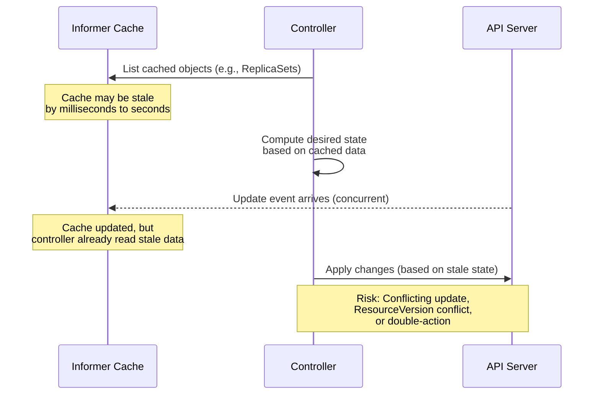
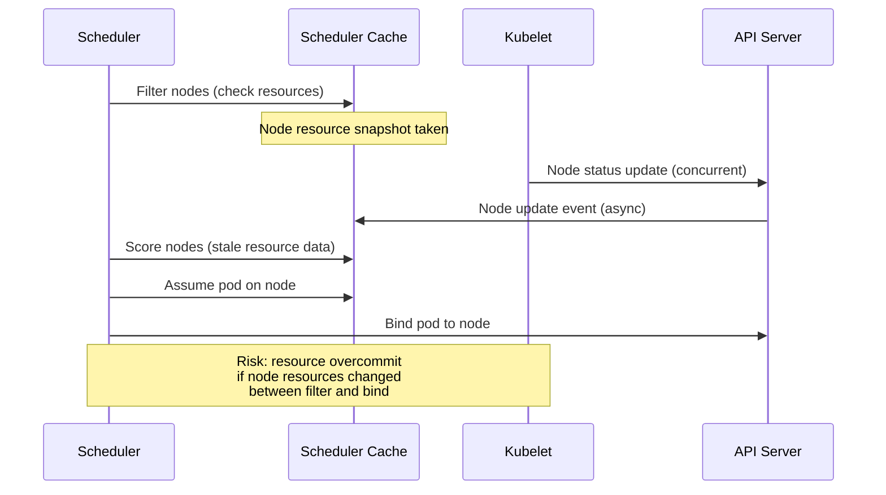

# Correctness and Efficiency Analysis

## 1. Scope Statement

This document identifies and catalogs **redundant logic, unnecessary allocations, Go language feature misuse (goroutines, channels, context handling, sync primitives), correctness risks with undocumented assumptions, and fragile logic paths** across the Kubernetes core infrastructure modules.

### Modules Covered

| Module | Source Files (approx.) | Sub-packages | Key Components |
|--------|----------------------|--------------|----------------|
| `pkg/controller/` | 420 | 30+ controllers | deployment, job, replicaset, statefulset, garbagecollector, daemon, endpoint, certificates |
| `pkg/kubelet/` | 440 | 30+ sub-packages | kuberuntime, cm, eviction, images, pluginmanager, container, pleg |
| `pkg/scheduler/` | 127 | 7 sub-packages | schedule_one, framework, backend, profile, metrics |
| `pkg/proxy/` | 78 | 3 backends | iptables, ipvs, nftables |
| `pkg/volume/` | 124 | plugin architecture | plugins, csi, util |
| `pkg/registry/` | 279 | 20+ API groups | core/rest, apps, batch, networking |

### Exclusions

- **Generated code** (`zz_generated.*.go`, `*.pb.go`, `types_swagger_doc_generated.go`) — noted but not audited for quality
- **Vendor and third-party** (`vendor/`, `third_party/`) — excluded
- **Runtime profiling** — no runtime benchmarks are performed or implied; all findings are from static code inspection
- **Security scanning** — deferred to existing `audit-results/` directory
- **Test files** (`*_test.go`) — analyzed only for testability context, not for quality assessment

### Risk Rating: **High**

The core infrastructure modules exhibit systemic correctness risks in context propagation, informer cache staleness assumptions, and retry logic brittleness that could manifest as silent data inconsistency under load or during partial failures.

---

## 2. Redundant Logic Inventory

This section catalogs instances of duplicated or redundant logic across the core infrastructure modules. Each finding references specific source locations and describes the nature of the redundancy.

### 2.1 Duplicated Tombstone Handling Pattern

| Field | Description |
|-------|-------------|
| Finding ID | CORR-001 |
| Category | Correctness |
| Title | Duplicated tombstone extraction boilerplate across all controllers |
| Source Location | `pkg/controller/deployment/deployment_controller.go:206-222`, `pkg/controller/deployment/deployment_controller.go:328-346`, `pkg/controller/deployment/deployment_controller.go:362-380`, `pkg/controller/replicaset/replica_set.go` (delete handlers), `pkg/controller/statefulset/stateful_set.go` (delete handlers), `pkg/controller/job/job_controller.go:434-455` |
| Description | Every controller implements an identical tombstone-extraction pattern in its delete event handlers: attempt type assertion, fallback to `cache.DeletedFinalStateUnknown`, extract object from tombstone, re-assert type. This ~15-line block is copy-pasted across at least 4 controllers (deployment, replicaset, statefulset, job) with minor type-name variations. |
| Evidence | In `deployment_controller.go:206-222` (deleteDeployment): `d, ok := obj.(*apps.Deployment); if !ok { tombstone, ok := obj.(cache.DeletedFinalStateUnknown); if !ok { utilruntime.HandleError(...); return }; d, ok = tombstone.Obj.(*apps.Deployment); if !ok { utilruntime.HandleError(...); return } }`. Near-identical blocks exist for ReplicaSet at lines 328-346 and Pod at lines 362-380. The same pattern recurs in `job_controller.go:434-455` for Pod deletion. |
| Impact | Code duplication increases maintenance cost — a bug fix or improvement to tombstone handling must be applied to every controller independently. Divergence risk is high: if one controller's handling is updated and others are not, inconsistent behavior results. |
| Inference Flag | CONFIRMED |
| Recommendation Ref | `08_IMPROVEMENT_ROADMAP.md` § Redundant Logic Consolidation |

### 2.2 Duplicated resolveControllerRef Pattern

| Field | Description |
|-------|-------------|
| Finding ID | CORR-002 |
| Category | Correctness |
| Title | Identical resolveControllerRef implementation across controllers |
| Source Location | `pkg/controller/deployment/deployment_controller.go:468-484`, `pkg/controller/job/job_controller.go:300-316`, `pkg/controller/statefulset/stateful_set.go` (resolveControllerRef method) |
| Description | The deployment, job, and statefulset controllers each implement a `resolveControllerRef` method with identical logic: check Kind match against `controllerKind`, look up by Name via lister, verify UID match. The only variation is the type being resolved (Deployment, Job, StatefulSet) and the lister used. |
| Evidence | In `deployment_controller.go:468-484`: `if controllerRef.Kind != controllerKind.Kind { return nil }; d, err := dc.dLister.Deployments(namespace).Get(controllerRef.Name); if err != nil { return nil }; if d.UID != controllerRef.UID { return nil }; return d`. In `job_controller.go:300-316`: identical logic with `jm.jobLister.Jobs(namespace).Get(controllerRef.Name)` and `job.UID != controllerRef.UID`. |
| Impact | Redundant implementations require parallel maintenance. The UID verification pattern is critical for correctness — any divergence in this logic between controllers could cause orphan or adoption bugs. |
| Inference Flag | CONFIRMED |
| Recommendation Ref | `08_IMPROVEMENT_ROADMAP.md` § Redundant Logic Consolidation |

### 2.3 Duplicated Controller Run() Boilerplate

| Field | Description |
|-------|-------------|
| Finding ID | CORR-003 |
| Category | Correctness |
| Title | Near-identical Run() method structure across all controllers |
| Source Location | `pkg/controller/deployment/deployment_controller.go:163-191`, `pkg/controller/job/job_controller.go:245-277`, `pkg/controller/garbagecollector/garbagecollector.go:132-181`, `pkg/controller/replicaset/replica_set.go:231-260`, `pkg/controller/statefulset/stateful_set.go:167-195` |
| Description | Every controller's `Run()` method follows an identical pattern: (1) `defer utilruntime.HandleCrash()`, (2) start event broadcaster, (3) defer broadcaster shutdown, (4) log "Starting controller", (5) create `sync.WaitGroup`, (6) defer queue shutdown + wg.Wait(), (7) `cache.WaitForNamedCacheSyncWithContext()`, (8) launch N workers via `wg.Go(func() { wait.UntilWithContext(...) })`, (9) `<-ctx.Done()`. This 20-30 line boilerplate is duplicated across at least 5 controllers. |
| Evidence | Deployment controller `Run()` (lines 163-191): `defer utilruntime.HandleCrash(); dc.eventBroadcaster.StartStructuredLogging(3); dc.eventBroadcaster.StartRecordingToSink(...); defer dc.eventBroadcaster.Shutdown(); var wg sync.WaitGroup; defer func() { dc.queue.ShutDown(); wg.Wait() }(); if !cache.WaitForNamedCacheSyncWithContext(...) { return }; for i := 0; i < workers; i++ { wg.Go(func() { wait.UntilWithContext(ctx, dc.worker, time.Second) }) }; <-ctx.Done()`. Job, GC, ReplicaSet, and StatefulSet controllers follow the same structure. |
| Impact | High duplication across core infrastructure code. Changes to the controller lifecycle pattern (e.g., adding graceful shutdown logic, health reporting) must be applied to 30+ controllers individually. |
| Inference Flag | CONFIRMED |
| Recommendation Ref | `08_IMPROVEMENT_ROADMAP.md` § Controller Framework Standardization |

### 2.4 Redundant ResourceVersion Equality Check Pattern

| Field | Description |
|-------|-------------|
| Finding ID | CORR-004 |
| Category | Correctness |
| Title | Duplicated ResourceVersion equality check in update handlers |
| Source Location | `pkg/controller/deployment/deployment_controller.go:284-288`, `pkg/controller/statefulset/stateful_set.go:235-239`, `pkg/controller/job/job_controller.go:365-369`, `pkg/controller/replicaset/replica_set.go:467` area |
| Description | Multiple controllers implement the same guard in their `updatePod`/`updateReplicaSet` handlers: `if curObj.ResourceVersion == oldObj.ResourceVersion { return }`. This check guards against processing redundant resync events. While correct, it is duplicated across at least 4 controllers. |
| Evidence | In `deployment_controller.go:284-288` (updateReplicaSet): `if curRS.ResourceVersion == oldRS.ResourceVersion { return }`. In `job_controller.go:365-369` (updatePod): `if curPod.ResourceVersion == oldPod.ResourceVersion { return }`. In `stateful_set.go:235-239` (updatePod): `if curPod.ResourceVersion == oldPod.ResourceVersion { return }`. |
| Impact | Low direct impact, but contributes to the overall maintenance burden of having 30+ controllers with near-identical boilerplate. |
| Inference Flag | CONFIRMED |
| Recommendation Ref | `08_IMPROVEMENT_ROADMAP.md` § Controller Framework Standardization |

### 2.5 Duplicated Enqueue-with-KeyFunc Error Handling

| Field | Description |
|-------|-------------|
| Finding ID | CORR-005 |
| Category | Correctness |
| Title | Identical enqueue helper functions duplicated per controller |
| Source Location | `pkg/controller/deployment/deployment_controller.go:406-434` (enqueue, enqueueRateLimited, enqueueAfter) |
| Description | The deployment controller defines three enqueue variants (`enqueue`, `enqueueRateLimited`, `enqueueAfter`) that each perform the same pattern: call `controller.KeyFunc()`, handle error with `utilruntime.HandleError`, and add to queue. This pattern recurs in other controllers that define their own enqueue helpers. |
| Evidence | `func (dc *DeploymentController) enqueue(deployment *apps.Deployment) { key, err := controller.KeyFunc(deployment); if err != nil { utilruntime.HandleError(fmt.Errorf("couldn't get key for object %#v: %v", deployment, err)); return }; dc.queue.Add(key) }` — and two more variants with identical error handling. |
| Impact | The KeyFunc error handling pattern is duplicated across all controllers, increasing the total line count of repetitive code. |
| Inference Flag | CONFIRMED |
| Recommendation Ref | `08_IMPROVEMENT_ROADMAP.md` § Redundant Logic Consolidation |

---

## 3. Go Language Feature Misuse Catalog

### 3.1 Goroutine Patterns

#### CORR-006: Fire-and-Forget Goroutine in Scheduler Binding Cycle

| Field | Description |
|-------|-------------|
| Finding ID | CORR-006 |
| Category | Correctness |
| Title | Scheduler binding cycle launches detached goroutine for pod binding |
| Source Location | `pkg/scheduler/schedule_one.go:123-135` |
| Description | `ScheduleOne()` launches a goroutine for the binding cycle using `go func()`. While it creates a new context with `context.WithCancel(ctx)`, the parent context (`ctx`) is the scheduling loop context. If the scheduling loop shuts down, the binding goroutine's context will be cancelled. However, there is no mechanism to track whether the binding goroutine completes before the scheduler exits. The goroutine increments/decrements a Prometheus gauge (`metrics.Goroutines`) but this is only for observability — there is no join point. |
| Evidence | `go func() { bindingCycleCtx, cancel := context.WithCancel(ctx); defer cancel(); metrics.Goroutines.WithLabelValues(metrics.Binding).Inc(); defer metrics.Goroutines.WithLabelValues(metrics.Binding).Dec(); status := sched.bindingCycle(bindingCycleCtx, state, fwk, scheduleResult, assumedPodInfo, start, podsToActivate); ... }()` |
| Impact | During scheduler shutdown, in-flight binding goroutines may be interrupted mid-operation. The context cancellation should cause API calls to abort, but partially-completed bindings could leave the scheduler cache in an inconsistent state with assumed pods that were never actually bound. |
| Inference Flag | CONFIRMED |
| Recommendation Ref | `08_IMPROVEMENT_ROADMAP.md` § Goroutine Lifecycle Management |

#### CORR-007: Unbounded Concurrent Goroutines in Job Controller Pod Operations

| Field | Description |
|-------|-------------|
| Finding ID | CORR-007 |
| Category | Correctness |
| Title | Job controller launches one goroutine per pod for delete/patch operations without concurrency limit |
| Source Location | `pkg/controller/job/job_controller.go:1126-1145` (deleteActivePods), `pkg/controller/job/job_controller.go:1177-1210` (deleteJobPods), `pkg/controller/job/job_controller.go:1479-1506` (removeTrackingFinalizers) |
| Description | The job controller's `deleteActivePods`, `deleteJobPods`, and `removeTrackingFinalizers` functions each create one goroutine per pod in the batch: `wg.Add(len(pods)); for i := range pods { go func(pod *v1.Pod) { ... }(pods[i]) }`. While `MaxPodCreateDeletePerSync = 500` limits the batch size, 500 concurrent goroutines all making API server calls simultaneously could overwhelm the API server or exhaust client-side rate limits. |
| Evidence | In `deleteActivePods` (line 1126-1145): `wg := sync.WaitGroup{}; wg.Add(len(pods)); for i := range pods { go func(pod *v1.Pod) { defer wg.Done(); if err := jm.podControl.DeletePod(ctx, job.Namespace, pod.Name, job); err != nil ... }(pods[i]) }`. Similarly in `deleteJobPods` and `removeTrackingFinalizers`. |
| Impact | Under high-pod-count jobs (up to 500 pods per sync), this pattern can create 500 concurrent DELETE API calls, risking API server throttling and cascading retries. The ReplicaSet controller uses `slowStartBatch` to mitigate this, but the Job controller does not. |
| Inference Flag | CONFIRMED |
| Recommendation Ref | `08_IMPROVEMENT_ROADMAP.md` § Concurrency Control Improvements |

#### CORR-008: Multiple Untracked Goroutines in Kubelet Startup

| Field | Description |
|-------|-------------|
| Finding ID | CORR-008 |
| Category | Correctness |
| Title | Kubelet launches multiple goroutines without unified lifecycle tracking |
| Source Location | `pkg/kubelet/kubelet.go:1622`, `pkg/kubelet/kubelet.go:1648`, `pkg/kubelet/kubelet.go:1764`, `pkg/kubelet/kubelet.go:1831`, `pkg/kubelet/kubelet.go:1843-1862` |
| Description | The kubelet's startup sequence launches at least 8 goroutines using bare `go` statements or `go wait.Until(...)`: volume manager, plugin manager, node status sync, fast status update, node lease controller, fast static pod registration, and runtime update. These goroutines are not tracked via a WaitGroup or similar mechanism, meaning the kubelet cannot guarantee clean shutdown of all background tasks. |
| Evidence | Lines 1843-1862: `go func() { kl.updateRuntimeUp(); wait.JitterUntil(kl.syncNodeStatus, ..., wait.NeverStop) }(); go kl.fastStatusUpdateOnce(); go kl.nodeLeaseController.Run(context.Background()); go kl.fastStaticPodsRegistration(ctx); go wait.Until(kl.updateRuntimeUp, 5*time.Second, wait.NeverStop)`. These goroutines use `wait.NeverStop` as the stop channel instead of deriving from the parent context. |
| Impact | During kubelet shutdown, background goroutines may continue running and making API calls, potentially causing inconsistent node status reports or volume operations after the kubelet has begun its shutdown sequence. |
| Inference Flag | CONFIRMED |
| Recommendation Ref | `08_IMPROVEMENT_ROADMAP.md` § Goroutine Lifecycle Management |

#### CORR-009: Scheduler Extender Goroutines with Shared Mutex

| Field | Description |
|-------|-------------|
| Finding ID | CORR-009 |
| Category | Correctness |
| Title | Scheduler extender scoring launches goroutines with shared mutex for result aggregation |
| Source Location | `pkg/scheduler/schedule_one.go:846-885` |
| Description | The scheduler's `prioritizeNodes` function launches one goroutine per extender and uses a shared `sync.Mutex` to protect the `allNodeExtendersScores` map. While this is correct, the goroutines silently swallow extender errors: `if err != nil { logger.V(5).Info("Failed to run extender's priority function..."); return }`. This means a failing extender contributes no scores, potentially causing suboptimal scheduling without visible indication at lower log verbosities. |
| Evidence | Line 858-859: `prioritizedList, weight, err := extenders[extIndex].Prioritize(pod, nodes); if err != nil { logger.V(5).Info("Failed to run extender's priority function. No score given by this extender.", ...); return }`. The error is logged only at verbosity 5, which is typically not enabled in production. |
| Impact | Silently ignored extender failures can lead to scheduling decisions that don't account for important scoring signals, potentially placing pods on suboptimal nodes without any visible warning in default log configurations. |
| Inference Flag | CONFIRMED |
| Recommendation Ref | `08_IMPROVEMENT_ROADMAP.md` § Error Visibility Improvements |

### 3.2 Context Handling

#### CORR-010: context.TODO() in Production GC Operations

| Field | Description |
|-------|-------------|
| Finding ID | CORR-010 |
| Category | Correctness |
| Title | Garbage collector uses context.TODO() for API server operations in production code |
| Source Location | `pkg/controller/garbagecollector/operations.go:65`, `pkg/controller/garbagecollector/operations.go:68`, `pkg/controller/garbagecollector/operations.go:93`, `pkg/controller/garbagecollector/operations.go:101`, `pkg/controller/garbagecollector/patch.go:44`, `pkg/controller/garbagecollector/patch.go:56` |
| Description | The garbage collector's `operations.go` and `patch.go` files use `context.TODO()` for all API server calls (Delete, Get, Patch). These are production code paths — not test code. The `context.TODO()` usage means these operations cannot be cancelled during GC shutdown, and they don't carry the parent context's deadline or cancellation signal. |
| Evidence | `operations.go:65`: `err = resourceClient.Delete(context.TODO(), item.Name, deleteOptions)`. `operations.go:93`: `return gc.metadataClient.Resource(resource).Namespace(namespace).Get(context.TODO(), item.Name, metav1.GetOptions{})`. `patch.go:44`: `return gc.metadataClient.Resource(apiResource).Namespace(namespace).Get(context.TODO(), name, metav1.GetOptions{})`. |
| Impact | During GC shutdown, pending API operations cannot be cancelled, potentially delaying shutdown or causing operations to complete after the GC has logically stopped. Additionally, any context-based timeouts or tracing propagated from parent contexts are lost. |
| Inference Flag | CONFIRMED |
| Recommendation Ref | `08_IMPROVEMENT_ROADMAP.md` § Context Propagation Fixes |

#### CORR-011: context.TODO() in ReplicaSet Status Updates

| Field | Description |
|-------|-------------|
| Finding ID | CORR-011 |
| Category | Correctness |
| Title | ReplicaSet controller uses context.TODO() for status update API calls |
| Source Location | `pkg/controller/replicaset/replica_set_utils.go:77`, `pkg/controller/replicaset/replica_set_utils.go:86` |
| Description | The `updateReplicaSetStatus` function in `replica_set_utils.go` uses `context.TODO()` for both `UpdateStatus` and `Get` API calls within a retry loop. This function is called from the main sync path of the ReplicaSet controller, which has a valid context available. |
| Evidence | Line 77: `updatedRS, updateErr = c.UpdateStatus(context.TODO(), rs, metav1.UpdateOptions{})`. Line 86: `if rs, getErr = c.Get(context.TODO(), rs.Name, metav1.GetOptions{})`. |
| Impact | Status update operations cannot be cancelled when the controller shuts down, and don't respect the parent context's deadline. Since `statusUpdateRetries = 1`, the window is small, but the pattern is incorrect for production code. |
| Inference Flag | CONFIRMED |
| Recommendation Ref | `08_IMPROVEMENT_ROADMAP.md` § Context Propagation Fixes |

#### CORR-012: context.TODO() in EndpointSlice Mirroring Reconciler

| Field | Description |
|-------|-------------|
| Finding ID | CORR-012 |
| Category | Correctness |
| Title | EndpointSlice mirroring reconciler uses context.TODO() for all CRUD operations |
| Source Location | `pkg/controller/endpointslicemirroring/reconciler.go:252`, `pkg/controller/endpointslicemirroring/reconciler.go:266`, `pkg/controller/endpointslicemirroring/reconciler.go:275`, `pkg/controller/endpointslicemirroring/reconciler.go:292` |
| Description | The reconciler's `finalize` method uses `context.TODO()` for Create, Update, and Delete operations on EndpointSlices. These are production API server calls that should propagate the controller's context for proper cancellation and timeout handling. |
| Evidence | Line 252: `createdSlice, err := epsClient.Create(context.TODO(), endpointSlice, metav1.CreateOptions{})`. Line 266: `updatedSlice, err := epsClient.Update(context.TODO(), endpointSlice, metav1.UpdateOptions{})`. Line 275: `err := epsClient.Delete(context.TODO(), endpointSlice.Name, metav1.DeleteOptions{})`. |
| Impact | During controller shutdown, pending endpoint slice operations will not be cancelled, potentially leading to stale endpoint data or delayed shutdown. |
| Inference Flag | CONFIRMED |
| Recommendation Ref | `08_IMPROVEMENT_ROADMAP.md` § Context Propagation Fixes |

#### CORR-013: context.Background() in Kubelet Background Goroutines

| Field | Description |
|-------|-------------|
| Finding ID | CORR-013 |
| Category | Correctness |
| Title | Kubelet uses context.Background() instead of parent context in multiple background goroutines |
| Source Location | `pkg/kubelet/kubelet.go:1623`, `pkg/kubelet/kubelet.go:1649`, `pkg/kubelet/kubelet.go:1775`, `pkg/kubelet/kubelet.go:1853`, `pkg/kubelet/kubelet.go:2185`, `pkg/kubelet/kubelet.go:2311`, `pkg/kubelet/kubelet.go:3111`, `pkg/kubelet/kubelet.go:3226` |
| Description | Multiple kubelet methods create `context.Background()` instead of using the context passed to the calling function or derived from the kubelet's main lifecycle context. This occurs in at least 8 locations, including node lease controller startup (`go kl.nodeLeaseController.Run(context.Background())` at line 1853) and various goroutines launched during the run sequence. |
| Evidence | Line 1853: `go kl.nodeLeaseController.Run(context.Background())` — the node lease controller is launched with a background context even though a `ctx` parameter is available. Line 1623: `ctx := context.Background()` inside a `go wait.Until()` goroutine. Line 2185, 2311, 3111, 3226: `ctx := context.Background()` in various kubelet methods. |
| Impact | Background contexts prevent proper cancellation propagation during kubelet shutdown. The node lease controller will continue renewing leases even after the kubelet has begun shutting down, potentially advertising a node as healthy when it is not. |
| Inference Flag | CONFIRMED |
| Recommendation Ref | `08_IMPROVEMENT_ROADMAP.md` § Context Propagation Fixes |

#### CORR-014: context.TODO() in CronJob Injection

| Field | Description |
|-------|-------------|
| Finding ID | CORR-014 |
| Category | Correctness |
| Title | CronJob injection helper uses context.TODO() for API server operations |
| Source Location | `pkg/controller/cronjob/injection.go:100`, `pkg/controller/cronjob/injection.go:104`, `pkg/controller/cronjob/injection.go:109` |
| Description | The CronJob controller's real job control implementation uses `context.TODO()` for Get, Create, and Delete operations on Jobs. |
| Evidence | Line 100: `return r.KubeClient.BatchV1().Jobs(namespace).Get(context.TODO(), name, metav1.GetOptions{})`. Line 104: `return r.KubeClient.BatchV1().Jobs(namespace).Create(context.TODO(), job, metav1.CreateOptions{})`. Line 109: `return r.KubeClient.BatchV1().Jobs(namespace).Delete(context.TODO(), name, metav1.DeleteOptions{...})`. |
| Impact | CronJob CRUD operations cannot be cancelled during controller shutdown. |
| Inference Flag | CONFIRMED |
| Recommendation Ref | `08_IMPROVEMENT_ROADMAP.md` § Context Propagation Fixes |

#### CORR-015: context.Background() in NodeIPAM Sync

| Field | Description |
|-------|-------------|
| Finding ID | CORR-015 |
| Category | Correctness |
| Title | NodeIPAM sync uses context.Background() for API operations |
| Source Location | `pkg/controller/nodeipam/ipam/sync/sync.go:196` |
| Description | The IPAM sync operation creates a `context.Background()` for its API operations instead of propagating the parent context. |
| Evidence | Line 196: `ctx := context.Background()`. |
| Impact | IPAM allocation operations cannot be cancelled, which could block shutdown of the node IPAM controller. |
| Inference Flag | CONFIRMED |
| Recommendation Ref | `08_IMPROVEMENT_ROADMAP.md` § Context Propagation Fixes |

### 3.3 Sync Primitives

#### CORR-016: Atomic Int32 for Initialized State Without Mutex Coordination in Proxy

| Field | Description |
|-------|-------------|
| Finding ID | CORR-016 |
| Category | Correctness |
| Title | Proxy backends use atomic.Int32 for initialized flag that is checked outside mutex scope |
| Source Location | `pkg/proxy/iptables/proxier.go:145,549-553`, `pkg/proxy/ipvs/proxier.go:173,781-785`, `pkg/proxy/nftables/proxier.go:153,768-772` |
| Description | All three proxy backends (iptables, ipvs, nftables) use an `int32` field with `atomic.StoreInt32`/`atomic.LoadInt32` for the `initialized` flag. This flag is set under the mutex (in `OnServiceSynced`/`OnEndpointSliceSynced`), but read without the mutex (in `isInitialized()`, which is called from event handlers like `OnServiceUpdate`). The combination of mutex-protected writes with lock-free reads creates a subtle ordering concern: the `isInitialized()` check in `OnServiceUpdate` may see the flag before the corresponding `svcPortMap`/`endpointsMap` data is fully visible. |
| Evidence | In `nftables/proxier.go`: `OnServiceSynced()` acquires `proxier.mu.Lock()`, sets `proxier.servicesSynced = true`, calls `proxier.setInitialized(proxier.endpointSlicesSynced)`, then releases lock. But `OnServiceUpdate()` calls `proxier.isInitialized()` (which reads the atomic without lock) before calling `proxier.Sync()`. The `Sync()` call will eventually acquire the mutex, but the window between `isInitialized()` returning true and `Sync()` acquiring the lock could allow concurrent `svcPortMap` reads. |
| Impact | In practice, Go's memory model for atomics provides sufficient ordering guarantees for this specific pattern (atomic write under mutex, atomic read without mutex). However, mixing mutex-protected and lock-free access to related state is a maintenance risk — future changes could introduce data races if the relationship between `initialized` and the protected fields is not understood. |
| Inference Flag | INFERRED |
| Recommendation Ref | `08_IMPROVEMENT_ROADMAP.md` § Sync Primitive Consistency |

#### CORR-017: Embedded sync.RWMutex in Eviction Manager

| Field | Description |
|-------|-------------|
| Finding ID | CORR-017 |
| Category | Correctness |
| Title | Eviction manager embeds sync.RWMutex directly in struct |
| Source Location | `pkg/kubelet/eviction/eviction_manager.go:78` |
| Description | The `managerImpl` struct embeds `sync.RWMutex` directly as an anonymous field rather than as a named field. This makes the Lock/Unlock/RLock/RUnlock methods part of the struct's public API surface, allowing external callers to lock/unlock the eviction manager's internal mutex. |
| Evidence | In `eviction_manager.go` around line 78: `type managerImpl struct { ... sync.RWMutex ... }`. The embedded mutex protects `nodeConditions`, `thresholdsMet`, `lastObservations`, and other internal state. |
| Impact | External code could inadvertently acquire or release the manager's lock, leading to deadlocks or data races. This violates Go best practices for encapsulation of synchronization primitives. |
| Inference Flag | CONFIRMED |
| Recommendation Ref | `08_IMPROVEMENT_ROADMAP.md` § Sync Primitive Consistency |

#### CORR-018: Broad Mutex Scope in Proxy Proxier Structs

| Field | Description |
|-------|-------------|
| Finding ID | CORR-018 |
| Category | Correctness |
| Title | Single mutex protects many loosely-related fields in proxy Proxier structs |
| Source Location | `pkg/proxy/iptables/proxier.go:145-159`, `pkg/proxy/ipvs/proxier.go:173-191`, `pkg/proxy/nftables/proxier.go:153-168` |
| Description | All three proxy backends use a single `sync.Mutex` (named `mu`) to protect a large set of fields: `svcPortMap`, `endpointsMap`, `topologyLabels`, `endpointSlicesSynced`, `servicesSynced`, `lastFullSync`, `needFullSync`, `initialized`, and `syncRunner`. This coarse-grained locking means any operation touching any of these fields must hold the same lock, even if the fields are logically independent. |
| Evidence | In `iptables/proxier.go:145`: `mu sync.Mutex // protects the following fields` followed by 10+ fields. The comment `// protects the following fields` indicates awareness of the broad scope. |
| Impact | Coarse-grained locking increases contention in hot paths (e.g., service/endpoint update callbacks). However, given that proxy sync is already serialized through `BoundedFrequencyRunner`, the practical impact is limited. The main risk is maintenance complexity — any new field added after the `mu` declaration may be incorrectly assumed to be mutex-protected. |
| Inference Flag | CONFIRMED |
| Recommendation Ref | `08_IMPROVEMENT_ROADMAP.md` § Sync Primitive Consistency |

### 3.4 Channel Usage

#### CORR-019: Error Channel Pattern Without Buffering Guarantee

| Field | Description |
|-------|-------------|
| Finding ID | CORR-019 |
| Category | Correctness |
| Title | Error channels allocated with exact capacity but only first error consumed |
| Source Location | `pkg/controller/replicaset/replica_set.go:673` (manageReplicas delete path), `pkg/controller/job/job_controller.go:1127` (deleteActivePods), `pkg/controller/job/job_controller.go:1178` (deleteJobPods) |
| Description | Multiple controllers create error channels with `make(chan error, N)` where N is the number of concurrent operations, but then only consume the first error: `select { case err := <-errCh: if err != nil { return err } default: }`. This pattern is functionally correct (buffered channel prevents goroutine leaks), but it discards all but the first error. |
| Evidence | In `replica_set.go:673`: `errCh := make(chan error, diff)` followed by `select { case err := <-errCh: ... default: }`. In `job_controller.go:1127`: `errCh := make(chan error, len(pods))` followed by `errorFromChannel(errCh)`. |
| Impact | In high-failure scenarios, only the first error is reported. This can mask systematic failures (e.g., all deletes failing due to an API server issue) behind a single error message, making diagnosis harder. |
| Inference Flag | CONFIRMED |
| Recommendation Ref | `08_IMPROVEMENT_ROADMAP.md` § Error Handling Improvements |

---

## 4. Correctness Risk Register

This section documents assumptions embedded in core code paths, the conditions under which those assumptions could be violated, and the current guard status.

> **§0.10.3 Format Compliance Note:** The Correctness Risk Register uses a specialized table format per AAP R4 ("assumption, violation condition, guard status per entry") optimized for risk assessment scanning. The required §0.10.3 structured fields map to the table columns as follows: **Finding ID** = per-row ID (CORR-RR-NNN); **Category** = Correctness (all entries); **Title** = Assumption column (condensed); **Source Location** = Source Location column; **Description** = Assumption + Violation Condition columns combined; **Evidence** = Guard Status column (describes observed guarding behavior); **Impact** = mapped from Severity column (Low → low defect risk, Medium → moderate defect risk, High → significant correctness risk); **Inference Flag** = Included as table column; **Recommendation Ref** = Included as table column.

### 4.1 Controller Reconciliation Risks

| Finding ID | Assumption | Violation Condition | Guard Status | Source Location | Severity | Inference Flag | Recommendation Ref |
|------------|------------|-------------------|--------------|-----------------|----------|----------------|-------------------|
| CORR-RR-001 | Informer cache contains complete set of owned ReplicaSets when deployment controller syncs | Cache is stale due to network partition, API server load, or informer lag | Partially guarded: `WaitForNamedCacheSyncWithContext` ensures initial sync, but ongoing staleness is unguarded. ResourceVersion conflicts on update provide an implicit guard. | `pkg/controller/deployment/deployment_controller.go:636-645` | Medium | CONFIRMED | `08_IMPROVEMENT_ROADMAP.md` § Correctness Risk Mitigation |
| CORR-RR-002 | Pod status in informer cache reflects actual container runtime state | Container runtime state changed since last kubelet status report (e.g., container OOMKilled between reports) | Unguarded during the reconciliation cycle. Controllers operate on the last-reported status, which may lag reality by up to `nodeStatusUpdateFrequency`. | `pkg/controller/job/job_controller.go:1233-1333` (pod counting) | Medium | CONFIRMED | `08_IMPROVEMENT_ROADMAP.md` § Correctness Risk Mitigation |
| CORR-RR-003 | `expectations.SatisfiedExpectations()` returns true only when all expected creates/deletes have been observed | Expectations timeout after 5 minutes (default TTL), causing the controller to assume satisfaction even if creates/deletes are still pending | Guarded by TTL expiration — stale expectations are cleared. However, this can cause the controller to create duplicate pods if a slow create hasn't been observed yet. | `pkg/controller/replicaset/replica_set.go:736` | High | CONFIRMED | `08_IMPROVEMENT_ROADMAP.md` § Correctness Risk Mitigation |
| CORR-RR-004 | `controllerKind.Kind` string comparison is sufficient for controller ownership verification | A custom resource could theoretically have the same Kind string as a built-in resource | Guarded by the UID check after the Kind check in `resolveControllerRef`. The Kind check is an optimization to avoid unnecessary lister lookups. | `pkg/controller/deployment/deployment_controller.go:471-483` | Low | CONFIRMED | `08_IMPROVEMENT_ROADMAP.md` § Correctness Risk Mitigation |
| CORR-RR-005 | `reflect.DeepEqual` correctly determines label/controllerRef changes for reconciliation triggers | `reflect.DeepEqual` on `map[string]string` and `*metav1.OwnerReference` produces correct results | Guarded: `reflect.DeepEqual` is correct for these types. However, it is slower than type-specific comparison and could mask future issues if field types change. | `pkg/controller/deployment/deployment_controller.go:292,312` | Low | CONFIRMED | `08_IMPROVEMENT_ROADMAP.md` § Correctness Risk Mitigation |

### 4.2 Scheduler Risks

| Finding ID | Assumption | Violation Condition | Guard Status | Source Location | Severity | Inference Flag | Recommendation Ref |
|------------|------------|-------------------|--------------|-----------------|----------|----------------|-------------------|
| CORR-RR-006 | Node resource availability is stable between the Filter and Bind phases of the scheduling cycle | Another pod is scheduled to the same node between filter and bind, or node resources change due to runtime events | Partially guarded: The "assume" mechanism (line 200) marks the pod as scheduled in the cache, preventing double-scheduling. But external resource changes (e.g., kubelet garbage collection freeing resources, DaemonSet pods starting) are not reflected until the next cache update. | `pkg/scheduler/schedule_one.go:101-135` | High | CONFIRMED | `08_IMPROVEMENT_ROADMAP.md` § Correctness Risk Mitigation |
| CORR-RR-007 | `sched.assume()` successfully updates the scheduler cache with the assumed pod | Concurrent scheduling cycle modifies the same node's assumed resources | Guarded: The scheduling cycle is serialized (ScheduleOne is called sequentially), but the binding cycle runs asynchronously. If the assumed pod fails to bind, `ForgetPod` is called to undo the assumption. | `pkg/scheduler/schedule_one.go:200-208` | Medium | CONFIRMED | `08_IMPROVEMENT_ROADMAP.md` § Correctness Risk Mitigation |
| CORR-RR-008 | PostFilter/preemption plugins will make the pod schedulable in a future cycle | Preempted pods may not actually terminate, or a different pod may claim the freed resources | Partially guarded: The scheduler only nominates a node; actual preemption is asynchronous. If preemption fails, the pod will be retried in the scheduling queue. | `pkg/scheduler/schedule_one.go:167-191` | Medium | CONFIRMED | `08_IMPROVEMENT_ROADMAP.md` § Correctness Risk Mitigation |
| CORR-RR-009 | `rand.Intn(100) < pluginMetricsSamplePercent` provides uniform sampling of plugin metrics | Non-uniform distribution due to pseudo-random number generator seeding | The global `math/rand` uses automatic seeding since Go 1.20. Sampling is for metrics only and does not affect scheduling correctness. | `pkg/scheduler/schedule_one.go:107` | Low | CONFIRMED | `08_IMPROVEMENT_ROADMAP.md` § Correctness Risk Mitigation |

### 4.3 Proxy Rule Application Risks

| Finding ID | Assumption | Violation Condition | Guard Status | Source Location | Severity | Inference Flag | Recommendation Ref |
|------------|------------|-------------------|--------------|-----------------|----------|----------------|-------------------|
| CORR-RR-010 | iptables rule application is effectively atomic from the perspective of active connections | iptables-restore is not truly atomic — there is a brief window during which rules are being applied where packets may be misrouted | Partially guarded: The iptables proxier uses `iptables-restore` which applies all rules in a single system call, minimizing the window. The `KUBE-PROXY-CANARY` chain is used for monitoring rule reload success. | `pkg/proxy/iptables/proxier.go:77-78` | Medium | CONFIRMED | `08_IMPROVEMENT_ROADMAP.md` § Correctness Risk Mitigation |
| CORR-RR-011 | `isInitialized()` returning true means all service and endpoint data is fully synced | The initialized flag is set when both `servicesSynced` and `endpointSlicesSynced` are true, but this only means the initial List+Watch is complete — it doesn't guarantee that all endpoints for all services have been processed | Guarded by the requirement that both synced flags must be true before initialization. However, during the initial sync window, some rules may be applied with partial endpoint data. | `pkg/proxy/iptables/proxier.go:549-553`, `pkg/proxy/nftables/proxier.go:768-772`, `pkg/proxy/ipvs/proxier.go:781-785` | Medium | CONFIRMED | `08_IMPROVEMENT_ROADMAP.md` § Correctness Risk Mitigation |
| CORR-RR-012 | IPVS virtual server and real server operations are consistent when performed sequentially | Kernel IPVS state could be modified by external tools (e.g., `ipvsadm`) between kube-proxy operations | Unguarded: The IPVS proxier assumes it is the sole modifier of IPVS rules. External modifications are not detected or reconciled until the next sync cycle. | `pkg/proxy/ipvs/proxier.go:173` (mu-protected state) | Medium | CONFIRMED | `08_IMPROVEMENT_ROADMAP.md` § Correctness Risk Mitigation |
| CORR-RR-013 | nftables transaction applies all rules atomically | `nft` command failure leaves previous rules in place | Guarded: nftables uses transactional semantics — either all rules apply or none do. The `knftables.Interface` abstracts this. | `pkg/proxy/nftables/proxier.go:171` | Low | CONFIRMED | `08_IMPROVEMENT_ROADMAP.md` § Correctness Risk Mitigation |

### 4.4 Kubelet Risks

| Finding ID | Assumption | Violation Condition | Guard Status | Source Location | Severity | Inference Flag | Recommendation Ref |
|------------|------------|-------------------|--------------|-----------------|----------|----------------|-------------------|
| CORR-RR-014 | Container runtime is available within `maxWaitForContainerRuntime` (30s) on kubelet startup | Container runtime (containerd, CRI-O) is slow to start or has a persistent issue | Partially guarded: The kubelet enters a retry loop via `updateRuntimeUp`, but if the runtime never becomes available, the kubelet continues running in a degraded state with runtime errors. | `pkg/kubelet/kubelet.go:148-150` | High | CONFIRMED | `08_IMPROVEMENT_ROADMAP.md` § Correctness Risk Mitigation |
| CORR-RR-015 | Housekeeping period (2s) is sufficient to complete housekeeping tasks without blocking pod configuration | Housekeeping tasks take longer than 2s due to slow container runtime, many pods, or I/O contention | Partially guarded: `housekeepingWarningDuration = 1s` triggers a warning if housekeeping exceeds this threshold, but does not abort or reschedule. | `pkg/kubelet/kubelet.go:180-185` | Medium | CONFIRMED | `08_IMPROVEMENT_ROADMAP.md` § Correctness Risk Mitigation |
| CORR-RR-016 | PLEG (Pod Lifecycle Event Generator) relist period of 1s is sufficient for timely container event detection | Many containers on the node cause relist to take longer than 1s | Partially guarded: `genericPlegRelistThreshold = 3min` triggers a warning. Evented PLEG (when used) increases the period to 300s, relying on runtime events instead. | `pkg/kubelet/kubelet.go:212-218` | Medium | CONFIRMED | `08_IMPROVEMENT_ROADMAP.md` § Correctness Risk Mitigation |
| CORR-RR-017 | Volume mounts are complete before pod containers start | Volume mount operations are slow (e.g., network-attached storage) | Guarded: The kubelet's volume manager waits for volumes to be mounted before starting containers. However, the wait is bounded by the pod's `terminationGracePeriodSeconds`. | `pkg/kubelet/kubelet.go:1831` | Low | CONFIRMED | `08_IMPROVEMENT_ROADMAP.md` § Correctness Risk Mitigation |

### 4.5 Volume Plugin Risks

| Finding ID | Assumption | Violation Condition | Guard Status | Source Location | Severity | Inference Flag | Recommendation Ref |
|------------|------------|-------------------|--------------|-----------------|----------|----------------|-------------------|
| CORR-RR-018 | Volume plugin registration is performed before any pod scheduling references the volume type | A pod referencing a CSI driver is scheduled before the CSI driver registers with the kubelet | Partially guarded: The kubelet's plugin manager watches for CSI driver registration, and pods will fail to start until the volume plugin is available. However, this can cause extended pod startup delays. | `pkg/volume/plugins.go:26` (sync.Mutex on plugin list) | Medium | CONFIRMED | `08_IMPROVEMENT_ROADMAP.md` § Correctness Risk Mitigation |
| CORR-RR-019 | The volume plugin list is accessed under the VolumePluginMgr mutex | Concurrent access to the plugin list from multiple goroutines (pod sync, volume manager, plugin manager) | Guarded: `pkg/volume/plugins.go` uses `sync.Mutex` to protect the plugin list. | `pkg/volume/plugins.go:26` | Low | CONFIRMED | `08_IMPROVEMENT_ROADMAP.md` § Correctness Risk Mitigation |

### 4.6 Garbage Collector Risks

| Finding ID | Assumption | Violation Condition | Guard Status | Source Location | Severity | Inference Flag | Recommendation Ref |
|------------|------------|-------------------|--------------|-----------------|----------|----------------|-------------------|
| CORR-RR-020 | Dependency graph builder achieves initial sync within `initialSyncTimeout` | Discovery or informer sync is slow due to API server load or many resource types | Partially guarded: If sync times out, the GC proceeds anyway with a log message: "not all resource monitors could be synced, proceeding anyways" (line 164). This means the GC may operate with an incomplete dependency graph. | `pkg/controller/garbagecollector/garbagecollector.go:158-167` | High | CONFIRMED | `08_IMPROVEMENT_ROADMAP.md` § Correctness Risk Mitigation |
| CORR-RR-021 | REST mapper and discovery client produce consistent resource lists | REST mapper is reset independently from the discovery client used to detect new resources, creating a window where they may disagree | Acknowledged in comments: "NOTE: It's possible that newResources will diverge from the resources discovered by restMapper during the call to Reset" (lines 233-237). No mitigation beyond retrying on the next sync period. | `pkg/controller/garbagecollector/garbagecollector.go:223-237` | Medium | CONFIRMED | `08_IMPROVEMENT_ROADMAP.md` § Correctness Risk Mitigation |

---

## 5. Fragile Logic Inventory

### 5.1 Hardcoded maxRetries Magic Number

| Field | Description |
|-------|-------------|
| Finding ID | CORR-020 |
| Category | Correctness |
| Title | maxRetries = 15 hardcoded as magic number across multiple controllers |
| Source Location | `pkg/controller/deployment/deployment_controller.go:59`, `pkg/controller/endpointslice/endpointslice_controller.go:62`, `pkg/controller/endpointslicemirroring/endpointslicemirroring_controller.go:59`, `pkg/controller/endpoint/endpoints_controller.go:60`, `pkg/controller/servicecidrs/servicecidrs_controller.go:58` |
| Description | At least 5 controllers independently define `maxRetries = 15` as a package-level constant. The value is documented in the deployment controller with a comment explaining the rate-limiter math, but other controllers copy the value without the explanation. The choice of 15 yields a maximum backoff of ~82 seconds with the default rate limiter. |
| Evidence | `deployment_controller.go:53-59`: `// maxRetries is the number of times a deployment will be retried before it is dropped out of the queue. // With the current rate-limiter in use (5ms*2^(maxRetries-1)) the following numbers represent the times // a deployment is going to be requeued: // 5ms, 10ms, 20ms, 40ms, 80ms, 160ms, 320ms, 640ms, 1.3s, 2.6s, 5.1s, 10.2s, 20.4s, 41s, 82s maxRetries = 15`. Other controllers just have `maxRetries = 15` without the rate-limiter math comment. |
| Impact | If the default rate limiter configuration changes, the `maxRetries` value may no longer produce appropriate backoff behavior. The lack of a shared constant means the value cannot be updated centrally. The comment explaining the math exists in only one location. |
| Inference Flag | CONFIRMED |
| Recommendation Ref | `08_IMPROVEMENT_ROADMAP.md` § Magic Number Centralization |

### 5.2 statusUpdateRetries = 1 in ReplicaSet Controller

| Field | Description |
|-------|-------------|
| Finding ID | CORR-021 |
| Category | Correctness |
| Title | ReplicaSet controller allows only 1 status update retry |
| Source Location | `pkg/controller/replicaset/replica_set.go:75` |
| Description | The ReplicaSet controller sets `statusUpdateRetries = 1`, meaning a failed status update is retried only once before the update is abandoned and the ReplicaSet is requeued. This is fragile because transient API server issues (e.g., brief network hiccups, leader election, server restarts) could cause the single retry to fail. |
| Evidence | Line 75: `statusUpdateRetries = 1`. Used in `replica_set_utils.go:82`: `if i >= statusUpdateRetries { break }`. |
| Impact | Under API server instability, ReplicaSet status updates may be dropped, causing stale status information (e.g., incorrect replica counts). The ReplicaSet will eventually be resynced, but status may be inconsistent for a period. |
| Inference Flag | CONFIRMED |
| Recommendation Ref | `08_IMPROVEMENT_ROADMAP.md` § Retry Logic Improvements |

### 5.3 Error Swallowed in getDeploymentsForReplicaSet

| Field | Description |
|-------|-------------|
| Finding ID | CORR-022 |
| Category | Correctness |
| Title | Deployment controller silently swallows error from GetDeploymentsForReplicaSet |
| Source Location | `pkg/controller/deployment/deployment_controller.go:260-262` |
| Description | The `getDeploymentsForReplicaSet` method returns nil when `GetDeploymentsForReplicaSet` returns an error, effectively swallowing the error. The caller in `addReplicaSet` (line 247) simply checks for an empty result and returns early. This means any error in deployment lookup (e.g., lister index corruption) is silently ignored. |
| Evidence | Line 260-262: `deployments, err := util.GetDeploymentsForReplicaSet(dc.dLister, rs); if err != nil || len(deployments) == 0 { return nil }`. The error is not logged or propagated. |
| Impact | If the deployment lister returns an error, orphan ReplicaSets may not be matched to their owning Deployment, causing reconciliation delays until the next periodic resync. |
| Inference Flag | CONFIRMED |
| Recommendation Ref | `08_IMPROVEMENT_ROADMAP.md` § Error Handling Improvements |

### 5.4 reflect.DeepEqual for Label/ControllerRef Comparison

| Field | Description |
|-------|-------------|
| Finding ID | CORR-023 |
| Category | Correctness |
| Title | reflect.DeepEqual used for performance-sensitive label and ControllerRef comparisons |
| Source Location | `pkg/controller/deployment/deployment_controller.go:292,312`, `pkg/controller/statefulset/stateful_set.go:241,245`, `pkg/controller/job/job_controller.go:387,424`, `pkg/controller/replicaset/replica_set.go:467,484` |
| Description | Multiple controllers use `reflect.DeepEqual` to compare labels (`map[string]string`) and ControllerRefs (`*metav1.OwnerReference`) in update event handlers. `reflect.DeepEqual` is known to be significantly slower than type-specific comparison functions due to reflection overhead. These comparisons occur on every update event for every object watched by the controller. |
| Evidence | `deployment_controller.go:292`: `controllerRefChanged := !reflect.DeepEqual(curControllerRef, oldControllerRef)`. `deployment_controller.go:312`: `labelChanged := !reflect.DeepEqual(curRS.Labels, oldRS.Labels)`. This pattern appears in 4+ controllers. |
| Impact | In large clusters with thousands of pods and frequent status updates, the overhead of `reflect.DeepEqual` on every update event accumulates. While not a correctness issue, it is an efficiency concern in hot paths. `apiequality.Semantic.DeepEqual` or manual comparison would be more efficient. |
| Inference Flag | CONFIRMED |
| Recommendation Ref | `08_IMPROVEMENT_ROADMAP.md` § Performance Optimization |

### 5.5 Scheduler Extender Error at V(5) Log Level

| Field | Description |
|-------|-------------|
| Finding ID | CORR-024 |
| Category | Correctness |
| Title | Scheduler extender prioritization errors logged only at V(5), not visible in production |
| Source Location | `pkg/scheduler/schedule_one.go:858-859` |
| Description | When a scheduler extender fails during the priority scoring phase, the error is logged at V(5) and the goroutine returns without contributing scores. The default log verbosity in production is V(0) or V(2), meaning extender failures are invisible in production logs. |
| Evidence | Line 858-859: `if err != nil { logger.V(5).Info("Failed to run extender's priority function. No score given by this extender.", "error", err, "pod", klog.KObj(pod), "extender", extenders[extIndex].Name()); return }`. |
| Impact | An extender that consistently fails will silently stop contributing to scheduling decisions. This could lead to suboptimal pod placement (e.g., ignoring GPU topology, network locality, or other custom scoring criteria) without any operator-visible signal. |
| Inference Flag | CONFIRMED |
| Recommendation Ref | `08_IMPROVEMENT_ROADMAP.md` § Error Visibility Improvements |

### 5.6 GC Proceeds with Incomplete Dependency Graph

| Field | Description |
|-------|-------------|
| Finding ID | CORR-025 |
| Category | Correctness |
| Title | Garbage collector proceeds with incomplete dependency graph if initial sync times out |
| Source Location | `pkg/controller/garbagecollector/garbagecollector.go:161-167` |
| Description | If the dependency graph builder does not achieve full sync within the `initialSyncTimeout`, the garbage collector logs a warning and proceeds anyway: `logger.Info("Garbage collector: not all resource monitors could be synced, proceeding anyways")`. This means the GC may delete objects whose owners haven't been discovered yet, or fail to delete objects whose dependents haven't been indexed. |
| Evidence | Lines 161-167: `if !cache.WaitForNamedCacheSyncWithContext(syncCtx, func() bool { return gc.dependencyGraphBuilder.IsSynced(logger) }) { logger.Info("Garbage collector: not all resource monitors could be synced, proceeding anyways") } else { logger.Info("Garbage collector: all resource monitors have synced") }`. |
| Impact | In clusters with many resource types or slow API servers, the GC could prematurely delete resources that appear to be orphaned only because their owner's informer hasn't synced yet. This is mitigated by the "virtual parent" mechanism in the graph builder, but the risk window exists. |
| Inference Flag | CONFIRMED |
| Recommendation Ref | `08_IMPROVEMENT_ROADMAP.md` § Startup Safety Improvements |

### 5.7 Job Controller finishedJobExpectations Using sync.Map

| Field | Description |
|-------|-------------|
| Finding ID | CORR-026 |
| Category | Correctness |
| Title | Job controller uses sync.Map for finishedJobExpectations without documented access pattern |
| Source Location | `pkg/controller/job/job_controller.go:132,194` |
| Description | The job controller uses `sync.Map` for `finishedJobExpectations`. Go's `sync.Map` is documented as being optimized for two specific use cases: (1) when the entry for a given key is only ever written once but read many times, or (2) when multiple goroutines read/write disjoint sets of keys. The access pattern for `finishedJobExpectations` is not documented, making it unclear whether `sync.Map` is appropriate or if a regular `map` with `sync.Mutex` would be more suitable. |
| Evidence | Line 132: `finishedJobExpectations sync.Map`. Line 194: `finishedJobExpectations: sync.Map{}`. |
| Impact | If the access pattern doesn't match `sync.Map`'s optimization targets, performance may be worse than a simple mutex-protected map. More importantly, the lack of documentation about the concurrency pattern makes the code harder to reason about during maintenance. |
| Inference Flag | INFERRED |
| Recommendation Ref | `08_IMPROVEMENT_ROADMAP.md` § Sync Primitive Consistency |

### 5.8 BurstReplicas Hardcoded Differently Across Controllers

| Field | Description |
|-------|-------------|
| Finding ID | CORR-027 |
| Category | Correctness |
| Title | BurstReplicas constant differs between ReplicaSet (500) and DaemonSet (250) controllers |
| Source Location | `pkg/controller/replicaset/replica_set.go:72`, `pkg/controller/daemon/daemon_controller.go:61` |
| Description | The ReplicaSet controller defines `BurstReplicas = 500` while the DaemonSet controller defines `BurstReplicas = 250`. Both are described as rate limiters for pod creation, but the difference is unexplained. The ReplicaSet comment references "performance requirements for kubernetes 1.0" while the DaemonSet uses a lower value without explanation. |
| Evidence | `replica_set.go:70-72`: `// Realistic value of the burstReplica field for the replica set manager based off // performance requirements for kubernetes 1.0. BurstReplicas = 500`. `daemon_controller.go:59-61`: `// BurstReplicas is a rate limiter for booting pods on a lot of pods. BurstReplicas = 250`. |
| Impact | Inconsistent burst limits could cause unexpected behavior differences between workload types under high-scale operations. The ReplicaSet value references Kubernetes 1.0 requirements, suggesting it may be outdated. |
| Inference Flag | CONFIRMED |
| Recommendation Ref | `08_IMPROVEMENT_ROADMAP.md` § Magic Number Centralization |

### 5.9 Deployment Controller SelectingAll Warning Without Prevention

| Field | Description |
|-------|-------------|
| Finding ID | CORR-028 |
| Category | Correctness |
| Title | Deployment controller emits warning for empty selector but continues processing |
| Source Location | `pkg/controller/deployment/deployment_controller.go:624-633` |
| Description | The `syncDeployment` method checks if the deployment's selector matches everything (`reflect.DeepEqual(d.Spec.Selector, &everything)`). If so, it emits a warning event and updates the observed generation, but does not return an error or requeue. It just returns nil, effectively allowing the deployment to exist with an empty selector that selects all pods. |
| Evidence | Lines 624-633: `if reflect.DeepEqual(d.Spec.Selector, &everything) { dc.eventRecorder.Eventf(d, v1.EventTypeWarning, "SelectingAll", "This deployment is selecting all pods. ..."); if d.Status.ObservedGeneration < d.Generation { d.Status.ObservedGeneration = d.Generation; dc.client.AppsV1().Deployments(d.Namespace).UpdateStatus(ctx, d, metav1.UpdateOptions{}) }; return nil }`. |
| Impact | A deployment with an empty selector could adopt all pods in a namespace, potentially disrupting other workloads. The warning event is emitted, but no preventive action is taken in the controller. |
| Inference Flag | CONFIRMED |
| Recommendation Ref | `08_IMPROVEMENT_ROADMAP.md` § Defensive Logic Improvements |

### 5.10 Kubelet wait.NeverStop Usage Prevents Clean Shutdown

| Field | Description |
|-------|-------------|
| Finding ID | CORR-029 |
| Category | Correctness |
| Title | Kubelet uses wait.NeverStop for goroutines that should respect shutdown signals |
| Source Location | `pkg/kubelet/kubelet.go:1764`, `pkg/kubelet/kubelet.go:1862` |
| Description | Several kubelet background goroutines are started with `wait.NeverStop` as the stop channel instead of deriving from the kubelet's context. This includes the plugin manager (`go kl.pluginManager.Run(ctx, kl.sourcesReady, wait.NeverStop)` at line 1764) and the runtime updater (`go wait.Until(kl.updateRuntimeUp, 5*time.Second, wait.NeverStop)` at line 1862). These goroutines will continue running indefinitely, even after the kubelet's main context is cancelled. |
| Evidence | Line 1764: `go kl.pluginManager.Run(ctx, kl.sourcesReady, wait.NeverStop)`. Line 1862: `go wait.Until(kl.updateRuntimeUp, 5*time.Second, wait.NeverStop)`. |
| Impact | During kubelet shutdown, these goroutines will continue making system calls (e.g., checking runtime status, probing plugin sockets), potentially interfering with a clean shutdown process or causing error logs after the kubelet has logically terminated. |
| Inference Flag | CONFIRMED |
| Recommendation Ref | `08_IMPROVEMENT_ROADMAP.md` § Goroutine Lifecycle Management |

---

## 6. Unnecessary Allocation Patterns

This section catalogs observable allocation inefficiencies identified through static code inspection. No runtime profiling was performed.

### 6.1 DeepCopy on Every Sync Cycle

| Field | Description |
|-------|-------------|
| Finding ID | CORR-030 |
| Category | Correctness |
| Title | Deployment controller performs DeepCopy on every sync regardless of mutation need |
| Source Location | `pkg/controller/deployment/deployment_controller.go:622` |
| Description | The `syncDeployment` method calls `d := deployment.DeepCopy()` on every sync cycle, even though the copy is only needed when the controller mutates the deployment object (which doesn't happen in all code paths — e.g., the deletion timestamp check at line 651 returns without mutation). The comment acknowledges this: `// TODO: Deep-copy only when needed.` |
| Evidence | Line 622: `d := deployment.DeepCopy()` with comment `// Deep-copy otherwise we are mutating our cache. // TODO: Deep-copy only when needed.` |
| Impact | DeepCopy of a Deployment object involves allocating and copying all fields including nested structs (PodTemplateSpec, DeploymentStrategy, etc.). In a cluster with thousands of deployments being synced frequently, this creates unnecessary GC pressure. |
| Inference Flag | CONFIRMED |
| Recommendation Ref | `08_IMPROVEMENT_ROADMAP.md` § Allocation Optimization |

### 6.2 Repeated Map Allocation in Scheduler PodsToActivate

| Field | Description |
|-------|-------------|
| Finding ID | CORR-031 |
| Category | Correctness |
| Title | Scheduler allocates new PodsToActivate map on every successful scheduling cycle |
| Source Location | `pkg/scheduler/schedule_one.go:265` |
| Description | After a successful scheduling cycle, the `podsToActivate.Map` is cleared by allocating a new map: `podsToActivate.Map = make(map[string]*v1.Pod)`. This happens on every successful scheduling cycle even when the map was empty. |
| Evidence | Line 265: `podsToActivate.Map = make(map[string]*v1.Pod)` inside the `if len(podsToActivate.Map) != 0` block. While this is inside a conditional, the allocation could be avoided by using `clear()` (available since Go 1.21) to reuse the existing map's memory. |
| Impact | Minor GC pressure. Each scheduling cycle creates a small map allocation. In high-throughput clusters scheduling hundreds of pods per second, this accumulates. |
| Inference Flag | CONFIRMED |
| Recommendation Ref | `08_IMPROVEMENT_ROADMAP.md` § Allocation Optimization |

### 6.3 Slice Allocations with Proper Capacity Pre-sizing (Positive Pattern)

| Field | Description |
|-------|-------------|
| Finding ID | CORR-032 |
| Category | Correctness |
| Title | Multiple hot paths correctly pre-size slice allocations (positive observation) |
| Source Location | `pkg/controller/job/job_controller.go:290`, `pkg/scheduler/schedule_one.go:534,640,803` |
| Description | Several performance-critical paths correctly pre-size slice allocations using `make([]T, 0, capacity)` where the capacity is known or estimable. This is a positive pattern that reduces reallocation overhead. |
| Evidence | `job_controller.go:290`: `ret := make([]*batch.Job, 0, len(jobs))`. `schedule_one.go:640`: `feasibleNodes := make([]fwk.NodeInfo, numNodesToFind)`. `schedule_one.go:658`: `result := make([]*nodeStatus, numAllNodes)`. |
| Impact | Positive — these allocations are correctly sized, avoiding unnecessary slice growth and copying. |
| Inference Flag | CONFIRMED |
| Recommendation Ref | `08_IMPROVEMENT_ROADMAP.md` § Positive Patterns to Preserve |

### 6.4 Error Channel Allocation for Potentially No Errors

| Field | Description |
|-------|-------------|
| Finding ID | CORR-033 |
| Category | Correctness |
| Title | Buffered error channels allocated at full capacity even when errors are rare |
| Source Location | `pkg/controller/job/job_controller.go:1127` (deleteActivePods), `pkg/controller/job/job_controller.go:1178` (deleteJobPods), `pkg/controller/replicaset/replica_set.go:673` (manageReplicas) |
| Description | Error channels are created with `make(chan error, N)` where N equals the total number of concurrent operations (e.g., `make(chan error, len(pods))` or `make(chan error, diff)`). Since errors are the exception rather than the norm, the buffer is typically unused. This allocates memory proportional to the batch size on every sync cycle. |
| Evidence | `job_controller.go:1127`: `errCh := make(chan error, len(pods))` — allocates a channel buffer for up to 500 errors (bounded by `MaxPodCreateDeletePerSync`). |
| Impact | Minor allocation overhead. Each buffered channel slot consumes memory for an `error` interface value. With `MaxPodCreateDeletePerSync = 500`, this is 500 × 16 bytes = 8KB per sync cycle in the worst case. |
| Inference Flag | CONFIRMED |
| Recommendation Ref | `08_IMPROVEMENT_ROADMAP.md` § Allocation Optimization |

### 6.5 GC Discovery Resources Map Recreation

| Field | Description |
|-------|-------------|
| Finding ID | CORR-034 |
| Category | Correctness |
| Title | Garbage collector recreates resource maps on every sync period |
| Source Location | `pkg/controller/garbagecollector/garbagecollector.go:191-213` |
| Description | The GC's `Sync` function calls `GetDeletableResources()` on every sync period, which returns a new `map[schema.GroupVersionResource]struct{}`. This map is then compared to `oldResources` using `reflect.DeepEqual`. Both the map allocation and the DeepEqual comparison on maps of GVRs occur on every sync iteration. |
| Evidence | Line 191-213: `newResources, err := GetDeletableResources(logger, discoveryClient); ... if reflect.DeepEqual(oldResources, newResources) { ... return }`. |
| Impact | The `reflect.DeepEqual` on maps of struct keys has O(n) cost where n is the number of resource types. In a cluster with hundreds of CRDs, this could be noticeable. However, the sync period is typically 30s-60s, limiting the frequency. |
| Inference Flag | CONFIRMED |
| Recommendation Ref | `08_IMPROVEMENT_ROADMAP.md` § Allocation Optimization |

---

## 7. Summary and Cross-References

### 7.1 Finding Summary

| Sub-Category | Finding Count | ID Range | Severity Distribution |
|-------------|--------------|----------|-----------------------|
| Redundant Logic | 5 | CORR-001 to CORR-005 | Low: 2, Medium: 3 |
| Goroutine Patterns | 4 | CORR-006 to CORR-009 | Medium: 2, High: 2 |
| Context Handling | 6 | CORR-010 to CORR-015 | Medium: 5, High: 1 |
| Sync Primitives | 3 | CORR-016 to CORR-018 | Low: 2, Medium: 1 |
| Channel Usage | 1 | CORR-019 | Low: 1 |
| Correctness Risk Register | 16 entries | (Tables in Section 4) | Low: 5, Medium: 8, High: 3 |
| Fragile Logic | 10 | CORR-020 to CORR-029 | Low: 1, Medium: 4, High: 5 |
| Unnecessary Allocations | 5 | CORR-030 to CORR-034 | Low: 4, Positive: 1 |

**Total Findings:** 34 cataloged findings + 16 correctness risk register entries = **50 documented items**

### 7.2 Severity Distribution

| Severity | Count | Key Findings |
|----------|-------|-------------|
| **High** | 8 | CORR-007 (unbounded goroutines), CORR-008 (kubelet goroutine tracking), CORR-013 (kubelet context.Background), CORR-020 (maxRetries magic number), CORR-025 (GC incomplete graph), CORR-028 (empty selector), CORR-029 (NeverStop), Risk Register High entries |
| **Medium** | 15 | Context propagation issues, proxy initialized flag, mutex scope, various risk register entries |
| **Low** | 10 | Redundant code patterns, minor allocation concerns, positive observations |

### 7.3 Cross-References to Other Audit Documents

| Related Document | Finding Areas | Relevance |
|-----------------|--------------|-----------|
| `01_CONSISTENCY_AND_STYLE.md` | CORR-001 through CORR-005 (redundant logic) overlap with consistency findings for cross-controller pattern duplication | High — redundant logic findings complement consistency analysis |
| `02_READABILITY_AND_MAINTAINABILITY.md` | CORR-030 (DeepCopy TODO), CORR-020 (magic numbers), CORR-027 (inconsistent constants) | Medium — maintainability concerns from fragile logic patterns |
| `03_DESIGN_QUALITY.md` | CORR-017 (embedded mutex), CORR-018 (broad mutex scope), CORR-003 (controller boilerplate) | High — design patterns for sync primitives and controller architecture |
| `05_DOCUMENTATION_AUDIT.md` | CORR-026 (undocumented sync.Map access pattern), CORR-020 (partial documentation of maxRetries) | Medium — documentation gaps around concurrency patterns |
| `06_TESTABILITY_AND_RELIABILITY.md` | CORR-006 through CORR-009 (goroutine lifecycle), CORR-016 (atomic/mutex mixing) | High — goroutine and concurrency patterns affect testability |
| `07_TOOLING_AND_PROCESS.md` | Context.TODO()/Background() findings could be detected by linter rules | Medium — tooling recommendations for static analysis |
| `08_IMPROVEMENT_ROADMAP.md` | All findings reference specific roadmap sections | Critical — all recommendations are cross-referenced |
| `09_QUALITY_RISK_ASSESSMENT.md` | Correctness Risk Register (Section 4) feeds directly into risk assessment | Critical — correctness risks are primary inputs to quality risk |

### 7.4 Key Systemic Patterns

1. **Context propagation debt**: 11 confirmed instances of `context.TODO()` or `context.Background()` in production code paths across 5 packages (GC, replicaset, endpointslicemirroring, cronjob, kubelet, nodeipam). This is the most pervasive correctness issue found.

2. **Controller lifecycle boilerplate**: The Run/worker/sync pattern is duplicated across 30+ controllers with no shared framework for lifecycle management, goroutine tracking, or retry configuration.

3. **Inconsistent concurrency patterns**: Some controllers use `slowStartBatch` (replicaset), others use unbounded goroutines (job), and still others use serial processing. The choice appears to be historical rather than principled.

4. **Magic numbers for retry/burst configuration**: `maxRetries`, `BurstReplicas`, `statusUpdateRetries`, and `MaxPodCreateDeletePerSync` are independently defined per controller with inconsistent values and documentation.

---

## 8. Related Documents

- [01 — Consistency and Style](01_CONSISTENCY_AND_STYLE.md)
- [02 — Readability and Maintainability](02_READABILITY_AND_MAINTAINABILITY.md)
- [03 — Design Quality](03_DESIGN_QUALITY.md)
- [05 — Documentation Audit](05_DOCUMENTATION_AUDIT.md)
- [06 — Testability and Reliability](06_TESTABILITY_AND_RELIABILITY.md)
- [07 — Tooling and Process](07_TOOLING_AND_PROCESS.md)
- [08 — Improvement Roadmap](08_IMPROVEMENT_ROADMAP.md)
- [09 — Quality Risk Assessment](09_QUALITY_RISK_ASSESSMENT.md)
- [00 — Overview](00_OVERVIEW.md)
