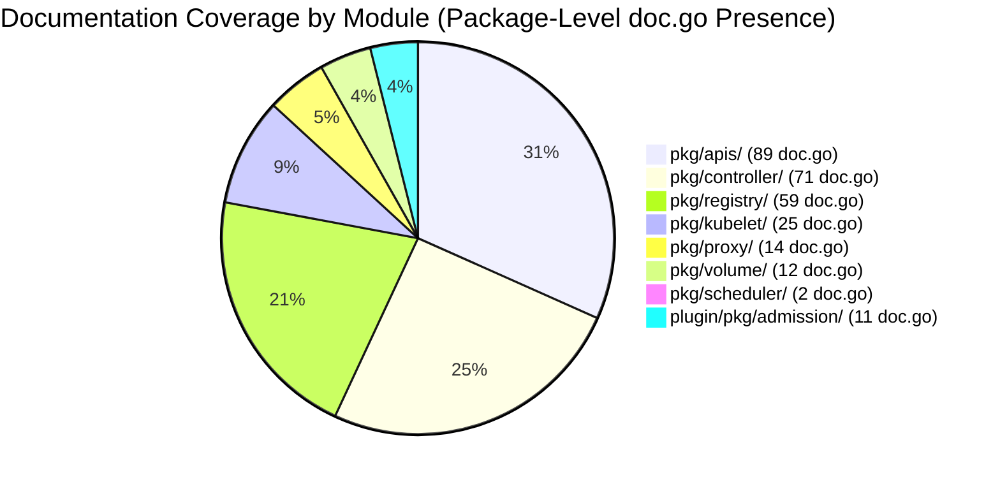
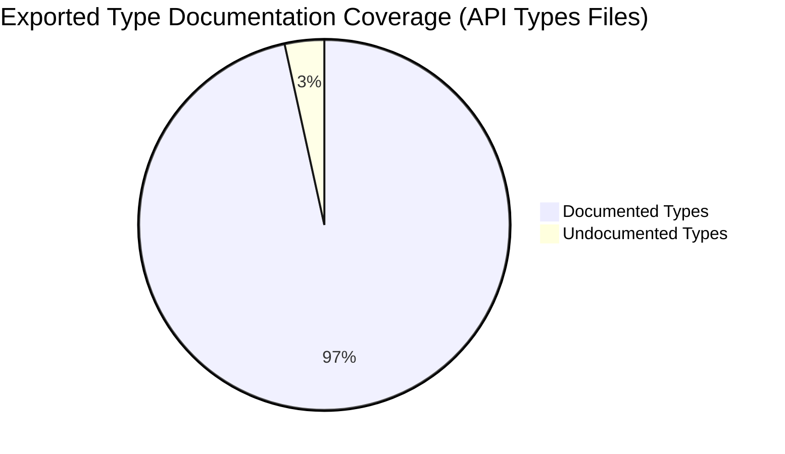
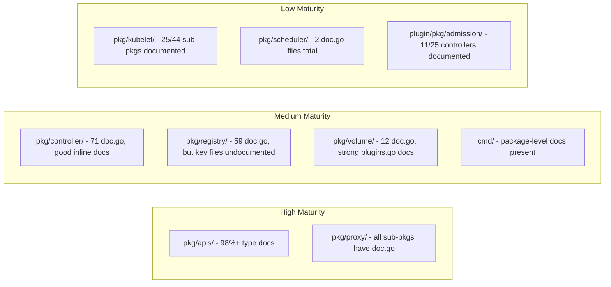

# Documentation and Comments Audit

## Scope and Methodology

### Analysis Scope

This document produces a **complete audit of comment quality, outdated comments, public API documentation coverage, non-obvious logic documentation, and documentation gaps ranked by defect introduction risk** across the Kubernetes Go source tree.

**In-Scope Files:**
- All `*.go` source files across `pkg/`, `cmd/`, `plugin/`, and `staging/` directories
- Approximately **8,313 non-test, non-generated Go source files** across the repository
- Approximately **2,845 test files** (assessed for test documentation coverage only)
- Documentation infrastructure in `hack/`, `cmd/gen*`, and `hack/boilerplate/`

**Excluded from Quality Assessment:**
- `vendor/` and `third_party/` directories
- Generated files as marked in `.gitattributes`:
  - `**/zz_generated.*.go` (linguist-generated)
  - `**/types.generated.go` (linguist-generated)
  - `**/generated.pb.go` (linguist-generated)
  - `**/types_swagger_doc_generated.go` (linguist-generated)
  - `api/openapi-spec/*.json` and `api/openapi-spec/**/*.json` (linguist-generated)
- Total generated files excluded: **~1,138 files**

### Assessment Criteria

Documentation quality is assessed along five axes:

1. **Package-Level Documentation** — Presence and quality of `doc.go` files or package-level comments describing the purpose, usage, and design of each package.
2. **Exported Symbol Documentation** — GoDoc-format comments on exported types, functions, methods, constants, and variables.
3. **Internal Implementation Comments** — Inline comments explaining non-obvious logic, algorithm rationale, and design decisions.
4. **Marker Comments** — `TODO`, `FIXME`, `HACK`, and `BUG` markers indicating known debt or incomplete work.
5. **License Headers** — Presence of Apache 2.0 license boilerplate per `hack/boilerplate/boilerplate.go.txt`.

### Existing Documentation Infrastructure

The repository includes built-in documentation generators:
- `cmd/gendocs` — Generates kubectl CLI documentation via Cobra's `doc.GenMarkdownTree`
- `cmd/genkubedocs` — Generates component documentation for kube-apiserver, kube-controller-manager, kube-proxy, kube-scheduler, kubelet, and kubeadm (with kubeadm-specific postprocessing via `MarkdownPostProcessing`)
- `cmd/genman` — Generates man pages for all major components
- `cmd/genyaml` — Generates kubectl YAML examples
- `cmd/genswaggertypedocs` — Generates Swagger type documentation
- `hack/update-generated-docs.sh` — Orchestration pipeline that builds and invokes all generators, placing output into `docs/user-guide/kubectl/`, `docs/admin/`, `docs/man/man1/`, and `docs/yaml/kubectl/`

### Risk Rating

| Dimension | Rating |
|-----------|--------|
| Documentation and Comments | **High** |

---

## Comment Quality Distribution

### Overview

Comment quality across the Kubernetes codebase is **highly variable by module**. The `pkg/apis/` packages exhibit the strongest documentation discipline due to their role as the public API surface, while infrastructure modules like `pkg/kubelet/` have extensive internal comments but inconsistent exported symbol documentation. The `pkg/scheduler/` and `pkg/proxy/` modules have focused documentation on key interfaces but leave significant gaps in sub-packages.

### Module-Level Quality Distribution

| Module | Source Files | doc.go Files | Sub-Packages w/o doc.go | TODO/FIXME Count | Quality Rating |
|--------|-------------|-------------|------------------------|-----------------|---------------|
| `pkg/kubelet/` | 424 | 25 | 20+ (container, metrics, nodeshutdown, pluginmanager, pod, prober, status, etc.) | 343 | Medium |
| `pkg/controller/` | 340 | 71 | 15 (deployment, disruption, garbagecollector, nodelifecycle, statefulset, etc.) | 164 | High |
| `pkg/apis/` | 374 | 89 | Few (most API groups have doc.go) | 110 | High |
| `pkg/registry/` | 279 | 59 | Few | 96 | Medium |
| `pkg/scheduler/` | 123 | 2 | 7 (backend, framework, metrics, profile, testing, util, apis) | 23 | Medium |
| `pkg/proxy/` | 74 | 14 | 0 (all sub-packages have doc.go) | 28 | Medium |
| `pkg/volume/` | 124 | 12 | 8 (csi, csimigration, downwardapi, flexvolume, image, projected, testing, validation) | 79 | Medium |
| `cmd/` | 380 | N/A | N/A | 105 | Medium |
| `plugin/pkg/admission/` | 62 | 11 | 18 (admit, alwayspullimages, certificates, deny, gc, limitranger, namespace, network, etc.) | 20 | Medium |

### Per-Module Detailed Assessment

#### pkg/kubelet/ (424 source files)

The kubelet package is the **largest module** in the repository and has **inconsistent documentation quality**. The main `kubelet.go` file has no package-level doc comment — the `package kubelet` declaration appears without a preceding comment block. Constants are generally well-documented (e.g., `maxWaitForContainerRuntime`, `nodeStatusUpdateRetry`, `nodeReadyGracePeriod` all have descriptive comments). Key exported types like `SyncHandler`, `Bootstrap`, `Dependencies`, and `Option` are documented. However, 4 exported functions in `kubelet.go` lack GoDoc comments.

The kubelet has the **highest TODO/FIXME density** in the codebase (343 markers), with many referencing ongoing contextual logging migration (e.g., `TODO: Pass logger from context once contextual logging migration is complete`). Multiple `context.TODO()` and `klog.TODO()` calls indicate deferred context plumbing work.

**20+ sub-packages lack `doc.go` files**, including critical subsystems: `container/`, `metrics/`, `nodeshutdown/`, `pluginmanager/`, `pod/`, `prober/`, `status/`, `certificate/`, `configmap/`, `events/`, `kubeletconfig/`, `logs/`, `network/`, `oom/`, `preemption/`, `runtimeclass/`, `secret/`, `stats/`, `sysctl/`, and `podcertificate/`.

#### pkg/controller/ (340 source files)

The controller package exhibits **above-average documentation discipline** with 71 `doc.go` files across its sub-packages. The `deployment_controller.go` serves as a strong positive example — it has a comprehensive package-level comment (lines 17–21: `Package deployment contains all the logic for handling Kubernetes Deployments...`), well-documented constants with timing calculations (e.g., `maxRetries = 15` with the full retry timing series), and all exported functions and types documented.

However, **15 controller sub-packages lack `doc.go` files**, including significant controllers: `deployment/`, `disruption/`, `garbagecollector/`, `nodelifecycle/`, `statefulset/`, `certificates/`, `endpointslice/`, `endpointslicemirroring/`, `clusterroleaggregation/`, `history/`, `servicecidrs/`, `storageversiongc/`, `storageversionmigrator/`, and `testutil/`.

#### pkg/apis/ (374 source files)

The API types packages have the **highest documentation quality** in the repository. The `pkg/apis/core/types.go` file documents 301 of 306 exported types (98.4% coverage), with only 5 types missing GoDoc comments: `TypedObjectReference` (line 577), `GRPCAction` (line 2773), `ResourceStatus` (line 3028), `ResourceHealthStatus` (line 3057), and `ContainerExtendedResourceRequest` (line 3977). The `pkg/apis/apps/types.go` achieves 100% documentation coverage (41/41 exported types).

Other API group type files with undocumented types:
- `pkg/apis/certificates/types.go`: 5 undocumented of 15 types
- `pkg/apis/networking/types.go`: 2 undocumented of 37 types
- `pkg/apis/resource/types.go`: 2 undocumented of 54 types
- `pkg/apis/coordination/types.go`: 1 undocumented of 7 types
- `pkg/apis/storagemigration/types.go`: 1 undocumented of 5 types

Most API group directories have `doc.go` files (89 across `pkg/apis/`), providing consistent package-level documentation.

#### pkg/registry/ (279 source files)

The registry module provides REST storage implementations for all API groups. It has 59 `doc.go` files across sub-packages, demonstrating reasonable package-level coverage. However, the core `storage_core.go` file has **4 out of 4 exported functions undocumented** (`New`, `NewRESTStorage`, `PostStartHook`, `GroupName`) and **2 of 3 exported types undocumented** (`ProxyConfig`, `ServicesConfig`). Only the `Config` type carries a GoDoc comment.

#### pkg/scheduler/ (123 source files)

The scheduler has only **2 `doc.go` files** for its entire package tree, with **7 sub-packages missing `doc.go`**: `backend/`, `framework/`, `metrics/`, `profile/`, `testing/`, `util/`, and `apis/`. The main `scheduler.go` has no package-level doc comment. Key types like `Scheduler` are well-documented with field-level comments, but the `FailureHandlerFn` type (line 633) lacks documentation. The `schedule_one.go` file has good inline comments but heap interface methods (`Pop`, `Len`, `Less`, `Swap`, `Push`) lack individual documentation.

#### pkg/proxy/ (74 source files)

The proxy module has **14 `doc.go` files** covering all sub-packages. The `iptables/proxier.go` has well-documented constants (chain names, thresholds) and struct fields. All 15 exported functions in `proxier.go` carry GoDoc comments. However, the proxy module contains 5 `FIXME` comments — the highest density of `FIXME` markers in any module — including `FIXME: exit` markers in `pkg/proxy/node.go` (lines 199, 208) and `FIXME: winkernel does not implement these` in `pkg/proxy/metrics/metrics.go` (line 327).

#### pkg/volume/ (124 source files)

The volume package has 12 `doc.go` files with **8 sub-packages missing documentation**: `csi/`, `csimigration/`, `downwardapi/`, `flexvolume/`, `image/`, `projected/`, `testing/`, and `validation/`. The core `plugins.go` file has strong documentation — 27 of 29 exported functions are documented, with only the `dummyPluginProber` methods (`Init` and `Probe`, line 1030–1031) undocumented. The volume module has 79 TODO/FIXME markers, many related to deprecated volume types.

#### cmd/ (380 source files, 25 packages)

CLI entrypoint packages generally have good package-level documentation. The `cmd/kube-apiserver/apiserver.go` main file includes a package-level comment describing the API server's role. Documentation generators (`cmd/gendocs`, `cmd/genkubedocs`, etc.) are minimal but functional — they lack their own GoDoc comments beyond basic usage structure. The 105 TODO markers are distributed across `cmd/kubeadm/` (the largest cmd package at 223 files).

#### plugin/pkg/admission/ (62 source files)

The admission controller plugins have **only 11 `doc.go` files** for **25 controller directories**, leaving 18 controllers without package-level documentation: `admit/`, `alwayspullimages/`, `certificates/`, `defaulttolerationseconds/`, `deny/`, `extendedresourcetoleration/`, `gc/`, `limitranger/`, `namespace/`, `network/`, `nodedeclaredfeatures/`, `noderestriction/`, `nodetaint/`, `podnodeselector/`, `priority/`, `resourcequota/`, `runtimeclass/`, and `storage/`.

---

## Findings Catalog: Comment Quality

| Finding ID | Category | Title | Source Location | Description | Evidence | Impact | Inference Flag | Recommendation Ref |
|------------|----------|-------|----------------|-------------|----------|--------|---------------|-------------------|
| DOC-001 | Documentation | Missing package-level doc comment for kubelet | `pkg/kubelet/kubelet.go:17` | The main kubelet package file declares `package kubelet` without a preceding package-level documentation comment. The kubelet is the largest single component in Kubernetes, containing 424 source files and 30+ sub-packages. | Line 17: `package kubelet` — no `// Package kubelet ...` comment precedes this declaration, nor does a `doc.go` file exist in `pkg/kubelet/`. | Engineers unfamiliar with the codebase have no package-level GoDoc entry point describing the kubelet's purpose, architecture, or key abstractions. This increases onboarding friction for the most complex component. | CONFIRMED | `08_IMPROVEMENT_ROADMAP.md § P2 Recommendations` |
| DOC-002 | Documentation | Missing package-level doc comment for scheduler | `pkg/scheduler/scheduler.go:17` | The scheduler package file declares `package scheduler` without a preceding package-level documentation comment, and `pkg/scheduler/` has only 2 `doc.go` files for its entire sub-package tree. | Line 17: `package scheduler` — no package comment. Only `pkg/scheduler/apis/config/v1/doc.go` and `pkg/scheduler/apis/config/doc.go` exist as `doc.go` files. | The scheduling algorithm is a critical correctness domain; missing package documentation increases the risk of incorrect assumptions by contributors modifying scheduling logic. | CONFIRMED | `08_IMPROVEMENT_ROADMAP.md § P2 Recommendations` |
| DOC-003 | Documentation | 20+ kubelet sub-packages missing doc.go files | `pkg/kubelet/container/`, `pkg/kubelet/metrics/`, `pkg/kubelet/nodeshutdown/`, `pkg/kubelet/pluginmanager/`, `pkg/kubelet/pod/`, `pkg/kubelet/prober/`, `pkg/kubelet/status/`, and 13+ more | Of the ~44 sub-packages under `pkg/kubelet/`, only 25 have `doc.go` files. Critical subsystems including container runtime, node shutdown, plugin management, probing, and status reporting lack package-level documentation. | `find pkg/kubelet -maxdepth 1 -type d` yields ~44 directories; `find pkg/kubelet -name "doc.go"` yields 25 files. Missing in: `container/`, `metrics/`, `nodeshutdown/`, `pluginmanager/`, `pod/`, `prober/`, `status/`, `certificate/`, `configmap/`, `events/`, `kubeletconfig/`, `logs/`, `network/`, `oom/`, `preemption/`, `runtimeclass/`, `secret/`, `stats/`, `sysctl/`, `podcertificate/`. | Sub-packages without doc.go produce empty or missing entries in Go package documentation tools, making it harder to discover the purpose and boundaries of each kubelet subsystem. | CONFIRMED | `08_IMPROVEMENT_ROADMAP.md § P2 Recommendations` |
| DOC-004 | Documentation | 15 controller sub-packages missing doc.go files | `pkg/controller/deployment/`, `pkg/controller/disruption/`, `pkg/controller/garbagecollector/`, `pkg/controller/nodelifecycle/`, `pkg/controller/statefulset/`, and 10 more | Despite the controller module having 71 `doc.go` files overall, 15 sub-packages including major controllers (deployment, garbagecollector, nodelifecycle, statefulset) lack package-level documentation files. | Missing `doc.go`: `deployment/`, `disruption/`, `garbagecollector/`, `nodelifecycle/`, `statefulset/`, `certificates/`, `endpointslice/`, `endpointslicemirroring/`, `clusterroleaggregation/`, `history/`, `servicecidrs/`, `storageversiongc/`, `storageversionmigrator/`, `testutil/`, `apis/`. | Note: `deployment_controller.go` has an inline package comment (lines 17–21), but the standard Go convention is to use a `doc.go` file for extended package documentation. Controllers without any package documentation create inconsistency in the GoDoc output. | CONFIRMED | `08_IMPROVEMENT_ROADMAP.md § P2 Recommendations` |
| DOC-005 | Documentation | 7 scheduler sub-packages missing doc.go | `pkg/scheduler/backend/`, `pkg/scheduler/framework/`, `pkg/scheduler/metrics/`, `pkg/scheduler/profile/`, `pkg/scheduler/testing/`, `pkg/scheduler/util/`, `pkg/scheduler/apis/` | The scheduler has only 2 `doc.go` files (both in `apis/config/`) for its entire sub-package tree. All other sub-packages, including the critical `framework/` and `backend/` packages, lack package-level documentation. | `find pkg/scheduler -name "doc.go"` yields only: `pkg/scheduler/apis/config/v1/doc.go` and `pkg/scheduler/apis/config/doc.go`. | The scheduler framework is the primary extension point for scheduling plugins. Missing package documentation for `framework/` forces plugin authors to reverse-engineer interfaces from source code. | CONFIRMED | `08_IMPROVEMENT_ROADMAP.md § P1 Recommendations` |
| DOC-006 | Documentation | 18 admission controller plugins missing doc.go | `plugin/pkg/admission/admit/`, `plugin/pkg/admission/alwayspullimages/`, `plugin/pkg/admission/certificates/`, and 15 more | Of 25 admission controller directories, only 11 have `doc.go` files, leaving 18 plugins without package-level documentation. | Missing `doc.go`: `admit/`, `alwayspullimages/`, `certificates/`, `defaulttolerationseconds/`, `deny/`, `extendedresourcetoleration/`, `gc/`, `limitranger/`, `namespace/`, `network/`, `nodedeclaredfeatures/`, `noderestriction/`, `nodetaint/`, `podnodeselector/`, `priority/`, `resourcequota/`, `runtimeclass/`, `storage/`. | Admission controllers are security-critical gates in the API request pipeline. Without documentation, operators may misconfigure or misunderstand admission behavior, potentially creating security gaps. | CONFIRMED | `08_IMPROVEMENT_ROADMAP.md § P2 Recommendations` |
| DOC-007 | Documentation | 8 volume sub-packages missing doc.go | `pkg/volume/csi/`, `pkg/volume/csimigration/`, `pkg/volume/downwardapi/`, `pkg/volume/flexvolume/`, `pkg/volume/image/`, `pkg/volume/projected/`, `pkg/volume/testing/`, `pkg/volume/validation/` | Of ~20 sub-directories under `pkg/volume/`, 12 have `doc.go` files and 8 do not. The CSI package, which is the primary volume provisioning interface, lacks package documentation. | `find pkg/volume -name "doc.go"` yields 12 files. CSI sub-package (`pkg/volume/csi/`) has no `doc.go`. | CSI is the standard storage interface for Kubernetes. Missing package-level documentation for the CSI implementation increases the barrier for storage developers contributing fixes or features. | CONFIRMED | `08_IMPROVEMENT_ROADMAP.md § P2 Recommendations` |
| DOC-008 | Documentation | Exported function documentation enforced only for cmd/kubeadm | `hack/golangci.yaml` | The golangci-lint configuration explicitly excludes exported symbol documentation requirements for all packages except `cmd/kubeadm` via a `path-except` rule. This means linter enforcement of GoDoc comments is absent for the entire `pkg/`, `plugin/`, and most of `cmd/` tree. | `hack/golangci.yaml`: `path-except: cmd/kubeadm` applied to revive and staticcheck rules for exported symbol documentation comments. | Without linter enforcement, exported symbol documentation degrades over time as new code is added without GoDoc comments. The current configuration creates a two-tier documentation standard. | CONFIRMED | `08_IMPROVEMENT_ROADMAP.md § P1 Recommendations` |
| DOC-009 | Documentation | 343 TODO markers in pkg/kubelet/ — highest density in codebase | `pkg/kubelet/` (distributed across 424 source files) | The kubelet module contains 343 TODO/FIXME markers in non-test, non-generated source files — more than double the next highest module (`pkg/controller/` at 164). Many relate to deferred contextual logging migration. | Examples: `TODO: Pass logger from context once contextual logging migration is complete` (kubelet.go:2092, 2096), `TODO: once context cancellation is added this check can be removed` (kubelet.go:2046), `TODO(#113606): use cancellation from the incoming context parameter` (kubelet.go:2140). | High TODO density indicates significant deferred work. The contextual logging migration TODOs represent a systematic incomplete migration that affects observability and debugging across the kubelet's code paths. | CONFIRMED | `08_IMPROVEMENT_ROADMAP.md § P2 Recommendations` |
| DOC-010 | Documentation | 5 FIXME markers indicating known correctness concerns | `pkg/proxy/metrics/metrics.go:327`, `pkg/proxy/node.go:199,208`, `pkg/kubelet/cm/devicemanager/plugin/v1beta1/client.go:83`, `pkg/api/testing/conversion.go:54` | Five FIXME markers exist in non-test production code, signaling unresolved correctness or completeness issues. Unlike TODOs which may represent enhancement wishes, FIXME markers typically denote known broken or incomplete behavior. | `pkg/proxy/metrics/metrics.go:327`: `FIXME: winkernel does not implement these`. `pkg/proxy/node.go:199`: `FIXME: exit`. `pkg/proxy/node.go:208`: `FIXME: exit`. `pkg/kubelet/cm/devicemanager/plugin/v1beta1/client.go:83`: `FIXME: passing real context to ListAndWatch results in...`. | FIXME in proxy metrics indicates incomplete platform parity. FIXME in node.go suggests unhandled exit conditions in proxy node management. FIXME in device manager indicates a known context handling workaround. | CONFIRMED | `08_IMPROVEMENT_ROADMAP.md § P1 Recommendations` |

---

## Outdated Comment Catalog

### Overview

Outdated comments are categorized into three types: (1) references to removed runtime dependencies (Docker/dockershim), (2) TODO markers referencing issues or migrations that may be stale, and (3) version-specific annotations that no longer apply.

### Findings

| Finding ID | Category | Title | Source Location | Description | Evidence | Impact | Inference Flag | Recommendation Ref |
|------------|----------|-------|----------------|-------------|----------|--------|---------------|-------------------|
| DOC-011 | Documentation | Outdated "Docker" reference in kubelet struct comment | `pkg/kubelet/kubelet.go:1254` | A struct field comment references "simple Docker implementation" as a default, but dockershim was removed in Kubernetes 1.24. The kubelet now uses CRI exclusively. | Line 1254: `// Optional, defaults to simple Docker implementation` — comment on the `runner` field of type `kubecontainer.CommandRunner`. | Misleads developers into believing Docker is still the default container runtime, which has not been true since v1.24. New contributors may spend time investigating non-existent Docker integration paths. | CONFIRMED | `08_IMPROVEMENT_ROADMAP.md § P1 Recommendations` |
| DOC-012 | Documentation | Outdated "dockershim" reference in kubelet pod cleanup | `pkg/kubelet/kubelet.go:2385–2388` | A comment references "dockershim requires the container for retrieving logs" as justification for leaving pod containers for background reclamation. Dockershim was removed in v1.24; the current CRI runtime does not have this requirement. | Lines 2385–2388: `// Note: we leave pod containers to be reclaimed in the background since dockershim requires the container for retrieving logs and we want to make sure logs are available until the pod is physically deleted.` | The outdated rationale may prevent engineers from optimizing the pod cleanup path, as they may believe the deferred reclamation is still necessary for log availability. The actual CRI contract may differ. | CONFIRMED | `08_IMPROVEMENT_ROADMAP.md § P1 Recommendations` |
| DOC-013 | Documentation | 57 Docker/dockershim references in pkg/ comments | `pkg/` (distributed across credentialprovider, kubelet, scheduler, volume packages) | A total of 57 comment lines across `pkg/` reference "Docker" or "dockershim". While some are legitimate (e.g., Docker Hub registry references in `credentialprovider/`), others reference removed runtime behavior. | `grep -rn 'dockershim\|Docker' pkg/ --include="*.go" | grep -v '_test.go' | grep '//' | wc -l` yields 57 matches. Includes `pkg/credentialprovider/keyring.go` ("DockerKeyring", "Docker looks for either a '.' ..."), `pkg/scheduler/framework/plugins/imagelocality/image_locality.go:135` ("Using Docker as runtime..."), and `pkg/kubelet/kubelet.go` Docker references. | Stale Docker references in comments create confusion about the current container runtime architecture. While `credentialprovider` references are naming artifacts (the types are still called `DockerKeyring`), scheduler and kubelet references describe behavior specific to a removed runtime. | CONFIRMED | `08_IMPROVEMENT_ROADMAP.md § P2 Recommendations` |
| DOC-014 | Documentation | TODO referencing issue #113606 appears 3 times without resolution context | `pkg/kubelet/kubelet.go:2140`, `pkg/kubelet/kubelet.go:2183`, `pkg/kubelet/kubelet.go:2309` | Three TODO comments reference GitHub issue #113606 regarding context cancellation propagation from pod workers. The TODOs indicate deferred work to connect incoming context parameters with internal operations. | Line 2140: `// TODO(#113606): use cancellation from the incoming context parameter, which comes from the pod worker.` Line 2183: `// TODO(#113606): connect this with the incoming context parameter, which comes from the pod worker.` Line 2309: `// TODO(#113606): connect this with the incoming context parameter, which comes from the pod worker.` | Without context cancellation propagation, operations in the kubelet sync loop may continue executing after a pod worker has been cancelled, consuming resources unnecessarily and potentially creating race conditions. | CONFIRMED | `08_IMPROVEMENT_ROADMAP.md § P1 Recommendations` |
| DOC-015 | Documentation | TODO referencing issue #87159 for scheduler plugin migration | `pkg/scheduler/schedule_one.go:991` | A TODO comment references issue #87159 indicating that a function should be moved to a plugin architecture, but this migration has not been completed. | Line 991: `// TODO(#87159): Move this to a Plugin.` | Deferred plugin migration indicates design debt in the scheduler. The function remains tightly coupled to the core scheduling loop rather than being abstracted as a framework plugin. | CONFIRMED | `08_IMPROVEMENT_ROADMAP.md § P2 Recommendations` |
| DOC-016 | Documentation | Stale TODO for contextual logging migration across kubelet | `pkg/kubelet/kubelet.go:2092,2096`, `pkg/kubelet/kubelet_pods.go:1043,2770,2782`, `pkg/kubelet/cm/cpumanager/cpu_manager.go:260` | Multiple files contain `TODO: Pass logger from context once contextual logging migration is complete` and `klog.TODO()` placeholder calls, indicating an ongoing but incomplete migration that has persisted across multiple releases. | Examples: `kubelet.go:2092`: `// TODO: Pass logger from context once contextual logging migration is complete`. `cpu_manager.go:260`: `logger := klog.TODO() // until we move topology manager to contextual logging`. `kubelet.go:2093`: `kl.containerManager.UpdateQOSCgroups(klog.TODO())`. | The persistent `klog.TODO()` calls bypass structured logging context, reducing log correlation capability in production debugging. This affects observability for the kubelet's most critical code paths (cgroup management, pod syncing). | CONFIRMED | `08_IMPROVEMENT_ROADMAP.md § P1 Recommendations` |
| DOC-017 | Documentation | TODO referencing removed contextual logging issue #111672 in scheduler | `pkg/scheduler/schedule_one.go:78–80` | A TODO comment references issue #111672 about removing duplicated keys from log entries "when contextualized logging hits GA". | Lines 78–80: `// TODO(knelasevero): Remove duplicated keys from log entry calls // When contextualized logging hits GA // https://github.com/kubernetes/kubernetes/issues/111672` | Contextualized logging has progressed significantly; this TODO may be stale or addressable. The duplicated log keys create noise in structured log output from the scheduler. | INFERRED | `08_IMPROVEMENT_ROADMAP.md § P2 Recommendations` |
| DOC-018 | Documentation | VolumeSource type has TODO from early project history | `pkg/apis/core/types.go:64–66` | The `HostPath` field in `VolumeSource` carries a TODO comment attributed to "jonesdl" about restricting host directory mount permissions, dating from the early project period. | Lines 64–66: `// TODO(jonesdl) We need to restrict who can use host directory mounts and who can/can not // mount host directories as read/write.` | This TODO has been addressed through PodSecurityPolicy (deprecated), Pod Security Standards, and admission controllers. The comment is misleading as it suggests the restriction has not been implemented when it has been via other mechanisms. | INFERRED | `08_IMPROVEMENT_ROADMAP.md § P3 Recommendations` |

---

## Undocumented Public API Surface Map

### Overview

The Kubernetes codebase has a **strong but not universal** convention of documenting exported types and functions with GoDoc comments. The linter configuration (`hack/golangci.yaml`) enforces exported symbol documentation **only for `cmd/kubeadm`**, meaning the rest of the codebase relies on convention rather than tooling enforcement.

### Coverage Map by Package

| Package | Exported Types | Documented | Undocumented | Coverage % |
|---------|---------------|------------|--------------|-----------|
| `pkg/apis/core/types.go` | 306 | 301 | 5 | 98.4% |
| `pkg/apis/apps/types.go` | 41 | 41 | 0 | 100% |
| `pkg/apis/certificates/types.go` | 15 | 10 | 5 | 66.7% |
| `pkg/apis/networking/types.go` | 37 | 35 | 2 | 94.6% |
| `pkg/apis/resource/types.go` | 54 | 52 | 2 | 96.3% |
| `pkg/apis/coordination/types.go` | 7 | 6 | 1 | 85.7% |
| `pkg/apis/storagemigration/types.go` | 5 | 4 | 1 | 80.0% |
| `pkg/kubelet/kubelet.go` (types) | 5 | 5 | 0 | 100% |
| `pkg/kubelet/kubelet.go` (exported funcs) | ~50 | ~46 | 4 | ~92% |
| `pkg/controller/deployment/deployment_controller.go` | 2 (funcs) + 1 (type) | 3 | 0 | 100% |
| `pkg/scheduler/scheduler.go` (types) | 5 | 4 | 1 | 80% |
| `pkg/scheduler/scheduler.go` (exported funcs) | ~15 | ~14 | 1 | ~93% |
| `pkg/scheduler/schedule_one.go` (exported funcs) | 10 | 2 | 8 | 20% |
| `pkg/proxy/iptables/proxier.go` (exported funcs) | 15 | 15 | 0 | 100% |
| `pkg/volume/plugins.go` (exported funcs) | 29 | 27 | 2 | 93.1% |
| `pkg/registry/core/rest/storage_core.go` (exported funcs) | 4 | 0 | 4 | 0% |
| `pkg/registry/core/rest/storage_core.go` (types) | 3 | 1 | 2 | 33.3% |

### Findings

| Finding ID | Category | Title | Source Location | Description | Evidence | Impact | Inference Flag | Recommendation Ref |
|------------|----------|-------|----------------|-------------|----------|--------|---------------|-------------------|
| DOC-019 | Documentation | 5 undocumented exported types in core API types | `pkg/apis/core/types.go:577,2773,3028,3057,3977` | Five exported types in the core API group lack GoDoc comments: `TypedObjectReference` (line 577), `GRPCAction` (line 2773), `ResourceStatus` (line 3028), `ResourceHealthStatus` (line 3057), `ContainerExtendedResourceRequest` (line 3977). | `TypedObjectReference` at line 577 has no preceding `//` comment. `GRPCAction` at line 2773 has no preceding comment. `ResourceStatus` at line 3028 has no preceding comment. `ResourceHealthStatus` at line 3057 has no preceding comment. `ContainerExtendedResourceRequest` at line 3977 has no preceding comment. | Core API types are consumed by every Kubernetes client library and controller. Undocumented types force consumers to infer semantics from field names and usage patterns, increasing the risk of misuse. | CONFIRMED | `08_IMPROVEMENT_ROADMAP.md § P1 Recommendations` |
| DOC-020 | Documentation | 5 undocumented exported types in certificates API | `pkg/apis/certificates/types.go:144,154,163,187,392` | Five exported types in the certificates API group lack GoDoc comments: `CertificateSigningRequestStatus` (line 144), `RequestConditionType` (line 154), `CertificateSigningRequestCondition` (line 163), `CertificateSigningRequestList` (line 187), `PodCertificateRequestStatus` (line 392). | Lines 144, 154, 163, 187, and 392 each declare an exported type without a preceding GoDoc comment. | Certificate-related types are security-critical. Missing documentation increases the risk of incorrect certificate lifecycle handling in controllers and admission webhooks. | CONFIRMED | `08_IMPROVEMENT_ROADMAP.md § P1 Recommendations` |
| DOC-021 | Documentation | Undocumented exported types in networking API | `pkg/apis/networking/types.go:624,669` | Two exported types lack documentation: `ParentReference` (line 624) and `ServiceCIDRSpec` (line 669). | Line 624: `type ParentReference struct {` — no GoDoc comment. Line 669: `type ServiceCIDRSpec struct {` — no GoDoc comment. | `ParentReference` is part of the Gateway API integration; `ServiceCIDRSpec` defines Service CIDR allocation. Both are relatively new API additions where clear documentation is critical for adoption. | CONFIRMED | `08_IMPROVEMENT_ROADMAP.md § P2 Recommendations` |
| DOC-022 | Documentation | Undocumented exported types in resource API | `pkg/apis/resource/types.go:1086,1623` | Two exported types lack documentation: `DeviceAllocationMode` (line 1086) and `AllocationConfigSource` (line 1623). | Line 1086: `type DeviceAllocationMode string` — no GoDoc comment. Line 1623: `type AllocationConfigSource string` — no GoDoc comment. | Dynamic Resource Allocation is a newer API area. Missing documentation on allocation modes creates confusion for DRA driver implementers. | CONFIRMED | `08_IMPROVEMENT_ROADMAP.md § P2 Recommendations` |
| DOC-023 | Documentation | Undocumented CoordinatedLeaseStrategy type | `pkg/apis/coordination/types.go:23` | The `CoordinatedLeaseStrategy` string type lacks a GoDoc comment explaining its purpose in coordinated leader election. | Line 23: `type CoordinatedLeaseStrategy string` — no preceding GoDoc comment. | Coordinated lease strategy is part of the leader election mechanism. Without documentation, the valid values and their semantics are unclear to implementers. | CONFIRMED | `08_IMPROVEMENT_ROADMAP.md § P2 Recommendations` |
| DOC-024 | Documentation | Undocumented MigrationConditionType | `pkg/apis/storagemigration/types.go:52` | The `MigrationConditionType` string type lacks a GoDoc comment. | Line 52: `type MigrationConditionType string` — no preceding GoDoc comment. | Storage migration conditions affect data integrity during API version transitions. Missing documentation increases the risk of incorrect condition handling. | CONFIRMED | `08_IMPROVEMENT_ROADMAP.md § P2 Recommendations` |
| DOC-025 | Documentation | All 4 exported functions undocumented in registry storage_core.go | `pkg/registry/core/rest/storage_core.go:108,154,504,545` | The core REST storage provider has zero GoDoc comments on its exported functions: `New` (line 108), `NewRESTStorage` (line 154), `PostStartHook` (line 504), and `GroupName` (line 545). | Line 108: `func New(c Config, ...` — no comment. Line 154: `func (p *legacyProvider) NewRESTStorage(...)` — no comment. Line 504: `func (p *legacyProvider) PostStartHook()` — no comment. Line 545: `func (p *legacyProvider) GroupName()` — no comment. | The core REST storage provider is the factory for all built-in API resources. Without documentation, the initialization sequence and configuration requirements are opaque to anyone modifying API server startup. | CONFIRMED | `08_IMPROVEMENT_ROADMAP.md § P1 Recommendations` |
| DOC-026 | Documentation | 2 undocumented exported config types in storage_core.go | `pkg/registry/core/rest/storage_core.go:77,82` | The `ProxyConfig` and `ServicesConfig` types lack GoDoc comments despite being part of the core API server configuration surface. | Line 77: `type ProxyConfig struct {` — no comment. Line 82: `type ServicesConfig struct {` — no comment. | Configuration types without documentation force operators and developers to read implementation code to understand valid configurations for the API server's core storage layer. | CONFIRMED | `08_IMPROVEMENT_ROADMAP.md § P2 Recommendations` |
| DOC-027 | Documentation | Undocumented FailureHandlerFn type in scheduler | `pkg/scheduler/scheduler.go:633` | The `FailureHandlerFn` function type, which defines the callback signature for handling scheduling failures, lacks a GoDoc comment. | Line 633: `type FailureHandlerFn func(ctx context.Context, fwk framework.Framework, podInfo *framework.QueuedPodInfo, status *fwk.Status, nominatingInfo *fwk.NominatingInfo, start time.Time)` — no preceding comment. | This type is used by external scheduler implementations to customize failure handling. Without documentation, implementers must reverse-engineer the expected behavior from the default implementation. | CONFIRMED | `08_IMPROVEMENT_ROADMAP.md § P2 Recommendations` |
| DOC-028 | Documentation | 8 undocumented heap interface methods in schedule_one.go | `pkg/scheduler/schedule_one.go:1591,1602,1612,1613,1617,1619,1623` | The `sortedNodeScores` and `nodeScoreHeap` types implement heap interface methods (`Pop`, `Len`, `Less`, `Swap`, `Push`) without individual GoDoc comments. | Lines 1591–1623: `func (s *sortedNodeScores) Pop() string`, `func (s *sortedNodeScores) Len() int`, `func (h nodeScoreHeap) Len() int`, `func (h nodeScoreHeap) Less(i, j int) bool`, `func (h nodeScoreHeap) Swap(i, j int)`, `func (h *nodeScoreHeap) Push(x interface{})`, `func (h *nodeScoreHeap) Pop() interface{}` — all without GoDoc comments. | While heap interface methods follow standard Go patterns, the absence of documentation for the node scoring heap obscures the priority ordering logic (lower or higher scores preferred?) which is critical for scheduling correctness. | CONFIRMED | `08_IMPROVEMENT_ROADMAP.md § P3 Recommendations` |
| DOC-029 | Documentation | 4 undocumented exported functions in kubelet.go | `pkg/kubelet/kubelet.go:3180,3184,3188,3368` | Four exported methods on kubelet-related types lack GoDoc comments: `GetActivePods`, `GetPods`, `GetPodByName` (on `kubeletPodsProvider`), and `SetPodWatchCondition` (on `Kubelet`). | Line 3180: `func (pp *kubeletPodsProvider) GetActivePods() []*v1.Pod` — no comment. Line 3184: `func (pp *kubeletPodsProvider) GetPods() []*v1.Pod` — no comment. Line 3188: `func (pp *kubeletPodsProvider) GetPodByName(...)` — no comment. Line 3368: `func (kl *Kubelet) SetPodWatchCondition(...)` — no comment. | These functions are part of the pod observation interface. `SetPodWatchCondition` is particularly significant as it relates to the PLEG (Pod Lifecycle Event Generator) watch mechanism — undocumented behavior here risks incorrect pod lifecycle monitoring. | CONFIRMED | `08_IMPROVEMENT_ROADMAP.md § P2 Recommendations` |

---

## Non-Obvious Logic Documentation Assessment

### Overview

Non-obvious logic refers to code constructs where the **intent is not immediately apparent** from reading the code alone, and where the absence of explanatory comments creates a risk of incorrect modification. This assessment focuses on critical code paths in the scheduler, kubelet, controller, and proxy modules.

### Positive Examples

Before cataloging gaps, it is important to note strong positive examples of non-obvious logic documentation in the codebase:

1. **Deployment controller retry timing** (`pkg/controller/deployment/deployment_controller.go:53–59`): The `maxRetries = 15` constant is accompanied by a detailed comment explaining the exponential backoff timing with the rate-limiter formula `5ms*2^(maxRetries-1)` and listing all 15 retry intervals.

2. **Scheduler assumed pod expiration** (`pkg/scheduler/scheduler.go:63–66`): The `durationToExpireAssumedPod = 0` constant references issue #106361 for context on why the expiration is set to zero.

3. **Kubelet PLEG configuration** (`pkg/kubelet/kubelet.go:204–213`): The generic PLEG relist period has a detailed comment explaining the trade-off between detection latency and CPU usage.

4. **Proxy large cluster threshold** (`pkg/proxy/iptables/proxier.go:84–87`): The `largeClusterEndpointsThreshold = 1000` constant explains the optimization trade-off between iptables performance and debuggability.

### Findings

| Finding ID | Category | Title | Source Location | Description | Evidence | Impact | Inference Flag | Recommendation Ref |
|------------|----------|-------|----------------|-------------|----------|--------|---------------|-------------------|
| DOC-030 | Documentation | Undocumented adaptive percentage formula in scheduler node scoring | `pkg/scheduler/schedule_one.go:726–732` | The `numFeasibleNodesToFind` function uses the formula `percentage = int32(50) - numAllNodes/125` to adaptively compute the percentage of nodes to score. The formula produces a declining percentage from 50% at small cluster sizes to 5% (minimum) at large clusters, but the derivation of the constants 50 and 125 is not documented. | Line 726: `percentage = int32(50) - numAllNodes/125` — the constants 50 and 125 have no accompanying comment explaining their derivation or the desired curve shape. The comment on line 718 states `Use profile percentageOfNodesToScore if it's set` but does not explain the default calculation. | The adaptive scoring formula directly affects scheduling quality vs. latency trade-offs. Without documentation, a contributor modifying these constants cannot reason about the impact on scheduling behavior at different cluster scales. | CONFIRMED | `08_IMPROVEMENT_ROADMAP.md § P1 Recommendations` |
| DOC-031 | Documentation | Undocumented cgroup existence check and kill logic in kubelet | `pkg/kubelet/kubelet.go:2050–2090` | The kubelet's `syncPod` method contains complex logic that checks if a pod's cgroups exist, determines if it's a first sync, conditionally kills the pod, and then recreates cgroups. The interaction between `pcm.Exists(pod)`, `firstSync`, `podKilled`, and `runOnce` has limited inline documentation. | Lines 2050–2090: Conditional chain: `if !pcm.Exists(pod) && !firstSync` → kill pod → check `runOnce` → check `ContainerRestartRules` feature gate → conditionally recreate cgroups. Comments exist but are sparse relative to the logic complexity: `// Don't kill containers in pod if pod's cgroups already exists or the pod is running for the first time`. | This code path determines whether containers are killed during pod reconciliation. Incorrect understanding of the firstSync/cgroup/kill interaction could introduce pod restart regressions or data loss during kubelet restarts. | CONFIRMED | `08_IMPROVEMENT_ROADMAP.md § P1 Recommendations` |
| DOC-032 | Documentation | Undocumented precomputed probability cache in proxy | `pkg/proxy/iptables/proxier.go:176–178` | The `Proxier` struct has a `precomputedProbabilities []string` field with a brief comment about converting probabilities to strings, but the format `1/n`, the number of precomputed values, and how they're used in iptables rule generation are not documented. | Lines 176–178: `// Since converting probabilities (floats) to strings is expensive // and we are using only probabilities in the format of 1/n, we are // precomputing some number of those and cache for future reuse.` | The comment explains *why* (performance) but not *how many* values are precomputed, *what format* the strings take, or *where* they're consumed in rule generation. A contributor modifying iptables rule generation may not understand the caching implications. | CONFIRMED | `08_IMPROVEMENT_ROADMAP.md § P2 Recommendations` |
| DOC-033 | Documentation | Undocumented buffer reuse strategy in iptables proxier | `pkg/proxy/iptables/proxier.go:181–187` | The proxier maintains six buffer fields (`iptablesData`, `existingFilterChainsData`, `filterChains`, `filterRules`, `natChains`, `natRules`) with a brief comment about reusing memory, but the lifecycle (when cleared, when flushed, thread safety implications) is not documented. | Lines 181–187: `// The following buffers are used to reuse memory and avoid allocations // that are significantly impacting performance.` followed by six buffer declarations without individual documentation. | Buffer management in the iptables proxier is performance-critical. Without lifecycle documentation, contributors may introduce buffer corruption by clearing or reusing buffers at incorrect points in the sync cycle. | CONFIRMED | `08_IMPROVEMENT_ROADMAP.md § P2 Recommendations` |
| DOC-034 | Documentation | Scheduler binding cycle error handling lacks flow documentation | `pkg/scheduler/schedule_one.go:200–265` | The binding cycle in `schedulingCycle` involves a sequence of operations (assume → reserve → permit → bind) with error handling at each step. While each step has brief comments, the overall flow contract (when `ForgetPod` is called, when `RunReservePluginsUnreserve` is triggered, the relationship between `IsRejected` and `FitError` creation) is not documented as a whole. | Lines 200–265: Reserve → Unreserve → ForgetPod → conditional FitError creation is repeated for both reserve plugin failure and permit plugin failure with subtle differences. No overview comment describes the complete error recovery protocol. | The binding cycle error recovery is duplicated between reserve and permit failure paths with subtle differences. Without a documented protocol, modifications to one path may not be reflected in the other, creating inconsistent error recovery behavior. | CONFIRMED | `08_IMPROVEMENT_ROADMAP.md § P1 Recommendations` |
| DOC-035 | Documentation | Undocumented pod lifecycle event channel capacity rationale | `pkg/kubelet/kubelet.go:200–202` | The `plegChannelCapacity = 1000` constant has a comment stating the value is "a bit arbitrary and may be adjusted" but does not explain what would happen if the channel is full or what the observed sizing data was. | Lines 200–202: `// Capacity of the channel for receiving pod lifecycle events. This number // is a bit arbitrary and may be adjusted in the future.` followed by `plegChannelCapacity = 1000`. | The PLEG channel capacity directly affects kubelet responsiveness under load. "A bit arbitrary" is insufficient documentation for a constant that affects pod lifecycle event processing in production clusters. If the channel fills, pod lifecycle events may be dropped or delayed. | CONFIRMED | `08_IMPROVEMENT_ROADMAP.md § P2 Recommendations` |

---

## Documentation Gap Priority List

### Methodology

Documentation gaps are ranked by **defect introduction risk** — the probability that a missing comment or documentation artifact will lead to a defect being introduced by a future contributor. Gaps in correctness-critical code paths rank highest; cosmetic documentation gaps rank lowest.

### Priority: Critical — Undocumented Correctness Assumptions

| Priority | Gap Description | Affected Module | Defect Risk | Source Location |
|----------|----------------|-----------------|-------------|-----------------|
| Critical | Adaptive node scoring formula constants (50, 125) undocumented | `pkg/scheduler/` | High — incorrect constant modification could degrade scheduling quality for all cluster sizes | `pkg/scheduler/schedule_one.go:726` |
| Critical | Cgroup existence / pod kill / first-sync interaction undocumented | `pkg/kubelet/` | High — incorrect modification could cause pod restart regressions during kubelet restart | `pkg/kubelet/kubelet.go:2050–2090` |
| Critical | Binding cycle error recovery protocol undocumented | `pkg/scheduler/` | High — inconsistent modifications to reserve vs. permit failure paths could cause scheduling leaks | `pkg/scheduler/schedule_one.go:200–265` |
| Critical | Context cancellation propagation deferred (issue #113606) | `pkg/kubelet/` | High — operations continue executing after pod worker cancellation, potential resource leaks | `pkg/kubelet/kubelet.go:2140,2183,2309` |
| Critical | FIXME markers in proxy node management | `pkg/proxy/` | High — `FIXME: exit` markers indicate unhandled shutdown conditions | `pkg/proxy/node.go:199,208` |

### Priority: High — Undocumented Public API Contracts

| Priority | Gap Description | Affected Module | Defect Risk | Source Location |
|----------|----------------|-----------------|-------------|-----------------|
| High | 5 undocumented core API types | `pkg/apis/core/` | Medium — client library consumers may misuse undocumented types | `pkg/apis/core/types.go:577,2773,3028,3057,3977` |
| High | 5 undocumented certificates API types | `pkg/apis/certificates/` | Medium — security-critical certificate lifecycle types | `pkg/apis/certificates/types.go:144,154,163,187,392` |
| High | All exported functions undocumented in core registry | `pkg/registry/core/rest/` | Medium — API server startup sequence is opaque | `pkg/registry/core/rest/storage_core.go:108,154,504,545` |
| High | FailureHandlerFn undocumented for external schedulers | `pkg/scheduler/` | Medium — custom scheduler implementations may handle failures incorrectly | `pkg/scheduler/scheduler.go:633` |
| High | Exported doc enforcement absent outside cmd/kubeadm | `hack/golangci.yaml` | Medium — documentation debt grows unchecked across the codebase | `hack/golangci.yaml` (path-except rule) |

### Priority: Medium — Missing Package-Level Documentation

| Priority | Gap Description | Affected Module | Defect Risk | Source Location |
|----------|----------------|-----------------|-------------|-----------------|
| Medium | 20+ kubelet sub-packages without doc.go | `pkg/kubelet/` | Medium — onboarding friction for largest component | `pkg/kubelet/container/`, `pkg/kubelet/metrics/`, etc. |
| Medium | 7 scheduler sub-packages without doc.go | `pkg/scheduler/` | Medium — framework/ is extension point for scheduling plugins | `pkg/scheduler/framework/`, `pkg/scheduler/backend/`, etc. |
| Medium | 18 admission controllers without doc.go | `plugin/pkg/admission/` | Medium — security-critical components lack documentation | `plugin/pkg/admission/admit/`, etc. |
| Medium | 15 controller sub-packages without doc.go | `pkg/controller/` | Low — deployment controller has inline doc but no doc.go | `pkg/controller/deployment/`, etc. |
| Medium | 8 volume sub-packages without doc.go | `pkg/volume/` | Medium — CSI package specifically lacks documentation | `pkg/volume/csi/`, etc. |
| Medium | Outdated Docker/dockershim references (57 instances) | `pkg/` (multiple packages) | Low — misleading but not directly defect-causing | Various files in kubelet, credentialprovider, scheduler |
| Medium | 343 TODO markers in kubelet indicate deferred migration work | `pkg/kubelet/` | Medium — context logging migration incomplete | Distributed across 424 source files |

### Priority: Low — Cosmetic and Hygiene Documentation Gaps

| Priority | Gap Description | Affected Module | Defect Risk | Source Location |
|----------|----------------|-----------------|-------------|-----------------|
| Low | Heap interface methods undocumented in schedule_one.go | `pkg/scheduler/` | Very Low — standard Go interface implementations | `pkg/scheduler/schedule_one.go:1591–1623` |
| Low | dummyPluginProber methods undocumented | `pkg/volume/` | Very Low — test/stub implementation | `pkg/volume/plugins.go:1030–1031` |
| Low | PLEG channel capacity rationale described as "arbitrary" | `pkg/kubelet/` | Low — value is functional but comment reduces confidence | `pkg/kubelet/kubelet.go:200–202` |
| Low | Historical TODO from early project (jonesdl) in core types | `pkg/apis/core/` | Very Low — concern has been addressed by other mechanisms | `pkg/apis/core/types.go:64–66` |
| Low | Stale TODO for scheduler plugin migration (#87159) | `pkg/scheduler/` | Very Low — design improvement, not correctness risk | `pkg/scheduler/schedule_one.go:991` |

---

## Documentation Coverage Visualization

### Overall Coverage Distribution

### Exported Type Documentation Coverage

### Module Documentation Maturity

---

## Documentation Infrastructure Assessment

### Documentation Generation Pipeline

The Kubernetes repository includes a mature documentation generation pipeline orchestrated by `hack/update-generated-docs.sh`:

| Tool | Location | Function | Output |
|------|----------|----------|--------|
| `gendocs` | `cmd/gendocs/gen_kubectl_docs.go` | Generates kubectl CLI documentation via `cobra/doc.GenMarkdownTree` | `docs/user-guide/kubectl/` |
| `genkubedocs` | `cmd/genkubedocs/gen_kube_docs.go` | Generates component documentation for 6 binaries (kube-apiserver, kube-controller-manager, kube-proxy, kube-scheduler, kubelet, kubeadm) with kubeadm-specific postprocessing | `docs/admin/` |
| `genman` | `cmd/genman/` | Generates man pages for 7 components | `docs/man/man1/` |
| `genyaml` | `cmd/genyaml/` | Generates kubectl YAML examples | `docs/yaml/kubectl/` |
| `genswaggertypedocs` | `cmd/genswaggertypedocs/` | Generates Swagger type documentation | API spec annotations |

**Pipeline Characteristics:**
- The pipeline builds all generators with `GOPROXY=off go install` (offline mode, no external fetches)
- Generated docs are placed in a temp directory first, then copied to replace existing docs
- A `.generated_docs` file lists all generated files for cleanup tracking
- The pipeline removes previously generated docs before copying new ones

### Boilerplate and License Header Infrastructure

The `hack/boilerplate/` directory contains license header templates for multiple file types:
- `boilerplate.go.txt` — Go source files (Apache 2.0 with `Copyright The Kubernetes Authors.`)
- Templates for `.py`, `.sh`, `Dockerfile`, and `Makefile` files
- `hack/verify-boilerplate.sh` enforces license header presence across the repository

**Observation:** All inspected Go source files in `pkg/`, `cmd/`, and `plugin/` directories contain proper Apache 2.0 license headers. Files with build tags (e.g., `//go:build linux`) correctly place the build tag before the license header block.

### Linter Documentation Configuration

The `hack/golangci.yaml` configuration reveals the project's approach to documentation enforcement:

- **Revive** and **staticcheck** rules for exported symbol documentation are **globally suppressed** via exclusion rules
- The suppression is lifted **only for `cmd/kubeadm`** via `path-except: cmd/kubeadm`
- This creates a **two-tier documentation standard**: kubeadm code must document all exports; all other packages are exempt from linter-enforced documentation requirements
- The stricter `hack/golangci-hints.yaml` configuration extends additional checks but does not expand the exported documentation requirement beyond kubeadm

### Assessment Summary

| Aspect | Status | Assessment |
|--------|--------|------------|
| CLI documentation generation | **Operational** | Automated pipeline produces markdown, man pages, and YAML docs for all major components |
| License header enforcement | **Operational** | `hack/verify-boilerplate.sh` enforces headers; all inspected files compliant |
| Exported symbol doc linting | **Partially Operational** | Enforced only for `cmd/kubeadm`; exempt for `pkg/`, `plugin/`, rest of `cmd/` |
| Package-level doc generation | **Not Automated** | No automated check for `doc.go` presence in sub-packages |
| Comment quality analysis | **Not Automated** | No tooling to detect outdated comments, stale TODOs, or misleading documentation |
| GoDoc coverage reporting | **Not Automated** | No periodic reporting of exported symbol documentation coverage |

---

## Findings Summary

### Total Findings

| Finding ID Range | Category | Count |
|-----------------|----------|-------|
| DOC-001 to DOC-010 | Comment Quality (package docs, markers) | 10 |
| DOC-011 to DOC-018 | Outdated Comments | 8 |
| DOC-019 to DOC-029 | Undocumented Public API Surface | 11 |
| DOC-030 to DOC-035 | Non-Obvious Logic Documentation | 6 |
| **Total** | | **35** |

### Risk Distribution

| Risk Level | Finding Count | Key Areas |
|------------|--------------|-----------|
| Critical | 5 gaps | Scheduler formula, kubelet cgroup logic, binding cycle, context cancellation, proxy shutdown |
| High | 5 gaps | Core API types, certificates API, registry functions, scheduler type, linter enforcement |
| Medium | 7 gaps | Package-level docs across kubelet, scheduler, admission, controller, volume, and stale references |
| Low | 5 gaps | Heap methods, dummy implementations, cosmetic comments, historical TODOs |

---

## Related Documents

- [00_OVERVIEW.md](00_OVERVIEW.md) — High-level quality assessment across all dimensions
- [01_CONSISTENCY_AND_STYLE.md](01_CONSISTENCY_AND_STYLE.md) — Naming conventions and formatting patterns
- [02_READABILITY_AND_MAINTAINABILITY.md](02_READABILITY_AND_MAINTAINABILITY.md) — Function size and complexity analysis
- [03_DESIGN_QUALITY.md](03_DESIGN_QUALITY.md) — Design patterns and anti-pattern catalog
- [04_CORRECTNESS_AND_EFFICIENCY.md](04_CORRECTNESS_AND_EFFICIENCY.md) — Correctness risk register
- [06_TESTABILITY_AND_RELIABILITY.md](06_TESTABILITY_AND_RELIABILITY.md) — Testability and coupling inventory
- [07_TOOLING_AND_PROCESS.md](07_TOOLING_AND_PROCESS.md) — Tooling and CI/CD assessment
- [08_IMPROVEMENT_ROADMAP.md](08_IMPROVEMENT_ROADMAP.md) — Prioritized improvement plan (all Recommendation Refs target this document)
- [09_QUALITY_RISK_ASSESSMENT.md](09_QUALITY_RISK_ASSESSMENT.md) — Risk register and maintainability forecast
