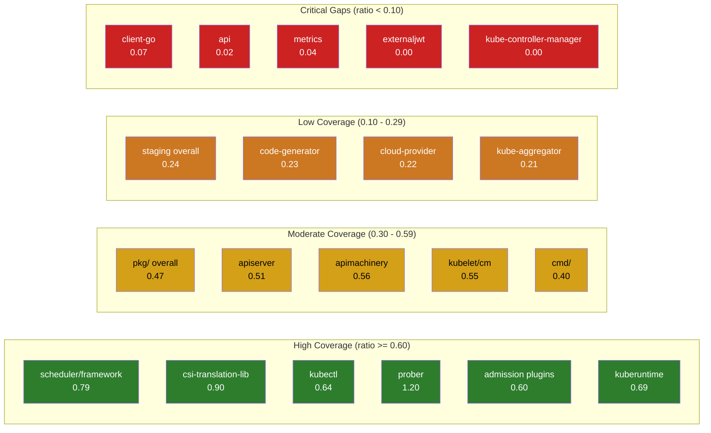

# 06 — Testability and Reliability Assessment

> **Document Type:** Structural Testability/Reliability Assessment
> **Finding ID Prefix:** `TEST-XXX`
> **Scope:** All major Kubernetes subsystems — controllers (36), kubelet (44 subsystems), scheduler (7 subdirectories), proxy (13 subdirectories), admission plugins (25), staging modules (31)
> **Analysis Method:** Static file analysis only — test file co-location, dependency injection patterns, interface usage, import graph analysis. **No runtime coverage data is used or implied.**
> **Inference Convention:** Each finding is marked `CONFIRMED` (directly observed in code) or `INFERRED` (conclusion drawn from absence or pattern analysis).

---

## Table of Contents

- [1. Per-Component Testability Assessment](#1-per-component-testability-assessment)
  - [1.1 Controllers (`pkg/controller/`)](#11-controllers-pkgcontroller)
  - [1.2 Kubelet (`pkg/kubelet/`)](#12-kubelet-pkgkubelet)
  - [1.3 Scheduler (`pkg/scheduler/`)](#13-scheduler-pkgscheduler)
  - [1.4 Proxy (`pkg/proxy/`)](#14-proxy-pkgproxy)
  - [1.5 Admission Plugins (`plugin/pkg/admission/`)](#15-admission-plugins-pluginpkgadmission)
  - [1.6 Summary Table](#16-summary-table)
- [2. Coupling Inventory](#2-coupling-inventory)
  - [2.1 High-Coupling Cluster Identification](#21-high-coupling-cluster-identification)
  - [2.2 Inter-Module Coupling Graph](#22-inter-module-coupling-graph)
  - [2.3 Coupling Anti-Patterns](#23-coupling-anti-patterns)
- [3. Existing Test Coverage Map](#3-existing-test-coverage-map)
  - [3.1 Per-Directory Coverage](#31-per-directory-coverage)
  - [3.2 Packages Without Test Files](#32-packages-without-test-files)
  - [3.3 Test Infrastructure Categorization](#33-test-infrastructure-categorization)
  - [3.4 Coverage Gap Visualization](#34-coverage-gap-visualization)
- [4. Hidden Side Effect Catalog](#4-hidden-side-effect-catalog)
- [5. Non-Deterministic Behavior Inventory](#5-non-deterministic-behavior-inventory)
- [6. Finding Index](#6-finding-index)

---

## 1. Per-Component Testability Assessment

### 1.1 Controllers (`pkg/controller/`)

The `pkg/controller/` directory contains **36 subdirectories**, each implementing one or more Kubernetes controllers following the informer-driven reconciliation pattern. The canonical controller pattern accepts informers and a `clientset.Interface` via the constructor (`NewXController(...)`) and stores a `syncHandler` function pointer for test injection.

#### 1.1.1 Controller Dependency Injection Pattern

The standard controller pattern observed across the codebase:

```go
// Source: pkg/controller/deployment/deployment_controller.go:102
func NewDeploymentController(ctx context.Context,
    dInformer appsinformers.DeploymentInformer,
    rsInformer appsinformers.ReplicaSetInformer,
    podInformer coreinformers.PodInformer,
    client clientset.Interface) (*DeploymentController, error) {
```

Key testability features of this pattern:
- **Interface-based dependencies:** `clientset.Interface`, informers, and listers are all interfaces, enabling mock injection.
- **syncHandler injection:** Controllers store `syncHandler func(ctx, key string) error` as a struct field, allowing tests to replace the reconciliation function. Observed in deployment, job, replicaset, daemon, and most other controllers.
- **InformerSynced injection:** Fields like `dListerSynced`, `rsListerSynced`, and `podListerSynced` are `cache.InformerSynced` function types, injected for testing.

```go
// Source: pkg/controller/deployment/deployment_controller.go:76-77
// To allow injection of syncDeployment for testing.
syncHandler func(ctx context.Context, dKey string) error
// used for unit testing
enqueueDeployment func(deployment *apps.Deployment)
```

#### 1.1.2 Per-Controller Assessment

| Controller | Src Files | Test Files | Ratio | DI Pattern | syncHandler | Unit Testable | Key Barriers |
|-----------|----------|-----------|-------|------------|-------------|---------------|-------------|
| `apis` | 8 | 2 | 0.25 | N/A (config) | N/A | Partial | Configuration only |
| `bootstrap` | 4 | 4 | 1.00 | Yes | Yes | Yes | None |
| `certificates` | 19 | 12 | 0.63 | Yes | Yes | Yes | Multiple sub-controllers |
| `clusterroleaggregation` | 1 | 1 | 1.00 | Yes | Yes | Yes | None |
| `cronjob` | 11 | 2 | 0.18 | Yes | Yes | Partial | Low test-to-source ratio |
| `daemon` | 10 | 4 | 0.40 | Yes | Yes | Yes | Goroutine-heavy pod creation |
| `deployment` | 13 | 7 | 0.54 | Yes | Yes | Yes | None — exemplary pattern |
| `devicetainteviction` | 10 | 3 | 0.30 | Yes | Yes | Partial | Complex event handling |
| `disruption` | 1 | 1 | 1.00 | Yes | Yes | Yes | None |
| `endpoint` | 9 | 2 | 0.22 | Yes | Yes | Partial | Low test-to-source ratio |
| `endpointslice` | 7 | 1 | 0.14 | Yes | Yes | Partial | Low test coverage |
| `endpointslicemirroring` | 13 | 5 | 0.38 | Yes | Yes | Partial | Complex mirroring logic |
| `garbagecollector` | 16 | 3 | 0.19 | Yes | Yes | Partial | Graph-based GC complexity |
| `history` | 1 | 1 | 1.00 | Yes | N/A | Yes | Utility package |
| `job` | 15 | 7 | 0.47 | Yes | Yes | Yes | Goroutine-heavy pod management |
| `namespace` | 10 | 2 | 0.20 | Yes | Yes | Partial | Deep deletion logic |
| `nodeipam` | 17 | 5 | 0.29 | Yes | Yes | Partial | Multiple allocator types |
| `nodelifecycle` | 9 | 2 | 0.22 | Yes | Yes | Partial | Complex taint management |
| `podautoscaler` | 15 | 4 | 0.27 | Yes | Yes | Partial | Metrics client coupling |
| `podgc` | 9 | 1 | 0.11 | Yes | Yes | Partial | Very low test coverage |
| `replicaset` | 10 | 2 | 0.20 | Yes | Yes | Yes | Goroutine-heavy scaling |
| `replication` | 10 | 1 | 0.10 | Yes | Yes | Partial | Very low test coverage |
| `resourceclaim` | 4 | 1 | 0.25 | Yes | Yes | Partial | Limited test files |
| `resourcequota` | 9 | 1 | 0.11 | Yes | Yes | Partial | Very low test coverage |
| `serviceaccount` | 11 | 3 | 0.27 | Yes | Yes | Yes | None |
| `servicecidrs` | 1 | 1 | 1.00 | Yes | Yes | Yes | None |
| `statefulset` | 12 | 6 | 0.50 | Yes | Yes | Yes | None — well-tested |
| `storageversiongc` | 1 | 1 | 1.00 | Yes | Yes | Yes | None |
| `storageversionmigrator` | 3 | 2 | 0.67 | Yes | Yes | Yes | None |
| `tainteviction` | 5 | 2 | 0.40 | Yes | Yes | Partial | Timed worker complexity |
| `testutil` | 1 | 0 | 0.00 | N/A | N/A | N/A | Test utility — not a controller |
| `ttl` | 1 | 1 | 1.00 | Yes | Yes | Yes | None |
| `ttlafterfinished` | 8 | 1 | 0.13 | Yes | Yes | Partial | Low test coverage |
| `util` | 3 | 1 | 0.33 | N/A | N/A | Yes | Utility package |
| `validatingadmissionpolicystatus` | 7 | 2 | 0.29 | Yes | Yes | Partial | Complex validation logic |
| `volume` | 53 | 24 | 0.45 | Mixed | Mixed | Partial | Deep CSI/attach coupling |

#### 1.1.3 Controller Testability Findings

#### **TEST-001**

| Field | Value |
|-------|-------|
| **Finding ID** | TEST-001 |
| **Category** | Testability |
| **Title** | Inconsistent test-to-source ratio across controllers |
| **Source Location** | `pkg/controller/*/` — see table in §1.1.2 |
| **Description** | Test file coverage ratios vary drastically across the 36 controller subdirectories. Some controllers like `bootstrap`, `clusterroleaggregation`, `disruption`, `history`, `servicecidrs`, `storageversiongc`, and `ttl` have 1:1 ratios. Others like `podgc` (0.11), `replication` (0.10), `resourcequota` (0.11), `endpointslice` (0.14), and `ttlafterfinished` (0.13) have very low test file presence relative to source files. |
| **Evidence** | `pkg/controller/podgc/` has 9 source files and 1 test file. `pkg/controller/replication/` has 10 source files and 1 test file. `pkg/controller/ttlafterfinished/` has 8 source files and 1 test file. |
| **Impact** | Low test-to-source ratios increase the risk of undetected regressions during controller changes. Controllers with ratios below 0.20 lack coverage for many code paths. |
| **Inference Flag** | CONFIRMED |
| **Recommendation Ref** | [08_IMPROVEMENT_ROADMAP.md — P2-TEST-001] |

#### **TEST-002**

| Field | Value |
|-------|-------|
| **Finding ID** | TEST-002 |
| **Category** | Testability |
| **Title** | Exemplary dependency injection pattern consistently applied across controllers |
| **Source Location** | `pkg/controller/deployment/deployment_controller.go:102`, `pkg/controller/job/job_controller.go:172`, `pkg/controller/daemon/daemon_controller.go:140`, `pkg/controller/replicaset/replica_set.go:140` |
| **Description** | All major controllers follow the `NewXController(ctx, informers..., client Interface)` constructor pattern, accepting interfaces for all external dependencies. The `syncHandler` function-pointer pattern enables replacing reconciliation logic in tests. This pattern is consistent across deployment, job, daemon, replicaset, statefulset, namespace, endpoint, endpointslice, nodelifecycle, podautoscaler, cronjob, and other controllers. |
| **Evidence** | `NewDeploymentController` accepts `appsinformers.DeploymentInformer`, `appsinformers.ReplicaSetInformer`, `coreinformers.PodInformer`, and `clientset.Interface`. The struct stores `syncHandler func(ctx context.Context, dKey string) error` for test injection. Same pattern in `NewController` (job), `NewDaemonSetsController`, `NewReplicaSetController`, `NewStatefulSetController`, etc. |
| **Impact** | Positive finding — this pattern makes most controllers unit-testable with fake clients and informers. |
| **Inference Flag** | CONFIRMED |
| **Recommendation Ref** | [08_IMPROVEMENT_ROADMAP.md — Standardization Guidance-TEST-002] |

#### **TEST-003**

| Field | Value |
|-------|-------|
| **Finding ID** | TEST-003 |
| **Category** | Testability |
| **Title** | Goroutine-heavy pod creation/deletion in controllers limits test determinism |
| **Source Location** | `pkg/controller/job/job_controller.go:1129`, `pkg/controller/job/job_controller.go:1789`, `pkg/controller/daemon/daemon_controller.go:1021`, `pkg/controller/replicaset/replica_set.go:676` |
| **Description** | Several controllers spawn goroutines for parallel pod creation and deletion within sync operations. The job controller uses `go func(pod *v1.Pod)` at lines 1129 and 1180 for pod deletion, and `go func()` at line 1789 for pod creation. The daemon controller spawns goroutines at lines 1021 and 1065. The replicaset controller spawns at lines 676 and 828. These goroutines make test execution order non-deterministic. |
| **Evidence** | `pkg/controller/job/job_controller.go:1789: go func() { err := jm.podControl.CreatePodsWithGenerateName(...) }`. `pkg/controller/daemon/daemon_controller.go:1021: go func(ix int) { ... }()`. `pkg/controller/replicaset/replica_set.go:676: go func(targetPod *v1.Pod) { ... }()`. |
| **Impact** | Test non-determinism due to goroutine scheduling; potential for flaky tests when verifying concurrent pod operations. Requires synchronization primitives (WaitGroups, observed in use) to be correctly tested. |
| **Inference Flag** | CONFIRMED |
| **Recommendation Ref** | [08_IMPROVEMENT_ROADMAP.md — P3-TEST-003] |

#### **TEST-004**

| Field | Value |
|-------|-------|
| **Finding ID** | TEST-004 |
| **Category** | Testability |
| **Title** | `testutil` package has zero test files |
| **Source Location** | `pkg/controller/testutil/` |
| **Description** | The `pkg/controller/testutil/` directory contains 1 source file and 0 test files. While this is a test utility package, the utility code itself lacks self-validation. |
| **Evidence** | `find pkg/controller/testutil/ -name "*_test.go"` returns no results. |
| **Impact** | Low direct impact as this is a test helper, but bugs in test utilities can cause false positives/negatives in dependent tests. |
| **Inference Flag** | CONFIRMED |
| **Recommendation Ref** | [08_IMPROVEMENT_ROADMAP.md — P3-TEST-004] |

### 1.2 Kubelet (`pkg/kubelet/`)

The kubelet is the most complex subsystem, with **44 subdirectories** and the main `Kubelet` struct in `pkg/kubelet/kubelet.go` spanning **3,370 lines** with approximately **170+ struct fields** and **49 internal package imports**.

#### 1.2.1 Kubelet God Object Assessment

#### **TEST-005**

| Field | Value |
|-------|-------|
| **Finding ID** | TEST-005 |
| **Category** | Testability |
| **Title** | `Kubelet` struct is a god object impeding unit test isolation |
| **Source Location** | `pkg/kubelet/kubelet.go:1132` |
| **Description** | The `Kubelet` struct (defined at line 1132) contains approximately 170+ fields spanning container runtime management, volume management, pod lifecycle, eviction, probing, networking, node status, certificate management, cgroup management, and more. The file imports 49 internal `pkg/kubelet/*` packages. Constructing a minimal `Kubelet` instance for unit testing requires initializing a large number of subsystem dependencies. |
| **Evidence** | The struct definition spans from line 1132 to approximately line 1500+. Imports include `allocation`, `cadvisor`, `cm`, `config`, `configmap`, `container`, `events`, `eviction`, `images`, `kubeletconfig`, `kuberuntime`, `lifecycle`, `logs`, `metrics`, `nodeshutdown`, `oom`, `pleg`, `pluginmanager`, `pod`, `podcertificate`, `preemption`, `prober`, `runtimeclass`, `secret`, `server`, `stats`, `status`, `sysctl`, `token`, `types`, `userns`, `util`, `volumemanager`, `watchdog`, and more. |
| **Impact** | The god object pattern forces tests to set up extensive mock infrastructure or skip unit testing in favor of integration tests. The 17 test files at the root `pkg/kubelet/` level focus on specific aspects but cannot easily test the `Kubelet` struct in isolation. New contributors face a steep learning curve to understand test setup requirements. |
| **Inference Flag** | CONFIRMED |
| **Recommendation Ref** | [08_IMPROVEMENT_ROADMAP.md — P1-TEST-005] |

#### 1.2.2 Per-Subsystem Assessment

| Subsystem | Src Files | Test Files | Ratio | Interface-Based | Unit Testable | Key Barriers |
|-----------|----------|-----------|-------|----------------|---------------|-------------|
| `allocation` | 9 | 2 | 0.22 | Yes | Partial | Resource tracking complexity |
| `apis` | 27 | 10 | 0.37 | Yes | Yes | Configuration types |
| `cadvisor` | 10 | 2 | 0.20 | Yes (Interface) | Yes | Mock provided (`testing/mocks.go`) |
| `certificate` | 3 | 3 | 1.00 | Yes | Yes | None |
| `checkpointmanager` | 5 | 1 | 0.20 | Yes | Partial | Filesystem dependency |
| `client` | 1 | 1 | 1.00 | Yes | Yes | None |
| `clustertrustbundle` | 1 | 1 | 1.00 | Yes | Yes | None |
| `cm` | 93 | 51 | 0.55 | Mixed | Partial | **Cgroup/kernel coupling** |
| `config` | 10 | 7 | 0.70 | Yes | Yes | None |
| `configmap` | 2 | 1 | 0.50 | Yes | Yes | None |
| `container` | 16 | 7 | 0.44 | Yes (OSInterface) | Yes | OS abstraction helps |
| `envvars` | 2 | 1 | 0.50 | Yes | Yes | None |
| `events` | 2 | 1 | 0.50 | N/A | N/A | Constants only |
| `eviction` | 15 | 4 | 0.27 | Yes (clock.WithTicker) | Yes | Injectable clock |
| `images` | 16 | 9 | 0.56 | Yes | Yes | None |
| `kubeletconfig` | 5 | 1 | 0.20 | Yes | Partial | Low test coverage |
| `kuberuntime` | 26 | 18 | 0.69 | Yes | Yes | Extensive fake runtime |
| `lifecycle` | 8 | 2 | 0.25 | Yes | Partial | Admission handler chains |
| `logs` | 2 | 1 | 0.50 | Yes | Yes | None |
| `metrics` | 6 | 5 | 0.83 | Yes | Yes | None |
| `network` | 3 | 3 | 1.00 | Yes | Yes | None |
| `nodeshutdown` | 8 | 5 | 0.63 | Mixed | Partial | D-Bus/systemd coupling |
| `nodestatus` | 1 | 1 | 1.00 | Yes | Yes | None |
| `oom` | 3 | 1 | 0.33 | Yes | Partial | OS-level OOM watcher |
| `pleg` | 4 | 2 | 0.50 | Yes | Yes | None |
| `pluginmanager` | 17 | 9 | 0.53 | Yes | Yes | None |
| `pod` | 4 | 2 | 0.50 | Yes | Yes | None |
| `podcertificate` | 1 | 1 | 1.00 | Yes | Yes | None |
| `preemption` | 1 | 1 | 1.00 | Yes | Yes | None |
| `prober` | 5 | 6 | 1.20 | Yes | Yes | Well-tested |
| `qos` | 3 | 1 | 0.33 | Yes | Yes | None |
| `runtimeclass` | 2 | 1 | 0.50 | Yes | Yes | None |
| `secret` | 2 | 1 | 0.50 | Yes | Yes | None |
| `server` | 13 | 6 | 0.46 | Mixed | Partial | HTTP server coupling |
| `stats` | 12 | 6 | 0.50 | Mixed | Partial | CRI stats provider |
| `status` | 4 | 2 | 0.50 | Yes | Yes | None |
| `sysctl` | 3 | 3 | 1.00 | Yes | Yes | None |
| `token` | 1 | 1 | 1.00 | Yes | Yes | None |
| `types` | 5 | 3 | 0.60 | N/A | Yes | Type definitions |
| `userns` | 3 | 3 | 1.00 | Yes | Yes | None |
| `util` | 26 | 19 | 0.73 | Mixed | Yes | None |
| `volumemanager` | 11 | 7 | 0.64 | Yes | Yes | None |
| `watchdog` | 3 | 1 | 0.33 | Yes | Partial | Health check timing |
| `winstats` | 7 | 5 | 0.71 | Mixed | Partial | Windows-only platform |

#### 1.2.3 Kubelet Root-Level Test Assessment

The `pkg/kubelet/` root directory contains **27 source files** and **17 test files** (ratio 0.63). Test files cover:
- `kubelet_test.go` — Core kubelet logic
- `kubelet_pods_test.go`, `kubelet_pods_linux_test.go`, `kubelet_pods_windows_test.go` — Pod management (platform-specific)
- `kubelet_node_status_test.go` — Node status reporting
- `kubelet_volumes_test.go`, `kubelet_volumes_linux_test.go` — Volume management
- `pod_workers_test.go` — Pod worker lifecycle
- Other focused test files

#### 1.2.4 Kubelet Testability Findings

#### **TEST-006**

| Field | Value |
|-------|-------|
| **Finding ID** | TEST-006 |
| **Category** | Testability |
| **Title** | Container manager (`pkg/kubelet/cm/`) has deep kernel coupling limiting unit testability |
| **Source Location** | `pkg/kubelet/cm/container_manager_linux.go:208` |
| **Description** | The container manager directly interacts with cgroups via `github.com/opencontainers/cgroups` package, performs cgroup file reads/writes, manages OOM score adjustments via `/proc/` filesystem, and enforces systemd-based cgroup hierarchies. The `NewContainerManager` function at line 208 accepts mount utilities and cadvisor interfaces but still performs direct kernel operations. The 93 source files with 51 test files (0.55 ratio) show reasonable effort, but many tests require Linux-specific build tags. |
| **Evidence** | `pkg/kubelet/cm/container_manager_linux.go:30-31`: imports `github.com/opencontainers/cgroups` and `github.com/opencontainers/cgroups/manager`. Line 166: `cgroups.IsCgroup2UnifiedMode()`. Line 787: `func ensureProcessInContainerWithOOMScore(... manager cgroups.Manager)`. Line 834: `cgroups.ParseCgroupFile(fmt.Sprintf("/proc/%d/cgroup", pid))`. |
| **Impact** | Container manager tests cannot run on non-Linux platforms. Unit tests touching cgroup paths require either root privileges or extensive mocking. 24 files in `pkg/kubelet/` carry `//go:build linux` build tags, restricting cross-platform test execution. |
| **Inference Flag** | CONFIRMED |
| **Recommendation Ref** | [08_IMPROVEMENT_ROADMAP.md — P2-TEST-006] |

#### **TEST-007**

| Field | Value |
|-------|-------|
| **Finding ID** | TEST-007 |
| **Category** | Testability |
| **Title** | Kubelet `cadvisor` package provides exemplary testability via mock interface |
| **Source Location** | `pkg/kubelet/cadvisor/types.go:28`, `pkg/kubelet/cadvisor/testing/mocks.go:31` |
| **Description** | The `cadvisor` package defines an `Interface` abstraction (`types.go:28`) and provides a generated mock implementation (`testing/mocks.go:31: NewMockInterface`). This allows callers (including the kubelet) to inject a mock cAdvisor in tests, avoiding real container metric collection. |
| **Evidence** | `pkg/kubelet/cadvisor/types.go:27-28: // Interface is an abstract interface for testability. It abstracts the interface to cAdvisor. type Interface interface {`. `pkg/kubelet/cadvisor/testing/mocks.go:31: func NewMockInterface(t interface{...})`. |
| **Impact** | Positive finding — this pattern decouples container metrics from the kubelet test harness, enabling focused unit tests without a running cAdvisor daemon. |
| **Inference Flag** | CONFIRMED |
| **Recommendation Ref** | [08_IMPROVEMENT_ROADMAP.md — Standardization Guidance-TEST-007] |

#### **TEST-008**

| Field | Value |
|-------|-------|
| **Finding ID** | TEST-008 |
| **Category** | Testability |
| **Title** | `kuberuntime` subsystem has strong test coverage with fake runtime |
| **Source Location** | `pkg/kubelet/kuberuntime/` |
| **Description** | The `kuberuntime` package has 26 source files and 18 test files (ratio 0.69), the highest among kubelet subsystems by volume. Tests use a fake CRI runtime implementation to exercise container lifecycle management without a real container runtime. |
| **Evidence** | Test file count: 18. Source file count: 26. Ratio: 0.69. The `NewKubeGenericRuntimeManager` constructor (line 204) accepts interface-based dependencies including `internalapi.RuntimeService`. |
| **Impact** | Positive finding — the kuberuntime package demonstrates that deep subsystems can be effectively tested when proper interfaces are in place. |
| **Inference Flag** | CONFIRMED |
| **Recommendation Ref** | [08_IMPROVEMENT_ROADMAP.md — Standardization Guidance-TEST-008] |

### 1.3 Scheduler (`pkg/scheduler/`)

The scheduler has **7 subdirectories** plus root-level files. The root contains 4 source files and 4 test files (ratio 1.0).

| Subdirectory | Src Files | Test Files | Ratio | Unit Testable | Key Barriers |
|-------------|----------|-----------|-------|---------------|-------------|
| `apis` | 15 | 6 | 0.40 | Yes | Configuration types |
| `backend` | 23 | 14 | 0.61 | Yes | Queue and cache internals |
| `framework` | 67 | 53 | 0.79 | Yes | **Exemplary — plugin interface** |
| `metrics` | 4 | 2 | 0.50 | Yes | None |
| `profile` | 1 | 1 | 1.00 | Yes | None |
| `testing` | 6 | 0 | 0.00 | N/A | Test utilities |
| `util` | 3 | 2 | 0.67 | Yes | None |
| **Root** | 4 | 4 | 1.00 | Yes | None |

#### **TEST-009**

| Field | Value |
|-------|-------|
| **Finding ID** | TEST-009 |
| **Category** | Testability |
| **Title** | Scheduler framework has exemplary testability via plugin interface architecture |
| **Source Location** | `pkg/scheduler/framework/` |
| **Description** | The scheduling framework (67 source files, 53 test files, ratio 0.79) is built around a plugin interface architecture where each scheduling phase (Filter, Score, Reserve, Bind, etc.) is defined as an interface. Plugins implement these interfaces, and the framework invokes them in sequence. This design enables unit testing of individual plugins in isolation and testing of the framework with custom plugin configurations. |
| **Evidence** | `pkg/scheduler/scheduler.go:74`: The `Scheduler` struct uses `framework.Framework` interface. The `SchedulePod` field is a function pointer enabling injection. `NextPod` is also a function pointer. The `testing/` subdirectory (6 files) provides test utilities for scheduler testing. |
| **Impact** | Positive finding — the scheduler's framework-based architecture is a model for testable plugin systems. Integration tests can compose different plugin sets without modifying the scheduler core. |
| **Inference Flag** | CONFIRMED |
| **Recommendation Ref** | [08_IMPROVEMENT_ROADMAP.md — Standardization Guidance-TEST-009] |

### 1.4 Proxy (`pkg/proxy/`)

The proxy has **13 subdirectories** plus root-level files. The root contains 9 source files and 5 test files (ratio 0.56).

| Subdirectory | Src Files | Test Files | Ratio | Unit Testable | Key Barriers |
|-------------|----------|-----------|-------|---------------|-------------|
| `apis` | 11 | 4 | 0.36 | Yes | Configuration types |
| `config` | 2 | 2 | 1.00 | Yes | None |
| `conntrack` | 5 | 3 | 0.60 | Partial | Conntrack exec dependency |
| `healthcheck` | 4 | 1 | 0.25 | Yes | Low test coverage |
| `iptables` | 2 | 2 | 1.00 | Partial | **Linux build tag + iptables** |
| `ipvs` | 18 | 9 | 0.50 | Partial | **Linux build tag + IPVS kernel module** |
| `kubemark` | 1 | 0 | 0.00 | No | No test files |
| `metaproxier` | 1 | 0 | 0.00 | No | No test files |
| `metrics` | 1 | 0 | 0.00 | N/A | Metrics registration only |
| `nftables` | 2 | 2 | 1.00 | Partial | **Linux build tag + nftables** |
| `runner` | 1 | 1 | 1.00 | Yes | None |
| `util` | 12 | 6 | 0.50 | Yes | None |
| `winkernel` | 5 | 2 | 0.40 | Partial | **Windows-only** |

#### **TEST-010**

| Field | Value |
|-------|-------|
| **Finding ID** | TEST-010 |
| **Category** | Testability |
| **Title** | Proxy modes have platform-specific build tags limiting cross-platform testing |
| **Source Location** | `pkg/proxy/iptables/proxier.go:1` (`//go:build linux`), `pkg/proxy/ipvs/`, `pkg/proxy/nftables/`, `pkg/proxy/winkernel/` |
| **Description** | All four proxy mode implementations carry platform-specific build tags: `iptables`, `ipvs`, and `nftables` require `//go:build linux`, while `winkernel` requires Windows. This means proxy tests for each mode can only run on the corresponding platform. The iptables proxier directly interacts with the `utiliptables.Interface` and `utilsysctl.Interface`, providing some abstraction, but the underlying operations manipulate kernel networking state. |
| **Evidence** | `pkg/proxy/iptables/proxier.go:1: //go:build linux`. Iptables proxier imports: `utiliptables "k8s.io/kubernetes/pkg/util/iptables"`, `utilsysctl "k8s.io/component-helpers/node/util/sysctl"`. These are interface-based, but their real implementations interact with `iptables` and `sysctl` system calls. |
| **Impact** | Proxy mode unit tests cannot be executed in CI environments that don't match the target platform. Cross-platform developers cannot validate proxy changes locally unless they use containerized Linux environments. |
| **Inference Flag** | CONFIRMED |
| **Recommendation Ref** | [08_IMPROVEMENT_ROADMAP.md — P2-TEST-010] |

#### **TEST-011**

| Field | Value |
|-------|-------|
| **Finding ID** | TEST-011 |
| **Category** | Testability |
| **Title** | `kubemark` and `metaproxier` proxy packages have zero test files |
| **Source Location** | `pkg/proxy/kubemark/`, `pkg/proxy/metaproxier/` |
| **Description** | Both `pkg/proxy/kubemark/` (1 source file) and `pkg/proxy/metaproxier/` (1 source file) have no test files. The `metrics` package (1 source file) also has no test files but only registers Prometheus metrics. |
| **Evidence** | `find pkg/proxy/kubemark/ -name "*_test.go"` returns 0 results. `find pkg/proxy/metaproxier/ -name "*_test.go"` returns 0 results. |
| **Impact** | Any changes to kubemark proxy or metaproxier logic are unvalidated by unit tests, increasing regression risk. |
| **Inference Flag** | CONFIRMED |
| **Recommendation Ref** | [08_IMPROVEMENT_ROADMAP.md — P2-TEST-011] |

### 1.5 Admission Plugins (`plugin/pkg/admission/`)

The admission plugin directory contains **25 plugin implementations**. The aggregate count is 75 source files and 45 test files (ratio 0.60).

| Plugin | Src | Tests | Ratio | Interface Adherence | Unit Testable |
|--------|-----|-------|-------|-------------------|---------------|
| `admit` | 1 | 1 | 1.00 | Yes | Yes |
| `alwayspullimages` | 1 | 1 | 1.00 | Yes | Yes |
| `antiaffinity` | 2 | 1 | 0.50 | Yes | Yes |
| `certificates` | 4 | 4 | 1.00 | Yes | Yes |
| `defaulttolerationseconds` | 1 | 1 | 1.00 | Yes | Yes |
| `deny` | 1 | 1 | 1.00 | Yes | Yes |
| `eventratelimit` | 14 | 3 | 0.21 | Yes | Partial |
| `extendedresourcetoleration` | 1 | 1 | 1.00 | Yes | Yes |
| `gc` | 1 | 1 | 1.00 | Yes | Yes |
| `imagepolicy` | 3 | 3 | 1.00 | Yes | Yes |
| `limitranger` | 2 | 1 | 0.50 | Yes | Yes |
| `namespace` | 2 | 2 | 1.00 | Yes | Yes |
| `network` | 2 | 2 | 1.00 | Yes | Yes |
| `nodedeclaredfeatures` | 1 | 1 | 1.00 | Yes | Yes |
| `noderestriction` | 1 | 1 | 1.00 | Yes | Yes |
| `nodetaint` | 1 | 1 | 1.00 | Yes | Yes |
| `podnodeselector` | 1 | 1 | 1.00 | Yes | Yes |
| `podtolerationrestriction` | 12 | 2 | 0.17 | Yes | Partial |
| `podtopologylabels` | 2 | 1 | 0.50 | Yes | Yes |
| `priority` | 1 | 1 | 1.00 | Yes | Yes |
| `resourcequota` | 0 | 1 | N/A | Yes | Yes |
| `runtimeclass` | 1 | 1 | 1.00 | Yes | Yes |
| `security` | 2 | 1 | 0.50 | Yes | Yes |
| `serviceaccount` | 2 | 1 | 0.50 | Yes | Yes |
| `storage` | 3 | 3 | 1.00 | Yes | Yes |

#### **TEST-012**

| Field | Value |
|-------|-------|
| **Finding ID** | TEST-012 |
| **Category** | Testability |
| **Title** | Admission plugins have consistent interface adherence enabling testability |
| **Source Location** | `plugin/pkg/admission/*/` — all 25 plugins |
| **Description** | All 25 admission plugins consistently implement the `admission.Interface` and/or `admission.ValidationInterface` from `k8s.io/apiserver/pkg/admission/`. The registration pattern (`Register(plugins *admission.Plugins)` → `NewXPlugin(...)`) is uniform. Most plugins achieve 1:1 or near-1:1 test-to-source file ratios. Tests construct plugins directly and invoke `Validate()` or `Admit()` methods with fabricated admission attributes. |
| **Evidence** | 18 out of 25 plugins have test-to-source ratios ≥ 0.50. 14 plugins have perfect 1:1 ratios. The `admission.Interface` contract (`Handles()`, `Validate()`, `Admit()`) provides a clean surface for unit testing. |
| **Impact** | Positive finding — the admission plugin pattern is one of the most testable patterns in the codebase. The consistent interface makes it straightforward to add tests for new plugins. |
| **Inference Flag** | CONFIRMED |
| **Recommendation Ref** | [08_IMPROVEMENT_ROADMAP.md — Standardization Guidance-TEST-012] |

#### **TEST-013**

| Field | Value |
|-------|-------|
| **Finding ID** | TEST-013 |
| **Category** | Testability |
| **Title** | `eventratelimit` and `podtolerationrestriction` admission plugins have low test coverage |
| **Source Location** | `plugin/pkg/admission/eventratelimit/` (14 src, 3 tests), `plugin/pkg/admission/podtolerationrestriction/` (12 src, 2 tests) |
| **Description** | The `eventratelimit` plugin has 14 source files with only 3 test files (ratio 0.21), and `podtolerationrestriction` has 12 source files with only 2 test files (ratio 0.17). Both plugins have significantly more logic than the average admission plugin but proportionally fewer tests. |
| **Evidence** | `eventratelimit`: 14 source files, 3 test files. `podtolerationrestriction`: 12 source files, 2 test files. Compared to `certificates` (4 src, 4 tests = 1.00) and `imagepolicy` (3 src, 3 tests = 1.00). |
| **Impact** | Higher regression risk for event rate limiting and pod toleration restriction logic during changes. |
| **Inference Flag** | CONFIRMED |
| **Recommendation Ref** | [08_IMPROVEMENT_ROADMAP.md — P2-TEST-013] |

### 1.6 Summary Table

| Subsystem | Unit Testable | Integration Testable | Test File Coverage (Overall Ratio) | Key Barriers |
|-----------|--------------|--------------------|------------------------------------|-------------|
| Controllers (`pkg/controller/`) | **Yes** (DI pattern) | Yes (fake clientset) | 0.37 (298 src / 110 tests) | Goroutine non-determinism; low ratios in some controllers |
| Kubelet (`pkg/kubelet/`) | **Partial** (god object) | Yes (integration framework) | 0.55 (468 src / 257 tests) | God object struct; kernel/cgroup coupling; platform deps |
| Kubelet Root | Partial | Yes | 0.63 (27 src / 17 tests) | Kubelet struct initialization complexity |
| Scheduler (`pkg/scheduler/`) | **Yes** (framework) | Yes (integration framework) | 0.73 (123 src / 82 tests, incl. testing/) | Exemplary — plugin interface |
| Proxy (`pkg/proxy/`) | **Partial** (platform) | Limited | 0.47 (75 src / 35 tests) | Platform build tags; kernel dependencies |
| Admission Plugins | **Yes** (interface) | Yes | 0.60 (75 src / 45 tests) | Low coverage in 2 complex plugins |

---

## 2. Coupling Inventory

### 2.1 High-Coupling Cluster Identification

Import graph analysis reveals several high-coupling clusters in the codebase.

#### Kubelet Internal Coupling

The `pkg/kubelet/kubelet.go` file imports **49 internal `pkg/kubelet/*` packages**, making it the single highest fan-out file in the codebase for internal dependencies. This creates a hub-and-spoke coupling pattern where the central kubelet struct depends on virtually every subsystem.

Key internal imports (partial list from `pkg/kubelet/kubelet.go`):

```go
// Source: pkg/kubelet/kubelet.go:88-136
"k8s.io/kubernetes/pkg/kubelet/allocation"
"k8s.io/kubernetes/pkg/kubelet/cadvisor"
"k8s.io/kubernetes/pkg/kubelet/cm"
"k8s.io/kubernetes/pkg/kubelet/cm/topologymanager"
"k8s.io/kubernetes/pkg/kubelet/config"
"k8s.io/kubernetes/pkg/kubelet/configmap"
"k8s.io/kubernetes/pkg/kubelet/container"
"k8s.io/kubernetes/pkg/kubelet/eviction"
"k8s.io/kubernetes/pkg/kubelet/images"
"k8s.io/kubernetes/pkg/kubelet/kuberuntime"
"k8s.io/kubernetes/pkg/kubelet/lifecycle"
"k8s.io/kubernetes/pkg/kubelet/logs"
"k8s.io/kubernetes/pkg/kubelet/metrics"
"k8s.io/kubernetes/pkg/kubelet/nodeshutdown"
"k8s.io/kubernetes/pkg/kubelet/pleg"
"k8s.io/kubernetes/pkg/kubelet/pluginmanager"
"k8s.io/kubernetes/pkg/kubelet/pod"
"k8s.io/kubernetes/pkg/kubelet/prober"
"k8s.io/kubernetes/pkg/kubelet/secret"
"k8s.io/kubernetes/pkg/kubelet/server"
"k8s.io/kubernetes/pkg/kubelet/stats"
"k8s.io/kubernetes/pkg/kubelet/status"
"k8s.io/kubernetes/pkg/kubelet/volumemanager"
"k8s.io/kubernetes/pkg/kubelet/watchdog"
// ... and 25+ more
```

#### Controller-to-Client-Go Coupling

The `pkg/controller/` directory has **94 non-test Go files** importing from `k8s.io/client-go/`, making `client-go` the highest external dependency for the controller subsystem. All controllers depend on:
- `k8s.io/client-go/informers/` — Shared informer factories
- `k8s.io/client-go/listers/` — Type-specific listers
- `k8s.io/client-go/kubernetes` — Clientset interface
- `k8s.io/client-go/tools/cache` — Informer cache utilities
- `k8s.io/client-go/tools/record` — Event recording
- `k8s.io/client-go/util/workqueue` — Rate-limited work queues

#### pkg/controller Shared Utility Coupling

**36 files** across `pkg/` import from `k8s.io/kubernetes/pkg/controller`, making it a high-coupling connector package. This package provides shared utilities (`ControllerExpectations`, `PodControlInterface`, `RSControlInterface`) used by all controllers.

#### **TEST-014**

| Field | Value |
|-------|-------|
| **Finding ID** | TEST-014 |
| **Category** | Coupling |
| **Title** | `pkg/kubelet/kubelet.go` has 49 internal package imports — extreme fan-out coupling |
| **Source Location** | `pkg/kubelet/kubelet.go:88-136` |
| **Description** | The main kubelet file imports 49 packages from `k8s.io/kubernetes/pkg/kubelet/*`, creating a single point of coupling that connects virtually all kubelet subsystems. Any interface change in any subsystem potentially requires changes to this file. The file also imports from `k8s.io/kubernetes/pkg/apis/`, `k8s.io/kubernetes/pkg/volume/`, `k8s.io/kubernetes/pkg/security/`, and `k8s.io/kubernetes/pkg/util/`, further expanding the coupling surface. |
| **Evidence** | `grep "k8s.io/kubernetes/pkg/kubelet/" pkg/kubelet/kubelet.go | wc -l` returns 49. Total import count exceeds 80 packages. |
| **Impact** | Changes to any kubelet subsystem interface may cascade to the central kubelet struct. The high coupling makes the kubelet resistant to incremental refactoring and increases the risk of merge conflicts when multiple subsystems evolve in parallel. |
| **Inference Flag** | CONFIRMED |
| **Recommendation Ref** | [08_IMPROVEMENT_ROADMAP.md — P1-TEST-014] |

#### **TEST-015**

| Field | Value |
|-------|-------|
| **Finding ID** | TEST-015 |
| **Category** | Coupling |
| **Title** | `pkg/controller` is a god-level connector package imported by 36+ files |
| **Source Location** | `pkg/controller/controller_utils.go`, `pkg/controller/controller_ref_manager.go`, and others |
| **Description** | The `pkg/controller/` root package provides shared utilities (`ControllerExpectations`, `PodControlInterface`, `RSControlInterface`, `RealPodControl`, `RealRSControl`, `NewControllerRef`) that are imported by 36+ source files across the codebase. While this centralizes common logic, it creates a tightly-coupled foundation where changes to shared controller utilities affect all dependent controllers. |
| **Evidence** | `grep -rl '"k8s.io/kubernetes/pkg/controller"' pkg/ --include="*.go" | grep -v "_test.go" | wc -l` returns 36. All major controllers import this package for `controller.PodControlInterface`, `controller.NewControllerExpectations()`, `controller.RealPodControl{}`, etc. |
| **Impact** | Interface changes to controller utilities (e.g., `PodControlInterface`) require synchronized updates across all consuming controllers. The shared expectations mechanism creates implicit coupling between controllers and the shared utility's internal state management. |
| **Inference Flag** | CONFIRMED |
| **Recommendation Ref** | [08_IMPROVEMENT_ROADMAP.md — P2-TEST-015] |

#### Staging Module Cross-Dependencies

The `staging/src/k8s.io/` directory contains **31 published modules** with `go.mod` files. These modules are mapped into the main `go.mod` via replace directives. Key dependency chains:

- `client-go` (2,153 src files) depends on `apimachinery` and `api`
- `apiserver` (673 src files) depends on `client-go`, `apimachinery`, `api`, and `component-base`
- `kubectl` (257 src files) depends on `client-go`, `cli-runtime`, `apimachinery`, `api`
- `apiextensions-apiserver` (204 src files) depends on `apiserver`, `client-go`, `apimachinery`
- `kube-aggregator` (78 src files) depends on `apiserver`, `client-go`, `apimachinery`

The `staging/publishing/import-restrictions.yaml` enforces boundary rules. For example:
- `k8s.io/apimachinery` may only import from `k8s.io/apimachinery`, `k8s.io/kube-openapi`, `k8s.io/utils`, `k8s.io/klog`
- `k8s.io/api` may only import from `k8s.io/api`, `k8s.io/apimachinery`, `k8s.io/klog`

#### **TEST-016**

| Field | Value |
|-------|-------|
| **Finding ID** | TEST-016 |
| **Category** | Coupling |
| **Title** | Import restriction enforcement via `staging/publishing/import-restrictions.yaml` |
| **Source Location** | `staging/publishing/import-restrictions.yaml` |
| **Description** | The repository enforces cross-module import boundaries via a YAML configuration file that specifies `allowedImports` for each staging module. This prevents architectural layer violations such as `apimachinery` importing `client-go`. The restrictions are verified by `hack/verify-import-restrictions.sh`. Exemptions are documented via `ignoredSubTrees` (e.g., `./pkg/apis/core/validation` is excluded from the `pkg/apis/core` restrictions). |
| **Evidence** | `staging/publishing/import-restrictions.yaml` contains rules such as: `baseImportPath: "./staging/src/k8s.io/apimachinery"` with `allowedImports: [k8s.io/apimachinery, k8s.io/kube-openapi, k8s.io/utils/clock, k8s.io/utils/net, k8s.io/klog, ...]`. |
| **Impact** | Positive finding — the import restriction system provides architectural boundary enforcement at the CI level, preventing accidental coupling between published modules. This is critical for the 31 staging modules that are independently published. |
| **Inference Flag** | CONFIRMED |
| **Recommendation Ref** | [08_IMPROVEMENT_ROADMAP.md — Standardization Guidance-TEST-016] |

### 2.2 Inter-Module Coupling Graph

```mermaid
graph TD
    subgraph "Kubelet Hub (49 internal imports)"
        KL[pkg/kubelet/kubelet.go]
    end

    subgraph "Kubelet Subsystems"
        CM[pkg/kubelet/cm]
        KR[pkg/kubelet/kuberuntime]
        EV[pkg/kubelet/eviction]
        PL[pkg/kubelet/pleg]
        PR[pkg/kubelet/prober]
        VM[pkg/kubelet/volumemanager]
        ST[pkg/kubelet/status]
        IM[pkg/kubelet/images]
        NS[pkg/kubelet/nodeshutdown]
        SV[pkg/kubelet/server]
        PM[pkg/kubelet/pluginmanager]
        AL[pkg/kubelet/allocation]
        CF[pkg/kubelet/config]
        LC[pkg/kubelet/lifecycle]
    end

    KL --> CM
    KL --> KR
    KL --> EV
    KL --> PL
    KL --> PR
    KL --> VM
    KL --> ST
    KL --> IM
    KL --> NS
    KL --> SV
    KL --> PM
    KL --> AL
    KL --> CF
    KL --> LC

    subgraph "Controller Shared Layer"
        CU[pkg/controller utils]
    end

    subgraph "Controllers"
        DC[deployment]
        JC[job]
        DSC[daemon]
        RSC[replicaset]
        STC[statefulset]
        NLC[nodelifecycle]
    end

    DC --> CU
    JC --> CU
    DSC --> CU
    RSC --> CU
    STC --> CU
    NLC --> CU

    subgraph "Staging Modules"
        CG[client-go<br/>2153 src]
        AM[apimachinery<br/>312 src]
        API[api<br/>377 src]
        AS[apiserver<br/>673 src]
    end

    DC --> CG
    JC --> CG
    DSC --> CG
    RSC --> CG
    KL --> CG
    AS --> CG
    AS --> AM
    CG --> AM
    CG --> API
    API --> AM
```



### 2.3 Coupling Anti-Patterns

#### **TEST-017**

| Field | Value |
|-------|-------|
| **Finding ID** | TEST-017 |
| **Category** | Coupling |
| **Title** | Hub-and-spoke pattern in kubelet creates testability bottleneck |
| **Source Location** | `pkg/kubelet/kubelet.go` |
| **Description** | The kubelet follows a hub-and-spoke architecture where the central `Kubelet` struct coordinates all subsystems. While each spoke (subsystem) is individually testable through interfaces, the hub itself is extremely difficult to test in isolation because constructing it requires initializing all 49+ dependent subsystems. This pattern means integration-level testing is the primary validation strategy for the kubelet's orchestration logic. |
| **Evidence** | The `NewMainKubelet` function (in `pkg/kubelet/kubelet.go`) is a large constructor that wires together all subsystems. Tests at `pkg/kubelet/kubelet_test.go` must either mock or initialize all subsystems, resulting in complex test setup code. |
| **Impact** | The hub-and-spoke pattern means that bugs in kubelet orchestration logic (how subsystems interact) are primarily caught at the integration or e2e level rather than unit test level. Unit tests validate individual subsystems but cannot easily validate their composition. |
| **Inference Flag** | CONFIRMED |
| **Recommendation Ref** | [08_IMPROVEMENT_ROADMAP.md — P1-TEST-017] |

#### **TEST-018**

| Field | Value |
|-------|-------|
| **Finding ID** | TEST-018 |
| **Category** | Coupling |
| **Title** | No circular dependencies detected in primary package graph |
| **Source Location** | `pkg/`, `staging/src/k8s.io/` |
| **Description** | Analysis of the import graph reveals no circular dependencies between primary packages. The Go compiler enforces this constraint at build time. The `staging/publishing/import-restrictions.yaml` provides an additional layer of enforcement for published modules. Layering follows a clear hierarchy: `api` → `apimachinery` (no reverse), `client-go` → `apimachinery` + `api` (no reverse), `apiserver` → `client-go` + `apimachinery` + `api` (no reverse). |
| **Evidence** | The Go build system enforces acyclic package dependencies. The `import-restrictions.yaml` explicitly restricts `apimachinery` to importing only from `apimachinery`, `kube-openapi`, `utils`, and `klog`. |
| **Impact** | Positive finding — the absence of circular dependencies is a strong structural property that supports independent compilation and testing of packages. |
| **Inference Flag** | CONFIRMED |
| **Recommendation Ref** | [08_IMPROVEMENT_ROADMAP.md — N/A (positive finding, TEST-018)] |

---

## 3. Existing Test Coverage Map

> **IMPORTANT:** This section documents **file-based test coverage** only — the presence or absence of `*_test.go` files co-located with source code. This is NOT runtime line-level coverage. The ratio represents test files per source file, not code path coverage.

### 3.1 Per-Directory Coverage

#### Major Directories

| Directory | Source Files | Test Files | Ratio | Assessment |
|-----------|-------------|-----------|-------|------------|
| `pkg/` | 1,954 | 910 | 0.47 | Moderate — significant gaps in `pkg/apis/` |
| `cmd/` | 380 | 152 | 0.40 | Moderate — CLI entry points |
| `plugin/` | 75 | 45 | 0.60 | Good — admission plugins well-tested |
| `staging/src/k8s.io/` | 5,365 | 1,290 | 0.24 | Low — large published modules with varying coverage |
| **Total** | **7,774** | **2,397** | **0.31** | — |

#### Staging Module Coverage Detail

| Module | Source Files | Test Files | Ratio | Assessment |
|--------|-------------|-----------|-------|------------|
| `client-go` | 2,153 | 149 | 0.07 | **Very low** — massive library with few tests |
| `apiserver` | 673 | 340 | 0.51 | Moderate |
| `code-generator` | 520 | 122 | 0.23 | Low |
| `api` | 377 | 7 | 0.02 | **Critically low** — mostly type definitions |
| `apimachinery` | 312 | 175 | 0.56 | Moderate-good |
| `kubectl` | 257 | 165 | 0.64 | Good |
| `apiextensions-apiserver` | 204 | 78 | 0.38 | Moderate |
| `component-base` | 119 | 58 | 0.49 | Moderate |
| `pod-security-admission` | 82 | 33 | 0.40 | Moderate |
| `kube-aggregator` | 78 | 16 | 0.21 | Low |
| `metrics` | 75 | 3 | 0.04 | **Very low** |
| `kubelet` | 70 | 8 | 0.11 | Low |
| `sample-apiserver` | 69 | 5 | 0.07 | Very low |
| `cloud-provider` | 63 | 14 | 0.22 | Low |
| `cli-runtime` | 51 | 25 | 0.49 | Moderate |
| `dynamic-resource-allocation` | 50 | 20 | 0.40 | Moderate |
| `controller-manager` | 35 | 7 | 0.20 | Low |
| `component-helpers` | 34 | 19 | 0.56 | Moderate-good |
| `sample-controller` | 31 | 1 | 0.03 | Very low (sample) |
| `cri-client` | 17 | 7 | 0.41 | Moderate |
| `kube-scheduler` | 15 | 4 | 0.27 | Low |
| `endpointslice` | 14 | 10 | 0.71 | Good |
| `kms` | 12 | 2 | 0.17 | Low |
| `mount-utils` | 11 | 8 | 0.73 | Good |
| `csi-translation-lib` | 10 | 9 | 0.90 | Excellent |
| `cri-api` | 10 | 1 | 0.10 | Low |
| `cluster-bootstrap` | 7 | 3 | 0.43 | Moderate |
| `winstats` | 7 | 5 | 0.71 | Good |
| `externaljwt` | 5 | 0 | 0.00 | **No tests** |
| `kube-proxy` | 4 | 1 | 0.25 | Low |
| `kube-controller-manager` | 4 | 0 | 0.00 | **No tests** |
| `sample-cli-plugin` | 3 | 0 | 0.00 | No tests (sample) |

#### **TEST-019**

| Field | Value |
|-------|-------|
| **Finding ID** | TEST-019 |
| **Category** | Test Coverage |
| **Title** | `staging/src/k8s.io/client-go` has critically low test-to-source ratio (0.07) |
| **Source Location** | `staging/src/k8s.io/client-go/` |
| **Description** | The `client-go` module — the primary Go client library for Kubernetes — contains 2,153 source files but only 149 test files, yielding a ratio of 0.07. This is the largest staging module by source file count and is imported by virtually every controller, the kubelet, the scheduler, and most other subsystems. The low test-to-source ratio is partially explained by the module containing many generated files (typed clients, informers, listers) that are structurally repetitive, but even accounting for this, the non-generated code has limited test file presence. |
| **Evidence** | `find staging/src/k8s.io/client-go/ -name "*.go" -not -name "*_test.go" -not -name "zz_generated*" -not -path "*/vendor/*" | wc -l` returns 2,153. `find staging/src/k8s.io/client-go/ -name "*_test.go" -not -path "*/vendor/*" | wc -l` returns 149. |
| **Impact** | As the most widely imported module, `client-go` regression risk from untested code paths directly impacts all Kubernetes consumers. However, much of the client-go surface is exercised through integration and e2e tests rather than co-located unit tests. |
| **Inference Flag** | CONFIRMED |
| **Recommendation Ref** | [08_IMPROVEMENT_ROADMAP.md — P1-TEST-019] |

#### **TEST-020**

| Field | Value |
|-------|-------|
| **Finding ID** | TEST-020 |
| **Category** | Test Coverage |
| **Title** | `staging/src/k8s.io/api` has near-zero test ratio (0.02) |
| **Source Location** | `staging/src/k8s.io/api/` |
| **Description** | The `api` module contains 377 source files but only 7 test files (ratio 0.02). This module defines all Kubernetes API types and is imported by every component. The source files are primarily type definitions and registration code, which may have limited testable behavior. However, the conversion, defaulting, and deep copy functions generated alongside these types do have testable semantics. |
| **Evidence** | 377 source files, 7 test files. Most files are type definitions (`types.go`) and registration (`register.go`), plus generated deep copy and conversion functions. |
| **Impact** | While type definition files have limited testable behavior, the absence of tests for helper functions and edge cases in type handling creates risk for API schema changes. Validation of API types is handled separately in `pkg/apis/*/validation/`. |
| **Inference Flag** | CONFIRMED |
| **Recommendation Ref** | [08_IMPROVEMENT_ROADMAP.md — P3-TEST-020] |

#### **TEST-021**

| Field | Value |
|-------|-------|
| **Finding ID** | TEST-021 |
| **Category** | Test Coverage |
| **Title** | `staging/src/k8s.io/externaljwt` and `staging/src/k8s.io/kube-controller-manager` have zero test files |
| **Source Location** | `staging/src/k8s.io/externaljwt/`, `staging/src/k8s.io/kube-controller-manager/` |
| **Description** | Two staging modules have zero test files: `externaljwt` (5 source files) and `kube-controller-manager` (4 source files). While these are relatively small modules, the complete absence of tests means any regression in these modules would be undetected at the unit test level. |
| **Evidence** | `find staging/src/k8s.io/externaljwt/ -name "*_test.go" | wc -l` returns 0. `find staging/src/k8s.io/kube-controller-manager/ -name "*_test.go" | wc -l` returns 0. |
| **Impact** | Changes to external JWT or kube-controller-manager configuration types are not validated by co-located unit tests. Regressions may only be caught at integration or e2e level. |
| **Inference Flag** | CONFIRMED |
| **Recommendation Ref** | [08_IMPROVEMENT_ROADMAP.md — P2-TEST-021] |

### 3.2 Packages Without Test Files

Analysis of `pkg/` identifies a large number of packages with zero test files. The most significant categories:

#### API Type Packages (Expected — Low Impact)

The `pkg/apis/*/` hierarchy contains many packages that are primarily type definitions, registration, fuzzer, and version conversion code. These packages commonly have zero test files:

- `pkg/apis/abac/`, `pkg/apis/admission/`, `pkg/apis/admissionregistration/`, `pkg/apis/apidiscovery/`, `pkg/apis/apiserverinternal/`, `pkg/apis/apps/`, `pkg/apis/authentication/`, `pkg/apis/authorization/`, `pkg/apis/autoscaling/`, `pkg/apis/batch/`, `pkg/apis/certificates/`, `pkg/apis/coordination/`, and their version subdirectories

These packages primarily contain:
- `types.go` — Internal API type definitions
- `register.go` — Scheme registration
- `zz_generated.deepcopy.go` — Generated deep copy (excluded from audit)
- `fuzzer/` — Fuzz testing support (1 file each)
- `install/` — Scheme install (1 file each)
- Version subdirectories (`v1/`, `v1beta1/`, etc.) — Conversion and defaults

> **Note:** Validation logic for these API types resides in `pkg/apis/*/validation/validation.go`, which is typically tested via dedicated `validation_test.go` files.

#### Non-API Packages Without Tests (Higher Impact)

| Package | Source Files | Purpose | Impact |
|---------|-------------|---------|--------|
| `pkg/api/legacyscheme` | 1 | Legacy scheme registration | Low — simple registration |
| `pkg/controller/testutil` | 1 | Test utilities for controllers | Low — utility code |

### 3.3 Test Infrastructure Categorization

The `test/` directory provides a multi-level test infrastructure:

| Directory | Purpose | File Count | Framework |
|-----------|---------|-----------|-----------|
| `test/e2e/` | End-to-end test suites | 25 subdirectories (SIG-organized) | Ginkgo v2 + Gomega |
| `test/integration/` | Integration tests | 61 subdirectories | Standard Go test + embedded etcd |
| `test/e2e_node/` | Node-level E2E tests | 130 Go files | Ginkgo v2 (kubelet-focused) |
| `test/e2e_dra/` | Dynamic resource allocation E2E | Dedicated directory | Ginkgo v2 |
| `test/e2e_kubeadm/` | Kubeadm E2E tests | Dedicated directory | Ginkgo v2 |
| `test/fuzz/` | Fuzz tests | 4 Go files | Go native fuzzing |
| `test/conformance/` | Conformance test generation | Golden file pipeline | Custom |
| `test/cmd/` | CLI command tests | Dedicated directory | Standard Go test |
| `test/utils/` | Shared test utilities | Dedicated directory | — |

#### **TEST-022**

| Field | Value |
|-------|-------|
| **Finding ID** | TEST-022 |
| **Category** | Test Infrastructure |
| **Title** | Multi-framework test architecture with clear separation of concerns |
| **Source Location** | `test/e2e/framework/framework.go`, `test/integration/framework/test_server.go` |
| **Description** | The test infrastructure is organized into three clear tiers: (1) Unit tests using standard Go `testing` package with `fake.NewSimpleClientset()` for mock API servers, co-located with source files; (2) Integration tests using `test/integration/framework/` which spins up an embedded kube-apiserver with etcd (`StartTestServer` at `test_server.go:75`); (3) E2E tests using `test/e2e/framework/framework.go` with Ginkgo v2 and real cluster interactions. The E2E framework provides namespace management, pod security policy setup, and cleanup via `ginkgo.BeforeEach`/`ginkgo.AfterEach`. |
| **Evidence** | `test/e2e/framework/framework.go:22: package framework` — Ginkgo-based with `math/rand` for namespace randomization. `test/integration/framework/test_server.go:75: func StartTestServer(ctx context.Context, t testing.TB, setup TestServerSetup) (client.Interface, *rest.Config, TearDownFunc)` — embedded kube-apiserver for integration tests. |
| **Impact** | Positive finding — the three-tier test architecture allows validation at appropriate abstraction levels. Unit tests validate logic, integration tests validate API interaction, E2E tests validate full system behavior. |
| **Inference Flag** | CONFIRMED |
| **Recommendation Ref** | [08_IMPROVEMENT_ROADMAP.md — Standardization Guidance-TEST-022] |

#### **TEST-023**

| Field | Value |
|-------|-------|
| **Finding ID** | TEST-023 |
| **Category** | Test Infrastructure |
| **Title** | Fuzz testing coverage is minimal (4 files) |
| **Source Location** | `test/fuzz/` |
| **Description** | The `test/fuzz/` directory contains only 4 Go files, focused on CBOR, JSON, and YAML parser fuzzing. Given the attack surface of the Kubernetes API server (which processes JSON, YAML, Protobuf, and CBOR from untrusted clients), the fuzz testing coverage is relatively minimal. |
| **Evidence** | `find test/fuzz/ -name "*.go" | wc -l` returns 4. |
| **Impact** | Parser-related bugs and edge cases in serialization/deserialization may not be caught by the limited fuzz testing. The API server's multiple serialization formats (JSON, YAML, Protobuf, CBOR) present a large input space for fuzzing. |
| **Inference Flag** | CONFIRMED |
| **Recommendation Ref** | [08_IMPROVEMENT_ROADMAP.md — P2-TEST-023] |

### 3.4 Coverage Gap Visualization



> **Note:** This visualization is file-based only. Actual line-level code coverage may differ significantly. Modules with low file-based ratios may still have high code coverage through integration and e2e tests that exercise their code paths externally.

---

## 4. Hidden Side Effect Catalog

This section catalogs functions with side effects not communicated by their signatures. Side effects include network calls, disk I/O, global state mutation, goroutine spawning, and kernel interaction that are invisible to the caller without reading the implementation.

### 4.1 Goroutine Spawning

#### **TEST-024**

| Field | Value |
|-------|-------|
| **Finding ID** | TEST-024 |
| **Category** | Hidden Side Effects |
| **Title** | Kubelet `Run()` spawns 10+ goroutines not indicated by function signature |
| **Source Location** | `pkg/kubelet/kubelet.go:1622-1862` |
| **Description** | The `Kubelet.Run()` method spawns at least 10 goroutines using `go` and `go wait.Until(...)` patterns without any indication in the function signature. These goroutines manage volume management, plugin management, node lease renewal, status updates, runtime monitoring, and more. Callers of `Run()` cannot determine from the signature alone that the method will create long-lived concurrent processes. |
| **Evidence** | Line 965: `go podCertificateManager.Run(ctx)`. Line 1622: `go wait.Until(func() { ... }, ...)` (housekeeping). Line 1648: `go wait.Until(func() { ... }, ...)` (sync loop). Line 1764: `go kl.pluginManager.Run(...)`. Line 1831: `go kl.volumeManager.Run(...)`. Line 1843: `go func() { ... }()`. Line 1850: `go kl.fastStatusUpdateOnce()`. Line 1853: `go kl.nodeLeaseController.Run(...)`. Line 1860: `go kl.fastStaticPodsRegistration(ctx)`. Line 1862: `go wait.Until(kl.updateRuntimeUp, ...)`. |
| **Impact** | Testing `Run()` requires managing goroutine lifecycle explicitly (via context cancellation). Tests that call `Run()` without proper cleanup may leak goroutines. The hidden concurrency makes it difficult to reason about the kubelet's behavior in test environments. |
| **Inference Flag** | CONFIRMED |
| **Recommendation Ref** | [08_IMPROVEMENT_ROADMAP.md — P2-TEST-024] |

#### **TEST-025**

| Field | Value |
|-------|-------|
| **Finding ID** | TEST-025 |
| **Category** | Hidden Side Effects |
| **Title** | Controller `Run()` methods spawn worker goroutines via `wait.UntilWithContext` |
| **Source Location** | `pkg/controller/deployment/deployment_controller.go:187`, `pkg/controller/job/job_controller.go` (similar pattern) |
| **Description** | Controller `Run()` methods spawn multiple worker goroutines using `wait.UntilWithContext(ctx, dc.worker, time.Second)` inside a `wg.Add(1); go func() { ... }()` pattern. While the `context.Context` parameter provides a shutdown mechanism, the function signature `Run(ctx context.Context, workers int)` does not explicitly communicate that it blocks until context cancellation and creates `workers` goroutines internally. |
| **Evidence** | `pkg/controller/deployment/deployment_controller.go:187: wait.UntilWithContext(ctx, dc.worker, time.Second)`. Called inside a goroutine loop: `for range workers { wg.Add(1); go func() { defer wg.Done(); wait.UntilWithContext(ctx, dc.worker, time.Second) }() }`. |
| **Impact** | Tests must ensure proper context cancellation and wait for goroutine completion to avoid goroutine leaks. The `workers int` parameter hints at concurrency but does not fully communicate the lifecycle semantics. |
| **Inference Flag** | CONFIRMED |
| **Recommendation Ref** | [08_IMPROVEMENT_ROADMAP.md — P3-TEST-025] |

### 4.2 Network Calls via API Server Client

#### **TEST-026**

| Field | Value |
|-------|-------|
| **Finding ID** | TEST-026 |
| **Category** | Hidden Side Effects |
| **Title** | Controller sync methods perform API server calls via `client` interface |
| **Source Location** | `pkg/controller/deployment/deployment_controller.go:388,545,628`, `pkg/controller/job/job_controller.go:786,1131,1803,1892` |
| **Description** | Controller `syncHandler` functions perform API server network calls through the injected `clientset.Interface`. For example, the deployment controller calls `dc.client.AppsV1().Deployments(d.Namespace).Get(...)` (line 545), `dc.client.AppsV1().Deployments(d.Namespace).UpdateStatus(...)` (line 628), and `util.RsListFromClient(dc.client.AppsV1())` (line 388). The job controller calls `jm.kubeClient.BatchV1().Jobs(j.Namespace).Get(...)` (line 786), `jm.podControl.DeletePod(...)` (line 1131), `jm.podControl.CreatePodsWithGenerateName(...)` (line 1803), and `jm.kubeClient.BatchV1().Jobs(job.Namespace).UpdateStatus(...)` (line 1892). While these are accessed through interfaces (enabling mock injection), the side effect of network communication is hidden from the `syncHandler` signature. |
| **Evidence** | Deployment controller line 545: `fresh, err := dc.client.AppsV1().Deployments(d.Namespace).Get(ctx, d.Name, metav1.GetOptions{})`. Job controller line 1892: `return jm.kubeClient.BatchV1().Jobs(job.Namespace).UpdateStatus(ctx, job, metav1.UpdateOptions{})`. |
| **Impact** | In production, these calls result in HTTP/gRPC network requests to the API server. In tests, `fake.NewSimpleClientset()` provides an in-memory replacement. The testability impact is mitigated by the interface-based design, but developers must be aware that `syncHandler` methods have network side effects in production. |
| **Inference Flag** | CONFIRMED |
| **Recommendation Ref** | [08_IMPROVEMENT_ROADMAP.md — P3-TEST-026] |

### 4.3 Kernel and System Interactions

#### **TEST-027**

| Field | Value |
|-------|-------|
| **Finding ID** | TEST-027 |
| **Category** | Hidden Side Effects |
| **Title** | Container manager directly manipulates cgroups, OOM scores, and `/proc` filesystem |
| **Source Location** | `pkg/kubelet/cm/container_manager_linux.go:166,430,787,834` |
| **Description** | The container manager performs direct kernel interactions: (1) `cgroups.IsCgroup2UnifiedMode()` (line 166) to detect the cgroup version, (2) `createManager(containerName string)` (line 430) to create cgroup managers via `cgroups.Cgroup{}`, (3) `ensureProcessInContainerWithOOMScore(...)` (line 787) to write OOM scores and move processes between cgroups, (4) `cgroups.ParseCgroupFile(fmt.Sprintf("/proc/%d/cgroup", pid))` (line 834) to read process cgroup membership. None of these kernel interactions are communicated by the function signatures beyond the function names. |
| **Evidence** | Line 166: `cgroups.IsCgroup2UnifiedMode()`. Line 430: `func createManager(containerName string) (cgroups.Manager, error)`. Line 787: `func ensureProcessInContainerWithOOMScore(logger klog.Logger, pid int, oomScoreAdj int, manager cgroups.Manager) error`. Line 834: `cgroups.ParseCgroupFile(fmt.Sprintf("/proc/%d/cgroup", pid))`. |
| **Impact** | Unit testing container manager logic requires either: (a) running tests as root on a Linux system with cgroup support, (b) extensive mocking of the cgroup library, or (c) skipping the affected tests on non-Linux platforms. The 24 files with `//go:build linux` tags in `pkg/kubelet/` confirm this platform dependency. |
| **Inference Flag** | CONFIRMED |
| **Recommendation Ref** | [08_IMPROVEMENT_ROADMAP.md — P2-TEST-027] |

#### **TEST-028**

| Field | Value |
|-------|-------|
| **Finding ID** | TEST-028 |
| **Category** | Hidden Side Effects |
| **Title** | Proxy iptables/ipvs/nftables modes manipulate kernel networking state |
| **Source Location** | `pkg/proxy/iptables/proxier.go:735`, `pkg/proxy/ipvs/graceful_termination.go:162`, `pkg/proxy/ipvs/netlink_linux.go:55` |
| **Description** | The proxy `syncProxyRules()` methods directly manipulate kernel networking state through utility interfaces: (1) iptables proxier writes iptables rules via `utiliptables.Interface`, reads/writes sysctls via `utilsysctl.Interface`, and cleans conntrack entries via `conntrack.Interface`. (2) IPVS proxier manipulates IPVS virtual servers/real servers via `utilipvs.Interface` and adds/removes IP addresses on dummy interfaces via `netlink.Handle`. (3) The nftables proxier manipulates nftables rules. While these are accessed through interfaces, the `syncProxyRules()` method name does not communicate the breadth of kernel modifications. |
| **Evidence** | Iptables: `proxier.go:735: func (proxier *Proxier) syncProxyRules() (retryError error)` — writes iptables rules, sysctls, conntrack cleanup. IPVS: `graceful_termination.go:162: err = m.ipvs.UpdateRealServer(vs, rs)`, `netlink_linux.go:55: h.AddrAdd(dev, &netlink.Addr{...})`. Sysctl: `proxier.go:252: sysctl.GetSysctl(sysctlNFConntrackTCPBeLiberal)`. |
| **Impact** | Proxy mode tests that exercise `syncProxyRules` require either real kernel interfaces or comprehensive mock implementations. The interface-based design (e.g., `utiliptables.Interface`) partially mitigates this, but the test setup complexity is significant. |
| **Inference Flag** | CONFIRMED |
| **Recommendation Ref** | [08_IMPROVEMENT_ROADMAP.md — P2-TEST-028] |

### 4.4 Global State Mutation

#### **TEST-029**

| Field | Value |
|-------|-------|
| **Finding ID** | TEST-029 |
| **Category** | Hidden Side Effects |
| **Title** | `ContainerLogsDir` is a package-level mutable variable designed for test overriding |
| **Source Location** | `pkg/kubelet/kubelet.go:243-244` |
| **Description** | The `ContainerLogsDir` variable is declared as a package-level `var` initialized from `DefaultContainerLogsDir` (`"/var/log/containers"`). The comment explicitly states "ContainerLogsDir can be overwritten for testing usage" (line 243). This pattern exposes global mutable state that tests can modify, but without proper test isolation, concurrent tests modifying this variable can cause data races. |
| **Evidence** | Line 243-244: `var ContainerLogsDir = DefaultContainerLogsDir`. Line 1689: `if _, err := os.Stat(ContainerLogsDir); err != nil {`. |
| **Impact** | Tests that override `ContainerLogsDir` must ensure they restore the original value, creating a test cleanup obligation. Parallel test execution may encounter races on this global variable. Similar global mutable variables exist for `etcHostsPath` (line 245) and `admissionRejectionReasons` (line 247). |
| **Inference Flag** | CONFIRMED |
| **Recommendation Ref** | [08_IMPROVEMENT_ROADMAP.md — P3-TEST-029] |

#### **TEST-030**

| Field | Value |
|-------|-------|
| **Finding ID** | TEST-030 |
| **Category** | Hidden Side Effects |
| **Title** | Job controller exports mutable package-level variables for test configuration |
| **Source Location** | `pkg/controller/job/job_controller.go:63-79` |
| **Description** | The job controller declares 7 package-level mutable variables explicitly marked "Exported for tests": `SyncJobBatchPeriod` (1s), `DefaultJobApiBackOff` (1s), `MaxJobApiBackOff` (1m), `DefaultJobPodFailureBackOff` (10s), `MaxJobPodFailureBackOff` (10m), `MaxUncountedPods` (500), and `MaxPodCreateDeletePerSync` (500). These variables allow tests to adjust timing and limits but represent global mutable state that affects all test runs in the same process. |
| **Evidence** | Lines 63-79: `var (SyncJobBatchPeriod = time.Second; DefaultJobApiBackOff = time.Second; ... MaxPodCreateDeletePerSync = 500)`. Comments: "Exported for tests." |
| **Impact** | Tests modifying these globals must restore them or run in isolation. Parallel test execution risks value contamination. This is a recurring pattern across multiple controllers. |
| **Inference Flag** | CONFIRMED |
| **Recommendation Ref** | [08_IMPROVEMENT_ROADMAP.md — P3-TEST-030] |

### 4.5 Event Broadcasting

#### **TEST-031**

| Field | Value |
|-------|-------|
| **Finding ID** | TEST-031 |
| **Category** | Hidden Side Effects |
| **Title** | Controller `Run()` methods start event broadcasting pipelines with sink connections |
| **Source Location** | `pkg/controller/deployment/deployment_controller.go:167-168`, `pkg/controller/job/job_controller.go:250` |
| **Description** | Controller `Run()` methods call `eventBroadcaster.StartStructuredLogging(3)` and `eventBroadcaster.StartRecordingToSink(&v1core.EventSinkImpl{Interface: dc.client.CoreV1().Events("")})` to establish event pipelines that record Kubernetes events to the API server. These side effects connect the controller to the API server event stream, which in tests requires either a fake event sink or acceptance of silent event drops. |
| **Evidence** | Deployment controller line 167: `dc.eventBroadcaster.StartStructuredLogging(3)`. Line 168: `dc.eventBroadcaster.StartRecordingToSink(&v1core.EventSinkImpl{Interface: dc.client.CoreV1().Events("")})`. Job controller line 250 follows the same pattern. |
| **Impact** | Tests that invoke `Run()` must account for event broadcasting. If the fake clientset's event handler is not configured, events are silently dropped, which may mask issues in event generation logic. |
| **Inference Flag** | CONFIRMED |
| **Recommendation Ref** | [08_IMPROVEMENT_ROADMAP.md — P3-TEST-031] |

---

## 5. Non-Deterministic Behavior Inventory

### 5.1 Time-Dependent Logic

#### **TEST-032**

| Field | Value |
|-------|-------|
| **Finding ID** | TEST-032 |
| **Category** | Non-Determinism |
| **Title** | Widespread use of `time.Now()` in controllers without injectable clock |
| **Source Location** | `pkg/controller/deployment/progress.go`, `pkg/controller/deployment/deployment_controller.go`, `pkg/controller/certificates/certificate_controller.go`, `pkg/controller/certificates/authority/policies.go`, `pkg/controller/certificates/cleaner/cleaner.go`, `pkg/controller/certificates/rootcacertpublisher/publisher.go`, `pkg/controller/certificates/clustertrustbundlepublisher/publisher.go`, `pkg/controller/endpointslicemirroring/endpointslicemirroring_controller.go`, `pkg/controller/serviceaccount/serviceaccounts_controller.go`, `pkg/controller/devicetainteviction/device_taint_eviction.go`, `pkg/controller/bootstrap/tokencleaner.go`, `pkg/controller/bootstrap/util.go`, `pkg/controller/podautoscaler/replica_calculator.go`, `pkg/controller/podautoscaler/horizontal.go`, `pkg/controller/resourcequota/resource_quota_controller.go`, `pkg/controller/endpointslice/endpointslice_controller.go`, `pkg/controller/tainteviction/taint_eviction.go`, `pkg/controller/statefulset/stateful_set.go`, `pkg/controller/replicaset/replica_set.go` |
| **Description** | At least 20 source files in `pkg/controller/` use `time.Now()` directly rather than an injectable clock. While some controllers (notably `job` and `disruption`) accept a `clock.WithTicker` interface, many others call `time.Now()` directly for timestamp generation, progress checks, and staleness calculations. This makes it impossible to control time progression in unit tests for these controllers. |
| **Evidence** | `grep -rl "time.Now()" pkg/controller/ --include="*.go" | grep -v "_test.go" | grep -v "zz_generated"` returns 20+ files. By contrast, `pkg/controller/job/job_controller.go:173` uses `newControllerWithClock(ctx, podInformer, jobInformer, kubeClient, &clock.RealClock{})`, demonstrating the injectable clock pattern. |
| **Impact** | Tests for controllers using `time.Now()` directly cannot control time progression, leading to either: (1) real-time waits that slow test execution, (2) flaky tests that fail under system load, or (3) untested time-dependent code paths. |
| **Inference Flag** | CONFIRMED |
| **Recommendation Ref** | [08_IMPROVEMENT_ROADMAP.md — P1-TEST-032] |

#### **TEST-033**

| Field | Value |
|-------|-------|
| **Finding ID** | TEST-033 |
| **Category** | Non-Determinism |
| **Title** | Kubelet uses `time.Now()` directly in 20+ source files |
| **Source Location** | `pkg/kubelet/kubelet.go`, `pkg/kubelet/runtime.go`, `pkg/kubelet/volumemanager/cache/desired_state_of_world.go`, `pkg/kubelet/status/status_manager.go`, `pkg/kubelet/kuberuntime/kuberuntime_manager.go`, `pkg/kubelet/kuberuntime/kuberuntime_gc.go`, `pkg/kubelet/kuberuntime/kuberuntime_termination_order.go`, `pkg/kubelet/kuberuntime/kuberuntime_logs.go`, `pkg/kubelet/kuberuntime/instrumented_services.go`, `pkg/kubelet/config/config.go`, `pkg/kubelet/config/file_linux.go`, `pkg/kubelet/container/runtime_cache.go`, `pkg/kubelet/types/types.go`, `pkg/kubelet/stats/pidlimit/pidlimit_linux.go`, `pkg/kubelet/stats/cri_stats_provider.go`, `pkg/kubelet/stats/cri_stats_provider_windows.go`, `pkg/kubelet/winstats/perfcounter_nodestats_windows.go`, `pkg/kubelet/winstats/winstats.go`, `pkg/kubelet/kubelet_server_journal.go`, `pkg/kubelet/volumemanager/reconciler/reconstruct_common.go` |
| **Description** | The kubelet and its subsystems use `time.Now()` directly in 20+ files. While the eviction manager uses `clock.WithTicker` (see `eviction_manager.go:68`), demonstrating the injectable clock pattern, most kubelet subsystems call `time.Now()` directly for timestamps, cache expiry checks, and duration calculations. |
| **Evidence** | `grep -rl "time.Now()" pkg/kubelet/ --include="*.go" | grep -v "_test.go"` returns 20+ files. Eviction manager line 68: `clock clock.WithTicker` — injectable. `kuberuntime_manager.go` and `kuberuntime_gc.go` use `time.Now()` directly. |
| **Impact** | Time-dependent kubelet behavior cannot be deterministically tested. Housekeeping period timing, cache expiry, and backoff calculations all depend on wall-clock time, making unit tests for these paths either slow (real waits) or absent. |
| **Inference Flag** | CONFIRMED |
| **Recommendation Ref** | [08_IMPROVEMENT_ROADMAP.md — P1-TEST-033] |

#### **TEST-034**

| Field | Value |
|-------|-------|
| **Finding ID** | TEST-034 |
| **Category** | Non-Determinism |
| **Title** | Scheduler framework uses `time.Now()` directly for plugin metrics timing |
| **Source Location** | `pkg/scheduler/framework/runtime/framework.go:815,830,863,929,974`, `pkg/scheduler/framework/runtime/batch.go:74,109,144,200`, `pkg/scheduler/framework/preemption/preemption.go:570` |
| **Description** | The scheduler framework's runtime implementation uses `time.Now()` directly in at least 10 locations for measuring plugin execution durations and batch processing timing. While the `Scheduler` struct itself accepts a `clock.Clock` interface, the framework runtime layer bypasses it by calling `time.Now()` directly. |
| **Evidence** | `framework.go:815: startTime := time.Now()`. `framework.go:863: startTime := time.Now()`. `batch.go:144: creationTime: time.Now()`. `batch.go:200: if time.Now().After(b.state.creationTime.Add(maxBatchAge))`. |
| **Impact** | Plugin timing metrics and batch age calculations cannot be controlled in tests. This may lead to non-deterministic test behavior when verifying scheduling framework timing logic. |
| **Inference Flag** | CONFIRMED |
| **Recommendation Ref** | [08_IMPROVEMENT_ROADMAP.md — P2-TEST-034] |

### 5.2 Random Elements

#### **TEST-035**

| Field | Value |
|-------|-------|
| **Finding ID** | TEST-035 |
| **Category** | Non-Determinism |
| **Title** | Scheduler uses `math/rand` for metrics sampling and scheduling decisions |
| **Source Location** | `pkg/scheduler/schedule_one.go:107`, `pkg/scheduler/backend/queue/scheduling_queue.go:574`, `pkg/scheduler/framework/plugins/defaultpreemption/default_preemption.go:22` |
| **Description** | The scheduler uses `math/rand` for two categories of non-deterministic behavior: (1) Metrics sampling: `rand.Intn(100) < pluginMetricsSamplePercent` (schedule_one.go:107) and `rand.Intn(100) < p.pluginMetricsSamplePercent` (scheduling_queue.go:574), which randomly determines whether to record per-plugin metrics. (2) The default preemption plugin imports `math/rand` (default_preemption.go:22) for randomized preemption candidate selection. |
| **Evidence** | `schedule_one.go:107: state.SetRecordPluginMetrics(rand.Intn(100) < pluginMetricsSamplePercent)`. `scheduling_queue.go:574: shouldRecordMetric := rand.Intn(100) < p.pluginMetricsSamplePercent`. |
| **Impact** | Metrics sampling randomness means scheduler metrics are inherently non-deterministic — the same pod scheduling attempt may or may not generate metrics. Preemption decisions may also have non-deterministic tiebreaking. Tests asserting on specific metric emissions must account for the sampling probability. |
| **Inference Flag** | CONFIRMED |
| **Recommendation Ref** | [08_IMPROVEMENT_ROADMAP.md — P3-TEST-035] |

#### **TEST-036**

| Field | Value |
|-------|-------|
| **Finding ID** | TEST-036 |
| **Category** | Non-Determinism |
| **Title** | E2E framework uses `math/rand` for namespace name generation |
| **Source Location** | `test/e2e/framework/framework.go:27` |
| **Description** | The E2E test framework imports `math/rand` and uses it for generating random namespace names, ensuring test isolation through unique namespace identifiers. This is appropriate for E2E tests but introduces non-determinism that makes test reproduction dependent on random seed. |
| **Evidence** | `test/e2e/framework/framework.go:27: "math/rand"`. |
| **Impact** | Low direct impact — namespace randomization is intentional for test isolation. However, test failure reproduction requires either the original random seed or sufficient test context to identify the failing namespace. |
| **Inference Flag** | CONFIRMED |
| **Recommendation Ref** | [08_IMPROVEMENT_ROADMAP.md — P3-TEST-036] |

### 5.3 Platform-Dependent Behavior

#### **TEST-037**

| Field | Value |
|-------|-------|
| **Finding ID** | TEST-037 |
| **Category** | Non-Determinism |
| **Title** | 24+ kubelet files have Linux-only build tags creating platform-dependent test paths |
| **Source Location** | `pkg/kubelet/` — files with `//go:build linux` |
| **Description** | At least 24 source files in `pkg/kubelet/` carry `//go:build linux` build tags, including container manager, cgroup management, OOM watcher, node shutdown (systemd/D-Bus), and sysctl handling. These files and their co-located tests are excluded from compilation on non-Linux platforms, creating two distinct test execution paths: one for Linux CI environments (complete) and one for other platforms (partial). |
| **Evidence** | `grep -rl "//go:build linux" pkg/kubelet/ --include="*.go" | grep -v "_test.go" | wc -l` returns 24. Key files: `container_manager_linux.go`, `cgroup_manager_linux.go`, `cpu_manager_linux.go`, `memory_manager_linux.go`, `pidlimit_linux.go`, `file_linux.go`. |
| **Impact** | Developers on macOS or Windows cannot run the full kubelet test suite locally. CI must use Linux environments for complete coverage. Platform-conditional compilation means bugs may exist in platform-specific code paths that are untested on other platforms. |
| **Inference Flag** | CONFIRMED |
| **Recommendation Ref** | [08_IMPROVEMENT_ROADMAP.md — P2-TEST-037] |

#### **TEST-038**

| Field | Value |
|-------|-------|
| **Finding ID** | TEST-038 |
| **Category** | Non-Determinism |
| **Title** | Windows-specific proxy and stats code creates separate test execution path |
| **Source Location** | `pkg/proxy/winkernel/` (5 src, 2 tests), `pkg/kubelet/winstats/` (7 src, 5 tests) |
| **Description** | The Windows kernel proxy mode (`pkg/proxy/winkernel/`) and Windows stats collector (`pkg/kubelet/winstats/`) contain Windows-specific code that can only be compiled and tested on Windows. This creates a parallel test execution path that is separate from the Linux-focused CI pipeline. |
| **Evidence** | `pkg/proxy/winkernel/` has 5 source files and 2 test files. `pkg/kubelet/winstats/` has 7 source files and 5 test files with `//go:build windows` build tags. |
| **Impact** | Windows-specific code paths may not be regularly tested in the primary CI pipeline if it runs on Linux. Windows-specific bugs may persist longer without dedicated Windows CI coverage. |
| **Inference Flag** | INFERRED |
| **Recommendation Ref** | [08_IMPROVEMENT_ROADMAP.md — P2-TEST-038] |

### 5.4 Order-Dependent Behavior

#### **TEST-039**

| Field | Value |
|-------|-------|
| **Finding ID** | TEST-039 |
| **Category** | Non-Determinism |
| **Title** | Kubelet `delayAfterNodeStatusChange` uses random jitter for status report timing |
| **Source Location** | `pkg/kubelet/kubelet.go:1366-1370` |
| **Description** | The kubelet's `delayAfterNodeStatusChange` field applies a random delay (uniform distribution over `[-0.5*nodeStatusReportFrequency, 0.5*nodeStatusReportFrequency]`) to node status reporting. This deliberate jitter prevents thundering herd problems when many kubelets restart simultaneously but introduces non-deterministic timing in tests. |
| **Evidence** | Lines 1366-1370: `// delayAfterNodeStatusChange is the one-time random duration that we add to the next node status report interval every time when there's an actual node status change or kubelet restart. But all future node status update that is not caused by real status change will stick with nodeStatusReportFrequency. The random duration is a uniform distribution over [-0.5*nodeStatusReportFrequency, 0.5*nodeStatusReportFrequency]`. |
| **Impact** | Tests verifying node status update timing must account for the random jitter, making precise timing assertions unreliable. The randomness is intentional for production stability but complicates test predictability. |
| **Inference Flag** | CONFIRMED |
| **Recommendation Ref** | [08_IMPROVEMENT_ROADMAP.md — P3-TEST-039] |

### 5.5 Injectable Clock Pattern (Positive Finding)

#### **TEST-040**

| Field | Value |
|-------|-------|
| **Finding ID** | TEST-040 |
| **Category** | Non-Determinism (Mitigation) |
| **Title** | Select controllers and subsystems use injectable `clock.WithTicker` for testable time |
| **Source Location** | `pkg/controller/job/job_controller.go:124,173,176`, `pkg/controller/disruption/disruption.go`, `pkg/controller/tainteviction/timed_workers.go`, `pkg/controller/ttlafterfinished/ttlafterfinished_controller.go`, `pkg/controller/replicaset/replica_set.go`, `pkg/kubelet/eviction/eviction_manager.go:68,123` |
| **Description** | Several controllers and kubelet subsystems accept a `clock.WithTicker` (or `clock.Clock`) interface, enabling deterministic time control in tests. The job controller provides a dedicated constructor: `newControllerWithClock(ctx, ..., clock clock.WithTicker)` (line 176), with the public `NewController` passing `&clock.RealClock{}` (line 173). The eviction manager stores `clock clock.WithTicker` (line 68) and uses `m.clock.Now()`, `m.clock.Since()`, `m.clock.NewTimer()`, and `m.clock.NewTicker()` throughout its implementation. The replicaset, disruption, taint eviction, and TTL-after-finished controllers also use injectable clocks. |
| **Evidence** | Job controller line 124: `clock clock.WithTicker`. Line 173: `return newControllerWithClock(ctx, podInformer, jobInformer, kubeClient, &clock.RealClock{})`. Eviction manager line 68: `clock clock.WithTicker`. Line 301: `if m.clock.Since(m.thresholdsLastUpdated) > notifierRefreshInterval`. Line 326: `now := m.clock.Now()`. Line 449: `timeout := m.clock.NewTimer(podCleanupTimeout)`. Line 451: `ticker := m.clock.NewTicker(podCleanupPollFreq)`. |
| **Impact** | Positive finding — this pattern enables tests to use `testing.FakeClock` to advance time deterministically, eliminating real-time waits and flaky timing-dependent tests. This should be adopted across all controllers and kubelet subsystems that use time. |
| **Inference Flag** | CONFIRMED |
| **Recommendation Ref** | [08_IMPROVEMENT_ROADMAP.md — P1-TEST-040] |

---

## 6. Finding Index

| Finding ID | Category | Title | Section |
|-----------|----------|-------|---------|
| TEST-001 | Testability | Inconsistent test-to-source ratio across controllers | §1.1.3 |
| TEST-002 | Testability | Exemplary dependency injection pattern consistently applied across controllers | §1.1.3 |
| TEST-003 | Testability | Goroutine-heavy pod creation/deletion in controllers limits test determinism | §1.1.3 |
| TEST-004 | Testability | `testutil` package has zero test files | §1.1.3 |
| TEST-005 | Testability | `Kubelet` struct is a god object impeding unit test isolation | §1.2.1 |
| TEST-006 | Testability | Container manager has deep kernel coupling limiting unit testability | §1.2.4 |
| TEST-007 | Testability | Kubelet `cadvisor` package provides exemplary testability via mock interface | §1.2.4 |
| TEST-008 | Testability | `kuberuntime` subsystem has strong test coverage with fake runtime | §1.2.4 |
| TEST-009 | Testability | Scheduler framework has exemplary testability via plugin interface architecture | §1.3 |
| TEST-010 | Testability | Proxy modes have platform-specific build tags limiting cross-platform testing | §1.4 |
| TEST-011 | Testability | `kubemark` and `metaproxier` proxy packages have zero test files | §1.4 |
| TEST-012 | Testability | Admission plugins have consistent interface adherence enabling testability | §1.5 |
| TEST-013 | Testability | `eventratelimit` and `podtolerationrestriction` admission plugins have low test coverage | §1.5 |
| TEST-014 | Coupling | `pkg/kubelet/kubelet.go` has 49 internal package imports — extreme fan-out coupling | §2.1 |
| TEST-015 | Coupling | `pkg/controller` is a god-level connector package imported by 36+ files | §2.1 |
| TEST-016 | Coupling | Import restriction enforcement via `staging/publishing/import-restrictions.yaml` | §2.1 |
| TEST-017 | Coupling | Hub-and-spoke pattern in kubelet creates testability bottleneck | §2.3 |
| TEST-018 | Coupling | No circular dependencies detected in primary package graph | §2.3 |
| TEST-019 | Test Coverage | `staging/src/k8s.io/client-go` has critically low test-to-source ratio (0.07) | §3.1 |
| TEST-020 | Test Coverage | `staging/src/k8s.io/api` has near-zero test ratio (0.02) | §3.1 |
| TEST-021 | Test Coverage | `externaljwt` and `kube-controller-manager` staging modules have zero test files | §3.1 |
| TEST-022 | Test Infrastructure | Multi-framework test architecture with clear separation of concerns | §3.3 |
| TEST-023 | Test Infrastructure | Fuzz testing coverage is minimal (4 files) | §3.3 |
| TEST-024 | Hidden Side Effects | Kubelet `Run()` spawns 10+ goroutines not indicated by function signature | §4.1 |
| TEST-025 | Hidden Side Effects | Controller `Run()` methods spawn worker goroutines via `wait.UntilWithContext` | §4.1 |
| TEST-026 | Hidden Side Effects | Controller sync methods perform API server calls via `client` interface | §4.2 |
| TEST-027 | Hidden Side Effects | Container manager directly manipulates cgroups, OOM scores, and `/proc` filesystem | §4.3 |
| TEST-028 | Hidden Side Effects | Proxy iptables/ipvs/nftables modes manipulate kernel networking state | §4.3 |
| TEST-029 | Hidden Side Effects | `ContainerLogsDir` is a package-level mutable variable designed for test overriding | §4.4 |
| TEST-030 | Hidden Side Effects | Job controller exports mutable package-level variables for test configuration | §4.4 |
| TEST-031 | Hidden Side Effects | Controller `Run()` methods start event broadcasting pipelines with sink connections | §4.5 |
| TEST-032 | Non-Determinism | Widespread use of `time.Now()` in controllers without injectable clock | §5.1 |
| TEST-033 | Non-Determinism | Kubelet uses `time.Now()` directly in 20+ source files | §5.1 |
| TEST-034 | Non-Determinism | Scheduler framework uses `time.Now()` directly for plugin metrics timing | §5.1 |
| TEST-035 | Non-Determinism | Scheduler uses `math/rand` for metrics sampling and scheduling decisions | §5.2 |
| TEST-036 | Non-Determinism | E2E framework uses `math/rand` for namespace name generation | §5.2 |
| TEST-037 | Non-Determinism | 24+ kubelet files have Linux-only build tags creating platform-dependent test paths | §5.3 |
| TEST-038 | Non-Determinism | Windows-specific proxy and stats code creates separate test execution path | §5.3 |
| TEST-039 | Non-Determinism | Kubelet `delayAfterNodeStatusChange` uses random jitter for status report timing | §5.4 |
| TEST-040 | Non-Determinism (Mitigation) | Select controllers and subsystems use injectable `clock.WithTicker` for testable time | §5.5 |

---

*This document was generated through static analysis of the Kubernetes codebase. All findings are grounded in direct code inspection. Test coverage ratios are based on file co-location analysis (`*_test.go` file presence) and do not represent runtime line-level coverage. No code was modified as part of this assessment.*
