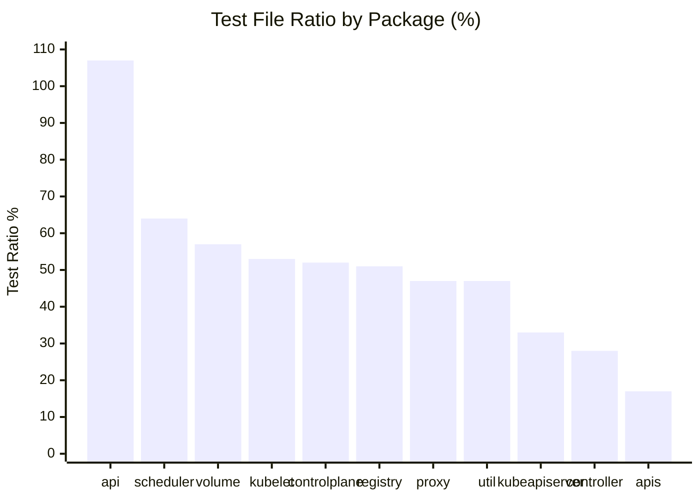

# Testability and Reliability Assessment

> **Document ID:** 06_TESTABILITY_AND_RELIABILITY  
> **Category:** Testability  
> **Risk Rating:** High  
> **Last Updated:** 2024  
> **Finding ID Prefix:** TEST-NNN

---

## Scope and Methodology

This document assesses **per-component testability (unit and integration), produces a structured coupling inventory with high-coupling cluster identification, maps existing test coverage from test file analysis, catalogs hidden side effects, and inventories non-deterministic behavior** across all production code and test infrastructure in the Kubernetes repository.

### Analysis Scope

- **Production code:** All `pkg/**/*.go` files (approximately 3,500 non-generated Go files across 30 top-level packages)
- **Test code:** All `*_test.go` files throughout the repository (approximately 2,847 test files)
- **Test infrastructure:** `test/e2e/`, `test/integration/`, `test/conformance/`, `test/cmd/`
- **Test tooling:** `hack/test-go.sh`, `hack/ginkgo-e2e.sh`, `Makefile` test targets

### Exclusions

- Generated files (`zz_generated.*.go`, `*.pb.go`, `types_swagger_doc_generated.go`)
- Vendor and third-party directories (`vendor/`, `third_party/`)
- Runtime coverage measurement (no runtime profiling — static analysis only)

### Test File Presence Summary

| Package | Production Go Files | Test Files | Test File Ratio | Assessment Priority |
|---------|---------------------|------------|-----------------|---------------------|
| `pkg/api` | 26 | 28 | 107% | Low — well-covered |
| `pkg/scheduler` | 127 | 82 | 64% | High — core scheduling logic |
| `pkg/volume` | 124 | 71 | 57% | Medium — plugin architecture |
| `pkg/kubelet` | 440 | 235 | 53% | Critical — largest component |
| `pkg/controlplane` | 40 | 21 | 52% | Medium — control plane setup |
| `pkg/registry` | 279 | 145 | 51% | High — API storage layer |
| `pkg/proxy` | 78 | 37 | 47% | High — network proxy |
| `pkg/util` | 51 | 24 | 47% | Medium — shared utilities |
| `pkg/kubeapiserver` | 15 | 5 | 33% | Medium — API server config |
| `pkg/controller` | 420 | 120 | 28% | Critical — controller logic |
| `pkg/apis` | 539 | 93 | 17% | High — API type definitions |

---

## Per-Component Testability Assessment

This section evaluates each major package for **unit testability** (can functions be tested in isolation?) and **integration testability** (how complex is the setup for integration scenarios?).

### Testability Evaluation Criteria

| Factor | Description |
|--------|-------------|
| **Direct Testability** | Can functions be invoked and validated in isolation without environmental dependencies? |
| **Dependency Injection** | Are interfaces used for dependencies, or are concrete types hard-wired? |
| **Global State** | Does the package use package-level mutable variables, singletons, or shared state? |
| **Side Effect Exposure** | Does the code perform file I/O, network calls, or OS interactions not apparent from signatures? |
| **Test Infrastructure** | Are fake clients, mock objects, and test utilities readily available? |
| **Setup Complexity** | How much boilerplate is needed to instantiate the system under test? |
| **External Dependencies** | Are external services (etcd, container runtime, kernel APIs) required? |

---

### 2.1 pkg/controller/ — 28% Test File Ratio (CRITICAL)

| Finding ID | TEST-001 |
|---|---|
| **Category** | Testability |
| **Title** | Controller package has critically low test file ratio at 28% |
| **Source Location** | `pkg/controller/` (420 production files, 120 test files) |
| **Description** | The controller package — responsible for all core Kubernetes control loops including deployment, job, statefulset, replicaset, daemonset, garbage collection, and 20+ more controllers — has only 120 test files for 420 production files. This is the second-lowest ratio among packages with substantial logic. |
| **Evidence** | Sub-package analysis: `pkg/controller/deployment/`: 16 prod / 7 test; `pkg/controller/garbagecollector/`: 20 prod / 3 test; `pkg/controller/replicaset/`: 13 prod / 2 test; `pkg/controller/cronjob/`: 14 prod / 2 test; `pkg/controller/nodeipam/`: 20 prod / 5 test; `pkg/controller/volume/`: 62 prod / 24 test. |
| **Impact** | Low test coverage for controllers increases defect introduction risk during reconciliation loop modifications. Controllers are the primary business logic layer; undetected regressions can cascade to cluster-wide state corruption. |
| **Inference Flag** | CONFIRMED |
| **Recommendation Ref** | `08_IMPROVEMENT_ROADMAP.md` § P1 — Increase Controller Test Coverage |

#### Unit Testability Assessment

**Dependency Injection Pattern (Positive):** All major controllers use the `syncHandler` function field injection pattern. The `DeploymentController` struct (Source: `pkg/controller/deployment/deployment_controller.go:76`) declares `syncHandler func(ctx context.Context, dKey string) error` and assigns `dc.syncHandler = dc.syncDeployment` at line 150, allowing test code to inject custom sync functions. This pattern is replicated in:
- `pkg/controller/job/job_controller.go:91` — `syncHandler func(ctx context.Context, jobKey string) error`
- `pkg/controller/daemon/daemon_controller.go:101` — `syncHandler func(ctx context.Context, dsKey string) error`
- `pkg/controller/replicaset/replica_set.go:100` — `syncHandler func(ctx context.Context, rsKey string) error`
- `pkg/controller/resourcequota/resource_quota_controller.go:91` — injection for testing

**Fake Client Usage (Positive):** Controller tests consistently use `fake.NewSimpleClientset()` and `fake.NewClientset()` from `k8s.io/client-go/kubernetes/fake` to create in-memory API server simulators. This is confirmed across `pkg/controller/replicaset/replica_set_test.go:288`, `pkg/controller/cronjob/cronjob_controllerv2_test.go:1646`, and other test files.

**Informer Synced Injection (Positive):** Cache sync functions (`dListerSynced`, `rsListerSynced`, `podListerSynced`) are declared as struct fields (Source: `pkg/controller/deployment/deployment_controller.go:89-95`) with comments explicitly stating "Added as a member to the struct to allow injection for testing."

| Finding ID | TEST-002 |
|---|---|
| **Category** | Testability |
| **Title** | Garbage collector has lowest test ratio among core controllers (20 prod / 3 test files) |
| **Source Location** | `pkg/controller/garbagecollector/` |
| **Description** | The garbage collector — responsible for cascading deletion of dependent objects via a dependency graph — has 20 production files but only 3 test files. The `GarbageCollector` struct depends on a `dependencyGraphBuilder` (Source: `pkg/controller/garbagecollector/garbagecollector.go:71`), `metadataClient`, `restMapper`, and multiple work queues (`attemptToDelete`, `attemptToOrphan`), making isolated unit testing complex. |
| **Evidence** | `type GarbageCollector struct` at `garbagecollector.go:64` has 7 fields referencing external interfaces. The `NewGarbageCollector` constructor at line 83 requires `kubeClient`, `metadataClient`, `mapper`, `ignoredResources`, `sharedInformers`, and `informersStarted` channel — all of which must be provisioned for testing. |
| **Impact** | Cascading deletion bugs can result in orphaned or prematurely deleted resources. Insufficient test coverage means regression risk is elevated for critical cluster state management functionality. |
| **Inference Flag** | CONFIRMED |
| **Recommendation Ref** | `08_IMPROVEMENT_ROADMAP.md` § P1 — Increase Controller Test Coverage |

#### Integration Testability Assessment

**Setup Complexity:** Controller integration tests require informer factories, fake clients, and work queue initialization. The `NewDeploymentController` constructor (Source: `pkg/controller/deployment/deployment_controller.go:102`) requires `dInformer`, `rsInformer`, `podInformer`, and a `clientset.Interface` — representing moderate setup complexity that is well-supported by the `SharedInformerFactory` pattern.

**External Dependencies:** Controllers communicate with the API server via `client-go`. Integration tests under `test/integration/` provide real etcd-backed testing but require a running etcd instance.

---

### 2.2 pkg/kubelet/ — 53% Test File Ratio

| Finding ID | TEST-003 |
|---|---|
| **Category** | Testability |
| **Title** | Kubelet core struct has 389 lines with massive dependency surface impeding unit testability |
| **Source Location** | `pkg/kubelet/kubelet.go:1132-1520` (Kubelet struct definition and initialization) |
| **Description** | The `Kubelet` struct spans approximately 389 lines with 80+ import paths from both internal packages and staging modules. The `kubelet.go` file imports from 84 distinct packages, creating an extraordinarily wide dependency surface that makes isolated unit testing of the core Kubelet struct nearly impossible without extensive mocking. |
| **Evidence** | Import block in `pkg/kubelet/kubelet.go:19-146` contains 84 import statements spanning internal kubelet sub-packages (`allocation`, `cadvisor`, `cm`, `config`, `container`, `eviction`, `images`, `kuberuntime`, `lifecycle`, `logs`, `metrics`, `pleg`, `pluginmanager`, `prober`, `secret`, `server`, `stats`, `status`, `volumemanager`, `watchdog`), staging modules (`k8s.io/client-go`, `k8s.io/cri-api`, `k8s.io/cri-client`), and external libraries (`cadvisor`, `opentelemetry`, `selinux`). |
| **Impact** | Changes to the kubelet core require understanding a vast dependency graph. Testing any single behavior requires provisioning dozens of dependencies, increasing test setup fragility and reducing developer velocity for kubelet modifications. |
| **Inference Flag** | CONFIRMED |
| **Recommendation Ref** | `08_IMPROVEMENT_ROADMAP.md` § P2 — Reduce Kubelet Core Coupling |

#### Sub-Package Testability Analysis

| Sub-Package | Prod Files | Test Files | Ratio | Testability Assessment |
|-------------|-----------|------------|-------|----------------------|
| `kubelet/cm` | 95 | 51 | 54% | Heavy platform-specific code (Linux cgroups, Windows). Build tags (`//go:build linux`, `//go:build windows`) segment test execution, requiring platform-specific CI. |
| `kubelet/kuberuntime` | 26 | 18 | 69% | Depends on CRI interface (`k8s.io/cri-api`). Uses `internalapi.RuntimeService` for container runtime calls — testable via fake CRI implementations. |
| `kubelet/images` | 16 | 9 | 56% | Image pull logic uses `time.Now()` directly (Source: `pkg/kubelet/images/puller.go:61`), introducing non-deterministic timing in tests. |
| `kubelet/eviction` | 15 | 4 | 27% | Low test ratio. Eviction manager depends on cadvisor stats, node conditions, and pod status — complex integration surface. |
| `kubelet/container` | 16 | 7 | 44% | Container runtime abstraction layer. Interface-based design enables mocking. |
| `kubelet/pluginmanager` | 17 | 9 | 53% | Plugin registration with OS-level socket operations. |
| `kubelet/volumemanager` | 11 | 7 | 64% | Volume attach/detach state machine. Depends on volume plugin interfaces. |
| `kubelet/lifecycle` | 8 | 2 | 25% | Low test ratio for pod admission logic — high-risk area for admission decision regressions. |
| `kubelet/prober` | 5 | 6 | 120% | Well-tested probing logic with more test files than production files. |
| `kubelet/config` | 10 | 7 | 70% | Configuration sourcing from API, file, and HTTP — well-structured for testing. |

| Finding ID | TEST-004 |
|---|---|
| **Category** | Testability |
| **Title** | Kubelet eviction sub-package has low test ratio (27%) for safety-critical eviction logic |
| **Source Location** | `pkg/kubelet/eviction/` (15 prod / 4 test files) |
| **Description** | The eviction manager decides when to evict pods due to resource pressure (memory, disk, PID). With only 4 test files covering 15 production files, the eviction decision logic — which directly impacts pod availability — is under-tested relative to its criticality. |
| **Evidence** | `pkg/kubelet/eviction/` directory contains `eviction_manager.go`, `helpers.go`, `thresholds.go`, and multiple supporting files, but test coverage is concentrated in a few test files rather than covering individual eviction strategies comprehensively. |
| **Impact** | Eviction bugs can cause unnecessary pod termination (false evictions) or failure to evict during genuine resource pressure (node instability). Both outcomes have production-critical consequences. |
| **Inference Flag** | CONFIRMED |
| **Recommendation Ref** | `08_IMPROVEMENT_ROADMAP.md` § P1 — Increase Coverage for Safety-Critical Subsystems |

#### Kubelet Global State

| Finding ID | TEST-005 |
|---|---|
| **Category** | Testability |
| **Title** | Kubelet uses mutable package-level variables that complicate test isolation |
| **Source Location** | `pkg/kubelet/kubelet.go:242-250` |
| **Description** | The kubelet package declares mutable package-level variables including `ContainerLogsDir` (Source: `pkg/kubelet/kubelet.go:244`, comment: "ContainerLogsDir can be overwritten for testing usage") and `etcHostsPath`. While the comment acknowledges the testing use case, package-level mutable state creates test isolation risks when tests run concurrently. |
| **Evidence** | `var ContainerLogsDir = DefaultContainerLogsDir` at line 244 and `var etcHostsPath = getContainerEtcHostsPath()` at line 245. Additionally, `pkg/kubelet/kubelet_pods.go:679` defines `var masterServices = sets.New[string]("kubernetes")`. |
| **Impact** | Concurrent test execution can produce flaky results if tests modify package-level variables without proper isolation. This is a common source of intermittent test failures in CI. |
| **Inference Flag** | CONFIRMED |
| **Recommendation Ref** | `08_IMPROVEMENT_ROADMAP.md` § P2 — Eliminate Mutable Package-Level State |

---

### 2.3 pkg/apis/ — 17% Test File Ratio (CRITICAL)

| Finding ID | TEST-006 |
|---|---|
| **Category** | Testability |
| **Title** | API types package has lowest test file ratio (17%) but mitigated by generated code dominance |
| **Source Location** | `pkg/apis/` (539 production files, 93 test files) |
| **Description** | The `pkg/apis/` package has the lowest test file ratio at 17%. However, this is partially mitigated by the fact that approximately 192 files in this directory are either type definitions (`types.go`), generated Swagger docs (`types_swagger_doc_generated.go`), or generated code (`zz_generated*.go`) that contain no testable logic. The testable surface is primarily validation functions, defaulting functions, and conversion functions. |
| **Evidence** | 192 files match patterns `types.go`, `types_swagger_doc_generated.go`, or `zz_generated*`. 27 validation test files exist (`*validation*_test.go`). 21 API groups have fuzzer sub-packages under `pkg/apis/*/fuzzer/` for round-trip testing. |
| **Impact** | While the raw ratio is alarming, the effective test coverage of testable logic (validation, defaulting, conversion) is higher than the ratio suggests. However, validation logic gaps can result in invalid API objects entering the system. |
| **Inference Flag** | CONFIRMED |
| **Recommendation Ref** | `08_IMPROVEMENT_ROADMAP.md` § P2 — Audit API Validation Test Coverage |

**Testability Positive Patterns:**
- **Fuzzer-based round-trip testing:** 21 API groups have dedicated `fuzzer/` sub-packages for automated round-trip conversion testing between API versions, providing broad structural validation.
- **Table-driven validation tests:** Validation test files use table-driven patterns extensively, enabling comprehensive input coverage.

---

### 2.4 pkg/scheduler/ — 64% Test File Ratio (Best Among Large Packages)

| Finding ID | TEST-007 |
|---|---|
| **Category** | Testability |
| **Title** | Scheduler demonstrates exemplary testability architecture with dedicated testing sub-packages |
| **Source Location** | `pkg/scheduler/` (127 production files, 82 test files) |
| **Description** | The scheduler package achieves the highest test file ratio (64%) among large packages. It provides four dedicated testing sub-packages: `pkg/scheduler/testing/`, `pkg/scheduler/backend/cache/fake/`, `pkg/scheduler/framework/plugins/testing/`, and `pkg/scheduler/apis/config/testing/`. The framework plugin architecture uses interfaces that naturally enable testing. |
| **Evidence** | `pkg/scheduler/scheduler.go:72-130` — The `Scheduler` struct uses function fields (`NextPod`, `FailureHandler`, `SchedulePod`) that can be overridden for testing. At line 132-135, `applyDefaultHandlers()` sets default implementations, while tests can inject alternatives. The `Framework` interface in `pkg/scheduler/framework/` defines clear plugin extension points testable in isolation. |
| **Impact** | The scheduler's testability architecture serves as a positive reference pattern for other packages. High test coverage reduces scheduling decision regression risk. |
| **Inference Flag** | CONFIRMED |
| **Recommendation Ref** | `08_IMPROVEMENT_ROADMAP.md` § P3 — Propagate Scheduler Testing Patterns |

**Key testability strengths:**
- Function field injection (`SchedulePod`, `NextPod`, `FailureHandler`)
- Plugin interface architecture enabling isolated plugin testing
- Dedicated `fake/` and `testing/` sub-packages for test infrastructure
- Scheduler cycle state (`framework.CycleState`) designed for test introspection

---

### 2.5 pkg/registry/ — 51% Test File Ratio

| Finding ID | TEST-008 |
|---|---|
| **Category** | Testability |
| **Title** | Registry package follows standardized REST storage testing patterns with moderate coverage |
| **Source Location** | `pkg/registry/` (279 production files, 145 test files) |
| **Description** | The registry package implements REST storage strategies for 20+ API groups. Storage implementations follow a standardized pattern (strategy, storage, REST endpoints) that enables consistent test approaches. The `storage_core.go` file (Source: `pkg/registry/core/rest/storage_core.go`) wires together 15+ storage providers with complex initialization including IP allocators, service account stores, and node storage. |
| **Evidence** | `pkg/registry/core/rest/storage_core.go:108-150` — The `New()` function creates a `legacyProvider` with `serviceClusterIPAllocator`, `serviceNodePortAllocator`, and repair controllers. This wiring complexity means integration testing of the full storage initialization requires significant setup. Individual storage strategies are more amenable to isolated testing. |
| **Impact** | Standardized patterns enable consistent testing but the moderate 51% ratio suggests coverage gaps in individual API group storage implementations. |
| **Inference Flag** | CONFIRMED |
| **Recommendation Ref** | `08_IMPROVEMENT_ROADMAP.md` § P2 — Standardize Registry Test Coverage |

---

### 2.6 pkg/proxy/ — 47% Test File Ratio

| Finding ID | TEST-009 |
|---|---|
| **Category** | Testability |
| **Title** | Proxy package requires platform-specific testing across multiple backends |
| **Source Location** | `pkg/proxy/` (78 production files, 37 test files) |
| **Description** | The proxy package implements service proxying via multiple backends: iptables (Linux), ipvs (Linux), nftables (Linux), and winkernel (Windows). Each backend has distinct testing requirements. The iptables proxier (Source: `pkg/proxy/iptables/proxier.go`) is Linux-only (`//go:build linux`), uses `utiliptables.Interface` for iptables interactions, and relies on `sysctl` for kernel parameter configuration. |
| **Evidence** | Backend test coverage: `iptables/`: 2 prod / 2 test; `ipvs/`: 5 prod / 3 test; `nftables/`: 2 prod / 2 test; `winkernel/`: 4 prod / 2 test; `util/`: 7 prod / 5 test. Testing sub-packages exist: `pkg/proxy/ipvs/testing/`, `pkg/proxy/util/testing/`, `pkg/proxy/winkernel/testing/`, `pkg/util/iptables/testing/`. |
| **Impact** | Platform-specific code segments require corresponding CI environments (Linux and Windows). Interface-based design (`utiliptables.Interface`, `utilsysctl.Interface`, `proxyutil.NetworkInterfacer`) at `pkg/proxy/iptables/proxier.go:162-204` enables mock-based testing without actual kernel interactions. |
| **Inference Flag** | CONFIRMED |
| **Recommendation Ref** | `08_IMPROVEMENT_ROADMAP.md` § P2 — Ensure Cross-Platform Test Coverage |

---

### 2.7 pkg/volume/ — 57% Test File Ratio

| Finding ID | TEST-010 |
|---|---|
| **Category** | Testability |
| **Title** | Volume package has well-designed plugin testing infrastructure |
| **Source Location** | `pkg/volume/` (124 production files, 71 test files) |
| **Description** | The volume package uses a plugin architecture defined via the `VolumePlugin` interface (Source: `pkg/volume/plugins.go:128`) and its extensions (`PersistentVolumePlugin`, `RecyclableVolumePlugin`, `DeletableVolumePlugin`, `ProvisionableVolumePlugin`). The `pkg/volume/testing/` sub-package provides `testing.go` and `volume_host.go` with comprehensive fake implementations for test isolation. |
| **Evidence** | `pkg/volume/plugins.go:128-218` defines the `VolumePlugin` interface hierarchy. The `VolumeHost` interface (referenced at line 132) is the primary dependency injection point for plugins. `pkg/volume/testing/testing.go` imports `"k8s.io/kubernetes/pkg/volume"`, `"k8s.io/utils/exec/testing"`, and provides fake volume implementations for test code. |
| **Impact** | The plugin interface design provides natural test boundaries. However, deprecated volume plugins (e.g., in-tree CSI migration candidates) may have stale or inadequate tests. |
| **Inference Flag** | CONFIRMED |
| **Recommendation Ref** | `08_IMPROVEMENT_ROADMAP.md` § P3 — Audit Deprecated Volume Plugin Tests |

---

## Coupling Inventory

This section catalogs inter-package dependencies that affect testability. **High coupling** reduces test isolation, increases setup complexity, and creates brittle test suites that break when distant packages change.

### High-Coupling Cluster Identification

```mermaid
graph TD
    subgraph "Cluster 1: Kubelet Core"
        kubelet["pkg/kubelet<br/>(84 imports)"]
        kubelet_cm["pkg/kubelet/cm"]
        kubelet_kuberuntime["pkg/kubelet/kuberuntime"]
        kubelet_images["pkg/kubelet/images"]
        kubelet_eviction["pkg/kubelet/eviction"]
        kubelet_pluginmanager["pkg/kubelet/pluginmanager"]
        kubelet_volumemanager["pkg/kubelet/volumemanager"]
        kubelet_pleg["pkg/kubelet/pleg"]
        kubelet_container["pkg/kubelet/container"]
        kubelet_status["pkg/kubelet/status"]
        kubelet_prober["pkg/kubelet/prober"]
    end

    subgraph "Cluster 2: Controller Framework"
        controller["pkg/controller"]
        controller_deployment["pkg/controller/deployment"]
        controller_job["pkg/controller/job"]
        controller_statefulset["pkg/controller/statefulset"]
        controller_gc["pkg/controller/garbagecollector"]
        controller_replicaset["pkg/controller/replicaset"]
        controller_daemon["pkg/controller/daemon"]
    end

    subgraph "Cluster 3: Scheduling"
        scheduler["pkg/scheduler"]
        scheduler_framework["pkg/scheduler/framework"]
        scheduler_backend["pkg/scheduler/backend"]
    end

    subgraph "Cluster 4: API Layer"
        apis["pkg/apis"]
        registry["pkg/registry"]
    end

    subgraph "Staging Dependencies"
        clientgo["client-go"]
        apimachinery["apimachinery"]
        apiserver["apiserver"]
        criapi["cri-api"]
    end

    kubelet --> kubelet_cm
    kubelet --> kubelet_kuberuntime
    kubelet --> kubelet_images
    kubelet --> kubelet_eviction
    kubelet --> kubelet_pluginmanager
    kubelet --> kubelet_volumemanager
    kubelet --> kubelet_pleg
    kubelet --> kubelet_container
    kubelet --> kubelet_status
    kubelet --> kubelet_prober
    kubelet --> apis
    kubelet --> clientgo
    kubelet --> criapi
    kubelet --> apimachinery

    controller_deployment --> controller
    controller_deployment --> clientgo
    controller_deployment --> apimachinery
    controller_job --> controller
    controller_job --> clientgo
    controller_statefulset --> controller
    controller_gc --> clientgo
    controller_gc --> apimachinery

    scheduler --> scheduler_framework
    scheduler --> scheduler_backend
    scheduler --> apis
    scheduler --> clientgo

    registry --> apis
    registry --> apiserver
    registry --> clientgo
```

### Coupling Metrics Table

| Package A | Package B | Coupling Type | Import Directionality | Estimated Imports | Testability Impact |
|-----------|-----------|--------------|----------------------|-------------------|-------------------|
| `pkg/kubelet` | `pkg/kubelet/cm` | Internal sub-package | kubelet → cm | 3+ | High — cm requires Linux cgroups; kubelet tests must mock or skip cm interactions |
| `pkg/kubelet` | `pkg/kubelet/kuberuntime` | Internal sub-package | kubelet → kuberuntime | 1 | High — kuberuntime depends on CRI interface; requires CRI fake for testing |
| `pkg/kubelet` | `k8s.io/cri-api` | Cross-module (staging) | kubelet → cri-api | 2 | High — container runtime interface; requires fake CRI service |
| `pkg/kubelet` | `k8s.io/client-go` | Cross-module (staging) | kubelet → client-go | 8+ | Medium — well-supported by `fake.NewSimpleClientset()` |
| `pkg/kubelet` | `pkg/volume` | Cross-package | kubelet → volume | 4 | Medium — volume plugin interface enables mock testing |
| `pkg/kubelet` | `pkg/apis/core` | Cross-package | kubelet → apis | 3 | Low — type definitions only, no behavioral coupling |
| `pkg/kubelet` | `pkg/scheduler/framework/plugins` | Cross-package | kubelet → scheduler | 1 | Medium — kubelet imports taint toleration plugin; unusual cross-boundary dependency |
| `pkg/controller/deployment` | `pkg/controller` | Parent package | deployment → controller | 2 | Low — shared utilities via `RSControlInterface`, `PodControlInterface` |
| `pkg/controller/deployment` | `k8s.io/client-go` | Cross-module (staging) | deployment → client-go | 8 | Low — well-supported fake clients |
| `pkg/controller/job` | `pkg/controller` | Parent package | job → controller | 2 | Low — shared controller utilities |
| `pkg/controller/job` | `k8s.io/utils/clock` | External | job → clock | 1 | Positive — clock injection enables deterministic time testing |
| `pkg/controller/garbagecollector` | `k8s.io/client-go/metadata` | Cross-module (staging) | gc → metadata | 1 | Medium — metadata client requires fakeable interface |
| `pkg/controller/garbagecollector` | `k8s.io/controller-manager` | Cross-module (staging) | gc → controller-manager | 2 | Medium — informer factory dependency increases setup complexity |
| `pkg/scheduler` | `pkg/scheduler/framework` | Internal sub-package | scheduler → framework | 5+ | Low — framework provides clear interface boundaries |
| `pkg/scheduler` | `pkg/scheduler/backend` | Internal sub-package | scheduler → backend | 4 | Low — cache/queue interfaces are mockable |
| `pkg/scheduler` | `k8s.io/client-go` | Cross-module (staging) | scheduler → client-go | 4 | Low — standard fake client support |
| `pkg/registry` | `pkg/apis` | Cross-package | registry → apis | 15+ | Low — type imports only |
| `pkg/registry` | `k8s.io/apiserver` | Cross-module (staging) | registry → apiserver | 5+ | Medium — storage backend abstraction |
| `pkg/proxy/iptables` | `pkg/proxy` | Parent package | iptables → proxy | 5 | Medium — proxy change tracking interfaces |
| `pkg/proxy/iptables` | `pkg/util/iptables` | Cross-package | iptables → util/iptables | 1 | Medium — iptables interface has testing fake |
| `pkg/proxy/iptables` | `k8s.io/component-helpers` | Cross-module (staging) | iptables → component-helpers | 1 | Low — sysctl interface well-mocked |

### Interface Boundaries Assessment

| Finding ID | TEST-011 |
|---|---|
| **Category** | Testability |
| **Title** | Kubelet cross-boundary import of scheduler plugin creates unexpected coupling |
| **Source Location** | `pkg/kubelet/kubelet.go:51` |
| **Description** | The kubelet package imports `"k8s.io/kubernetes/pkg/scheduler/framework/plugins/tainttoleration"` — a scheduler-internal plugin. This cross-boundary dependency means kubelet tests may be affected by scheduler framework changes, and the kubelet binary includes scheduler plugin code. |
| **Evidence** | Import at `pkg/kubelet/kubelet.go:51`: `"k8s.io/kubernetes/pkg/scheduler/framework/plugins/tainttoleration"`. This is the only scheduler plugin imported by kubelet, creating an unusual cross-component coupling. |
| **Impact** | Changes to the taint toleration scheduler plugin require validation against kubelet. This coupling violates the expected boundary between scheduling and node-level execution components. |
| **Inference Flag** | CONFIRMED |
| **Recommendation Ref** | `08_IMPROVEMENT_ROADMAP.md` § P2 — Decouple Kubelet from Scheduler Internals |

| Finding ID | TEST-012 |
|---|---|
| **Category** | Testability |
| **Title** | Effective interface-based decoupling in proxy package enables isolated backend testing |
| **Source Location** | `pkg/proxy/iptables/proxier.go:162-204` |
| **Description** | The iptables proxier declares its dependencies via interfaces: `utiliptables.Interface` (line 162), `conntrack.Interface` (line 165), `nfacct.Interface` (line 166), `proxyutil.LocalTrafficDetector` (line 167), and `proxyutil.NetworkInterfacer` (line 204, commented "Inject for test purpose"). Dedicated testing packages (`pkg/util/iptables/testing/`, `pkg/proxy/util/testing/`) provide fake implementations. |
| **Evidence** | `networkInterfacer proxyutil.NetworkInterfacer` with comment "Inject for test purpose" at `proxier.go:204`. Testing package at `pkg/proxy/ipvs/testing/`, `pkg/proxy/util/testing/` provide comprehensive fakes. |
| **Impact** | This interface-based design is a positive testability pattern that enables testing iptables proxy logic without kernel-level iptables operations. Other packages should adopt similar patterns. |
| **Inference Flag** | CONFIRMED |
| **Recommendation Ref** | `08_IMPROVEMENT_ROADMAP.md` § P3 — Propagate Interface-Based Testing Patterns |

| Finding ID | TEST-013 |
|---|---|
| **Category** | Testability |
| **Title** | Controller shared utilities create implicit coupling across all controller sub-packages |
| **Source Location** | `pkg/controller/controller_utils.go`, `pkg/controller/controller_ref_manager.go` |
| **Description** | All controllers import `pkg/controller` for shared interfaces (`RSControlInterface`, `PodControlInterface`, `ControllerExpectationsInterface`) and utilities (`controller_utils.go`, `controller_ref_manager.go`). Changes to these shared utilities impact all 30+ controllers simultaneously. |
| **Evidence** | `pkg/controller/deployment/deployment_controller.go:49-50` imports `"k8s.io/kubernetes/pkg/controller"` and `"k8s.io/kubernetes/pkg/controller/deployment/util"`. Similar patterns in job, statefulset, replicaset, and daemon controllers. |
| **Impact** | Shared utility changes have high blast radius. Any modification to `controller_utils.go` or `controller_ref_manager.go` can break tests across all 30+ controllers. |
| **Inference Flag** | CONFIRMED |
| **Recommendation Ref** | `08_IMPROVEMENT_ROADMAP.md` § P2 — Stabilize Controller Shared Utility Interfaces |

---

## Existing Test Coverage Map

### Test Infrastructure Overview

| Infrastructure Component | Location | Purpose | Framework |
|--------------------------|----------|---------|-----------|
| Unit tests | `pkg/**/*_test.go` | Package-level unit testing | Standard `testing` package with table-driven patterns |
| Integration tests | `test/integration/` | In-process integration with real etcd | Standard `testing` package |
| E2E tests | `test/e2e/` | Full cluster end-to-end testing | Ginkgo/Gomega BDD framework |
| Conformance tests | `test/conformance/` | Kubernetes conformance validation | Standard conformance test format |
| Command tests | `test/cmd/` | CLI command testing | Standard `testing` package |
| Test entry point | `hack/test-go.sh` | Unit test orchestration | Go test runner |
| E2E entry point | `hack/ginkgo-e2e.sh` | E2E test orchestration | Ginkgo runner |
| Makefile targets | `Makefile:93-180` | Build, verify, test-integration, test-cmd, ginkgo | Make-based orchestration |

### Test Framework Usage Distribution

| Framework | Primary Package Areas | Test Pattern | File Count |
|-----------|----------------------|--------------|------------|
| Standard `testing` + table-driven | `pkg/controller/`, `pkg/registry/`, `pkg/scheduler/`, `pkg/apis/` | `tests := []struct{...}` loops with `t.Run()` | ~493 files with table-driven patterns in `pkg/` |
| Ginkgo/Gomega (BDD) | `test/e2e/` | `Describe/Context/It` blocks | ~358 Ginkgo test files in `test/e2e/` |
| Standard `testing` (non-table) | `pkg/kubelet/`, `pkg/proxy/` | Direct assertion testing | Various |
| Mixed (Standard + Ginkgo) | `pkg/kubelet/` sub-packages | Both patterns coexist | Various |
| Fuzzer-based round-trip | `pkg/apis/*/fuzzer/` | Automated API conversion testing | 21 fuzzer packages |

| Finding ID | TEST-014 |
|---|---|
| **Category** | Testability |
| **Title** | Dual test framework usage (standard testing vs. Ginkgo) creates inconsistent patterns |
| **Source Location** | `test/e2e/` (Ginkgo), `pkg/` (standard testing) |
| **Description** | The repository uses two distinct test frameworks: standard Go `testing` with table-driven patterns for unit tests in `pkg/`, and Ginkgo/Gomega BDD framework for E2E tests in `test/e2e/`. While this separation is intentional (unit vs. E2E), some `pkg/kubelet/` sub-packages mix both patterns, creating inconsistency within a single domain. |
| **Evidence** | 358 Ginkgo test files in `test/e2e/`; 118 standard `testing.T` files in `pkg/controller/`; 493 table-driven test files in `pkg/`. The Makefile provides separate targets: `hack/test-go.sh` for unit tests and `hack/ginkgo-e2e.sh` for E2E tests. |
| **Impact** | Contributors must understand two testing frameworks. Mixed usage within a single package (kubelet) increases cognitive load and can lead to inconsistent assertion patterns. |
| **Inference Flag** | CONFIRMED |
| **Recommendation Ref** | `08_IMPROVEMENT_ROADMAP.md` § P3 — Standardize Test Framework Usage Per Layer |

### Per-Package Test Utility Infrastructure

| Package | Testing Sub-Package | Contents |
|---------|---------------------|----------|
| `pkg/scheduler` | `pkg/scheduler/testing/` | Scheduler test utilities, fake framework implementations |
| `pkg/scheduler` | `pkg/scheduler/backend/cache/fake/` | Fake scheduling cache for testing |
| `pkg/scheduler` | `pkg/scheduler/framework/plugins/testing/` | Plugin testing utilities |
| `pkg/scheduler` | `pkg/scheduler/apis/config/testing/` | Configuration test helpers |
| `pkg/volume` | `pkg/volume/testing/` | Fake volume host, mock volume plugins |
| `pkg/volume` | `pkg/volume/csi/fake/` | Fake CSI driver |
| `pkg/volume` | `pkg/volume/csi/testing/` | CSI test utilities |
| `pkg/kubelet` | `pkg/kubelet/pod/testing/` | Pod test utilities |
| `pkg/kubelet` | `pkg/kubelet/cadvisor/testing/` | Fake cadvisor interface |
| `pkg/kubelet` | `pkg/kubelet/server/stats/testing/` | Stats server test utilities |
| `pkg/proxy` | `pkg/proxy/ipvs/testing/` | IPVS fake implementations |
| `pkg/proxy` | `pkg/proxy/util/testing/` | Proxy utility test fakes |
| `pkg/proxy` | `pkg/proxy/winkernel/testing/` | Windows proxy test fakes |
| `pkg/util` | `pkg/util/iptables/testing/` | Fake iptables interface |
| `pkg/controller` | `pkg/controller/volume/persistentvolume/testing/` | PV controller test utilities |
| `pkg/controller` | `pkg/controller/volume/attachdetach/testing/` | Attach/detach test utilities |

### Test Coverage Heat Map

### E2E Test Category Coverage

| E2E Category | Directory | Focus Area |
|-------------|-----------|------------|
| Apps | `test/e2e/apps/` | Deployment, StatefulSet, DaemonSet, Job, CronJob |
| Network | `test/e2e/network/` | Services, Ingress, NetworkPolicy, DNS |
| Storage | `test/e2e/storage/` | PersistentVolumes, CSI, volume operations |
| Scheduling | `test/e2e/scheduling/` | Pod scheduling, preemption, priority |
| Node | `test/e2e/node/` | Kubelet behavior, pod lifecycle, resource management |
| Auth | `test/e2e/auth/` | RBAC, ServiceAccount, certificates |
| API Machinery | `test/e2e/apimachinery/` | API resources, CRDs, aggregation |
| DRA | `test/e2e/dra/` | Dynamic Resource Allocation |
| Lifecycle | `test/e2e/lifecycle/` | Cluster lifecycle events |
| Kubectl | `test/e2e/kubectl/` | kubectl command behavior |
| Instrumentation | `test/e2e/instrumentation/` | Metrics, logging, tracing |
| Autoscaling | `test/e2e/autoscaling/` | HPA, VPA, cluster autoscaler |

---

## Hidden Side Effect Catalog

This section catalogs functions whose signatures do not reveal their full behavioral impact — side effects that complicate test isolation, create non-obvious test dependencies, and increase the risk of flaky tests.

### 4.1 Operating System Interactions

| Finding ID | TEST-015 |
|---|---|
| **Category** | Testability |
| **Title** | Kubelet executes external binaries (`getsubids`) with OS-level side effects hidden in pod setup |
| **Source Location** | `pkg/kubelet/kubelet_pods.go:160-180` |
| **Description** | The `parseGetSubIdsOutput` function and its caller use `exec.LookPath("getsubids")` and `exec.Command(cmd, kubeletUser).Output()` to query subordinate user/group ID ranges. These OS-level interactions are embedded in pod setup logic without interface abstraction, making unit testing require either the `getsubids` binary or complex mocking. |
| **Evidence** | `pkg/kubelet/kubelet_pods.go:160`: `execName := "getsubids"`; line 161: `cmd, err := exec.LookPath(execName)`; lines 169-173: `outUids, err := exec.Command(cmd, kubeletUser).Output()` and `outGids, err := exec.Command(cmd, "-g", kubeletUser).Output()`. |
| **Impact** | Tests for user namespace functionality require either the `getsubids` binary on the test host or a way to bypass the external command execution. CI environments without this binary may experience test failures. |
| **Inference Flag** | CONFIRMED |
| **Recommendation Ref** | `08_IMPROVEMENT_ROADMAP.md` § P2 — Abstract External Command Execution |

| Finding ID | TEST-016 |
|---|---|
| **Category** | Testability |
| **Title** | Kubelet container manager performs direct cgroup manipulation via OS library |
| **Source Location** | `pkg/kubelet/cm/container_manager_linux.go` |
| **Description** | The container manager uses `cgroups.Manager` directly for cgroup creation, resource limit enforcement, and state management. The `createManager` function at approximately line 430 creates `cgroups.Cgroup` structures and `cgroups.Manager` instances that interact with the Linux cgroup filesystem. The `ensureStateFunc` field (line 543) captures OS-level cgroup operations. |
| **Evidence** | `pkg/kubelet/cm/container_manager_linux.go:84`: `ensureStateFunc func(m cgroups.Manager) error`; line 87: `manager cgroups.Manager`; line 166: `if cgroups.IsCgroup2UnifiedMode()`. Build tags segment: `//go:build linux` at line 1. |
| **Impact** | Container manager tests on non-Linux platforms will fail or be skipped. Linux-specific cgroup tests require either root privileges or a cgroup namespace, limiting test execution environments. |
| **Inference Flag** | CONFIRMED |
| **Recommendation Ref** | `08_IMPROVEMENT_ROADMAP.md` § P2 — Improve Container Manager Test Abstraction |

| Finding ID | TEST-017 |
|---|---|
| **Category** | Testability |
| **Title** | Kubelet image pull manager performs direct file system operations for pull records |
| **Source Location** | `pkg/kubelet/images/pullmanager/fs_pullrecords.go:75-304` |
| **Description** | The `fsPullRecords` implementation directly uses `os.MkdirAll`, `os.Remove`, `os.Open`, `os.WriteFile`, and `os.Rename` for managing pull record state on disk. These file system operations are not abstracted behind an interface, requiring test code to use temporary directories. |
| **Evidence** | Line 75: `os.MkdirAll(accessor.pullingDir, 0700)`; line 79: `os.MkdirAll(accessor.pulledDir, 0700)`; line 170: `os.Remove(filepath.Join(f.pullingDir, cacheFilename(image)))`; line 292: `os.MkdirAll(dir, 0700)`; line 298: `os.WriteFile(tmpPath, content, 0600)`. |
| **Impact** | File system operations create test environment dependencies. Concurrent test execution accessing the same directories can cause flaky tests. Cleanup failures can leave state that affects subsequent test runs. |
| **Inference Flag** | CONFIRMED |
| **Recommendation Ref** | `08_IMPROVEMENT_ROADMAP.md` § P3 — Abstract File System Operations in Image Manager |

### 4.2 Network and API Server Side Effects

| Finding ID | TEST-018 |
|---|---|
| **Category** | Testability |
| **Title** | Controllers perform API server writes (Create, Update, Delete, Patch) as hidden side effects of sync handlers |
| **Source Location** | `pkg/controller/deployment/sync.go:167-470` |
| **Description** | The deployment sync logic performs multiple API server mutations that are not apparent from the `syncDeployment` function signature. These include creating ReplicaSets (`line 232`), updating ReplicaSet scales (`line 167`), deleting excess ReplicaSets (`line 470`), and updating Deployment status. While the fake client captures these calls in tests, the mutation surface area is large and non-obvious. |
| **Evidence** | `pkg/controller/deployment/sync.go:167`: `dc.client.AppsV1().ReplicaSets(...).Update(ctx, rsCopy, ...)`. Line 232: `dc.client.AppsV1().ReplicaSets(d.Namespace).Create(ctx, &newRS, ...)`. Line 425: `dc.client.AppsV1().ReplicaSets(rsCopy.Namespace).Update(ctx, rsCopy, ...)`. Line 470: `dc.client.AppsV1().ReplicaSets(rs.Namespace).Delete(ctx, rs.Name, ...)`. |
| **Impact** | Test assertions must account for all API server mutations. Missing assertions on side-effect API calls can mask bugs where incorrect objects are created or updated. |
| **Inference Flag** | CONFIRMED |
| **Recommendation Ref** | `08_IMPROVEMENT_ROADMAP.md` § P3 — Document Controller Mutation Surface Areas |

| Finding ID | TEST-019 |
|---|---|
| **Category** | Testability |
| **Title** | Event recording embedded in controller logic creates observation side effects |
| **Source Location** | `pkg/controller/deployment/deployment_controller.go:625` |
| **Description** | Controllers record Kubernetes events via `eventRecorder.Eventf()` during sync operations. These event recordings are side effects that tests must either ignore or explicitly verify. The `EventBroadcaster` is initialized in constructors (e.g., `deployment_controller.go:103`) and starts pipeline processing in `Run()` (line 167-168). |
| **Evidence** | `pkg/controller/deployment/deployment_controller.go:625`: `dc.eventRecorder.Eventf(d, v1.EventTypeWarning, "SelectingAll", "This deployment is selecting all pods...")`. The event broadcaster starts at line 167: `dc.eventBroadcaster.StartStructuredLogging(3)` and line 168: `dc.eventBroadcaster.StartRecordingToSink(...)`. |
| **Impact** | Event recording side effects can cause test noise or mask actual failures if event assertions are not properly configured in test fake recorders. |
| **Inference Flag** | CONFIRMED |
| **Recommendation Ref** | `08_IMPROVEMENT_ROADMAP.md` § P3 — Standardize Event Assertion Patterns in Controller Tests |

### 4.3 Kernel and System-Level Side Effects

| Finding ID | TEST-020 |
|---|---|
| **Category** | Testability |
| **Title** | Proxy iptables implementation manipulates kernel networking rules via iptables-restore |
| **Source Location** | `pkg/proxy/iptables/proxier.go:735` (`syncProxyRules`) |
| **Description** | The `syncProxyRules()` method generates iptables rules and applies them to the kernel via `iptables-restore`. The `Proxier` struct buffers rules in `iptablesData`, `filterChains`, `filterRules`, `natChains`, and `natRules` (lines 181-186) before atomic application. While the `utiliptables.Interface` abstraction enables testing without kernel interaction, the rule generation logic itself has extensive side effects on kernel networking state in production. |
| **Evidence** | `pkg/proxy/iptables/proxier.go:181-186`: Buffer fields `iptablesData *bytes.Buffer`, `filterChains`, `filterRules`, `natChains`, `natRules` of type `proxyutil.LineBuffer`. The `syncRunner` at line 157 governs execution via `runner.NewBoundedFrequencyRunner`. The `syncProxyRules()` at line 735 is the primary side-effect method. |
| **Impact** | Bugs in rule generation can disrupt all service connectivity on a node. The interface-based design enables rule generation testing, but integration testing requires real iptables, which limits CI environments to Linux with appropriate permissions. |
| **Inference Flag** | CONFIRMED |
| **Recommendation Ref** | `08_IMPROVEMENT_ROADMAP.md` § P1 — Maintain Proxy Interface Abstraction |

| Finding ID | TEST-021 |
|---|---|
| **Category** | Testability |
| **Title** | Proxy sysctl writes modify kernel parameters as initialization side effect |
| **Source Location** | `pkg/proxy/iptables/proxier.go:239-246` |
| **Description** | During proxier initialization, `NewProxier` calls `proxyutil.EnsureSysctl(sysctl, sysctlRouteLocalnet, 1)` to set the `net/ipv4/conf/all/route_localnet` kernel parameter. This is a system-wide side effect performed during object construction. The `sysctl` parameter is an interface (`utilsysctl.Interface`), enabling test mocking. |
| **Evidence** | `pkg/proxy/iptables/proxier.go:243-244`: `if err := proxyutil.EnsureSysctl(sysctl, sysctlRouteLocalnet, 1); err != nil { return nil, err }`. The sysctl constants at lines 90-91: `const sysctlRouteLocalnet = "net/ipv4/conf/all/route_localnet"` and `const sysctlNFConntrackTCPBeLiberal = "net/netfilter/nf_conntrack_tcp_be_liberal"`. |
| **Impact** | Production deployments modify kernel parameters that affect all networking on the host. While testable via the sysctl interface, integration testing with real sysctl requires elevated privileges. |
| **Inference Flag** | CONFIRMED |
| **Recommendation Ref** | `08_IMPROVEMENT_ROADMAP.md` § P3 — Document Kernel Side Effect Dependencies |

### 4.4 Global State Modifications

| Finding ID | TEST-022 |
|---|---|
| **Category** | Testability |
| **Title** | Job controller exports mutable package-level variables for test configuration |
| **Source Location** | `pkg/controller/job/job_controller.go:62-80` |
| **Description** | The job controller declares 7 exported mutable package-level variables (`SyncJobBatchPeriod`, `DefaultJobApiBackOff`, `MaxJobApiBackOff`, `DefaultJobPodFailureBackOff`, `MaxJobPodFailureBackOff`, `MaxUncountedPods`, `MaxPodCreateDeletePerSync`) with comments explicitly stating "Exported for tests." While this enables test customization, modifying package-level variables in concurrent test execution creates race conditions. |
| **Evidence** | `pkg/controller/job/job_controller.go:63-79`: `SyncJobBatchPeriod = time.Second` (line 64), `DefaultJobApiBackOff = time.Second` (line 66), `MaxJobApiBackOff = time.Minute` (line 68), `MaxUncountedPods = 500` (line 76), `MaxPodCreateDeletePerSync = 500` (line 79). Each has a comment "Exported for tests." |
| **Impact** | Tests that modify these globals without proper isolation (e.g., `t.Cleanup` restores) can cause cascading test failures. The `-race` detector may flag these as data races if tests run in parallel. |
| **Inference Flag** | CONFIRMED |
| **Recommendation Ref** | `08_IMPROVEMENT_ROADMAP.md` § P2 — Replace Exported Mutable Globals with Configuration Parameters |

| Finding ID | TEST-023 |
|---|---|
| **Category** | Testability |
| **Title** | Scheduler default preemption uses package-level random function variable |
| **Source Location** | `pkg/scheduler/framework/plugins/defaultpreemption/default_preemption.go:186-187` |
| **Description** | The default preemption plugin declares `var getOffsetRand = rand.Int31n` as a package-level variable to enable test determinism. While this pattern is explicitly documented ("It defaults to rand.Int31n, but is a package variable so it can be overridden to make unit tests deterministic"), it constitutes mutable global state. |
| **Evidence** | `pkg/scheduler/framework/plugins/defaultpreemption/default_preemption.go:186-187`: `// It defaults to rand.Int31n, but is a package variable so it can be overridden to make unit tests deterministic. var getOffsetRand = rand.Int31n`. |
| **Impact** | Concurrent tests modifying `getOffsetRand` can produce non-deterministic results. This is a pragmatic but fragile approach to test determinism. |
| **Inference Flag** | CONFIRMED |
| **Recommendation Ref** | `08_IMPROVEMENT_ROADMAP.md` § P3 — Migrate Package-Level Test Overrides to Injection |

### 4.5 Container Runtime Interactions

| Finding ID | TEST-024 |
|---|---|
| **Category** | Testability |
| **Title** | Kubelet containerRuntime calls embed CRI operations as hidden side effects throughout pod lifecycle |
| **Source Location** | `pkg/kubelet/kubelet.go:765, 1983, 2102, 2155, 2238, 3113, 3273` |
| **Description** | The kubelet core makes numerous calls to `kl.containerRuntime` throughout pod sync operations. These calls invoke CRI (Container Runtime Interface) operations that manage containers on the node. The `containerRuntime` field is initialized via `kuberuntime.NewKubeGenericRuntimeManager` at line 765, creating a deep dependency chain to the actual container runtime (containerd, CRI-O). |
| **Evidence** | `pkg/kubelet/kubelet.go:2155`: `result := kl.containerRuntime.SyncPod(...)` — the primary pod sync side effect. Line 1983: `kl.containerRuntime.IsPodResizeInProgress(pod, podStatus)`. Line 2238: `kl.containerRuntime.GetPodStatus(ctx, pod.UID, ...)`. Line 3113: `kl.containerRuntime.Status(ctx)`. Line 3273: `kl.containerRuntime.CheckpointContainer(ctx, options)`. |
| **Impact** | Testing kubelet pod lifecycle logic requires either a fake CRI runtime or a real container runtime, significantly increasing test infrastructure requirements. The `kuberuntime` package's dependency on `internalapi.RuntimeService` creates a deep mock chain. |
| **Inference Flag** | CONFIRMED |
| **Recommendation Ref** | `08_IMPROVEMENT_ROADMAP.md` § P2 — Maintain CRI Interface Testing Support |

---

## Non-Deterministic Behavior Inventory

This section catalogs behavior that may vary between test executions, contributing to flaky tests and non-reproducible failures.

### 5.1 Random Number Generation

| Finding ID | TEST-025 |
|---|---|
| **Category** | Testability |
| **Title** | Scheduler uses `rand.Intn()` for metrics sampling decisions without seed injection |
| **Source Location** | `pkg/scheduler/schedule_one.go:24, 107` |
| **Description** | The `ScheduleOne` method uses `rand.Intn(100) < pluginMetricsSamplePercent` to probabilistically decide whether to record plugin execution metrics for each scheduling cycle. This random sampling means test behavior varies between runs — some cycles record metrics, others do not. |
| **Evidence** | `pkg/scheduler/schedule_one.go:24`: `"math/rand"` import. Line 107: `state.SetRecordPluginMetrics(rand.Intn(100) < pluginMetricsSamplePercent)` where `pluginMetricsSamplePercent = 10` (line 51). |
| **Impact** | Tests verifying metrics collection behavior will observe non-deterministic results. Approximately 10% of scheduling cycles will record metrics while 90% will not, making metric assertion tests inherently flaky unless the sampling is controlled. |
| **Inference Flag** | CONFIRMED |
| **Recommendation Ref** | `08_IMPROVEMENT_ROADMAP.md` § P2 — Inject Random Source for Scheduler Sampling |

| Finding ID | TEST-026 |
|---|---|
| **Category** | Testability |
| **Title** | Scheduler node scoring uses random tiebreaking |
| **Source Location** | `pkg/scheduler/schedule_one.go:891` |
| **Description** | During node scoring, the scheduler assigns `nodesScores[i].Randomizer = rand.Int()` as a tiebreaker when multiple nodes have equal scores. This means the selected node for identically-scored scheduling decisions varies between runs. |
| **Evidence** | `pkg/scheduler/schedule_one.go:891`: `nodesScores[i].Randomizer = rand.Int()`. The randomizer is used for heap-based priority selection when scores are tied. |
| **Impact** | Tests asserting specific node selection outcomes for equally-scored nodes will be non-deterministic. Test authors must either control the random seed, mock the randomizer, or write assertions that accept any valid selection. |
| **Inference Flag** | CONFIRMED |
| **Recommendation Ref** | `08_IMPROVEMENT_ROADMAP.md` § P3 — Document Non-Deterministic Scheduling Behavior in Tests |

| Finding ID | TEST-027 |
|---|---|
| **Category** | Testability |
| **Title** | Scheduling queue uses random sampling for plugin metrics |
| **Source Location** | `pkg/scheduler/backend/queue/scheduling_queue.go:32, 574` |
| **Description** | The scheduling queue uses `rand.Intn(100) < p.pluginMetricsSamplePercent` at line 574 for probabilistic metrics recording, mirroring the same pattern in `schedule_one.go`. |
| **Evidence** | `pkg/scheduler/backend/queue/scheduling_queue.go:32`: `"math/rand"` import. Line 574: `shouldRecordMetric := rand.Intn(100) < p.pluginMetricsSamplePercent`. |
| **Impact** | Queue-level metrics tests have the same non-determinism risk as scheduler-level metrics tests. |
| **Inference Flag** | CONFIRMED |
| **Recommendation Ref** | `08_IMPROVEMENT_ROADMAP.md` § P2 — Inject Random Source for Scheduler Sampling |

### 5.2 Time-Dependent Logic

| Finding ID | TEST-028 |
|---|---|
| **Category** | Testability |
| **Title** | Controllers use `time.Now()` directly in non-test production code without clock injection |
| **Source Location** | Multiple locations in `pkg/controller/` |
| **Description** | Several controller paths call `time.Now()` directly rather than using an injectable `clock.Clock` interface. While the job controller properly uses `clock.WithTicker` injection (Source: `pkg/controller/job/job_controller.go:124`), other controllers and utilities use `time.Now()` directly. |
| **Evidence** | `pkg/controller/replicaset/replica_set.go:886`: `now := time.Now()`. `pkg/controller/endpointslicemirroring/endpointslicemirroring_controller.go:289`: `startTime := time.Now()`. `pkg/controller/servicecidrs/servicecidrs_controller.go:287`: `startTime := time.Now()`. `pkg/controller/bootstrap/tokencleaner.go:171`: `startTime := time.Now()`. `pkg/controller/bootstrap/tokencleaner.go:200`: `ttl, alreadyExpired := bootstrapsecretutil.GetExpiration(secret, time.Now())`. |
| **Impact** | Tests involving time-dependent logic (expiration checks, backoff calculations, latency measurements) cannot control time progression, leading to either time-sensitive test assertions or flaky tests on slow CI systems. The job controller's clock injection pattern demonstrates the preferred approach. |
| **Inference Flag** | CONFIRMED |
| **Recommendation Ref** | `08_IMPROVEMENT_ROADMAP.md` § P2 — Propagate Clock Injection Pattern Across Controllers |

| Finding ID | TEST-029 |
|---|---|
| **Category** | Testability |
| **Title** | Kubelet image puller uses `time.Now()` directly for pull duration measurement |
| **Source Location** | `pkg/kubelet/images/puller.go:61, 112` |
| **Description** | Image pull operations use `startTime := time.Now()` at lines 61 and 112 to measure pull duration for metrics. Without clock injection, tests cannot control timing and must rely on real time progression. |
| **Evidence** | `pkg/kubelet/images/puller.go:61`: `startTime := time.Now()`. Line 112: `startTime := time.Now()`. The corresponding test file acknowledges this limitation: `image_gc_manager_test.go:562-563`: "manager.detectImages uses time.Now() to update the image's lastUsed field. On Windows, consecutive time.Now() calls can return the same timestamp." |
| **Impact** | Image pull duration metrics tests are timing-sensitive. The test comment at line 562-563 confirms that this has already caused issues on Windows where `time.Now()` resolution is insufficient. |
| **Inference Flag** | CONFIRMED |
| **Recommendation Ref** | `08_IMPROVEMENT_ROADMAP.md` § P2 — Inject Clock for Image Pull Timing |

### 5.3 Goroutine Scheduling Dependencies

| Finding ID | TEST-030 |
|---|---|
| **Category** | Testability |
| **Title** | Scheduler binding cycle executes asynchronously via goroutine with non-deterministic completion |
| **Source Location** | `pkg/scheduler/schedule_one.go:123-135` |
| **Description** | After the scheduling cycle completes, the scheduler launches the binding cycle in a separate goroutine: `go func() { ... status := sched.bindingCycle(...) ... }()`. The completion order of binding operations relative to subsequent scheduling cycles is non-deterministic, depending on goroutine scheduling. |
| **Evidence** | `pkg/scheduler/schedule_one.go:123`: `go func() {`. Lines 127-128: `metrics.Goroutines.WithLabelValues(metrics.Binding).Inc()` / `defer metrics.Goroutines.WithLabelValues(metrics.Binding).Dec()`. Line 130: `status := sched.bindingCycle(bindingCycleCtx, ...)`. |
| **Impact** | Tests that observe binding outcomes must synchronize on completion signals rather than assuming immediate completion after `ScheduleOne` returns. Race conditions between scheduling and binding cycles can produce intermittent test failures. |
| **Inference Flag** | CONFIRMED |
| **Recommendation Ref** | `08_IMPROVEMENT_ROADMAP.md` § P3 — Document Async Binding Test Synchronization |

| Finding ID | TEST-031 |
|---|---|
| **Category** | Testability |
| **Title** | Controller worker pools use goroutine-based parallelism with non-deterministic processing order |
| **Source Location** | `pkg/controller/deployment/deployment_controller.go:185-189` |
| **Description** | Controllers start multiple worker goroutines that consume from a shared work queue. The deployment controller's `Run` method starts `workers` goroutines via `wg.Go(func() { wait.UntilWithContext(ctx, dc.worker, time.Second) })` at lines 186-188. The order in which items are processed depends on goroutine scheduling. |
| **Evidence** | `pkg/controller/deployment/deployment_controller.go:185-188`: `for i := 0; i < workers; i++ { wg.Go(func() { wait.UntilWithContext(ctx, dc.worker, time.Second) }) }`. The same pattern exists in garbage collector (`garbagecollector.go:132`), job controller, and all other standard controllers. |
| **Impact** | Tests relying on specific processing order of work queue items may fail non-deterministically. Test authors must use synchronization mechanisms (channels, wait conditions) rather than order-dependent assertions. |
| **Inference Flag** | CONFIRMED |
| **Recommendation Ref** | `08_IMPROVEMENT_ROADMAP.md` § P3 — Standardize Controller Test Synchronization |

### 5.4 Environment-Dependent Behavior

| Finding ID | TEST-032 |
|---|---|
| **Category** | Testability |
| **Title** | Device manager reads SYSTEMDRIVE environment variable for platform-specific socket path |
| **Source Location** | `pkg/kubelet/cm/devicemanager/manager.go:138` |
| **Description** | The device manager reads `os.Getenv("SYSTEMDRIVE")` to construct the Windows plugin socket path. This environment dependency means behavior varies based on host environment configuration. |
| **Evidence** | `pkg/kubelet/cm/devicemanager/manager.go:138`: `socketPath = os.Getenv("SYSTEMDRIVE") + pluginapi.KubeletSocketWindows`. |
| **Impact** | Tests running on different Windows configurations may observe different socket paths. Environment variable dependencies should be documented or abstracted to ensure consistent test behavior. |
| **Inference Flag** | CONFIRMED |
| **Recommendation Ref** | `08_IMPROVEMENT_ROADMAP.md` § P3 — Abstract Environment Variable Dependencies |

---

## Summary and Risk Assessment

### Testability Risk Summary by Package

| Package | Test Ratio | Unit Testability | Integration Testability | Overall Risk |
|---------|-----------|-----------------|------------------------|-------------|
| `pkg/controller` | 28% | Medium (good DI patterns, low coverage) | Medium (fake clients available) | **High** |
| `pkg/kubelet` | 53% | Low (massive dependency surface) | Low (CRI, cgroup, mount dependencies) | **High** |
| `pkg/apis` | 17% | High (mostly type defs) | N/A | **Medium** |
| `pkg/scheduler` | 64% | High (excellent DI, dedicated test utils) | Medium (etcd for integration) | **Low** |
| `pkg/registry` | 51% | Medium (standardized patterns) | Medium (storage backend) | **Medium** |
| `pkg/proxy` | 47% | Medium (good interfaces, platform-specific) | Low (kernel APIs required) | **Medium** |
| `pkg/volume` | 57% | High (plugin interfaces, test utils) | Medium (mount operations) | **Low** |

### Key Systemic Findings Summary

1. **Controller test deficit (TEST-001, TEST-002):** The 28% test ratio for the controller package — the primary business logic layer — represents the most significant testability risk. The garbage collector (15% ratio) and replicaset (15% ratio) sub-packages are particularly under-tested.

2. **Kubelet coupling burden (TEST-003):** The kubelet's 84-import dependency surface makes isolated testing practically impossible for the core struct. Sub-packages are better isolated but still suffer from platform-specific dependencies.

3. **Non-determinism surface (TEST-025 through TEST-032):** Eight distinct non-determinism sources identified — random number generation in scheduler, direct `time.Now()` usage across controllers and kubelet, goroutine scheduling dependencies, and environment variable reads — all contributing to potential test flakiness.

4. **Hidden side effects (TEST-015 through TEST-024):** Ten hidden side effect patterns cataloged, ranging from OS-level binary execution and cgroup manipulation to API server mutations and kernel parameter modifications. Interface-based mitigation is present in proxy and volume packages but absent in kubelet OS interactions.

5. **Positive patterns to propagate:** The scheduler's testability architecture (TEST-007), the controller's `syncHandler` injection pattern, and the proxy's interface-based design (TEST-012) represent proven patterns that should be systematically applied to under-tested packages.

---

## Related Documents

| Document | Relevance |
|----------|-----------|
| [00_OVERVIEW.md](00_OVERVIEW.md) | High-level quality assessment including testability dimension summary |
| [01_CONSISTENCY_AND_STYLE.md](01_CONSISTENCY_AND_STYLE.md) | Cross-module consistency findings relevant to test pattern consistency |
| [02_READABILITY_AND_MAINTAINABILITY.md](02_READABILITY_AND_MAINTAINABILITY.md) | Function size outliers and dead code that affect testability |
| [03_DESIGN_QUALITY.md](03_DESIGN_QUALITY.md) | Anti-pattern catalog and coupling analysis complementing testability findings |
| [04_CORRECTNESS_AND_EFFICIENCY.md](04_CORRECTNESS_AND_EFFICIENCY.md) | Correctness risks that require test coverage for mitigation |
| [05_DOCUMENTATION_AUDIT.md](05_DOCUMENTATION_AUDIT.md) | Documentation gaps for test infrastructure and testing guidelines |
| [07_TOOLING_AND_PROCESS.md](07_TOOLING_AND_PROCESS.md) | CI/CD pipeline and test tooling assessment |
| [08_IMPROVEMENT_ROADMAP.md](08_IMPROVEMENT_ROADMAP.md) | Prioritized recommendations cross-referenced from all findings |
| [09_QUALITY_RISK_ASSESSMENT.md](09_QUALITY_RISK_ASSESSMENT.md) | Risk register incorporating testability findings |

---

## Appendix: Finding Index

| Finding ID | Title | Source Location | Inference Flag |
|------------|-------|-----------------|----------------|
| TEST-001 | Controller package has critically low test file ratio at 28% | `pkg/controller/` | CONFIRMED |
| TEST-002 | Garbage collector has lowest test ratio among core controllers | `pkg/controller/garbagecollector/` | CONFIRMED |
| TEST-003 | Kubelet core struct has 389 lines with massive dependency surface | `pkg/kubelet/kubelet.go:1132-1520` | CONFIRMED |
| TEST-004 | Kubelet eviction sub-package has low test ratio (27%) | `pkg/kubelet/eviction/` | CONFIRMED |
| TEST-005 | Kubelet uses mutable package-level variables | `pkg/kubelet/kubelet.go:242-250` | CONFIRMED |
| TEST-006 | API types package has lowest test file ratio (17%) | `pkg/apis/` | CONFIRMED |
| TEST-007 | Scheduler demonstrates exemplary testability architecture | `pkg/scheduler/` | CONFIRMED |
| TEST-008 | Registry package follows standardized REST storage testing patterns | `pkg/registry/` | CONFIRMED |
| TEST-009 | Proxy package requires platform-specific testing | `pkg/proxy/` | CONFIRMED |
| TEST-010 | Volume package has well-designed plugin testing infrastructure | `pkg/volume/` | CONFIRMED |
| TEST-011 | Kubelet cross-boundary import of scheduler plugin creates unexpected coupling | `pkg/kubelet/kubelet.go:51` | CONFIRMED |
| TEST-012 | Effective interface-based decoupling in proxy package | `pkg/proxy/iptables/proxier.go:162-204` | CONFIRMED |
| TEST-013 | Controller shared utilities create implicit coupling | `pkg/controller/controller_utils.go` | CONFIRMED |
| TEST-014 | Dual test framework usage creates inconsistent patterns | `test/e2e/`, `pkg/` | CONFIRMED |
| TEST-015 | Kubelet executes external binaries with OS-level side effects | `pkg/kubelet/kubelet_pods.go:160-180` | CONFIRMED |
| TEST-016 | Kubelet container manager performs direct cgroup manipulation | `pkg/kubelet/cm/container_manager_linux.go` | CONFIRMED |
| TEST-017 | Kubelet image pull manager performs direct file system operations | `pkg/kubelet/images/pullmanager/fs_pullrecords.go:75-304` | CONFIRMED |
| TEST-018 | Controllers perform API server writes as hidden side effects | `pkg/controller/deployment/sync.go:167-470` | CONFIRMED |
| TEST-019 | Event recording embedded in controller logic | `pkg/controller/deployment/deployment_controller.go:625` | CONFIRMED |
| TEST-020 | Proxy iptables implementation manipulates kernel networking rules | `pkg/proxy/iptables/proxier.go:735` | CONFIRMED |
| TEST-021 | Proxy sysctl writes modify kernel parameters | `pkg/proxy/iptables/proxier.go:239-246` | CONFIRMED |
| TEST-022 | Job controller exports mutable package-level variables | `pkg/controller/job/job_controller.go:62-80` | CONFIRMED |
| TEST-023 | Scheduler default preemption uses package-level random function variable | `pkg/scheduler/framework/plugins/defaultpreemption/default_preemption.go:186-187` | CONFIRMED |
| TEST-024 | Kubelet containerRuntime calls embed CRI operations as hidden side effects | `pkg/kubelet/kubelet.go:765-3273` | CONFIRMED |
| TEST-025 | Scheduler uses `rand.Intn()` for metrics sampling without seed injection | `pkg/scheduler/schedule_one.go:24, 107` | CONFIRMED |
| TEST-026 | Scheduler node scoring uses random tiebreaking | `pkg/scheduler/schedule_one.go:891` | CONFIRMED |
| TEST-027 | Scheduling queue uses random sampling for plugin metrics | `pkg/scheduler/backend/queue/scheduling_queue.go:32, 574` | CONFIRMED |
| TEST-028 | Controllers use `time.Now()` directly without clock injection | Multiple in `pkg/controller/` | CONFIRMED |
| TEST-029 | Kubelet image puller uses `time.Now()` for pull duration | `pkg/kubelet/images/puller.go:61, 112` | CONFIRMED |
| TEST-030 | Scheduler binding cycle executes asynchronously via goroutine | `pkg/scheduler/schedule_one.go:123-135` | CONFIRMED |
| TEST-031 | Controller worker pools use goroutine-based parallelism | `pkg/controller/deployment/deployment_controller.go:185-189` | CONFIRMED |
| TEST-032 | Device manager reads SYSTEMDRIVE environment variable | `pkg/kubelet/cm/devicemanager/manager.go:138` | CONFIRMED |
