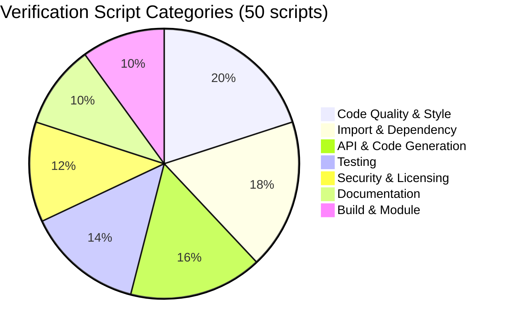
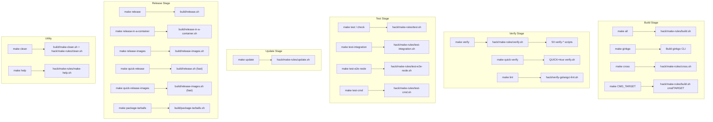

# Tooling and Process Assessment

## Document Metadata

| Field | Value |
|-------|-------|
| **Document ID** | 07_TOOLING_AND_PROCESS |
| **Category** | Tooling |
| **Finding ID Prefix** | TOOL-NNN |
| **Risk Rating** | Medium |
| **Last Analyzed** | Based on repository state at Go 1.25.0, golangci-lint v2 configuration |

---

## 1. Scope

This document inventories all observable tooling, CI/CD pipeline stages, verification scripts, dependency management, and process infrastructure across the Kubernetes main repository (`k8s.io/kubernetes`).

**Directories Analyzed:**

| Directory | Contents | File Count |
|-----------|----------|------------|
| `hack/` | Verification scripts, update scripts, library scripts, build helpers | 50 verify scripts, 19 update scripts, make-rules, lib/ |
| `build/` | Build scripts, dependency manifest, container image packaging | dependencies.yaml, common.sh, README.md, Dockerfiles |
| `.github/` | Issue templates, PR template, security policy, OWNERS | 8 files total |
| `Makefile` | Root build orchestration with 19 phony targets | 517 lines |
| `go.mod` | Go module manifest with dependency declarations | 260 lines |
| `.gitattributes` | Repository attribute configuration, linguist-generated markers | 14 lines |

**Explicit Limitations:**
- This is a read-only documentation exercise; no tooling configuration was modified.
- CI/CD runtime behavior is inferred from configuration files and scripts; actual Prow job definitions are maintained externally.
- Coverage thresholds and runtime metrics are not observable from static analysis of the repository alone.

---

## 2. Tooling Inventory

### 2.1 golangci-lint

| Property | Value |
|----------|-------|
| **Tool** | golangci-lint |
| **Configuration Format** | v2 (YAML) |
| **Permissive Config** | `hack/golangci.yaml` (512 lines) |
| **Stricter Config** | `hack/golangci-hints.yaml` (426 lines) |
| **Template Source** | `hack/golangci.yaml.in` (340 lines) |
| **Config Generator** | `hack/update-golangci-lint-config.sh` |
| **Config Verifier** | `hack/verify-golangci-lint-config.sh` |
| **Verification Script** | `hack/verify-golangci-lint.sh` (248 lines) |
| **PR Hints Script** | `hack/verify-golangci-lint-pr-hints.sh` |
| **Timeout** | 30 minutes |
| **Relative Path Mode** | `gomod` |
| **Max Issues** | Unlimited (`max-issues-per-linter: 0`, `max-same-issues: 0`) |
| **Excluded Paths** | `third_party` |
| **Makefile Target** | `make lint` |

**Tiered Configuration Strategy:**

Both `golangci.yaml` and `golangci-hints.yaml` are generated from a single template `golangci.yaml.in` using Go template processing via `hack/update-golangci-lint-config.sh`. The template uses conditional blocks (`{{- if .Base}}`, `{{- if .Hints}}`) to produce two distinct configurations:

- **Base tier** (`golangci.yaml`): Uses `default: none` (only explicitly enabled linters run). Includes extensive exclusion rules for existing code patterns. This is the CI gate configuration — all existing code must pass.
- **Hints tier** (`golangci-hints.yaml`): Uses `default: standard` (includes Go standard linters by default). Adds `errorlint` and `usestdlibvars` linters. Reduces staticcheck exclusions. Adds `gomega.BeTrue`/`gomega.BeFalse` to forbidigo. Results are advisory — developers and reviewers decide whether to address findings.

Source: `hack/golangci.yaml.in:155` — `default: {{if .Base -}} none {{- else -}} standard {{- end}}`

**Enabled Linters (Base Tier — `golangci.yaml`):**

| Linter | Purpose |
|--------|---------|
| `depguard` | Dependency usage restrictions (e.g., `go-cmp` only in tests) |
| `forbidigo` | Forbidden API pattern detection (md5, managedFields, unversioned feature gates) |
| `ginkgolinter` | Ginkgo/Gomega test assertion best practices |
| `gocritic` | Code pattern analysis (boolExprSimplify, equalFold enabled; 10 checks disabled) |
| `govet` | Go standard static analysis |
| `ineffassign` | Detection of ineffectual assignments |
| `kubeapilinter` | Kubernetes API conventions enforcement (commentstart, conditions, conflictingmarkers, ssatags, duplicatemarkers) |
| `logcheck` | Structured/contextual logging enforcement (custom plugin from `k8s.io/logtools/logcheck`) |
| `revive` | Go linter with `exported` rule (stuttering check disabled) |
| `sorted` | Feature gate sorting enforcement (custom plugin) |
| `staticcheck` | Advanced static analysis (with extensive exclusion list — see §8) |
| `testifylint` | Testify assertion best practices (9 checks disabled in base) |
| `unused` | Detection of unused code |

**Additional Linters in Hints Tier:**

| Linter | Purpose |
|--------|---------|
| `errorlint` | Error wrapping and comparison best practices |
| `usestdlibvars` | Encourages use of standard library variables and constants |

**Custom Plugins:**

Three custom golangci-lint plugins are built from source and loaded as shared objects:

| Plugin | Binary Path | Source | Purpose |
|--------|-------------|--------|---------|
| `logcheck` | `_output/local/bin/logcheck.so` | `k8s.io/logtools/logcheck` | Structured logging enforcement |
| `sorted` | `_output/local/bin/sorted.so` | `k8s.io/kubernetes/hack/tools/golangci-lint/sorted` | Feature gate sorting |
| `kube-api-linter` | `_output/local/bin/kube-api-linter.so` | `sigs.k8s.io/kube-api-linter` | Kubernetes API convention linting |

Source: `hack/verify-golangci-lint.sh:132-140`

### 2.2 gofmt

| Property | Value |
|----------|-------|
| **Tool** | gofmt (Go standard formatter) |
| **Version** | Go 1.25.0 standard toolchain |
| **Verification Script** | `hack/verify-gofmt.sh` (60 lines) |
| **Update Script** | `hack/update-gofmt.sh` |
| **Coverage** | All `.go` files excluding `.git`, `_output`, `release`, `target`, `third_party/*`, `vendor/*`, `testdata/*`, `bindata.go` |
| **Mode** | Diff mode with simplification (`gofmt -d -s`) |

Source: `hack/verify-gofmt.sh:35-48` — The `find_files()` function defines the exclusion patterns.

### 2.3 go vet

| Property | Value |
|----------|-------|
| **Tool** | go vet (Go standard static analyzer) |
| **Integration** | Integrated via golangci-lint as the `govet` linter |
| **Standalone Script** | Not separately invoked; runs as part of golangci-lint |
| **Exclusions** | `lostcancel` and `printf` findings excluded in base tier |

Source: `hack/golangci.yaml:119-121` — govet exclusion rule for `lostcancel|printf`.

### 2.4 Type Checker

| Property | Value |
|----------|-------|
| **Tool** | Custom type checker (`test/typecheck`) |
| **Verification Script** | `hack/verify-typecheck.sh` (49 lines) |
| **Coverage** | Entire Go workspace (all modules) |
| **Mode** | Cross-platform type checking |
| **Serial Mode** | Configurable via `TYPECHECK_SERIAL` environment variable |

Source: `hack/verify-typecheck.sh:43` — `go run ./test/typecheck "$@" "--serial=$TYPECHECK_SERIAL"`

### 2.5 Import Enforcement Tools

| Tool | Script | Purpose |
|------|--------|---------|
| **import-boss** | `hack/verify-import-boss.sh` | Enforces `.import-restrictions` files per directory; checks all imports against defined rules |
| **import-aliases** | `hack/verify-import-aliases.sh` | Verifies import alias naming conventions |
| **imports** | `hack/verify-imports.sh` | Checks import pattern compliance |
| **internal-modules** | `hack/verify-internal-modules.sh` | Ensures module boundary compliance |
| **preferred imports** | `cmd/preferredimports/` | Enforces preferred import paths |
| **import verifier** | `cmd/importverifier/` | Verifies import correctness |

Source: `hack/verify-import-boss.sh:33-40` — Uses `go run ./cmd/import-boss` with workspace-wide package resolution.

### 2.6 Security and Vulnerability Tools

| Tool | Script | Purpose |
|------|--------|---------|
| **govulncheck** | `hack/verify-govulncheck.sh` | Go vulnerability database scanning via `golang.org/x/vuln/cmd/govulncheck@v1.1.4`; compares HEAD against PR base branch |
| **shellcheck** | `hack/verify-shellcheck.sh` | Static analysis of shell scripts |
| **netparse-cve** | `hack/verify-netparse-cve.sh` | CVE-specific network parsing verification |
| **vendor-licenses** | `hack/verify-vendor-licenses.sh` | Vendor license compliance checking |
| **licenses** | `hack/verify-licenses.sh` | Repository-wide license compliance |

Source: `hack/verify-govulncheck.sh:30` — `go install golang.org/x/vuln/cmd/govulncheck@v1.1.4`

### 2.7 Code Quality and Convention Tools

| Tool | Script | Purpose |
|------|--------|---------|
| **boilerplate checker** | `hack/verify-boilerplate.sh` | License header compliance via `hack/boilerplate/boilerplate.py` |
| **spelling checker** | `hack/verify-spelling.sh` | Spelling verification in code and documentation |
| **flags-underscore** | `hack/verify-flags-underscore.py` | CLI flag naming convention enforcement (Python script) |
| **pkg-names** | `hack/verify-pkg-names.sh` | Go package naming convention verification |
| **owners-fmt** | `hack/verify-owners-fmt.sh` | OWNERS file formatting verification |
| **file-sizes** | `hack/verify-file-sizes.sh` | Large file detection |

### 2.8 API and Code Generation Tools

| Tool | Script | Purpose |
|------|--------|---------|
| **codegen** | `hack/verify-codegen.sh` / `hack/update-codegen.sh` | Code generation freshness verification |
| **openapi-spec** | `hack/verify-openapi-spec.sh` / `hack/update-openapi-spec.sh` | OpenAPI specification freshness |
| **generated-docs** | `hack/verify-generated-docs.sh` / `hack/update-generated-docs.sh` | Documentation generation freshness |
| **generated-stable-metrics** | `hack/verify-generated-stable-metrics.sh` / `hack/update-generated-stable-metrics.sh` | Stable metrics definition freshness |
| **api-groups** | `hack/verify-api-groups.sh` | API group registration consistency |
| **openapi-docs-urls** | `hack/verify-openapi-docs-urls.sh` | OpenAPI documentation URL validity |

### 2.9 Dead Code and Binary Analysis

| Tool | Script | Purpose |
|------|--------|---------|
| **deadcode elimination** | `hack/verify-deadcode-elimination.sh` | Verifies Go linker eliminates dead code in key binaries (`kube-apiserver`, `kubelet`, `kube-controller-manager`, `kube-scheduler`, `kube-proxy`) using `whydeadcode` |

Source: `hack/verify-deadcode-elimination.sh:43` — `BINARIES=("kube-apiserver" "kubelet" "kube-controller-manager" "kube-scheduler" "kube-proxy")`

### 2.10 Test Infrastructure Tools

| Tool | Script | Purpose |
|------|--------|---------|
| **test-code** | `hack/verify-test-code.sh` | Test code convention verification |
| **test-featuregates** | `hack/verify-test-featuregates.sh` | Test feature gate usage verification |
| **test-images** | `hack/verify-test-images.sh` | Test image reference verification |
| **testing-import** | `hack/verify-testing-import.sh` | Testing package import rule enforcement |
| **e2e-images** | `hack/verify-e2e-images.sh` | E2E test image reference verification |
| **e2e-test-ownership** | `hack/verify-e2e-test-ownership.sh` | E2E test owner tracking verification |
| **conformance** | `hack/verify-conformance-requirements.sh`, `hack/verify-conformance-yaml.sh` | Conformance test requirements and data |
| **mocks** | `hack/verify-mocks.sh` / `hack/update-mocks.sh` | Generated mock freshness |

### 2.11 Dependency and Vendoring Tools

| Tool | Script | Purpose |
|------|--------|---------|
| **vendor** | `hack/verify-vendor.sh` / `hack/update-vendor.sh` | Vendor directory freshness |
| **external-dependencies-version** | `hack/verify-external-dependencies-version.sh` | External dependency version verification via zeitgeist |
| **no-vendor-cycles** | `hack/verify-no-vendor-cycles.sh` | Circular vendor dependency detection |
| **staging-meta-files** | `hack/verify-staging-meta-files.sh` | Staging module metadata verification |
| **publishing-bot** | `hack/verify-publishing-bot.sh` | Publishing bot configuration verification |

### 2.12 Feature and Lifecycle Tools

| Tool | Script | Purpose |
|------|--------|---------|
| **featuregates** | `hack/verify-featuregates.sh` / `hack/update-featuregates.sh` | Feature gate lifecycle verification |
| **prerelease-lifecycle-tags** | `hack/verify-prerelease-lifecycle-tags.sh` | Prerelease lifecycle tag verification |
| **prometheus-imports** | `hack/verify-prometheus-imports.sh` | Prometheus import pattern verification |
| **non-mutating-validation** | `hack/verify-non-mutating-validation.sh` | Non-mutating validation enforcement |
| **readonly-packages** | `hack/verify-readonly-packages.sh` | Package modification protection |

---

## 3. Verification Script Inventory

The repository contains **50 verification scripts** (49 shell scripts and 1 Python script) under `hack/verify-*`, plus an orchestrator. These form the primary quality gate infrastructure.

### 3.1 Complete Script Catalog

| # | Script | Purpose | What It Checks | Failure Impact |
|---|--------|---------|----------------|----------------|
| 1 | `verify-all.sh` | Orchestrator | Redirects to `make verify` | CI gate |
| 2 | `verify-api-groups.sh` | API consistency | API group registration correctness | API breakage |
| 3 | `verify-boilerplate.sh` | License headers | Apache 2.0 header compliance via `boilerplate.py` | Legal risk |
| 4 | `verify-cli-conventions.sh` | CLI consistency | kubectl command tree conventions | UX inconsistency |
| 5 | `verify-codegen.sh` | Generated code | Code generation freshness (types, clients, informers) | Stale types |
| 6 | `verify-conformance-requirements.sh` | Conformance | Test conformance requirements | Conformance gaps |
| 7 | `verify-conformance-yaml.sh` | Conformance | YAML conformance data freshness | Conformance data |
| 8 | `verify-deadcode-elimination.sh` | Dead code | Go linker dead code elimination in 5 key binaries | Binary bloat |
| 9 | `verify-description.sh` | Descriptions | API descriptions completeness | Documentation gaps |
| 10 | `verify-e2e-images.sh` | E2E images | Test image reference correctness | Test failures |
| 11 | `verify-e2e-test-ownership.sh` | Test ownership | E2E test owner tracking | Orphaned tests |
| 12 | `verify-external-dependencies-version.sh` | Dependencies | External dep versions via zeitgeist | Version drift |
| 13 | `verify-featuregates.sh` | Feature gates | Feature gate lifecycle correctness | Gate mismanagement |
| 14 | `verify-fieldname-docs.sh` | Field docs | API field documentation completeness | Doc inconsistency |
| 15 | `verify-file-sizes.sh` | File sizes | Large file detection | Binary/generated concerns |
| 16 | `verify-flags-underscore.py` | Flag naming | CLI flag naming conventions (Python) | Inconsistent flags |
| 17 | `verify-generated-docs.sh` | Generated docs | Doc generation freshness | Stale docs |
| 18 | `verify-generated-stable-metrics.sh` | Metrics | Stable metrics definition freshness | Metric tracking |
| 19 | `verify-gofmt.sh` | Formatting | Go source formatting compliance | Style inconsistency |
| 20 | `verify-golangci-lint.sh` | Linting | Lint rule compliance (primary CI gate) | Code quality |
| 21 | `verify-golangci-lint-config.sh` | Lint config | Config template synchronization | Config drift |
| 22 | `verify-golangci-lint-pr-hints.sh` | PR linting | PR-specific lint hints (advisory) | PR quality |
| 23 | `verify-govulncheck.sh` | Vulnerabilities | Go vulnerability database scan | Security risk |
| 24 | `verify-import-aliases.sh` | Import style | Import alias convention compliance | Style inconsistency |
| 25 | `verify-import-boss.sh` | Import rules | Import boundary enforcement via `.import-restrictions` | Architecture violation |
| 26 | `verify-imports.sh` | Import patterns | Import pattern compliance | Dependency violation |
| 27 | `verify-internal-modules.sh` | Internal modules | Module boundary compliance | Module leak |
| 28 | `verify-licenses.sh` | Licensing | License compliance across repository | Legal risk |
| 29 | `verify-mocks.sh` | Mock freshness | Generated mock freshness | Test inconsistency |
| 30 | `verify-netparse-cve.sh` | Network parsing | CVE-specific network parsing safety | Security risk |
| 31 | `verify-no-vendor-cycles.sh` | Vendor cycles | Circular vendor dependency detection | Build failure |
| 32 | `verify-non-mutating-validation.sh` | Validation | Non-mutating validation enforcement | Mutation bugs |
| 33 | `verify-openapi-docs-urls.sh` | OpenAPI | OpenAPI documentation URL validity | Broken links |
| 34 | `verify-openapi-spec.sh` | OpenAPI | OpenAPI specification freshness | Stale API spec |
| 35 | `verify-owners-fmt.sh` | OWNERS | OWNERS file formatting correctness | Ownership confusion |
| 36 | `verify-pkg-names.sh` | Package names | Go package naming convention compliance | Style inconsistency |
| 37 | `verify-prerelease-lifecycle-tags.sh` | Lifecycle | Prerelease lifecycle tag correctness | Lifecycle tracking |
| 38 | `verify-prometheus-imports.sh` | Prometheus | Prometheus import pattern compliance | Metric inconsistency |
| 39 | `verify-publishing-bot.sh` | Publishing | Publishing bot configuration correctness | Publishing failure |
| 40 | `verify-readonly-packages.sh` | Readonly | Package modification protection | Unauthorized changes |
| 41 | `verify-shellcheck.sh` | Shell scripts | Shell script quality via shellcheck | Script bugs |
| 42 | `verify-spelling.sh` | Spelling | Spelling correctness in code/docs | Typos |
| 43 | `verify-staging-meta-files.sh` | Staging | Staging module metadata correctness | Module inconsistency |
| 44 | `verify-test-code.sh` | Test code | Test code convention compliance | Test quality |
| 45 | `verify-test-featuregates.sh` | Test gates | Test feature gate usage correctness | Test reliability |
| 46 | `verify-test-images.sh` | Test images | Test image reference correctness | Test environment |
| 47 | `verify-testing-import.sh` | Testing imports | Testing package import rule enforcement | Test isolation |
| 48 | `verify-typecheck.sh` | Type checking | Cross-platform Go type checking | Build failure |
| 49 | `verify-vendor-licenses.sh` | Vendor licenses | Vendor license compliance | Legal risk |
| 50 | `verify-vendor.sh` | Vendor | Vendor directory freshness | Build inconsistency |

### 3.2 Update Script Catalog

The repository contains **19 update scripts** under `hack/update-*` that generate or regenerate artifacts verified by corresponding verify scripts:

| # | Script | Purpose | Corresponding Verify Script |
|---|--------|---------|---------------------------|
| 1 | `update-all.sh` | Orchestrator (redirects to `make update`) | `verify-all.sh` |
| 2 | `update-codegen.sh` | Regenerate generated code | `verify-codegen.sh` |
| 3 | `update-conformance-yaml.sh` | Regenerate conformance YAML | `verify-conformance-yaml.sh` |
| 4 | `update-featuregates.sh` | Regenerate feature gate definitions | `verify-featuregates.sh` |
| 5 | `update-generated-api-compatibility-data.sh` | Regenerate API compatibility data | — |
| 6 | `update-generated-docs.sh` | Regenerate documentation | `verify-generated-docs.sh` |
| 7 | `update-generated-stable-metrics.sh` | Regenerate stable metrics | `verify-generated-stable-metrics.sh` |
| 8 | `update-gofmt.sh` | Apply gofmt formatting | `verify-gofmt.sh` |
| 9 | `update-golangci-lint-config.sh` | Regenerate lint configs from template | `verify-golangci-lint-config.sh` |
| 10 | `update-import-aliases.sh` | Update import aliases | `verify-import-aliases.sh` |
| 11 | `update-internal-modules.sh` | Update internal module definitions | `verify-internal-modules.sh` |
| 12 | `update-kustomize.sh` | Update kustomize assets | — |
| 13 | `update-mocks.sh` | Regenerate mock implementations | `verify-mocks.sh` |
| 14 | `update-netparse-cve.sh` | Update network parsing CVE data | `verify-netparse-cve.sh` |
| 15 | `update-openapi-spec.sh` | Regenerate OpenAPI specification | `verify-openapi-spec.sh` |
| 16 | `update-owners-fmt.sh` | Reformat OWNERS files | `verify-owners-fmt.sh` |
| 17 | `update-translations.sh` | Update translations | — |
| 18 | `update-vendor-licenses.sh` | Update vendor license documentation | `verify-vendor-licenses.sh` |
| 19 | `update-vendor.sh` | Update vendor directory | `verify-vendor.sh` |

### 3.3 Verification Script Category Distribution



**Category Breakdown:**

| Category | Count | Scripts |
|----------|-------|---------|
| Code Quality & Style | 10 | gofmt, golangci-lint (×3), pkg-names, flags-underscore, spelling, file-sizes, deadcode-elimination, shellcheck |
| Import & Dependency | 9 | import-boss, import-aliases, imports, internal-modules, vendor, vendor-licenses, no-vendor-cycles, external-dependencies-version, publishing-bot |
| API & Code Generation | 8 | codegen, api-groups, openapi-spec, openapi-docs-urls, description, generated-stable-metrics, non-mutating-validation, prerelease-lifecycle-tags |
| Testing | 7 | test-code, test-featuregates, test-images, testing-import, e2e-images, e2e-test-ownership, conformance (×2) |
| Security & Licensing | 6 | govulncheck, licenses, vendor-licenses, netparse-cve, boilerplate, owners-fmt |
| Documentation | 5 | generated-docs, fieldname-docs, cli-conventions, readonly-packages, staging-meta-files |
| Build & Module | 5 | typecheck, verify-all, featuregates, conformance-yaml, prometheus-imports |

---

## 4. CI/CD Pipeline Assessment

### 4.1 Makefile Build Orchestration

The root `Makefile` (517 lines) provides 19 phony targets organized into distinct pipeline stages:



**Makefile Configuration Details:**

| Setting | Value | Source |
|---------|-------|--------|
| Shell | `/usr/bin/env bash -o errexit -o pipefail -o nounset` | `Makefile:33` |
| BASH_ENV | `./hack/lib/logging.sh` | `Makefile:34` |
| Verbosity | `KUBE_VERBOSE ?= 1` | `Makefile:65` |
| Output directory | `_output` | `Makefile:51` |
| Built-in rules | Disabled (`--no-builtin-rules`) | `Makefile:44` |
| Undefined variables | Warned (`--warn-undefined-variables`) | `Makefile:46` |
| Help system | `PRINT_HELP` variable gates help output for each target | `Makefile:38` |

Source: `Makefile:32-47`

### 4.2 Build Subsystem (`hack/make-rules/`)

The `hack/make-rules/` directory contains 10 scripts implementing the actual build operations:

| Script | Purpose | Invoked By |
|--------|---------|-----------|
| `build.sh` | Compile Go binaries | `make all`, `make CMD_TARGET` |
| `clean.sh` | Clean build artifacts | `make clean` |
| `cross.sh` | Cross-compile for all platforms | `make cross` |
| `make-help.sh` | Display help information | `make help` |
| `test.sh` | Run unit tests | `make test` / `make check` |
| `test-cmd.sh` | Run CLI tests | `make test-cmd` |
| `test-e2e-node.sh` | Run node E2E tests | `make test-e2e-node` |
| `test-integration.sh` | Run integration tests | `make test-integration` |
| `update.sh` | Run all update scripts | `make update` |
| `verify.sh` | Run all verify scripts | `make verify` |

### 4.3 External CI Infrastructure

| Observation | Evidence | Inference Flag |
|-------------|----------|----------------|
| No GitHub Actions workflow files found in `.github/` | `.github/` contains only: `ISSUE_TEMPLATE/`, `OWNERS`, `PULL_REQUEST_TEMPLATE.md`, `SECURITY.md` | CONFIRMED |
| CI is managed by Prow/external infrastructure | `hack/verify-golangci-lint.sh:93-94` references "Prow log viewer" and "Spyglass"; PR template references external CI workflows | INFERRED |
| Prow job definitions maintained externally | No `.prow.yaml` or `prow/` directory in repository | INFERRED |
| CI system invokes `make verify` as presubmit gate | `hack/verify-all.sh:18` states "it is equivalent to `make verify`" | CONFIRMED |

Source: `hack/verify-golangci-lint.sh:93` — "Prow log viewer ('error' is a key word there)"

### 4.4 GitHub Configuration

| File | Purpose | Key Content |
|------|---------|-------------|
| `.github/ISSUE_TEMPLATE/bug-report.yaml` | Bug report template | Structured YAML form |
| `.github/ISSUE_TEMPLATE/config.yml` | Issue template config | Template chooser configuration |
| `.github/ISSUE_TEMPLATE/enhancement.yaml` | Enhancement template | Enhancement proposal form |
| `.github/ISSUE_TEMPLATE/failing-test.yaml` | Failing test template | Test failure reporting form |
| `.github/ISSUE_TEMPLATE/flaking-test.yaml` | Flaking test template | Flaky test reporting form |
| `.github/OWNERS` | Ownership | GitHub directory ownership |
| `.github/PULL_REQUEST_TEMPLATE.md` | PR template | Kind labels, tests/signoff prompts, release notes block |
| `.github/SECURITY.md` | Security policy | Vulnerability reporting instructions with links to kubernetes.io |

Source: `.github/PULL_REQUEST_TEMPLATE.md:1-82`

---

## 5. Missing Tooling Assessment

### 5.1 Pre-commit Hooks

| Field | Value |
|-------|-------|
| **Finding ID** | TOOL-001 |
| **Category** | Tooling |
| **Title** | No pre-commit hook framework detected |
| **Source Location** | Repository root (absence of `.pre-commit-config.yaml`, `.husky/`, `lefthook.yml`) |
| **Description** | The repository root does not contain any pre-commit hook framework configuration. No `.pre-commit-config.yaml` (pre-commit framework), `.husky/` directory (Husky), or `lefthook.yml` (Lefthook) was found. Quality gates are enforced only at the CI level via `make verify`, not at developer commit time. |
| **Evidence** | `ls .pre-commit-config.yaml .husky lefthook.yml 2>&1` returns "No such file or directory" for all three paths. |
| **Impact** | Developers may push code that fails CI checks, resulting in slower feedback loops and wasted CI resources. Issues are caught only after push, not before commit. |
| **Inference Flag** | INFERRED — Absence of configuration files does not guarantee pre-commit hooks are not enforced through other mechanisms (e.g., individual developer setups or Git template hooks), but no repository-level configuration was observed. |
| **Recommendation Ref** | `08_IMPROVEMENT_ROADMAP.md` § Tooling Enhancement Recommendations |

### 5.2 GitHub Actions Workflows

| Field | Value |
|-------|-------|
| **Finding ID** | TOOL-002 |
| **Category** | Tooling |
| **Title** | No GitHub Actions workflow files present; CI managed externally |
| **Source Location** | `.github/` directory |
| **Description** | The `.github/` directory contains issue templates, a PR template, OWNERS, and a security policy, but no GitHub Actions workflow files (`.github/workflows/*.yml`). The Kubernetes project uses Prow (a Kubernetes-native CI/CD system) for its CI infrastructure, which is configured externally to this repository. |
| **Evidence** | `.github/` contents: `ISSUE_TEMPLATE/`, `OWNERS`, `PULL_REQUEST_TEMPLATE.md`, `SECURITY.md`. `hack/verify-golangci-lint.sh:93` references "Prow log viewer" and "Spyglass" for CI output formatting. |
| **Impact** | CI configuration is not co-located with the codebase, making it harder for contributors to understand the full CI pipeline from the repository alone. However, this is an intentional architectural choice for the Kubernetes project given the scale and complexity of its CI requirements. |
| **Inference Flag** | CONFIRMED — GitHub Actions absence is directly observed. Prow usage is INFERRED from script comments referencing Prow-specific tooling. |
| **Recommendation Ref** | `08_IMPROVEMENT_ROADMAP.md` § Tooling Enhancement Recommendations |

### 5.3 Code Coverage Reporting Configuration

| Field | Value |
|-------|-------|
| **Finding ID** | TOOL-003 |
| **Category** | Tooling |
| **Title** | No in-repository code coverage reporting configuration detected |
| **Source Location** | Repository root (absence of `codecov.yml`, `.codecov.yml`, `coveralls.yml`, `.coveragerc`) |
| **Description** | No code coverage reporting tool configuration was found in the repository. The `Makefile` supports coverage collection via `KUBE_COVER=y` flag on the `make test` target, but no threshold configuration, coverage reporting service integration, or coverage trend tracking configuration is present in the repository. |
| **Evidence** | `Makefile:177` documents `KUBE_COVER: Whether to run tests with code coverage. Set to 'y' to enable coverage collection.` No `codecov.yml`, `.codecov.yml`, `coveralls.yml`, or `.coveragerc` files exist at the repository root. |
| **Impact** | Coverage trends are not automatically tracked or enforced. Without coverage thresholds, regressions in test coverage may go unnoticed until they become systemic. |
| **Inference Flag** | INFERRED — Coverage reporting may be configured in the external Prow CI infrastructure. The absence of in-repository configuration does not preclude external coverage tracking. |
| **Recommendation Ref** | `08_IMPROVEMENT_ROADMAP.md` § Tooling Enhancement Recommendations |

### 5.4 Dependency Update Automation

| Field | Value |
|-------|-------|
| **Finding ID** | TOOL-004 |
| **Category** | Tooling |
| **Title** | No automated dependency update tooling (Dependabot/Renovate) configuration detected |
| **Source Location** | Repository root (absence of `.github/dependabot.yml`, `renovate.json`) |
| **Description** | No Dependabot or Renovate configuration file was found. External dependency versions are tracked in `build/dependencies.yaml` using zeitgeist v0.5.4, and verified by `hack/verify-external-dependencies-version.sh`. The `go.mod` file pins 31 staging module replace directives to in-tree paths. Vendor updates are managed via `hack/update-vendor.sh`. However, automated dependency update proposals (PRs for new versions) are not configured in-repository. |
| **Evidence** | `build/dependencies.yaml:1-17` documents zeitgeist as the version verification tool. No `.github/dependabot.yml` or `renovate.json` exists. |
| **Impact** | Dependency updates require manual tracking and initiation. New versions of direct or transitive dependencies may not be picked up in a timely manner, potentially missing security patches or performance improvements. |
| **Inference Flag** | INFERRED — Automated dependency updates may be managed by the Kubernetes release engineering team through external tooling not visible in this repository. |
| **Recommendation Ref** | `08_IMPROVEMENT_ROADMAP.md` § Tooling Enhancement Recommendations |

### 5.5 Complexity Analysis Tooling

| Field | Value |
|-------|-------|
| **Finding ID** | TOOL-005 |
| **Category** | Tooling |
| **Title** | No cyclomatic or cognitive complexity measurement tooling configured |
| **Source Location** | `hack/golangci.yaml` (absence of `gocyclo`, `gocognit`, `cyclop` linters) |
| **Description** | The golangci-lint configuration does not enable complexity measurement linters such as `gocyclo` (cyclomatic complexity), `gocognit` (cognitive complexity), or `cyclop` (comprehensive complexity analysis). Function complexity is not systematically measured or enforced. |
| **Evidence** | `hack/golangci.yaml:178-191` lists enabled linters; none of `gocyclo`, `gocognit`, or `cyclop` appear. `hack/golangci-hints.yaml:166-182` also does not include these linters. |
| **Impact** | High-complexity functions can be introduced without automated detection. This contributes to maintainability risk, especially in large modules like `pkg/kubelet/` (675 files) and `pkg/controller/` (540 files). |
| **Inference Flag** | CONFIRMED — Direct inspection of both golangci-lint configurations confirms these linters are not enabled. |
| **Recommendation Ref** | `08_IMPROVEMENT_ROADMAP.md` § Tooling Enhancement Recommendations |

### 5.6 Duplicate Code Detection

| Field | Value |
|-------|-------|
| **Finding ID** | TOOL-006 |
| **Category** | Tooling |
| **Title** | No duplicate code detection tooling configured |
| **Source Location** | `hack/golangci.yaml` (absence of `dupl` linter) |
| **Description** | Neither the base nor hints golangci-lint configuration enables the `dupl` linter for detecting code duplication. No standalone duplicate code detection tool (such as `jscpd` or `flay`) is configured in the repository. |
| **Evidence** | `hack/golangci.yaml:178-191` does not list `dupl` among enabled linters. No standalone duplication detection tool configuration exists. |
| **Impact** | Code duplication across the 12,272 Go source files may go undetected, increasing maintenance burden and divergence risk when patterns are updated inconsistently. |
| **Inference Flag** | CONFIRMED — Direct inspection confirms `dupl` is not enabled in either golangci-lint configuration. |
| **Recommendation Ref** | `08_IMPROVEMENT_ROADMAP.md` § Tooling Enhancement Recommendations |

---

## 6. Dependency Management Analysis

### 6.1 Go Module Configuration

| Property | Value | Source |
|----------|-------|--------|
| Module path | `k8s.io/kubernetes` | `go.mod:7` |
| Go version | `1.25.0` | `go.mod:9` |
| Go debug default | `go1.25` | `go.mod:11` |
| Direct dependencies | 112 (first `require` block) | `go.mod:13-125` |
| Indirect dependencies | 98 (second `require` block) | `go.mod:127-225` |
| Staging replace directives | 31 modules | `go.mod:227-259` |

### 6.2 Staging Module Architecture

The repository uses an in-tree staging pattern where 31 Kubernetes sub-modules are developed in `staging/src/k8s.io/` and published as independent modules. The root `go.mod` uses `replace` directives to point to local staging paths:

```
replace (
    k8s.io/api => ./staging/src/k8s.io/api
    k8s.io/apimachinery => ./staging/src/k8s.io/apimachinery
    k8s.io/apiserver => ./staging/src/k8s.io/apiserver
    k8s.io/client-go => ./staging/src/k8s.io/client-go
    ... (31 total)
)
```

Source: `go.mod:227-259`

| Field | Value |
|-------|-------|
| **Finding ID** | TOOL-007 |
| **Category** | Tooling |
| **Title** | 31 staging module replace directives create dual-module architecture |
| **Source Location** | `go.mod:227-259` |
| **Description** | The root `go.mod` contains 31 `replace` directives pointing staging modules (e.g., `k8s.io/api`, `k8s.io/client-go`, `k8s.io/apimachinery`) to local paths under `staging/src/k8s.io/`. This is an intentional architecture enabling in-tree development with external publishing, but it creates a dual-module nature where dependency resolution behaves differently inside vs. outside the monorepo. |
| **Evidence** | `go.mod:227` — `k8s.io/api => ./staging/src/k8s.io/api` through `go.mod:258` — `k8s.io/sample-controller => ./staging/src/k8s.io/sample-controller` |
| **Impact** | Contributors must understand the replace directive mechanism to correctly manage dependencies. Tooling that resolves modules by standard `go.mod` semantics may behave unexpectedly. The `hack/verify-staging-meta-files.sh` and `hack/verify-publishing-bot.sh` scripts exist specifically to manage this complexity. |
| **Inference Flag** | CONFIRMED |
| **Recommendation Ref** | `08_IMPROVEMENT_ROADMAP.md` § Dependency Management |

### 6.3 External Dependency Version Management

External dependency versions are tracked in `build/dependencies.yaml` (274 lines) using the zeitgeist version verification framework:

| Dependency | Version | Verification |
|------------|---------|-------------|
| zeitgeist | v0.5.4 | Self-referencing pin in `hack/verify-external-dependencies-version.sh` |
| CNI plugins | 1.8.0 | Referenced in cluster config, test utilities, local-up scripts |
| CoreDNS | 1.13.1 | Referenced in cluster addons and kubeadm constants |
| CRI Tools (crictl) | 1.34.0 | Referenced in cluster configuration |
| protoc | 23.4 | Referenced in `hack/lib/protoc.sh` |
| etcd | 3.6.5 | Referenced in manifests, kubeadm constants, test utilities |
| Go upstream | 1.25.4 | Referenced in `.go-version` and publishing rules |
| node-problem-detector | 1.34.0 | Referenced in test images and cluster addons |

Source: `build/dependencies.yaml:1-110`

| Field | Value |
|-------|-------|
| **Finding ID** | TOOL-008 |
| **Category** | Tooling |
| **Title** | Zeitgeist dependency manifest provides robust version pinning with cross-file reference validation |
| **Source Location** | `build/dependencies.yaml:1-274` |
| **Description** | The `build/dependencies.yaml` file uses zeitgeist v0.5.4 format to declare expected versions of external dependencies and specify `refPaths` — exact file paths and regex patterns where those versions should appear. The `hack/verify-external-dependencies-version.sh` script validates that all referenced files contain the expected version strings. This is a mature, well-structured approach to dependency version consistency. |
| **Evidence** | Each dependency entry includes `name`, `version`, and a list of `refPaths` with `path` and `match` regex. Example: `build/dependencies.yaml:66-80` for etcd pinning across 6 files. |
| **Impact** | Positive — this mechanism prevents version drift across configuration files, test fixtures, and documentation. However, it only tracks a subset of all dependencies; Go module dependencies are managed separately via `go.mod`. |
| **Inference Flag** | CONFIRMED |
| **Recommendation Ref** | `08_IMPROVEMENT_ROADMAP.md` § Dependency Management |

### 6.4 Vendor Management

| Process | Script | Purpose |
|---------|--------|---------|
| Vendor update | `hack/update-vendor.sh` | Regenerates `vendor/` directory from `go.mod` |
| Vendor verification | `hack/verify-vendor.sh` | Verifies vendor directory is up-to-date |
| Vendor cycle check | `hack/verify-no-vendor-cycles.sh` | Detects circular dependencies in vendor tree |
| Vendor license check | `hack/verify-vendor-licenses.sh` / `hack/update-vendor-licenses.sh` | License compliance for vendored code |
| Dependency pinning | `hack/pin-dependency.sh` | Pin specific dependency versions |

Source: `go.mod:3-5` — "Run hack/pin-dependency.sh to change pinned dependency versions. Run hack/update-vendor.sh to update go.mod files and the vendor directory."

---

## 7. Process Infrastructure Analysis

### 7.1 Repository Attribute Configuration

The `.gitattributes` file (14 lines) configures:

| Setting | Purpose | Source |
|---------|---------|--------|
| `* text=auto eol=lf` | Enforce LF line endings for all text files | `.gitattributes:2` |
| `hack/verify-flags/known-flags.txt merge=union` | Union merge strategy for known flags | `.gitattributes:4` |
| `test/test_owners.csv merge=union` | Union merge strategy for test ownership | `.gitattributes:5` |
| `**/zz_generated.*.go linguist-generated=true` | Mark generated Go files for GitHub stats | `.gitattributes:7` |
| `**/types.generated.go linguist-generated=true` | Mark generated type files | `.gitattributes:8` |
| `**/generated.pb.go linguist-generated=true` | Mark protobuf generated files | `.gitattributes:9` |
| `**/types_swagger_doc_generated.go linguist-generated=true` | Mark swagger doc generated files | `.gitattributes:11` |
| `api/openapi-spec/*.json linguist-generated=true` | Mark OpenAPI spec JSON | `.gitattributes:12` |
| `staging/**/go.sum linguist-generated=true` | Mark staging checksums | `.gitattributes:14` |

### 7.2 Verify/Update Symmetry

A key pattern in the Kubernetes tooling infrastructure is the verify/update symmetry: for most generated artifacts, there exists a `verify-*` script that checks freshness and an `update-*` script that regenerates:

| Field | Value |
|-------|-------|
| **Finding ID** | TOOL-009 |
| **Category** | Tooling |
| **Title** | Mature verify/update script symmetry pattern with comprehensive coverage |
| **Source Location** | `hack/verify-*.sh`, `hack/update-*.sh` |
| **Description** | The repository maintains a systematic verify/update pattern where verify scripts check whether generated artifacts are up-to-date and corresponding update scripts regenerate them. Of the 50 verify scripts, approximately 16 have direct update script counterparts. The `make verify` target runs all verify scripts as a presubmission gate, and `make update` runs all update scripts to regenerate artifacts. |
| **Evidence** | `hack/README.md:15-21` — "We should run `hack/verify-all.sh` before submitting a PR and if anything fails run `hack/update-all.sh`." Both `verify-all.sh` and `update-all.sh` are vestigial redirections to `make verify` and `make update` respectively. |
| **Impact** | Positive — this pattern ensures generated code, documentation, and configurations remain fresh and consistent. The workflow is well-documented and understood by contributors. |
| **Inference Flag** | CONFIRMED |
| **Recommendation Ref** | `08_IMPROVEMENT_ROADMAP.md` § Process Improvements |

### 7.3 Build Library Infrastructure

The `hack/lib/` directory provides shared shell library functions used by all build scripts:

| Library | Purpose |
|---------|---------|
| `hack/lib/init.sh` | Initialize build environment, source all library scripts |
| `hack/lib/golang.sh` | Go toolchain setup, version management |
| `hack/lib/logging.sh` | Build logging infrastructure (sourced via `BASH_ENV` in Makefile) |
| `hack/lib/util.sh` | Shared utilities (temp dir management, array reading, jq requirement) |
| `hack/lib/etcd.sh` | etcd version management |
| `hack/lib/protoc.sh` | protoc version management |

Source: `Makefile:34` — `BASH_ENV := ./hack/lib/logging.sh`

### 7.4 Vestigial Script Redirection Pattern

| Field | Value |
|-------|-------|
| **Finding ID** | TOOL-010 |
| **Category** | Tooling |
| **Title** | Top-level hack scripts are vestigial redirections to Makefile targets |
| **Source Location** | `hack/verify-all.sh`, `hack/update-all.sh`, `hack/test-go.sh` |
| **Description** | The top-level orchestrator scripts (`verify-all.sh`, `update-all.sh`, `test-go.sh`) are explicitly marked as "vestigial redirections" that delegate to `make verify`, `make update`, and `make test` respectively. They print deprecation notices before invoking the Makefile. The actual implementation logic resides in `hack/make-rules/verify.sh`, `hack/make-rules/update.sh`, and `hack/make-rules/test.sh`. |
| **Evidence** | `hack/verify-all.sh:20` — "Note: This script is a vestigial redirection. Please do not add 'real' logic." `hack/update-all.sh:17` — "This script is a vestigial redirection. Please do not add 'real' logic." `hack/test-go.sh:19` — "Note: This script is a vestigial redirection. Please do not add 'real' logic." |
| **Impact** | Low — the redirection pattern is clearly documented and preserves backward compatibility. However, the existence of two invocation paths (direct script vs. Makefile) may cause minor confusion for new contributors. |
| **Inference Flag** | CONFIRMED |
| **Recommendation Ref** | `08_IMPROVEMENT_ROADMAP.md` § Process Improvements |

---

## 8. Linter Rule Coverage Assessment

### 8.1 Base Tier Analysis (`golangci.yaml`)

**Default Setting:** `default: none` — Only explicitly listed linters run.

**Enabled Linters (13 total):**

| # | Linter | Category | Coverage |
|---|--------|----------|----------|
| 1 | `depguard` | Dependency | Restricts `go-cmp` and `html/template` to test files only |
| 2 | `forbidigo` | API Usage | Forbids md5, managedFields ExtractInto, Extract, unversioned Add |
| 3 | `ginkgolinter` | Testing | Ginkgo/Gomega assertion best practices |
| 4 | `gocritic` | Code Quality | 2 checks enabled (boolExprSimplify, equalFold), 10 disabled |
| 5 | `govet` | Correctness | Go standard vet checks (lostcancel, printf excluded) |
| 6 | `ineffassign` | Correctness | Ineffectual assignment detection (conversion.go excluded) |
| 7 | `kubeapilinter` | API Quality | 5 of 15+ available linters enabled (commentstart, conditions, conflictingmarkers, ssatags, duplicatemarkers) |
| 8 | `logcheck` | Logging | Structured/contextual logging (custom plugin, package-selective enforcement) |
| 9 | `revive` | Style | Only `exported` rule enabled (stuttering check disabled) |
| 10 | `sorted` | Convention | Feature gate sorting in 8 specific files |
| 11 | `staticcheck` | Analysis | `all` enabled, then 39 checks explicitly disabled |
| 12 | `testifylint` | Testing | All enabled, then 9 checks explicitly disabled |
| 13 | `unused` | Dead Code | Unused code detection (workqueue/metrics.go excluded) |

### 8.2 Hints Tier Additions (`golangci-hints.yaml`)

**Default Setting:** `default: standard` — Go standard linters run in addition to explicitly listed ones.

**Additional Linters (2):**

| Linter | Category | Purpose |
|--------|----------|---------|
| `errorlint` | Error Handling | Enforces error wrapping and comparison best practices |
| `usestdlibvars` | Style | Encourages use of standard library variables and constants |

**Additional forbidigo Rules:**
- `gomega.BeTrue` — Forbidden in hints tier with guidance to use `BeTrueBecause`
- `gomega.BeFalse` — Forbidden in hints tier with guidance to use `BeFalseBecause`

**Reduced staticcheck Exclusions:**
The hints tier enables all staticcheck checks except only `-QF1008`, compared to the base tier which disables 39 additional checks (including all `S1*` simplification, `SA*` analysis, and `ST*` style checks).

### 8.3 Exclusion Rule Analysis

| Field | Value |
|-------|-------|
| **Finding ID** | TOOL-011 |
| **Category** | Tooling |
| **Title** | Extensive staticcheck exclusion list in base configuration disables 39 checks |
| **Source Location** | `hack/golangci.yaml:442-511` |
| **Description** | The base golangci-lint configuration explicitly disables 39 staticcheck checks including all quickfix suggestions (QF1001-QF1012), all simplification suggestions (S1000-S1040), deprecated API usage (SA1019), common testing errors (SA2002), dead code detection (SA4006), all style checks (ST1000-ST1023), and dot imports (ST1001). These exclusions represent a deliberate trade-off: they allow existing code to pass without modification while focusing enforcement on the most impactful rules. |
| **Evidence** | `hack/golangci.yaml:444-511` contains 39 lines starting with `-"` disabling specific staticcheck checks. Key disabled checks include: `-SA1019` (deprecated usage), `-ST1005` (error string formatting), `-ST1003` (identifier naming), `-S1002` (boolean comparison), `-S1008` (boolean return simplification). |
| **Impact** | The large exclusion set means many Go community best practices are not enforced in the base CI gate. Code patterns that would be flagged by standard Go tooling are permitted, contributing to inconsistency findings documented in `01_CONSISTENCY_AND_STYLE.md`. The hints tier provides a path to incrementally enable these checks. |
| **Inference Flag** | CONFIRMED |
| **Recommendation Ref** | `08_IMPROVEMENT_ROADMAP.md` § Linter Coverage Enhancement |

| Field | Value |
|-------|-------|
| **Finding ID** | TOOL-012 |
| **Category** | Tooling |
| **Title** | Exported documentation requirements suppressed for all packages except cmd/kubeadm |
| **Source Location** | `hack/golangci.yaml:62-69` |
| **Description** | Both `revive` and `staticcheck` rules requiring comments on exported types, functions, and constants are suppressed repository-wide via a broad regex exclusion. The only package that opts into strict exported documentation requirements is `cmd/kubeadm` (via `path-except: cmd/kubeadm`). This means the vast majority of public API surface across `pkg/`, `staging/`, and other `cmd/` packages is not required to have documentation comments. |
| **Evidence** | `hack/golangci.yaml:65-69` — Exclusion rule matching: `comment on exported (method\|function\|type\|const)\|should have( a package)? comment\|...` with `path-except: cmd/kubeadm`. |
| **Impact** | Public API documentation quality is not enforced by CI for most packages. This contributes to documentation gaps documented in `05_DOCUMENTATION_AUDIT.md`. Only `cmd/kubeadm` is held to the standard. |
| **Inference Flag** | CONFIRMED |
| **Recommendation Ref** | `08_IMPROVEMENT_ROADMAP.md` § Documentation Enforcement |

| Field | Value |
|-------|-------|
| **Finding ID** | TOOL-013 |
| **Category** | Tooling |
| **Title** | gocritic linter coverage reduced by path exclusions for multiple high-value directories |
| **Source Location** | `hack/golangci.yaml:111-116` |
| **Description** | The base golangci-lint configuration excludes `pkg/volume/*`, `test/*`, `azure/*`, `pkg/cmd/wait*`, `request/bearertoken/*`, `metrics/*`, and `filters/*` from gocritic checks entirely. These exclusions are documented as temporary with a tracking issue (kubernetes/kubernetes#131475), but they reduce coverage for significant code areas. |
| **Evidence** | `hack/golangci.yaml:111-116` — `- path: (pkg/volume/*\|test/*\|azure/*\|pkg/cmd/wait*\|request/bearertoken/*\|metrics/*\|filters/*)` excluding `gocritic`. Comment references issue #131475 for incremental remediation. |
| **Impact** | Code quality checks are reduced for volume plugins (195 files), all test code, and several other directories. While the tracking issue indicates intent to fix, the current state means gocritic findings in these areas go undetected. |
| **Inference Flag** | CONFIRMED |
| **Recommendation Ref** | `08_IMPROVEMENT_ROADMAP.md` § Linter Coverage Enhancement |

| Field | Value |
|-------|-------|
| **Finding ID** | TOOL-014 |
| **Category** | Tooling |
| **Title** | govet lostcancel and printf findings suppressed globally |
| **Source Location** | `hack/golangci.yaml:119-121` |
| **Description** | The base configuration suppresses all govet findings matching `lostcancel` or `printf`. Lost cancel context findings represent potential resource leaks. Printf format string issues represent potential correctness risks. The associated comment (referencing kubernetes/kubernetes#130449) indicates some findings are legitimate but not yet addressed. |
| **Evidence** | `hack/golangci.yaml:119-121` — `linters: [govet]` with `text: "lostcancel\|printf"`. Comment: "Some of these seem legitimate, maybe better fix code." |
| **Impact** | Potential context leak bugs and printf format string issues are not caught by the linting pipeline. The comment acknowledges some are real bugs. |
| **Inference Flag** | CONFIRMED |
| **Recommendation Ref** | `08_IMPROVEMENT_ROADMAP.md` § Correctness Enforcement |

### 8.4 Linter Capability Gap Analysis

| Missing Capability | Available Linter | Status | Impact |
|-------------------|-----------------|--------|--------|
| Cyclomatic complexity | `gocyclo` | Not enabled | High-complexity functions undetected |
| Cognitive complexity | `gocognit` | Not enabled | Complex logic paths undetected |
| Code duplication | `dupl` | Not enabled | Duplicate code undetected |
| Error wrapping (base) | `errorlint` | Hints only | Error handling inconsistencies in base CI |
| Standard lib vars (base) | `usestdlibvars` | Hints only | Non-idiomatic stdlib usage in base CI |
| Nil dereference | `nilnil` | Not enabled | Nil return values undetected |
| Function length | `funlen` | Not enabled | Long functions undetected |
| Maintainability index | `maintidx` | Not enabled | Low-maintainability code undetected |
| SQL injection | N/A | Not applicable | Not relevant for this codebase |
| Magic numbers | `mnd` | Not enabled | Magic numbers undetected |
| Naked returns | `nakedret` | Not enabled | Naked returns in long functions undetected |
| Global variable usage | `gochecknoglobals` | Not enabled | Global state undetected |
| Init function usage | `gochecknoinits` | Not enabled | Init functions undetected |

### 8.5 Structured Logging Enforcement Coverage

| Field | Value |
|-------|-------|
| **Finding ID** | TOOL-015 |
| **Category** | Tooling |
| **Title** | Structured logging enforcement is package-selective with partial migration coverage |
| **Source Location** | `hack/golangci.yaml:201-293` (logcheck configuration) |
| **Description** | The logcheck custom plugin enforces structured and contextual logging on a per-package basis. The default rule is `-structured .*` (structured logging NOT required everywhere), with opt-in enforcement for migrated packages. Structured logging is enforced for 6 packages (kubelet, proxy, kms, apiserver storage, encryption, credential provider). Contextual logging is enforced for approximately 45 packages including api, apimachinery, client-go subsystems, component-helpers, controller, scheduler, and specific kubelet sub-packages. |
| **Evidence** | `hack/golangci.yaml:215` — `-structured .*` (global disable). `hack/golangci.yaml:218-292` — selective `structured` and `contextual` rules for migrated packages. Comment at line 294: "As long as contextual logging is alpha or beta, all WithName, WithValues, NewContext calls have to go through klog." |
| **Impact** | Non-migrated packages can use unstructured logging without CI enforcement. This creates an inconsistent logging experience across the codebase. The phased migration approach is sensible but results in a split codebase during the transition. |
| **Inference Flag** | CONFIRMED |
| **Recommendation Ref** | `08_IMPROVEMENT_ROADMAP.md` § Logging Migration |

### 8.6 kube-api-linter Configuration

| Field | Value |
|-------|-------|
| **Finding ID** | TOOL-016 |
| **Category** | Tooling |
| **Title** | kube-api-linter enables 5 of 15+ available checks; 10+ checks remain disabled |
| **Source Location** | `hack/golangci.yaml:314-382` |
| **Description** | The kube-api-linter custom plugin is configured with `disable: ['*']` and then selectively enables only 5 linters: `commentstart`, `conditions`, `conflictingmarkers`, `ssatags`, `duplicatemarkers`. At least 10 additional linters are available but commented out: `integers`, `jsontags`, `maxlength`, `nobools`, `nofloats`, `nomaps`, `nophase`, `notimestamp`, `optionalfields`, `optionalorrequired`, `requiredfields`, `uniquemarkers`. The linter only runs on files matching `staging/src/k8s.io/api/.*`. |
| **Evidence** | `hack/golangci.yaml:319-339` — 5 enabled linters, 10+ commented out with explanatory notes. `hack/golangci.yaml:132-134` — path restriction to `staging/src/k8s.io/api/.*`. |
| **Impact** | API convention enforcement is limited to the 5 enabled checks. Many recommended Kubernetes API best practices (integer type restrictions, boolean avoidance, map restrictions, optional/required field validation) are not enforced by CI. The commented-out linters represent known gaps. |
| **Inference Flag** | CONFIRMED |
| **Recommendation Ref** | `08_IMPROVEMENT_ROADMAP.md` § API Convention Enforcement |

---

## 9. Structured Findings Summary

### 9.1 Complete Findings Table

| Finding ID | Title | Inference Flag | Impact | Recommendation Ref |
|------------|-------|----------------|--------|-------------------|
| TOOL-001 | No pre-commit hook framework detected | INFERRED | Medium | `08_IMPROVEMENT_ROADMAP.md` § Tooling Enhancement |
| TOOL-002 | No GitHub Actions workflow files; CI managed externally | CONFIRMED/INFERRED | Low | `08_IMPROVEMENT_ROADMAP.md` § Tooling Enhancement |
| TOOL-003 | No in-repository code coverage reporting configuration | INFERRED | Medium | `08_IMPROVEMENT_ROADMAP.md` § Tooling Enhancement |
| TOOL-004 | No automated dependency update tooling detected | INFERRED | Low | `08_IMPROVEMENT_ROADMAP.md` § Tooling Enhancement |
| TOOL-005 | No complexity measurement tooling configured | CONFIRMED | High | `08_IMPROVEMENT_ROADMAP.md` § Tooling Enhancement |
| TOOL-006 | No duplicate code detection tooling configured | CONFIRMED | Medium | `08_IMPROVEMENT_ROADMAP.md` § Tooling Enhancement |
| TOOL-007 | 31 staging module replace directives create dual-module architecture | CONFIRMED | Medium | `08_IMPROVEMENT_ROADMAP.md` § Dependency Management |
| TOOL-008 | Zeitgeist dependency manifest provides robust version pinning | CONFIRMED | Positive | `08_IMPROVEMENT_ROADMAP.md` § Dependency Management |
| TOOL-009 | Mature verify/update script symmetry pattern | CONFIRMED | Positive | `08_IMPROVEMENT_ROADMAP.md` § Process Improvements |
| TOOL-010 | Top-level hack scripts are vestigial redirections | CONFIRMED | Low | `08_IMPROVEMENT_ROADMAP.md` § Process Improvements |
| TOOL-011 | 39 staticcheck checks disabled in base configuration | CONFIRMED | High | `08_IMPROVEMENT_ROADMAP.md` § Linter Coverage Enhancement |
| TOOL-012 | Exported documentation requirements suppressed except cmd/kubeadm | CONFIRMED | High | `08_IMPROVEMENT_ROADMAP.md` § Documentation Enforcement |
| TOOL-013 | gocritic path exclusions reduce coverage for key directories | CONFIRMED | Medium | `08_IMPROVEMENT_ROADMAP.md` § Linter Coverage Enhancement |
| TOOL-014 | govet lostcancel and printf findings suppressed globally | CONFIRMED | High | `08_IMPROVEMENT_ROADMAP.md` § Correctness Enforcement |
| TOOL-015 | Structured logging enforcement is package-selective | CONFIRMED | Medium | `08_IMPROVEMENT_ROADMAP.md` § Logging Migration |
| TOOL-016 | kube-api-linter enables 5 of 15+ available checks | CONFIRMED | Medium | `08_IMPROVEMENT_ROADMAP.md` § API Convention Enforcement |

### 9.2 Risk Rating Summary

| Assessment Area | Risk Rating | Rationale |
|----------------|-------------|-----------|
| Linting Infrastructure | **Medium** | Comprehensive golangci-lint setup with tiered configs, but extensive exclusions reduce effective coverage |
| Formatting Enforcement | **Low** | gofmt fully enforced repository-wide with clear verify/update pattern |
| Verification Script Coverage | **Low** | 50 scripts covering code quality, imports, APIs, testing, security, and documentation |
| CI/CD Observability | **Medium** | CI managed externally (Prow); pipeline not fully observable from repository alone |
| Dependency Management | **Low** | Mature approach with zeitgeist, vendor verification, and staging module management |
| Pre-commit Enforcement | **High** | No pre-commit hooks; all quality gates enforced only at CI level |
| Coverage Tracking | **Medium** | Coverage collection supported but no threshold enforcement or trend tracking visible |
| Complexity Control | **High** | No automated complexity measurement; high-complexity functions can be introduced unchecked |

**Overall Tooling and Process Risk Rating: Medium**

The Kubernetes repository demonstrates a mature, well-structured tooling infrastructure with 50 verification scripts, tiered linting configurations, and robust dependency management. However, significant gaps exist in pre-commit enforcement, complexity measurement, and the breadth of enabled linting rules. The extensive exclusion lists in the golangci-lint configuration represent technical debt in the quality enforcement pipeline itself.

---

## 10. Related Documents

| Document | Relationship |
|----------|-------------|
| [00_OVERVIEW.md](00_OVERVIEW.md) | Summary of all quality dimensions including tooling |
| [01_CONSISTENCY_AND_STYLE.md](01_CONSISTENCY_AND_STYLE.md) | Style findings informed by linter exclusion analysis |
| [03_DESIGN_QUALITY.md](03_DESIGN_QUALITY.md) | Design findings informed by disabled staticcheck rules |
| [04_CORRECTNESS_AND_EFFICIENCY.md](04_CORRECTNESS_AND_EFFICIENCY.md) | Correctness risks informed by suppressed govet findings (TOOL-014) |
| [05_DOCUMENTATION_AUDIT.md](05_DOCUMENTATION_AUDIT.md) | Documentation gaps informed by suppressed export doc requirements (TOOL-012) |
| [06_TESTABILITY_AND_RELIABILITY.md](06_TESTABILITY_AND_RELIABILITY.md) | Testability findings informed by coverage tooling gaps (TOOL-003) |
| [08_IMPROVEMENT_ROADMAP.md](08_IMPROVEMENT_ROADMAP.md) | All TOOL-NNN findings referenced in prioritized recommendations |
| [09_QUALITY_RISK_ASSESSMENT.md](09_QUALITY_RISK_ASSESSMENT.md) | Risk assessment informed by tooling coverage analysis |
