# 07 — Tooling and Process Assessment

> **Document Type:** Infrastructure Assessment
> **Finding ID Prefix:** `TOOL-XXX`
> **Audit Scope:** All quality tooling, CI/CD pipeline stages, dependency management, and process infrastructure in the Kubernetes (k8s.io/kubernetes) codebase.
> **Methodology:** Direct inspection of configuration files, shell scripts, build manifests, and module definitions. No runtime analysis performed.

---

## Table of Contents

- [1. Tooling Inventory with Configuration Details](#1-tooling-inventory-with-configuration-details)
  - [1.1 Static Analysis Tools](#11-static-analysis-tools)
  - [1.2 Testing Tools](#12-testing-tools)
  - [1.3 Build and Dependency Tools](#13-build-and-dependency-tools)
  - [1.4 Custom Kubernetes Linters](#14-custom-kubernetes-linters)
  - [1.5 Tooling Summary Table](#15-tooling-summary-table)
- [2. CI/CD Pipeline Stage Map](#2-cicd-pipeline-stage-map)
  - [2.1 Pipeline Architecture Overview](#21-pipeline-architecture-overview)
  - [2.2 Mermaid Pipeline Flowchart](#22-mermaid-pipeline-flowchart)
  - [2.3 Verification Script Catalog](#23-verification-script-catalog)
  - [2.4 Makefile Target Map](#24-makefile-target-map)
  - [2.5 CI Orchestration Details](#25-ci-orchestration-details)
- [3. Missing Tooling Assessment](#3-missing-tooling-assessment)
- [4. Dependency Manifest Analysis](#4-dependency-manifest-analysis)
  - [4.1 Go Module Strategy](#41-go-module-strategy)
  - [4.2 Vendor Directory Management](#42-vendor-directory-management)
  - [4.3 Staging Module Replace Directives](#43-staging-module-replace-directives)
  - [4.4 External Dependency Version Tracking](#44-external-dependency-version-tracking)
  - [4.5 Tool Version Management](#45-tool-version-management)
- [5. Configuration Files Analysis](#5-configuration-files-analysis)
  - [5.1 Linter Configuration](#51-linter-configuration)
  - [5.2 Import Alias Enforcement](#52-import-alias-enforcement)
  - [5.3 Spelling and Description Enforcement](#53-spelling-and-description-enforcement)
  - [5.4 License Header Enforcement](#54-license-header-enforcement)
  - [5.5 Import Restriction Enforcement](#55-import-restriction-enforcement)
  - [5.6 Publishing Automation](#56-publishing-automation)
- [6. Finding Catalog](#6-finding-catalog)

---

## 1. Tooling Inventory with Configuration Details

### 1.1 Static Analysis Tools

#### 1.1.1 golangci-lint v2 — Aggregated Linting Framework

golangci-lint is the primary aggregated linting framework for the Kubernetes codebase, configured at version 2 of the configuration format.

**Configuration Files:**

| File | Purpose | Source |
|------|---------|--------|
| `hack/golangci.yaml` | Primary (permissive) configuration — all existing code passes | Source: `hack/golangci.yaml:1-3` |
| `hack/golangci-hints.yaml` | Aspirational hints configuration — additional checks for code review | Source: `hack/golangci-hints.yaml:1-9` |
| `hack/golangci.yaml.in` | Template that generates both configs via `hack/update-golangci-lint-config.sh` | Source: `hack/golangci.yaml.in:11-12` |

**Runtime Configuration:**

```yaml
# Source: hack/golangci.yaml:14-24
run:
  timeout: 30m
  relative-path-mode: gomod
version: "2"
```

The 30-minute timeout is notably long, indicating that lint passes over the full repository are compute-intensive.

**Enabled Linters (Permissive Config — `golangci.yaml`):**

| # | Linter | Purpose | Source |
|---|--------|---------|--------|
| 1 | `depguard` | Dependency import restriction enforcement | Source: `hack/golangci.yaml:179` |
| 2 | `forbidigo` | Forbidden identifier/API pattern detection | Source: `hack/golangci.yaml:180` |
| 3 | `ginkgolinter` | Ginkgo test framework assertion best practices | Source: `hack/golangci.yaml:181` |
| 4 | `gocritic` | Go source code linter with extensible checks | Source: `hack/golangci.yaml:182` |
| 5 | `govet` | Go vet — reports suspicious constructs | Source: `hack/golangci.yaml:183` |
| 6 | `ineffassign` | Detects assignments to existing variables not subsequently used | Source: `hack/golangci.yaml:184` |
| 7 | `kubeapilinter` | Custom Kubernetes API convention linting (plugin) | Source: `hack/golangci.yaml:185` |
| 8 | `logcheck` | Custom structured logging checker (plugin) | Source: `hack/golangci.yaml:186` |
| 9 | `revive` | Fast, configurable, extensible linter for Go | Source: `hack/golangci.yaml:187` |
| 10 | `sorted` | Custom feature gate sort order checker (plugin) | Source: `hack/golangci.yaml:188` |
| 11 | `staticcheck` | Advanced static analysis for Go code | Source: `hack/golangci.yaml:189` |
| 12 | `testifylint` | Linter for testify assertions | Source: `hack/golangci.yaml:190` |
| 13 | `unused` | Reports unused code (from staticcheck) | Source: `hack/golangci.yaml:191` |

The permissive configuration uses `default: none` (Source: `hack/golangci.yaml:177`) meaning only the explicitly listed linters are active.

**Additional Linters in Hints Config (`golangci-hints.yaml`):**

| # | Linter | Purpose | Source |
|---|--------|---------|--------|
| 14 | `errorlint` | Checks for errors wrapping/comparison patterns | Source: `hack/golangci-hints.yaml:173` |
| 15 | `usestdlibvars` | Detects where stdlib variables could replace literal values | Source: `hack/golangci-hints.yaml:182` |

The hints configuration uses `default: standard` (Source: `hack/golangci-hints.yaml:166`), which enables the standard set of linters in addition to the explicitly listed ones. It also adds stricter forbidigo rules for `gomega.BeTrue`/`gomega.BeFalse` patterns (Source: `hack/golangci-hints.yaml:408-413`).

**Exclusion Rules:**

The configuration includes extensive exclusion rules:

- **Path exclusions:** `third_party` directory excluded from all linting (Source: `hack/golangci.yaml:43`)
- **gocritic ifElseChain:** Suppressed globally — if-else chains are not rewritten to switch statements (Source: `hack/golangci.yaml:58-60`)
- **Exported symbol documentation:** Suppressed for all packages except `cmd/kubeadm` via revive and staticcheck (Source: `hack/golangci.yaml:62-69`)
- **Naming convention exceptions:** Conversion functions (`Convert_*_To_*`) and default setters (`SetDefaults_*`) are exempt from underscore naming rules (Source: `hack/golangci.yaml:94-103`)
- **Generated swagger docs:** Exempt from naming convention checks (Source: `hack/golangci.yaml:105-109`)
- **gocritic exclusions:** Multiple directories temporarily excluded — `pkg/volume/*`, `test/*`, `azure/*`, `pkg/cmd/wait*`, `request/bearertoken/*`, `metrics/*`, `filters/*` (Source: `hack/golangci.yaml:111-116`)
- **govet lostcancel/printf:** Suppressed globally (Source: `hack/golangci.yaml:119-121`)
- **kubeapilinter scope:** Only runs on `staging/src/k8s.io/api/.*` (Source: `hack/golangci.yaml:131-134`)
- **Numerous kubeapilinter pre-existing exceptions** for conditions, patch strategy markers, godoc formatting across API types (Source: `hack/golangci.yaml:136-175`)

**staticcheck Configuration:**

The staticcheck linter enables `all` checks but disables 53 specific checks (Source: `hack/golangci.yaml:442-499`; 54 suppression lines minus 1 QF1008 duplicate), including:
- All QF (Quick Fix) checks — disabled entirely
- Multiple S (Simplify) checks — code simplification suggestions disabled
- SA1006, SA1019, SA2002, SA4006, SA4011 — select analyzers disabled
- All ST (Style) checks — style enforcement fully disabled
- This means naming, documentation, error formatting, and receiver naming rules from staticcheck are not enforced

**depguard Configuration:**

```yaml
# Source: hack/golangci.yaml:388-401
depguard:
  rules:
    go-cmp:
      files:
        - $all
        - "!$test"
        - "!**/test/**"
        - "!**/testing/**"
        - "!**/apitesting/**"
      deny:
        - pkg: "github.com/google/go-cmp/cmp"
          desc: "cmp is allowed only in test files"
        - pkg: "html/template"
          desc: "template is allowed only in test files as it disables dead code elimination"
```

**forbidigo Configuration:**

Forbids the following API patterns (Source: `hack/golangci.yaml:402-416`):
- `md5.*` — md5 usage flagged as insecure
- `managedfields.ExtractInto` — deprecated API
- SSA `.Extract` methods from client-go apply configurations — deprecated
- `.Add` on featuregate — must use `AddVersioned` instead

**gocritic Configuration:**

Enabled additional checks: `boolExprSimplify`, `equalFold` (Source: `hack/golangci.yaml:418-419`).
Disabled default checks: `appendAssign`, `assignOp`, `captLocal`, `commentFormatting`, `deprecatedComment`, `elseif`, `exitAfterDefer`, `regexpMust`, `sloppyLen`, `typeSwitchVar`, `underef`, `unslice`, `valSwap` (Source: `hack/golangci.yaml:422-435`).

**revive Configuration:**

Only a single rule enabled — `exported` with `disableStutteringCheck` (Source: `hack/golangci.yaml:436-441`).

**testifylint Configuration:**

All checks enabled (`enable-all: true`) (Source: `hack/golangci.yaml:499-500`).

**Enforcement Method:** CI gate via `hack/verify-golangci-lint.sh` (pre-submit). The script compiles custom plugins (`logcheck.so`, `sorted.so`, `kube-api-linter.so`) before running golangci-lint (Source: `hack/verify-golangci-lint.sh:52-53`).

#### 1.1.2 staticcheck 0.6.1 — Advanced Go Static Analysis

Independent of golangci-lint integration, staticcheck is pinned at version 0.6.1 in the tools manifest.

- **Version:** 0.6.1 (Source: `hack/tools/go.mod:66`)
- **Configuration:** Used both standalone and as a golangci-lint linter
- **Enforcement:** Via golangci-lint integration

#### 1.1.3 misspell 0.6.0 — Spelling Checker

Checks for commonly misspelled English words across all tracked files.

- **Version:** 0.6.0 (Source: `hack/tools/go.mod:24`)
- **Configuration:** Invoked with `-i "Creater,creater,ect"` to ignore known domain-specific terms (Source: `hack/verify-spelling.sh:41`)
- **Exception file:** `hack/.spelling_failures` — 5 paths excluded: CHANGELOG, go.mod, go.sum, third_party/, translations/, vendor/ (Source: `hack/.spelling_failures`)
- **Enforcement:** CI gate via `hack/verify-spelling.sh`

#### 1.1.4 goimports — Import Formatting

Enforces import formatting and ordering.

- **Version:** From `golang.org/x/tools` (Source: `hack/tools/go.mod:77`)
- **Enforcement:** CI gate via `hack/verify-imports.sh`

#### 1.1.5 shellcheck 0.9.0 — Shell Script Linting

Lints all shell scripts in the repository.

- **Version:** 0.9.0 (Source: `hack/verify-shellcheck.sh:31`)
- **Docker image fallback:** `docker.io/koalaman/shellcheck:v0.9.0` (Source: `hack/verify-shellcheck.sh:32`)
- **Disabled lints:** SC1090 (non-constant source), SC1091 (source file not found), SC2230 (command -v vs. which) (Source: `hack/verify-shellcheck.sh:35-45`)
- **Enforcement:** CI gate via `hack/verify-shellcheck.sh`

### 1.2 Testing Tools

#### 1.2.1 gotestsum 1.12.0 — Test Result Aggregation

Aggregates test output with JUnit XML report generation.

- **Version:** 1.12.0 (Source: `hack/tools/go.mod:65`)
- **Usage:** Invoked by `hack/make-rules/test.sh` for structured test output
- **Configuration:** JUnit output directed to `KUBE_JUNIT_REPORT_DIR` (Source: `hack/make-rules/test.sh:78`)
- **Enforcement:** Test execution infrastructure

#### 1.2.2 mockery 3.5.4 — Mock Generation

Generates mock implementations from Go interfaces.

- **Version:** 3.5.4 (Source: `hack/tools/go.mod:48`)
- **Enforcement:** CI gate via `hack/verify-mocks.sh` — ensures mocks are up-to-date

#### 1.2.3 ginkgo 2.27.2 — BDD Test Framework

BDD-style test framework used for E2E and integration tests.

- **Version:** 2.27.2 (Source: `go.mod:45`)
- **Build target:** `make ginkgo` delegates to `hack/make-rules/build.sh github.com/onsi/ginkgo/v2/ginkgo` (Source: `Makefile:112`)
- **Enforcement:** Test execution infrastructure

#### 1.2.4 gomega 1.38.2 — Matcher Library

Matcher library paired with Ginkgo.

- **Version:** 1.38.2 (Source: `go.mod:46`)
- **Enforcement:** Test execution infrastructure

#### 1.2.5 testify 1.11.1 — Assertion Library

Assertion and mock library for unit tests.

- **Version:** 1.11.1 (inferred from standard Kubernetes dependency set)
- **Enforcement:** Test execution infrastructure

### 1.3 Build and Dependency Tools

#### 1.3.1 zeitgeist 0.5.4 — External Dependency Version Verification

Verifies that external dependency versions are consistent across the repository.

- **Version:** 0.5.4 (Source: `build/dependencies.yaml:14`)
- **Configuration:** `build/dependencies.yaml` contains version declarations and reference paths (Source: `build/dependencies.yaml:1-17`)
- **Enforcement:** CI gate via `hack/verify-external-dependencies-version.sh`

#### 1.3.2 kube-cross Build Image

Cross-compilation build environment for multi-architecture builds.

- **Version:** `v1.35.0-go1.25.4-bullseye.0` (Source: `build/dependencies.yaml:134`)
- **Go version embedded:** 1.25.4 (Source: `build/dependencies.yaml:120`)

#### 1.3.3 Go Modules with Vendor Strategy

The project uses Go modules with a committed vendor directory.

- **Go version:** 1.25.0 (module), 1.25.4 (build) (Source: `go.mod:9`, `build/dependencies.yaml:120`)
- **Module path:** `k8s.io/kubernetes` (Source: `go.mod:7`)
- **godebug:** `default=go1.25` (Source: `go.mod:11`)
- **Vendor manifest:** `vendor/modules.txt` — 1,320 lines (confirmed via inspection)
- **Enforcement:** CI gate via `hack/verify-vendor.sh`

#### 1.3.4 publishing-bot — Module Publishing

Automates publication of staging modules as independent repositories.

- **Version:** 0.5.0 (Source: `hack/tools/go.mod:9`)
- **Configuration:** `staging/publishing/rules.yaml` defines per-module publishing rules
- **Enforcement:** CI gate via `hack/verify-publishing-bot.sh`

#### 1.3.5 protoc-gen-go / protoc-gen-go-grpc — Protocol Buffer Compilation

Generates Go code from Protocol Buffer definitions.

- **protoc version:** 23.4 (Source: `build/dependencies.yaml:60`)
- **protoc-gen-go-grpc version:** 1.5.1 (Source: `hack/tools/go.mod:61`)
- **protoc-gen-go (protobuf):** 1.36.4 (Source: `hack/tools/go.mod:62`)

### 1.4 Custom Kubernetes Linters

Kubernetes maintains three custom golangci-lint plugins compiled as shared object (`.so`) files:

#### 1.4.1 logcheck — Structured Logging Checker

- **Plugin path:** `_output/local/bin/logcheck.so` (Source: `hack/golangci.yaml:197`)
- **Origin:** `k8s.io/logtools/logcheck` (Source: `hack/golangci.yaml:199`)
- **Purpose:** Enforces structured and contextual logging patterns
- **Configuration:** Inline regex rules defining which packages must use structured vs. contextual logging (Source: `hack/golangci.yaml:201-298`)
- **Structured logging enforced for:** `pkg/kubelet/*`, `pkg/proxy/*`, `k8s.io/kms/*`, `apiserver/pkg/storage/value/*`, `apiserver/pkg/server/options/encryptionconfig/*`, `pkg/credentialprovider/plugin/*`
- **Contextual logging enforced for:** 50+ package patterns including controller packages, scheduler, kubelet subsystems, staging modules (Source: `hack/golangci.yaml:228-292`)

#### 1.4.2 sorted — Feature Gate Sort Checker

- **Plugin path:** `_output/local/bin/sorted.so` (Source: `hack/golangci.yaml:301`)
- **Origin:** `k8s.io/kubernetes/hack/tools/golangci-lint/sorted` (Source: `hack/golangci.yaml:303`)
- **Purpose:** Ensures feature gate declarations are sorted alphabetically
- **Scope:** 8 specific files (Source: `hack/golangci.yaml:305-312`):
  - `cmd/kubeadm/app/features/features.go`
  - `pkg/features/kube_features.go`
  - `staging/src/k8s.io/apiserver/pkg/features/kube_features.go`
  - `staging/src/k8s.io/client-go/features/known_features.go`
  - `staging/src/k8s.io/controller-manager/pkg/features/kube_features.go`
  - `staging/src/k8s.io/apiextensions-apiserver/pkg/features/kube_features.go`
  - `test/e2e/feature/feature.go`
  - `test/e2e/environment/environment.go`

#### 1.4.3 kubeapilinter — Kubernetes API Convention Linter

- **Plugin path:** `_output/local/bin/kube-api-linter.so` (Source: `hack/golangci.yaml:315`)
- **Origin:** `sigs.k8s.io/kube-api-linter` (Source: `hack/golangci.yaml:317`)
- **Enabled sub-linters:** `commentstart`, `conditions`, `conflictingmarkers`, `ssatags`, `duplicatemarkers` (Source: `hack/golangci.yaml:319-339`)
- **Disabled sub-linters:** `integers`, `jsontags`, `maxlength`, `nobools`, `nofloats`, `nomaps`, `nophase`, `notimestamp`, `optionalfields`, `optionalorrequired`, `requiredfields`, `uniquemarkers` (Source: `hack/golangci.yaml:317-338`)
- **Scope:** Only `staging/src/k8s.io/api/*` (Source: `hack/golangci.yaml:131-134`)

### 1.5 Tooling Summary Table

| Tool | Version | Configuration Location | Enforcement Method | Category |
|------|---------|----------------------|-------------------|----------|
| golangci-lint | v2 (config) | `hack/golangci.yaml` | CI gate: `hack/verify-golangci-lint.sh` | Static Analysis |
| staticcheck | 0.6.1 | Via golangci-lint config | CI gate (via golangci-lint) | Static Analysis |
| misspell | 0.6.0 | `hack/.spelling_failures` | CI gate: `hack/verify-spelling.sh` | Static Analysis |
| goimports | x/tools | N/A | CI gate: `hack/verify-imports.sh` | Formatting |
| shellcheck | 0.9.0 | Inline in script | CI gate: `hack/verify-shellcheck.sh` | Shell Linting |
| logcheck (plugin) | Custom | Inline in `hack/golangci.yaml` | CI gate (via golangci-lint) | Custom Linter |
| sorted (plugin) | Custom | Inline in `hack/golangci.yaml` | CI gate (via golangci-lint) | Custom Linter |
| kubeapilinter (plugin) | Custom | Inline in `hack/golangci.yaml` | CI gate (via golangci-lint) | Custom Linter |
| gotestsum | 1.12.0 | `hack/make-rules/test.sh` | Test infrastructure | Testing |
| mockery | 3.5.4 | N/A | CI gate: `hack/verify-mocks.sh` | Testing |
| ginkgo | 2.27.2 | `go.mod` | Test infrastructure | Testing |
| gomega | 1.38.2 | `go.mod` | Test infrastructure | Testing |
| testify | 1.11.1 | `go.mod` | Test infrastructure | Testing |
| zeitgeist | 0.5.4 | `build/dependencies.yaml` | CI gate: `hack/verify-external-dependencies-version.sh` | Dependency Mgmt |
| publishing-bot | 0.5.0 | `staging/publishing/rules.yaml` | CI gate: `hack/verify-publishing-bot.sh` | Module Publishing |
| protoc | 23.4 | `hack/lib/protoc.sh` | CI gate: `hack/verify-codegen.sh` | Code Generation |
| protoc-gen-go-grpc | 1.5.1 | `hack/tools/go.mod` | CI gate: `hack/verify-codegen.sh` | Code Generation |
| gofmt | (stdlib) | N/A | CI gate: `hack/verify-gofmt.sh` | Formatting |
| boilerplate.py | Custom | `hack/boilerplate/` | CI gate: `hack/verify-boilerplate.sh` | License |
| yamlfmt | sigs.k8s.io/yaml | `hack/tools/go.mod` | Infrastructure | Formatting |
| porto | 0.6.0 | `hack/tools/go.mod` | Infrastructure | Import Formatting |
| sloppy-netparser | Custom | `hack/tools/go.mod` | CI gate: `hack/verify-netparse-cve.sh` | Security |

---

## 2. CI/CD Pipeline Stage Map

### 2.1 Pipeline Architecture Overview

The Kubernetes CI/CD pipeline is orchestrated through a layered system:

1. **`Makefile`** — Top-level entry point with 19 `.PHONY` targets (Source: `Makefile:91-516`)
2. **`hack/make-rules/*.sh`** — Intermediate orchestration scripts
3. **`hack/verify-*.sh`** — 49 individual verification scripts
4. **Prow** — External CI system (configured in `kubernetes/test-infra` repository) — **INFERRED** from script evidence

The `make verify` target delegates to `hack/make-rules/verify.sh` (Source: `Makefile:132-136`), which orchestrates all verification scripts. The `make test` target delegates to `hack/make-rules/test.sh` (Source: `Makefile:191-192`).

### 2.2 Mermaid Pipeline Flowchart

```mermaid
flowchart TD
    subgraph PR["Pull Request Submitted"]
        PR_TRIGGER[PR Event]
    end

    subgraph PROW["Prow CI Orchestrator (INFERRED)"]
        PROW_TRIGGER[Prow Pre-submit Jobs]
    end

    subgraph VERIFY["make verify → hack/make-rules/verify.sh"]
        direction TB
        V_GOFMT[verify-gofmt.sh<br/>Go formatting]
        V_LINT[verify-golangci-lint.sh<br/>Linter enforcement]
        V_BOILER[verify-boilerplate.sh<br/>License headers]
        V_CODEGEN[verify-codegen.sh<br/>Generated code freshness]
        V_VENDOR[verify-vendor.sh<br/>Vendor consistency]
        V_TYPECHECK[verify-typecheck.sh<br/>Cross-platform type check]
        V_IMPORTS[verify-imports.sh<br/>Import ordering]
        V_IMPORT_ALIAS[verify-import-aliases.sh<br/>Import alias enforcement]
        V_SPELLING[verify-spelling.sh<br/>Spelling check]
        V_SHELLCHECK[verify-shellcheck.sh<br/>Shell script lint]
        V_DESCRIPTION[verify-description.sh<br/>GoDoc descriptions]
        V_API[verify-api-groups.sh<br/>API group consistency]
        V_FEATURE[verify-featuregates.sh<br/>Feature gate consistency]
        V_OPENAPI[verify-openapi-spec.sh<br/>OpenAPI freshness]
        V_OWNERS[verify-owners-fmt.sh<br/>OWNERS formatting]
        V_PKG[verify-pkg-names.sh<br/>Package naming]
        V_STAGING[verify-staging-meta-files.sh<br/>Staging metadata]
        V_MOCKS[verify-mocks.sh<br/>Mock freshness]
        V_MORE[+ 31 more verify scripts]
    end

    subgraph TEST["make test → hack/make-rules/test.sh"]
        T_UNIT[Unit Tests<br/>go test with race detector]
    end

    subgraph INTEGRATION["make test-integration"]
        T_INT[Integration Tests<br/>embedded etcd]
    end

    subgraph E2E["E2E Tests (INFERRED)"]
        T_E2E[E2E via Ginkgo<br/>Prow-managed clusters]
    end

    subgraph SEPARATE["Separate CI Jobs (CONFIRMED from verify.sh)"]
        SEP_LINT_PR[verify-golangci-lint-pr.sh<br/>PR-specific hints]
        SEP_LINT_HINTS[verify-golangci-lint-pr-hints.sh<br/>PR hint checks]
        SEP_TYPECHECK[verify-typecheck.sh<br/>when EXCLUDE_TYPECHECK=Y]
        SEP_LICENSES[verify-licenses.sh<br/>License compliance]
        SEP_DEPS[verify-vendor.sh<br/>when EXCLUDE_GODEP=Y]
    end

    subgraph POST["Post-submit (INFERRED)"]
        POST_MERGE[Post-merge Jobs]
        POST_PUBLISH[Publishing Bot<br/>Staging module publication]
    end

    subgraph PERIODIC["Periodic Jobs (INFERRED)"]
        PER_GOVULN[verify-govulncheck.sh<br/>Vulnerability scanning]
        PER_LICENSE[verify-licenses.sh<br/>License monitoring]
        PER_URLS[verify-openapi-docs-urls.sh<br/>URL validity]
    end

    PR_TRIGGER --> PROW_TRIGGER
    PROW_TRIGGER --> VERIFY
    PROW_TRIGGER --> TEST
    PROW_TRIGGER --> INTEGRATION
    PROW_TRIGGER --> SEPARATE
    PROW_TRIGGER --> E2E
    POST_MERGE --> POST_PUBLISH
    PR_TRIGGER -.->|merge| POST
```



### 2.3 Verification Script Catalog

All 49 `hack/verify-*.sh` scripts are cataloged below, ordered alphabetically. The enforcement status is determined from `hack/make-rules/verify.sh` exclusion patterns and environment variable conditionals.

| # | Script | Purpose | Enforcement Status | Source |
|---|--------|---------|-------------------|--------|
| 1 | `verify-all.sh` | Meta-script calling make rule | **Excluded** (would cause loop) | Source: `hack/make-rules/verify.sh:39` |
| 2 | `verify-api-groups.sh` | API group consistency validation | **Pre-submit** (quick) | Source: `hack/make-rules/verify.sh:82` |
| 3 | `verify-boilerplate.sh` | Apache 2.0 license header enforcement | **Pre-submit** (quick) | Source: `hack/make-rules/verify.sh:83` |
| 4 | `verify-cli-conventions.sh` | CLI command convention validation | **Pre-submit** | Confirmed from file listing |
| 5 | `verify-codegen.sh` | Generated code freshness verification | **Pre-submit** | Source: `hack/verify-codegen.sh:27-29` |
| 6 | `verify-conformance-requirements.sh` | Conformance test requirement validation | **Pre-submit** | Confirmed from file listing |
| 7 | `verify-conformance-yaml.sh` | Conformance YAML consistency | **Pre-submit** | Confirmed from file listing |
| 8 | `verify-deadcode-elimination.sh` | Dead code elimination verification | **Pre-submit** | Confirmed from file listing |
| 9 | `verify-description.sh` | GoDoc description enforcement | **Pre-submit** | Confirmed from file listing |
| 10 | `verify-e2e-images.sh` | E2E test image reference consistency | **Pre-submit** | Confirmed from file listing |
| 11 | `verify-e2e-test-ownership.sh` | E2E test SIG ownership validation | **Pre-submit** | Confirmed from file listing |
| 12 | `verify-external-dependencies-version.sh` | External dependency version verification (zeitgeist) | **Pre-submit** (quick) / Separate job when `EXCLUDE_GODEP=Y` | Source: `hack/make-rules/verify.sh:84,59` |
| 13 | `verify-featuregates.sh` | Feature gate consistency validation | **Pre-submit** (quick) | Source: `hack/make-rules/verify.sh:85` |
| 14 | `verify-fieldname-docs.sh` | Field name documentation validation | **Pre-submit** (quick) | Source: `hack/make-rules/verify.sh:86` |
| 15 | `verify-file-sizes.sh` | File size limit enforcement | **Pre-submit** | Confirmed from file listing |
| 16 | `verify-generated-docs.sh` | Documentation freshness verification | **Pre-submit** | Confirmed from file listing |
| 17 | `verify-generated-stable-metrics.sh` | Stable metrics generation verification | **Pre-submit** | Confirmed from file listing |
| 18 | `verify-gofmt.sh` | Go formatting enforcement | **Pre-submit** (quick) | Source: `hack/make-rules/verify.sh:87` |
| 19 | `verify-golangci-lint-config.sh` | Linter config freshness validation | **Pre-submit** | Confirmed from file listing |
| 20 | `verify-golangci-lint-pr-hints.sh` | PR-specific hint checks | **Separate job** (excluded from main verify) | Source: `hack/make-rules/verify.sh:42` |
| 21 | `verify-golangci-lint.sh` | Primary linter enforcement | **Pre-submit** / Separate job when `EXCLUDE_GOLANGCI_LINT=Y` | Source: `hack/make-rules/verify.sh:66-69` |
| 22 | `verify-govulncheck.sh` | Go vulnerability scanning | **Pre-submit** | Confirmed from file listing |
| 23 | `verify-import-aliases.sh` | Import alias naming enforcement | **Pre-submit** | Source: `hack/verify-import-aliases.sh:33` |
| 24 | `verify-import-boss.sh` | Import restriction enforcement | **Pre-submit** | Confirmed from file listing |
| 25 | `verify-imports.sh` | Import ordering validation | **Pre-submit** (quick) | Source: `hack/make-rules/verify.sh:88` |
| 26 | `verify-internal-modules.sh` | Internal module boundary enforcement | **Pre-submit** | Confirmed from file listing |
| 27 | `verify-licenses.sh` | License compliance verification | **Separate job** (excluded from main verify) | Source: `hack/make-rules/verify.sh:43` |
| 28 | `verify-mocks.sh` | Mock freshness verification | **Pre-submit** | Confirmed from file listing |
| 29 | `verify-netparse-cve.sh` | Net parse CVE vulnerability check | **Pre-submit** | Confirmed from file listing |
| 30 | `verify-no-vendor-cycles.sh` | Vendor dependency cycle detection | **Pre-submit** | Confirmed from file listing |
| 31 | `verify-non-mutating-validation.sh` | Validation function purity enforcement | **Pre-submit** (quick) | Source: `hack/make-rules/verify.sh:89` |
| 32 | `verify-openapi-docs-urls.sh` | OpenAPI documentation URL validity | **Excluded** (spams URLs) | Source: `hack/make-rules/verify.sh:44` |
| 33 | `verify-openapi-spec.sh` | OpenAPI specification freshness | **Pre-submit** | Confirmed from file listing |
| 34 | `verify-owners-fmt.sh` | OWNERS file formatting enforcement | **Pre-submit** | Confirmed from file listing |
| 35 | `verify-pkg-names.sh` | Package name convention enforcement | **Pre-submit** (quick) | Source: `hack/make-rules/verify.sh:90` |
| 36 | `verify-prerelease-lifecycle-tags.sh` | API lifecycle tag validation | **Pre-submit** | Confirmed from file listing |
| 37 | `verify-prometheus-imports.sh` | Prometheus import restriction enforcement | **Pre-submit** | Confirmed from file listing |
| 38 | `verify-publishing-bot.sh` | Publishing bot configuration validation | **Pre-submit** | Confirmed from file listing |
| 39 | `verify-readonly-packages.sh` | Read-only package enforcement | **Pre-submit** (quick) / Excluded when `EXCLUDE_READONLY_PACKAGE=Y` | Source: `hack/make-rules/verify.sh:91,73-76` |
| 40 | `verify-shellcheck.sh` | Shell script linting | **Pre-submit** | Source: `hack/verify-shellcheck.sh:18` |
| 41 | `verify-spelling.sh` | Spelling enforcement | **Pre-submit** (quick) | Source: `hack/make-rules/verify.sh:92` |
| 42 | `verify-staging-meta-files.sh` | Staging metadata consistency | **Pre-submit** (quick) | Source: `hack/make-rules/verify.sh:94` |
| 43 | `verify-test-code.sh` | Test code convention enforcement | **Pre-submit** | Confirmed from file listing |
| 44 | `verify-test-featuregates.sh` | Test feature gate usage validation | **Pre-submit** (quick) | Source: `hack/make-rules/verify.sh:95` |
| 45 | `verify-test-images.sh` | Test image reference validation | **Pre-submit** (quick) | Source: `hack/make-rules/verify.sh:96` |
| 46 | `verify-testing-import.sh` | Testing import restriction enforcement | **Pre-submit** | Confirmed from file listing |
| 47 | `verify-typecheck.sh` | Cross-platform type checking | **Pre-submit** / Separate job when `EXCLUDE_TYPECHECK=Y` | Source: `hack/make-rules/verify.sh:48-51` |
| 48 | `verify-vendor-licenses.sh` | Vendor license compliance | **Pre-submit** (quick) / Separate job when `EXCLUDE_GODEP=Y` | Source: `hack/make-rules/verify.sh:97,61` |
| 49 | `verify-vendor.sh` | Vendor directory consistency | **Pre-submit** / Separate job when `EXCLUDE_GODEP=Y` | Source: `hack/make-rules/verify.sh:60` |

**Quick Mode Scripts (run in < 10s):**

The following 16 scripts are designated as "quick" and run in `make quick-verify` (Source: `hack/make-rules/verify.sh:81-98`):

`verify-api-groups.sh`, `verify-boilerplate.sh`, `verify-external-dependencies-version.sh`, `verify-featuregates.sh`, `verify-fieldname-docs.sh`, `verify-gofmt.sh`, `verify-imports.sh`, `verify-non-mutating-validation.sh`, `verify-pkg-names.sh`, `verify-readonly-packages.sh`, `verify-spelling.sh`, `verify-staging-client-go.sh` (not in verify list — inferred as staging-specific), `verify-staging-meta-files.sh`, `verify-test-featuregates.sh`, `verify-test-images.sh`, `verify-vendor-licenses.sh`.

### 2.4 Makefile Target Map

The `Makefile` (516 lines) defines the following primary `.PHONY` targets (Source: `Makefile:91-516`):

| Target | Delegated Script | Purpose |
|--------|-----------------|---------|
| `all` | `hack/make-rules/build.sh` | Build all binaries |
| `ginkgo` | `hack/make-rules/build.sh github.com/onsi/ginkgo/v2/ginkgo` | Build ginkgo binary |
| `verify` | `hack/make-rules/verify.sh` | Run all pre-submission verifications |
| `quick-verify` | `QUICK=true hack/make-rules/verify.sh` | Run only fast verifications |
| `update` | `hack/make-rules/update.sh` | Run all update scripts |
| `check` / `test` | `hack/make-rules/test.sh` | Run unit tests |
| `test-integration` | `hack/make-rules/test-integration.sh` | Run integration tests |
| `test-e2e-node` | `hack/make-rules/test-e2e-node.sh` | Run node E2E tests |
| `test-cmd` | `hack/make-rules/test-cmd.sh` | Run command tests |
| `clean` | `hack/make-rules/clean.sh` | Clean build artifacts |
| `lint` | `hack/verify-golangci-lint.sh` | Run linter |
| `release` | `build/release.sh` | Full release build |
| `release-in-a-container` | `build/release.sh` (in container) | Containerized release build |
| `release-images` | `build/release-images.sh` | Build release images |
| `release-skip-tests` / `quick-release` | `KUBE_RELEASE_RUN_TESTS=n build/release.sh` | Release without tests |
| `quick-release-images` | `build/release-images.sh` (quick) | Quick release images |
| `package` / `package-tarballs` | `build/package-tarballs.sh` | Package tarballs |
| `cross` / `cross-in-a-container` | `build/run.sh make cross` | Cross-compilation |
| `help` | Inline echo | Display help |

### 2.5 CI Orchestration Details

#### 2.5.1 verify.sh Orchestration Logic

The `hack/make-rules/verify.sh` script (Source: `hack/make-rules/verify.sh:1-250`) implements the following orchestration logic:

1. **Module discovery:** Iterates over `./go.mod` and `./staging/**/go.mod` to find modules with `hack/` directories (Source: `hack/make-rules/verify.sh:239-245`)
2. **Script discovery:** Runs `hack/verify-*.sh` and `hack/verify-*.py` in each module (Source: `hack/make-rules/verify.sh:242-243`)
3. **Exclusion logic:** Skips scripts matching `EXCLUDED_PATTERNS` (Source: `hack/make-rules/verify.sh:38-45`)
4. **Conditional exclusion:** Environment variables (`EXCLUDE_TYPECHECK`, `EXCLUDE_GODEP`, `EXCLUDE_GOLANGCI_LINT`, `EXCLUDE_READONLY_PACKAGE`) control additional exclusions (Source: `hack/make-rules/verify.sh:48-77`)
5. **Quick mode:** `QUICK=true` restricts execution to `QUICK_PATTERNS` list (Source: `hack/make-rules/verify.sh:79-98`)
6. **JUnit reporting:** Uses `shell2junit` for XML report generation (Source: `hack/make-rules/verify.sh:35`)
7. **Selective execution:** `WHAT` environment variable enables running specific checks (Source: `hack/make-rules/verify.sh:103,178-181`)

#### 2.5.2 test.sh Orchestration Logic

The `hack/make-rules/test.sh` script (Source: `hack/make-rules/test.sh:1-100`) implements:

1. **Package discovery:** Uses `go list -find` to discover test packages across the workspace (Source: `hack/make-rules/test.sh:35-56`)
2. **Test filtering:** Excludes `third_party`, `kubeadm/test`, `e2e`, `e2e_dra`, `e2e_node`, `e2e_kubeadm`, `integration` test paths (Source: `hack/make-rules/test.sh:48-55`)
3. **Race detector:** Enabled by default (`KUBE_RACE="-race"`) (Source: `hack/make-rules/test.sh:73`)
4. **Cache mutation detection:** Enabled by default (`KUBE_CACHE_MUTATION_DETECTOR=true`) (Source: `hack/make-rules/test.sh:28`)
5. **Watch decode error panics:** Enabled by default (`KUBE_PANIC_WATCH_DECODE_ERROR=true`) (Source: `hack/make-rules/test.sh:32`)
6. **Timeout:** Default 180 seconds per package (Source: `hack/make-rules/test.sh:64`)
7. **Coverage:** Optional, activated by `KUBE_COVER=y` (Source: `hack/make-rules/test.sh:65`)

#### 2.5.3 Prow Integration Evidence

While Prow configuration lives in the external `kubernetes/test-infra` repository, several scripts contain direct Prow integration evidence:

- **`verify-golangci-lint.sh`** references "Prow log viewer" explicitly in comments (Source: `hack/verify-golangci-lint.sh:91-94`)
- **`verify.sh`** uses `ARTIFACTS` environment variable standard for Prow (Source: `hack/make-rules/verify.sh:30-31`)
- **`test.sh`** uses `KUBE_JUNIT_REPORT_DIR`/`ARTIFACTS` for Prow-compatible test reporting (Source: `hack/make-rules/test.sh:78-82`)
- **`.github/PULL_REQUEST_TEMPLATE.md`** references Prow-style labels (`/kind bug`, `/kind feature`, etc.) (Source: `.github/PULL_REQUEST_TEMPLATE.md`)

**Inference Flag:** `INFERRED` — Prow CI configuration is confirmed to exist via in-repo evidence, but the actual Prow job definitions reside in the external `kubernetes/test-infra` repository.

---

## 3. Missing Tooling Assessment

### 3.1 Identified Tooling Gaps

#### **TOOL-001**

| Field | Value |
|-------|-------|
| **Finding ID** | TOOL-001 |
| **Category** | Tooling & Process |
| **Title** | No Pre-Commit Hook Framework |
| **Source Location** | Repository root (absence of `.pre-commit-config.yaml` or `.githooks/`) |
| **Description** | No pre-commit hook framework is configured. There is no `.pre-commit-config.yaml`, no `.git/hooks/` tracked configuration, and no `.githooks/` directory. Developers must run `make verify` manually before pushing, or rely entirely on CI gates. |
| **Evidence** | Searched repository root for `.pre-commit-config.yaml`, `.githooks/`, or `husky` configuration — none found. The `Makefile` does not install git hooks. |
| **Impact** | Developers may push code that fails CI checks, increasing PR iteration time and CI resource consumption. Quality issues are caught only at the CI stage, not at the local development stage. |
| **Inference Flag** | INFERRED (absence-based — no pre-commit configuration found) |
| **Recommendation Ref** | [08_IMPROVEMENT_ROADMAP.md — P3-TOOL-001] |

#### **TOOL-002**

| Field | Value |
|-------|-------|
| **Finding ID** | TOOL-002 |
| **Category** | Tooling & Process |
| **Title** | No Cyclomatic Complexity Enforcement |
| **Source Location** | `hack/golangci.yaml` (absence) |
| **Description** | No cyclomatic complexity measurement or enforcement tool is configured. The `gocritic` linter enabled in golangci-lint provides basic code critique but does not enforce complexity thresholds. The `gocyclo` and `cyclop` linters are not enabled. No complexity gate exists in the CI pipeline. |
| **Evidence** | Inspected `hack/golangci.yaml:178-191` enabled linters list — no `gocyclo`, `cyclop`, `gocognit`, or `funlen` linters are present. The `gocritic` checks (Source: `hack/golangci.yaml:417-434`) focus on simplification opportunities, not complexity metrics. |
| **Impact** | Complex functions (identified in `02_READABILITY_AND_MAINTAINABILITY.md`) continue to grow without automated guardrails. Functions like the kubelet sync loop can exceed 200 lines without tooling flagging them. |
| **Inference Flag** | CONFIRMED (directly verified linter list does not include complexity linters) |
| **Recommendation Ref** | [08_IMPROVEMENT_ROADMAP.md — P2-TOOL-002] |

#### **TOOL-003**

| Field | Value |
|-------|-------|
| **Finding ID** | TOOL-003 |
| **Category** | Tooling & Process |
| **Title** | No Automated Duplication Detection |
| **Source Location** | `hack/golangci.yaml` (absence) |
| **Description** | No code duplication detection tool is configured. The `dupl` linter is not enabled in golangci-lint. No standalone duplication detection tool (e.g., jscpd, PMD CPD) is configured in the repository. |
| **Evidence** | Inspected `hack/golangci.yaml:178-191` — `dupl` is not in the enabled linters list. No duplication detection tool found in `hack/tools/go.mod` or `hack/verify-*.sh` scripts. |
| **Impact** | Cross-module code duplication (identified in `02_READABILITY_AND_MAINTAINABILITY.md`) is not automatically detected, leading to divergent implementations of similar logic across controllers, admission plugins, and proxy modes. |
| **Inference Flag** | CONFIRMED (directly verified absence of duplication detection tooling) |
| **Recommendation Ref** | [08_IMPROVEMENT_ROADMAP.md — P2-TOOL-003] |

#### **TOOL-004**

| Field | Value |
|-------|-------|
| **Finding ID** | TOOL-004 |
| **Category** | Tooling & Process |
| **Title** | No Test Coverage Gate in CI |
| **Source Location** | `hack/make-rules/test.sh:65-69` |
| **Description** | Test coverage collection is supported but optional — activated by setting `KUBE_COVER=y`. There is no minimum coverage threshold enforced in CI. Coverage reports are generated only on demand and not tracked over time. |
| **Evidence** | `KUBE_COVER=${KUBE_COVER:-n}` (Source: `hack/make-rules/test.sh:65`) — coverage is off by default. No coverage threshold check or coverage comparison tool is configured in any `hack/verify-*.sh` script. No Codecov, Coveralls, or similar coverage service integration found. |
| **Impact** | Test coverage can silently regress. New code may be merged without test coverage requirements. There is no visibility into coverage trends across releases. |
| **Inference Flag** | CONFIRMED (directly verified coverage is optional with no gate) |
| **Recommendation Ref** | [08_IMPROVEMENT_ROADMAP.md — P1-TOOL-004] |

#### **TOOL-005**

| Field | Value |
|-------|-------|
| **Finding ID** | TOOL-005 |
| **Category** | Tooling & Process |
| **Title** | Limited Dead Code Detection |
| **Source Location** | `hack/golangci.yaml:191` |
| **Description** | The `unused` linter from staticcheck is enabled, which detects unused code within a package. However, cross-package dead code (exported functions never imported by any other package) is not detected. The `verify-deadcode-elimination.sh` script exists but focuses on binary dead code elimination, not source-level unused code detection. |
| **Evidence** | `unused` is enabled in `hack/golangci.yaml:191`. `verify-deadcode-elimination.sh` exists in the verify script list but targets binary compilation dead code, not source-level dead code across packages. |
| **Impact** | Exported functions, types, and constants that are no longer imported by any consumer remain in the codebase indefinitely, increasing maintenance burden and cognitive overhead. |
| **Inference Flag** | CONFIRMED (verified scope limitation of unused linter — only intra-package) |
| **Recommendation Ref** | [08_IMPROVEMENT_ROADMAP.md — P3-TOOL-005] |

#### **TOOL-006**

| Field | Value |
|-------|-------|
| **Finding ID** | TOOL-006 |
| **Category** | Tooling & Process |
| **Title** | No Architecture Decision Record (ADR) Framework |
| **Source Location** | Repository root (absence) |
| **Description** | No Architecture Decision Record framework, template, or tracking system is present in the repository. Architectural decisions are documented informally in KEP documents (external repository) but no standardized ADR format exists within the codebase itself. |
| **Evidence** | Searched for `adr/`, `doc/architecture/`, `doc/decisions/`, or any ADR template files — none found. No `adr-tools` or equivalent configuration present. |
| **Impact** | Architectural decisions (e.g., why the dual `pkg/`+`staging/` module structure exists, why specific error handling patterns were chosen, why certain linters are disabled) are not traceable within the repository. New contributors must rely on tribal knowledge or external KEP documents. |
| **Inference Flag** | INFERRED (absence-based — no ADR framework artifacts found) |
| **Recommendation Ref** | [08_IMPROVEMENT_ROADMAP.md — P3-TOOL-006] |

#### **TOOL-007**

| Field | Value |
|-------|-------|
| **Finding ID** | TOOL-007 |
| **Category** | Tooling & Process |
| **Title** | Extensive staticcheck Check Suppressions |
| **Source Location** | `hack/golangci.yaml:442-499` |
| **Description** | The staticcheck configuration disables 53 unique checks (54 suppression lines minus 1 QF1008 duplicate), including all QF (Quick Fix) checks, all ST (Style) checks, and multiple S (Simplify) checks. This means no style enforcement from staticcheck is active — naming conventions, documentation formatting, error string formatting, receiver naming, duration naming, Yoda conditions, and redundant type declarations are all unchecked. |
| **Evidence** | Lines 442-499 of `hack/golangci.yaml` disable checks including: all QF10xx, all ST10xx, S1000-S1040 (selectively), SA1006, SA1019, SA2002, SA4006, SA4011. The `-ST1003` suppression disables naming convention enforcement entirely. The `-SA1019` suppression disables deprecation warnings. |
| **Impact** | Staticcheck's style and simplification capabilities are largely unused, meaning the codebase does not benefit from automated style consistency enforcement from this tool. Deprecated API usage is not flagged. Code simplification opportunities are not surfaced. |
| **Inference Flag** | CONFIRMED (directly observed suppressions in configuration) |
| **Recommendation Ref** | [08_IMPROVEMENT_ROADMAP.md — P2-TOOL-007] |

#### **TOOL-008**

| Field | Value |
|-------|-------|
| **Finding ID** | TOOL-008 |
| **Category** | Tooling & Process |
| **Title** | Exported Symbol Documentation Enforcement Limited to kubeadm |
| **Source Location** | `hack/golangci.yaml:62-69` |
| **Description** | The requirement for exported symbols to have documentation comments is enforced only for the `cmd/kubeadm` package. All other packages are exempt from exported symbol documentation requirements via a broad exclusion rule matching revive and staticcheck documentation warnings. |
| **Evidence** | `path-except: cmd/kubeadm` (Source: `hack/golangci.yaml:69`) — the exclusion rule suppresses documentation warnings for all paths except kubeadm. This means exported functions, types, constants, and methods across `pkg/`, `cmd/` (except kubeadm), `plugin/`, and `staging/` are not required to have GoDoc comments. |
| **Impact** | The vast majority of exported public APIs lack enforced documentation, as documented in `05_DOCUMENTATION_AUDIT.md`. Without tooling enforcement, documentation gaps will continue to grow. |
| **Inference Flag** | CONFIRMED (directly observed exclusion rule) |
| **Recommendation Ref** | [08_IMPROVEMENT_ROADMAP.md — P1-TOOL-008] |

#### **TOOL-009**

| Field | Value |
|-------|-------|
| **Finding ID** | TOOL-009 |
| **Category** | Tooling & Process |
| **Title** | gocritic Temporarily Excluded for Multiple Directories |
| **Source Location** | `hack/golangci.yaml:111-116` |
| **Description** | The `gocritic` linter is temporarily excluded from multiple high-traffic directories: `pkg/volume/*`, `test/*`, `azure/*`, `pkg/cmd/wait*`, `request/bearertoken/*`, `metrics/*`, `filters/*`. The exclusion is marked with a TODO referencing issue #131475 and notes that fixing findings requires multiple PRs across different SIG owners. |
| **Evidence** | `- path: (pkg/volume/*|test/*|azure/*|pkg/cmd/wait*|request/bearertoken/*|metrics/*|filters/*) linters: [gocritic]` (Source: `hack/golangci.yaml:113-116`). Comment: "TODO(https://github.com/kubernetes/kubernetes/issues/131475): Remove these excluded directories and fix findings." |
| **Impact** | Code quality issues detectable by gocritic in these directories are not being caught. The `test/*` exclusion is particularly broad, meaning test code receives no gocritic analysis. |
| **Inference Flag** | CONFIRMED (directly observed exclusion with TODO) |
| **Recommendation Ref** | [08_IMPROVEMENT_ROADMAP.md — P2-TOOL-009] |

#### **TOOL-010**

| Field | Value |
|-------|-------|
| **Finding ID** | TOOL-010 |
| **Category** | Tooling & Process |
| **Title** | govet lostcancel and printf Checks Suppressed |
| **Source Location** | `hack/golangci.yaml:119-121` |
| **Description** | The `govet` `lostcancel` and `printf` checks are globally suppressed. The `lostcancel` check detects context cancellation functions that are never called, which can cause goroutine leaks. The `printf` check detects incorrect format string usage. |
| **Evidence** | `text: "lostcancel|printf"` exclusion for `govet` linter (Source: `hack/golangci.yaml:120-121`). Comment references issue #130449: "Some of these seem legitimate, maybe better fix code." |
| **Impact** | Context cancellation leaks — a known source of goroutine leaks and resource exhaustion — are not detected by the linter. Printf format string mismatches can cause runtime panics. Both are correctness issues that should be surfaced by tooling. |
| **Inference Flag** | CONFIRMED (directly observed suppression with acknowledgment of legitimacy) |
| **Recommendation Ref** | [08_IMPROVEMENT_ROADMAP.md — P1-TOOL-010] |

#### **TOOL-011**

| Field | Value |
|-------|-------|
| **Finding ID** | TOOL-011 |
| **Category** | Tooling & Process |
| **Title** | Prow CI Configuration External to Repository |
| **Source Location** | Repository root (absence of `.prow/` or `prow/`) |
| **Description** | The Prow CI job definitions that orchestrate all pre-submit, post-submit, and periodic jobs are maintained in the external `kubernetes/test-infra` repository. This means the CI pipeline configuration is not co-located with the code it validates, creating a coupling between two repositories. |
| **Evidence** | No `.prow.yaml`, `.prow/` directory, or Prow configuration found in the repository. Scripts reference Prow conventions (JUnit artifacts, `ARTIFACTS` env var) but the actual job definitions are external. `hack/make-rules/verify.sh` references `EXCLUDE_*` environment variables that Prow job definitions set (Source: `hack/make-rules/verify.sh:48-77`). |
| **Impact** | Contributors cannot see or modify CI job configurations alongside the code. CI pipeline changes require coordinated PRs across two repositories. Understanding which verify scripts run for a specific job requires consulting the external `test-infra` repository. |
| **Inference Flag** | CONFIRMED (absence of in-repo Prow config verified; external config existence well-established) |
| **Recommendation Ref** | [08_IMPROVEMENT_ROADMAP.md — P3-TOOL-011] |

#### **TOOL-012**

| Field | Value |
|-------|-------|
| **Finding ID** | TOOL-012 |
| **Category** | Tooling & Process |
| **Title** | Numerous kubeapilinter Sub-Linters Disabled |
| **Source Location** | `hack/golangci.yaml:319-339` |
| **Description** | The custom `kubeapilinter` plugin has 12 available sub-linters but only 5 are enabled (`commentstart`, `conditions`, `conflictingmarkers`, `ssatags`, `duplicatemarkers`). Seven sub-linters are disabled: `integers`, `jsontags`, `maxlength`, `nobools`, `nofloats`, `nomaps`, `nophase`, `notimestamp`, `optionalfields`, `optionalorrequired`, `requiredfields`, `uniquemarkers`. |
| **Evidence** | Commented-out linters in `hack/golangci.yaml:317-338` with `# -` prefix showing intentional disabling. These cover critical API design concerns including JSON tag enforcement, field size limits, boolean avoidance, and required/optional field marking. |
| **Impact** | API design conventions that the kubeapilinter is designed to enforce are not being checked for the majority of available rules. New API types may not follow best practices for field types, naming, and marker annotations. |
| **Inference Flag** | CONFIRMED (directly observed disabled sub-linters) |
| **Recommendation Ref** | [08_IMPROVEMENT_ROADMAP.md — P2-TOOL-012] |

#### **TOOL-013**

| Field | Value |
|-------|-------|
| **Finding ID** | TOOL-013 |
| **Category** | Tooling & Process |
| **Title** | Description Enforcement Has Known Failures |
| **Source Location** | `hack/.descriptions_failures` |
| **Description** | The GoDoc description enforcement mechanism has 7 known exception files that are permanently excluded from description checks. These are all API type definition files in staging modules. |
| **Evidence** | Contents of `hack/.descriptions_failures` (7 files): - `./staging/src/k8s.io/api/apps/v1beta1/types.go` - `./staging/src/k8s.io/api/apps/v1beta2/types.go` - `./staging/src/k8s.io/api/autoscaling/v2beta2/types.go` - `./staging/src/k8s.io/api/certificates/v1/types.go` - `./staging/src/k8s.io/api/certificates/v1beta1/types.go` - `./staging/src/k8s.io/api/networking/v1/types.go` - `./staging/src/k8s.io/api/networking/v1beta1/types.go` |
| **Impact** | These core API type files — including networking, certificates, apps, and autoscaling — lack proper GoDoc descriptions on their exported types. Since these are the most consumed API types in the ecosystem, the documentation gap has a multiplied impact. |
| **Inference Flag** | CONFIRMED (directly observed exception list) |
| **Recommendation Ref** | [08_IMPROVEMENT_ROADMAP.md — P2-TOOL-013] |

#### **TOOL-014**

| Field | Value |
|-------|-------|
| **Finding ID** | TOOL-014 |
| **Category** | Tooling & Process |
| **Title** | Spelling Enforcement Excludes Critical Paths |
| **Source Location** | `hack/.spelling_failures` |
| **Description** | The spelling checker excludes 5 paths from verification: `CHANGELOG`, `go.mod`, `go.sum`, `third_party/`, `translations/`, `vendor/`. While most exclusions are reasonable (vendor, third_party), the blanket CHANGELOG exclusion means release notes are not spell-checked. |
| **Evidence** | Contents of `hack/.spelling_failures` (5 lines): CHANGELOG, go.mod, go.sum, third_party/, translations/, vendor/ (Source: `hack/.spelling_failures`) |
| **Impact** | Spelling errors in CHANGELOG files — which are the primary release communication to users — are not caught by automated tooling. The translations/ exclusion is reasonable for non-English content but could benefit from per-language checking. |
| **Inference Flag** | CONFIRMED (directly observed exclusion list) |
| **Recommendation Ref** | [08_IMPROVEMENT_ROADMAP.md — P3-TOOL-014] |

#### **TOOL-015**

| Field | Value |
|-------|-------|
| **Finding ID** | TOOL-015 |
| **Category** | Tooling & Process |
| **Title** | No Structured Error Handling Lint Beyond govet |
| **Source Location** | `hack/golangci.yaml` (absence in permissive config) |
| **Description** | The permissive configuration (`hack/golangci.yaml`) does not include `errorlint`, which checks for proper error wrapping with `%w`, type assertion on errors, and `errors.Is`/`errors.As` usage. `errorlint` is only enabled in the hints configuration (`hack/golangci-hints.yaml:173`), meaning error handling patterns are not enforced in CI. |
| **Evidence** | `hack/golangci.yaml:178-191` does not list `errorlint`. `hack/golangci-hints.yaml:173` includes `errorlint` as a hint-only check. The verify.sh script excludes `verify-golangci-lint-pr-hints.sh` from the main verify run (Source: `hack/make-rules/verify.sh:42`). |
| **Impact** | Error wrapping inconsistencies (documented in `03_DESIGN_QUALITY.md`) are not caught in CI. `fmt.Errorf` without `%w` wrapping, direct error comparisons instead of `errors.Is`, and type assertions instead of `errors.As` continue to propagate. |
| **Inference Flag** | CONFIRMED (directly verified errorlint is hints-only, not enforced) |
| **Recommendation Ref** | [08_IMPROVEMENT_ROADMAP.md — P1-TOOL-015] |
---

## 4. Dependency Manifest Analysis

### 4.1 Go Module Strategy

**Module Configuration:**

```
# Source: go.mod:7-11
module k8s.io/kubernetes
go 1.25.0
godebug default=go1.25
```

The main module `k8s.io/kubernetes` uses Go 1.25.0 with the `godebug` directive set to maintain Go 1.25 default behaviors. The module has 259 lines in `go.mod` (confirmed via inspection).

**Version Pinning Strategy:** All dependencies use exact version pinning (e.g., `v2.27.2`, `v1.38.2`). No range specifiers or floating version references are used. This is standard Go module behavior where `go.mod` records resolved versions.

### 4.2 Vendor Directory Management

- **Vendor directory:** Present and maintained with 1,320 lines in `vendor/modules.txt`
- **Verification:** CI gate via `hack/verify-vendor.sh` ensures vendor directory consistency with `go.mod` (Source: `hack/verify-vendor.sh:19-20`)
- **Strategy:** Full vendoring — all dependencies are committed to `vendor/`, enabling reproducible builds without network access and providing explicit visibility into dependency code
- **Cycle detection:** `hack/verify-no-vendor-cycles.sh` detects dependency cycles in the vendor tree

### 4.3 Staging Module Replace Directives

The `go.mod` file contains 31 replace directives mapping published `k8s.io/*` module paths to their local `staging/src/k8s.io/*` directories (Source: `go.mod` replace block):

```
# Source: go.mod (replace block)
replace (
    k8s.io/api => ./staging/src/k8s.io/api
    k8s.io/apiextensions-apiserver => ./staging/src/k8s.io/apiextensions-apiserver
    k8s.io/apimachinery => ./staging/src/k8s.io/apimachinery
    k8s.io/apiserver => ./staging/src/k8s.io/apiserver
    k8s.io/cli-runtime => ./staging/src/k8s.io/cli-runtime
    k8s.io/client-go => ./staging/src/k8s.io/client-go
    ... (31 total modules)
)
```

**Complete list of replaced modules (31):**
`api`, `apiextensions-apiserver`, `apimachinery`, `apiserver`, `cli-runtime`, `client-go`, `cloud-provider`, `cluster-bootstrap`, `code-generator`, `component-base`, `component-helpers`, `controller-manager`, `cri-api`, `cri-client`, `csi-translation-lib`, `dynamic-resource-allocation`, `endpointslice`, `externaljwt`, `kms`, `kube-aggregator`, `kube-controller-manager`, `kube-proxy`, `kube-scheduler`, `kubectl`, `kubelet`, `metrics`, `mount-utils`, `pod-security-admission`, `sample-apiserver`, `sample-cli-plugin`, `sample-controller`

This dual-structure pattern (staging as local source, published as independent modules) is managed by the `publishing-bot` which synchronizes changes from the monorepo to individual repositories.

### 4.4 External Dependency Version Tracking

**`build/dependencies.yaml`** (Source: `build/dependencies.yaml:1-250+`) tracks external dependency versions using the zeitgeist format. Key tracked dependencies:

| Dependency | Version | Source |
|-----------|---------|--------|
| zeitgeist | v0.5.4 | Source: `build/dependencies.yaml:14` |
| CNI plugins | 1.8.0 | Source: `build/dependencies.yaml:21` |
| CoreDNS | 1.13.1 | Source: `build/dependencies.yaml:33,44` |
| crictl (CRI Tools) | 1.34.0 | Source: `build/dependencies.yaml:51` |
| protoc | 23.4 | Source: `build/dependencies.yaml:60` |
| etcd | 3.6.5 | Source: `build/dependencies.yaml:67` |
| Go (build) | 1.25.4 | Source: `build/dependencies.yaml:120` |
| kube-cross image | v1.35.0-go1.25.4-bullseye.0 | Source: `build/dependencies.yaml:134` |
| node-problem-detector | 1.34.0 | Source: `build/dependencies.yaml:89` |
| pause image | 3.10.1 | Source: `build/dependencies.yaml:196` |

Each dependency entry includes `refPaths` — a list of files and regex patterns where the version appears, enabling zeitgeist to verify version consistency across the codebase.

### 4.5 Tool Version Management

Development tools are managed in a separate `hack/tools/go.mod` module (Source: `hack/tools/go.mod:1-84`), isolating tool dependencies from runtime dependencies:

```
# Source: hack/tools/go.mod:1-5
module k8s.io/kubernetes/hack/tools
go 1.25.0
godebug default=go1.25
```

**Managed tools (via `tool` directive):**

| Tool | Module Path | Source |
|------|------------|--------|
| sloppy-netparser | `github.com/aojea/sloppy-netparser` | Source: `hack/tools/go.mod:71` |
| prettybench | `github.com/cespare/prettybench` | Source: `hack/tools/go.mod:72` |
| misspell | `github.com/golangci/misspell` | Source: `hack/tools/go.mod:73` |
| porto | `github.com/jcchavezs/porto/cmd/porto` | Source: `hack/tools/go.mod:74` |
| mockery | `github.com/vektra/mockery/v3` | Source: `hack/tools/go.mod:75` |
| modfile | `golang.org/x/mod/modfile` | Source: `hack/tools/go.mod:76` |
| goimports | `golang.org/x/tools/cmd/goimports` | Source: `hack/tools/go.mod:77` |
| protoc-gen-go-grpc | `google.golang.org/grpc/cmd/protoc-gen-go-grpc` | Source: `hack/tools/go.mod:78` |
| protoc-gen-go | `google.golang.org/protobuf/cmd/protoc-gen-go` | Source: `hack/tools/go.mod:79` |
| gotestsum | `gotest.tools/gotestsum` | Source: `hack/tools/go.mod:80` |
| staticcheck | `honnef.co/go/tools/cmd/staticcheck` | Source: `hack/tools/go.mod:81` |
| publishing-bot config | `k8s.io/publishing-bot/cmd/publishing-bot/config` | Source: `hack/tools/go.mod:82` |
| yamlfmt | `sigs.k8s.io/yaml/yamlfmt` | Source: `hack/tools/go.mod:83` |

This separation ensures tool dependencies (like mockery's transitive deps) don't pollute the main module's dependency tree. The `tool` directive (Go 1.24+) replaces the previous `//go:generate go install` pattern for pinning tool versions.

---

## 5. Configuration Files Analysis

### 5.1 Linter Configuration

#### 5.1.1 Configuration Generation Pipeline

The linter configuration follows a template-based generation pattern:

1. **Template:** `hack/golangci.yaml.in` — master template with conditional markers
2. **Generator:** `hack/update-golangci-lint-config.sh` — generates both configs
3. **Permissive output:** `hack/golangci.yaml` — all existing code passes
4. **Hints output:** `hack/golangci-hints.yaml` — additional aspirational checks

(Source: `hack/golangci.yaml.in:11-12`)

#### 5.1.2 Key Configuration Differences Between Permissive and Hints

| Aspect | Permissive (`golangci.yaml`) | Hints (`golangci-hints.yaml`) |
|--------|------------------------------|-------------------------------|
| Default linters | `none` | `standard` |
| `errorlint` | Not enabled | Enabled |
| `usestdlibvars` | Not enabled | Enabled |
| `staticcheck` suppressions | 53 checks disabled | Only `QF1008` disabled |
| `forbidigo` BeTrue/BeFalse | Not forbidden | Forbidden with fix guidance |
| `gocritic` additional excludes | Yes (issue #131475 paths) | Same excludes |

The dramatic difference in `staticcheck` suppressions between permissive (53 disabled) and hints (1 disabled) means the hints config would flag significantly more issues, but it only runs as a PR hint — not as a blocking gate.

### 5.2 Import Alias Enforcement

**Configuration file:** `hack/.import-aliases` (60 lines) — JSON mapping of import paths to required alias names.

**Enforcement:** CI gate via `hack/verify-import-aliases.sh` using `cmd/preferredimports/preferredimports.go` (Source: `hack/verify-import-aliases.sh:33`)

**Key patterns:**

| Import Path | Required Alias | Source |
|------------|----------------|--------|
| `k8s.io/api/core/v1` | `v1` | Source: `hack/.import-aliases` |
| `k8s.io/api/apps/v1` | `appsv1` | Source: `hack/.import-aliases` |
| `k8s.io/api/admissionregistration/v1` | `admissionregistrationv1` | Source: `hack/.import-aliases` |
| (pattern) `k8s.io/api/<group>/<version>` | `<group><version>` | Convention observed |

The alias enforcement follows a consistent pattern: API group + version as a single concatenated identifier. This provides codebase-wide consistency for import naming.

### 5.3 Spelling and Description Enforcement

#### 5.3.1 Spelling Exceptions

**File:** `hack/.spelling_failures` (5 entries)
**Excluded paths:** CHANGELOG, go.mod, go.sum, third_party/, translations/, vendor/

**Analysis:** The exclusions are mostly reasonable — generated files (go.mod, go.sum), external code (vendor/, third_party/), and translations (non-English). The CHANGELOG exclusion is the primary gap (see TOOL-014).

#### 5.3.2 Description Exceptions

**File:** `hack/.descriptions_failures` (7 entries)
**Excluded files:** All API type definition files in staging — apps (v1beta1, v1beta2), autoscaling (v2beta2), certificates (v1, v1beta1), networking (v1, v1beta1).

**Analysis:** These 7 files represent core API types that lack proper GoDoc field descriptions. Since these are legacy/beta API versions, the descriptions were likely never added during initial development. The exceptions prevent the CI from failing but perpetuate the documentation gap (see TOOL-013).

### 5.4 License Header Enforcement

**Template:** `hack/boilerplate/boilerplate.go.txt` (Source: `hack/boilerplate/boilerplate.go.txt`)

```
/*
Copyright The Kubernetes Authors.

Licensed under the Apache License, Version 2.0 (the "License");
you may not use this file except in compliance with the License.
...
*/
```

**Enforcement:** CI gate via `hack/verify-boilerplate.sh` using `hack/boilerplate/boilerplate.py` (Source: `hack/verify-boilerplate.sh:27-28`). The script checks all files in the repository and reports any with incorrect or missing boilerplate headers.

**Assessment:** License header enforcement is comprehensive and automated. This is a well-implemented quality gate.

### 5.5 Import Restriction Enforcement

**Configuration:** `staging/publishing/import-restrictions.yaml` defines per-module allowed import lists.

**Enforcement:** CI gate via `hack/verify-import-boss.sh` using the `import-boss` tool.

**Key restriction examples (Source: `staging/publishing/import-restrictions.yaml`):**

| Base Path | Allowed Imports | Notable Restrictions |
|-----------|----------------|---------------------|
| `./pkg/apis/core` | `k8s.io/apimachinery`, `k8s.io/apiserver/pkg/util/feature`, `k8s.io/kubernetes/pkg/apis/core`, `k8s.io/api/core/v1`, `k8s.io/utils/*` | Cannot import other `k8s.io/kubernetes/pkg/*` except apis/core, api/v1/service, features, fieldpath, util |
| `./staging/src/k8s.io/apimachinery` | `k8s.io/apimachinery`, `k8s.io/kube-openapi`, `k8s.io/utils/*`, `k8s.io/klog` | Cannot import any other `k8s.io/*` module |
| `./staging/src/k8s.io/api` | `k8s.io/api`, `k8s.io/apimachinery`, `k8s.io/klog` | Minimal dependency surface |

**Analysis:** Import restrictions enforce architectural boundaries between staging modules, preventing circular dependencies and maintaining clean layering. The `ignoredSubTrees` mechanism allows exceptions (e.g., validation packages can have broader imports).

### 5.6 Publishing Automation

**Configuration:** `staging/publishing/rules.yaml` defines per-module publishing rules including:
- Source branch mapping (master → master, release-1.X → release-1.X)
- Go version per branch (e.g., release-1.35 uses Go 1.25.4)
- Inter-module dependency declarations
- Library flag for dependency-only modules

**Enforcement:** CI gate via `hack/verify-publishing-bot.sh`

**Assessment:** Publishing automation is comprehensive, covering all 31 staging modules with explicit dependency graphs and version-specific Go requirements.

---

## 6. Finding Catalog

### Summary of All Findings

| Finding ID | Title | Inference Flag | Priority |
|-----------|-------|---------------|----------|
| **TOOL-001** | No Pre-Commit Hook Framework | INFERRED | P3 |
| **TOOL-002** | No Cyclomatic Complexity Enforcement | CONFIRMED | P2 |
| **TOOL-003** | No Automated Duplication Detection | CONFIRMED | P2 |
| **TOOL-004** | No Test Coverage Gate in CI | CONFIRMED | P1 |
| **TOOL-005** | Limited Dead Code Detection | CONFIRMED | P3 |
| **TOOL-006** | No Architecture Decision Record Framework | INFERRED | P3 |
| **TOOL-007** | Extensive staticcheck Check Suppressions | CONFIRMED | P2 |
| **TOOL-008** | Exported Symbol Documentation Enforcement Limited to kubeadm | CONFIRMED | P1 |
| **TOOL-009** | gocritic Temporarily Excluded for Multiple Directories | CONFIRMED | P2 |
| **TOOL-010** | govet lostcancel and printf Checks Suppressed | CONFIRMED | P1 |
| **TOOL-011** | Prow CI Configuration External to Repository | CONFIRMED | P3 |
| **TOOL-012** | Numerous kubeapilinter Sub-Linters Disabled | CONFIRMED | P2 |
| **TOOL-013** | Description Enforcement Has Known Failures | CONFIRMED | P2 |
| **TOOL-014** | Spelling Enforcement Excludes Critical Paths | CONFIRMED | P3 |
| **TOOL-015** | No Structured Error Handling Lint Beyond govet | CONFIRMED | P1 |

### Priority Distribution

| Priority | Count | Finding IDs |
|----------|-------|-------------|
| P1 (Critical/High) | 4 | TOOL-004, TOOL-008, TOOL-010, TOOL-015 |
| P2 (Medium) | 6 | TOOL-002, TOOL-003, TOOL-007, TOOL-009, TOOL-012, TOOL-013 |
| P3 (Low) | 5 | TOOL-001, TOOL-005, TOOL-006, TOOL-011, TOOL-014 |

### Detailed Finding Entries

All finding entries are documented in-line within Sections 3 (Missing Tooling Assessment) above, each following the mandated format with: Finding ID, Category, Title, Source Location, Description, Evidence, Impact, Inference Flag, and Recommendation Ref.

---

## Appendix A: Verification Script Quick Reference

### Scripts Excluded from Main Verify Run

The following scripts are excluded from the default `make verify` execution (Source: `hack/make-rules/verify.sh:38-45`):

| Script | Reason for Exclusion |
|--------|---------------------|
| `verify-all.sh` | Would cause infinite loop (calls make rule) |
| `verify-*-dockerized.sh` | Intended for containerized execution only |
| `verify-golangci-lint-pr.sh` | Runs in separate PR-specific job |
| `verify-golangci-lint-pr-hints.sh` | Runs in separate PR hints job |
| `verify-licenses.sh` | Runs periodically to monitor dependency availability |
| `verify-openapi-docs-urls.sh` | Spams documentation URLs — not suitable for CI |

### Conditionally Excluded Scripts

| Environment Variable | When Set | Scripts Excluded |
|---------------------|----------|-----------------|
| `EXCLUDE_TYPECHECK=Y` | Typecheck runs in separate job | `verify-typecheck.sh` |
| `EXCLUDE_GODEP=Y` | Dependency checks run separately | `verify-external-dependencies-version.sh`, `verify-vendor.sh`, `verify-vendor-licenses.sh` |
| `EXCLUDE_GOLANGCI_LINT=Y` | Lint runs in separate job | `verify-golangci-lint.sh` |
| `EXCLUDE_READONLY_PACKAGE=Y` | Periodic jobs don't touch readonly packages | `verify-readonly-packages.sh` |

---

## Appendix B: Cross-Platform Build Support

The build infrastructure supports the following platforms (Source: `hack/lib/golang.sh:22-66`):

| Category | Platforms |
|----------|----------|
| Server | `linux/amd64`, `linux/arm64`, `linux/s390x`, `linux/ppc64le` |
| Node | `linux/amd64`, `linux/arm64`, `linux/s390x`, `linux/ppc64le`, `windows/amd64` |
| Client | `linux/amd64`, `linux/386`, `linux/arm`, `linux/arm64`, `linux/s390x`, `linux/ppc64le`, `darwin/amd64`, `darwin/arm64`, `windows/amd64`, `windows/386`, `windows/arm64` |
| Test | `linux/amd64`, `linux/arm64`, `linux/s390x`, `linux/ppc64le`, `darwin/amd64`, `darwin/arm64`, `windows/amd64`, `windows/arm64` |

Cross-platform type checking is enforced via `hack/verify-typecheck.sh` which runs type checking against all supported platforms (Source: `hack/verify-typecheck.sh:31-43`).

---

## Appendix C: Test Infrastructure Configuration

### Test Execution Defaults

| Setting | Default | Source |
|---------|---------|--------|
| Timeout per package | 180s | Source: `hack/make-rules/test.sh:64` |
| Race detector | Enabled (`-race`) | Source: `hack/make-rules/test.sh:73` |
| Coverage | Disabled (`n`) | Source: `hack/make-rules/test.sh:65` |
| Coverage mode | `atomic` | Source: `hack/make-rules/test.sh:66` |
| Cache mutation detector | Enabled (`true`) | Source: `hack/make-rules/test.sh:28` |
| Watch decode error panic | Enabled (`true`) | Source: `hack/make-rules/test.sh:32` |
| JUnit reporting | Enabled when `KUBE_JUNIT_REPORT_DIR` set | Source: `hack/make-rules/test.sh:78` |
| JUnit test pruning | Enabled (`true`) | Source: `hack/make-rules/test.sh:87` |

### Excluded Test Directories

The unit test runner excludes the following patterns from default execution (Source: `hack/make-rules/test.sh:48-55`):

- `k8s.io/kubernetes/third_party/`
- `k8s.io/kubernetes/cmd/kubeadm/test/`
- `k8s.io/kubernetes/test/e2e`
- `k8s.io/kubernetes/test/e2e_dra`
- `k8s.io/kubernetes/test/e2e_node/`
- `k8s.io/kubernetes/test/e2e_kubeadm/`
- `k8s.io/.*/test/integration/`

---

*This document is part of the Kubernetes Code Quality Audit. For the complete audit, see [00_OVERVIEW.md](00_OVERVIEW.md). For the prioritized improvement plan based on these findings, see [08_IMPROVEMENT_ROADMAP.md](08_IMPROVEMENT_ROADMAP.md).*
