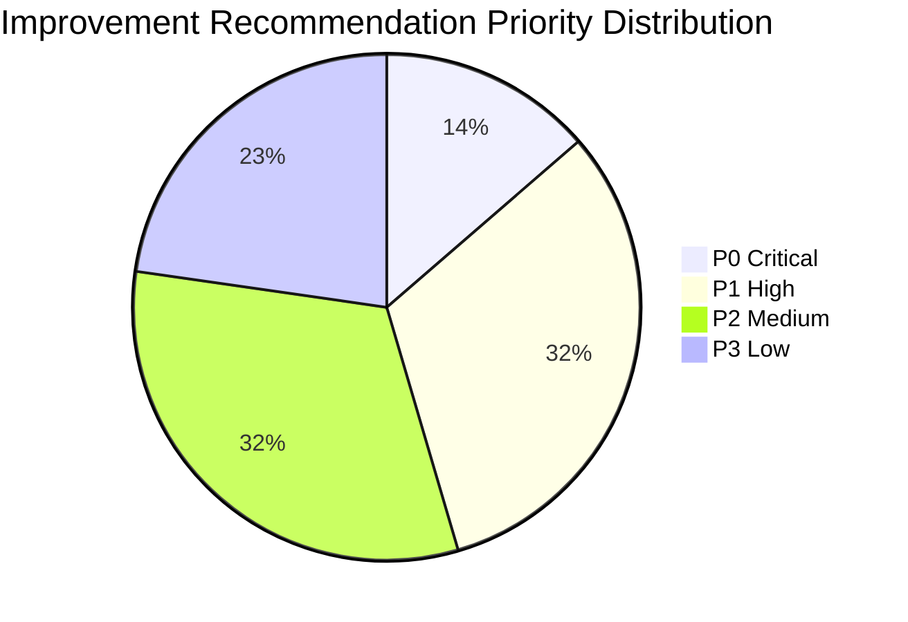
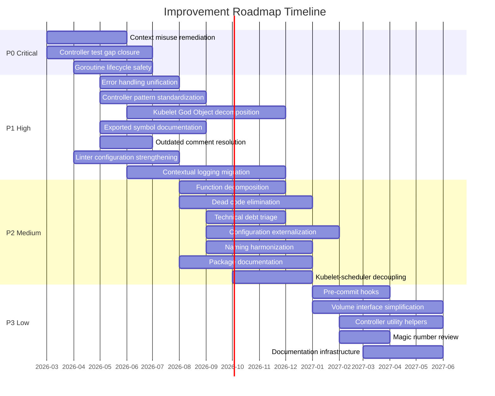
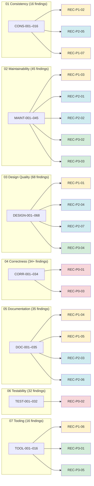

# Improvement Roadmap

## Document Metadata

| Field | Value |
|-------|-------|
| Document ID | 08_IMPROVEMENT_ROADMAP |
| Category | Improvement Roadmap |
| Risk Rating | **High** (reflects aggregate audit findings) |
| Priority Scale | P0 (Critical) / P1 (High) / P2 (Medium) / P3 (Low) |
| Last Updated | 2026-03-11 |

---

## Executive Summary

This document synthesizes all findings from the Kubernetes Code Quality Audit (documents 01–07) into a **prioritized, actionable improvement plan**. Each recommendation references specific findings by Finding ID, states expected benefits, and is assigned a priority tier from P0 (Critical) to P3 (Low).

The audit identified **246 individual findings** across 7 quality dimensions spanning the entire `k8s.io/kubernetes` repository. These findings translate into **22 structured recommendations** organized into 4 priority tiers:

| Priority | Label | Criteria | Recommendation Count |
|----------|-------|----------|---------------------|
| **P0** | Critical | Correctness risk or active maintenance blocker | 3 |
| **P1** | High | Systemic issue degrading velocity or reliability | 7 |
| **P2** | Medium | Recurrent inconsistency or design debt | 7 |
| **P3** | Low | Hygiene, polish, or long-horizon improvement | 5 |

**Key Themes:**
- The **kubelet** (`pkg/kubelet/`) is the single highest-risk module, appearing in P0, P1, and P2 recommendations due to its God-object struct (108 fields), monolithic constructor (704 lines), and critical test gaps
- **Concurrency correctness** risks from `context.TODO()`/`context.Background()` usage and untracked goroutine lifecycles represent the most urgent technical debt
- **Controller pattern standardization** across 30+ controllers would yield the highest velocity improvement through reduced review friction and faster onboarding
- **Linter configuration gaps** (39 disabled staticcheck checks, suppressed govet lostcancel) allow preventable defects to reach production code

---

## Priority Tier Definitions

| Tier | Label | Definition | Action Timeline |
|------|-------|------------|----------------|
| **P0** | Critical | Correctness risk affecting production reliability, or an active blocker to maintaining the codebase safely. Failure to address creates risk of data corruption, incorrect cluster state, or undetectable regressions. | Immediate — address within the current or next release cycle |
| **P1** | High | Systemic issue that measurably degrades development velocity, reliability, or debuggability. Affects multiple modules or teams and compounds over time. | Near-term — address within 1–2 release cycles |
| **P2** | Medium | Recurrent inconsistency or design debt that creates friction, increases review burden, or reduces code clarity. Individually tolerable but collectively significant. | Medium-term — address within 2–4 release cycles |
| **P3** | Low | Hygiene improvement, polish, or long-horizon enhancement. Low individual impact but contributes to overall codebase health. | Long-term — address opportunistically or as part of broader initiatives |

---

## P0 — Critical Recommendations

### REC-P0-01: Remediate Context Misuse in Production Code Paths

| Field | Value |
|-------|-------|
| **Priority** | P0 — Critical |
| **Source Findings** | CORR-010, CORR-011, CORR-012, CORR-013, CORR-014, CORR-015 (04_CORRECTNESS_AND_EFFICIENCY.md § Context Handling) |
| **Category** | Correctness |
| **Expected Benefit** | Reduced risk of resource leaks, orphaned operations, and unresponsive shutdown behavior in production; enables proper cancellation propagation for graceful termination |

**Problem Statement:**
Six findings document the use of `context.TODO()` and `context.Background()` in production code paths where a parent context should be propagated. The garbage collector uses `context.TODO()` for API server operations (CORR-010), the ReplicaSet controller uses `context.TODO()` for status updates (CORR-011), the EndpointSlice mirroring reconciler uses `context.TODO()` for all CRUD operations (CORR-012), the kubelet uses `context.Background()` in multiple background goroutines (CORR-013), the CronJob injection helper uses `context.TODO()` for API operations (CORR-014), and NodeIPAM sync uses `context.Background()` (CORR-015). Additionally, DOC-014 documents three TODO comments referencing issue #113606 about connecting incoming context parameters with pod worker operations.

**Guidance:**
- Audit all `context.TODO()` and `context.Background()` usage in `pkg/controller/`, `pkg/kubelet/`, and `pkg/scheduler/` to determine which can be replaced with parent context propagation
- Prioritize the kubelet (CORR-013) and garbage collector (CORR-010) paths, as these have the widest blast radius
- Use the golangci-lint `contextcheck` linter (currently not enabled) to detect context misuse systematically
- Address the three #113606 TODOs (DOC-014) as part of this remediation to connect pod worker contexts with internal operations

**Risk if Unaddressed:**
Operations launched with `context.TODO()` or `context.Background()` are invisible to graceful shutdown signals. During node drain or kubelet restart, these operations may continue executing against the API server after the parent has been cancelled, causing resource contention, stale writes, or failed reconciliation. The kubelet's use of `context.Background()` in CORR-013 specifically means that some goroutines launched during pod sync will not terminate when the kubelet's main context is cancelled.

---

### REC-P0-02: Close Critical Test Coverage Gap in pkg/controller/

| Field | Value |
|-------|-------|
| **Priority** | P0 — Critical |
| **Source Findings** | TEST-001, TEST-002 (06_TESTABILITY_AND_RELIABILITY.md § Per-Component Testability), CORR-006, CORR-007 (04_CORRECTNESS_AND_EFFICIENCY.md § Goroutine Patterns) |
| **Category** | Testability |
| **Expected Benefit** | Improved confidence in controller behavior under failure conditions; reduced risk of undetected regressions in cluster state management |

**Problem Statement:**
The controller package has a critically low test file ratio of 28% — 420 production source files with only 120 test files (TEST-001). The garbage collector, which manages object lifecycle for the entire cluster, has the lowest test ratio among core controllers at 20 production files to 3 test files (TEST-002). These controllers manage critical cluster state (deployments, jobs, replica sets, daemon sets, garbage collection) and execute concurrent reconciliation loops with goroutine patterns that lack explicit concurrency limits (CORR-007: Job controller launches one goroutine per pod for delete/patch without concurrency limits).

**Guidance:**
- Prioritize test coverage for the garbage collector (`pkg/controller/garbagecollector/`), which has the lowest coverage and manages the most critical resource lifecycle decisions
- Add concurrency-specific tests for the Job controller's per-pod goroutine pattern (CORR-007) to verify behavior under high-parallelism scenarios
- Leverage the existing `syncHandler` injection pattern (documented in 01_CONSISTENCY_AND_STYLE.md as a strong convention) to create isolated unit tests for reconciliation logic
- Target the `syncJob` (270 lines, MAINT-005), `attemptToDeleteItem` (151 lines, MAINT-016), and `trackJobStatusAndRemoveFinalizers` (150 lines, MAINT-015) functions as priority test targets due to their complexity and correctness criticality

**Risk if Unaddressed:**
Controllers with insufficient test coverage that manage critical cluster state (pod lifecycle, resource garbage collection, job completion tracking) represent the highest-risk code paths in Kubernetes. Regressions in these paths can cause pod loss, orphaned resources, or incorrect job completion reporting — all of which are difficult to detect without dedicated test coverage.

---

### REC-P0-03: Address Goroutine Lifecycle and Concurrency Safety Gaps

| Field | Value |
|-------|-------|
| **Priority** | P0 — Critical |
| **Source Findings** | CORR-006, CORR-007, CORR-008, CORR-009 (04_CORRECTNESS_AND_EFFICIENCY.md § Goroutine Patterns), CORR-016, CORR-017, CORR-018 (04_CORRECTNESS_AND_EFFICIENCY.md § Sync Primitives), TOOL-014 (07_TOOLING_AND_PROCESS.md § govet Suppressions) |
| **Category** | Correctness |
| **Expected Benefit** | Reduced risk of goroutine leaks, race conditions, and resource exhaustion in production; enables safe cancellation and shutdown |

**Problem Statement:**
Four findings document goroutine patterns that create correctness risks: the scheduler's binding cycle launches a detached goroutine without lifecycle tracking (CORR-006), the Job controller launches unbounded per-pod goroutines (CORR-007), the kubelet launches multiple goroutines without unified lifecycle tracking (CORR-008), and the scheduler's extender scoring uses shared mutex aggregation across goroutines (CORR-009). Additionally, the govet `lostcancel` check — which detects exactly the kind of context leak that enables goroutine leaks — is globally suppressed (TOOL-014). Sync primitive findings include atomic flag usage outside mutex scope (CORR-016), direct struct embedding of sync.RWMutex (CORR-017), and single mutex protecting many loosely-related fields (CORR-018).

**Guidance:**
- Re-enable the govet `lostcancel` check (TOOL-014) in `hack/golangci.yaml` to catch context cancellation leaks at CI time; address existing violations incrementally
- Introduce explicit concurrency limits for the Job controller's per-pod goroutine pattern (CORR-007) using a worker pool or semaphore
- Add goroutine lifecycle tracking to the kubelet (CORR-008) using `errgroup` or similar structured concurrency patterns
- Review the scheduler binding cycle (CORR-006) to ensure the detached goroutine properly propagates errors and respects cancellation
- Separate the proxy `Proxier` struct's mutable and immutable fields into distinct types to reduce mutex scope (CORR-018, DESIGN-009)

**Risk if Unaddressed:**
Goroutine leaks and race conditions are among the most difficult defects to reproduce and diagnose in production. The suppressed `lostcancel` check means new context leaks can be introduced without CI detection. Unbounded goroutine creation (CORR-007) under high load can exhaust memory and goroutine scheduling capacity.

---

## P1 — High Priority Recommendations

### REC-P1-01: Unify Error Handling Patterns Across Controllers and Kubelet

| Field | Value |
|-------|-------|
| **Priority** | P1 — High |
| **Source Findings** | DESIGN-011, DESIGN-012, DESIGN-013, DESIGN-014 (03_DESIGN_QUALITY.md § Error Handling), DESIGN-015 (03_DESIGN_QUALITY.md § Error Handling), CORR-022 (04_CORRECTNESS_AND_EFFICIENCY.md § Correctness Risk Register) |
| **Category** | Design |
| **Expected Benefit** | Improved debuggability through consistent error chains; reduced risk of silent failures; enables systematic error analysis using `errors.Is`/`errors.As` |

**Problem Statement:**
The codebase exhibits three distinct error handling anti-patterns. First, the `%v` vs `%w` wrapping divergence (DESIGN-011): the Job controller consistently uses `%w` for error wrapping while the Deployment controller uses `%v`, discarding the error chain. Second, silent error swallowing (DESIGN-012): the deployment controller's `deletePod` method silently returns when `ListReplicaSets` or `getPodMapForDeployment` fails, without logging or propagating the error. Third, inconsistent error context (DESIGN-014): the kubelet's `getKubeletMappings` omits the underlying error in the gid retrieval path while including it for uid retrieval. The Deployment controller also silently swallows errors from `GetDeploymentsForReplicaSet` (CORR-022).

**Guidance:**
- Establish a project-wide standard: all error wrapping should use `fmt.Errorf("context: %w", err)` to preserve error chains
- Audit all `%v` error formatting for `error` values and migrate to `%w` where the error chain should be preserved
- Audit all bare `return` statements in error handling blocks to determine if the error should be logged, propagated, or explicitly documented as intentionally swallowed
- Add a golangci-lint rule (e.g., `errorlint`) to enforce `%w` usage for error wrapping in new code
- Define a standard error handling pattern document in `CONTRIBUTING.md` or a developer guide

---

### REC-P1-02: Standardize Controller Implementation Patterns

| Field | Value |
|-------|-------|
| **Priority** | P1 — High |
| **Source Findings** | CONS-001, CONS-002, CONS-003, CONS-004, CONS-005 (01_CONSISTENCY_AND_STYLE.md § Controller Layer), CONS-014 (01_CONSISTENCY_AND_STYLE.md § Architectural Pattern Consistency), DESIGN-001, DESIGN-002, DESIGN-003 (03_DESIGN_QUALITY.md § Abstraction Quality), DESIGN-036 (03_DESIGN_QUALITY.md § Shotgun Surgery), MAINT-030, MAINT-032, MAINT-033 (02_READABILITY_AND_MAINTAINABILITY.md § Duplication Inventory) |
| **Category** | Consistency |
| **Expected Benefit** | Faster onboarding for new controller contributors; reduced review friction; consistent behavior across all 30+ controllers; reduced boilerplate duplication |

**Problem Statement:**
The 30+ controllers in `pkg/controller/` exhibit naming inconsistencies (CONS-001 through CONS-005), architectural pattern divergence (CONS-014, DESIGN-001, DESIGN-003), and extensive boilerplate duplication (MAINT-030, MAINT-032, MAINT-033). Specific issues include: the Job controller uses the bare name `Controller` instead of `JobController` (CONS-001), DaemonSet uses the plural `DaemonSetsController` (CONS-001), receiver variables use legacy mnemonics (`jm` for Job Manager — CONS-003), file naming splits between `_controller.go` and bare resource names (CONS-004), `doc.go` presence varies (CONS-005), the `HandleCrash` variant diverges (CONS-014, DESIGN-001), and the `Run` method boilerplate is duplicated across all 30+ controllers (MAINT-030).

**Guidance:**
- Define a canonical controller template specifying: type naming (`{Resource}Controller`), constructor naming (`New{Resource}Controller`), receiver naming (abbreviation of type name), file naming (`{resource}_controller.go`), and `doc.go` requirement
- Extract the `Run` method boilerplate (event broadcaster wiring, cache sync, worker pool) into a shared controller runner utility in `pkg/controller/`
- Standardize on `HandleCrashWithContext(ctx)` across all controllers (the more modern variant per DESIGN-001)
- Standardize informer event handler registration to use error-checking variant consistently (newer pattern per MAINT-033)
- Apply naming standardization incrementally during routine maintenance of each controller

---

### REC-P1-03: Decompose Kubelet God Object and Constructor

| Field | Value |
|-------|-------|
| **Priority** | P1 — High |
| **Source Findings** | MAINT-001, MAINT-023, MAINT-045 (02_READABILITY_AND_MAINTAINABILITY.md § Function/Type Size Outliers), MAINT-028, MAINT-044 (02_READABILITY_AND_MAINTAINABILITY.md § Speculative Generalization), DESIGN-004, DESIGN-005, DESIGN-018, DESIGN-021 (03_DESIGN_QUALITY.md § God Objects and Dependency Injection), TEST-003, TEST-005 (06_TESTABILITY_AND_RELIABILITY.md § Per-Component Testability) |
| **Category** | Maintainability |
| **Expected Benefit** | Improved testability of individual kubelet subsystems; reduced cognitive load for contributors; safer modification of kubelet initialization; clearer dependency contracts |

**Problem Statement:**
The `Kubelet` struct is the largest God object in the codebase with ~108 fields (MAINT-023, DESIGN-018). Its constructor `NewMainKubelet` spans 704 lines with 26 positional parameters (MAINT-001, DESIGN-005, MAINT-045). The `Dependencies` struct is a self-acknowledged "temporary solution" for dependency injection that has persisted indefinitely (MAINT-028, MAINT-044, DESIGN-004). The kubelet uses mutable package-level variables that complicate test isolation (TEST-005). The container manager further aggregates 7+ sub-managers (DESIGN-021).

**Guidance:**
- Decompose the `Kubelet` struct into sub-system aggregates: `PodLifecycleManager`, `VolumeManager`, `NodeStatusManager`, `ImageManager`, `EvictionManager`, etc. — each with its own constructor and dependency surface
- Replace the `Dependencies` struct with purpose-specific dependency containers for each sub-system
- Replace `NewMainKubelet`'s 26 positional parameters with a `KubeletConfig` struct following the functional options pattern (as successfully used by the scheduler — DESIGN-006)
- Decompose `NewMainKubelet` into sub-constructor calls (`initPodLifecycle`, `initVolumeManagement`, `initNodeStatus`, etc.)
- Introduce interface boundaries between kubelet sub-systems to enable independent unit testing (addressing TEST-003)

---

### REC-P1-04: Expand Exported Symbol Documentation Coverage

| Field | Value |
|-------|-------|
| **Priority** | P1 — High |
| **Source Findings** | DOC-008 (05_DOCUMENTATION_AUDIT.md § Comment Quality), DOC-019, DOC-020, DOC-025, DOC-026, DOC-027 (05_DOCUMENTATION_AUDIT.md § Undocumented Public API Surface), CONS-012 (01_CONSISTENCY_AND_STYLE.md § Language Convention Adherence), TOOL-012 (07_TOOLING_AND_PROCESS.md § Linter Coverage) |
| **Category** | Documentation |
| **Expected Benefit** | Improved GoDoc output for all public APIs; reduced API misuse; faster integration development; improved IDE tooltip experience |

**Problem Statement:**
Exported symbol documentation enforcement is limited to `cmd/kubeadm` only (DOC-008, CONS-012, TOOL-012). This has resulted in undocumented public API types across critical packages: 5 undocumented types in core API (DOC-019), 5 in certificates API (DOC-020), all 4 exported functions in `storage_core.go` undocumented (DOC-025), undocumented config types (DOC-026), and undocumented scheduler types (DOC-027). The golangci-lint configuration explicitly suppresses documentation requirements via `path-except: cmd/kubeadm` for revive and staticcheck rules.

**Guidance:**
- Incrementally expand the `path-except` directive in `hack/golangci.yaml` to enforce exported symbol documentation in additional packages, starting with `pkg/apis/` (API type definitions consumed by all clients)
- Prioritize documentation for the 5 core API types (DOC-019) and the certificate API types (DOC-020) due to their security and API contract significance
- Document the core REST storage provider functions (DOC-025) and config types (DOC-026) to clarify API server initialization
- Consider using `revive`'s `exported` rule with a phased rollout: `pkg/apis/` first, then `pkg/registry/`, then `pkg/controller/`, then `pkg/kubelet/`

---

### REC-P1-05: Resolve Outdated Comments and Critical FIXME Markers

| Field | Value |
|-------|-------|
| **Priority** | P1 — High |
| **Source Findings** | DOC-010, DOC-011, DOC-012, DOC-013, DOC-014, DOC-016 (05_DOCUMENTATION_AUDIT.md § Outdated Comments), DOC-030, DOC-031, DOC-034 (05_DOCUMENTATION_AUDIT.md § Non-Obvious Logic Documentation) |
| **Category** | Documentation |
| **Expected Benefit** | Reduced risk of contributors making decisions based on stale information; improved debugging by resolving known FIXME issues; clearer understanding of current runtime behavior |

**Problem Statement:**
Five FIXME markers in production code signal unresolved correctness or completeness issues (DOC-010), including incomplete platform parity in proxy metrics and a known context handling workaround in the device manager. Outdated Docker/dockershim references persist in 57 comment lines across `pkg/` (DOC-013), including a struct field comment referencing "simple Docker implementation" as a default (DOC-011) and cleanup logic justified by removed dockershim behavior (DOC-012). Three TODO comments reference issue #113606 for context cancellation without resolution (DOC-014). The kubelet contains persistent `klog.TODO()` placeholder calls that bypass structured logging context (DOC-016). The scheduler's binding cycle error handling lacks flow documentation (DOC-034), and the adaptive node scoring formula's constants are undocumented (DOC-030).

**Guidance:**
- Triage all 5 FIXME markers (DOC-010) to determine if they represent open bugs requiring issues, known limitations requiring documentation, or resolved issues requiring comment cleanup
- Remove or update all 57 Docker/dockershim references (DOC-013), particularly the misleading "Docker implementation" default comment (DOC-011) and the cleanup rationale (DOC-012)
- Resolve or document issue #113606 TODOs (DOC-014) — either connect pod worker contexts as intended or document why deferred
- Add flow documentation to the scheduler's binding cycle error recovery protocol (DOC-034)
- Document the adaptive scoring formula constants (DOC-030: `50 - numAllNodes/125`)
- Document the cgroup existence check and kill logic in kubelet (DOC-031)

---

### REC-P1-06: Strengthen Golangci-lint Configuration and Re-enable Suppressed Checks

| Field | Value |
|-------|-------|
| **Priority** | P1 — High |
| **Source Findings** | TOOL-011, TOOL-013, TOOL-014 (07_TOOLING_AND_PROCESS.md § Linter Configuration), TOOL-005, TOOL-006 (07_TOOLING_AND_PROCESS.md § Missing Tooling) |
| **Category** | Tooling |
| **Expected Benefit** | Earlier defect detection in CI; reduced review burden for manual pattern enforcement; prevention of new technical debt introduction |

**Problem Statement:**
The base golangci-lint configuration disables 39 staticcheck checks (TOOL-011), including checks for deprecated function usage, unnecessary type conversions, and redundant code patterns. The govet `lostcancel` check — critical for detecting context cancellation leaks — is globally suppressed (TOOL-014). The gocritic linter excludes high-value directories from analysis (TOOL-013). No cyclomatic or cognitive complexity measurement tooling is configured (TOOL-005), meaning extreme function size outliers (MAINT-001 through MAINT-022) are not caught by CI. No duplicate code detection tooling is configured (TOOL-006), meaning the extensive controller boilerplate duplication (MAINT-030 through MAINT-035) is not flagged.

**Guidance:**
- Re-enable govet `lostcancel` check (TOOL-014) — this is the highest-priority linter change as it directly prevents the context misuse documented in CORR-010 through CORR-015
- Incrementally re-enable staticcheck checks from the 39-check suppression list (TOOL-011), starting with deprecated function detection and unnecessary type conversion checks
- Add a complexity measurement tool (e.g., `gocognit` or `gocyclo`) with thresholds to catch new extreme function size outliers
- Evaluate adding `dupl` or similar duplicate code detection to identify new duplication during code review
- Expand gocritic coverage (TOOL-013) by reducing path exclusions for key directories as existing violations are resolved
- Use the existing two-tier configuration (`golangci.yaml` permissive, `golangci-hints.yaml` strict) to graduate checks from hints to enforcement as violations are resolved

---

### REC-P1-07: Complete Contextual Logging Migration

| Field | Value |
|-------|-------|
| **Priority** | P1 — High |
| **Source Findings** | CONS-013 (01_CONSISTENCY_AND_STYLE.md § Contextual Logging Migration), TOOL-015 (07_TOOLING_AND_PROCESS.md § Logging Enforcement), DOC-016, DOC-017 (05_DOCUMENTATION_AUDIT.md § Stale TODOs) |
| **Category** | Consistency |
| **Expected Benefit** | Unified logging API across all modules; improved log correlation in production debugging; reduced codebase inconsistency |

**Problem Statement:**
The codebase is in a split state between global `klog.InfoS`/`klog.ErrorS` and contextual `klog.FromContext(ctx)` logging (CONS-013). The golangci-lint `logcheck` configuration enforces structured logging for only 6 packages and contextual logging for ~45 packages, with the rest unenforced (TOOL-015). The kubelet's `kubelet.go` has 102 global klog calls vs. 7 contextual calls despite being in "structured" mode. Persistent `klog.TODO()` calls bypass structured logging context (DOC-016). Scheduler TODOs reference stale contextualized logging issue #111672 (DOC-017).

**Guidance:**
- Establish a timeline for completing the structured → contextual logging migration for the remaining packages
- Prioritize `pkg/kubelet/` migration (102 global calls in the main file alone) due to its debugging significance
- Replace all `klog.TODO()` placeholder calls (DOC-016) with proper contextual logging from parent contexts
- Resolve the scheduler logging TODO for issue #111672 (DOC-017)
- Expand the `logcheck` configuration in `hack/golangci.yaml` to enforce `contextual` mode for newly migrated packages
- Track migration progress using the per-package configuration in `hack/golangci.yaml` as the authoritative status document

---

## P2 — Medium Priority Recommendations

### REC-P2-01: Decompose Oversized Functions in Critical Paths

| Field | Value |
|-------|-------|
| **Priority** | P2 — Medium |
| **Source Findings** | MAINT-002, MAINT-003, MAINT-004, MAINT-005, MAINT-006, MAINT-007, MAINT-008, MAINT-009 (02_READABILITY_AND_MAINTAINABILITY.md § Function Size Outliers), MAINT-013, MAINT-014, MAINT-015, MAINT-016, MAINT-017, MAINT-018, MAINT-019, MAINT-020, MAINT-021, MAINT-022 (02_READABILITY_AND_MAINTAINABILITY.md § Large Functions), DESIGN-024 (03_DESIGN_QUALITY.md § Deep Nesting) |
| **Category** | Maintainability |
| **Expected Benefit** | Improved testability of individual code paths; reduced cognitive load during code review; lower regression risk when modifying critical functions |

**Problem Statement:**
Nine functions exceed 200 lines, collectively spanning over 3,000 lines of critical-path code. The most extreme outliers are: `syncProxyRules` at 806 lines (MAINT-002), `NewMainKubelet` at 704 lines (covered in REC-P1-03), `convertToAPIContainerStatuses` at 419 lines (MAINT-003), `HandlePodCleanups` at 274 lines (MAINT-004), `syncJob` at 270 lines (MAINT-005), `makeEnvironmentVariables` at 251 lines (MAINT-006), `SyncPod` at 241 lines (MAINT-007), `getPhase` at 224 lines (MAINT-008), and `manageJob` at 197 lines (MAINT-009). An additional 14 functions fall in the 100–200 line range (MAINT-009 through MAINT-022).

**Guidance:**
- Prioritize `syncProxyRules` (MAINT-002) — the 806-line function is the primary source of kube-proxy bugs and is near-impossible to test individual rule generation paths in isolation
- Decompose `convertToAPIContainerStatuses` (MAINT-003) into per-state-type conversion functions (init containers, regular containers, sidecar containers)
- Extract `HandlePodCleanups` (MAINT-004) into purpose-specific cleanup functions (volume cleanup, cgroup cleanup, directory cleanup, mirror pod cleanup)
- Split `syncJob` (MAINT-005) into feature-specific sub-functions (completion tracking, failure tracking, pod creation/deletion, finalizer management)
- Apply the same decomposition principle to `makeEnvironmentVariables` (MAINT-006), `SyncPod` (MAINT-007), `getPhase` (MAINT-008)
- Introduce a cyclomatic/cognitive complexity linter threshold (per REC-P1-06) to prevent new functions from reaching extreme sizes

---

### REC-P2-02: Eliminate Dead Code and Complete Feature Gate Lifecycle Cleanup

| Field | Value |
|-------|-------|
| **Priority** | P2 — Medium |
| **Source Findings** | MAINT-036, MAINT-037, MAINT-040 (02_READABILITY_AND_MAINTAINABILITY.md § Dead Code Catalog), MAINT-039 (02_READABILITY_AND_MAINTAINABILITY.md § Feature Gate Conditionals), MAINT-026 (02_READABILITY_AND_MAINTAINABILITY.md § Type Size Outliers) |
| **Category** | Maintainability |
| **Expected Benefit** | Reduced binary size; lower compilation and test execution time; clearer signal about which code paths are active |

**Problem Statement:**
The `git_repo` volume plugin is deprecated and disabled behind a feature gate but retains its full 291-line implementation (MAINT-036). Fifteen deprecated in-tree volume plugin type definitions persist in `VolumeSource` and `PersistentVolumeSource` (MAINT-037, MAINT-026), with 190 `// Deprecated:` annotations in `pkg/apis/core/types.go`. Five deprecated volume plugin directories are retained (MAINT-040): `git_repo`, `fc`, `iscsi`, `nfs`, `flexvolume`. Feature gate conditional code persists for features at various lifecycle stages (MAINT-039), including GA features that should have their conditional branches removed.

**Guidance:**
- Verify the lifecycle stage of each feature gate referenced in MAINT-039; for GA features, remove conditional branches and make behavior unconditional
- For deprecated volume plugins (MAINT-036, MAINT-040), follow the Kubernetes deprecation policy timeline — remove plugin implementations that have passed their deprecation window
- The deprecated `VolumeSource` and `PersistentVolumeSource` fields (MAINT-037, MAINT-026) cannot be removed for API compatibility; document their status clearly and ensure new contributors understand the CSI migration path
- Use the existing `hack/verify-deadcode-elimination.sh` to verify that removed code does not regress binary size

---

### REC-P2-03: Triage and Reduce Technical Debt Backlog

| Field | Value |
|-------|-------|
| **Priority** | P2 — Medium |
| **Source Findings** | MAINT-038 (02_READABILITY_AND_MAINTAINABILITY.md § TODO/FIXME Comments), DOC-009 (05_DOCUMENTATION_AUDIT.md § Comment Quality), DOC-015, DOC-018 (05_DOCUMENTATION_AUDIT.md § Stale TODOs) |
| **Category** | Maintainability |
| **Expected Benefit** | Clear prioritization of deferred work; removal of stale TODOs that no longer apply; reduced accumulation of untracked debt |

**Problem Statement:**
The kubelet contains 57 combined TODO/FIXME markers in its two main files (`kubelet.go` at 30 TODOs, `kubelet_pods.go` at 27 TODOs — MAINT-038). The broader `pkg/kubelet/` directory contains 343 TODO markers — more than double the next highest module (DOC-009). Many reference specific GitHub issues (e.g., #104824, #111672, #113606) that may have been resolved. A TODO in `pkg/apis/core/types.go` about restricting host directory mount permissions (DOC-018) has been addressed through Pod Security Standards but the comment persists. A scheduler TODO referencing issue #87159 for plugin migration remains unresolved (DOC-015).

**Guidance:**
- Conduct a systematic triage of all TODO/FIXME markers in `pkg/kubelet/` (343 markers, DOC-009): categorize each as (a) resolved and removable, (b) still relevant and traceable to an open issue, or (c) design debt requiring a new tracking issue
- Remove TODOs referencing resolved GitHub issues
- Remove the stale VolumeSource host directory TODO (DOC-018) with a note that Pod Security Standards address this concern
- Resolve or re-prioritize the scheduler plugin migration TODO (DOC-015, issue #87159)
- Establish a project norm of including GitHub issue references in all new TODOs to enable future triage

---

### REC-P2-04: Externalize Hardcoded Configuration Values

| Field | Value |
|-------|-------|
| **Priority** | P2 — Medium |
| **Source Findings** | DESIGN-043 through DESIGN-068 (03_DESIGN_QUALITY.md § Configuration vs. Hardcoded Values), DESIGN-025, DESIGN-026, DESIGN-027, DESIGN-028 (03_DESIGN_QUALITY.md § Magic Numbers) |
| **Category** | Design |
| **Expected Benefit** | Operators can tune behavior for their specific environments; reduced need for binary rebuilds to change operational parameters; improved observability of configuration |

**Problem Statement:**
Twenty-six findings (DESIGN-043 through DESIGN-068) document hardcoded values in the kubelet, controller, scheduler, and proxy that could benefit from externalization. Key examples include: `maxWaitForContainerRuntime = 30s` (DESIGN-043), `nodeStatusUpdateRetry = 5` (DESIGN-044), `nodeReadyGracePeriod = 120s` (DESIGN-045), `plegChannelCapacity = 1000` described as "a bit arbitrary" (DESIGN-048), `largeClusterEndpointsThreshold = 1000` (DESIGN-028/DESIGN-058), `BurstReplicas = 500` referencing Kubernetes 1.0 performance (DESIGN-053), and `MaxPodCreateDeletePerSync = 500` (DESIGN-055). Additionally, the structured logging verbosity level `3` is hardcoded across all controllers without explanation (DESIGN-025).

**Guidance:**
- Prioritize externalization of values that affect production operational behavior: `largeClusterEndpointsThreshold` (DESIGN-028/DESIGN-058), `nodeStatusUpdateRetry` (DESIGN-044), and `plegChannelCapacity` (DESIGN-048)
- Replace the magic number `3` in `StartStructuredLogging(3)` with a named constant (DESIGN-025)
- Review `BurstReplicas = 500` (DESIGN-053) against current performance characteristics — the value references Kubernetes 1.0 requirements
- For values that are justifiably fixed (e.g., OS paths like `/etc/hosts` — DESIGN-060, DESIGN-061), add documentation explaining why they are not configurable
- Use the existing `KubeletConfiguration` and component config patterns as the mechanism for exposing new configuration parameters

---

### REC-P2-05: Harmonize Naming Conventions and Import Aliases

| Field | Value |
|-------|-------|
| **Priority** | P2 — Medium |
| **Source Findings** | CONS-006, CONS-008, CONS-010, CONS-015, CONS-009 (01_CONSISTENCY_AND_STYLE.md § Naming Conventions and Import Organization), DESIGN-029, DESIGN-031 (03_DESIGN_QUALITY.md § Primitive Obsession) |
| **Category** | Consistency |
| **Expected Benefit** | Improved codebase navigability; reduced confusion when working across modules; consistent grep/search results |

**Problem Statement:**
Kubelet sub-package names use opaque abbreviations (`cm` for container manager, `oom` for out-of-memory) while the rest use full words (CONS-006). Admission controller types split between `Plugin` (majority) and domain-specific names (CONS-008). The `k8s.io/apimachinery/pkg/api/errors` package is imported under at least 3 different aliases across the codebase (CONS-010). Feature gate access uses inconsistent aliases (`feature` vs `utilfeature` for the same package — CONS-015). Import group organization varies between 4 and 5 groups depending on third-party dependency presence (CONS-009). Controller queue keys and chain names use plain strings without type safety (DESIGN-029, DESIGN-031).

**Guidance:**
- Standardize the feature gate import alias to a single name (e.g., `utilfeature`) and update `hack/.import-aliases` to enforce it (CONS-015)
- Standardize the API errors import alias to `apierrors` and enforce via `hack/.import-aliases` (CONS-010)
- Document the import organization standard (stdlib → third-party → k8s.io external → k8s.io/kubernetes internal) in `CONTRIBUTING.md`
- For admission controllers, adopt the `Plugin` naming convention for new admission plugins and document it as the standard (CONS-008)
- The kubelet sub-package abbreviations (`cm`, `oom`) are deeply embedded and not worth renaming; document their meanings in package-level `doc.go` files instead (CONS-006)

---

### REC-P2-06: Expand Package-Level Documentation

| Field | Value |
|-------|-------|
| **Priority** | P2 — Medium |
| **Source Findings** | DOC-001, DOC-002, DOC-003, DOC-004, DOC-005, DOC-006, DOC-007 (05_DOCUMENTATION_AUDIT.md § Package Documentation), DOC-032, DOC-033, DOC-035 (05_DOCUMENTATION_AUDIT.md § Non-Obvious Logic) |
| **Category** | Documentation |
| **Expected Benefit** | Complete GoDoc output for all packages; reduced onboarding time for new contributors; clearer architecture discovery |

**Problem Statement:**
The kubelet main package lacks a package-level doc comment (DOC-001), 20+ kubelet sub-packages are missing `doc.go` files (DOC-003), 15 controller sub-packages lack `doc.go` (DOC-004), 7 scheduler sub-packages have no `doc.go` (DOC-005), 18 admission controller plugins are without `doc.go` (DOC-006), and 8 volume sub-packages including the critical CSI implementation are missing `doc.go` (DOC-007). Additionally, non-obvious logic in the proxy (precomputed probability cache — DOC-032, buffer reuse strategy — DOC-033) and kubelet (PLEG channel capacity rationale — DOC-035) lacks documentation.

**Guidance:**
- Add `doc.go` files to all packages identified in DOC-001 through DOC-007, prioritizing: `pkg/kubelet/` (DOC-001), `pkg/scheduler/framework/` (DOC-005, as the primary plugin extension point), and `pkg/volume/csi/` (DOC-007, as the standard storage interface)
- Document non-obvious logic: the proxy's precomputed probability cache format and lifecycle (DOC-032), buffer reuse lifecycle (DOC-033), and PLEG channel capacity rationale (DOC-035)
- The scheduler's `framework/` package documentation (DOC-005) is the highest-priority documentation target given its role as the extension point for all scheduling plugins

---

### REC-P2-07: Reduce Coupling Between Kubelet and Scheduler

| Field | Value |
|-------|-------|
| **Priority** | P2 — Medium |
| **Source Findings** | DESIGN-038, DESIGN-039 (03_DESIGN_QUALITY.md § Inappropriate Intimacy), TEST-011 (06_TESTABILITY_AND_RELIABILITY.md § Coupling Inventory) |
| **Category** | Design |
| **Expected Benefit** | Cleaner dependency graph; reduced compilation time for kubelet changes; independent testability of kubelet and scheduler |

**Problem Statement:**
The kubelet directly imports the scheduler's framework plugin package (`k8s.io/kubernetes/pkg/scheduler/framework/plugins/tainttoleration`) to use `tainttoleration.ErrReasonNotMatch` (DESIGN-038). The container manager Linux implementation imports `k8s.io/kubernetes/pkg/scheduler/framework` for type access (DESIGN-039). This creates a cross-layer dependency from the node agent to the scheduler, documented in the coupling inventory (TEST-011).

**Guidance:**
- Extract shared types and constants (like `ErrReasonNotMatch`) to a common package accessible to both kubelet and scheduler (e.g., `pkg/apis/scheduling/` or `staging/src/k8s.io/component-helpers/`)
- Remove direct kubelet → scheduler imports by using the extracted shared package
- Verify that no other cross-layer dependencies exist between kubelet and scheduler using `hack/verify-imports.sh`

---

## P3 — Low Priority Recommendations

### REC-P3-01: Introduce Pre-commit Hook Framework

| Field | Value |
|-------|-------|
| **Priority** | P3 — Low |
| **Source Findings** | TOOL-001 (07_TOOLING_AND_PROCESS.md § Missing Tooling) |
| **Category** | Tooling |
| **Expected Benefit** | Faster feedback loop for developers; reduced CI failure rate; catches formatting and basic lint issues before push |

**Problem Statement:**
No pre-commit hook framework is detected in the repository (TOOL-001). All quality gates are enforced only at CI level (Prow), meaning developers must push code and wait for CI to discover formatting violations, import ordering issues, and basic lint failures.

**Guidance:**
- Evaluate pre-commit hook frameworks (e.g., `pre-commit`, `lefthook`, or a custom `hack/pre-commit.sh`)
- Start with lightweight checks: `gofmt`, import alias verification, boilerplate header check
- Make adoption opt-in initially (documented in `CONTRIBUTING.md`) rather than mandatory, to avoid friction for existing contributors
- The existing `hack/verify-*` scripts provide the check implementations; the pre-commit hook would invoke a subset of these

---

### REC-P3-02: Simplify Volume Plugin Interface Hierarchy

| Field | Value |
|-------|-------|
| **Priority** | P3 — Low |
| **Source Findings** | MAINT-041 (02_READABILITY_AND_MAINTAINABILITY.md § Speculative Generalization), DESIGN-010, DESIGN-020, DESIGN-040 (03_DESIGN_QUALITY.md § Volume Architecture) |
| **Category** | Maintainability |
| **Expected Benefit** | Reduced interface surface area; simpler plugin implementation requirements; clearer CSI-centric architecture |

**Problem Statement:**
The volume plugin system defines 15+ interfaces (MAINT-041) designed for a world with many in-tree volume plugins. As the ecosystem converges on CSI, much of this interface surface becomes speculative generalization. The `VolumePluginMgr` has 22 methods acting as a central registry with repetitive lookup patterns (DESIGN-010, DESIGN-020). The base `VolumePlugin` interface includes platform-specific methods like `SupportsSELinuxContextMount` (DESIGN-040).

**Guidance:**
- As deprecated volume plugins are removed (per REC-P2-02), audit the interface hierarchy to identify interfaces with zero or one remaining implementation
- Consider introducing a generic lookup mechanism in `VolumePluginMgr` to replace the 22 repetitive finder methods (DESIGN-020), leveraging Go generics
- Evaluate whether platform-specific methods (DESIGN-040) can be moved to platform-specific interface extensions

---

### REC-P3-03: Create Shared Controller Utility Helpers

| Field | Value |
|-------|-------|
| **Priority** | P3 — Low |
| **Source Findings** | MAINT-031, MAINT-034, MAINT-035 (02_READABILITY_AND_MAINTAINABILITY.md § Duplication Inventory), DESIGN-015, DESIGN-036 (03_DESIGN_QUALITY.md § Controller Patterns), CORR-001, CORR-002, CORR-004, CORR-005 (04_CORRECTNESS_AND_EFFICIENCY.md § Redundant Logic) |
| **Category** | Maintainability |
| **Expected Benefit** | Reduced boilerplate across 30+ controllers; consistent error handling in shared patterns; easier evolution of common patterns |

**Problem Statement:**
Multiple redundant patterns are duplicated across controllers: tombstone handling (MAINT-031, CORR-001, DESIGN-015) with format verb divergence (`%#v` vs `%+v`), `resolveControllerRef` implementation (CORR-002), `ResourceVersion` equality checks in update handlers (CORR-004), enqueue helper functions (CORR-005), work queue creation (MAINT-035), and admission controller registration boilerplate (MAINT-034, DESIGN-036).

**Guidance:**
- Create a generic tombstone extraction helper in `pkg/controller/` that handles `DeletedFinalStateUnknown` unwrapping with consistent error formatting (addressing MAINT-031, CORR-001, DESIGN-015)
- Create a standard controller registration helper for admission plugins (addressing MAINT-034) — potentially a base struct with default `SetExternalKubeClientSet`, `SetExternalKubeInformerFactory`, and `ValidateInitialization` implementations
- Create a standard enqueue helper and `resolveControllerRef` utility (addressing CORR-002, CORR-005)
- Use Go generics for type-safe work queue creation helpers (addressing MAINT-035)

---

### REC-P3-04: Review and Update Magic Numbers

| Field | Value |
|-------|-------|
| **Priority** | P3 — Low |
| **Source Findings** | DESIGN-025, DESIGN-026, DESIGN-027, DESIGN-048, DESIGN-053 (03_DESIGN_QUALITY.md § Magic Numbers), CORR-020, CORR-027 (04_CORRECTNESS_AND_EFFICIENCY.md § Fragile Logic) |
| **Category** | Design |
| **Expected Benefit** | Clearer intent in code; documented rationale for operational constants; consistency across modules |

**Problem Statement:**
The logging verbosity `3` is hardcoded in every controller's `StartStructuredLogging(3)` call without explanation (DESIGN-025). The scheduler uses `pluginMetricsSamplePercent = 10` with a "semi-arbitrary" annotation (DESIGN-026). The kubelet's `plegChannelCapacity = 1000` is "a bit arbitrary" (DESIGN-048). `BurstReplicas = 500` references Kubernetes 1.0 (DESIGN-053). `maxRetries = 15` is hardcoded across multiple controllers (CORR-020). `BurstReplicas` differs between ReplicaSet (500) and DaemonSet (250) without documented justification (CORR-027).

**Guidance:**
- Replace the bare `3` in `StartStructuredLogging(3)` with a named constant (e.g., `defaultEventLogVerbosity = 3`) with a documenting comment (DESIGN-025)
- Harmonize `BurstReplicas` between ReplicaSet and DaemonSet controllers or document the rationale for the difference (CORR-027)
- Add derivation comments to "semi-arbitrary" and "a bit arbitrary" constants explaining the sizing considerations (DESIGN-026, DESIGN-048)
- Review `maxRetries = 15` across controllers for consistency (CORR-020) — consider extracting to a shared constant if the value should be uniform

---

### REC-P3-05: Modernize Documentation Generation Infrastructure

| Field | Value |
|-------|-------|
| **Priority** | P3 — Low |
| **Source Findings** | TOOL-010 (07_TOOLING_AND_PROCESS.md § Verification Scripts), TOOL-016 (07_TOOLING_AND_PROCESS.md § kube-api-linter), MAINT-042, MAINT-043 (02_READABILITY_AND_MAINTAINABILITY.md § Speculative Generalization) |
| **Category** | Tooling |
| **Expected Benefit** | Stronger API convention enforcement; cleaner developer experience; reduced vestigial script maintenance |

**Problem Statement:**
Top-level hack scripts (`hack/build.sh`, `hack/test.sh`, etc.) are vestigial redirections to Makefile targets (TOOL-010). The kube-api-linter enables only 5 of 15+ available checks (TOOL-016), leaving many API convention best practices unenforced. The kubelet defines `SyncHandler` and `Bootstrap` interfaces with single implementations (MAINT-042, MAINT-043), creating navigational indirection.

**Guidance:**
- Evaluate enabling additional kube-api-linter checks (TOOL-016): start with `jsontags`, `optionalorrequired`, and `requiredfields` as these enforce API structural correctness
- Clean up vestigial hack scripts (TOOL-010) by removing or updating them to reference the Makefile directly
- For single-implementation interfaces (MAINT-042, MAINT-043), document the testability justification in the interface definition rather than removing them

---

## Thematic Recommendation Guidance

This section provides focused recommendation guidance for cross-cutting themes referenced by findings in the analysis documents (01–07). Each theme maps to one or more primary recommendations defined in the priority tiers above.

### Input Validation

| Field | Value |
|-------|-------|
| **Theme** | Input Validation |
| **Source Findings** | DESIGN-016 (03_DESIGN_QUALITY.md § Input Validation Coverage Map), DESIGN-017 (03_DESIGN_QUALITY.md § Input Validation Coverage Map) |
| **Primary Recommendations** | REC-P1-03 (Decompose Kubelet God Object), REC-P2-04 (Externalize Hardcoded Configuration Values) |

**Context:**
The kubelet constructor `NewMainKubelet` validates some parameters upfront (`rootDirectory`, `podLogsDirectory`, `SyncFrequency`) but accepts others without bounds checking (`maxPerPodContainerCount`, `maxContainerCount`, `nodeStatusMaxImages`) — deferring validation to runtime (DESIGN-017). The LimitRanger admission controller uses hardcoded cache sizing (10,000 entries) and TTL (30 seconds) without input validation or configurability (DESIGN-016).

**Guidance:**
- As part of the kubelet decomposition (REC-P1-03), consolidate all constructor parameter validation into an explicit validation phase at the start of `NewMainKubelet` — or within the replacement `KubeletConfig` struct's validation method — so that misconfiguration is detected at startup rather than during runtime operation
- For admission controller operational parameters (DESIGN-016), evaluate which values should be configurable via admission webhook configuration rather than hardcoded, and add bounds validation for any newly externalized parameters (aligned with REC-P2-04)
- Establish a validation pattern standard: all constructor/initialization parameters with operational significance should be validated at construction time with clear error messages identifying the invalid parameter and acceptable range

### API Evolution

| Field | Value |
|-------|-------|
| **Theme** | API Evolution |
| **Source Findings** | DESIGN-034 (03_DESIGN_QUALITY.md § Shotgun Surgery) |
| **Primary Recommendations** | REC-P1-02 (Standardize Controller Implementation Patterns), REC-P2-01 (Decompose Oversized Functions) |

**Context:**
Adding a new field to a core API type (e.g., `PodSpec`) requires coordinated changes across 6+ files: `types.go` (internal), `v1/types.go` (external/staging), `validation/validation.go`, `defaults.go`, `zz_generated.deepcopy.go`, `zz_generated.conversion.go`, and potentially swagger documentation and test files (DESIGN-034). The `pkg/apis/core/types.go` file is 7,171 lines. This is the highest-impact shotgun surgery pattern in the codebase.

**Guidance:**
- Code generation (`hack/update-codegen.sh`) already mitigates some of the cross-file burden for deepcopy and conversion; ensure that all generated files are clearly marked and excluded from manual review checklists
- Document the canonical "add a new API field" workflow as a contributor guide, listing every required file change, code generation step, and validation test update — this reduces the risk of incomplete changes (DESIGN-034)
- Evaluate whether validation and defaulting logic can be co-located with type definitions (e.g., via struct tags or adjacent validation methods) to reduce the number of files requiring manual changes per API field addition
- The existing `hack/verify-codegen.sh` and `hack/verify-api-groups.sh` scripts partially enforce consistency; document their role in the API evolution workflow

### Cross-Module Consistency

| Field | Value |
|-------|-------|
| **Theme** | Cross-Module Consistency |
| **Source Findings** | CONS-007 (01_CONSISTENCY_AND_STYLE.md § Proxy Layer), CONS-016 (01_CONSISTENCY_AND_STYLE.md § Cross-Module Findings) |
| **Primary Recommendations** | REC-P1-02 (Standardize Controller Implementation Patterns), REC-P2-05 (Harmonize Naming Conventions and Import Aliases) |

**Context:**
Cross-module pattern divergence manifests in two significant ways. First, the proxy backends use fundamentally different constant naming philosophies: iptables/ipvs use `"KUBE-"` prefixed uppercase chain names while nftables uses lowercase unprefixed names within a `"kube-proxy"` table (CONS-007). Second, the scheduler uses the functional options pattern (`Option`, `WithProfiles()`, `WithParallelism()`) while all 30+ controllers use direct parameter passing in constructors (CONS-016). These represent intentional design divergences driven by different requirements, but they create cognitive overhead when working across modules.

**Guidance:**
- For proxy constant naming (CONS-007): the nftables naming convention is intentional and well-documented — no change is recommended. However, document the naming philosophy for each backend in a `doc.go` or `DESIGN.md` within each proxy sub-package to reduce confusion for cross-backend contributors (aligned with REC-P2-06)
- For constructor patterns (CONS-016): the scheduler's functional options pattern is appropriate given its higher configuration complexity. Document this as an acceptable pattern variation in a contributor style guide, noting when functional options are preferred over direct parameter passing (generally when the number of optional configuration parameters exceeds 5–7)
- When introducing new major components, explicitly choose and document which constructor pattern to follow based on configuration complexity

### Proxy Architecture

| Field | Value |
|-------|-------|
| **Theme** | Proxy Architecture |
| **Source Findings** | DESIGN-009 (03_DESIGN_QUALITY.md § Abstraction Quality) |
| **Primary Recommendations** | REC-P0-03 (Address Goroutine Lifecycle and Concurrency Safety Gaps), REC-P2-01 (Decompose Oversized Functions) |

**Context:**
The iptables `Proxier` struct mixes mutable synchronized state (service/endpoint maps, sync counters) with effectively-const configuration (iptables interface handles, masquerade settings, node name) in a single 77-field struct protected by a single `sync.Mutex` (DESIGN-009). A comment at `pkg/proxy/iptables/proxier.go:161` acknowledges this: "These are effectively const and do not need the mutex to be held."

**Guidance:**
- Separate the `Proxier` struct into distinct configuration (immutable after construction) and state (mutable, mutex-protected) types — this directly reduces the cognitive load of understanding which fields require synchronization (aligned with REC-P0-03 guidance on separating mutable/immutable fields)
- The configuration struct should be populated during construction and passed as a pointer to the state struct, enabling the mutex to protect only the truly mutable fields
- Apply the same separation to the ipvs and nftables `Proxier` structs for cross-backend consistency
- Decompose the 806-line `syncProxyRules` method (MAINT-002, addressed in REC-P2-01) as part of this architectural improvement, extracting rule-generation phases into testable sub-functions that operate on the immutable configuration

### Registry Architecture

| Field | Value |
|-------|-------|
| **Theme** | Registry Architecture |
| **Source Findings** | DESIGN-008 (03_DESIGN_QUALITY.md § Abstraction Quality), DESIGN-019 (03_DESIGN_QUALITY.md § God Objects) |
| **Primary Recommendations** | REC-P2-01 (Decompose Oversized Functions) |

**Context:**
The core API REST storage wiring is concentrated in a single 410-line `NewRESTStorage` method in `pkg/registry/core/rest/storage_core.go` (DESIGN-008, DESIGN-019). This function creates and wires 15+ resource storage instances (pods, nodes, services, endpoints, persistent volumes, persistent volume claims, limit ranges, pod templates, service accounts, controllers, etc.) and maps them into a single storage map. It serves as the monolithic registration point for the entire core API group.

**Guidance:**
- Decompose `NewRESTStorage` into per-resource-group factory functions (e.g., `createPodStorage`, `createServiceStorage`, `createNodeStorage`), each responsible for creating and configuring a single resource's storage chain — aligned with the function decomposition strategy in REC-P2-01
- Document each factory function's dependencies and initialization requirements, as the core API storage wiring has implicit ordering dependencies (e.g., the IP allocator must be initialized before service storage)
- Apply the same decomposition pattern to other API group `NewRESTStorage` implementations if they exhibit similar monolithic wiring
- The 4 undocumented exported functions in `storage_core.go` (DOC-025) should be documented as part of this decomposition effort (aligned with REC-P1-04)

---

## Standardization Guidance

This section provides reference patterns for the standardization recommendations above. These are not prescriptive code rewrites — they describe the target patterns that should be adopted incrementally.

### Controller Implementation Standard

Based on analysis of consistent patterns across controllers (01_CONSISTENCY_AND_STYLE.md § Architectural Pattern Consistency):

| Element | Standard | Source Example |
|---------|----------|---------------|
| **Type naming** | `{Resource}Controller` | `DeploymentController` (`pkg/controller/deployment/deployment_controller.go:67`) |
| **Constructor** | `New{Resource}Controller(ctx, informers..., client)` | `NewDeploymentController` (`pkg/controller/deployment/deployment_controller.go:102`) |
| **Receiver** | Abbreviation of type name (e.g., `dc` for `DeploymentController`) | `(dc *DeploymentController)` |
| **File naming** | `{resource}_controller.go` | `deployment_controller.go` |
| **Package docs** | `doc.go` file in each controller sub-package | `pkg/controller/job/doc.go` |
| **Run method** | `Run(ctx context.Context, workers int)` | All controllers |
| **Crash handler** | `defer utilruntime.HandleCrashWithContext(ctx)` | Target pattern (per DESIGN-001) |
| **Sync handler** | `syncHandler func(ctx context.Context, key string) error` field, injectable | All controllers |
| **Event handler** | Error-checking variant of `AddEventHandler` | Job controller pattern |
| **controllerKind** | `var controllerKind = {api}.SchemeGroupVersion.WithKind("{Kind}")` | All controllers |

### Error Handling Standard

Based on analysis of error handling patterns (03_DESIGN_QUALITY.md § Error Handling):

| Element | Standard | Rationale |
|---------|----------|-----------|
| **Error wrapping** | `fmt.Errorf("context: %w", err)` | Preserves error chain for `errors.Is`/`errors.As` |
| **Silent swallowing** | Forbidden — errors must be logged, propagated, or explicitly documented as intentionally ignored | DESIGN-012 |
| **Error context** | Always include the underlying error in the format string | DESIGN-014 |
| **API errors alias** | `apierrors "k8s.io/apimachinery/pkg/api/errors"` | CONS-010 |
| **Error types** | Use sentinel errors or error types for errors that callers need to distinguish | Standard Go practice |

### Import Organization Standard

Based on analysis of import patterns (01_CONSISTENCY_AND_STYLE.md § Import Organization):

```
Group 1: Standard library
    "context", "fmt", "time", etc.

Group 2: Third-party external (when present)
    "github.com/...", "go.opentelemetry.io/...", etc.

Group 3: Kubernetes external (k8s.io/api, k8s.io/apimachinery, k8s.io/client-go)
    apierrors "k8s.io/apimachinery/pkg/api/errors"
    metav1 "k8s.io/apimachinery/pkg/apis/meta/v1"

Group 4: Kubernetes internal (k8s.io/kubernetes)
    "k8s.io/kubernetes/pkg/..."
```

### Test Organization Standard

Based on analysis of test infrastructure (06_TESTABILITY_AND_RELIABILITY.md):

| Element | Standard | Source Example |
|---------|----------|---------------|
| **Test framework** | Standard `testing` package with table-driven tests for unit tests | Controller tests |
| **BDD framework** | Ginkgo/Gomega for E2E and integration tests only | `test/e2e/` |
| **Test injection** | Use `syncHandler` field injection pattern for controller unit tests | All controllers |
| **Clock injection** | Use `k8s.io/utils/clock.Clock` interface for time-dependent code | Job controller |
| **File naming** | `{source_file}_test.go` in same package | Standard Go convention |

### Comment Documentation Standard

Based on analysis of documentation patterns (05_DOCUMENTATION_AUDIT.md):

| Element | Standard | Example |
|---------|----------|---------|
| **Package docs** | `doc.go` file in every package with `// Package {name} ...` comment | `pkg/controller/job/doc.go` |
| **Exported types** | GoDoc comment on every exported type describing its purpose | API types in `pkg/apis/core/types.go` |
| **Exported functions** | GoDoc comment describing parameters, return values, and error conditions | `NewDeploymentController` |
| **Non-obvious logic** | Inline comments explaining WHY, not WHAT | Buffer reuse in proxy |
| **Constants** | Document derivation and rationale for non-obvious values | Avoid "a bit arbitrary" |
| **TODO format** | `// TODO(#{issue_number}): description` — always reference a tracking issue | `// TODO(#113606): use cancellation from the incoming context parameter` |

---

## Tooling Enhancement Recommendations

### Golangci-lint Rule Expansion

**Current State** (from 07_TOOLING_AND_PROCESS.md § Linter Configuration):
- Base configuration (`hack/golangci.yaml`): 13 linters enabled, 39 staticcheck checks disabled, govet lostcancel/printf suppressed, exported documentation suppressed except `cmd/kubeadm`
- Hints configuration (`hack/golangci-hints.yaml`): Stricter checks as optional advisory

**Recommended Expansion Path:**

| Phase | Action | Finding Reference |
|-------|--------|-------------------|
| 1 | Re-enable govet `lostcancel` check | TOOL-014 |
| 2 | Add `errorlint` for `%w` enforcement | DESIGN-011 |
| 3 | Add `gocognit` or `gocyclo` for complexity thresholds | TOOL-005, MAINT-001–MAINT-022 |
| 4 | Incrementally re-enable staticcheck checks from suppression list | TOOL-011 |
| 5 | Expand gocritic coverage by reducing path exclusions | TOOL-013 |
| 6 | Graduate `golangci-hints.yaml` checks to `golangci.yaml` as violations are resolved | Existing tiered pattern |
| 7 | Expand `kube-api-linter` checks: enable `jsontags`, `optionalorrequired`, `requiredfields` | TOOL-016 |

### Additional Static Analysis Tools

**Currently Missing** (from 07_TOOLING_AND_PROCESS.md § Missing Tooling):

| Tool | Purpose | Finding Reference | Recommended Priority |
|------|---------|-------------------|---------------------|
| `contextcheck` | Detect context misuse (TODO/Background in production paths) | CORR-010–015 | P0 |
| `gocognit` / `gocyclo` | Cyclomatic/cognitive complexity measurement | TOOL-005, MAINT-001–022 | P1 |
| `dupl` | Duplicate code detection | TOOL-006, MAINT-030–035 | P2 |
| `errorlint` | Error wrapping consistency (`%w` vs `%v`) | DESIGN-011 | P1 |
| Pre-commit hooks | Local quality gate before push | TOOL-001 | P3 |
| Coverage threshold tool | Enforce minimum test coverage per package | TOOL-003, TEST-001–002 | P2 |

### Verification Script Coverage

**Current Coverage** (from 07_TOOLING_AND_PROCESS.md § Verification Scripts):
The repository has 50+ verification scripts in `hack/verify-*` covering formatting, imports, boilerplate, codegen, API groups, CLI conventions, feature gates, and more — documented as a mature verify/update symmetry pattern (TOOL-009).

**Identified Gaps:**

| Gap | Current State | Recommendation | Finding Reference |
|-----|--------------|----------------|-------------------|
| No complexity verification script | Functions grow unbounded | Add `hack/verify-complexity.sh` | TOOL-005 |
| No duplication verification | Controller boilerplate duplicated | Add `hack/verify-duplication.sh` | TOOL-006 |
| No test coverage threshold | Coverage varies widely (17%–107%) | Add `hack/verify-test-coverage.sh` | TOOL-003, TEST-001 |
| Incomplete doc coverage enforcement | Only `cmd/kubeadm` enforced | Expand `hack/golangci.yaml` `path-except` | TOOL-012 |

### CI/CD Pipeline Enhancement

**Current State** (from 07_TOOLING_AND_PROCESS.md):
CI is managed externally via Prow (TOOL-002). No GitHub Actions workflow files are present in the repository. The Makefile provides targets for `all`, `verify`, `test-integration`, `test-cmd`, `clean`, `lint`, `release`, `ginkgo`, `update`.

**Recommended Enhancements:**

| Enhancement | Purpose | Finding Reference |
|-------------|---------|-------------------|
| Add complexity check to `make verify` | Prevent new extreme function outliers | TOOL-005 |
| Add coverage reporting to test targets | Track coverage trends over time | TOOL-003 |
| Ensure `make lint` includes govet lostcancel | Prevent context leaks in new code | TOOL-014 |

---

## Priority Distribution Visualization

### Recommendation Count by Priority



### Roadmap Timeline



### Finding-to-Recommendation Coverage by Audit Dimension



---

## Cross-Reference Index

The following table maps every recommendation to its source findings across the 7 audit documents:

| Recommendation | Priority | Source Findings | Audit Documents Referenced |
|----------------|----------|-----------------|---------------------------|
| REC-P0-01: Context Misuse Remediation | P0 | CORR-010, CORR-011, CORR-012, CORR-013, CORR-014, CORR-015, DOC-014 | 04, 05 |
| REC-P0-02: Controller Test Gap Closure | P0 | TEST-001, TEST-002, CORR-006, CORR-007, MAINT-005, MAINT-015, MAINT-016 | 06, 04, 02 |
| REC-P0-03: Goroutine Lifecycle Safety | P0 | CORR-006, CORR-007, CORR-008, CORR-009, CORR-016, CORR-017, CORR-018, TOOL-014, DESIGN-009 | 04, 07, 03 |
| REC-P1-01: Error Handling Unification | P1 | DESIGN-011, DESIGN-012, DESIGN-013, DESIGN-014, DESIGN-015, CORR-022 | 03, 04 |
| REC-P1-02: Controller Pattern Standardization | P1 | CONS-001, CONS-002, CONS-003, CONS-004, CONS-005, CONS-014, DESIGN-001, DESIGN-002, DESIGN-003, DESIGN-036, MAINT-030, MAINT-032, MAINT-033 | 01, 03, 02 |
| REC-P1-03: Kubelet God Object Decomposition | P1 | MAINT-001, MAINT-023, MAINT-045, MAINT-028, MAINT-044, DESIGN-004, DESIGN-005, DESIGN-018, DESIGN-021, TEST-003, TEST-005 | 02, 03, 06 |
| REC-P1-04: Exported Symbol Documentation | P1 | DOC-008, DOC-019, DOC-020, DOC-025, DOC-026, DOC-027, CONS-012, TOOL-012 | 05, 01, 07 |
| REC-P1-05: Outdated Comments and FIXME Resolution | P1 | DOC-010, DOC-011, DOC-012, DOC-013, DOC-014, DOC-016, DOC-030, DOC-031, DOC-034 | 05 |
| REC-P1-06: Linter Configuration Strengthening | P1 | TOOL-011, TOOL-013, TOOL-014, TOOL-005, TOOL-006 | 07 |
| REC-P1-07: Contextual Logging Migration | P1 | CONS-013, TOOL-015, DOC-016, DOC-017 | 01, 07, 05 |
| REC-P2-01: Function Decomposition | P2 | MAINT-002 through MAINT-022, DESIGN-024 | 02, 03 |
| REC-P2-02: Dead Code and Feature Gate Cleanup | P2 | MAINT-036, MAINT-037, MAINT-039, MAINT-040, MAINT-026 | 02 |
| REC-P2-03: Technical Debt Triage | P2 | MAINT-038, DOC-009, DOC-015, DOC-018 | 02, 05 |
| REC-P2-04: Configuration Externalization | P2 | DESIGN-043 through DESIGN-068, DESIGN-025, DESIGN-026, DESIGN-027, DESIGN-028 | 03 |
| REC-P2-05: Naming and Import Harmonization | P2 | CONS-006, CONS-008, CONS-009, CONS-010, CONS-015, DESIGN-029, DESIGN-031 | 01, 03 |
| REC-P2-06: Package Documentation Expansion | P2 | DOC-001 through DOC-007, DOC-032, DOC-033, DOC-035 | 05 |
| REC-P2-07: Kubelet-Scheduler Decoupling | P2 | DESIGN-038, DESIGN-039, TEST-011 | 03, 06 |
| REC-P3-01: Pre-commit Hooks | P3 | TOOL-001 | 07 |
| REC-P3-02: Volume Interface Simplification | P3 | MAINT-041, DESIGN-010, DESIGN-020, DESIGN-040 | 02, 03 |
| REC-P3-03: Controller Utility Helpers | P3 | MAINT-031, MAINT-034, MAINT-035, DESIGN-015, DESIGN-036, CORR-001, CORR-002, CORR-004, CORR-005 | 02, 03, 04 |
| REC-P3-04: Magic Number Review | P3 | DESIGN-025, DESIGN-026, DESIGN-027, DESIGN-048, DESIGN-053, CORR-020, CORR-027 | 03, 04 |
| REC-P3-05: Documentation Infrastructure | P3 | TOOL-010, TOOL-016, MAINT-042, MAINT-043 | 07, 02 |

### Audit Dimension Coverage Verification

| Audit Dimension | Document | Finding ID Range | Recommendations Referencing |
|-----------------|----------|------------------|-----------------------------|
| Consistency | 01 | CONS-001–016 | REC-P1-02, REC-P1-04, REC-P1-07, REC-P2-05 |
| Maintainability | 02 | MAINT-001–045 | REC-P0-02, REC-P1-02, REC-P1-03, REC-P2-01, REC-P2-02, REC-P2-03, REC-P3-02, REC-P3-03, REC-P3-05 |
| Design Quality | 03 | DESIGN-001–068 | REC-P0-03, REC-P1-01, REC-P1-02, REC-P1-03, REC-P2-01, REC-P2-04, REC-P2-05, REC-P2-07, REC-P3-02, REC-P3-03, REC-P3-04 |
| Correctness | 04 | CORR-001–034 | REC-P0-01, REC-P0-02, REC-P0-03, REC-P1-01, REC-P3-03, REC-P3-04 |
| Documentation | 05 | DOC-001–035 | REC-P0-01, REC-P1-04, REC-P1-05, REC-P1-07, REC-P2-03, REC-P2-06 |
| Testability | 06 | TEST-001–032 | REC-P0-02, REC-P1-03, REC-P2-07 |
| Tooling | 07 | TOOL-001–016 | REC-P0-03, REC-P1-04, REC-P1-06, REC-P1-07, REC-P3-01, REC-P3-05 |

All 7 audit dimensions are represented across the 22 recommendations. Every dimension has at least 3 recommendations referencing its findings.

---

## Related Documents

- **[00_OVERVIEW.md](00_OVERVIEW.md)** — High-level quality assessment summary across all dimensions
- **[01_CONSISTENCY_AND_STYLE.md](01_CONSISTENCY_AND_STYLE.md)** — Naming conventions, formatting patterns, and architectural consistency (CONS-001–016)
- **[02_READABILITY_AND_MAINTAINABILITY.md](02_READABILITY_AND_MAINTAINABILITY.md)** — Function size outliers, duplication inventory, dead code catalog (MAINT-001–045)
- **[03_DESIGN_QUALITY.md](03_DESIGN_QUALITY.md)** — Anti-pattern catalog, error handling patterns, configuration inventory (DESIGN-001–068)
- **[04_CORRECTNESS_AND_EFFICIENCY.md](04_CORRECTNESS_AND_EFFICIENCY.md)** — Correctness risk register, concurrency analysis, fragile logic inventory (CORR-001–034)
- **[05_DOCUMENTATION_AUDIT.md](05_DOCUMENTATION_AUDIT.md)** — Comment quality, outdated comments, undocumented API surface (DOC-001–035)
- **[06_TESTABILITY_AND_RELIABILITY.md](06_TESTABILITY_AND_RELIABILITY.md)** — Per-component testability, coupling inventory, side effect catalog (TEST-001–032)
- **[07_TOOLING_AND_PROCESS.md](07_TOOLING_AND_PROCESS.md)** — Linter configuration, verification scripts, CI/CD assessment (TOOL-001–016)
- **[09_QUALITY_RISK_ASSESSMENT.md](09_QUALITY_RISK_ASSESSMENT.md)** — Risk register, change risk map, maintainability forecast

---

*Document generated as part of the Kubernetes Code Quality Audit. All recommendations are grounded in specific findings from documents 01–07. This document does not prescribe specific code rewrites — it provides prioritized guidance for improvement based on evidence gathered through direct inspection of the Kubernetes codebase.*
