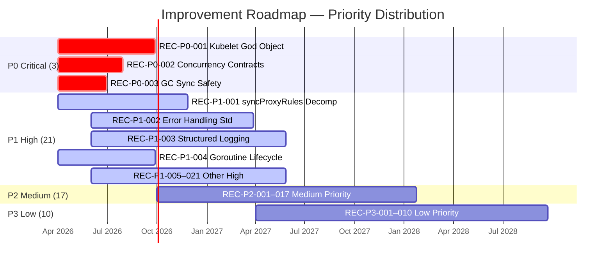
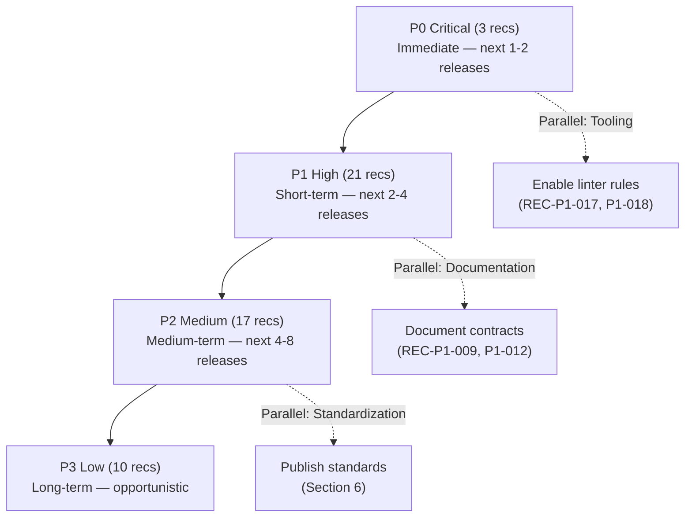

# Kubernetes Code Quality Audit — Improvement Roadmap

> **Document ID:** 08_IMPROVEMENT_ROADMAP  
> **Document Type:** Prioritized Actionable Improvement Plan  
> **Audience:** SIG leads, maintainers, engineering leadership  
> **Methodology:** Every recommendation in this document traces to one or more specific, evidence-based findings cataloged in audit documents 01–07. No recommendation is generic or ungrounded.  
> **Inference Convention:** All referenced findings carry their own Inference Flag (`CONFIRMED` or `INFERRED`) as documented in the source audit documents.

---

## Table of Contents

- [1. Introduction and Methodology](#1-introduction-and-methodology)
  - [1.1 Purpose](#11-purpose)
  - [1.2 Scope](#12-scope)
  - [1.3 Priority Tier Definitions](#13-priority-tier-definitions)
  - [1.4 Recommendation Format](#14-recommendation-format)
  - [1.5 Summary Dashboard](#15-summary-dashboard)
  - [1.6 Priority Distribution Visualization](#16-priority-distribution-visualization)
- [2. P0 — Critical Recommendations](#2-p0--critical-recommendations)
  - [REC-P0-001: Decompose Kubelet God Object to Reduce Maintenance Risk](#rec-p0-001)
  - [REC-P0-002: Document Critical Concurrency Contracts for Informer Cache and Runtime Type System](#rec-p0-002)
  - [REC-P0-003: Address Garbage Collector Incomplete Sync Progression](#rec-p0-003)
- [3. P1 — High Priority Recommendations](#3-p1--high-priority-recommendations)
  - [REC-P1-001: Decompose Monolithic syncProxyRules Functions Across All Proxy Modes](#rec-p1-001)
  - [REC-P1-002: Standardize Error Handling and Error Wrapping Across Modules](#rec-p1-002)
  - [REC-P1-003: Complete Structured Logging Migration](#rec-p1-003)
  - [REC-P1-004: Address Goroutine Lifecycle and Cancellation Gaps](#rec-p1-004)
  - [REC-P1-005: Reduce Kubelet God Object Constructor Complexity](#rec-p1-005)
  - [REC-P1-006: Introduce Concurrency Bounds for Scheduler Binding Goroutines](#rec-p1-006)
  - [REC-P1-007: Eliminate panic() as Control Flow in Production Code](#rec-p1-007)
  - [REC-P1-008: Add Dead-Letter Metrics for Silently Dropped Workqueue Items](#rec-p1-008)
  - [REC-P1-009: Document and Protect Critical Architectural Contracts](#rec-p1-009)
  - [REC-P1-010: Address Context Propagation Failures](#rec-p1-010)
  - [REC-P1-011: Decompose Monolithic Files Exceeding 2,000 Lines](#rec-p1-011)
  - [REC-P1-012: Document Published Staging Module APIs](#rec-p1-012)
  - [REC-P1-013: Enable GoDoc Enforcement Beyond kubeadm](#rec-p1-013)
  - [REC-P1-014: Address Kubelet God Object Testability Impediment](#rec-p1-014)
  - [REC-P1-015: Introduce Injectable Clock Across Controllers and Kubelet](#rec-p1-015)
  - [REC-P1-016: Add Test Coverage Gate to CI Pipeline](#rec-p1-016)
  - [REC-P1-017: Re-enable govet lostcancel and printf Checks](#rec-p1-017)
  - [REC-P1-018: Add Structured Error Handling Lint Enforcement](#rec-p1-018)
  - [REC-P1-019: Improve client-go Test Coverage](#rec-p1-019)
  - [REC-P1-020: Eliminate klog.Fatalf Usage in Control Plane Configuration](#rec-p1-020)
  - [REC-P1-021: Address Correctness Assumptions in Controller Reconciliation and Scheduler Binding](#rec-p1-021)
- [4. P2 — Medium Priority Recommendations](#4-p2--medium-priority-recommendations)
  - [REC-P2-001: Reduce Controller Boilerplate via Shared Base Abstractions](#rec-p2-001)
  - [REC-P2-002: Standardize Import Alias Enforcement](#rec-p2-002)
  - [REC-P2-003: Narrow Controller Client Interface Dependencies](#rec-p2-003)
  - [REC-P2-004: Decompose Large Functions (200–500 Lines)](#rec-p2-004)
  - [REC-P2-005: Address Proxy Mode Structural Duplication](#rec-p2-005)
  - [REC-P2-006: Introduce Cyclomatic Complexity Enforcement](#rec-p2-006)
  - [REC-P2-007: Add Documentation to Undocumented Subsystem Directories](#rec-p2-007)
  - [REC-P2-008: Reduce TODO Backlog and Complete Context Migration](#rec-p2-008)
  - [REC-P2-009: Address PLEG Channel Capacity and Back-Pressure](#rec-p2-009)
  - [REC-P2-010: Improve Test Coverage for Under-Tested Controllers and Subsystems](#rec-p2-010)
  - [REC-P2-011: Reduce Primitive Obsession in Core APIs](#rec-p2-011)
  - [REC-P2-012: Add Duplication Detection Tooling](#rec-p2-012)
  - [REC-P2-013: Re-enable Suppressed staticcheck and gocritic Rules](#rec-p2-013)
  - [REC-P2-014: Externalize Hardcoded Configuration Constants](#rec-p2-014)
  - [REC-P2-015: Reduce Cross-Module Inappropriate Intimacy](#rec-p2-015)
  - [REC-P2-016: Address Platform-Specific Test Isolation Gaps](#rec-p2-016)
  - [REC-P2-017: Stabilize Fragile Proxy and Reflector Logic](#rec-p2-017)
- [5. P3 — Low Priority Recommendations](#5-p3--low-priority-recommendations)
  - [REC-P3-001: Standardize Controller and Admission Plugin Naming Conventions](#rec-p3-001)
  - [REC-P3-002: Update Outdated and Stale Comments](#rec-p3-002)
  - [REC-P3-003: Extract Shared Tombstone and ControllerRef Utilities](#rec-p3-003)
  - [REC-P3-004: Clean Up Deprecation Debt and Legacy API Code](#rec-p3-004)
  - [REC-P3-005: Adopt Hint-Level Linter Rules from golangci-hints.yaml](#rec-p3-005)
  - [REC-P3-006: Implement Pre-Commit Hook Framework](#rec-p3-006)
  - [REC-P3-007: Address Speculative Generalization Across Interfaces](#rec-p3-007)
  - [REC-P3-008: Improve Niche Test Coverage Gaps](#rec-p3-008)
  - [REC-P3-009: Establish Architecture Decision Records (ADRs)](#rec-p3-009)
  - [REC-P3-010: Harmonize Deep Nesting and Magic Constant Patterns](#rec-p3-010)
- [6. Standardization Guidance](#6-standardization-guidance)
  - [6.1 Error Handling Standard](#61-error-handling-standard)
  - [6.2 Naming Convention Standard](#62-naming-convention-standard)
  - [6.3 Logging Standard](#63-logging-standard)
  - [6.4 Validation Standard](#64-validation-standard)
  - [6.5 Import Ordering Standard](#65-import-ordering-standard)
  - [6.6 Test Architecture Standard](#66-test-architecture-standard)
- [7. Tooling Enhancement Recommendations](#7-tooling-enhancement-recommendations)
  - [7.1 Adopt Hint-Level golangci-lint Checks](#71-adopt-hint-level-golangci-lint-checks)
  - [7.2 Pre-Commit Hook Implementation](#72-pre-commit-hook-implementation)
  - [7.3 Enhanced Static Analysis Coverage](#73-enhanced-static-analysis-coverage)
  - [7.4 Automated Dead Code Detection](#74-automated-dead-code-detection)
  - [7.5 Test Coverage Tracking Tooling](#75-test-coverage-tracking-tooling)
- [8. Implementation Strategy](#8-implementation-strategy)
  - [8.1 Recommended Adoption Order](#81-recommended-adoption-order)
  - [8.2 SIG Ownership Mapping](#82-sig-ownership-mapping)
  - [8.3 Incremental Adoption Approach](#83-incremental-adoption-approach)
  - [8.4 Measurement Criteria for Success](#84-measurement-criteria-for-success)
- [9. Appendix — Complete Finding Cross-Reference Index](#9-appendix--complete-finding-cross-reference-index)

---

## 1. Introduction and Methodology

### 1.1 Purpose

This document translates the analytical findings from seven Kubernetes Code Quality Audit dimensions into a **prioritized, actionable improvement roadmap**. Each recommendation:

- Traces to one or more specific **Finding IDs** cataloged in documents [01_CONSISTENCY_AND_STYLE](01_CONSISTENCY_AND_STYLE.md), [02_READABILITY_AND_MAINTAINABILITY](02_READABILITY_AND_MAINTAINABILITY.md), [03_DESIGN_QUALITY](03_DESIGN_QUALITY.md), [04_CORRECTNESS_AND_EFFICIENCY](04_CORRECTNESS_AND_EFFICIENCY.md), [05_DOCUMENTATION_AUDIT](05_DOCUMENTATION_AUDIT.md), [06_TESTABILITY_AND_RELIABILITY](06_TESTABILITY_AND_RELIABILITY.md), and [07_TOOLING_AND_PROCESS](07_TOOLING_AND_PROCESS.md)
- States the **expected benefit** of implementing the recommendation
- Is assigned a **priority tier** (P0/P1/P2/P3) with clear criteria
- Includes **guidance** on standardization, refactoring strategy, and tooling where applicable

### 1.2 Scope

This roadmap covers 210+ findings aggregated across 7 analytical dimensions, consolidated into **51 actionable recommendations** organized by priority. The roadmap is designed for **incremental adoption** — not a Big Bang rewrite. Recommendations are scoped to be independently implementable by the relevant SIG, with cross-cutting recommendations clearly flagged.

**This is documentation only.** No code modifications, refactoring, or fixes are prescribed or performed. Recommendations describe _what should change_ and _why_, not the specific implementation details.

### 1.3 Priority Tier Definitions

| Tier | Label | Criteria | Action Horizon |
|------|-------|----------|----------------|
| **P0** | **Critical** | Correctness risk or active maintenance blocker — issues that can cause bugs, data loss, or prevent routine maintenance | Immediate — next 1–2 release cycles |
| **P1** | **High** | Systemic issue degrading velocity or reliability — patterns that slow development or reduce system reliability across modules | Short-term — next 2–4 release cycles |
| **P2** | **Medium** | Recurrent inconsistency or design debt — repeated patterns that increase cognitive load and maintenance cost | Medium-term — next 4–8 release cycles |
| **P3** | **Low** | Hygiene, polish, or long-horizon improvement — improvements that enhance code quality but have no immediate risk | Long-term — opportunistic adoption |

### 1.4 Recommendation Format

Each recommendation follows this structure:

| Field | Description |
|-------|-------------|
| **Recommendation ID** | Unique identifier: `REC-PX-NNN` |
| **Title** | Concise summary of what should change |
| **Priority** | P0 / P1 / P2 / P3 |
| **Referenced Findings** | Finding IDs from documents 01–07 |
| **Description** | What the problem is and what should change |
| **Expected Benefit** | Specific, measurable improvement |
| **Standardization Guidance** | Applicable conventions or patterns to adopt |
| **Affected Subsystems** | Which SIGs and modules are involved |

### 1.5 Summary Dashboard

| Priority | Recommendations | Referenced Findings | Key Themes |
|----------|----------------|--------------------|----|
| **P0 — Critical** | 3 | 6 | Kubelet god object, undocumented concurrency contracts, GC sync safety |
| **P1 — High** | 21 | 76 | Monolithic functions, error handling, goroutine lifecycle, context propagation, testability, tooling gaps |
| **P2 — Medium** | 17 | 85 | Controller boilerplate, naming, duplication, documentation gaps, coupling reduction, complexity enforcement |
| **P3 — Low** | 10 | 53 | Naming conventions, stale comments, deprecation cleanup, speculative generalization, pre-commit hooks |
| **Total** | **51** | **210+** | |

### 1.6 Priority Distribution Visualization



---

## 2. P0 — Critical Recommendations

P0 recommendations address **correctness risks or active maintenance blockers** that can cause bugs, data loss, or prevent routine maintenance.

---

<a id="rec-p0-001"></a>
### REC-P0-001: Decompose Kubelet God Object to Reduce Maintenance Risk

| Field | Value |
|-------|-------|
| **Recommendation ID** | REC-P0-001 |
| **Priority** | **P0 — Critical** |
| **Referenced Findings** | [READ-016](02_READABILITY_AND_MAINTAINABILITY.md#read-016), [READ-023](02_READABILITY_AND_MAINTAINABILITY.md#read-023), [READ-025](02_READABILITY_AND_MAINTAINABILITY.md#read-025), [DESIGN-008](03_DESIGN_QUALITY.md#design-008) |
| **Affected Subsystems** | kubelet (sig-node) |

**Description:**

The `Kubelet` struct in `pkg/kubelet/kubelet.go` is the single largest maintainability risk in the codebase. As documented in READ-016, the file spans 3,370 lines with 169 methods. READ-023 identifies it as a god file mixing 7+ distinct concerns (pod lifecycle, volume management, node status, eviction, container runtime, garbage collection, and configuration). READ-025 documents the struct itself as 389 lines with 273 fields. DESIGN-008 identifies the struct as a God Object with 80+ fields and 47+ methods.

This concentration makes the kubelet the highest-risk component for defect introduction: any change to pod lifecycle, node status, or volume management requires navigating thousands of lines of interleaved logic.

**Expected Benefit:**

Decomposing the `Kubelet` struct into focused subsystem structs (pod lifecycle manager, node status reporter, volume orchestrator, etc.) would:
- Reduce the defect introduction risk for kubelet changes by isolating concerns
- Enable per-subsystem unit testing without requiring the full god object setup
- Reduce onboarding time for new sig-node contributors
- Align with the existing internal subsystem interfaces (`SyncHandler`, `Bootstrap`) already defined in the codebase

**Standardization Guidance:**

- Follow the existing Manager interface pattern already used in kubelet subsystems (e.g., `ImageGCManager`, `VolumeManager`, `PluginManager`)
- Extract cohesive field groups from the `Kubelet` struct into purpose-built manager structs
- Replace the 31-field `Dependencies` service locator (DESIGN-002) with narrow constructor injection per subsystem
- Preserve the existing `SyncHandler` and `Bootstrap` interfaces as the external contract

Source: `pkg/kubelet/kubelet.go:1132` — `type Kubelet struct`

---

<a id="rec-p0-002"></a>
### REC-P0-002: Document Critical Concurrency Contracts for Informer Cache and Runtime Type System

| Field | Value |
|-------|-------|
| **Recommendation ID** | REC-P0-002 |
| **Priority** | **P0 — Critical** |
| **Referenced Findings** | [DOC-020](05_DOCUMENTATION_AUDIT.md#doc-020), [DOC-021](05_DOCUMENTATION_AUDIT.md#doc-021) |
| **Affected Subsystems** | client-go (sig-api-machinery), apimachinery (sig-api-machinery) |

**Description:**

DOC-020 identifies that `staging/src/k8s.io/client-go/tools/cache/` lacks comprehensive concurrency contract documentation for the Informer lifecycle — the most widely used concurrency primitive in the Kubernetes ecosystem. DOC-021 identifies that `staging/src/k8s.io/apimachinery/pkg/runtime/` type system contracts are underdocumented for external consumers.

These are the two most foundational libraries consumed by every Kubernetes controller and operator. Undocumented concurrency contracts create a correctness risk: external consumers may misuse informers (e.g., accessing the store during resync, or assuming event ordering guarantees that do not exist) leading to subtle, hard-to-diagnose bugs in the broader ecosystem.

**Expected Benefit:**

Documenting concurrency contracts for informer lifecycle (thread safety of Store access, event handler ordering guarantees, resync behavior, cache consistency model) and runtime type system contracts (Object interface requirements, scheme registration ordering, deep copy requirements) would:
- Reduce defect introduction risk in the 2,000+ external Kubernetes operators and controllers
- Provide authoritative reference for contributor onboarding
- Establish a baseline for future API evolution decisions

**Standardization Guidance:**

- Add comprehensive GoDoc comments to `staging/src/k8s.io/client-go/tools/cache/` explaining: thread safety of `Indexer`/`Store` access, `HasSynced` semantics, event handler execution model, and resync guarantees
- Add GoDoc comments to `staging/src/k8s.io/apimachinery/pkg/runtime/` explaining: `Object` interface contract, `Scheme` registration lifecycle, `DeepCopy` requirements, and codec behavior
- Follow the exemplary documentation pattern in `staging/src/k8s.io/client-go/doc.go` (93 lines of comprehensive module documentation)

Source: `staging/src/k8s.io/client-go/tools/cache/`, `staging/src/k8s.io/apimachinery/pkg/runtime/`

---

<a id="rec-p0-003"></a>
### REC-P0-003: Address Garbage Collector Incomplete Sync Progression

| Field | Value |
|-------|-------|
| **Recommendation ID** | REC-P0-003 |
| **Priority** | **P0 — Critical** |
| **Referenced Findings** | [CORRECT-026](04_CORRECTNESS_AND_EFFICIENCY.md#correct-026) |
| **Affected Subsystems** | kube-controller-manager — garbage collector (sig-api-machinery) |

**Description:**

CORRECT-026 documents that the garbage collector proceeds with potentially incomplete resource monitor sync. The GC's `Sync()` method synchronizes resource monitors for discovered API resources, but if the discovery or monitor startup is incomplete, the GC may miss ownerReference relationships and incorrectly garbage-collect objects that still have live owners — or fail to garbage-collect objects whose owners have been deleted.

This is a correctness risk because incomplete sync can lead to premature deletion of objects that appear orphaned only because their owner's resource type was not yet monitored.

**Expected Benefit:**

Ensuring the garbage collector waits for complete resource monitor synchronization (or explicitly documents and guards the partial-sync behavior) would:
- Eliminate the risk of premature object deletion during GC startup or API discovery delays
- Provide a clear operational guarantee about GC behavior during cluster upgrades when API resources change
- Reduce the surface area for subtle object-loss bugs in large multi-resource clusters

**Standardization Guidance:**

- Add explicit synchronization gates or readiness checks before GC begins processing deletion candidates
- Document the expected behavior when resource monitor sync is incomplete (either block or explicitly skip unmonitored resources)
- Add metrics exposing resource monitor sync completeness for operational visibility

Source: `pkg/controller/garbagecollector/garbagecollector.go:172-179`

---

## 3. P1 — High Priority Recommendations

P1 recommendations address **systemic issues degrading velocity or reliability** — patterns that slow development or reduce system reliability across modules.

---

<a id="rec-p1-001"></a>
### REC-P1-001: Decompose Monolithic syncProxyRules Functions Across All Proxy Modes

| Field | Value |
|-------|-------|
| **Recommendation ID** | REC-P1-001 |
| **Priority** | **P1 — High** |
| **Referenced Findings** | [READ-001](02_READABILITY_AND_MAINTAINABILITY.md#read-001), [READ-002](02_READABILITY_AND_MAINTAINABILITY.md#read-002), [READ-004](02_READABILITY_AND_MAINTAINABILITY.md#read-004), [READ-005](02_READABILITY_AND_MAINTAINABILITY.md#read-005), [READ-027](02_READABILITY_AND_MAINTAINABILITY.md#read-027), [READ-033](02_READABILITY_AND_MAINTAINABILITY.md#read-033) |
| **Affected Subsystems** | kube-proxy (sig-network) |

**Description:**

All four proxy modes (iptables: 805 lines, nftables: 727 lines, winkernel: 604 lines, IPVS: 597 lines) contain monolithic `syncProxyRules` functions totaling 2,733 lines of duplicated structural logic. READ-033 confirms this is the single largest cross-mode duplication pattern. READ-027 identifies each proxy mode's `proxier.go` as mixing all concerns into one file.

**Expected Benefit:**

Decomposing each `syncProxyRules` into phases (service iteration, endpoint processing, rule generation, stale chain cleanup, metrics emission) would reduce the 800+ line functions to manageable 50–100 line phase methods, enabling:
- Independent review and testing of each sync phase
- Shared phase abstractions across proxy modes
- Reduced risk of rule generation bugs during proxy changes

**Standardization Guidance:**

- Define a shared `SyncPhase` interface across proxy modes with methods for each phase of rule synchronization
- Extract common state-tracking structs from the duplicated `Proxier` structs (CORRECT-006)
- Implement each phase as a testable method with clear input/output contracts

Source: `pkg/proxy/iptables/proxier.go:735`, `pkg/proxy/nftables/proxier.go:1105`, `pkg/proxy/ipvs/proxier.go:866`, `pkg/proxy/winkernel/proxier.go:1200`

---

<a id="rec-p1-002"></a>
### REC-P1-002: Standardize Error Handling and Error Wrapping Across Modules

| Field | Value |
|-------|-------|
| **Recommendation ID** | REC-P1-002 |
| **Priority** | **P1 — High** |
| **Referenced Findings** | [CONS-005](01_CONSISTENCY_AND_STYLE.md#cons-005), [CONS-015](01_CONSISTENCY_AND_STYLE.md#cons-015), [DESIGN-003](03_DESIGN_QUALITY.md#design-003), [DESIGN-005](03_DESIGN_QUALITY.md#design-005), [CORRECT-019](04_CORRECTNESS_AND_EFFICIENCY.md#correct-019), [CORRECT-021](04_CORRECTNESS_AND_EFFICIENCY.md#correct-021) |
| **Affected Subsystems** | All — kube-controller-manager, kubelet, kube-scheduler, kube-proxy (cross-SIG) |

**Description:**

The codebase exhibits three competing error handling patterns: `utilruntime.HandleError` (logging then discarding), `klog.ErrorS` (structured log then continuing), and `fmt.Errorf` with `%w` or `%v` (wrapping and returning). CONS-005 documents inconsistent `%w` vs `%v` wrapping. CONS-015 documents the inconsistent disposition of errors across modules. DESIGN-003 confirms cross-module divergence. DESIGN-005 identifies that controllers swallow errors in event handlers via `utilruntime.HandleError`. CORRECT-019 identifies explicit `//nolint:errcheck` suppression, and CORRECT-021 shows `resolveControllerRef` masking transient API failures by silently returning nil.

**Expected Benefit:**

Converging on a documented error handling standard per context would:
- Enable `errors.Is`/`errors.As` to work consistently when `%w` is used uniformly
- Surface transient API failures that are currently silently dropped
- Reduce confusion about when to log-and-discard vs. wrap-and-return
- Enable the `errorlint` check (currently hint-only in `hack/golangci-hints.yaml`) to be promoted to mandatory enforcement

**Standardization Guidance:**

- **Controllers:** Return errors from `syncHandler`; let `handleErr` decide retry vs. discard
- **Event handlers:** Use `klog.ErrorS` for structured logging; avoid `utilruntime.HandleError` for new code
- **All wrapping:** Use `%w` exclusively (not `%v`) to preserve error chain
- Promote `errorlint` from hints config to mandatory enforcement (see [TOOL-015](07_TOOLING_AND_PROCESS.md#tool-015))

---

<a id="rec-p1-003"></a>
### REC-P1-003: Complete Structured Logging Migration

| Field | Value |
|-------|-------|
| **Recommendation ID** | REC-P1-003 |
| **Priority** | **P1 — High** |
| **Referenced Findings** | [CONS-006](01_CONSISTENCY_AND_STYLE.md#cons-006), [DESIGN-004](03_DESIGN_QUALITY.md#design-004), [DOC-011](05_DOCUMENTATION_AUDIT.md#doc-011) |
| **Affected Subsystems** | All — kubelet, controllers, scheduler, proxy (cross-SIG) |

**Description:**

CONS-006 documents that the structured logging migration is incomplete, with packages at different stages of migration. DESIGN-004 confirms that mixed structured (`klog.InfoS`/`klog.ErrorS`) and unstructured (`klog.Infof`/`klog.Errorf`) logging coexist within the same kubelet file. DOC-011 documents stale TODOs in `pkg/kubelet/kubelet.go` referencing incomplete contextual logging migration, with 72 `klog.TODO()` calls and 729 `context.TODO()` calls remaining.

**Expected Benefit:**

Completing the structured logging migration would:
- Enable consistent log parsing and aggregation across all Kubernetes components
- Remove 72+ `klog.TODO()` workarounds
- Eliminate the mixed logging pattern that confuses contributors about which style to use

**Standardization Guidance:**

- Migrate all remaining `klog.Infof`/`klog.Errorf` calls to `klog.InfoS`/`klog.ErrorS`
- Replace all `klog.TODO()` with proper logger-from-context extraction: `logger := klog.FromContext(ctx)`
- Use the existing `logcheck` custom linter plugin to enforce structured logging in new code

Source: `pkg/kubelet/kubelet.go:378`, `pkg/kubelet/kubelet.go:2092-2097`

---

<a id="rec-p1-004"></a>
### REC-P1-004: Address Goroutine Lifecycle and Cancellation Gaps

| Field | Value |
|-------|-------|
| **Recommendation ID** | REC-P1-004 |
| **Priority** | **P1 — High** |
| **Referenced Findings** | [CORRECT-009](04_CORRECTNESS_AND_EFFICIENCY.md#correct-009), [CORRECT-015](04_CORRECTNESS_AND_EFFICIENCY.md#correct-015), [CORRECT-034](04_CORRECTNESS_AND_EFFICIENCY.md#correct-034), [CORRECT-035](04_CORRECTNESS_AND_EFFICIENCY.md#correct-035) |
| **Affected Subsystems** | kubelet (sig-node), kube-controller-manager (sig-api-machinery) |

**Description:**

CORRECT-009 identifies that the eviction manager's monitoring goroutine has no cancellation mechanism — it uses `time.Sleep` in an infinite loop without checking `ctx.Done()`. CORRECT-015 documents that `GenericPLEG.Relist()` creates `context.Background()` instead of propagating context from `Start()`. CORRECT-034 identifies that controller `Run()` startup assumes informer cache sync completes within context deadline. CORRECT-035 identifies that the PLEG health check is timing-dependent, producing false positives during container runtime slowdowns.

**Expected Benefit:**

Adding context-aware cancellation to goroutines would:
- Enable clean graceful shutdown of the kubelet and controllers
- Reduce test execution time by allowing goroutine cleanup after test completion
- Eliminate up to 10-second shutdown delays caused by non-interruptible `time.Sleep` loops

**Standardization Guidance:**

- Replace `time.Sleep(interval)` loops with `select { case <-ctx.Done(): return; case <-time.After(interval): }` or `wait.UntilWithContext`
- Replace `context.Background()` with propagated context in long-lived operations
- Use `wait.UntilWithContext(ctx, ...)` uniformly for periodic workers (not `wait.Until(..., ctx.Done())`)

Source: `pkg/kubelet/eviction/eviction_manager.go:209-222`, `pkg/kubelet/pleg/generic.go`

---

<a id="rec-p1-005"></a>
### REC-P1-005: Reduce Kubelet God Object Constructor Complexity

| Field | Value |
|-------|-------|
| **Recommendation ID** | REC-P1-005 |
| **Priority** | **P1 — High** |
| **Referenced Findings** | [DESIGN-009](03_DESIGN_QUALITY.md#design-009), [DESIGN-002](03_DESIGN_QUALITY.md#design-002), [CORRECT-037](04_CORRECTNESS_AND_EFFICIENCY.md#correct-037) |
| **Affected Subsystems** | kubelet (sig-node) |

**Description:**

DESIGN-009 documents that `NewMainKubelet` has 27 parameters. DESIGN-002 identifies the `Dependencies` struct (31 fields) as a service locator pattern. CORRECT-037 identifies that the constructor has 30+ parameters with implicit ordering dependencies, meaning parameter reordering can introduce initialization bugs.

**Expected Benefit:**

Replacing the 27-parameter constructor and 31-field service locator with focused builder patterns or option structs would:
- Reduce constructor call-site complexity
- Make parameter ordering explicit and documented
- Enable incremental kubelet initialization for testing

**Standardization Guidance:**

- Use functional options pattern (`WithXxx(...)`) or typed option structs to group related parameters
- Break `NewMainKubelet` into subsystem-specific initialization phases
- Preserve the `Dependencies` struct concept but decompose into subsystem-scoped dependency groups

Source: `pkg/kubelet/kubelet.go:309-340`

---

<a id="rec-p1-006"></a>
### REC-P1-006: Introduce Concurrency Bounds for Scheduler Binding Goroutines

| Field | Value |
|-------|-------|
| **Recommendation ID** | REC-P1-006 |
| **Priority** | **P1 — High** |
| **Referenced Findings** | [CORRECT-022](04_CORRECTNESS_AND_EFFICIENCY.md#correct-022), [CORRECT-027](04_CORRECTNESS_AND_EFFICIENCY.md#correct-027) |
| **Affected Subsystems** | kube-scheduler (sig-scheduling) |

**Description:**

CORRECT-022 documents that the scheduler assumes a pod is scheduled before the asynchronous bind completes, and CORRECT-027 identifies that the assume-then-bind pattern creates a cache state divergence window. During catch-up scenarios (e.g., scheduler restart with thousands of pending pods), unbounded binding goroutines could cause memory pressure and API server overload.

**Expected Benefit:**

Adding a semaphore or bounded channel to limit concurrent binding goroutines would:
- Prevent memory pressure and API server overload during high-scheduling-load scenarios
- Provide explicit control over bind concurrency as a tunable parameter
- Reduce the cache divergence window by serializing binds when needed

**Standardization Guidance:**

- Use a `semaphore.Weighted` from `golang.org/x/sync/semaphore` to cap concurrent bind operations
- Expose the concurrency limit as a scheduler configuration parameter
- Add metrics tracking binding queue depth alongside the existing `Goroutines` gauge

Source: `pkg/scheduler/schedule_one.go:123-135`

---

<a id="rec-p1-007"></a>
### REC-P1-007: Eliminate panic() as Control Flow in Production Code

| Field | Value |
|-------|-------|
| **Recommendation ID** | REC-P1-007 |
| **Priority** | **P1 — High** |
| **Referenced Findings** | [CORRECT-012](04_CORRECTNESS_AND_EFFICIENCY.md#correct-012) |
| **Affected Subsystems** | kubelet — PLEG (sig-node) |

**Description:**

CORRECT-012 documents that `panic()` is used as control flow in PLEG state conversion functions. A panic in production code causes the entire kubelet process to crash, which is disproportionate to a state conversion failure that could be handled gracefully.

**Expected Benefit:**

Replacing `panic()` with error returns in PLEG state conversion would:
- Prevent kubelet crashes due to unexpected container state values
- Enable graceful degradation with logged errors instead of process termination
- Align with Go best practices: "Don't panic" for expected error conditions

**Standardization Guidance:**

- Replace all production-path `panic()` calls with error returns
- Reserve `panic()` for truly unrecoverable programming errors (unreachable code, invariant violations in tests)
- Add `gopanic` linter configuration to flag new `panic()` usage in non-test code

Source: `pkg/kubelet/pleg/`

---

<a id="rec-p1-008"></a>
### REC-P1-008: Add Dead-Letter Metrics for Silently Dropped Workqueue Items

| Field | Value |
|-------|-------|
| **Recommendation ID** | REC-P1-008 |
| **Priority** | **P1 — High** |
| **Referenced Findings** | [CORRECT-008](04_CORRECTNESS_AND_EFFICIENCY.md#correct-008) |
| **Affected Subsystems** | kube-controller-manager — all controllers (sig-api-machinery, and controller-specific SIGs) |

**Description:**

CORRECT-008 documents that the `handleErr` pattern across controllers silently discards workqueue items after `maxRetries` (typically 15) attempts with only a log entry. There is no mechanism to surface these permanently failed items via metrics, alerts, or a dead-letter queue. The inconsistency in `NamespaceTerminatingCause` handling means different controllers react differently to namespace deletion.

**Expected Benefit:**

Adding a "dropped items" counter metric per controller would:
- Enable monitoring and alerting on reconciliation failures that are silently swallowed
- Provide operational visibility into controllers that are persistently failing to reconcile specific resources
- Allow SREs to identify and remediate stuck resources before they impact cluster health

**Standardization Guidance:**

- Add a `controller_dropped_work_items_total` counter metric labeled by controller name and error class
- Standardize the `NamespaceTerminatingCause` handling across all controllers
- Consider adding a dead-letter log or event for items that exceed `maxRetries`

Source: `pkg/controller/deployment/deployment_controller.go:506-526`

---

<a id="rec-p1-009"></a>
### REC-P1-009: Document and Protect Critical Architectural Contracts

| Field | Value |
|-------|-------|
| **Recommendation ID** | REC-P1-009 |
| **Priority** | **P1 — High** |
| **Referenced Findings** | [DOC-022](05_DOCUMENTATION_AUDIT.md#doc-022), [DOC-023](05_DOCUMENTATION_AUDIT.md#doc-023), [DOC-024](05_DOCUMENTATION_AUDIT.md#doc-024), [DOC-025](05_DOCUMENTATION_AUDIT.md#doc-025), [CORRECT-024](04_CORRECTNESS_AND_EFFICIENCY.md#correct-024), [CORRECT-030](04_CORRECTNESS_AND_EFFICIENCY.md#correct-030) |
| **Affected Subsystems** | All major subsystems (cross-SIG) |

**Description:**

DOC-022 through DOC-025 document that critical architectural patterns are undocumented: validation rule contracts (DOC-022), controller reconciliation patterns (DOC-023), admission plugin lifecycle (DOC-024), and apiserver framework usage for extension developers (DOC-025). CORRECT-024 identifies that controller reconciliation assumes informer cache eventual consistency without documenting this assumption. CORRECT-030 identifies that controller endpoint reconciliation TTL may expire under etcd load.

**Expected Benefit:**

Documenting architectural contracts at the package level would:
- Reduce onboarding time for new contributors to each subsystem
- Prevent correctness bugs caused by undocumented assumptions
- Establish a reference baseline for future architectural decisions

**Standardization Guidance:**

- Add comprehensive `doc.go` files to `pkg/controller/`, `pkg/apis/*/validation/`, `plugin/pkg/admission/`, `staging/src/k8s.io/apiserver/`
- Document the informer-driven reconciliation pattern as a canonical reference in `pkg/controller/doc.go`
- Create a new `plugin/pkg/admission/doc.go` to document admission plugin registration and lifecycle (this file does not currently exist)

---

<a id="rec-p1-010"></a>
### REC-P1-010: Address Context Propagation Failures

| Field | Value |
|-------|-------|
| **Recommendation ID** | REC-P1-010 |
| **Priority** | **P1 — High** |
| **Referenced Findings** | [CORRECT-015](04_CORRECTNESS_AND_EFFICIENCY.md#correct-015), [CORRECT-016](04_CORRECTNESS_AND_EFFICIENCY.md#correct-016), [CORRECT-017](04_CORRECTNESS_AND_EFFICIENCY.md#correct-017), [CORRECT-018](04_CORRECTNESS_AND_EFFICIENCY.md#correct-018) |
| **Affected Subsystems** | kubelet (sig-node) |

**Description:**

Four findings document context propagation failures in the kubelet: CORRECT-015 (PLEG Relist creates `context.Background()` instead of propagating parent context), CORRECT-016 (eviction manager `Admit()` creates `context.Background()` in admission-path code), CORRECT-017 (`context.TODO()` used in `makePodSourceConfig` for long-lived operations), and CORRECT-018 (shared informer factory started with `wait.NeverStop` instead of parent context).

**Expected Benefit:**

Propagating parent context through the kubelet call stack would:
- Enable proper cancellation propagation during graceful shutdown
- Allow distributed tracing instrumentation to flow through kubelet operations
- Eliminate 729+ `context.TODO()` workarounds across the codebase

**Standardization Guidance:**

- Replace `context.Background()` and `context.TODO()` with parent context propagation
- Use `wait.NeverStop` only at the true process-level root; use context-based cancellation for all subsystem lifecycle management
- Prioritize `pkg/kubelet/` context propagation alongside the structured logging migration (REC-P1-003)

Source: `pkg/kubelet/kubelet.go:378`, `pkg/kubelet/pleg/generic.go`, `pkg/kubelet/eviction/eviction_manager.go`

---

<a id="rec-p1-011"></a>
### REC-P1-011: Decompose Monolithic Files Exceeding 2,000 Lines

| Field | Value |
|-------|-------|
| **Recommendation ID** | REC-P1-011 |
| **Priority** | **P1 — High** |
| **Referenced Findings** | [READ-015](02_READABILITY_AND_MAINTAINABILITY.md#read-015), [READ-017](02_READABILITY_AND_MAINTAINABILITY.md#read-017), [READ-019](02_READABILITY_AND_MAINTAINABILITY.md#read-019), [READ-024](02_READABILITY_AND_MAINTAINABILITY.md#read-024) |
| **Affected Subsystems** | Core API validation (sig-api-machinery), kubelet (sig-node), kuberuntime (sig-node) |

**Description:**

READ-015 identifies `pkg/apis/core/validation/validation.go` at 9,600 lines — the single largest non-generated Go source file. READ-017 documents `kubelet_pods.go` at 2,844 lines. READ-019 documents `kubeGenericRuntimeManager` with 104 methods. READ-024 identifies `kubelet_pods.go` as mixing 5 distinct pod operation concerns.

**Expected Benefit:**

Splitting files exceeding 2,000 lines into focused files per concern would:
- Reduce merge conflicts in high-traffic files
- Enable targeted code review per concern area
- Improve IDE navigation and code search effectiveness

**Standardization Guidance:**

- Split `validation.go` by API resource group (one validation file per resource type)
- Split `kubelet_pods.go` into: pod creation, pod deletion, pod status conversion, pod volume handling, and pod security
- Split `kubeGenericRuntimeManager` methods into per-lifecycle-phase files

Source: `pkg/apis/core/validation/validation.go`, `pkg/kubelet/kubelet_pods.go`, `pkg/kubelet/kuberuntime/kuberuntime_manager.go`

---

<a id="rec-p1-012"></a>
### REC-P1-012: Document Published Staging Module APIs

| Field | Value |
|-------|-------|
| **Recommendation ID** | REC-P1-012 |
| **Priority** | **P1 — High** |
| **Referenced Findings** | [DOC-002](05_DOCUMENTATION_AUDIT.md#doc-002), [DOC-003](05_DOCUMENTATION_AUDIT.md#doc-003), [DOC-016](05_DOCUMENTATION_AUDIT.md#doc-016) |
| **Affected Subsystems** | staging modules (sig-api-machinery, sig-cli, sig-node, sig-auth) |

**Description:**

DOC-002 identifies that `apimachinery` — the most foundational published module — has zero package documentation. DOC-003 identifies 15 of 31 published modules with minimal or absent top-level documentation. DOC-016 identifies `apiserver` with 487 undocumented exports (25.2% undocumented), the lowest coverage of any critical published module.

**Expected Benefit:**

Adding comprehensive `doc.go` documentation to published modules would:
- Improve discoverability for the 2,000+ external Go projects consuming these modules
- Reduce support burden from ecosystem consumers confused about module purpose and usage
- Establish a quality baseline for externally published APIs

**Standardization Guidance:**

- Follow the `client-go/doc.go` exemplary pattern (93 lines of documentation explaining key packages, usage patterns)
- Prioritize: `apimachinery`, `apiserver`, `api`, `kubectl`, `kubelet`, `component-base`
- Include: module purpose, key packages, entry points, and usage examples

---

<a id="rec-p1-013"></a>
### REC-P1-013: Enable GoDoc Enforcement Beyond kubeadm

| Field | Value |
|-------|-------|
| **Recommendation ID** | REC-P1-013 |
| **Priority** | **P1 — High** |
| **Referenced Findings** | [DOC-030](05_DOCUMENTATION_AUDIT.md#doc-030), [TOOL-008](07_TOOLING_AND_PROCESS.md#tool-008) |
| **Affected Subsystems** | All — tooling (sig-testing, sig-architecture) |

**Description:**

DOC-030 documents that GoDoc comment enforcement via `revive` and `staticcheck` is suppressed for all packages except `cmd/kubeadm`. TOOL-008 confirms this is an explicit linter configuration choice. The result is that new exported symbols across the codebase can be introduced without any documentation, and CI will not flag it.

**Expected Benefit:**

Progressively enabling GoDoc enforcement across major subsystems would:
- Prevent new undocumented public APIs from being introduced
- Drive incremental documentation improvement through CI enforcement
- Close the gap between kubeadm (enforced) and all other packages (unenforced)

**Standardization Guidance:**

- Phase 1: Enable for `staging/src/k8s.io/api/` and `staging/src/k8s.io/apimachinery/` (highest external visibility)
- Phase 2: Enable for `staging/src/k8s.io/client-go/` and `staging/src/k8s.io/apiserver/`
- Phase 3: Enable for `pkg/controller/`, `pkg/kubelet/`, `pkg/scheduler/`
- Use the existing `revive` `exported` rule and `staticcheck` `ST1000` check

---

<a id="rec-p1-014"></a>
### REC-P1-014: Address Kubelet God Object Testability Impediment

| Field | Value |
|-------|-------|
| **Recommendation ID** | REC-P1-014 |
| **Priority** | **P1 — High** |
| **Referenced Findings** | [TEST-005](06_TESTABILITY_AND_RELIABILITY.md#test-005), [TEST-014](06_TESTABILITY_AND_RELIABILITY.md#test-014), [TEST-017](06_TESTABILITY_AND_RELIABILITY.md#test-017) |
| **Affected Subsystems** | kubelet (sig-node) |

**Description:**

TEST-005 identifies the `Kubelet` struct as a god object impeding unit test isolation — constructing a minimal instance requires initializing 170+ fields. TEST-014 documents 49 internal package imports creating extreme fan-out coupling. TEST-017 identifies the hub-and-spoke pattern in kubelet creating a testability bottleneck.

**Expected Benefit:**

Reducing kubelet coupling and decomposing the god object would:
- Enable per-subsystem unit testing without requiring full kubelet initialization
- Reduce test setup complexity from 170+ fields to focused subsystem dependencies
- Allow independent test execution for pod lifecycle, volume management, and node status

**Standardization Guidance:**

- Define narrow interfaces for each kubelet subsystem consumer (not the full `Kubelet` struct)
- Create test-specific builders that construct minimal subsystem instances
- Follow the exemplary pattern in `cadvisor` (TEST-007) and `kuberuntime` (TEST-008) which already have strong testability

---

<a id="rec-p1-015"></a>
### REC-P1-015: Introduce Injectable Clock Across Controllers and Kubelet

| Field | Value |
|-------|-------|
| **Recommendation ID** | REC-P1-015 |
| **Priority** | **P1 — High** |
| **Referenced Findings** | [TEST-032](06_TESTABILITY_AND_RELIABILITY.md#test-032), [TEST-033](06_TESTABILITY_AND_RELIABILITY.md#test-033), [TEST-040](06_TESTABILITY_AND_RELIABILITY.md#test-040) |
| **Affected Subsystems** | kube-controller-manager, kubelet (sig-node, sig-api-machinery) |

**Description:**

TEST-032 documents widespread use of `time.Now()` in controllers without injectable clock. TEST-033 documents `time.Now()` used directly in 20+ kubelet source files. TEST-040 identifies that only select controllers and subsystems use the injectable `clock.WithTicker` pattern, creating an inconsistency.

**Expected Benefit:**

Standardizing on `clock.Clock` injection across all controllers and kubelet subsystems would:
- Eliminate flaky time-dependent tests
- Enable deterministic testing of timeout, retry, and scheduling logic
- Follow the positive pattern already established in select subsystems (TEST-040)

**Standardization Guidance:**

- Use `k8s.io/utils/clock.Clock` interface for all time-dependent logic
- Inject clock through constructor parameters or option structs
- Replace direct `time.Now()`, `time.Since()`, `time.After()` calls with clock methods

---

<a id="rec-p1-016"></a>
### REC-P1-016: Add Test Coverage Gate to CI Pipeline

| Field | Value |
|-------|-------|
| **Recommendation ID** | REC-P1-016 |
| **Priority** | **P1 — High** |
| **Referenced Findings** | [TOOL-004](07_TOOLING_AND_PROCESS.md#tool-004) |
| **Affected Subsystems** | CI/CD infrastructure (sig-testing) |

**Description:**

TOOL-004 identifies that there is no test coverage gate in CI. New code can be merged without any test coverage requirement, and there is no mechanism to detect test coverage regressions.

**Expected Benefit:**

Adding test coverage tracking and minimum coverage gates for new code would:
- Prevent test coverage regression on modified packages
- Provide visibility into which subsystems have the lowest coverage
- Incentivize test writing as part of feature development

**Standardization Guidance:**

- Add `go test -coverprofile` integration to `hack/make-rules/test.sh`
- Implement a Prow coverage bot that reports per-package coverage on PRs
- Start with coverage-on-diff reporting (no hard gate) and graduate to minimum coverage thresholds for critical packages

---

<a id="rec-p1-017"></a>
### REC-P1-017: Re-enable govet lostcancel and printf Checks

| Field | Value |
|-------|-------|
| **Recommendation ID** | REC-P1-017 |
| **Priority** | **P1 — High** |
| **Referenced Findings** | [TOOL-010](07_TOOLING_AND_PROCESS.md#tool-010) |
| **Affected Subsystems** | Tooling (sig-testing, sig-architecture) |

**Description:**

TOOL-010 identifies that `govet lostcancel` and `printf` checks are suppressed globally. The `lostcancel` check detects context leak bugs — exactly the class of issues identified in CORRECT-009 and CORRECT-015. Suppressing it allows new context leak bugs to be introduced undetected.

**Expected Benefit:**

Re-enabling these checks would:
- Detect new context leak bugs at CI time instead of discovering them in production
- Detect printf format string mismatches that cause runtime panics
- Reduce the class of correctness bugs documented in Section 2 of document 04

**Standardization Guidance:**

- Remove `lostcancel` and `printf` from the govet suppression list in `hack/golangci.yaml`
- Fix existing violations incrementally per SIG
- Run in hint mode first to assess violation count, then promote to mandatory

---

<a id="rec-p1-018"></a>
### REC-P1-018: Add Structured Error Handling Lint Enforcement

| Field | Value |
|-------|-------|
| **Recommendation ID** | REC-P1-018 |
| **Priority** | **P1 — High** |
| **Referenced Findings** | [TOOL-015](07_TOOLING_AND_PROCESS.md#tool-015) |
| **Affected Subsystems** | Tooling (sig-testing, sig-architecture) |

**Description:**

TOOL-015 identifies that there is no structured error handling lint enforcement beyond `govet`. The `errorlint` check (available in `hack/golangci-hints.yaml`) detects improper error wrapping (`%v` instead of `%w`), direct error comparison instead of `errors.Is`, and type assertion instead of `errors.As`. These are precisely the patterns flagged in CONS-005 and DESIGN-003.

**Expected Benefit:**

Promoting `errorlint` to mandatory enforcement would:
- Prevent new error wrapping regressions from being introduced
- Ensure `errors.Is`/`errors.As` work consistently throughout the codebase
- Complement the error handling standardization in REC-P1-002

**Standardization Guidance:**

- Promote `errorlint` from `hack/golangci-hints.yaml` to `hack/golangci.yaml`
- Fix existing violations incrementally, prioritizing `pkg/controller/` and `pkg/kubelet/`

---

<a id="rec-p1-019"></a>
### REC-P1-019: Improve client-go Test Coverage

| Field | Value |
|-------|-------|
| **Recommendation ID** | REC-P1-019 |
| **Priority** | **P1 — High** |
| **Referenced Findings** | [TEST-019](06_TESTABILITY_AND_RELIABILITY.md#test-019) |
| **Affected Subsystems** | client-go (sig-api-machinery) |

**Description:**

TEST-019 documents that `staging/src/k8s.io/client-go` has a critically low test-to-source ratio of 0.07. As the most widely consumed Kubernetes library (used by every controller, operator, and CLI tool), inadequate test coverage creates ecosystem-wide reliability risk.

**Expected Benefit:**

Improving client-go test coverage would:
- Reduce the risk of regressions in the most consumed Kubernetes module
- Protect informer, workqueue, and rest client behavior that the entire ecosystem depends on
- Establish a quality baseline for the most critical external dependency

**Standardization Guidance:**

- Prioritize test coverage for `tools/cache/` (informers), `tools/record/` (events), `rest/` (REST client), `kubernetes/` (typed client)
- Use the existing `fake` client infrastructure for unit tests
- Target test-to-source ratio improvement from 0.07 to at least 0.30

---

<a id="rec-p1-020"></a>
### REC-P1-020: Eliminate klog.Fatalf Usage in Control Plane Configuration

| Field | Value |
|-------|-------|
| **Recommendation ID** | REC-P1-020 |
| **Priority** | **P1 — High** |
| **Referenced Findings** | [CORRECT-023](04_CORRECTNESS_AND_EFFICIENCY.md#correct-023) |
| **Affected Subsystems** | Control plane binaries (sig-api-machinery, sig-node) |

**Description:**

CORRECT-023 documents `klog.Fatalf` used for error handling in control plane configuration, preventing graceful error propagation. `klog.Fatalf` calls `os.Exit(255)` which bypasses deferred cleanup functions, which can lead to data corruption in etcd or incomplete shutdown sequences.

**Expected Benefit:**

Replacing `klog.Fatalf` with proper error returns in configuration paths would:
- Enable graceful shutdown sequences that complete deferred cleanup
- Allow integration tests to verify configuration error handling without process termination
- Align with Go best practices: "Log.Fatal should only be called in main()"

**Standardization Guidance:**

- Replace `klog.Fatalf` in configuration/initialization code with `return fmt.Errorf(...)` propagated to the caller
- Reserve `klog.Fatalf` for truly unrecoverable situations in `main()` only

---

<a id="rec-p1-021"></a>
### REC-P1-021: Address Correctness Assumptions in Controller Reconciliation and Scheduler Binding

| Field | Value |
|-------|-------|
| **Recommendation ID** | REC-P1-021 |
| **Priority** | **P1 — High** |
| **Referenced Findings** | [CORRECT-024](04_CORRECTNESS_AND_EFFICIENCY.md#correct-024), [CORRECT-027](04_CORRECTNESS_AND_EFFICIENCY.md#correct-027), [CORRECT-030](04_CORRECTNESS_AND_EFFICIENCY.md#correct-030) |
| **Affected Subsystems** | kube-controller-manager (sig-api-machinery), kube-scheduler (sig-scheduling) |

**Description:**

CORRECT-024 documents that controller reconciliation assumes informer cache eventual consistency without documenting or guarding this assumption. CORRECT-027 identifies the scheduler assume-then-bind cache divergence window. CORRECT-030 identifies that controller endpoint reconciliation TTL may expire under etcd load.

These are fundamental correctness assumptions — valid under normal conditions but potentially violated under cluster stress, API server partitions, or etcd performance degradation.

**Expected Benefit:**

Documenting and guarding these correctness assumptions would:
- Provide operators with clear expectations about behavior under stress
- Enable monitoring for assumption violations (e.g., cache staleness metrics)
- Guide future hardening work with precise problem statements

**Standardization Guidance:**

- Add GoDoc comments to controller `Run()` methods documenting cache consistency assumptions
- Add metrics exposing informer cache staleness and sync lag
- Document the assume-then-bind window in the scheduler's scheduling cycle comments

---

## 4. P2 — Medium Priority Recommendations

P2 recommendations address **recurrent inconsistencies and design debt** — repeated patterns that increase cognitive load and maintenance cost.

---

<a id="rec-p2-001"></a>
### REC-P2-001: Reduce Controller Boilerplate via Shared Base Abstractions

| Field | Value |
|-------|-------|
| **Recommendation ID** | REC-P2-001 |
| **Priority** | **P2 — Medium** |
| **Referenced Findings** | [CORRECT-001](04_CORRECTNESS_AND_EFFICIENCY.md#correct-001), [CORRECT-002](04_CORRECTNESS_AND_EFFICIENCY.md#correct-002), [CORRECT-007](04_CORRECTNESS_AND_EFFICIENCY.md#correct-007), [READ-029](02_READABILITY_AND_MAINTAINABILITY.md#read-029), [READ-030](02_READABILITY_AND_MAINTAINABILITY.md#read-030), [READ-031](02_READABILITY_AND_MAINTAINABILITY.md#read-031) |
| **Affected Subsystems** | kube-controller-manager — all 36 controllers (cross-SIG) |

**Description:**

Six findings document identical boilerplate duplicated across all 36 controllers: struct and constructor patterns (CORRECT-001, READ-030), informer event handler wiring (CORRECT-002), the `worker` → `processNextWorkItem` → `syncHandler` → `handleErr` call chain (CORRECT-007, READ-029), and `utilruntime.HandleError` calls (READ-031). This amounts to ~144 methods implementing identical logic independently.

**Expected Benefit:**

Extracting a shared controller base abstraction (e.g., `controller.Base`) with the common workqueue loop, informer wiring, and error handling would:
- Reduce the 36-controller boilerplate footprint by ~50%
- Enable cross-cutting improvements (e.g., new retry strategies) with a single change
- Eliminate existing divergence in `handleErr` behavior (CORRECT-008)

**Standardization Guidance:**

- Create a `pkg/controller/base/` package providing `Base` struct with embedded workqueue, informer sync check, and standard worker loop
- Allow controllers to compose `Base` via embedding and override only the `syncHandler`
- Follow the positive exemplar of the `syncHandler` injection pattern (TEST-002) already in use

---

<a id="rec-p2-002"></a>
### REC-P2-002: Standardize Import Alias Enforcement

| Field | Value |
|-------|-------|
| **Recommendation ID** | REC-P2-002 |
| **Priority** | **P2 — Medium** |
| **Referenced Findings** | [CONS-003](01_CONSISTENCY_AND_STYLE.md#cons-003), [CONS-004](01_CONSISTENCY_AND_STYLE.md#cons-004), [CONS-016](01_CONSISTENCY_AND_STYLE.md#cons-016) |
| **Affected Subsystems** | All — tooling enforcement (sig-architecture) |

**Description:**

CONS-003, CONS-004, and CONS-016 document inconsistent import aliasing: `apps` instead of enforced `appsv1`, missing `apierrors` alias for `k8s.io/apimachinery/pkg/api/errors`, and `utilfeature` vs `feature` for the feature gate utility. The `hack/.import-aliases` file defines expected aliases, but enforcement appears incomplete.

**Expected Benefit:**

Enforcing consistent import aliases would:
- Eliminate cognitive overhead from reading different aliases for the same package
- Enable reliable codebase-wide search/replace operations
- Align with the existing `hack/.import-aliases` reference

**Standardization Guidance:**

- Strengthen `hack/verify-imports.sh` to enforce all aliases in `hack/.import-aliases`
- Add new aliases to cover observed inconsistencies (CONS-016)
- Run migration scripts to fix existing violations before enabling enforcement

---

<a id="rec-p2-003"></a>
### REC-P2-003: Narrow Controller Client Interface Dependencies

| Field | Value |
|-------|-------|
| **Recommendation ID** | REC-P2-003 |
| **Priority** | **P2 — Medium** |
| **Referenced Findings** | [DESIGN-001](03_DESIGN_QUALITY.md#design-001) |
| **Affected Subsystems** | kube-controller-manager — all controllers (cross-SIG) |

**Description:**

DESIGN-001 documents that controllers accept the full `clientset.Interface` (entire Kubernetes API client) when they only use 1–2 subclients (e.g., `AppsV1()`, `CoreV1().Events()`). This creates an unnecessarily wide dependency surface.

**Expected Benefit:**

Narrowing controller client dependencies to purpose-specific interfaces would:
- Reduce mock setup complexity in tests (from full clientset to narrow interface)
- Make controller dependencies self-documenting
- Enable compile-time detection of unexpected API usage

**Standardization Guidance:**

- Define narrow client interfaces per controller (e.g., `DeploymentClient` with only `AppsV1().Deployments()` and event recording)
- Accept narrow interfaces in constructors; adapt in the controller-manager wiring layer
- Migrate incrementally, starting with the most frequently tested controllers

---

<a id="rec-p2-004"></a>
### REC-P2-004: Decompose Large Functions (200–500 Lines)

| Field | Value |
|-------|-------|
| **Recommendation ID** | REC-P2-004 |
| **Priority** | **P2 — Medium** |
| **Referenced Findings** | [READ-006](02_READABILITY_AND_MAINTAINABILITY.md#read-006), [READ-007](02_READABILITY_AND_MAINTAINABILITY.md#read-007), [READ-008](02_READABILITY_AND_MAINTAINABILITY.md#read-008), [READ-009](02_READABILITY_AND_MAINTAINABILITY.md#read-009), [READ-010](02_READABILITY_AND_MAINTAINABILITY.md#read-010), [READ-011](02_READABILITY_AND_MAINTAINABILITY.md#read-011), [READ-012](02_READABILITY_AND_MAINTAINABILITY.md#read-012), [READ-013](02_READABILITY_AND_MAINTAINABILITY.md#read-013), [READ-014](02_READABILITY_AND_MAINTAINABILITY.md#read-014) |
| **Affected Subsystems** | kubelet (sig-node), controllers (cross-SIG), API validation (sig-api-machinery) |

**Description:**

Nine findings catalog functions between 200–500 lines across the kubelet (`convertToAPIContainerStatuses` at 417 lines, `SyncPod` at 317 lines, `HandlePodCleanups` at 263 lines, kubelet `SyncPod` at 231 lines), controllers (`syncJob` at 269 lines, `rollingUpdate` at 217 lines, `reconcileAutoscaler` at 214 lines), and validation (`ValidateKubeletConfiguration` at 350 lines, `ValidatePersistentVolumeSpec` at 296 lines).

**Expected Benefit:**

Decomposing these functions into focused sub-operations would:
- Reduce the defect introduction risk for changes to these critical paths
- Enable targeted unit testing of individual phases
- Improve code review effectiveness for large function modifications

**Standardization Guidance:**

- Target maximum function size of 100 lines for new code
- Extract distinct phases into named methods (e.g., `syncJobPhaseCreatePods`, `syncJobPhaseDeletePods`)
- Prioritize decomposition by change frequency — the most-modified functions benefit most

---

<a id="rec-p2-005"></a>
### REC-P2-005: Address Proxy Mode Structural Duplication

| Field | Value |
|-------|-------|
| **Recommendation ID** | REC-P2-005 |
| **Priority** | **P2 — Medium** |
| **Referenced Findings** | [CORRECT-006](04_CORRECTNESS_AND_EFFICIENCY.md#correct-006), [READ-034](02_READABILITY_AND_MAINTAINABILITY.md#read-034) |
| **Affected Subsystems** | kube-proxy (sig-network) |

**Description:**

CORRECT-006 documents structurally identical `Proxier` structs across iptables, IPVS, and nftables modes. READ-034 confirms constructor and structural patterns duplicated across all four modes. When the proxy infrastructure adds shared fields, every mode must be updated independently.

**Expected Benefit:**

Extracting a shared `ProxierBase` struct with common fields would:
- Reduce the maintenance burden of cross-mode changes
- Ensure consistent mutex, sync-runner, and service/endpoint tracking behavior
- Enable shared testing of common proxy state management

**Standardization Guidance:**

- Create `pkg/proxy/base/` with `ProxierBase` struct containing shared fields
- Have each mode's `Proxier` embed `ProxierBase` and add mode-specific fields
- Share constructor logic for common fields

---

<a id="rec-p2-006"></a>
### REC-P2-006: Introduce Cyclomatic Complexity Enforcement

| Field | Value |
|-------|-------|
| **Recommendation ID** | REC-P2-006 |
| **Priority** | **P2 — Medium** |
| **Referenced Findings** | [TOOL-002](07_TOOLING_AND_PROCESS.md#tool-002), [DESIGN-007](03_DESIGN_QUALITY.md#design-007), [DESIGN-010](03_DESIGN_QUALITY.md#design-010) |
| **Affected Subsystems** | Tooling (sig-testing, sig-architecture) |

**Description:**

TOOL-002 documents the absence of cyclomatic complexity enforcement. DESIGN-007 and DESIGN-010 document the 9,600-line monolithic validation module as a direct consequence — functions grow unchecked because no CI gate flags them.

**Expected Benefit:**

Adding cyclomatic complexity checks to `golangci-lint` would:
- Prevent new monolithic functions from being introduced
- Provide an objective metric for function decomposition discussions
- Complement the manual findings in document 02

**Standardization Guidance:**

- Enable `gocyclo` or `cyclop` linter in `hack/golangci.yaml` with an initial threshold of 30 (catching the worst outliers)
- Gradually reduce the threshold as existing violations are fixed
- Start in hint mode to assess violation count

---

<a id="rec-p2-007"></a>
### REC-P2-007: Add Documentation to Undocumented Subsystem Directories

| Field | Value |
|-------|-------|
| **Recommendation ID** | REC-P2-007 |
| **Priority** | **P2 — Medium** |
| **Referenced Findings** | [DOC-001](05_DOCUMENTATION_AUDIT.md#doc-001), [DOC-005](05_DOCUMENTATION_AUDIT.md#doc-005), [DOC-006](05_DOCUMENTATION_AUDIT.md#doc-006), [DOC-007](05_DOCUMENTATION_AUDIT.md#doc-007), [DOC-008](05_DOCUMENTATION_AUDIT.md#doc-008), [DOC-017](05_DOCUMENTATION_AUDIT.md#doc-017), [DOC-026](05_DOCUMENTATION_AUDIT.md#doc-026), [DOC-027](05_DOCUMENTATION_AUDIT.md#doc-027) |
| **Affected Subsystems** | kubelet (sig-node), controllers (cross-SIG), admission plugins (sig-auth), API validation (sig-api-machinery), registry (sig-api-machinery) |

**Description:**

Eight findings document missing `doc.go` files across major subsystems: 18 of 26 `pkg/apis/` API groups (DOC-001), 29 of 44 kubelet subsystems (DOC-005), 20 of 36 controller directories (DOC-006), 18 of 25 admission plugins (DOC-007), 19 of 20 validation packages (DOC-008), `pkg/registry/` with lowest GoDoc coverage at 80.3% (DOC-017), undocumented kubelet architecture (DOC-026), and undocumented registry storage layer (DOC-027).

**Expected Benefit:**

Adding `doc.go` files with meaningful package descriptions would:
- Enable Go documentation tooling (`go doc`) to provide useful output for all packages
- Reduce onboarding time for contributors navigating unfamiliar subsystems
- Establish a documentation baseline for future enforcement (REC-P1-013)

**Standardization Guidance:**

- Create `doc.go` templates per subsystem type (controller, admission plugin, validation, registry)
- Each `doc.go` should explain: what the package does, what resources or concepts it manages, and its relationship to the broader subsystem
- Prioritize packages with the highest contributor traffic: `pkg/controller/deployment/`, `pkg/kubelet/container/`, `pkg/kubelet/status/`

---

<a id="rec-p2-008"></a>
### REC-P2-008: Reduce TODO Backlog and Complete Context Migration

| Field | Value |
|-------|-------|
| **Recommendation ID** | REC-P2-008 |
| **Priority** | **P2 — Medium** |
| **Referenced Findings** | [DOC-004](05_DOCUMENTATION_AUDIT.md#doc-004), [DOC-011](05_DOCUMENTATION_AUDIT.md#doc-011), [READ-041](02_READABILITY_AND_MAINTAINABILITY.md#read-041) |
| **Affected Subsystems** | All (cross-SIG) |

**Description:**

DOC-004 documents 5,807 TODO comments across the codebase. DOC-011 identifies stale TODOs for context propagation in kubelet. READ-041 documents 896 TODO markers across `pkg/` alone. The combination of stale TODOs and incomplete `context.TODO()` migration creates documentation debt and code quality noise.

**Expected Benefit:**

Auditing and triaging the TODO backlog would:
- Remove noise from stale TODOs referencing resolved or closed issues
- Surface actionable work items that are genuinely pending
- Complete the `context.TODO()` → proper context propagation migration

**Standardization Guidance:**

- Run a bulk TODO triage: close TODOs referencing resolved GitHub issues, convert actionable TODOs to tracked issues
- Replace `context.TODO()` with propagated context as part of the context migration (REC-P1-010)
- Add a CI check that new TODOs must reference a GitHub issue number

---

<a id="rec-p2-009"></a>
### REC-P2-009: Address PLEG Channel Capacity and Back-Pressure

| Field | Value |
|-------|-------|
| **Recommendation ID** | REC-P2-009 |
| **Priority** | **P2 — Medium** |
| **Referenced Findings** | [CORRECT-013](04_CORRECTNESS_AND_EFFICIENCY.md#correct-013), [CORRECT-025](04_CORRECTNESS_AND_EFFICIENCY.md#correct-025) |
| **Affected Subsystems** | kubelet — PLEG (sig-node) |

**Description:**

CORRECT-013 documents that the PLEG event channel has fixed capacity of 1000 with no back-pressure mechanism. CORRECT-025 documents that the PLEG assumes container lifecycle events are not lost between relist cycles. If the event channel fills, events could be silently dropped, leading to the kubelet's internal state diverging from actual container state.

**Expected Benefit:**

Adding back-pressure or overflow monitoring to the PLEG event channel would:
- Prevent silent event loss under high container churn
- Provide operational visibility into PLEG queue depth
- Protect against kubelet state divergence in dense-pod nodes

**Standardization Guidance:**

- Add a metric exposing PLEG event channel utilization
- Add warning logs when channel utilization exceeds 80%
- Consider dynamic channel sizing or back-pressure notification to the container runtime

---

<a id="rec-p2-010"></a>
### REC-P2-010: Improve Test Coverage for Under-Tested Controllers and Subsystems

| Field | Value |
|-------|-------|
| **Recommendation ID** | REC-P2-010 |
| **Priority** | **P2 — Medium** |
| **Referenced Findings** | [TEST-001](06_TESTABILITY_AND_RELIABILITY.md#test-001), [TEST-006](06_TESTABILITY_AND_RELIABILITY.md#test-006), [TEST-011](06_TESTABILITY_AND_RELIABILITY.md#test-011), [TEST-013](06_TESTABILITY_AND_RELIABILITY.md#test-013), [TEST-021](06_TESTABILITY_AND_RELIABILITY.md#test-021), [TEST-023](06_TESTABILITY_AND_RELIABILITY.md#test-023) |
| **Affected Subsystems** | Controllers (cross-SIG), proxy (sig-network), admission (sig-auth) |

**Description:**

Six findings identify under-tested components: TEST-001 documents inconsistent test ratios across controllers (podgc: 0.11, replication: 0.10). TEST-006 documents deep kernel coupling in container manager limiting testability. TEST-011 identifies `kubemark` and `metaproxier` with zero test files. TEST-013 identifies `eventratelimit` and `podtolerationrestriction` admission plugins with low coverage. TEST-021 documents `externaljwt` and `kube-controller-manager` staging modules with zero tests. TEST-023 documents minimal fuzz testing coverage (4 files).

**Expected Benefit:**

Improving test coverage for under-tested components would:
- Reduce regression risk during changes to these components
- Establish a minimum quality bar for all production code
- Address the highest-risk coverage gaps first

**Standardization Guidance:**

- Target test-to-source ratio improvement to at least 0.30 for all controllers
- Add unit tests for `kubemark`, `metaproxier`, `externaljwt`, and `kube-controller-manager` staging modules
- Expand fuzz testing to cover additional parsers and deserializers

---

<a id="rec-p2-011"></a>
### REC-P2-011: Reduce Primitive Obsession in Core APIs

| Field | Value |
|-------|-------|
| **Recommendation ID** | REC-P2-011 |
| **Priority** | **P2 — Medium** |
| **Referenced Findings** | [DESIGN-017](03_DESIGN_QUALITY.md#design-017), [DESIGN-018](03_DESIGN_QUALITY.md#design-018), [DESIGN-019](03_DESIGN_QUALITY.md#design-019) |
| **Affected Subsystems** | kubelet (sig-node), scheduler (sig-scheduling), proxy (sig-network) |

**Description:**

DESIGN-017 documents `NewMainKubelet` accepting hostname, nodeName, providerID, and cloudProvider as raw strings with no domain types. DESIGN-018 documents the scheduler framework using raw strings for node names. DESIGN-019 documents proxy using raw int for `masqueradeBit` without a domain type.

**Expected Benefit:**

Introducing domain types for commonly confused primitive values would:
- Enable compile-time detection of parameter ordering bugs (e.g., swapping hostname and nodeName)
- Improve code readability by making parameter semantics explicit
- Reduce the risk of string-comparison bugs with untyped identifiers

**Standardization Guidance:**

- Define `types.NodeName`, `types.Hostname`, `types.ProviderID` as distinct string types
- Use `type NodeName string` to maintain zero-cost abstraction
- Migrate incrementally, starting with the most-confused parameters

---

<a id="rec-p2-012"></a>
### REC-P2-012: Add Duplication Detection Tooling

| Field | Value |
|-------|-------|
| **Recommendation ID** | REC-P2-012 |
| **Priority** | **P2 — Medium** |
| **Referenced Findings** | [TOOL-003](07_TOOLING_AND_PROCESS.md#tool-003), [READ-033](02_READABILITY_AND_MAINTAINABILITY.md#read-033) |
| **Affected Subsystems** | Tooling (sig-testing, sig-architecture) |

**Description:**

TOOL-003 documents the absence of automated duplication detection. READ-033 documents 2,733 lines of duplicated `syncProxyRules` logic across four proxy modes — duplication that could have been detected and flagged by tooling.

**Expected Benefit:**

Adding duplication detection to CI would:
- Flag new instances of cross-module code duplication before they are merged
- Provide metrics on the overall duplication rate for prioritization
- Complement manual duplication findings in document 02

**Standardization Guidance:**

- Integrate a Go duplication detector (e.g., `dupl`, `jscpd`) into the CI pipeline
- Set initial threshold conservatively (e.g., 50-line minimum duplicate block)
- Run in report-only mode first, then graduate to enforcement

---

<a id="rec-p2-013"></a>
### REC-P2-013: Re-enable Suppressed staticcheck and gocritic Rules

| Field | Value |
|-------|-------|
| **Recommendation ID** | REC-P2-013 |
| **Priority** | **P2 — Medium** |
| **Referenced Findings** | [CONS-009](01_CONSISTENCY_AND_STYLE.md#cons-009), [CONS-010](01_CONSISTENCY_AND_STYLE.md#cons-010), [TOOL-007](07_TOOLING_AND_PROCESS.md#tool-007), [TOOL-009](07_TOOLING_AND_PROCESS.md#tool-009), [TOOL-012](07_TOOLING_AND_PROCESS.md#tool-012), [TOOL-013](07_TOOLING_AND_PROCESS.md#tool-013) |
| **Affected Subsystems** | Tooling (sig-testing, sig-architecture) |

**Description:**

Six findings document suppressed linter rules: CONS-009 (GoDoc requirement disabled for most packages), CONS-010 (numerous staticcheck style rules disabled), TOOL-007 (53 staticcheck checks suppressed including all ST style checks), TOOL-009 (gocritic temporarily excluded for multiple directories), TOOL-012 (kubeapilinter sub-linters disabled), TOOL-013 (description enforcement has known failures).

**Expected Benefit:**

Progressively re-enabling suppressed rules would:
- Raise the baseline code quality enforced by CI
- Detect new violations of style and correctness rules
- Reduce the gap between "aspirational" (hints config) and "mandatory" (permissive config) quality

**Standardization Guidance:**

- Prioritize re-enabling: ST1000 (package comments), gocritic directory exclusions, and kubeapilinter sub-linters
- Fix existing violations incrementally per SIG before enabling enforcement
- Use a phased approach: hint → warning → error for each re-enabled rule

---

<a id="rec-p2-014"></a>
### REC-P2-014: Externalize Hardcoded Configuration Constants

| Field | Value |
|-------|-------|
| **Recommendation ID** | REC-P2-014 |
| **Priority** | **P2 — Medium** |
| **Referenced Findings** | [DESIGN-029](03_DESIGN_QUALITY.md#design-029), [DESIGN-030](03_DESIGN_QUALITY.md#design-030), [CORRECT-005](04_CORRECTNESS_AND_EFFICIENCY.md#correct-005) |
| **Affected Subsystems** | kubelet (sig-node), controllers (cross-SIG) |

**Description:**

DESIGN-029 documents 17+ kubelet timing constants hardcoded without runtime configurability. DESIGN-030 documents the job controller exporting vars for testing but not runtime configuration. CORRECT-005 documents independently defined retry limits and backoff constants across controllers (e.g., deployment `maxRetries = 15`, DaemonSet `BurstReplicas = 250` vs ReplicaSet `BurstReplicas = 500`) without documented justification for discrepancies.

**Expected Benefit:**

Centralizing and externalizing operational constants would:
- Enable operational tuning without code changes
- Document the rationale for each constant's value
- Eliminate undocumented discrepancies between similar constants

**Standardization Guidance:**

- Create a `pkg/controller/constants/` package for shared controller constants
- Document the rationale for each constant value
- Evaluate which constants should be runtime-configurable via component config

---

<a id="rec-p2-015"></a>
### REC-P2-015: Reduce Cross-Module Inappropriate Intimacy

| Field | Value |
|-------|-------|
| **Recommendation ID** | REC-P2-015 |
| **Priority** | **P2 — Medium** |
| **Referenced Findings** | [DESIGN-024](03_DESIGN_QUALITY.md#design-024), [DESIGN-025](03_DESIGN_QUALITY.md#design-025), [DESIGN-026](03_DESIGN_QUALITY.md#design-026), [TEST-015](06_TESTABILITY_AND_RELIABILITY.md#test-015) |
| **Affected Subsystems** | Controllers (sig-api-machinery), kubelet (sig-node) |

**Description:**

DESIGN-024 documents controller packages importing kubelet-internal packages. DESIGN-025 documents the kubelet importing scheduler framework plugins for taint toleration. DESIGN-026 documents the kubelet exposing cgroup implementation details through configuration. TEST-015 identifies `pkg/controller` as a god-level connector package imported by 36+ files.

**Expected Benefit:**

Reducing cross-module coupling would:
- Enable independent module evolution without cross-SIG coordination
- Improve unit testability by removing unexpected transitive dependencies
- Align with the import restriction enforcement already defined in `staging/publishing/import-restrictions.yaml` (TEST-016)

**Standardization Guidance:**

- Extract shared types and interfaces to bridge packages (e.g., `pkg/apis/scheduling/`)
- Replace direct imports with interface-based dependencies
- Leverage the existing import restriction framework to enforce boundaries

---

<a id="rec-p2-016"></a>
### REC-P2-016: Address Platform-Specific Test Isolation Gaps

| Field | Value |
|-------|-------|
| **Recommendation ID** | REC-P2-016 |
| **Priority** | **P2 — Medium** |
| **Referenced Findings** | [TEST-010](06_TESTABILITY_AND_RELIABILITY.md#test-010), [TEST-027](06_TESTABILITY_AND_RELIABILITY.md#test-027), [TEST-028](06_TESTABILITY_AND_RELIABILITY.md#test-028), [TEST-037](06_TESTABILITY_AND_RELIABILITY.md#test-037), [TEST-038](06_TESTABILITY_AND_RELIABILITY.md#test-038) |
| **Affected Subsystems** | Proxy (sig-network), kubelet (sig-node) |

**Description:**

Five findings document platform-dependent test paths: TEST-010 (proxy modes have platform-specific build tags limiting cross-platform testing), TEST-027 (container manager manipulates cgroups and `/proc`), TEST-028 (proxy modes manipulate kernel networking state), TEST-037 (24+ kubelet files have Linux-only build tags), TEST-038 (Windows-specific proxy and stats code).

**Expected Benefit:**

Abstracting platform-specific operations behind interfaces would:
- Enable cross-platform testing without kernel dependencies
- Allow mock injection for cgroup, iptables, and kernel operations
- Improve CI efficiency by running more tests on all platforms

**Standardization Guidance:**

- Define platform abstraction interfaces for: cgroup operations, iptables/ipvs/nftables operations, `/proc` filesystem access
- Provide mock implementations for cross-platform testing
- Use build tags only for the platform-specific implementation files, not the tests themselves

---

<a id="rec-p2-017"></a>
### REC-P2-017: Stabilize Fragile Proxy and Reflector Logic

| Field | Value |
|-------|-------|
| **Recommendation ID** | REC-P2-017 |
| **Priority** | **P2 — Medium** |
| **Referenced Findings** | [CORRECT-028](04_CORRECTNESS_AND_EFFICIENCY.md#correct-028), [CORRECT-029](04_CORRECTNESS_AND_EFFICIENCY.md#correct-029), [CORRECT-032](04_CORRECTNESS_AND_EFFICIENCY.md#correct-032), [CORRECT-036](04_CORRECTNESS_AND_EFFICIENCY.md#correct-036), [CORRECT-039](04_CORRECTNESS_AND_EFFICIENCY.md#correct-039), [CORRECT-040](04_CORRECTNESS_AND_EFFICIENCY.md#correct-040) |
| **Affected Subsystems** | kube-proxy (sig-network), client-go reflector (sig-api-machinery) |

**Description:**

Six findings document fragile logic: CORRECT-028 (proxy rule sync is non-atomic), CORRECT-029 (reflector backoff assumes API server recovery within bounded time), CORRECT-032 (IPVS relies on kernel sysctl settings), CORRECT-036 (scheduler multi-phase rollback with manual cleanup ordering), CORRECT-039 (GC REST mapper reset depends on internal behavior), CORRECT-040 (eviction manager return value encoding is subtle).

**Expected Benefit:**

Documenting and hardening these fragile logic patterns would:
- Reduce the risk of subtle behavioral changes from seemingly safe modifications
- Provide clear contracts for maintainers modifying these code paths
- Enable targeted testing of edge conditions

**Standardization Guidance:**

- Add comments documenting the fragility and invariants for each identified pattern
- Add targeted tests for edge conditions (partial sync, kernel sysctl missing, API server recovery delay)
- Consider introducing guard assertions for implicit ordering dependencies

---

## 5. P3 — Low Priority Recommendations

P3 recommendations address **hygiene, polish, and long-horizon improvements** that enhance code quality but have no immediate risk.

---

<a id="rec-p3-001"></a>
### REC-P3-001: Standardize Controller and Admission Plugin Naming Conventions

| Field | Value |
|-------|-------|
| **Recommendation ID** | REC-P3-001 |
| **Priority** | **P3 — Low** |
| **Referenced Findings** | [CONS-001](01_CONSISTENCY_AND_STYLE.md#cons-001), [CONS-002](01_CONSISTENCY_AND_STYLE.md#cons-002), [CONS-007](01_CONSISTENCY_AND_STYLE.md#cons-007), [CONS-008](01_CONSISTENCY_AND_STYLE.md#cons-008), [CONS-011](01_CONSISTENCY_AND_STYLE.md#cons-011), [CONS-012](01_CONSISTENCY_AND_STYLE.md#cons-012), [CONS-013](01_CONSISTENCY_AND_STYLE.md#cons-013), [CONS-014](01_CONSISTENCY_AND_STYLE.md#cons-014), [CONS-017](01_CONSISTENCY_AND_STYLE.md#cons-017) |
| **Affected Subsystems** | Controllers (cross-SIG), admission plugins (sig-auth), kubelet (sig-node), scheduler (sig-scheduling) |

**Description:**

Nine findings document naming inconsistencies: controller struct names split between `XController` and bare `Controller` (CONS-001), constructor names split between `NewXController`, `NewController`, and `New` (CONS-002), admission plugin struct names split between descriptive and generic `Plugin` (CONS-007), job controller receiver `jm` not matching struct name `Controller` (CONS-008), DaemonSet using plural `DaemonSetsController` (CONS-011), kubelet `real` prefix inconsistently applied (CONS-012), scheduler exposing fields others keep private (CONS-013), nftables different constant naming (CONS-014), and entry point configuration pattern variation (CONS-017).

**Expected Benefit:**

Establishing canonical naming conventions for new code would:
- Reduce cognitive overhead when navigating across controllers and plugins
- Provide clear guidance for new contributors
- Enable automated convention enforcement via linting

**Standardization Guidance:**

- **New controllers:** Use `XController` struct name, `NewXController` constructor, 2-3 letter receiver abbreviation derived from struct name
- **New admission plugins:** Use descriptive `XPlugin` struct name, `Register` function, inline constructor
- **New kubelet subsystems:** Use `XManager` interface, `xManager` unexported implementation (no `real` prefix)
- Apply to new code only — do not mandate bulk renames of existing code

---

<a id="rec-p3-002"></a>
### REC-P3-002: Update Outdated and Stale Comments

| Field | Value |
|-------|-------|
| **Recommendation ID** | REC-P3-002 |
| **Priority** | **P3 — Low** |
| **Referenced Findings** | [DOC-009](05_DOCUMENTATION_AUDIT.md#doc-009), [DOC-010](05_DOCUMENTATION_AUDIT.md#doc-010), [DOC-012](05_DOCUMENTATION_AUDIT.md#doc-012), [DOC-014](05_DOCUMENTATION_AUDIT.md#doc-014), [DOC-015](05_DOCUMENTATION_AUDIT.md#doc-015), [DOC-019](05_DOCUMENTATION_AUDIT.md#doc-019) |
| **Affected Subsystems** | Controllers (cross-SIG), kubelet (sig-node), admission plugins (sig-auth) |

**Description:**

Six findings identify outdated comments: DOC-009 (`pkg/controller/doc.go` describes only "the replication controller" despite 36 controllers), DOC-010 (admission plugin doc references simplified behavior), DOC-012 (TODOs reference potentially stale GitHub issues), DOC-014 (test comments reference v1beta1 APIs), DOC-015 (stale Azure credential provider reference), DOC-019 (spelling enforcement excludes critical paths).

**Expected Benefit:**

Updating stale comments would:
- Reduce confusion from comments that contradict current behavior
- Remove misleading references to removed features or APIs
- Improve trust in inline documentation accuracy

**Standardization Guidance:**

- Audit and update `doc.go` files referencing outdated examples
- Replace stale version references (v1beta1 → v1 where appropriate)
- Resolve or remove TODO references to closed GitHub issues

---

<a id="rec-p3-003"></a>
### REC-P3-003: Extract Shared Tombstone and ControllerRef Utilities

| Field | Value |
|-------|-------|
| **Recommendation ID** | REC-P3-003 |
| **Priority** | **P3 — Low** |
| **Referenced Findings** | [CORRECT-003](04_CORRECTNESS_AND_EFFICIENCY.md#correct-003), [CORRECT-004](04_CORRECTNESS_AND_EFFICIENCY.md#correct-004) |
| **Affected Subsystems** | kube-controller-manager — all controllers (cross-SIG) |

**Description:**

CORRECT-003 documents identical tombstone unwrapping logic (10–15 lines) duplicated in every controller's delete handler. CORRECT-004 documents identical `resolveControllerRef` methods duplicated across controllers.

**Expected Benefit:**

Extracting shared utility functions would:
- Eliminate 36× duplication of tombstone unwrapping
- Ensure consistent tombstone handling and controllerRef resolution across all controllers
- Reduce the risk of divergent bug fixes

**Standardization Guidance:**

- Add `controller.UnwrapTombstone[T any](obj interface{}) (T, error)` generic utility to `pkg/controller/`
- Add `controller.ResolveControllerRef[T any](lister, namespace, ref) T` generic utility
- Migrate controllers incrementally to use shared utilities

---

<a id="rec-p3-004"></a>
### REC-P3-004: Clean Up Deprecation Debt and Legacy API Code

| Field | Value |
|-------|-------|
| **Recommendation ID** | REC-P3-004 |
| **Priority** | **P3 — Low** |
| **Referenced Findings** | [READ-039](02_READABILITY_AND_MAINTAINABILITY.md#read-039), [READ-040](02_READABILITY_AND_MAINTAINABILITY.md#read-040), [READ-042](02_READABILITY_AND_MAINTAINABILITY.md#read-042) |
| **Affected Subsystems** | Controllers (cross-SIG), API types (sig-api-machinery) |

**Description:**

READ-039 identifies `expandController` marked deprecated but still present. READ-040 documents 60 `Deprecated:` markers in `pkg/` indicating accumulated deprecation debt. READ-042 identifies 139 files containing `v1alpha1` or `v1beta1` API version code in `pkg/apis/`.

**Expected Benefit:**

Cleaning up deprecated code and legacy API versions would:
- Reduce codebase surface area and maintenance burden
- Remove dead code paths that confuse contributors
- Align with the Kubernetes deprecation policy timelines

**Standardization Guidance:**

- Audit `Deprecated:` markers against current deprecation policy timelines
- Remove deprecated code that has passed its removal window
- Clean up `v1alpha1`/`v1beta1` code for GA'd API groups

---

<a id="rec-p3-005"></a>
### REC-P3-005: Adopt Hint-Level Linter Rules from golangci-hints.yaml

| Field | Value |
|-------|-------|
| **Recommendation ID** | REC-P3-005 |
| **Priority** | **P3 — Low** |
| **Referenced Findings** | [TOOL-005](07_TOOLING_AND_PROCESS.md#tool-005), [TOOL-014](07_TOOLING_AND_PROCESS.md#tool-014) |
| **Affected Subsystems** | Tooling (sig-testing, sig-architecture) |

**Description:**

TOOL-005 documents limited dead code detection. TOOL-014 documents spelling enforcement excluding critical paths. The `hack/golangci-hints.yaml` configuration contains additional checks (`errorlint`, `usestdlibvars`, standard linter defaults) that are not enforced in CI.

**Expected Benefit:**

Progressively promoting hint-level rules to mandatory enforcement would:
- Detect dead code, spelling errors, and error handling issues in CI
- Close the gap between aspirational and actual code quality
- Leverage existing configuration investment in the hints file

**Standardization Guidance:**

- Review each hint-level rule for violation count using `golangci-lint run -c hack/golangci-hints.yaml`
- Promote rules with manageable violation counts to `hack/golangci.yaml`
- Prioritize `usestdlibvars` (stdlib constant usage) and `errorlint` (error wrapping)

---

<a id="rec-p3-006"></a>
### REC-P3-006: Implement Pre-Commit Hook Framework

| Field | Value |
|-------|-------|
| **Recommendation ID** | REC-P3-006 |
| **Priority** | **P3 — Low** |
| **Referenced Findings** | [TOOL-001](07_TOOLING_AND_PROCESS.md#tool-001), [DOC-033](05_DOCUMENTATION_AUDIT.md#doc-033) |
| **Affected Subsystems** | Development tooling (sig-testing, sig-contributor-experience) |

**Description:**

TOOL-001 documents the absence of a pre-commit hook framework. DOC-033 confirms no local development documentation enforcement exists. All quality checks run only in CI (Prow), meaning contributors discover linting, formatting, and spelling issues only after pushing.

**Expected Benefit:**

Implementing a pre-commit framework would:
- Shift quality feedback left — developers see issues before pushing
- Reduce CI iteration cycles for simple formatting and spelling issues
- Provide a consistent local development experience

**Standardization Guidance:**

- Adopt a pre-commit framework (e.g., `pre-commit` Python tool or Git hooks in `hack/`)
- Include: `gofmt`, `goimports`, `misspell`, and basic `golangci-lint` subset
- Make installation optional but documented in CONTRIBUTING.md

---

<a id="rec-p3-007"></a>
### REC-P3-007: Address Speculative Generalization Across Interfaces

| Field | Value |
|-------|-------|
| **Recommendation ID** | REC-P3-007 |
| **Priority** | **P3 — Low** |
| **Referenced Findings** | [READ-043](02_READABILITY_AND_MAINTAINABILITY.md#read-043), [READ-044](02_READABILITY_AND_MAINTAINABILITY.md#read-044), [READ-045](02_READABILITY_AND_MAINTAINABILITY.md#read-045), [READ-046](02_READABILITY_AND_MAINTAINABILITY.md#read-046), [READ-047](02_READABILITY_AND_MAINTAINABILITY.md#read-047) |
| **Affected Subsystems** | Multiple — kubelet, scheduler, volume (cross-SIG) |

**Description:**

Five findings document interfaces with narrow or single-implementation usage: READ-043 (285 of 317 interfaces have single-definition sites), READ-044 (`Bootstrap` interface with single implementation), READ-045 (`CSIMigratedPluginManager` with single consumer), READ-046 (scheduler 16 extension points with 22 plugins — justified generalization), READ-047 (volume plugin hierarchy with 8+ interface types).

**Expected Benefit:**

Evaluating and simplifying over-generalized interfaces would:
- Reduce indirection and improve code navigability
- Clarify which interfaces serve extension purposes vs. testing convenience
- Reduce cognitive load for contributors tracing call chains through single-implementation interfaces

**Standardization Guidance:**

- Preserve interfaces that serve genuine extension or testing purposes (scheduler plugins, controller sync handlers)
- Evaluate single-implementation interfaces for simplification to concrete types
- Document the purpose of interfaces that appear over-generalized but serve valid roles (e.g., `Bootstrap` for testing)

---

<a id="rec-p3-008"></a>
### REC-P3-008: Improve Niche Test Coverage Gaps

| Field | Value |
|-------|-------|
| **Recommendation ID** | REC-P3-008 |
| **Priority** | **P3 — Low** |
| **Referenced Findings** | [TEST-003](06_TESTABILITY_AND_RELIABILITY.md#test-003), [TEST-004](06_TESTABILITY_AND_RELIABILITY.md#test-004), [TEST-020](06_TESTABILITY_AND_RELIABILITY.md#test-020), [TEST-025](06_TESTABILITY_AND_RELIABILITY.md#test-025), [TEST-026](06_TESTABILITY_AND_RELIABILITY.md#test-026), [TEST-029](06_TESTABILITY_AND_RELIABILITY.md#test-029), [TEST-030](06_TESTABILITY_AND_RELIABILITY.md#test-030), [TEST-031](06_TESTABILITY_AND_RELIABILITY.md#test-031), [TEST-035](06_TESTABILITY_AND_RELIABILITY.md#test-035), [TEST-036](06_TESTABILITY_AND_RELIABILITY.md#test-036), [TEST-039](06_TESTABILITY_AND_RELIABILITY.md#test-039) |
| **Affected Subsystems** | Various (cross-SIG) |

**Description:**

Eleven findings identify niche testability concerns: goroutine-heavy tests non-determinism (TEST-003), testutil with zero tests (TEST-004), `k8s.io/api` near-zero test ratio (TEST-020), controller worker goroutine spawning (TEST-025, TEST-026), mutable package-level variables (TEST-029, TEST-030), event broadcasting side effects (TEST-031), random number usage (TEST-035, TEST-036), and random jitter non-determinism (TEST-039).

**Expected Benefit:**

Addressing niche testability concerns would:
- Reduce flaky test rates from time-dependent and random-dependent code
- Improve test isolation for concurrent operations
- Provide better test fixtures for package-level mutable state

**Standardization Guidance:**

- Use `WaitGroup` or channel synchronization for goroutine-heavy tests
- Inject random number generators via constructors for deterministic testing
- Replace package-level mutable variables with constructor parameters where feasible

---

<a id="rec-p3-009"></a>
### REC-P3-009: Establish Architecture Decision Records (ADRs)

| Field | Value |
|-------|-------|
| **Recommendation ID** | REC-P3-009 |
| **Priority** | **P3 — Low** |
| **Referenced Findings** | [TOOL-006](07_TOOLING_AND_PROCESS.md#tool-006), [TOOL-011](07_TOOLING_AND_PROCESS.md#tool-011) |
| **Affected Subsystems** | Architecture (sig-architecture) |

**Description:**

TOOL-006 documents the absence of an Architecture Decision Record (ADR) framework. TOOL-011 documents that Prow CI configuration is external to the repository, making CI decision rationale difficult to trace.

**Expected Benefit:**

Establishing an ADR framework would:
- Preserve rationale for architectural decisions that are currently undocumented
- Provide context for future decision-makers evaluating changes
- Reduce repeated discussions about previously decided architectural questions

**Standardization Guidance:**

- Create `docs/adrs/` directory with a template (title, status, context, decision, consequences)
- Require ADRs for cross-SIG architectural decisions
- Back-fill ADRs for critical past decisions (e.g., informer pattern, staging module structure, vendor strategy)

---

<a id="rec-p3-010"></a>
### REC-P3-010: Harmonize Deep Nesting and Magic Constant Patterns

| Field | Value |
|-------|-------|
| **Recommendation ID** | REC-P3-010 |
| **Priority** | **P3 — Low** |
| **Referenced Findings** | [DESIGN-011](03_DESIGN_QUALITY.md#design-011), [DESIGN-012](03_DESIGN_QUALITY.md#design-012), [DESIGN-013](03_DESIGN_QUALITY.md#design-013), [DESIGN-014](03_DESIGN_QUALITY.md#design-014), [DESIGN-015](03_DESIGN_QUALITY.md#design-015), [DESIGN-016](03_DESIGN_QUALITY.md#design-016), [DESIGN-018](03_DESIGN_QUALITY.md#design-018), [DESIGN-019](03_DESIGN_QUALITY.md#design-019), [DESIGN-020](03_DESIGN_QUALITY.md#design-020), [DESIGN-021](03_DESIGN_QUALITY.md#design-021), [DESIGN-027](03_DESIGN_QUALITY.md#design-027), [DESIGN-028](03_DESIGN_QUALITY.md#design-028) |
| **Affected Subsystems** | Validation (sig-api-machinery), controllers (cross-SIG), kubelet (sig-node), admission plugins (sig-auth) |

**Description:**

Twelve findings document anti-patterns across the codebase: deep nesting in validation (DESIGN-011), tombstone handling (DESIGN-012), kubelet initialization (DESIGN-013), magic time constants in kubelet (DESIGN-014), unnamed numeric thresholds in batch validation (DESIGN-015), annotation key magic strings (DESIGN-016), raw string types (DESIGN-018, DESIGN-019), feature envy patterns (DESIGN-020, DESIGN-021), and leaky abstractions (DESIGN-027, DESIGN-028).

**Expected Benefit:**

Addressing these anti-patterns would:
- Improve code readability by reducing nesting depth
- Make magic constants self-documenting through named constants
- Reduce coupling from feature envy and leaky abstractions

**Standardization Guidance:**

- Apply early-return pattern to reduce nesting: `if err != nil { return err }` before continuing
- Name all numeric constants: `const maxConcurrentReconciles = 5` instead of bare `5`
- Move logic to the type that owns the data to address feature envy
- These improvements should be applied opportunistically during related changes, not as bulk refactoring

---

## 6. Standardization Guidance

This section provides cross-cutting standardization recommendations that apply across multiple recommendations above.

### 6.1 Error Handling Standard

**References:** [REC-P1-002](#rec-p1-002), [CONS-005](01_CONSISTENCY_AND_STYLE.md#cons-005), [CONS-015](01_CONSISTENCY_AND_STYLE.md#cons-015), [DESIGN-003](03_DESIGN_QUALITY.md#design-003), [DESIGN-005](03_DESIGN_QUALITY.md#design-005)

| Context | Recommended Pattern | Rationale |
|---------|-------------------|-----------|
| **Controller sync handlers** | Return `error`; let `handleErr` retry or discard | Centralizes retry policy |
| **Controller event handlers** | `klog.ErrorS(err, "msg", "key", key)` then enqueue | Preserves structured logging, ensures retry |
| **Admission plugins** | Return `admission.NewForbidden(...)` or `nil` | Follows admission interface contract |
| **Kubelet subsystems** | Return `error` to caller; caller logs with context | Enables caller to decide severity |
| **Error wrapping** | Always use `fmt.Errorf("context: %w", err)` | Preserves error chain for `errors.Is`/`errors.As` |
| **Error creation** | Use `fmt.Errorf` for contextual errors, `errors.New` for sentinel errors | Follows Go stdlib conventions |

**Tooling Enforcement:** Promote `errorlint` from `hack/golangci-hints.yaml` to mandatory config. Re-enable `govet printf` check ([TOOL-010](07_TOOLING_AND_PROCESS.md#tool-010)).

### 6.2 Naming Convention Standard

**References:** [REC-P3-001](#rec-p3-001), [CONS-001](01_CONSISTENCY_AND_STYLE.md#cons-001) through [CONS-017](01_CONSISTENCY_AND_STYLE.md#cons-017)

| Element | Convention | Example |
|---------|-----------|---------|
| **Controller struct** | `XController` (descriptive, exported) | `DeploymentController` |
| **Controller constructor** | `NewXController(ctx, informers, client)` | `NewDeploymentController(...)` |
| **Controller receiver** | 2-3 letter abbreviation of struct name | `dc` for `DeploymentController` |
| **Admission plugin struct** | `XPlugin` (descriptive, exported) | `LimitRangerPlugin` |
| **Kubelet manager interface** | `XManager` (exported) | `ImageGCManager` |
| **Kubelet implementation** | `xManager` (unexported, no `real` prefix) | `imageGCManager` |
| **Import aliases** | Per `hack/.import-aliases` | `appsv1`, `apierrors`, `utilfeature` |

### 6.3 Logging Standard

**References:** [REC-P1-003](#rec-p1-003), [CONS-006](01_CONSISTENCY_AND_STYLE.md#cons-006), [DESIGN-004](03_DESIGN_QUALITY.md#design-004)

| Requirement | Standard |
|------------|---------|
| **Log function** | Use `klog.InfoS`/`klog.ErrorS` (structured), not `klog.Infof`/`klog.Errorf` |
| **Logger acquisition** | Use `logger := klog.FromContext(ctx)`, not `klog.TODO()` |
| **Key-value format** | Use `"key", value` pairs: `logger.Info("Pod created", "pod", klog.KObj(pod))` |
| **Object references** | Use `klog.KObj(obj)` or `klog.KRef(namespace, name)` for structured object references |
| **Enforcement** | Existing `logcheck` custom linter plugin (compiled via `hack/verify-golangci-lint.sh`) |

### 6.4 Validation Standard

**References:** [REC-P2-004](#rec-p2-004), [DESIGN-006](03_DESIGN_QUALITY.md#design-006), [DESIGN-007](03_DESIGN_QUALITY.md#design-007)

| Requirement | Standard |
|------------|---------|
| **Function naming** | `ValidateX(obj)`, `ValidateXUpdate(obj, old)`, `ValidateXSpec(spec, fldPath)` |
| **Return type** | `field.ErrorList` (never raw `error`) |
| **Field path** | Always use `field.NewPath("spec").Child("field")` for precise error locations |
| **File organization** | One validation file per resource type (avoid monolithic `validation.go`) |
| **Dual validation** | API validation in `pkg/apis/*/validation/`; admission plugins for cross-resource constraints |

### 6.5 Import Ordering Standard

**References:** [REC-P2-002](#rec-p2-002), [CONS-003](01_CONSISTENCY_AND_STYLE.md#cons-003), [CONS-004](01_CONSISTENCY_AND_STYLE.md#cons-004)

| Group | Order | Example |
|-------|-------|---------|
| 1. Standard library | First | `"context"`, `"fmt"`, `"time"` |
| 2. Third-party | Second | `"github.com/..."` |
| 3. Kubernetes staging | Third | `"k8s.io/api/..."`, `"k8s.io/apimachinery/..."` |
| 4. Internal packages | Fourth | `"k8s.io/kubernetes/pkg/..."` |

**Enforcement:** `hack/verify-imports.sh` with `goimports`; aliases per `hack/.import-aliases`.

### 6.6 Test Architecture Standard

**References:** [TEST-002](06_TESTABILITY_AND_RELIABILITY.md#test-002), [TEST-007](06_TESTABILITY_AND_RELIABILITY.md#test-007), [TEST-008](06_TESTABILITY_AND_RELIABILITY.md#test-008), [TEST-009](06_TESTABILITY_AND_RELIABILITY.md#test-009), [TEST-012](06_TESTABILITY_AND_RELIABILITY.md#test-012), [TEST-016](06_TESTABILITY_AND_RELIABILITY.md#test-016), [TEST-022](06_TESTABILITY_AND_RELIABILITY.md#test-022)

Seven positive findings document exemplary test patterns already in use:

| Pattern | Exemplar | Usage |
|---------|---------|-------|
| **syncHandler injection** | Controller deployment pattern (TEST-002) | All workqueue controllers |
| **Mock interface** | Kubelet cadvisor mock (TEST-007) | Platform-dependent subsystems |
| **Fake runtime** | kuberuntime fake CRI (TEST-008) | Container runtime testing |
| **Plugin interfaces** | Scheduler framework (TEST-009) | Extension point testing |
| **Interface adherence** | Admission plugins (TEST-012) | Plugin testing |
| **Import restrictions** | staging/publishing (TEST-016) | Module boundary enforcement |
| **Multi-framework** | Test infrastructure (TEST-022) | E2E, integration, unit separation |

**Standard:** New code should follow these exemplary patterns. Existing code should be migrated opportunistically.

---

## 7. Tooling Enhancement Recommendations

### 7.1 Adopt Hint-Level golangci-lint Checks

**References:** [REC-P3-005](#rec-p3-005), [TOOL-005](07_TOOLING_AND_PROCESS.md#tool-005), [TOOL-014](07_TOOLING_AND_PROCESS.md#tool-014)

The `hack/golangci-hints.yaml` configuration includes two linters not in the permissive config:

| Linter | Purpose | Promotion Strategy |
|--------|---------|-------------------|
| `errorlint` | Error wrapping/comparison patterns | **P1 priority** — promote immediately (see [REC-P1-018](#rec-p1-018)) |
| `usestdlibvars` | stdlib variable usage | **P3 priority** — promote after fixing existing violations |

Additionally, the hints config uses `default: standard` which enables the standard linter set. Evaluate standard linters not currently in the permissive config for promotion.

### 7.2 Pre-Commit Hook Implementation

**References:** [REC-P3-006](#rec-p3-006), [TOOL-001](07_TOOLING_AND_PROCESS.md#tool-001), [DOC-033](05_DOCUMENTATION_AUDIT.md#doc-033)

Recommended pre-commit hook chain:

```
1. gofmt (formatting)
2. goimports (import ordering)  
3. misspell (spelling)
4. golangci-lint (subset: govet, staticcheck, unused)
```

Implementation: Add `hack/install-pre-commit.sh` and document in CONTRIBUTING.md.

### 7.3 Enhanced Static Analysis Coverage

**References:** [REC-P1-017](#rec-p1-017), [REC-P1-018](#rec-p1-018), [REC-P2-006](#rec-p2-006), [REC-P2-013](#rec-p2-013)

Priority order for re-enabling suppressed checks:

| Priority | Check | Rationale |
|----------|-------|-----------|
| 1st | `govet lostcancel` | Detects context leak bugs (CORRECT-009, CORRECT-015) |
| 2nd | `errorlint` | Enforces error wrapping (CONS-005, DESIGN-003) |
| 3rd | `govet printf` | Detects format string mismatches |
| 4th | `gocyclo` / `cyclop` | Complexity enforcement (TOOL-002) |
| 5th | `staticcheck ST1000` | Package documentation (DOC-030) |
| 6th | `gocritic` directory exclusions | Remove temporary exclusions (TOOL-009) |

### 7.4 Automated Dead Code Detection

**References:** [TOOL-005](07_TOOLING_AND_PROCESS.md#tool-005), [READ-039](02_READABILITY_AND_MAINTAINABILITY.md#read-039), [READ-040](02_READABILITY_AND_MAINTAINABILITY.md#read-040)

The existing `unused` linter (from staticcheck) detects unused code but does not cover deprecated-but-referenced code or dead code behind feature gates. Recommended additions:

- Run `deadcode` analyzer periodically to identify unreachable functions
- Add a CI check that new `Deprecated:` markers include a target removal version
- Integrate with the `usestdlibvars` check for stdlib constant replacement

### 7.5 Test Coverage Tracking Tooling

**References:** [REC-P1-016](#rec-p1-016), [TOOL-004](07_TOOLING_AND_PROCESS.md#tool-004)

Recommended implementation:

1. **Phase 1:** Add `-coverprofile` to `hack/make-rules/test.sh` for coverage data collection
2. **Phase 2:** Implement a Prow bot that reports per-package coverage delta on PRs
3. **Phase 3:** Set minimum coverage thresholds for critical packages (`client-go/tools/cache/`: 80%, `pkg/controller/*/`: 60%, `pkg/kubelet/*/`: 50%)
4. **Phase 4:** Add coverage trend tracking to dashboards

---

## 8. Implementation Strategy

### 8.1 Recommended Adoption Order



**Critical path (sequential):**
1. **Immediate (P0):** Kubelet god object assessment, concurrency contract documentation, GC sync safety
2. **Short-term (P1):** Error handling standardization, goroutine lifecycle, context propagation, monolithic function decomposition
3. **Medium-term (P2):** Controller boilerplate reduction, naming standardization, duplication detection
4. **Long-term (P3):** Naming harmonization, stale comment cleanup, pre-commit hooks

**Parallel tracks (can proceed independently):**
- **Tooling track:** Linter rule re-enabling, coverage gate, pre-commit hooks — independent of code changes
- **Documentation track:** Contract documentation, module API docs, doc.go additions — independent of refactoring
- **Standardization track:** Publish conventions (Section 6) as contributor guidance — enables future enforcement

### 8.2 SIG Ownership Mapping

| SIG | Primary Recommendations | Scope |
|-----|------------------------|-------|
| **sig-node** | REC-P0-001, P1-004, P1-005, P1-007, P1-010, P1-014, P1-015 (kubelet), P2-009, P2-011, P2-016 | Kubelet god object, goroutine lifecycle, PLEG, context propagation |
| **sig-api-machinery** | REC-P0-002, P0-003, P1-008, P1-009, P1-011 (validation), P1-019, P1-021, P2-001, P2-003 | GC safety, controller boilerplate, error handling, client-go testing |
| **sig-network** | REC-P1-001, P2-005, P2-017 | Proxy mode decomposition and deduplication |
| **sig-scheduling** | REC-P1-006, P1-021 (scheduler) | Binding concurrency, assume-then-bind safety |
| **sig-testing** | REC-P1-016, P1-017, P1-018, P2-006, P2-012, P2-013, P3-006 | CI gates, linter rules, coverage tracking |
| **sig-architecture** | REC-P1-013, P2-002, P3-001, P3-009 | Naming standards, GoDoc enforcement, ADRs |
| **sig-docs** | REC-P1-012, P2-007, P2-008, P3-002 | Published module docs, subsystem docs, comment cleanup |
| **sig-auth** | REC-P2-015 (admission) | Admission plugin consistency |
| **Cross-SIG** | REC-P1-002, P1-003, P2-001, P2-004, P2-010 | Error handling, logging, boilerplate, function decomposition, test coverage |

### 8.3 Incremental Adoption Approach

This roadmap is designed for **incremental adoption**, not a Big Bang rewrite:

1. **No bulk refactoring PRs.** Each recommendation can be implemented as a series of small, focused PRs targeting specific files or packages.

2. **Opportunistic adoption.** When a contributor modifies a file for functional changes, they can also address applicable recommendations (e.g., update import aliases, add missing GoDoc, replace `%v` with `%w`).

3. **New code standards.** Standardization guidance (Section 6) applies to **all new code** immediately. Existing code is migrated incrementally.

4. **Tooling-first approach.** Enabling linter rules (Section 7) is the highest-leverage action — it prevents new violations from being introduced while existing violations are fixed incrementally.

5. **SIG autonomy.** Each SIG owns its domain's recommendations and can prioritize implementation based on their release cycle and capacity.

### 8.4 Measurement Criteria for Success

| Metric | Baseline (Current) | Target (12 months) | Target (24 months) |
|--------|-------------------|--------------------|--------------------|
| Functions > 200 lines | 115 | < 80 | < 40 |
| Files > 2,000 lines | 31 | < 20 | < 10 |
| `context.TODO()` calls (non-test) | 729 | < 400 | < 100 |
| `klog.TODO()` calls | 72 | < 30 | 0 |
| Undocumented staging module `doc.go` | 15 | < 5 | 0 |
| Controller test-to-source ratio (avg) | ~0.35 | > 0.40 | > 0.50 |
| client-go test-to-source ratio | 0.07 | > 0.15 | > 0.30 |
| Suppressed staticcheck rules | 53 | < 40 | < 25 |
| Suppressed gocritic exclusions | 6 directories | < 3 | 0 |
| `Deprecated:` markers in `pkg/` | 60 | < 40 | < 20 |
| TODO comments in `pkg/` | 896 | < 700 | < 400 |
| Controllers with test ratio < 0.20 | 8 | < 4 | 0 |

---

## 9. Appendix — Complete Finding Cross-Reference Index

The following table maps every finding from documents 01–07 to its recommendation in this roadmap, organized by source document.

### From [01_CONSISTENCY_AND_STYLE](01_CONSISTENCY_AND_STYLE.md)

| Finding ID | Title | Recommendation |
|-----------|-------|---------------|
| CONS-001 | Controller struct naming split | [REC-P3-001](#rec-p3-001) |
| CONS-002 | Constructor naming divergence | [REC-P3-001](#rec-p3-001) |
| CONS-003 | Import alias `apps` vs `appsv1` | [REC-P2-002](#rec-p2-002) |
| CONS-004 | Missing `apierrors` alias | [REC-P2-002](#rec-p2-002) |
| CONS-005 | Inconsistent `%w` vs `%v` | [REC-P1-002](#rec-p1-002) |
| CONS-006 | Structured logging migration incomplete | [REC-P1-003](#rec-p1-003) |
| CONS-007 | Admission plugin struct naming | [REC-P3-001](#rec-p3-001) |
| CONS-008 | Job controller receiver mismatch | [REC-P3-001](#rec-p3-001) |
| CONS-009 | GoDoc requirement disabled | [REC-P2-013](#rec-p2-013) |
| CONS-010 | Numerous staticcheck rules disabled | [REC-P2-013](#rec-p2-013) |
| CONS-011 | DaemonSetsController plural name | [REC-P3-001](#rec-p3-001) |
| CONS-012 | Kubelet `real` prefix inconsistency | [REC-P3-001](#rec-p3-001) |
| CONS-013 | Scheduler exports fields others keep private | [REC-P3-001](#rec-p3-001) |
| CONS-014 | nftables different constant naming | [REC-P3-001](#rec-p3-001) |
| CONS-015 | Inconsistent error disposition patterns | [REC-P1-002](#rec-p1-002) |
| CONS-016 | `utilfeature` vs `feature` alias | [REC-P2-002](#rec-p2-002) |
| CONS-017 | Entry point configuration pattern variation | [REC-P3-001](#rec-p3-001) |

### From [02_READABILITY_AND_MAINTAINABILITY](02_READABILITY_AND_MAINTAINABILITY.md)

| Finding ID | Title | Recommendation |
|-----------|-------|---------------|
| READ-001 | syncProxyRules iptables 805 lines | [REC-P1-001](#rec-p1-001) |
| READ-002 | syncProxyRules nftables 727 lines | [REC-P1-001](#rec-p1-001) |
| READ-003 | AddHandlers 654 lines | [REC-P3-010](#rec-p3-010) |
| READ-004 | syncProxyRules winkernel 604 lines | [REC-P1-001](#rec-p1-001) |
| READ-005 | syncProxyRules IPVS 597 lines | [REC-P1-001](#rec-p1-001) |
| READ-006 | convertToAPIContainerStatuses 417 lines | [REC-P2-004](#rec-p2-004) |
| READ-007 | ValidateKubeletConfiguration 350 lines | [REC-P2-004](#rec-p2-004) |
| READ-008 | SyncPod kuberuntime 317 lines | [REC-P2-004](#rec-p2-004) |
| READ-009 | ValidatePersistentVolumeSpec 296 lines | [REC-P2-004](#rec-p2-004) |
| READ-010 | syncJob 269 lines | [REC-P2-004](#rec-p2-004) |
| READ-011 | HandlePodCleanups 263 lines | [REC-P2-004](#rec-p2-004) |
| READ-012 | SyncPod kubelet 231 lines | [REC-P2-004](#rec-p2-004) |
| READ-013 | rollingUpdate DaemonSet 217 lines | [REC-P2-004](#rec-p2-004) |
| READ-014 | reconcileAutoscaler 214 lines | [REC-P2-004](#rec-p2-004) |
| READ-015 | validation.go 9,600 lines | [REC-P1-011](#rec-p1-011) |
| READ-016 | kubelet.go 3,370 lines | [REC-P0-001](#rec-p0-001) |
| READ-017 | kubelet_pods.go 2,844 lines | [REC-P1-011](#rec-p1-011) |
| READ-018 | job_controller.go 2,146 lines | [REC-P2-004](#rec-p2-004) |
| READ-019 | kubeGenericRuntimeManager 104 methods | [REC-P1-011](#rec-p1-011) |
| READ-020 | PersistentVolumeController 71 methods | [REC-P2-004](#rec-p2-004) |
| READ-021 | controller_utils.go mixed concerns | [REC-P2-001](#rec-p2-001) |
| READ-022 | devicetainteviction mixed concerns | [REC-P2-004](#rec-p2-004) |
| READ-023 | kubelet.go god file | [REC-P0-001](#rec-p0-001) |
| READ-024 | kubelet_pods.go mixed concerns | [REC-P1-011](#rec-p1-011) |
| READ-025 | Kubelet struct 389 lines | [REC-P0-001](#rec-p0-001) |
| READ-026 | schedule_one.go mixed concerns | [REC-P3-010](#rec-p3-010) |
| READ-027 | Each proxy mode monolithic proxier.go | [REC-P1-001](#rec-p1-001) |
| READ-028 | instance.go 23 registry installers | [REC-P3-010](#rec-p3-010) |
| READ-029 | processNextWorkItem duplication | [REC-P2-001](#rec-p2-001) |
| READ-030 | Controller constructor boilerplate | [REC-P2-001](#rec-p2-001) |
| READ-031 | utilruntime.HandleError 235 times | [REC-P2-001](#rec-p2-001) |
| READ-032 | Event recording boilerplate | [REC-P3-010](#rec-p3-010) |
| READ-033 | syncProxyRules 2,733 lines total | [REC-P1-001](#rec-p1-001) |
| READ-034 | Proxier struct duplication | [REC-P2-005](#rec-p2-005) |
| READ-035 | Stats collection method duplication | [REC-P3-010](#rec-p3-010) |
| READ-036 | Admission plugin registration duplication | [REC-P3-010](#rec-p3-010) |
| READ-037 | Retry/backoff reimplemented in 40 locations | [REC-P2-014](#rec-p2-014) |
| READ-038 | ForResource/ForKind 1,867-line switch | [REC-P3-010](#rec-p3-010) |
| READ-039 | expandController deprecated but present | [REC-P3-004](#rec-p3-004) |
| READ-040 | 60 Deprecated markers in pkg/ | [REC-P3-004](#rec-p3-004) |
| READ-041 | 896 TODO markers in pkg/ | [REC-P2-008](#rec-p2-008) |
| READ-042 | 139 files with v1alpha1/v1beta1 code | [REC-P3-004](#rec-p3-004) |
| READ-043 | 285/317 interfaces single-definition | [REC-P3-007](#rec-p3-007) |
| READ-044 | Bootstrap interface single implementation | [REC-P3-007](#rec-p3-007) |
| READ-045 | CSIMigratedPluginManager single consumer | [REC-P3-007](#rec-p3-007) |
| READ-046 | Scheduler 16 extension points, 22 plugins | [REC-P3-007](#rec-p3-007) |
| READ-047 | Volume plugin 8+ interface types | [REC-P3-007](#rec-p3-007) |
| READ-048 | SyncHandler single implementation | N/A (positive finding) |

### From [03_DESIGN_QUALITY](03_DESIGN_QUALITY.md)

| Finding ID | Title | Recommendation |
|-----------|-------|---------------|
| DESIGN-001 | Broad client interface in controllers | [REC-P2-003](#rec-p2-003) |
| DESIGN-002 | Kubelet Dependencies service locator | [REC-P1-005](#rec-p1-005) |
| DESIGN-003 | Inconsistent error wrapping | [REC-P1-002](#rec-p1-002) |
| DESIGN-004 | Mixed logging in kubelet | [REC-P1-003](#rec-p1-003) |
| DESIGN-005 | Error swallowing in event handlers | [REC-P1-002](#rec-p1-002) |
| DESIGN-006 | Dual validation paths | [REC-P3-010](#rec-p3-010) |
| DESIGN-007 | Monolithic validation module | [REC-P2-006](#rec-p2-006) |
| DESIGN-008 | Kubelet God Object | [REC-P0-001](#rec-p0-001) |
| DESIGN-009 | NewMainKubelet 27 parameters | [REC-P1-005](#rec-p1-005) |
| DESIGN-010 | Validation file 9,600 lines | [REC-P2-006](#rec-p2-006) |
| DESIGN-011 | 4-5 levels nesting in validation | [REC-P3-010](#rec-p3-010) |
| DESIGN-012 | Tombstone handling deep nesting | [REC-P3-010](#rec-p3-010) |
| DESIGN-013 | Kubelet initialization deep nesting | [REC-P3-010](#rec-p3-010) |
| DESIGN-014 | Kubelet magic time constants | [REC-P3-010](#rec-p3-010) |
| DESIGN-015 | Batch validation numeric thresholds | [REC-P3-010](#rec-p3-010) |
| DESIGN-016 | Annotation key magic strings | [REC-P3-010](#rec-p3-010) |
| DESIGN-017 | NewMainKubelet raw string params | [REC-P2-011](#rec-p2-011) |
| DESIGN-018 | Scheduler raw string node names | [REC-P2-011](#rec-p2-011) |
| DESIGN-019 | Proxy raw int masqueradeBit | [REC-P2-011](#rec-p2-011) |
| DESIGN-020 | Controller utils feature envy | [REC-P3-010](#rec-p3-010) |
| DESIGN-021 | LimitRanger feature envy | [REC-P3-010](#rec-p3-010) |
| DESIGN-022 | New API field shotgun surgery | [REC-P2-006](#rec-p2-006) |
| DESIGN-023 | New controller registration shotgun surgery | [REC-P2-015](#rec-p2-015) |
| DESIGN-024 | Controller imports kubelet internals | [REC-P2-015](#rec-p2-015) |
| DESIGN-025 | Kubelet imports scheduler plugins | [REC-P2-015](#rec-p2-015) |
| DESIGN-026 | Kubelet cgroup leaky abstraction | [REC-P2-015](#rec-p2-015) |
| DESIGN-027 | Proxy iptables chain name leaky abstraction | [REC-P3-010](#rec-p3-010) |
| DESIGN-028 | CRI-API types leaky abstraction | [REC-P3-010](#rec-p3-010) |
| DESIGN-029 | 17+ hardcoded kubelet timing constants | [REC-P2-014](#rec-p2-014) |
| DESIGN-030 | Job controller exported vars for testing | [REC-P2-014](#rec-p2-014) |

### From [04_CORRECTNESS_AND_EFFICIENCY](04_CORRECTNESS_AND_EFFICIENCY.md)

| Finding ID | Title | Recommendation |
|-----------|-------|---------------|
| CORRECT-001 | Controller struct boilerplate | [REC-P2-001](#rec-p2-001) |
| CORRECT-002 | Informer event handler wiring | [REC-P2-001](#rec-p2-001) |
| CORRECT-003 | Tombstone unwrapping duplication | [REC-P3-003](#rec-p3-003) |
| CORRECT-004 | resolveControllerRef duplication | [REC-P3-003](#rec-p3-003) |
| CORRECT-005 | Retry/backoff constant divergence | [REC-P2-014](#rec-p2-014) |
| CORRECT-006 | Proxy Proxier struct duplication | [REC-P2-005](#rec-p2-005) |
| CORRECT-007 | Worker loop chain duplication | [REC-P2-001](#rec-p2-001) |
| CORRECT-008 | Inconsistent handleErr behavior | [REC-P1-008](#rec-p1-008) |
| CORRECT-009 | Eviction manager no cancellation | [REC-P1-004](#rec-p1-004) |
| CORRECT-010 | GC mixed goroutine patterns | [REC-P3-003](#rec-p3-003) |
| CORRECT-011 | Scheduler unbounded binding goroutines | [REC-P1-006](#rec-p1-006) |
| CORRECT-012 | PLEG panic() control flow | [REC-P1-007](#rec-p1-007) |
| CORRECT-013 | PLEG channel fixed capacity | [REC-P2-009](#rec-p2-009) |
| CORRECT-014 | Reflector resync channel cleanup | [REC-P3-003](#rec-p3-003) |
| CORRECT-015 | PLEG context.Background() | [REC-P1-010](#rec-p1-010) |
| CORRECT-016 | Eviction context.Background() | [REC-P1-010](#rec-p1-010) |
| CORRECT-017 | Kubelet context.TODO() | [REC-P1-010](#rec-p1-010) |
| CORRECT-018 | Informer wait.NeverStop | [REC-P1-010](#rec-p1-010) |
| CORRECT-019 | Explicit nolint:errcheck | [REC-P1-002](#rec-p1-002) |
| CORRECT-020 | metrics.Register() error swallowed | [REC-P2-017](#rec-p2-017) |
| CORRECT-021 | resolveControllerRef masks failures | [REC-P1-002](#rec-p1-002) |
| CORRECT-022 | Scheduler assume-before-bind | [REC-P1-006](#rec-p1-006) |
| CORRECT-023 | klog.Fatalf in configuration | [REC-P1-020](#rec-p1-020) |
| CORRECT-024 | Controller eventual consistency assumption | [REC-P1-021](#rec-p1-021) |
| CORRECT-025 | PLEG event loss assumption | [REC-P2-009](#rec-p2-009) |
| CORRECT-026 | GC incomplete sync progression | [REC-P0-003](#rec-p0-003) |
| CORRECT-027 | Scheduler cache divergence window | [REC-P1-006](#rec-p1-006) |
| CORRECT-028 | Proxy non-atomic rule sync | [REC-P2-017](#rec-p2-017) |
| CORRECT-029 | Reflector backoff time assumption | [REC-P2-017](#rec-p2-017) |
| CORRECT-030 | Controller TTL expiry under load | [REC-P1-021](#rec-p1-021) |
| CORRECT-031 | Job MaxPodCreateDeletePerSync cap | [REC-P3-003](#rec-p3-003) |
| CORRECT-032 | IPVS kernel sysctl dependency | [REC-P2-017](#rec-p2-017) |
| CORRECT-033 | Reflector WatchList fallback | [REC-P3-003](#rec-p3-003) |
| CORRECT-034 | Controller Run() cache sync assumption | [REC-P1-004](#rec-p1-004) |
| CORRECT-035 | PLEG health check timing dependency | [REC-P1-004](#rec-p1-004) |
| CORRECT-036 | Scheduler multi-phase rollback | [REC-P2-017](#rec-p2-017) |
| CORRECT-037 | NewMainKubelet ordering dependencies | [REC-P1-005](#rec-p1-005) |
| CORRECT-038 | Proxy initialSync flag fragility | [REC-P3-003](#rec-p3-003) |
| CORRECT-039 | GC REST mapper reset leaky abstraction | [REC-P2-017](#rec-p2-017) |
| CORRECT-040 | Eviction synchronize return encoding | [REC-P2-017](#rec-p2-017) |
| CORRECT-041 | Reflector cancel-then-wait ordering | [REC-P3-003](#rec-p3-003) |
| CORRECT-042 | GC reflect.DeepEqual for change detection | [REC-P3-003](#rec-p3-003) |

### From [05_DOCUMENTATION_AUDIT](05_DOCUMENTATION_AUDIT.md)

| Finding ID | Title | Recommendation |
|-----------|-------|---------------|
| DOC-001 | pkg/apis/ doc.go tags only | [REC-P2-007](#rec-p2-007) |
| DOC-002 | apimachinery no package doc | [REC-P1-012](#rec-p1-012) |
| DOC-003 | 15/31 staging modules undocumented | [REC-P1-012](#rec-p1-012) |
| DOC-004 | 5,807 TODO comments | [REC-P2-008](#rec-p2-008) |
| DOC-005 | 29/44 kubelet dirs lack doc.go | [REC-P2-007](#rec-p2-007) |
| DOC-006 | 20/36 controller dirs lack doc.go | [REC-P2-007](#rec-p2-007) |
| DOC-007 | 18/25 admission plugins lack doc.go | [REC-P2-007](#rec-p2-007) |
| DOC-008 | 19/20 validation packages lack doc.go | [REC-P1-009](#rec-p1-009) |
| DOC-009 | pkg/controller/doc.go outdated | [REC-P3-002](#rec-p3-002) |
| DOC-010 | Admission plugin doc simplified | [REC-P3-002](#rec-p3-002) |
| DOC-011 | Stale kubelet context migration TODO | [REC-P2-008](#rec-p2-008) |
| DOC-012 | TODOs reference stale issues | [REC-P3-002](#rec-p3-002) |
| DOC-013 | Kubelet race condition TODO | [REC-P1-009](#rec-p1-009) |
| DOC-014 | Test files reference v1beta1 | [REC-P3-002](#rec-p3-002) |
| DOC-015 | Stale Azure credential provider ref | [REC-P3-002](#rec-p3-002) |
| DOC-016 | apiserver 487 undocumented exports | [REC-P1-012](#rec-p1-012) |
| DOC-017 | pkg/registry/ lowest GoDoc coverage | [REC-P2-007](#rec-p2-007) |
| DOC-018 | Description enforcement known failures | [REC-P2-013](#rec-p2-013) |
| DOC-019 | Spelling exclusions for critical paths | [REC-P3-002](#rec-p3-002) |
| DOC-020 | Informer concurrency contracts undocumented | [REC-P0-002](#rec-p0-002) |
| DOC-021 | Runtime type system contracts undocumented | [REC-P0-002](#rec-p0-002) |
| DOC-022 | Validation rule contracts undocumented | [REC-P1-009](#rec-p1-009) |
| DOC-023 | Controller reconciliation undocumented | [REC-P1-009](#rec-p1-009) |
| DOC-024 | Admission plugin lifecycle undocumented | [REC-P1-009](#rec-p1-009) |
| DOC-025 | apiserver framework usage undocumented | [REC-P1-009](#rec-p1-009) |
| DOC-026 | Kubelet architecture undocumented | [REC-P2-007](#rec-p2-007) |
| DOC-027 | Registry storage layer undocumented | [REC-P2-007](#rec-p2-007) |
| DOC-028 | code-generator 75.2% GoDoc coverage | [REC-P3-002](#rec-p3-002) |
| DOC-029 | component-base 79.9% GoDoc coverage | [REC-P3-002](#rec-p3-002) |
| DOC-030 | GoDoc enforcement suppressed | [REC-P1-013](#rec-p1-013) |
| DOC-031 | verify-description.sh limited scope | [REC-P2-013](#rec-p2-013) |
| DOC-032 | certs/networking exempt from descriptions | [REC-P2-013](#rec-p2-013) |
| DOC-033 | No pre-commit documentation enforcement | [REC-P3-006](#rec-p3-006) |

### From [06_TESTABILITY_AND_RELIABILITY](06_TESTABILITY_AND_RELIABILITY.md)

| Finding ID | Title | Recommendation |
|-----------|-------|---------------|
| TEST-001 | Inconsistent controller test ratios | [REC-P2-010](#rec-p2-010) |
| TEST-002 | Exemplary DI pattern in controllers | [Section 6.6](#66-test-architecture-standard) |
| TEST-003 | Goroutine test non-determinism | [REC-P3-008](#rec-p3-008) |
| TEST-004 | testutil zero test files | [REC-P3-008](#rec-p3-008) |
| TEST-005 | Kubelet god object testability | [REC-P1-014](#rec-p1-014) |
| TEST-006 | Container manager kernel coupling | [REC-P2-010](#rec-p2-010) |
| TEST-007 | Exemplary cadvisor mock interface | [Section 6.6](#66-test-architecture-standard) |
| TEST-008 | Exemplary kuberuntime fake | [Section 6.6](#66-test-architecture-standard) |
| TEST-009 | Exemplary scheduler framework | [Section 6.6](#66-test-architecture-standard) |
| TEST-010 | Proxy platform build tags | [REC-P2-016](#rec-p2-016) |
| TEST-011 | kubemark/metaproxier zero tests | [REC-P2-010](#rec-p2-010) |
| TEST-012 | Admission plugins consistent interface | [Section 6.6](#66-test-architecture-standard) |
| TEST-013 | Low coverage admission plugins | [REC-P2-010](#rec-p2-010) |
| TEST-014 | Kubelet 49 internal imports | [REC-P1-014](#rec-p1-014) |
| TEST-015 | pkg/controller god connector package | [REC-P2-015](#rec-p2-015) |
| TEST-016 | Import restriction enforcement | [Section 6.6](#66-test-architecture-standard) |
| TEST-017 | Kubelet hub-and-spoke testability | [REC-P1-014](#rec-p1-014) |
| TEST-018 | No circular dependencies detected | N/A (positive finding) |
| TEST-019 | client-go critically low test ratio | [REC-P1-019](#rec-p1-019) |
| TEST-020 | k8s.io/api near-zero test ratio | [REC-P3-008](#rec-p3-008) |
| TEST-021 | externaljwt/kube-controller-manager zero tests | [REC-P2-010](#rec-p2-010) |
| TEST-022 | Multi-framework test architecture | [Section 6.6](#66-test-architecture-standard) |
| TEST-023 | Minimal fuzz testing | [REC-P2-010](#rec-p2-010) |
| TEST-024 | Kubelet Run() 10+ goroutines | [REC-P2-016](#rec-p2-016) |
| TEST-025 | Controller Run() worker goroutines | [REC-P3-008](#rec-p3-008) |
| TEST-026 | Controller sync API server calls | [REC-P3-008](#rec-p3-008) |
| TEST-027 | Container manager kernel manipulation | [REC-P2-016](#rec-p2-016) |
| TEST-028 | Proxy kernel networking manipulation | [REC-P2-016](#rec-p2-016) |
| TEST-029 | ContainerLogsDir mutable variable | [REC-P3-008](#rec-p3-008) |
| TEST-030 | Job controller exported mutable vars | [REC-P3-008](#rec-p3-008) |
| TEST-031 | Controller event broadcasting pipeline | [REC-P3-008](#rec-p3-008) |
| TEST-032 | Controllers use time.Now() | [REC-P1-015](#rec-p1-015) |
| TEST-033 | Kubelet uses time.Now() directly | [REC-P1-015](#rec-p1-015) |
| TEST-034 | Scheduler time.Now() in metrics | [REC-P2-016](#rec-p2-016) |
| TEST-035 | Scheduler math/rand usage | [REC-P3-008](#rec-p3-008) |
| TEST-036 | E2E math/rand namespace names | [REC-P3-008](#rec-p3-008) |
| TEST-037 | 24+ kubelet Linux-only build tags | [REC-P2-016](#rec-p2-016) |
| TEST-038 | Windows-specific proxy/stats code | [REC-P2-016](#rec-p2-016) |
| TEST-039 | Kubelet random jitter non-determinism | [REC-P3-008](#rec-p3-008) |
| TEST-040 | Select subsystems use injectable clock | [REC-P1-015](#rec-p1-015) |

### From [07_TOOLING_AND_PROCESS](07_TOOLING_AND_PROCESS.md)

| Finding ID | Title | Recommendation |
|-----------|-------|---------------|
| TOOL-001 | No pre-commit hook framework | [REC-P3-006](#rec-p3-006) |
| TOOL-002 | No cyclomatic complexity enforcement | [REC-P2-006](#rec-p2-006) |
| TOOL-003 | No automated duplication detection | [REC-P2-012](#rec-p2-012) |
| TOOL-004 | No test coverage gate in CI | [REC-P1-016](#rec-p1-016) |
| TOOL-005 | Limited dead code detection | [REC-P3-005](#rec-p3-005) |
| TOOL-006 | No ADR framework | [REC-P3-009](#rec-p3-009) |
| TOOL-007 | Extensive staticcheck suppressions | [REC-P2-013](#rec-p2-013) |
| TOOL-008 | GoDoc enforcement limited to kubeadm | [REC-P1-013](#rec-p1-013) |
| TOOL-009 | gocritic temporary exclusions | [REC-P2-013](#rec-p2-013) |
| TOOL-010 | govet lostcancel/printf suppressed | [REC-P1-017](#rec-p1-017) |
| TOOL-011 | Prow config external to repo | [REC-P3-009](#rec-p3-009) |
| TOOL-012 | kubeapilinter sub-linters disabled | [REC-P2-013](#rec-p2-013) |
| TOOL-013 | Description enforcement known failures | [REC-P2-013](#rec-p2-013) |
| TOOL-014 | Spelling enforcement exclusions | [REC-P3-005](#rec-p3-005) |
| TOOL-015 | No structured error handling lint | [REC-P1-018](#rec-p1-018) |

---

*This document is part of the Kubernetes Code Quality Audit. See [00_OVERVIEW.md](00_OVERVIEW.md) for the complete audit table of contents and per-dimension risk ratings.*

*Generated from direct inspection of the Kubernetes repository. All recommendations reference specific findings documented in audit documents 01–07. No code was modified, refactored, or fixed as part of this audit.*
