# Kubernetes Code Quality Audit — Quality Risk Assessment

> **Document ID:** 09_QUALITY_RISK_ASSESSMENT  
> **Audit Scope:** All non-vendor, non-generated Go source files across `pkg/`, `cmd/`, `plugin/`, `staging/src/k8s.io/`, and supporting infrastructure (`hack/`, `build/`, `test/`)  
> **Finding Prefix:** `RISK-XXX`  
> **Methodology:** Synthesis of findings from analytical documents [01](01_CONSISTENCY_AND_STYLE.md)–[07](07_TOOLING_AND_PROCESS.md), cross-referenced with organizational ownership data (533 OWNERS files, `OWNERS_ALIASES`), module dependency graph (`go.mod` with 31 replace directives), and import restriction enforcement (`staging/publishing/import-restrictions.yaml`)  
> **Inference Convention:** Every risk assessment carries an **Inference Flag** — `CONFIRMED` (directly observed in source) or `INFERRED` (concluded from absence, trajectory analysis, or pattern extrapolation)  
> **Audience:** SIG leads, architects, engineering leadership for risk management and technical debt prioritization

---

## Table of Contents

- [1. Introduction](#1-introduction)
- [2. Risk Register for Degradation-Prone Areas](#2-risk-register-for-degradation-prone-areas)
  - [2.1 pkg/kubelet/ — Node Agent Subsystems](#21-pkgkubelet--node-agent-subsystems)
  - [2.2 pkg/controller/ — Controller Manager Controllers](#22-pkgcontroller--controller-manager-controllers)
  - [2.3 pkg/scheduler/ — Scheduling Framework](#23-pkgscheduler--scheduling-framework)
  - [2.4 pkg/proxy/ — Network Proxy Modes](#24-pkgproxy--network-proxy-modes)
  - [2.5 pkg/apis/*/validation/ — API Validation Logic](#25-pkgapisvalidation--api-validation-logic)
  - [2.6 staging/src/k8s.io/ — Published Module Ecosystem](#26-stagingsrck8sio--published-module-ecosystem)
  - [2.7 plugin/pkg/admission/ — Admission Plugins](#27-pluginpkgadmission--admission-plugins)
  - [2.8 Risk Register Summary Table](#28-risk-register-summary-table)
- [3. Architectural Risk Inventory](#3-architectural-risk-inventory)
  - [3.1 High Coupling Risks](#31-high-coupling-risks)
  - [3.2 Unclear Ownership Risks](#32-unclear-ownership-risks)
  - [3.3 Implicit Contract Risks](#33-implicit-contract-risks)
  - [3.4 Boundary Violation Risks](#34-boundary-violation-risks)
  - [3.5 Configuration Drift Risks](#35-configuration-drift-risks)
  - [3.6 Architectural Risk Relationship Diagram](#36-architectural-risk-relationship-diagram)
- [4. Change Risk Map Per Major Module](#4-change-risk-map-per-major-module)
  - [4.1 Module Change Risk Summary](#41-module-change-risk-summary)
  - [4.2 Per-Module High-Risk Change Categories](#42-per-module-high-risk-change-categories)
- [5. Long-Term Maintainability Forecast](#5-long-term-maintainability-forecast)
  - [5.1 Codebase Growth Trajectory](#51-codebase-growth-trajectory)
  - [5.2 Technical Debt Accumulation Rate](#52-technical-debt-accumulation-rate)
  - [5.3 Tooling Maturity Trend](#53-tooling-maturity-trend)
  - [5.4 Documentation Debt Trajectory](#54-documentation-debt-trajectory)
  - [5.5 Test Infrastructure Robustness](#55-test-infrastructure-robustness)
  - [5.6 1-Year Outlook](#56-1-year-outlook)
  - [5.7 3-Year Outlook](#57-3-year-outlook)
  - [5.8 Intervention Priorities](#58-intervention-priorities)
- [6. Difficulty Flags](#6-difficulty-flags)
  - [6.1 Onboarding Difficulty](#61-onboarding-difficulty)
  - [6.2 Incident Response Difficulty](#62-incident-response-difficulty)
  - [6.3 Compliance Auditing Difficulty](#63-compliance-auditing-difficulty)
- [7. Appendix — Cross-Reference Index](#7-appendix--cross-reference-index)

---

## 1. Introduction

This document assesses quality risks across the Kubernetes codebase, synthesizing evidence from seven analytical audit documents:

| Document | Prefix | Findings Count | Focus |
|----------|--------|---------------|-------|
| [01 — Consistency and Style](01_CONSISTENCY_AND_STYLE.md) | CONS-XXX | 17 | Naming, formatting, convention adherence |
| [02 — Readability and Maintainability](02_READABILITY_AND_MAINTAINABILITY.md) | READ-XXX | 48 | Function size, duplication, dead code |
| [03 — Design Quality](03_DESIGN_QUALITY.md) | DESIGN-XXX | 30 | Anti-patterns, error handling, validation |
| [04 — Correctness and Efficiency](04_CORRECTNESS_AND_EFFICIENCY.md) | CORRECT-XXX | 42 | Concurrency, correctness assumptions, fragile logic |
| [05 — Documentation Audit](05_DOCUMENTATION_AUDIT.md) | DOC-XXX | 33 | Comment quality, undocumented APIs, gaps |
| [06 — Testability and Reliability](06_TESTABILITY_AND_RELIABILITY.md) | TEST-XXX | 40 | Coupling, coverage, side effects, non-determinism |
| [07 — Tooling and Process](07_TOOLING_AND_PROCESS.md) | TOOL-XXX | 15 | CI/CD, linter config, missing tooling |

**Risk categories assessed in this document:**

1. **Degradation-Prone Areas** — Subsystems most likely to accumulate technical debt over time
2. **Architectural Risks** — Structural coupling, ownership gaps, implicit contracts, boundary violations, configuration drift
3. **Change Risk** — Per-module assessment of risk introduced by typical modification patterns
4. **Maintainability Forecast** — Qualitative projections for 1-year and 3-year horizons
5. **Difficulty Flags** — Onboarding, incident response, and compliance auditing difficulty ratings

**Data sources for organizational context:**

- **533 OWNERS files** distributed across the repository define SIG-based ownership with approver and reviewer lists.  
  Source: `OWNERS_ALIASES` (root-level, defines 70+ SIG alias groups)
- **Module dependency graph** from `go.mod` contains 31 replace directives mapping `k8s.io/*` modules to `./staging/src/k8s.io/*` local paths.  
  Source: `go.mod:227-259`
- **Import restriction enforcement** from `staging/publishing/import-restrictions.yaml` defines 31 `baseImportPath` entries controlling cross-module imports for published staging modules.  
  Source: `staging/publishing/import-restrictions.yaml:1-280`
- **Linter configuration** from `hack/golangci.yaml` (v2 config) controls quality enforcement with explicit exclusion rules.  
  Source: `hack/golangci.yaml:1-250`

**Scope constraints:**

- All risk assessments are grounded in static code inspection. No runtime profiling, benchmarking, or security scanning was performed.
- Generated code (`zz_generated*`, 885 files) is noted but not audited for quality.
- Vendor code (`vendor/`) is excluded.
- Where conclusions are drawn from absence or trend extrapolation, they are explicitly flagged as `INFERRED`.

---

## 2. Risk Register for Degradation-Prone Areas

This section identifies subsystems most likely to degrade over time based on observed complexity, coupling, documentation gaps, test coverage, and anti-pattern density.

### 2.1 pkg/kubelet/ — Node Agent Subsystems

#### RISK-001

| Field | Value |
|-------|-------|
| **Risk ID** | RISK-001 |
| **Area** | `pkg/kubelet/` — 44 subsystem subdirectories |
| **Risk Description** | The kubelet is the single most complex subsystem in the Kubernetes codebase. The `Kubelet` struct is a god object with 80+ fields and 47+ methods (DESIGN-008). `pkg/kubelet/kubelet.go` imports 49 internal packages (TEST-014), creating extreme fan-out coupling. The `NewMainKubelet` constructor has 27 parameters (DESIGN-009) with implicit ordering dependencies (CORRECT-038). The subsystem has extensive hidden side effects — `Run()` spawns 10+ goroutines (TEST-024), and 24+ files carry Linux-only build tags (TEST-037). Documentation is critically deficient: 29 of 44 subsystem directories lack `doc.go` files (DOC-005), and no architectural overview exists (DOC-026). |
| **Contributing Findings** | DESIGN-008, DESIGN-009, DESIGN-014, DESIGN-029, TEST-014, TEST-017, TEST-024, TEST-033, TEST-037, DOC-005, DOC-011, DOC-026, READ-001, READ-006, READ-012, READ-016, CORRECT-009, CORRECT-016, CORRECT-017, CORRECT-018, CORRECT-038 |
| **Current Severity** | **Critical** |
| **Degradation Trajectory** | **Accelerating** |
| **Inference Flag** | `CONFIRMED` — All contributing findings directly observed |

**Key risk factors:**

- **God object pattern:** The `Kubelet` struct at `pkg/kubelet/kubelet.go` has 169 fields across the struct definition. Every new kubelet feature adds fields, methods, or goroutines to this central struct, compounding the god object pattern further. (READ-016, DESIGN-008)  
  Source: `pkg/kubelet/kubelet.go:200-400`
- **Coupling depth:** 49 internal package imports makes the kubelet the highest fan-out module in the codebase. Adding a subsystem requires understanding the entire dependency graph. (TEST-014)
- **Side effect density:** The `Run()` method spawns 10+ concurrent goroutines for status updates, volume management, probing, PLEG, and housekeeping — none of which are communicated by the function signature. (TEST-024)
- **Hardcoded constants:** 17+ timing constants (maxWaitForContainerRuntime, nodeStatusUpdateRetry, housekeepingPeriod, evictionMonitoringPeriod, etc.) are defined as package-level constants with no runtime configurability. (DESIGN-029)  
  Source: `pkg/kubelet/kubelet.go:148-200`
- **Context propagation gaps:** Multiple functions create `context.Background()` or `context.TODO()` instead of propagating the parent context. (CORRECT-016, CORRECT-017, CORRECT-018)

#### RISK-002

| Field | Value |
|-------|-------|
| **Risk ID** | RISK-002 |
| **Area** | `pkg/kubelet/cm/` — Container Manager subsystem |
| **Risk Description** | The container manager has deep kernel coupling — it directly manipulates cgroups, OOM scores, and the `/proc` filesystem (TEST-027). This creates a strong platform dependency that limits unit testability and makes changes high-risk. Any kernel API change or cgroup version migration directly impacts this subsystem. |
| **Contributing Findings** | TEST-006, TEST-027, TEST-037 |
| **Current Severity** | **High** |
| **Degradation Trajectory** | **Stable** |
| **Inference Flag** | `CONFIRMED` |

### 2.2 pkg/controller/ — Controller Manager Controllers

#### RISK-003

| Field | Value |
|-------|-------|
| **Risk ID** | RISK-003 |
| **Area** | `pkg/controller/` — 36 controller subdirectories |
| **Risk Description** | Pattern drift risk: 36 controllers follow the informer-driven reconciliation pattern but with accumulating inconsistencies. Struct naming splits into `XController` vs. `Controller` (CONS-001), constructor naming uses three variants (CONS-002), and error handling in `handleErr` varies across controllers (CORRECT-008). Boilerplate code is copy-pasted without a shared abstraction (CORRECT-001, CORRECT-002, CORRECT-003, CORRECT-004, CORRECT-007). Every new controller added by copy-paste deepens this drift. Documentation is sparse: 20 of 36 subdirectories lack `doc.go` files (DOC-006), and the reconciliation pattern itself is undocumented at the package level (DOC-023). |
| **Contributing Findings** | CONS-001, CONS-002, CONS-005, CONS-008, CONS-015, CORRECT-001, CORRECT-002, CORRECT-003, CORRECT-004, CORRECT-005, CORRECT-007, CORRECT-008, DOC-006, DOC-023, READ-015, READ-017, TEST-001, TEST-003, TEST-025 |
| **Current Severity** | **Medium-High** |
| **Degradation Trajectory** | **Increasing** |
| **Inference Flag** | `CONFIRMED` — Copy-paste pattern drift directly observed |

**Key risk factors:**

- **Boilerplate duplication:** Identical struct definitions, constructor patterns, informer handler wiring, tombstone unwrapping, and worker-processNextWorkItem-syncHandler chains are duplicated across all 36 controllers with no shared base. (CORRECT-001 through CORRECT-007)
- **Independent retry constants:** Each controller independently defines retry limits and backoff values (e.g., `maxRetries = 15` in deployment, `maxRetries = 5` in job) without central configuration. (CORRECT-005)  
  Source: `pkg/controller/deployment/deployment_controller.go:53-59`
- **Error handling inconsistency:** The `handleErr` function in different controllers exhibits different error-swallowing behaviors — some re-queue on error, others log and drop. (CORRECT-008, CONS-015)
- **Test coverage variance:** Test-to-source ratios vary significantly across controllers. (TEST-001)

#### RISK-004

| Field | Value |
|-------|-------|
| **Risk ID** | RISK-004 |
| **Area** | `pkg/controller/` — Shared controller utilities |
| **Risk Description** | The `pkg/controller` package functions as a god-level connector package imported by 36+ controller files (TEST-015). Controller utility functions operate extensively on API objects, creating feature envy (DESIGN-020). Adding a new controller requires coordinated registration across multiple packages (DESIGN-023). |
| **Contributing Findings** | TEST-015, DESIGN-020, DESIGN-023, CORRECT-004 |
| **Current Severity** | **Medium** |
| **Degradation Trajectory** | **Stable** |
| **Inference Flag** | `CONFIRMED` |

### 2.3 pkg/scheduler/ — Scheduling Framework

#### RISK-005

| Field | Value |
|-------|-------|
| **Risk ID** | RISK-005 |
| **Area** | `pkg/scheduler/` — Scheduling framework and plugins |
| **Risk Description** | The scheduler framework has exemplary testability via its plugin interface architecture (TEST-009). However, it carries specific correctness risks: the assume-then-bind pattern creates a cache state divergence window (CORRECT-028), and the scheduling cycle has a complex multi-phase rollback with manual cleanup ordering (CORRECT-037). Binding goroutines are launched per pod with no upper bound on concurrency (CORRECT-011). The scheduler exposes multiple public fields on the `Scheduler` struct, which diverges from other subsystems' encapsulation patterns (CONS-013). |
| **Contributing Findings** | CONS-013, CORRECT-011, CORRECT-022, CORRECT-028, CORRECT-037, TEST-009, TEST-034, TEST-035, DESIGN-018, READ-005 |
| **Current Severity** | **Medium** |
| **Degradation Trajectory** | **Stable** |
| **Inference Flag** | `CONFIRMED` — Structural risks directly observed |

**Key risk factors:**

- **Concurrency risk:** Unbounded goroutine spawning for pod binding (CORRECT-011)
- **Correctness assumptions:** Assumes pod is scheduled before async bind completes (CORRECT-022); cache-informer eventual consistency assumed (CORRECT-024)
- **Framework abstraction stability:** The plugin framework is well-designed but any change to the framework API has a wide blast radius across all plugins

### 2.4 pkg/proxy/ — Network Proxy Modes

#### RISK-006

| Field | Value |
|-------|-------|
| **Risk ID** | RISK-006 |
| **Area** | `pkg/proxy/` — iptables, ipvs, nftables, winkernel modes |
| **Risk Description** | Four parallel proxy implementations share structural patterns (CONS-014) but contain structurally identical `Proxier` structs (CORRECT-006) and duplicated sync logic without a shared abstraction. Each mode manipulates kernel networking state directly (TEST-028), making changes high-risk and platform-specific. The `kubemark` and `metaproxier` proxy packages have zero test files (TEST-011). Proxy rule synchronization is non-atomic — partial rule application is possible during sync (CORRECT-029). |
| **Contributing Findings** | CONS-014, CORRECT-006, CORRECT-029, CORRECT-033, CORRECT-039, TEST-010, TEST-011, TEST-028, READ-004, DESIGN-027 |
| **Current Severity** | **Medium** |
| **Degradation Trajectory** | **Increasing** |
| **Inference Flag** | `CONFIRMED` — Duplication and kernel coupling directly observed |

**Key risk factors:**

- **Kernel dependency:** iptables/ipvs/nftables modes directly manipulate kernel networking state; any kernel API change requires mode-specific adaptation (TEST-028)
- **Non-atomic sync:** Partial iptables/ipvs rule application during synchronization creates a window of incorrect routing (CORRECT-029)
- **IPVS kernel sysctl dependency:** IPVS proxy relies on specific sysctl settings for correct behavior (CORRECT-033)
- **Platform-specific build tags:** Linux-only and Windows-only proxy code creates separate test execution paths (TEST-010, TEST-038)  
  Source: `pkg/proxy/iptables/proxier.go:1-2` — `//go:build linux`

### 2.5 pkg/apis/*/validation/ — API Validation Logic

#### RISK-007

| Field | Value |
|-------|-------|
| **Risk ID** | RISK-007 |
| **Area** | `pkg/apis/*/validation/` — 26 API group validation packages |
| **Risk Description** | Validation logic sprawl across 26 API groups creates consistency risk. The core validation file (`pkg/apis/core/validation/validation.go`) is 9,600 lines — a monolithic validation module (DESIGN-007, DESIGN-010). Validation functions exhibit 4-5 levels of nesting (DESIGN-011). Batch validation uses numerous unnamed numeric thresholds (DESIGN-015). Validation logic is split between API validation and admission plugins, creating dual validation paths (DESIGN-006). 19 of 20 validation packages lack `doc.go` files (DOC-008), and validation rule contracts are undocumented (DOC-022). |
| **Contributing Findings** | DESIGN-006, DESIGN-007, DESIGN-010, DESIGN-011, DESIGN-015, DOC-008, DOC-022 |
| **Current Severity** | **Medium-High** |
| **Degradation Trajectory** | **Increasing** |
| **Inference Flag** | `CONFIRMED` |

**Key risk factors:**

- **Monolithic validation:** Adding validation rules for a new core API field requires modifying a 9,600-line file (DESIGN-007, DESIGN-010)
- **Dual validation paths:** Validation logic in `pkg/apis/*/validation/` and corresponding admission plugins in `plugin/pkg/admission/` can diverge (DESIGN-006)
- **No validation documentation:** 19 of 20 validation packages lack even a `doc.go` file, meaning validation rules are undocumented except inline (DOC-008, DOC-022)

### 2.6 staging/src/k8s.io/ — Published Module Ecosystem

#### RISK-008

| Field | Value |
|-------|-------|
| **Risk ID** | RISK-008 |
| **Area** | `staging/src/k8s.io/` — 31 published modules |
| **Risk Description** | The 31 staging modules form a complex dependency graph managed via `go.mod` replace directives. External consumers depend on these modules' public APIs, making any interface change a breaking change risk. 15 of 31 published staging modules have minimal or absent top-level `doc.go` documentation (DOC-003). `staging/src/k8s.io/client-go` has a critically low test-to-source ratio of 0.07 (TEST-019), and `staging/src/k8s.io/api` has a near-zero ratio of 0.02 (TEST-020). Two modules — `externaljwt` and `kube-controller-manager` — have zero test files (TEST-021). Import restrictions are enforced via `staging/publishing/import-restrictions.yaml` (TEST-016), but enforcement is limited to CI and does not prevent violations during development. |
| **Contributing Findings** | DOC-003, DOC-002, TEST-016, TEST-019, TEST-020, TEST-021, CONS-006 |
| **Current Severity** | **High** |
| **Degradation Trajectory** | **Increasing** |
| **Inference Flag** | `CONFIRMED` — Test ratios and documentation gaps directly observed; external consumer risk `INFERRED` from module publishing pattern |

**Key risk factors:**

- **External consumer impact:** These modules are published to `pkg.go.dev` and consumed by the broader Kubernetes ecosystem. Breaking changes cascade to downstream users.  
  Source: `go.mod:227-259` (31 replace directives)
- **Low test coverage in critical modules:** `client-go` (0.07 test ratio) and `api` (0.02 test ratio) are foundational — low coverage means regressions can escape to consumers (TEST-019, TEST-020)
- **Complex replace-directive graph:** All 31 modules use `v0.0.0` pseudo-versions with local replace directives, creating a tightly coupled release process
- **Import restriction boundaries:** 31 `baseImportPath` rules in `staging/publishing/import-restrictions.yaml` define allowed imports, but violations could be introduced and only caught in CI  
  Source: `staging/publishing/import-restrictions.yaml:1-280`

### 2.7 plugin/pkg/admission/ — Admission Plugins

#### RISK-009

| Field | Value |
|-------|-------|
| **Risk ID** | RISK-009 |
| **Area** | `plugin/pkg/admission/` — 25 admission plugin subdirectories |
| **Risk Description** | Admission plugins follow a registration-based pattern with consistent interface adherence (TEST-012), but struct naming lacks a single convention — mixing `LimitRanger`, `Plugin`, and unexported variants (CONS-007). 18 of 25 plugin directories lack `doc.go` files (DOC-007), and the plugin lifecycle pattern is undocumented (DOC-024). Two plugins (`eventratelimit` and `podtolerationrestriction`) have low test coverage (TEST-013). Annotation keys used as magic strings across plugins create a maintenance burden (DESIGN-016). |
| **Contributing Findings** | CONS-007, DOC-007, DOC-024, TEST-012, TEST-013, DESIGN-016 |
| **Current Severity** | **Medium** |
| **Degradation Trajectory** | **Stable** |
| **Inference Flag** | `CONFIRMED` |

### 2.8 Risk Register Summary Table

| Risk ID | Area | Severity | Trajectory | Key Finding Cluster | Inference |
|---------|------|----------|------------|--------------------|-----------| 
| RISK-001 | `pkg/kubelet/` (core) | **Critical** | Accelerating | DESIGN-008, TEST-014, DOC-005, READ-016 | CONFIRMED |
| RISK-002 | `pkg/kubelet/cm/` (container mgr) | **High** | Stable | TEST-006, TEST-027, TEST-037 | CONFIRMED |
| RISK-003 | `pkg/controller/` (36 controllers) | **Medium-High** | Increasing | CORRECT-001–008, CONS-001, DOC-006 | CONFIRMED |
| RISK-004 | `pkg/controller/` (shared utils) | **Medium** | Stable | TEST-015, DESIGN-020, DESIGN-023 | CONFIRMED |
| RISK-005 | `pkg/scheduler/` | **Medium** | Stable | CORRECT-011, CORRECT-028, TEST-009 | CONFIRMED |
| RISK-006 | `pkg/proxy/` (4 modes) | **Medium** | Increasing | CORRECT-006, CORRECT-029, TEST-011 | CONFIRMED |
| RISK-007 | `pkg/apis/*/validation/` | **Medium-High** | Increasing | DESIGN-007, DESIGN-010, DOC-008 | CONFIRMED |
| RISK-008 | `staging/src/k8s.io/` (31 modules) | **High** | Increasing | TEST-019, TEST-020, DOC-003 | CONFIRMED |
| RISK-009 | `plugin/pkg/admission/` | **Medium** | Stable | CONS-007, DOC-007, TEST-013 | CONFIRMED |

---

## 3. Architectural Risk Inventory

### 3.1 High Coupling Risks

#### RISK-010 — Kubelet Fan-Out Coupling

| Field | Value |
|-------|-------|
| **Risk ID** | RISK-010 |
| **Area** | `pkg/kubelet/kubelet.go` → 49 internal packages |
| **Risk Description** | The kubelet main file imports 49 internal packages, creating the highest fan-out coupling in the codebase. This hub-and-spoke topology means any change to a kubelet subsystem can ripple through the orchestrator, and the orchestrator must be modified when adding any new subsystem. The coupling creates a testability bottleneck — unit testing the `Kubelet` struct requires mocking or faking 49 dependencies. |
| **Contributing Findings** | TEST-014, TEST-017, DESIGN-008, READ-016 |
| **Current Severity** | **Medium-High** |
| **Degradation Trajectory** | **Accelerating** |
| **Inference Flag** | `CONFIRMED` — Import count directly observed |

Source: `pkg/kubelet/kubelet.go:19-146` — 49 import groups spanning cadvisor, selinux, opentelemetry, apimachinery, client-go, cloud-provider, CRI, and 30+ kubelet-internal packages.

#### RISK-011 — Staging Module Replace-Directive Coupling

| Field | Value |
|-------|-------|
| **Risk ID** | RISK-011 |
| **Area** | `go.mod` → 31 staging module replace directives |
| **Risk Description** | All 31 staging modules are declared as `v0.0.0` dependencies with replace directives pointing to local `./staging/src/k8s.io/*` paths. This creates a tightly coupled release graph: all 31 modules must be version-bumped, tested, and published atomically for each Kubernetes release. The coupling is architectural — not accidental — but it creates a single point of release complexity. |
| **Contributing Findings** | TEST-016, TEST-019, TEST-020, TEST-021 |
| **Current Severity** | **High** |
| **Degradation Trajectory** | **Stable** |
| **Inference Flag** | `CONFIRMED` — Replace directives directly observed in `go.mod:227-259` |

Source: `go.mod:87-117` — 31 `k8s.io/*` modules at `v0.0.0`  
Source: `go.mod:227-259` — Corresponding replace directives

#### RISK-012 — Controller-to-Utility Package Coupling

| Field | Value |
|-------|-------|
| **Risk ID** | RISK-012 |
| **Area** | `pkg/controller/` base package → 36+ importing controllers |
| **Risk Description** | The `pkg/controller` package serves as a shared utility package imported by all 36 controller implementations. Functions like `controller.RSControlInterface`, `controller.NewPodControllerRefManager`, and controller utility functions create a god-level connector package. Changes to the shared package require testing all 36 consumers. |
| **Contributing Findings** | TEST-015, DESIGN-020 |
| **Current Severity** | **Medium** |
| **Degradation Trajectory** | **Stable** |
| **Inference Flag** | `CONFIRMED` |

Source: `pkg/controller/deployment/deployment_controller.go:49-51` — imports `k8s.io/kubernetes/pkg/controller`

#### RISK-013 — Cross-Layer Import Violations

| Field | Value |
|-------|-------|
| **Risk ID** | RISK-013 |
| **Area** | `pkg/kubelet/` importing `pkg/scheduler/` |
| **Risk Description** | The kubelet imports the scheduler framework plugin package for taint toleration logic (`pkg/scheduler/framework/plugins/tainttoleration`). This creates an inappropriate cross-layer dependency: a node-level component depends on a cluster-level scheduling component. This violates the expected layer isolation where kubelet should depend only on core API types and client-go, not on scheduler internals. |
| **Contributing Findings** | DESIGN-025 |
| **Current Severity** | **Medium** |
| **Degradation Trajectory** | **Stable** |
| **Inference Flag** | `CONFIRMED` — Import directly observed |

Source: `pkg/kubelet/kubelet.go:51` — `"k8s.io/kubernetes/pkg/scheduler/framework/plugins/tainttoleration"`

### 3.2 Unclear Ownership Risks

#### RISK-014 — Ownership Coverage Adequacy

| Field | Value |
|-------|-------|
| **Risk ID** | RISK-014 |
| **Area** | Repository-wide OWNERS file coverage |
| **Risk Description** | With 533 OWNERS files across the repository and SIG-based ownership defined via `OWNERS_ALIASES` (70+ alias groups), ownership coverage is generally strong. However, depth of ownership varies: `pkg/controller/` has 53 OWNERS files for 36 subdirectories (overcovered with overlapping ownership), while `plugin/pkg/admission/` has only 8 OWNERS files for 25 subdirectories (undercovered). The admission plugin top-level OWNERS file lists only 3 approvers (derekwaynecarr, deads2k, jpbetz), creating a narrow approval bottleneck for 25 plugins. |
| **Contributing Findings** | DOC-007, TEST-013 |
| **Current Severity** | **Medium** |
| **Degradation Trajectory** | **Stable** |
| **Inference Flag** | `INFERRED` — Ownership adequacy assessed from file counts and approver pool size; not directly observed as a quality problem but inferred as a bus-factor risk |

Source: `plugin/pkg/admission/OWNERS:3-6` — 3 approvers for all admission plugins  
Source: `OWNERS_ALIASES:1-400` — SIG alias definitions

#### RISK-015 — Narrow Reviewer Pools in Critical Subsystems

| Field | Value |
|-------|-------|
| **Risk ID** | RISK-015 |
| **Area** | Scheduler, API Machinery, Auth subsystems |
| **Risk Description** | Some critical subsystems have narrow reviewer/approver pools. The scheduler's `OWNERS` file delegates to `sig-scheduling-maintainers` (6 people: ahg-g, dom4ha, Huang-Wei, kerthcet, macsko, sanposhiho). The API machinery approver pool (`sig-api-machinery-approvers`) has only 3 members (deads2k, jpbetz, sttts). Narrow pools create bus-factor risk and can become bottlenecks during review-intensive periods. |
| **Contributing Findings** | — No cataloged Finding IDs in documents 01-07 directly address reviewer pool sizes; this risk is derived from direct `OWNERS_ALIASES` data inspection (see Source citations below). See RISK-014 for related ownership coverage analysis referencing DOC-007 and TEST-013. |
| **Current Severity** | **Medium** |
| **Degradation Trajectory** | **Stable** |
| **Inference Flag** | `INFERRED` — Bus-factor risk inferred from pool sizes; no direct quality issue observed |

Source: `OWNERS_ALIASES:2-5` — `sig-api-machinery-approvers: [deads2k, jpbetz, sttts]`  
Source: `OWNERS_ALIASES:169-175` — `sig-scheduling-maintainers` (6 members)  
Source: `pkg/scheduler/OWNERS:3-4` — delegates to `sig-scheduling-maintainers`

### 3.3 Implicit Contract Risks

#### RISK-016 — Undocumented Controller Reconciliation Pattern Contract

| Field | Value |
|-------|-------|
| **Risk ID** | RISK-016 |
| **Area** | `pkg/controller/` — Reconciliation pattern |
| **Risk Description** | The controller reconciliation pattern (informer → workqueue → syncHandler → handleErr → requeue) is relied upon by all 36 controllers but is never formally documented. New controller authors learn the pattern by copying existing controllers, which propagates inconsistencies. The `pkg/controller/doc.go` describes the package using only the replication controller as an example, despite containing 36 controllers (DOC-009). The pattern's correctness assumptions (eventual consistency of informer cache, idempotency of sync handlers) are implicit. |
| **Contributing Findings** | DOC-009, DOC-023, CORRECT-024, CORRECT-035 |
| **Current Severity** | **Medium-High** |
| **Degradation Trajectory** | **Increasing** |
| **Inference Flag** | `CONFIRMED` — Pattern undocumented despite universal reliance; `INFERRED` — correctness assumptions implicit |

#### RISK-017 — Undocumented Informer Lifecycle and Concurrency Contracts

| Field | Value |
|-------|-------|
| **Risk ID** | RISK-017 |
| **Area** | `staging/src/k8s.io/client-go/tools/cache/` |
| **Risk Description** | The Informer subsystem in `client-go` lacks comprehensive concurrency contract documentation for its lifecycle (DOC-020). External consumers rely on implicit behavior: when event handlers are called, what ordering guarantees exist, how resync interacts with event delivery. Misunderstanding these contracts leads to subtle concurrency bugs in controllers. |
| **Contributing Findings** | DOC-020 |
| **Current Severity** | **Medium-High** |
| **Degradation Trajectory** | **Stable** |
| **Inference Flag** | `CONFIRMED` — Documentation gap directly observed |

#### RISK-018 — Undocumented Type System Contracts in apimachinery

| Field | Value |
|-------|-------|
| **Risk ID** | RISK-018 |
| **Area** | `staging/src/k8s.io/apimachinery/pkg/runtime/` |
| **Risk Description** | The runtime type system contracts in apimachinery are underdocumented for external consumers (DOC-021). The `apimachinery` module's root `doc.go` contains no package documentation despite being a foundational published module (DOC-002). Consumers must reverse-engineer contracts from implementation, increasing the risk of incorrect usage. |
| **Contributing Findings** | DOC-002, DOC-021 |
| **Current Severity** | **Medium** |
| **Degradation Trajectory** | **Stable** |
| **Inference Flag** | `CONFIRMED` |

### 3.4 Boundary Violation Risks

#### RISK-019 — Import Restriction Enforcement Is CI-Only

| Field | Value |
|-------|-------|
| **Risk ID** | RISK-019 |
| **Area** | `staging/publishing/import-restrictions.yaml` enforcement |
| **Risk Description** | Import restrictions for staging modules are defined in `staging/publishing/import-restrictions.yaml` (31 `baseImportPath` rules) and enforced via CI verification scripts. There is no local development enforcement (no pre-commit hook — TOOL-001), meaning developers can introduce boundary violations that are only caught during CI submission. This creates a delayed feedback loop where architectural violations are created during development and only discovered at PR submission time. |
| **Contributing Findings** | TEST-016, TOOL-001, DOC-033 |
| **Current Severity** | **Medium** |
| **Degradation Trajectory** | **Stable** |
| **Inference Flag** | `CONFIRMED` — No pre-commit hook enforcement observed; `INFERRED` — delayed feedback risk |

Source: `staging/publishing/import-restrictions.yaml:1-280` — 31 import restriction rules

#### RISK-020 — Known Cross-Layer Import Violations

| Field | Value |
|-------|-------|
| **Risk ID** | RISK-020 |
| **Area** | `pkg/kubelet/` ↔ `pkg/scheduler/`, `pkg/controller/` ↔ kubelet-internal |
| **Risk Description** | Two confirmed cross-layer import violations exist: (1) kubelet importing scheduler framework plugins (DESIGN-025), (2) controller packages importing kubelet-internal packages (DESIGN-024). These violate the intended layer separation and create tighter coupling than the architecture intends. The `staging/publishing/import-restrictions.yaml` file covers staging modules but does not govern `pkg/` internal imports. |
| **Contributing Findings** | DESIGN-024, DESIGN-025 |
| **Current Severity** | **Medium** |
| **Degradation Trajectory** | **Stable** |
| **Inference Flag** | `CONFIRMED` — Cross-layer imports directly observed |

### 3.5 Configuration Drift Risks

#### RISK-021 — Hardcoded Timing Constants in Kubelet

| Field | Value |
|-------|-------|
| **Risk ID** | RISK-021 |
| **Area** | `pkg/kubelet/kubelet.go` — 17+ hardcoded timing constants |
| **Risk Description** | The kubelet defines 17+ timing constants as package-level `const` declarations without runtime configurability (DESIGN-029). These include `maxWaitForContainerRuntime = 30s`, `nodeStatusUpdateRetry = 5`, `housekeepingPeriod = 2s`, `evictionMonitoringPeriod = 10s`, and others. Tuning these values for different deployment environments (edge, high-density, slow storage) requires code modification and rebuild. |
| **Contributing Findings** | DESIGN-029, DESIGN-014 |
| **Current Severity** | **Medium** |
| **Degradation Trajectory** | **Stable** |
| **Inference Flag** | `CONFIRMED` — Constants directly observed |

Source: `pkg/kubelet/kubelet.go:148-200` — 17+ `const` declarations

#### RISK-022 — Job Controller Exports Test Variables Instead of Configuration

| Field | Value |
|-------|-------|
| **Risk ID** | RISK-022 |
| **Area** | `pkg/controller/job/` |
| **Risk Description** | The Job controller exports mutable package-level variables (`MaxPodCreateDeletePerSync`, `MaxUncountedPods`) for test configuration (DESIGN-030, TEST-030). These variables serve dual duty: test configuration and behavioral constants. This pattern conflates configuration with testing and could lead to unintended behavioral changes if external code modifies them. |
| **Contributing Findings** | DESIGN-030, TEST-030, CORRECT-032 |
| **Current Severity** | **Medium** |
| **Degradation Trajectory** | **Stable** |
| **Inference Flag** | `CONFIRMED` |

### 3.6 Architectural Risk Relationship Diagram

```mermaid
graph TB
    subgraph "Control Plane"
        APISERVER["kube-apiserver<br/>pkg/controlplane/<br/>Risk: Medium"]
        ETCD["etcd v3.6.5<br/>(external)"]
        AGGREGATOR["kube-aggregator<br/>staging module"]
    end

    subgraph "Controller Manager"
        KCM["kube-controller-manager<br/>pkg/controller/ (36)<br/>Risk: Medium-High<br/>RISK-003, RISK-004"]
        CLIENTGO["client-go<br/>staging module<br/>Test ratio: 0.07<br/>RISK-008"]
    end

    subgraph "Scheduler"
        SCHED["kube-scheduler<br/>pkg/scheduler/<br/>Risk: Medium<br/>RISK-005"]
        FRAMEWORK["scheduler framework<br/>plugins (20+)"]
    end

    subgraph "Node Agent"
        KUBELET["kubelet<br/>pkg/kubelet/ (44)<br/>Risk: CRITICAL<br/>RISK-001, RISK-002"]
        CM["container manager<br/>pkg/kubelet/cm/<br/>Kernel coupling<br/>RISK-002"]
        CRI["CRI-API<br/>staging module"]
    end

    subgraph "Network Proxy"
        PROXY["kube-proxy<br/>pkg/proxy/ (4 modes)<br/>Risk: Medium<br/>RISK-006"]
        IPTABLES["iptables mode"]
        IPVS["ipvs mode"]
        NFTABLES["nftables mode"]
    end

    subgraph "API Layer"
        APIMACHINERY["apimachinery<br/>staging module<br/>Underdocumented<br/>RISK-018"]
        APIDEF["pkg/apis/ (26 groups)<br/>Risk: Medium-High<br/>RISK-007"]
        VALIDATION["validation/ (26 pkgs)<br/>9,600-line core file"]
    end

    subgraph "Admission"
        ADMISSION["admission plugins (25)<br/>Risk: Medium<br/>RISK-009"]
    end

    %% Connections showing coupling
    APISERVER -->|"etcd client v3"| ETCD
    APISERVER -->|"REST storage"| APIDEF
    APISERVER -->|"admission chain"| ADMISSION
    APISERVER -->|"aggregation"| AGGREGATOR

    KCM -->|"watch/list via"| CLIENTGO
    KCM -->|"API types via"| APIMACHINERY
    KCM -->|"36 controllers share"| CLIENTGO

    SCHED -->|"scheduling via"| FRAMEWORK
    SCHED -->|"pod binding via"| CLIENTGO
    SCHED -->|"API types"| APIMACHINERY

    KUBELET -->|"CRI calls"| CRI
    KUBELET -->|"container mgmt"| CM
    KUBELET -->|"node status via"| CLIENTGO
    KUBELET -.->|"⚠ cross-layer import<br/>RISK-013"| FRAMEWORK
    KUBELET -->|"API types"| APIMACHINERY

    PROXY -->|"service/endpoint watch"| CLIENTGO
    PROXY --> IPTABLES
    PROXY --> IPVS
    PROXY --> NFTABLES

    APIDEF --> VALIDATION
    VALIDATION -.->|"dual validation<br/>DESIGN-006"| ADMISSION

    CLIENTGO -->|"depends on"| APIMACHINERY

    style KUBELET fill:#ff4444,stroke:#cc0000,color:#fff
    style KCM fill:#ff8800,stroke:#cc6600,color:#fff
    style APIDEF fill:#ff8800,stroke:#cc6600,color:#fff
    style CLIENTGO fill:#ff4444,stroke:#cc0000,color:#fff
    style PROXY fill:#ffcc00,stroke:#cc9900,color:#333
    style SCHED fill:#ffcc00,stroke:#cc9900,color:#333
    style ADMISSION fill:#ffcc00,stroke:#cc9900,color:#333
```

**Diagram Key:**
- 🔴 Red nodes: Critical/High risk
- 🟠 Orange nodes: Medium-High risk
- 🟡 Yellow nodes: Medium risk
- Dashed arrows (-.->): Known architectural violations
- Solid arrows: Normal dependencies

---

## 4. Change Risk Map Per Major Module

### 4.1 Module Change Risk Summary

| Module | Change Risk | High-Risk Categories | Key Risk Factors | Ownership (SIG) |
|--------|------------|---------------------|-------------------|-----------------|
| `pkg/kubelet/` | **High** | Container lifecycle, volume management, PLEG, eviction | 44 subsystems, god object struct, 49-package fan-out, 29/44 dirs undocumented | sig-node (8 approvers, 28 reviewers) |
| `pkg/controller/` | **Medium-High** | Adding new controllers, modifying reconciliation logic, retry/backoff tuning | 36 controllers, copy-paste drift, 20/36 dirs lack doc.go | sig-apps (5 approvers), multi-SIG controllers |
| `pkg/scheduler/` | **Medium** | Plugin framework changes, queue priority logic, binding flow | Well-abstracted framework, but complex multi-phase rollback | sig-scheduling (6 maintainers, 8 reviewers) |
| `pkg/proxy/` | **Medium** | Adding proxy modes, modifying rule generation, dual-stack logic | 4 parallel modes, kernel state manipulation, non-atomic sync | sig-network (5 approvers, 8 reviewers) |
| `pkg/apis/` | **Medium-High** | API type changes, validation rule additions, field additions | 26 API groups, backward compatibility, 6+ coordinated files per field | sig-api-machinery (api-approvers: 5 members) |
| `plugin/pkg/admission/` | **Medium** | Adding/modifying admission plugins, changing admission chain order | 25 plugins, 3 approvers, pattern inconsistency | sig-auth + others (3 approvers) |
| `staging/src/k8s.io/` | **High** | Published module interface changes, dependency updates | 31 modules, external consumers, low test ratios | sig-api-machinery (varies by module) |
| `pkg/controlplane/` | **Medium-High** | REST storage installation, API group enablement, service CIDR management | 100+ API version imports, broad impact | sig-api-machinery, multi-SIG |
| `test/` | **Low-Medium** | E2E framework changes, integration test infrastructure | Well-structured framework, but fuzz coverage minimal | sig-testing |

### 4.2 Per-Module High-Risk Change Categories

#### 4.2.1 pkg/kubelet/

| Change Category | Risk Level | Risk Description |
|----------------|------------|------------------|
| **Modifying `Kubelet.Run()` goroutine setup** | Critical | Adding or reordering goroutines affects startup ordering, health checks, and PLEG timing (CORRECT-009, TEST-024) |
| **Adding a new kubelet subsystem** | High | Requires adding fields to the god object `Kubelet` struct, wiring in `NewMainKubelet`, and adding lifecycle goroutines — impacts 49-package dependency graph (DESIGN-008, RISK-001) |
| **Changing container runtime interaction** | High | CRI-API changes propagate through `kuberuntime` and affect container lifecycle management (TEST-006, DESIGN-028) |
| **Modifying eviction logic** | High | Eviction manager has no cancellation mechanism (CORRECT-009), creates `context.Background()` in admission path (CORRECT-017) |
| **Changing PLEG behavior** | High | PLEG assumes events are not lost between relist cycles (CORRECT-026), health check is timing-dependent (CORRECT-036) |
| **Modifying volume management** | Medium-High | Deep coupling to CSI, mount-utils, and storage provider interfaces |

Source: `pkg/kubelet/OWNERS:3-4` — `approvers: sig-node-approvers`

#### 4.2.2 pkg/controller/

| Change Category | Risk Level | Risk Description |
|----------------|------------|------------------|
| **Adding a new controller** | Medium-High | Requires copy-pasting boilerplate (CORRECT-001–007), coordinated registration (DESIGN-023), no template or generator exists |
| **Modifying informer setup** | Medium | All controllers wire informers identically; changing one should change all but no shared abstraction exists (CORRECT-002) |
| **Changing retry/backoff constants** | Medium | Each controller independently defines these (CORRECT-005); no centralized configuration |
| **Modifying `handleErr` behavior** | Medium | Inconsistent error handling across controllers (CORRECT-008); changes to one may not propagate to others |
| **Changing `syncHandler` logic** | Medium | Core reconciliation function; correctness depends on idempotency assumption (CORRECT-024) |

Source: `pkg/controller/OWNERS:3-9` — 7 direct approvers + sig-apps-approvers alias

#### 4.2.3 pkg/scheduler/

| Change Category | Risk Level | Risk Description |
|----------------|------------|------------------|
| **Modifying the scheduling cycle** | High | Complex multi-phase rollback with manual cleanup ordering (CORRECT-037) |
| **Changing binding flow** | High | Assume-then-bind creates cache divergence window (CORRECT-028); goroutines launched per pod (CORRECT-011) |
| **Adding new framework plugins** | Low-Medium | Well-abstracted plugin interface (TEST-009); adding plugins is the intended extension mechanism |
| **Modifying scheduling queue priority** | Medium | Queue behavior affects scheduling fairness and throughput |

Source: `pkg/scheduler/OWNERS:3-4` — `approvers: sig-scheduling-maintainers`

#### 4.2.4 pkg/proxy/

| Change Category | Risk Level | Risk Description |
|----------------|------------|------------------|
| **Adding a new proxy mode** | Medium | Requires implementing `Proxier` interface; structurally identical to existing modes (CORRECT-006) |
| **Modifying iptables rule generation** | High | Non-atomic rule application (CORRECT-029); affects all service routing |
| **Changing dual-stack logic** | Medium-High | DualStackProxier wraps two single-stack proxiers; coordination logic is complex |
| **Modifying conntrack cleanup** | Medium | Kernel state manipulation with timing dependencies |
| **Changing IPVS sysctl requirements** | High | IPVS proxy relies on kernel sysctl settings (CORRECT-033) |

Source: `pkg/proxy/OWNERS:3-4` — `approvers: sig-network-approvers`

#### 4.2.5 pkg/apis/

| Change Category | Risk Level | Risk Description |
|----------------|------------|------------------|
| **Adding a new API field** | High | Requires coordinated changes across 6+ files per API group: types.go, validation.go, defaults.go, conversion.go, and generated files (DESIGN-022) |
| **Modifying validation rules** | Medium-High | Core validation file is 9,600 lines (DESIGN-010); validation logic split across API and admission (DESIGN-006) |
| **Adding a new API group** | Medium | Well-established pattern, but requires new validation, defaulting, conversion, and registration packages |
| **Changing existing API semantics** | Critical | Backward compatibility constraints; requires API review by api-approvers |

Source: `pkg/apis/OWNERS:8-11` — `approvers: api-approvers`

#### 4.2.6 staging/src/k8s.io/

| Change Category | Risk Level | Risk Description |
|----------------|------------|------------------|
| **Changing public API interfaces** | Critical | External consumers depend on these; breaking changes cascade to downstream projects |
| **Modifying client-go informer behavior** | Critical | Undocumented concurrency contracts (DOC-020); consumers rely on implicit behavior |
| **Updating dependency versions** | Medium | Must coordinate across 31 modules with shared replace directives |
| **Adding new exports to published modules** | Low | Additive changes are backward-compatible but require documentation |

Source: `go.mod:87-117` — 31 staging module dependencies

---

## 5. Long-Term Maintainability Forecast

### 5.1 Codebase Growth Trajectory

**Current scale:** 8,588 non-test, non-generated Go source files across 2,967 packages.

The Kubernetes codebase has grown steadily since inception, with each release adding new API groups, controllers, admission plugins, and kubelet subsystems. The current scale indicators suggest continued growth:

- 26 API groups with active development (new resource types added each release cycle)
- 36 controllers with periodic additions (e.g., `devicetainteviction`, `validatingadmissionpolicystatus` are relatively recent additions)
- 31 staging modules reflecting the expanding API surface
- 44 kubelet subsystems reflecting increasing node-level functionality

**Trajectory assessment:** `INFERRED` — Based on observed module counts and historical addition patterns, the codebase is projected to continue growing at approximately 3-5% per year in source file count, with new API groups and kubelet features as primary growth drivers.

### 5.2 Technical Debt Accumulation Rate

**Observed debt indicators from documents 02 and 03:**

| Debt Category | Current State | Accumulation Pattern |
|--------------|---------------|---------------------|
| **God objects** | `Kubelet` struct: 169 fields, 47+ methods (DESIGN-008); core validation file: 9,600 lines (DESIGN-010) | New features add fields/methods to existing god objects rather than creating new abstractions. `INFERRED` — pattern likely to continue |
| **Copy-paste duplication** | 36 controllers with duplicated boilerplate (CORRECT-001–007) | Each new controller copies from an existing one, deepening duplication. `CONFIRMED` |
| **Dead code** | 5,807 TODO comments (DOC-004); commented-out code blocks observed (READ-019 through READ-048) | TODOs accumulate faster than they are resolved. `INFERRED` |
| **Magic constants** | 17+ kubelet timing constants (DESIGN-029); unnamed numeric thresholds in batch validation (DESIGN-015) | New constants added without centralizing existing ones. `INFERRED` |
| **Anti-patterns** | 8 anti-pattern categories documented across 30 findings (DESIGN-001 through DESIGN-030) | Structural anti-patterns (god objects, deep nesting, primitive obsession) are stable — neither growing nor shrinking. `INFERRED` |

**Overall debt accumulation rate:** **Moderate-to-High.** Technical debt is growing primarily through duplication and god-object expansion, partially offset by framework improvements (scheduler plugin architecture, structured logging migration).

### 5.3 Tooling Maturity Trend

**Current tooling investment (from [07](07_TOOLING_AND_PROCESS.md)):**

| Tooling Dimension | Current State | Maturity Rating |
|-------------------|---------------|-----------------|
| **Linting** | golangci-lint v2 with 12 linters enabled; 30-minute timeout; extensive exclusion rules | **Mature** — Active configuration, but many checks suppressed (TOOL-007, TOOL-009, TOOL-010) |
| **Verification scripts** | 40+ `hack/verify-*.sh` scripts covering formatting, codegen, boilerplate, spelling, imports | **Mature** — Comprehensive coverage of static checks |
| **CI/CD** | Prow-based CI (external to repository — TOOL-011); pre-submit, post-submit, periodic jobs | **Mature** — Well-established, but configuration not co-located with code |
| **Pre-commit hooks** | No pre-commit hook framework exists (TOOL-001) | **Absent** — Key gap |
| **Complexity enforcement** | No cyclomatic complexity enforcement (TOOL-002) | **Absent** |
| **Duplication detection** | No automated duplication detection (TOOL-003) | **Absent** |
| **Test coverage gate** | No test coverage gate in CI (TOOL-004) | **Absent** |
| **Dead code detection** | Limited dead code detection (TOOL-005) | **Partial** |
| **ADR framework** | No Architecture Decision Record framework (TOOL-006) | **Absent** |

**Trend:** Tooling maturity is **moderate and improving** — the migration to golangci-lint v2, structured logging enforcement via logcheck, and kube-api-linter additions show active investment. However, five significant tooling gaps (TOOL-001 through TOOL-005) remain unaddressed.

### 5.4 Documentation Debt Trajectory

**Current documentation state (from [05](05_DOCUMENTATION_AUDIT.md)):**

| Documentation Dimension | Current State | Trajectory |
|------------------------|---------------|------------|
| **Package-level docs** | 933 `doc.go` files exist, but many are generator-only with no human-readable content (DOC-001) | **Degrading** — New packages often omit `doc.go` |
| **Kubelet subsystem docs** | 29 of 44 subsystem directories lack `doc.go` (DOC-005) | **Degrading** — New subsystems added without documentation |
| **Controller docs** | 20 of 36 controller directories lack `doc.go` (DOC-006) | **Degrading** — New controllers copied without documentation |
| **Admission plugin docs** | 18 of 25 plugin directories lack `doc.go` (DOC-007) | **Stable** — Few new admission plugins added |
| **Public API GoDoc** | `staging/src/k8s.io/apiserver/` has 487 undocumented exports (DOC-016) | **Degrading** — Enforcement disabled for most packages (DOC-030) |
| **Comment enforcement** | GoDoc enforcement limited to `cmd/kubeadm` only (DOC-030, TOOL-008) | **Stable** — Expansion requires significant effort |
| **TODO debt** | 5,807 TODO comments (DOC-004) | **Growing** — Net accumulation per release cycle. `INFERRED` |

**Overall documentation trajectory:** **Degrading.** Documentation enforcement is limited to a single package (`cmd/kubeadm`), and new code is routinely added without documentation. The 5,807 TODO comments indicate a large and growing backlog of deferred documentation and design work.

### 5.5 Test Infrastructure Robustness

**Current test state (from [06](06_TESTABILITY_AND_RELIABILITY.md)):**

| Testing Dimension | Current State | Assessment |
|-------------------|---------------|------------|
| **Unit test files** | 2,852 `*_test.go` files across the codebase | **Good volume** — Extensive test file presence |
| **Test frameworks** | Multi-framework: Go standard testing, Ginkgo/Gomega, testify, e2e framework | **Mature** — Well-established testing infrastructure |
| **Controller testability** | Dependency injection consistently applied (TEST-002); `syncHandler` injection pattern universal | **Good** — Controllers are well-designed for unit testing |
| **Scheduler testability** | Plugin architecture enables excellent test isolation (TEST-009) | **Excellent** — Best-in-class testability |
| **Kubelet testability** | God object pattern severely impedes isolation (TEST-005); 49-import fan-out (TEST-014) | **Poor** — Structural barriers to unit testing |
| **Staging module coverage** | client-go 0.07, api 0.02 test ratios (TEST-019, TEST-020) | **Critical gap** — Foundational modules under-tested |
| **Fuzz testing** | 4 fuzz test files only (TEST-023) | **Minimal** — Insufficient for a security-sensitive project |
| **Non-determinism** | Widespread `time.Now()` usage (TEST-032, TEST-033, TEST-034); `math/rand` in scheduler (TEST-035) | **Moderate risk** — Can cause test flakiness |

**Overall test trajectory:** **Mixed.** Test infrastructure is mature and well-structured, but critical coverage gaps exist in staging modules and the kubelet subsystem. Fuzz testing is minimal. Non-determinism risks from direct time and random usage persist.

### 5.6 1-Year Outlook

| Dimension | Projected State | Confidence | Key Drivers |
|-----------|----------------|------------|-------------|
| **Codebase size** | ~9,000-9,200 source files | `INFERRED` | New API groups, controllers, kubelet features |
| **God object severity** | `Kubelet` struct grows to 175-185+ fields | `INFERRED` | Continued feature additions without refactoring |
| **Controller duplication** | 38-40 controllers with same boilerplate | `INFERRED` | New controllers added by copy-paste pattern |
| **Tooling** | golangci-lint v2 exclusions partially reduced | `INFERRED` | Active linter configuration maintenance observed |
| **Documentation** | TODO count reaches ~6,200-6,500 | `INFERRED` | Net accumulation rate based on observed 5,807 current |
| **Test coverage** | client-go test ratio improves to 0.10-0.12 | `INFERRED` | Active test-writing effort likely |
| **Structured logging** | 60-70% migration completion | `INFERRED` | Active migration tracked via logcheck configuration |

### 5.7 3-Year Outlook

| Dimension | Projected State | Confidence | Risk Level |
|-----------|----------------|------------|------------|
| **Codebase size** | ~10,000-11,000 source files | `INFERRED` | Medium — manageable with tooling |
| **God object severity** | `Kubelet` struct becomes unmaintainable without decomposition | `INFERRED` | **Critical** — Active intervention needed |
| **Controller count** | 42-48 controllers with deeper pattern drift | `INFERRED` | High — boilerplate generator needed |
| **Staging modules** | 33-36 published modules with increasing external dependencies | `INFERRED` | High — breaking change risk compounds |
| **Documentation debt** | TODO count exceeds 7,000; undocumented surface area grows | `INFERRED` | Medium-High — enforcement expansion needed |
| **Tooling** | Pre-commit hooks possibly adopted; complexity enforcement added | `INFERRED` | Medium — depends on SIG investment |

### 5.8 Intervention Priorities

Areas where **active intervention is required** to prevent degradation:

1. **Kubelet struct decomposition** — Without decomposition, the `Kubelet` god object will become unmaintainable within 2-3 years. `INFERRED` — based on current growth trajectory (RISK-001, DESIGN-008, READ-016)

2. **Controller boilerplate generator** — Without a shared abstraction or code generator, controller duplication will deepen with each new controller. `INFERRED` — based on copy-paste pattern (RISK-003, CORRECT-001–007)

3. **Documentation enforcement expansion** — Without expanding GoDoc enforcement beyond `cmd/kubeadm`, documentation debt will accelerate. `CONFIRMED` — based on current enforcement scope (DOC-030, TOOL-008)

4. **Staging module test coverage** — Without dedicated testing investment, `client-go` and `api` module regressions will escape to external consumers. `CONFIRMED` — based on observed test ratios (TEST-019, TEST-020)

5. **Pre-commit hook adoption** — Without local enforcement, architectural violations and formatting issues continue to be caught only in CI. `CONFIRMED` — based on tooling gap (TOOL-001)

---

## 6. Difficulty Flags

### 6.1 Onboarding Difficulty

*How hard is it for a new contributor to understand and safely modify each major subsystem?*

| Subsystem | Onboarding Difficulty | Key Contributing Factors | Supporting Findings |
|-----------|-----------------------|--------------------------|---------------------|
| `pkg/kubelet/` | **Very High** | 44 subsystem dirs, no architectural overview, god object struct with 169 fields, 49 internal import dependencies, 29 of 44 dirs undocumented, implicit goroutine lifecycle | DOC-005, DOC-026, DESIGN-008, TEST-014, TEST-024, READ-016 |
| `pkg/controller/` | **Medium** | Consistent reconciliation pattern, but undocumented at package level; 20 of 36 dirs lack doc.go; boilerplate learned by copy-paste rather than documentation | DOC-006, DOC-023, CORRECT-001 |
| `pkg/scheduler/` | **Medium** | Well-abstracted plugin framework; adequate documentation for extension; framework internals complex | TEST-009, CORRECT-037 |
| `pkg/proxy/` | **Medium-High** | 4 parallel modes with kernel-level logic; requires iptables/ipvs/nftables/winkernel domain knowledge; platform-specific build tags create separate mental models | TEST-010, TEST-028, TEST-037, CORRECT-029 |
| `pkg/apis/` | **Medium** | Highly consistent naming and structure; validation rules undocumented (19 of 20 lack doc.go); adding a field requires 6+ coordinated files | DOC-008, DOC-022, DESIGN-022 |
| `plugin/pkg/admission/` | **Medium** | Consistent registration pattern; 18 of 25 dirs lack doc.go; plugin lifecycle undocumented; struct naming inconsistent | DOC-007, DOC-024, CONS-007 |
| `staging/src/k8s.io/` | **High** | 31 modules with complex inter-dependencies; 15 of 31 lack adequate top-level doc.go; informer concurrency contracts undocumented; apimachinery type system contracts underdocumented | DOC-002, DOC-003, DOC-020, DOC-021 |
| `pkg/controlplane/` | **High** | 100+ API version imports; broad blast radius; requires understanding of REST storage installation, API group enablement, and service CIDR management | DESIGN-022, READ-003 |
| `test/` | **Low-Medium** | Well-structured framework directories; clear separation of e2e, integration, node, fuzz; minimal fuzz coverage noted | TEST-022, TEST-023 |

**Highest onboarding risk:** The kubelet (`pkg/kubelet/`) is by far the most difficult subsystem for new contributors. The combination of a god object, 44 underdocumented subsystems, and implicit goroutine lifecycle management creates a steep and hazardous learning curve. A new contributor modifying the kubelet without extensive guidance risks introducing goroutine leaks, context propagation failures, or timing-dependent bugs.

### 6.2 Incident Response Difficulty

*How hard is it to diagnose and fix production issues in each subsystem?*

| Subsystem | Incident Response Difficulty | Key Contributing Factors | Supporting Findings |
|-----------|------------------------------|--------------------------|---------------------|
| `pkg/kubelet/` | **Very High** | Mixed structured/unstructured logging (DESIGN-004); error-swallowing via utilruntime.HandleError (DESIGN-005); 10+ concurrent goroutines with no centralized health dashboard; timing-dependent PLEG health check creates false positives during container runtime slowdowns | DESIGN-004, DESIGN-005, CORRECT-009, CORRECT-036, CONS-006, CONS-015 |
| `pkg/controller/` | **Medium** | Consistent klog usage; error handling varies (some swallow via HandleError, others re-queue); controller errors visible in events and logs; informer cache eventual consistency assumption can mask transient errors | CORRECT-008, CORRECT-021, CORRECT-024, CONS-005, CONS-015 |
| `pkg/scheduler/` | **Medium** | Good observability via scheduling events and metrics; assume-then-bind creates a diagnosable but confusing cache divergence window; complex multi-phase rollback can leave partial state on crash | CORRECT-022, CORRECT-028, CORRECT-037 |
| `pkg/proxy/` | **High** | Non-atomic rule application means partial-update states exist during sync (CORRECT-029); kernel-level state (iptables/ipvs rules) requires host-level debugging tools; platform-specific behavior | CORRECT-029, CORRECT-033, CORRECT-039, TOOL-010 |
| `pkg/apis/` | **Low** | Validation errors produce clear field-level error messages; well-structured error reporting via `field.ErrorList` | — |
| `plugin/pkg/admission/` | **Medium** | Admission errors visible in API response; annotation-based magic strings can be hard to trace (DESIGN-016) | DESIGN-016 |
| `staging/src/k8s.io/` | **High** | Informer concurrency issues are notoriously difficult to diagnose; undocumented contracts mean root cause analysis requires source code reading; client-go retry and backoff behavior is implicit | DOC-020, DOC-021, CORRECT-014, CORRECT-030 |
| `pkg/controlplane/` | **Medium** | API server errors are well-logged; etcd interaction errors are visible; but the sheer number of API version registrations makes it hard to isolate issues | — |

**Highest incident response risk:** The kubelet (`pkg/kubelet/`) presents the most difficult incident response scenario. The combination of mixed logging formats, error-swallowing patterns, concurrent goroutines, and timing-dependent health checks makes diagnosing production issues extremely challenging. The PLEG health check false-positive issue (CORRECT-036) can trigger unnecessary node evictions during legitimate container runtime slowdowns, requiring careful correlation of PLEG relist timing with container runtime latency metrics.

### 6.3 Compliance Auditing Difficulty

*How hard is it to audit each subsystem for compliance, security, or regulatory requirements?*

| Subsystem | Compliance Auditing Difficulty | Key Contributing Factors | Supporting Findings |
|-----------|-------------------------------|--------------------------|---------------------|
| `pkg/kubelet/` | **Very High** | 44 subsystems with 29 undocumented; god object makes tracing privilege boundaries difficult; kernel interactions via cgroups and /proc are security-sensitive but spread across many files; no centralized security boundary documentation | DOC-005, DOC-026, TEST-006, TEST-027, DESIGN-008 |
| `pkg/controller/` | **Medium** | RBAC context visible in controller setup; reconciliation loops are traceable; but 20 of 36 dirs undocumented makes audit mapping laborious | DOC-006, DOC-023 |
| `pkg/scheduler/` | **Low-Medium** | Well-structured plugin architecture; scheduling decisions auditable through events; fairness policies traceable through queue implementation | TEST-009 |
| `pkg/proxy/` | **High** | Kernel-level networking rules are security-critical; iptables/ipvs/nftables rule generation spread across 4 mode implementations; chain names are hardcoded strings (DESIGN-027); conntrack manipulation is security-relevant | DESIGN-027, TEST-028, CORRECT-029 |
| `pkg/apis/` | **Medium** | Validation logic is centralized per API group but in large monolithic files; validation rules undocumented (DOC-008); field-level audit requires reading 9,600-line validation file for core APIs | DOC-008, DOC-022, DESIGN-010 |
| `plugin/pkg/admission/` | **Medium-High** | Admission plugins are security-critical (auth, RBAC enforcement, policy); 18 of 25 dirs undocumented; plugin lifecycle undocumented; annotation-based behavior hard to trace | DOC-007, DOC-024, DESIGN-016 |
| `staging/src/k8s.io/` | **High** | Authentication, authorization, and audit subsystems in `staging/src/k8s.io/apiserver/` have 487 undocumented exports (DOC-016); type system contracts underdocumented (DOC-021) | DOC-016, DOC-021 |
| `pkg/controlplane/` | **Medium-High** | API server is the security perimeter; tracing the admission chain, authentication flow, and authorization flow requires understanding multiple packages; REST storage authorization patterns require cross-file audit | — |

**Highest compliance auditing risk:** The kubelet (`pkg/kubelet/`) is the most difficult subsystem to audit for compliance. It manages privileged operations (cgroup manipulation, `/proc` access, container lifecycle, volume mounting) across 44 largely undocumented subsystems. An auditor attempting to trace the privilege boundary of kubelet container operations would need to navigate the god object struct, 49 import dependencies, and multiple undocumented subsystems without any centralized security boundary documentation.

---

## 7. Appendix — Cross-Reference Index

### Risk-to-Finding Mapping

| Risk ID | Primary Findings | Document References |
|---------|-----------------|---------------------|
| RISK-001 | DESIGN-008, DESIGN-009, DESIGN-014, DESIGN-029, TEST-014, TEST-017, TEST-024, TEST-033, TEST-037, DOC-005, DOC-011, DOC-026, READ-001, READ-006, READ-012, READ-016, CORRECT-009, CORRECT-016, CORRECT-017, CORRECT-018, CORRECT-038 | [02](02_READABILITY_AND_MAINTAINABILITY.md), [03](03_DESIGN_QUALITY.md), [04](04_CORRECTNESS_AND_EFFICIENCY.md), [05](05_DOCUMENTATION_AUDIT.md), [06](06_TESTABILITY_AND_RELIABILITY.md) |
| RISK-002 | TEST-006, TEST-027, TEST-037 | [06](06_TESTABILITY_AND_RELIABILITY.md) |
| RISK-003 | CONS-001, CONS-002, CONS-005, CONS-008, CONS-015, CORRECT-001–008, DOC-006, DOC-023, READ-015, READ-017, TEST-001, TEST-003, TEST-025 | [01](01_CONSISTENCY_AND_STYLE.md), [02](02_READABILITY_AND_MAINTAINABILITY.md), [04](04_CORRECTNESS_AND_EFFICIENCY.md), [05](05_DOCUMENTATION_AUDIT.md), [06](06_TESTABILITY_AND_RELIABILITY.md) |
| RISK-004 | TEST-015, DESIGN-020, DESIGN-023, CORRECT-004 | [03](03_DESIGN_QUALITY.md), [04](04_CORRECTNESS_AND_EFFICIENCY.md), [06](06_TESTABILITY_AND_RELIABILITY.md) |
| RISK-005 | CONS-013, CORRECT-011, CORRECT-022, CORRECT-028, CORRECT-037, TEST-009, TEST-034, TEST-035, DESIGN-018, READ-005 | [01](01_CONSISTENCY_AND_STYLE.md), [02](02_READABILITY_AND_MAINTAINABILITY.md), [03](03_DESIGN_QUALITY.md), [04](04_CORRECTNESS_AND_EFFICIENCY.md), [06](06_TESTABILITY_AND_RELIABILITY.md) |
| RISK-006 | CONS-014, CORRECT-006, CORRECT-029, CORRECT-033, CORRECT-039, TEST-010, TEST-011, TEST-028, READ-004, DESIGN-027 | [01](01_CONSISTENCY_AND_STYLE.md), [02](02_READABILITY_AND_MAINTAINABILITY.md), [03](03_DESIGN_QUALITY.md), [04](04_CORRECTNESS_AND_EFFICIENCY.md), [06](06_TESTABILITY_AND_RELIABILITY.md) |
| RISK-007 | DESIGN-006, DESIGN-007, DESIGN-010, DESIGN-011, DESIGN-015, DOC-008, DOC-022 | [03](03_DESIGN_QUALITY.md), [05](05_DOCUMENTATION_AUDIT.md) |
| RISK-008 | DOC-002, DOC-003, TEST-016, TEST-019, TEST-020, TEST-021, CONS-006 | [01](01_CONSISTENCY_AND_STYLE.md), [05](05_DOCUMENTATION_AUDIT.md), [06](06_TESTABILITY_AND_RELIABILITY.md) |
| RISK-009 | CONS-007, DOC-007, DOC-024, TEST-012, TEST-013, DESIGN-016 | [01](01_CONSISTENCY_AND_STYLE.md), [03](03_DESIGN_QUALITY.md), [05](05_DOCUMENTATION_AUDIT.md), [06](06_TESTABILITY_AND_RELIABILITY.md) |
| RISK-010 | TEST-014, TEST-017, DESIGN-008, READ-016 | [02](02_READABILITY_AND_MAINTAINABILITY.md), [03](03_DESIGN_QUALITY.md), [06](06_TESTABILITY_AND_RELIABILITY.md) |
| RISK-011 | TEST-016, TEST-019, TEST-020, TEST-021 | [06](06_TESTABILITY_AND_RELIABILITY.md) |
| RISK-012 | TEST-015, DESIGN-020 | [03](03_DESIGN_QUALITY.md), [06](06_TESTABILITY_AND_RELIABILITY.md) |
| RISK-013 | DESIGN-025 | [03](03_DESIGN_QUALITY.md) |
| RISK-014 | DOC-007, TEST-013 | [05](05_DOCUMENTATION_AUDIT.md), [06](06_TESTABILITY_AND_RELIABILITY.md) |
| RISK-015 | — (No cataloged Finding IDs; organizational observation from direct OWNERS_ALIASES inspection; see RISK-014 for related DOC-007, TEST-013) | — |
| RISK-016 | DOC-009, DOC-023, CORRECT-024, CORRECT-035 | [04](04_CORRECTNESS_AND_EFFICIENCY.md), [05](05_DOCUMENTATION_AUDIT.md) |
| RISK-017 | DOC-020 | [05](05_DOCUMENTATION_AUDIT.md) |
| RISK-018 | DOC-002, DOC-021 | [05](05_DOCUMENTATION_AUDIT.md) |
| RISK-019 | TEST-016, TOOL-001, DOC-033 | [05](05_DOCUMENTATION_AUDIT.md), [06](06_TESTABILITY_AND_RELIABILITY.md), [07](07_TOOLING_AND_PROCESS.md) |
| RISK-020 | DESIGN-024, DESIGN-025 | [03](03_DESIGN_QUALITY.md) |
| RISK-021 | DESIGN-029, DESIGN-014 | [03](03_DESIGN_QUALITY.md) |
| RISK-022 | DESIGN-030, TEST-030, CORRECT-032 | [03](03_DESIGN_QUALITY.md), [04](04_CORRECTNESS_AND_EFFICIENCY.md), [06](06_TESTABILITY_AND_RELIABILITY.md) |

### Severity Distribution

| Severity | Count | Risk IDs |
|----------|-------|----------|
| **Critical** | 1 | RISK-001 |
| **High** | 3 | RISK-002, RISK-008, RISK-011 |
| **Medium-High** | 5 | RISK-003, RISK-007, RISK-010, RISK-016, RISK-017 |
| **Medium** | 13 | RISK-004, RISK-005, RISK-006, RISK-009, RISK-012, RISK-013, RISK-014, RISK-015, RISK-018, RISK-019, RISK-020, RISK-021, RISK-022 |
| **Low** | 0 | — |

### Inference Flag Distribution

| Flag | Count | Percentage |
|------|-------|------------|
| `CONFIRMED` | 18 | 82% |
| `INFERRED` | 2 | 9% |
| Mixed (`CONFIRMED` + `INFERRED`) | 2 | 9% |

---

*This document is part of the [Kubernetes Code Quality Audit](00_OVERVIEW.md) documentation set. All findings are evidence-based, grounded in direct code inspection. No code was modified as part of this assessment.*

*Related documents:*
- [00 — Overview](00_OVERVIEW.md)
- [01 — Consistency and Style](01_CONSISTENCY_AND_STYLE.md)
- [02 — Readability and Maintainability](02_READABILITY_AND_MAINTAINABILITY.md)
- [03 — Design Quality](03_DESIGN_QUALITY.md)
- [04 — Correctness and Efficiency](04_CORRECTNESS_AND_EFFICIENCY.md)
- [05 — Documentation Audit](05_DOCUMENTATION_AUDIT.md)
- [06 — Testability and Reliability](06_TESTABILITY_AND_RELIABILITY.md)
- [07 — Tooling and Process](07_TOOLING_AND_PROCESS.md)
- [08 — Improvement Roadmap](08_IMPROVEMENT_ROADMAP.md)
