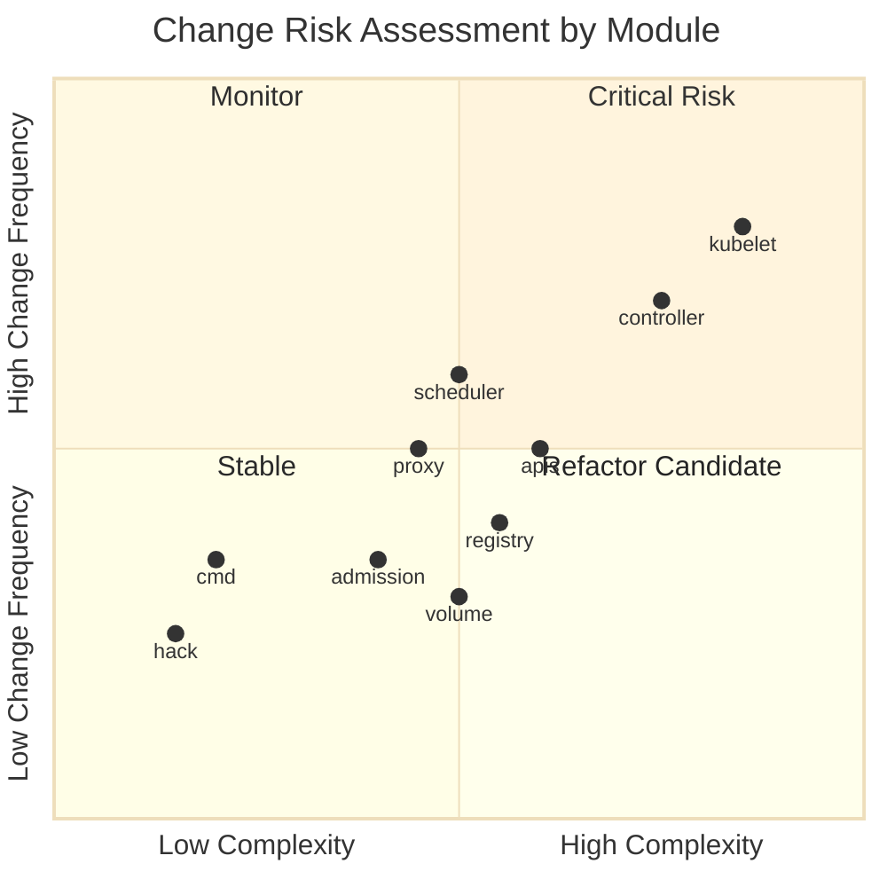
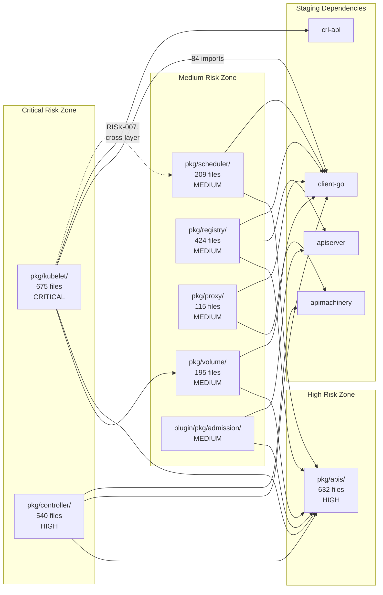

# Quality Risk Assessment

## Document Metadata

| Field | Value |
|-------|-------|
| **Document ID** | 09_QUALITY_RISK_ASSESSMENT |
| **Category** | Quality Risk Assessment |
| **Finding ID Prefix** | RISK-NNN |
| **Risk Rating** | **High** |
| **Priority Scale** | P0 (Critical) / P1 (High) / P2 (Medium) / P3 (Low) |
| **Risk Rating Scale** | Low / Medium / High / Critical |
| **Last Updated** | 2026-03-11 |

---

## Executive Summary

This document maps **quality risks across the Kubernetes codebase** (`k8s.io/kubernetes`) with specific focus on degradation-prone areas, architectural vulnerabilities, change risk surfaces, and long-term maintainability forecasts. It synthesizes findings from all other documents in the Code Quality Audit set (01–08) into a unified risk perspective.

The Kubernetes repository comprises 12,272 Go source files across 4,530+ directories. This assessment focuses on the core production infrastructure — `pkg/kubelet/` (675 files), `pkg/controller/` (540 files), `pkg/apis/` (632 files), `pkg/registry/` (424 files), `pkg/scheduler/` (209 files), `pkg/proxy/` (115 files), and `pkg/volume/` (195 files) — identifying where quality degradation is most likely and where changes carry the highest risk.

**Key Risk Findings:**

| Risk Category | Critical | High | Medium | Low |
|---------------|----------|------|--------|-----|
| Degradation-Prone Areas | 2 | 2 | 2 | 0 |
| Architectural Risks | 1 | 3 | 3 | 1 |
| Change Risks | 1 | 2 | 5 | 2 |
| Maintainability Risks | 1 | 2 | 2 | 1 |

**Highest-Risk Modules:**
1. **`pkg/kubelet/`** — Critical: God-object struct (108 fields), 704-line constructor, 84-import dependency surface, 53% test ratio, platform-specific code paths
2. **`pkg/controller/`** — Critical: 28% test ratio (lowest among logic-heavy packages), 30+ controllers with inconsistent patterns, cross-controller duplication
3. **`pkg/apis/`** — High: 17% test ratio, heavy generated code, API correctness critical to entire ecosystem
4. **`pkg/proxy/`** — Medium: 806-line monolithic function, multi-backend platform coupling

All findings reference specific documents from the audit set (01–08) using Finding IDs. Recommendations cross-reference `08_IMPROVEMENT_ROADMAP.md` for actionable guidance.

---

## Risk Register — Degradation-Prone Areas

This section catalogs areas of the codebase where code quality is most likely to degrade over time based on observable structural indicators: test debt, complexity growth, pattern inconsistency, and coupling expansion.

### RISK-001: pkg/kubelet/ — Feature Accumulation Without Architectural Evolution

| Field | Value |
|-------|-------|
| **Finding ID** | RISK-001 |
| **Category** | Quality Risk |
| **Title** | Kubelet complexity accumulation exceeds architectural capacity |
| **Source Location** | `pkg/kubelet/kubelet.go:19-146` (84 import statements), `pkg/kubelet/kubelet.go:422-1125` (704-line constructor) |
| **Description** | The kubelet is the largest component in the repository (675 Go files, 30+ sub-packages). The core `Kubelet` struct contains approximately 108 fields (MAINT-023, DESIGN-018), its constructor `NewMainKubelet` spans 704 lines with 26 positional parameters (MAINT-001), and the main `kubelet.go` file imports from 84 distinct packages. The `Dependencies` struct is a self-acknowledged "temporary solution" for dependency injection that has persisted indefinitely (MAINT-028, DESIGN-004). The container manager sub-package alone contains 146 files. These indicators show that feature accumulation has outpaced architectural evolution — the kubelet continues to grow in scope without corresponding decomposition of its core abstractions. |
| **Evidence** | Import block at `pkg/kubelet/kubelet.go:19-146` spans 84 import statements from internal sub-packages (`allocation`, `cadvisor`, `cm`, `config`, `container`, `eviction`, `images`, `kuberuntime`, `lifecycle`, `logs`, `metrics`, `pleg`, `pluginmanager`, `prober`, `secret`, `server`, `stats`, `status`, `volumemanager`, `watchdog`), staging modules (`k8s.io/client-go`, `k8s.io/cri-api`, `k8s.io/cri-client`), and external libraries (`cadvisor`, `opentelemetry`, `selinux`). Constructor at `pkg/kubelet/kubelet.go:422` accepts 26 positional parameters. `pkg/kubelet/cm/` directory contains 146 Go files. |
| **Impact** | Every new kubelet feature increases the coupling radius of the God-object struct. Test isolation becomes progressively harder (TEST-003). New contributors face an extreme onboarding barrier. Initialization-order bugs become more probable as the 704-line constructor grows. The 343 TODO markers in `pkg/kubelet/` (DOC-009) indicate persistent deferred work that accumulates rather than resolves. |
| **Inference Flag** | CONFIRMED |
| **Recommendation Ref** | `08_IMPROVEMENT_ROADMAP.md` § REC-P1-03 (Decompose Kubelet God Object and Constructor) |

**Risk Rating: Critical**

**Degradation Trajectory:** The kubelet has been the primary locus of new feature development (user namespaces, sidecar containers, dynamic resource allocation, in-place pod resize) without corresponding decomposition. Each feature adds fields to the `Kubelet` struct, parameters to `NewMainKubelet`, and import dependencies. Without intervention, the struct will continue growing beyond its current 108 fields.

**Contributing Factors from Other Findings:**
- MAINT-001: 704-line monolithic constructor
- MAINT-023: 108-field God-object struct
- MAINT-028, MAINT-044: "Temporary" `Dependencies` struct persisting indefinitely
- DESIGN-004, DESIGN-005: Dependency injection anti-pattern
- DESIGN-018: Excessive struct field count
- DESIGN-021: Container manager aggregates 7+ sub-managers
- TEST-003: 84-import dependency surface impeding unit testability
- TEST-005: Mutable package-level variables (`ContainerLogsDir`, `etcHostsPath`) complicating test isolation
- DOC-001: Missing package-level doc comment
- DOC-009: 343 TODO/FIXME markers — highest in the codebase

---

### RISK-002: pkg/controller/ — Test Debt Accumulation with Pattern Inconsistency

| Field | Value |
|-------|-------|
| **Finding ID** | RISK-002 |
| **Category** | Quality Risk |
| **Title** | Controller package test debt (28%) combined with cross-controller pattern inconsistency creates compounding quality risk |
| **Source Location** | `pkg/controller/` (420 production files, 120 test files), `pkg/controller/garbagecollector/` (20 production files, 3 test files) |
| **Description** | The controller package has the lowest test file ratio (28%) among packages with substantial business logic (TEST-001). The garbage collector — responsible for cascading deletion of dependent objects — has only 3 test files covering 20 production files (TEST-002). Simultaneously, the 30+ controllers exhibit naming inconsistencies (CONS-001 through CONS-005), error handling divergence (DESIGN-011, DESIGN-012), and extensive boilerplate duplication (CORR-001 through CORR-005, MAINT-030 through MAINT-035). The combination of low test coverage and pattern inconsistency means that bugs introduced through pattern divergence are unlikely to be caught by automated testing. |
| **Evidence** | Sub-package test ratios: `pkg/controller/deployment/`: 16 prod / 7 test; `pkg/controller/garbagecollector/`: 20 prod / 3 test; `pkg/controller/replicaset/`: 13 prod / 2 test; `pkg/controller/cronjob/`: 14 prod / 2 test. Controller type naming: `DeploymentController` vs bare `Controller` (Job) vs plural `DaemonSetsController` (DaemonSet). Error wrapping: Job uses `%w`, Deployment uses `%v` (DESIGN-011). |
| **Impact** | Controller regressions in reconciliation loops can cause cluster-wide state corruption (orphaned resources, failed garbage collection, incorrect job completion). The 28% test ratio means that the majority of controller code paths are verified only through manual review and integration/E2E testing. As pattern inconsistency compounds, new contributors are more likely to introduce subtly incorrect implementations by following the wrong exemplar. |
| **Inference Flag** | CONFIRMED |
| **Recommendation Ref** | `08_IMPROVEMENT_ROADMAP.md` § REC-P0-02 (Close Critical Test Coverage Gap), § REC-P1-02 (Standardize Controller Patterns) |

**Risk Rating: Critical**

**Degradation Trajectory:** New controllers continue to be added (e.g., `storageversionmigrator`, `servicecidrs`) following whichever existing controller the author chose as a template. Without a canonical template, each new controller introduces its own variant of the boilerplate, widening the inconsistency surface. Test debt compounds as production code grows faster than test code.

**Contributing Factors from Other Findings:**
- TEST-001: 28% test file ratio
- TEST-002: Garbage collector at 20 prod / 3 test
- CONS-001 through CONS-005: Naming inconsistencies across controllers
- DESIGN-001, DESIGN-002, DESIGN-003: Architectural pattern divergence
- DESIGN-011, DESIGN-012: Error handling inconsistency
- CORR-001 through CORR-005: Redundant logic duplication
- MAINT-030 through MAINT-035: Boilerplate duplication across controllers

---

### RISK-003: pkg/apis/ — API Type Validation Test Gaps

| Field | Value |
|-------|-------|
| **Finding ID** | RISK-003 |
| **Category** | Quality Risk |
| **Title** | API types package has lowest test ratio (17%) with critical validation correctness impact |
| **Source Location** | `pkg/apis/` (539 production files, 93 test files) |
| **Description** | The `pkg/apis/` package has the lowest test file ratio at 17% (TEST-006). While approximately 192 files are type definitions or generated code with no testable logic, the testable surface — validation functions, defaulting functions, and conversion functions — remains under-tested relative to its criticality. API type validation correctness is foundational: invalid API objects entering the system can cascade to every downstream component. The package also has 5 undocumented public API types in core (DOC-019) and 5 in certificates (DOC-020). |
| **Evidence** | 539 production files, 93 test files (17% ratio). 27 validation test files exist (`*validation*_test.go`). 21 API groups have fuzzer sub-packages for round-trip testing. 192 files are type definitions or generated code. Source: `pkg/apis/core/types.go` contains 190 `// Deprecated:` annotations for volume-related types (MAINT-037). |
| **Impact** | Validation logic gaps allow invalid API objects into the system. Schema drift between API versions can go undetected. The 17% ratio, even accounting for generated code, indicates that validation edge cases are likely under-tested. |
| **Inference Flag** | CONFIRMED |
| **Recommendation Ref** | `08_IMPROVEMENT_ROADMAP.md` § REC-P2-02 (Eliminate Dead Code), § TEST-006 reference |

**Risk Rating: High**

---

### RISK-004: pkg/registry/ — Registry Pattern Divergence Across API Groups

| Field | Value |
|-------|-------|
| **Finding ID** | RISK-004 |
| **Category** | Quality Risk |
| **Title** | Registry storage pattern adherence varies across 20+ API groups |
| **Source Location** | `pkg/registry/core/rest/storage_core.go:69-95`, `pkg/registry/` (424 Go files, 145 test files, 20+ API groups) |
| **Description** | The registry package implements REST storage strategies for 20+ API groups following a standardized pattern (strategy, storage, REST endpoints). However, the `storage_core.go` file (Source: `pkg/registry/core/rest/storage_core.go`) wires together 15+ storage providers with complex initialization including IP allocators, service account stores, and node storage. All 4 exported functions in `storage_core.go` are undocumented (DOC-025). The 51% test ratio is moderate but leaves coverage gaps across individual API group storage implementations (TEST-008). |
| **Evidence** | `pkg/registry/core/rest/storage_core.go:70-75` defines `Config struct` with `GenericConfig`, `ProxyConfig`, and `ServicesConfig` nested configurations. Line 100 defines `legacyProvider struct` with 6 fields including `primaryServiceClusterIPAllocator`. The file imports from 28 distinct packages. |
| **Impact** | Inconsistent storage pattern adherence across API groups creates a divergence risk: as new API groups are added, they may follow varying patterns, making cross-group behavioral assumptions unreliable. |
| **Inference Flag** | CONFIRMED |
| **Recommendation Ref** | `08_IMPROVEMENT_ROADMAP.md` § REC-P2-05 (Harmonize Naming Conventions) |

**Risk Rating: Medium**

---

### RISK-005: pkg/proxy/ — Monolithic Rule Generation in Critical Network Path

| Field | Value |
|-------|-------|
| **Finding ID** | RISK-005 |
| **Category** | Quality Risk |
| **Title** | Proxy rule generation concentrated in 806-line monolithic function with multi-backend divergence risk |
| **Source Location** | `pkg/proxy/iptables/proxier.go:735-1540` (syncProxyRules), `pkg/proxy/iptables/proxier.go:1-88` (build constraints and chain constants) |
| **Description** | The `syncProxyRules` method spans 806 lines (MAINT-002) and generates the complete set of iptables NAT and filter rules in a single function. The proxy package maintains three separate backend implementations (iptables, ipvs, nftables) with platform-specific build constraints (`//go:build linux` at `pkg/proxy/iptables/proxier.go:1`). The iptables proxier defines 10 chain constants (lines 54-88) and 2 sysctl constants (lines 90-91). The 47% test file ratio (TEST-009) indicates moderate coverage with platform-dependent testing gaps. |
| **Evidence** | Build constraint `//go:build linux` at `pkg/proxy/iptables/proxier.go:1`. Chain constants: `kubeServicesChain`, `kubeExternalServicesChain`, `kubeNodePortsChain`, `kubePostroutingChain`, `kubeMarkMasqChain`, `kubeForwardChain`, `kubeProxyFirewallChain`, `kubeProxyCanaryChain`, `kubeletFirewallChain`. `largeClusterEndpointsThreshold = 1000` at line 87 — a threshold determining optimization mode. |
| **Impact** | The 806-line function is the primary source of kube-proxy bugs (MAINT-002). Any modification requires understanding the complete iptables rule generation pipeline. Testing individual rule generation paths in isolation is near-impossible. Multi-backend divergence (iptables vs. ipvs vs. nftables) creates risk of behavioral inconsistency across proxy modes. |
| **Inference Flag** | CONFIRMED |
| **Recommendation Ref** | `08_IMPROVEMENT_ROADMAP.md` § REC-P2-01 (Decompose Oversized Functions) |

**Risk Rating: Medium**

---

### RISK-006: pkg/volume/ — Deprecated Plugin Accumulation

| Field | Value |
|-------|-------|
| **Finding ID** | RISK-006 |
| **Category** | Quality Risk |
| **Title** | Volume plugin architecture retains deprecated implementations increasing maintenance surface |
| **Source Location** | `pkg/volume/plugins.go:46-96`, `pkg/volume/git_repo/`, `pkg/volume/fc/`, `pkg/volume/iscsi/`, `pkg/volume/nfs/`, `pkg/volume/flexvolume/` |
| **Description** | The volume package defines 15+ plugin interfaces (MAINT-041) with a `VolumePluginMgr` containing 22 methods (DESIGN-010, DESIGN-020). Five deprecated volume plugin directories persist (MAINT-040): `git_repo`, `fc`, `iscsi`, `nfs`, `flexvolume`. The `git_repo` plugin retains its full 291-line implementation despite being deprecated and disabled behind a feature gate (MAINT-036). The `VolumeOptions` struct at `pkg/volume/plugins.go:75-96` contains a TODO comment referencing future refactoring (line 78). 190 `// Deprecated:` annotations exist in `pkg/apis/core/types.go` for volume-related types (MAINT-037). |
| **Evidence** | `VolumeOptions` struct at `pkg/volume/plugins.go:75` includes comment: `// TODO: refactor all of this out of volumes when an admin can configure many kinds of provisioners.` `ErrNoPluginMatched` sentinel at line 72. `ProbeOperation` type at line 47. `ProbeEvent` struct at lines 50-54 with `Plugin VolumePlugin` field. |
| **Impact** | Deprecated but retained plugins increase binary size, test execution time, and maintenance burden. The plugin interface hierarchy designed for many in-tree plugins becomes speculative generalization as CSI converges as the standard (MAINT-041). |
| **Inference Flag** | CONFIRMED |
| **Recommendation Ref** | `08_IMPROVEMENT_ROADMAP.md` § REC-P2-02 (Eliminate Dead Code), § REC-P3-02 (Simplify Volume Plugin Interface) |

**Risk Rating: Medium**

---

## Architectural Risk Inventory

This section documents risks arising from the codebase's architectural structure — coupling patterns, ownership boundaries, and implicit contracts between modules.

### Coupling Risks

#### RISK-007: Kubelet Cross-Boundary Import of Scheduler Plugin

| Field | Value |
|-------|-------|
| **Finding ID** | RISK-007 |
| **Category** | Architectural Risk |
| **Title** | Kubelet imports scheduler framework plugin, creating cross-layer coupling |
| **Source Location** | `pkg/kubelet/kubelet.go:51` |
| **Description** | The kubelet package directly imports the scheduler's framework plugin package (`k8s.io/kubernetes/pkg/scheduler/framework/plugins/tainttoleration`) to use `tainttoleration.ErrReasonNotMatch` (DESIGN-038, TEST-011). The container manager Linux implementation additionally imports `k8s.io/kubernetes/pkg/scheduler/framework` for type access (DESIGN-039). This creates a cross-layer dependency from the node agent to the scheduler — two components that should have independent dependency graphs. |
| **Evidence** | Import at `pkg/kubelet/kubelet.go:51`: `"k8s.io/kubernetes/pkg/scheduler/framework/plugins/tainttoleration"`. This is the only scheduler plugin imported by kubelet, creating an unusual cross-component coupling documented in coupling inventory (TEST-011). |
| **Impact** | Changes to the taint toleration scheduler plugin require validation against kubelet. The kubelet binary includes scheduler plugin code. This violates the expected boundary between scheduling and node-level execution components. |
| **Inference Flag** | CONFIRMED |
| **Recommendation Ref** | `08_IMPROVEMENT_ROADMAP.md` § REC-P2-07 (Reduce Coupling Between Kubelet and Scheduler) |

**Risk Rating: Medium**

---

#### RISK-008: Kubelet 84-Import Dependency Surface

| Field | Value |
|-------|-------|
| **Finding ID** | RISK-008 |
| **Category** | Architectural Risk |
| **Title** | Kubelet core file imports from 84 packages creating maximal coupling radius |
| **Source Location** | `pkg/kubelet/kubelet.go:19-146` |
| **Description** | The `kubelet.go` file imports from 84 distinct packages spanning internal sub-packages (20+ kubelet sub-packages: `allocation`, `cadvisor`, `cm`, `config`, `container`, `eviction`, `images`, `kuberuntime`, `lifecycle`, `logs`, `metrics`, `pleg`, `pluginmanager`, `prober`, `secret`, `server`, `stats`, `status`, `volumemanager`, `watchdog`), staging modules (`k8s.io/client-go`, `k8s.io/cri-api`, `k8s.io/cri-client`, `k8s.io/apimachinery`, `k8s.io/apiserver`), and external libraries (`cadvisor`, `opentelemetry`, `selinux`, `moby/sys/userns`). This represents the widest import surface of any single file in the codebase (TEST-003). |
| **Evidence** | Import block at `pkg/kubelet/kubelet.go:19-146` counts 84 import statements. Internal kubelet imports include: `allocation`, `cadvisor`, `certificate`, `clustertrustbundle`, `cm`, `cm/topologymanager`, `config`, `configmap`, `container`, `events`, `eviction`, `images`, `kubeletconfig`, `kuberuntime`, `lifecycle`, `logs`, `metrics`, `metrics/collectors`, `network/dns`, `nodeshutdown`, `oom`, `pleg`, `pluginmanager`, `pod`, `podcertificate`, `preemption`, `prober`, `prober/results`, `runtimeclass`, `secret`, `server`, `stats`, `status`, `sysctl`, `token`, `types`, `userns`, `util`, `util/manager`, `util/queue`, `util/sliceutils`, `volumemanager`, `watchdog`. |
| **Impact** | Any change to any of 84 packages can trigger recompilation and potentially behavioral changes in the kubelet core. The coupling radius makes isolated testing nearly impossible — TEST-003 documents that unit testing the Kubelet struct requires provisioning dozens of dependencies. |
| **Inference Flag** | CONFIRMED |
| **Recommendation Ref** | `08_IMPROVEMENT_ROADMAP.md` § REC-P1-03 (Decompose Kubelet God Object) |

**Risk Rating: High**

---

#### RISK-009: Controller Shared Utility Blast Radius

| Field | Value |
|-------|-------|
| **Finding ID** | RISK-009 |
| **Category** | Architectural Risk |
| **Title** | Shared controller utilities create high blast radius for changes |
| **Source Location** | `pkg/controller/controller_utils.go`, `pkg/controller/controller_ref_manager.go` |
| **Description** | All 30+ controllers import `pkg/controller` for shared interfaces (`RSControlInterface`, `PodControlInterface`, `ControllerExpectationsInterface`) and utilities (`controller_utils.go`, `controller_ref_manager.go`). The deployment controller imports at `pkg/controller/deployment/deployment_controller.go:49-50`. This creates a situation where any modification to shared utilities impacts all controllers simultaneously (TEST-013). |
| **Evidence** | `pkg/controller/deployment/deployment_controller.go:49`: `"k8s.io/kubernetes/pkg/controller"` and line 50: `"k8s.io/kubernetes/pkg/controller/deployment/util"`. Similar patterns in job (`job_controller.go`), statefulset, replicaset, and daemon controllers. Source: TEST-013 documents this as implicit coupling across all controller sub-packages. |
| **Impact** | Changes to `controller_utils.go` or `controller_ref_manager.go` can break tests across all 30+ controllers. The shared utility surface acts as an implicit interface — changes must be validated against the entire controller suite. |
| **Inference Flag** | CONFIRMED |
| **Recommendation Ref** | `08_IMPROVEMENT_ROADMAP.md` § REC-P3-03 (Create Shared Controller Utility Helpers) |

**Risk Rating: Medium**

---

#### RISK-010: Staging Module Replace Directive Complexity

| Field | Value |
|-------|-------|
| **Finding ID** | RISK-010 |
| **Category** | Architectural Risk |
| **Title** | 31 staging modules with in-tree replace directives create complex dependency chain |
| **Source Location** | `go.mod` (replace directives), `staging/src/k8s.io/` (31 modules) |
| **Description** | The repository contains 31 staging modules under `staging/src/k8s.io/` (including `client-go`, `apimachinery`, `apiserver`, `kubectl`, `kubelet`, `api`, `component-base`, `controller-manager`, `code-generator`, and 22 more). The root `go.mod` uses replace directives to point these module paths to their in-tree staging locations. This dual-module architecture means that the same code is referenced both as an external module path (`k8s.io/client-go`) and as an in-tree path (`staging/src/k8s.io/client-go`). |
| **Evidence** | `go.mod` line 7: `module k8s.io/kubernetes`, line 9: `go 1.25.0`. 31 directories under `staging/src/k8s.io/`: `api`, `apiextensions-apiserver`, `apimachinery`, `apiserver`, `cli-runtime`, `client-go`, `cloud-provider`, `cluster-bootstrap`, `code-generator`, `component-base`, `component-helpers`, `controller-manager`, `cri-api`, `cri-client`, `csi-translation-lib`, `dynamic-resource-allocation`, `endpointslice`, `externaljwt`, `kms`, `kube-aggregator`, `kube-controller-manager`, `kube-proxy`, `kube-scheduler`, `kubectl`, `kubelet`, `metrics`, `mount-utils`, `pod-security-admission`, `sample-apiserver`, `sample-cli-plugin`, `sample-controller`. |
| **Impact** | The dual-module architecture creates a complex dependency graph where version updates to any staging module must be coordinated with all dependent modules. The replace directives mean that the Go module resolution for internal development differs from external consumers' resolution. This complexity is a source of tooling confusion and build system brittleness. |
| **Inference Flag** | CONFIRMED |
| **Recommendation Ref** | `08_IMPROVEMENT_ROADMAP.md` § Standardization Guidance |

**Risk Rating: Medium**

---

### Ownership Risks

#### RISK-011: Ownership Boundaries vs. Coupling Boundaries Mismatch

| Field | Value |
|-------|-------|
| **Finding ID** | RISK-011 |
| **Category** | Architectural Risk |
| **Title** | OWNERS file boundaries do not align with coupling boundaries in controller and kubelet packages |
| **Source Location** | `pkg/controller/OWNERS`, `pkg/kubelet/OWNERS`, `pkg/scheduler/OWNERS` |
| **Description** | The `pkg/controller/` directory has a top-level OWNERS file assigning sig-apps-approvers and individual approvers (deads2k, derekwaynecarr, mikedanese, janetkuo, cheftako, andrewsykim), with 15+ sub-package OWNERS files for specific controllers (deployment, job, daemon, garbagecollector, etc.). However, the shared `pkg/controller/controller_utils.go` and `pkg/controller/controller_ref_manager.go` — which all 30+ controllers depend on (TEST-013) — are governed by the top-level OWNERS file. This means changes to shared utilities may be approved by sig-apps reviewers who may not have context on all consuming controllers. The kubelet has a top-level OWNERS file with sig-node-approvers, but the kubelet's cross-boundary import of `pkg/scheduler/framework/plugins/tainttoleration` (RISK-007) means that scheduler SIG changes can affect kubelet behavior without explicit sig-node review. |
| **Evidence** | `pkg/controller/OWNERS`: approvers include `sig-apps-approvers`, `deads2k`, `derekwaynecarr`, `mikedanese`, `janetkuo`, `cheftako`, `andrewsykim`. Labels: `sig/apps`. `pkg/kubelet/OWNERS`: approvers include `sig-node-approvers`, labels `area/kubelet`, `sig/node`. `pkg/scheduler/OWNERS`: approvers include `sig-scheduling-maintainers`, labels `sig/scheduling`. Sub-package OWNERS files exist for 15+ controller sub-packages and 11 kubelet sub-packages. |
| **Impact** | When ownership boundaries diverge from coupling boundaries, changes to shared code can be approved without full awareness of downstream impact. The kubelet → scheduler coupling (RISK-007) represents a concrete case where sig-scheduling changes could affect sig-node behavior. |
| **Inference Flag** | INFERRED |
| **Recommendation Ref** | `08_IMPROVEMENT_ROADMAP.md` § REC-P2-07 (Reduce Coupling Between Kubelet and Scheduler) |

**Risk Rating: Medium**

---

#### RISK-012: Controller Sub-Package Ownership Granularity

| Field | Value |
|-------|-------|
| **Finding ID** | RISK-012 |
| **Category** | Architectural Risk |
| **Title** | Variable OWNERS coverage across controller sub-packages |
| **Source Location** | `pkg/controller/deployment/OWNERS`, `pkg/controller/job/OWNERS`, `pkg/controller/garbagecollector/OWNERS` |
| **Description** | Of the 30+ controller sub-packages, 15+ have their own OWNERS files with SIG-specific reviewers. However, the shared controller utilities (`pkg/controller/controller_utils.go`, `pkg/controller/controller_ref_manager.go`) and the parent `pkg/controller/` directory fall under the top-level OWNERS file. Controllers without sub-package OWNERS files inherit the top-level sig-apps ownership, which may not provide domain-specific expertise for specialized controllers (e.g., storage volume controllers under `pkg/controller/volume/` with 62 production files). |
| **Evidence** | Observed OWNERS files in: `replicaset`, `cronjob`, `endpointslicemirroring`, `servicecidrs`, `garbagecollector`, `job`, `daemon`, `storageversionmigrator`, `endpointslice`, `history`, `deployment`, `resourcequota`, `podgc`, `replication`, `storageversiongc`. Volume controller sub-packages (`pkg/controller/volume/` with 62 production files) may inherit from the top-level rather than having storage SIG-specific reviewers. |
| **Impact** | Inconsistent OWNERS coverage can lead to review quality variation across controllers. Controllers without dedicated OWNERS may receive less specialized review, increasing the risk of domain-specific bugs. |
| **Inference Flag** | INFERRED |
| **Recommendation Ref** | `08_IMPROVEMENT_ROADMAP.md` § REC-P1-02 (Standardize Controller Implementation Patterns) |

**Risk Rating: Low**

---

### Implicit Contract Risks

#### RISK-013: Controller → Informer Cache Behavioral Contract

| Field | Value |
|-------|-------|
| **Finding ID** | RISK-013 |
| **Category** | Architectural Risk |
| **Title** | Controllers depend on undocumented informer cache synchronization behavioral contracts |
| **Source Location** | `pkg/controller/deployment/deployment_controller.go:87-95`, `pkg/controller/deployment/deployment_controller.go:181` |
| **Description** | All controllers depend on informer cache synchronization as a correctness precondition. The `DeploymentController` declares cache sync functions as struct fields (`dListerSynced`, `rsListerSynced`, `podListerSynced`) at lines 87-95 with comments "Added as a member to the struct to allow injection for testing." The `Run` method at line 181 calls `cache.WaitForNamedCacheSyncWithContext()` and returns without processing if sync fails. This behavioral contract — that controllers must wait for informer caches before processing — is enforced by convention rather than by the type system. There is no interface or compile-time check ensuring that all controllers properly implement this wait pattern. |
| **Evidence** | `pkg/controller/deployment/deployment_controller.go:87-95`: `dListerSynced cache.InformerSynced` / `rsListerSynced cache.InformerSynced` / `podListerSynced cache.InformerSynced` with comment "Added as a member to the struct to allow injection for testing." Line 181: `if !cache.WaitForNamedCacheSyncWithContext(ctx, dc.dListerSynced, dc.rsListerSynced, dc.podListerSynced) { return }`. |
| **Impact** | If a new controller omits the cache sync wait, it will process stale or empty informer state, potentially making incorrect decisions (deleting resources it cannot see, creating duplicates of resources it hasn't cached). This implicit contract is a correctness risk that would be mitigated by a controller framework enforcing the pattern. |
| **Inference Flag** | CONFIRMED |
| **Recommendation Ref** | `08_IMPROVEMENT_ROADMAP.md` § REC-P1-02 (Standardize Controller Implementation Patterns) |

**Risk Rating: High**

---

#### RISK-014: Kubelet → CRI Runtime Interface Assumptions

| Field | Value |
|-------|-------|
| **Finding ID** | RISK-014 |
| **Category** | Architectural Risk |
| **Title** | Kubelet depends on CRI runtime behavioral assumptions not expressed in interface types |
| **Source Location** | `pkg/kubelet/kubelet.go:80-82` (CRI imports), `pkg/kubelet/kuberuntime/` (44 files) |
| **Description** | The kubelet imports CRI (Container Runtime Interface) packages at `pkg/kubelet/kubelet.go:80-82`: `internalapi "k8s.io/cri-api/pkg/apis"`, `runtimeapi "k8s.io/cri-api/pkg/apis/runtime/v1"`, and `remote "k8s.io/cri-client/pkg"`. The CRI interface defines gRPC service contracts for container lifecycle management. However, behavioral assumptions beyond the gRPC schema — such as expected latency characteristics, idempotency guarantees for operations, error recovery semantics after container runtime crashes, and ordering constraints for container creation/start/stop — are not documented in the interface types. The `kuberuntime` sub-package (44 files) implements the runtime integration layer. |
| **Evidence** | Import statements at `pkg/kubelet/kubelet.go:80-82`. The `kuberuntime` sub-package at `pkg/kubelet/kuberuntime/` contains 44 Go files implementing the translation between kubelet pod lifecycle and CRI calls. The constant `maxWaitForContainerRuntime = 30 * time.Second` at `pkg/kubelet/kubelet.go:150` represents a hardcoded timeout assumption about runtime startup behavior. |
| **Impact** | CRI runtime implementations (containerd, CRI-O) may diverge in behavioral characteristics not covered by the gRPC contract. The hardcoded 30-second timeout assumes a specific startup performance envelope. Changes to CRI runtime behavior that comply with the gRPC schema but violate implicit behavioral assumptions can cause kubelet malfunction that is difficult to diagnose. |
| **Inference Flag** | INFERRED |
| **Recommendation Ref** | `08_IMPROVEMENT_ROADMAP.md` § REC-P2-04 (Externalize Hardcoded Configuration Values) |

**Risk Rating: Medium**

---

#### RISK-015: Scheduler → Framework Plugin Contract

| Field | Value |
|-------|-------|
| **Finding ID** | RISK-015 |
| **Category** | Architectural Risk |
| **Title** | Scheduler framework plugin contracts have undocumented ordering and state expectations |
| **Source Location** | `pkg/scheduler/schedule_one.go:64-97`, `pkg/scheduler/framework/` (sub-package) |
| **Description** | The scheduler's `ScheduleOne` function at `pkg/scheduler/schedule_one.go:65-97` orchestrates the scheduling cycle by calling `sched.NextPod()`, `sched.frameworkForPod(pod)`, and `sched.skipPodSchedule()` in sequence. The scheduling framework defines extension points (PreFilter, Filter, PostFilter, PreScore, Score, Reserve, Permit, PreBind, Bind, PostBind) with ordering dependencies between them. The `ScheduleOne` function has a TODO at line 78-80: `// TODO(knelasevero): Remove duplicated keys from log entry calls // When contextualized logging hits GA // https://github.com/kubernetes/kubernetes/issues/111672`. The framework interface definitions provide type-level contracts but do not document behavioral expectations such as: what state plugins may mutate, ordering guarantees between plugins at the same extension point, or idempotency requirements for retry scenarios. |
| **Evidence** | `pkg/scheduler/schedule_one.go:65-66`: `func (sched *Scheduler) ScheduleOne(ctx context.Context)`. Line 67: `podInfo, err := sched.NextPod(logger)`. Line 85: `fwk, err := sched.frameworkForPod(pod)`. Line 93: `if sched.skipPodSchedule(ctx, fwk, pod)`. Constants at lines 49-61: `pluginMetricsSamplePercent = 10`, `minFeasibleNodesToFind = 100`, `minFeasibleNodesPercentageToFind = 5` — with comments describing them as "semi-arbitrary." |
| **Impact** | Third-party scheduler plugin authors may violate implicit behavioral contracts (e.g., mutating shared state, assuming execution order) leading to scheduling correctness issues that manifest only in specific plugin combinations. The semi-arbitrary constants indicate operational parameters whose derivation is not documented. |
| **Inference Flag** | INFERRED |
| **Recommendation Ref** | `08_IMPROVEMENT_ROADMAP.md` § REC-P3-04 (Review and Update Magic Numbers) |

**Risk Rating: Medium**

---

#### RISK-016: Staging Module Cross-Boundary Implicit Contracts

| Field | Value |
|-------|-------|
| **Finding ID** | RISK-016 |
| **Category** | Architectural Risk |
| **Title** | Staging modules and pkg/ share implicit behavioral contracts through replace directives |
| **Source Location** | `go.mod` (replace directives), `staging/src/k8s.io/client-go/`, `staging/src/k8s.io/apimachinery/` |
| **Description** | The 31 staging modules are consumed by `pkg/` code through import paths like `k8s.io/client-go`, `k8s.io/apimachinery`, and `k8s.io/apiserver`, with `go.mod` replace directives redirecting to in-tree staging paths. This architecture means that `pkg/kubelet/` imports from `k8s.io/client-go` (8+ imports, TEST coupling table), `k8s.io/cri-api` (2 imports), `k8s.io/apimachinery` (multiple imports), and `k8s.io/apiserver` (2 imports). When staging modules are published as independent modules, external consumers depend on the published API contracts. Any behavioral change in staging code that is compatible with in-tree usage but breaks external consumption creates a silent contract violation. |
| **Evidence** | `pkg/kubelet/kubelet.go` import block includes: `"k8s.io/client-go/informers"`, `"k8s.io/client-go/kubernetes"`, `"k8s.io/client-go/tools/cache"`, `"k8s.io/client-go/tools/record"`, `"k8s.io/client-go/util/certificate"`, `"k8s.io/client-go/util/flowcontrol"`, `"k8s.io/cri-api/pkg/apis"`, `"k8s.io/cri-api/pkg/apis/runtime/v1"`, `"k8s.io/apimachinery/pkg/api/equality"`, `"k8s.io/apimachinery/pkg/api/resource"`. Staging modules: 31 directories under `staging/src/k8s.io/`. |
| **Impact** | Internal refactoring of staging code can inadvertently break external consumers who depend on behavioral characteristics not captured in type signatures. The replace directive mechanism means internal development sees different module resolution than external users. |
| **Inference Flag** | INFERRED |
| **Recommendation Ref** | `08_IMPROVEMENT_ROADMAP.md` § Standardization Guidance |

**Risk Rating: Low**

---

## Change Risk Map

This section assesses what changes are high-risk for each major module, grounded in evidence from the preceding audit documents. The risk level reflects the likelihood that a change will introduce regressions, the difficulty of validating the change, and the blast radius of potential defects.

### Change Risk Summary

| Module | Change Risk | Risk Factors | Key Evidence |
|--------|------------|--------------|--------------|
| `pkg/kubelet/` | **Critical** | God-object struct (108 fields), 704-line constructor, 84-import surface, 53% test ratio, platform-specific code, 343 TODOs | MAINT-001, MAINT-023, TEST-003, TEST-005, DOC-009 |
| `pkg/controller/` | **High** | 30+ controllers with inconsistent patterns, 28% test ratio, boilerplate duplication, shared utility blast radius | TEST-001, CONS-001–005, CORR-001–005, TEST-013 |
| `pkg/apis/` | **High** | 17% test ratio, schema correctness critical, 190 deprecated annotations, generated code dependency | TEST-006, DOC-019, DOC-020, MAINT-037 |
| `pkg/scheduler/` | **Medium** | Well-structured framework, 64% test ratio, semi-arbitrary constants, detached goroutine in binding cycle | TEST-007, CORR-006, DESIGN-026, DOC-030 |
| `pkg/registry/` | **Medium** | Standardized REST patterns, 51% test ratio, 20+ groups with varying adherence, undocumented storage functions | TEST-008, DOC-025 |
| `pkg/proxy/` | **Medium** | 806-line monolithic function, multi-backend divergence, platform coupling, 47% test ratio | MAINT-002, TEST-009, CORR-018 |
| `pkg/volume/` | **Medium** | 15+ plugin interfaces, deprecated plugins retained, 57% test ratio, CSI migration complexity | MAINT-036, MAINT-040, MAINT-041, DESIGN-010 |
| `cmd/` | **Low** | Thin entrypoints delegating to `app/` packages, generated CLI documentation | TOOL-010 (vestigial scripts) |
| `plugin/pkg/admission/` | **Medium** | 25+ admission controllers, registration boilerplate duplication, variable doc.go presence | MAINT-034, DOC-006, CONS-008 |
| `hack/` | **Low** | Script-based, mostly independent verification checks, verify/update symmetry pattern | TOOL-009, TOOL-010 |

### Detailed Module Risk Analysis

#### pkg/kubelet/ — Change Risk: Critical

| Risk Factor | Evidence | Impact |
|-------------|----------|--------|
| God-object struct | MAINT-023: 108 fields; DESIGN-018 | Any new field increases coupling; structural changes require updating all references |
| Monolithic constructor | MAINT-001: 704 lines, 26 parameters | Any initialization change risks order-dependent bugs |
| Wide dependency surface | TEST-003: 84 imports in main file | Changes to any imported package can trigger behavioral changes |
| Moderate test ratio | 53% (440 prod / 235 test) | 47% of kubelet code paths lack dedicated test coverage |
| Platform-specific code | `pkg/kubelet/cm/` with Linux cgroups, Windows containers | Platform-specific changes require multi-OS CI validation |
| Mutable global state | TEST-005: `ContainerLogsDir`, `etcHostsPath` | Package-level state complicates parallel test execution |
| High TODO density | DOC-009: 343 TODO markers | Large volume of deferred work indicates unstable design surface |
| Goroutine lifecycle gaps | CORR-008: Multiple goroutines without unified lifecycle tracking | Background operations may survive context cancellation |
| Context misuse | CORR-013: `context.Background()` in background goroutines | Graceful shutdown may not propagate to all operations |

**Highest-Risk Change Types:**
1. Container lifecycle changes (affect `kuberuntime` → CRI → container lifecycle chain)
2. Resource management changes (affect `cm/` → cgroups → platform abstractions)
3. Pod admission changes (affect `lifecycle` → admission → scheduling interaction)

---

#### pkg/controller/ — Change Risk: High

| Risk Factor | Evidence | Impact |
|-------------|----------|--------|
| Critical test gap | TEST-001: 28% ratio; TEST-002: GC at 3 test files | Controller regressions undetectable without E2E tests |
| Pattern inconsistency | CONS-001–005: Naming divergence | New contributors may follow wrong exemplar |
| Error handling divergence | DESIGN-011: `%w` vs `%v`; DESIGN-012: Silent swallowing | Error chain breakage can hide failure causes |
| Boilerplate duplication | CORR-001–005, MAINT-030–035 | Bug fixes must be applied to 30+ controllers independently |
| Shared utility blast radius | TEST-013: Changes to `controller_utils.go` affect all controllers | Shared utility changes require comprehensive validation |
| Context misuse | CORR-010, CORR-011, CORR-012, CORR-014, CORR-015 | `context.TODO()` in production paths prevents graceful shutdown |
| Goroutine safety | CORR-007: Job controller per-pod goroutines without limits | Unbounded concurrency under high load |

**Highest-Risk Change Types:**
1. Shared controller utility changes (blast radius across 30+ controllers)
2. Garbage collector changes (lowest test coverage, critical for object lifecycle)
3. Reconciliation loop logic changes (correctness-critical, under-tested)

---

#### pkg/apis/ — Change Risk: High

| Risk Factor | Evidence | Impact |
|-------------|----------|--------|
| Lowest test ratio | TEST-006: 17% ratio | Validation edge cases likely under-tested |
| Schema correctness critical | API type definitions consumed by all components | Invalid types cascade to entire ecosystem |
| Generated code dependency | 192 generated/type files | Codegen changes require careful regeneration |
| Deprecated type accumulation | MAINT-037: 190 `Deprecated:` annotations | Deprecated types cannot be removed for API compatibility |
| Undocumented public types | DOC-019: 5 core types; DOC-020: 5 certificate types | API misuse risk from undocumented types |

**Highest-Risk Change Types:**
1. Validation function changes (affect what objects enter the system)
2. Type definition changes (affect all consumers through generated code)
3. Defaulting function changes (affect implicit behavior)

---

#### pkg/scheduler/ — Change Risk: Medium

| Risk Factor | Evidence | Impact |
|-------------|----------|--------|
| Best test ratio among large packages | TEST-007: 64% ratio | Positive — strong test infrastructure reduces regression risk |
| Well-structured framework | Dedicated `testing/`, `fake/` sub-packages | Positive — enables isolated testing |
| Semi-arbitrary constants | DESIGN-026: `pluginMetricsSamplePercent = 10`; DOC-030: undocumented adaptive scoring formula | Constants affect scheduling behavior without documented derivation |
| Detached goroutine in binding | CORR-006: Binding cycle launches goroutine without lifecycle tracking | Lost errors in binding can cause silent scheduling failures |

**Highest-Risk Change Types:**
1. Scoring algorithm changes (affect pod placement across entire cluster)
2. Framework extension point changes (affect all plugins)
3. Binding cycle changes (async path with error propagation risks)

---

#### pkg/registry/ — Change Risk: Medium

| Risk Factor | Evidence | Impact |
|-------------|----------|--------|
| Standardized patterns | REST storage strategy pattern well-established | Positive — pattern consistency reduces risk |
| Moderate test ratio | TEST-008: 51% | Acceptable but with gaps in individual API groups |
| Undocumented storage functions | DOC-025: 4 exported functions undocumented | Integration developers may misuse storage APIs |
| Complex initialization | `storage_core.go:70-150`: 15+ providers, IP allocators, repair controllers | Initialization wiring complexity |

**Highest-Risk Change Types:**
1. Core storage initialization changes (affect all API resources)
2. Individual API group storage changes (affect specific resource types)
3. IP/port allocator changes (affect service networking)

---

#### pkg/proxy/ — Change Risk: Medium

| Risk Factor | Evidence | Impact |
|-------------|----------|--------|
| 806-line monolithic function | MAINT-002: `syncProxyRules` | Near-impossible to test individual paths |
| Multi-backend divergence | iptables, ipvs, nftables backends | Changes must be validated across all backends |
| Platform coupling | Build constraint `//go:build linux` | Linux-only code paths require platform-specific CI |
| Mutex scope risk | CORR-018: Single mutex protecting loosely-related fields | Race condition risk from broad mutex scope |

**Highest-Risk Change Types:**
1. Rule generation logic changes (affect network reachability for all services)
2. New backend introduction/modification (require cross-backend behavioral parity)
3. Performance optimization changes (threshold-dependent: `largeClusterEndpointsThreshold = 1000`)

---

#### pkg/volume/ — Change Risk: Medium

| Risk Factor | Evidence | Impact |
|-------------|----------|--------|
| Deprecated plugin accumulation | MAINT-036, MAINT-040: 5 deprecated plugin dirs | Maintenance burden for unused code |
| Plugin interface complexity | MAINT-041: 15+ interfaces; DESIGN-020: 22 lookup methods | Interface changes affect all plugin implementations |
| Moderate test ratio | TEST-010: 57% | Adequate but with deprecated plugin test staleness risk |

**Highest-Risk Change Types:**
1. Plugin interface changes (affect all volume plugin implementations)
2. CSI migration changes (affect storage provider compatibility)
3. Plugin registration changes (affect volume discovery)

---

#### cmd/ — Change Risk: Low

| Risk Factor | Evidence | Impact |
|-------------|----------|--------|
| Thin entrypoints | Commands delegate to `app/` packages | Low standalone logic risk |
| Generated documentation | `gendocs`, `genkubedocs`, `genman`, `genyaml` | Documentation generation is well-automated |

**Highest-Risk Change Types:**
1. Flag changes (affect CLI compatibility)
2. Documentation generator changes (affect generated docs)

---

#### plugin/pkg/admission/ — Change Risk: Medium

| Risk Factor | Evidence | Impact |
|-------------|----------|--------|
| Registration boilerplate | MAINT-034: Registration boilerplate duplicated | Changes to registration pattern must be applied to 25+ plugins |
| Variable documentation | DOC-006: 18 plugins without `doc.go` | New admission plugins may not be properly documented |
| Type naming split | CONS-008: `Plugin` vs domain-specific names | Inconsistent plugin discovery patterns |

**Highest-Risk Change Types:**
1. Admission interface changes (affect all 25+ plugins)
2. Registration mechanism changes (require synchronized updates)
3. Policy logic changes in individual plugins (affect API admission decisions)

---

#### hack/ — Change Risk: Low

| Risk Factor | Evidence | Impact |
|-------------|----------|--------|
| Script independence | TOOL-009: Verify/update symmetry pattern | Scripts are mostly independent |
| Vestigial redirections | TOOL-010: Top-level scripts redirect to Makefile | Low risk; redirect pattern is stable |

**Highest-Risk Change Types:**
1. `golangci.yaml` changes (affect all lint enforcement)
2. Shared library changes in `hack/lib/` (affect all scripts)

---

### Change Risk Heat Map

### Architectural Risk Dependency Graph

---

## Long-Term Maintainability Forecast

This section projects the maintainability trajectory of the Kubernetes codebase based on observable patterns of technical debt accumulation, test coverage trends, and tooling maturity signals.

### Module-Level Trajectory Assessment

#### pkg/kubelet/ — Trajectory: Declining Without Intervention

**Current State:** The kubelet is the single largest component (675 files) with a God-object core struct (108 fields, MAINT-023), a monolithic constructor (704 lines, MAINT-001), the widest import surface in the codebase (84 imports, TEST-003), and the highest TODO density (343 markers, DOC-009). The `Dependencies` struct acknowledges itself as a "temporary solution" that has become permanent (MAINT-028).

**12-Month Projection:** New features (user namespaces, sidecar containers, dynamic resource allocation, in-place pod resize, swap support) will continue adding fields to the `Kubelet` struct and parameters to `NewMainKubelet`. Based on the current trajectory of ~2-5 new features per release cycle, the struct could reach 115-125 fields within 12 months. The container manager sub-package (`cm/`, 146 files) will continue growing as new resource management capabilities are added. Without decomposition, the 84-import dependency surface will expand further.

**Mitigating Factor:** The test ratio (53%) is moderate and could stabilize if new features include corresponding test additions. The strong eviction/prober sub-package test ratios (prober at 120%) suggest that well-scoped sub-packages can maintain healthy coverage.

**Key Indicators to Monitor:**
- `Kubelet` struct field count (currently ~108)
- `NewMainKubelet` parameter count (currently 26)
- Import count in `kubelet.go` (currently 84)
- TODO marker count (currently 343)
- `pkg/kubelet/cm/` file count (currently 146)

---

#### pkg/controller/ — Trajectory: Slowly Degrading

**Current State:** 30+ controllers with 28% test ratio (TEST-001), naming inconsistencies (CONS-001-005), boilerplate duplication (CORR-001-005, MAINT-030-035), and error handling divergence (DESIGN-011, DESIGN-012). The garbage collector has only 3 test files for 20 production files (TEST-002).

**12-Month Projection:** New controllers will continue to be added as new Kubernetes features require reconciliation loops (e.g., storage version migrator, service CIDRs). Each new controller copies boilerplate from an existing controller, perpetuating whatever inconsistencies exist in the chosen template. The test ratio may remain flat or decline further as production code grows faster than test code. Without a standardization framework, pattern divergence will continue to widen.

**Mitigating Factor:** The `syncHandler` injection pattern is consistently adopted and enables isolated unit testing. The informer/lister/cache sync pattern is well-established. These patterns provide a foundation for future standardization.

**Key Indicators to Monitor:**
- Controller count (currently 30+)
- Test file ratio (currently 28%)
- Number of controller sub-packages without OWNERS files
- Boilerplate divergence instances

---

#### Test Debt Trajectory: Multiple Packages Below 30%

**Current State:** Two critical packages (`pkg/controller/` at 28% and `pkg/apis/` at 17%) have dangerously low test ratios. The garbage collector has the most extreme individual ratio (20 prod / 3 test). The kubelet eviction sub-package is at 27% (TEST-004). The kubelet lifecycle sub-package is at 25%.

**12-Month Projection:** Without explicit test coverage targets enforced by CI (TOOL-003: no coverage threshold tool exists), test ratios are likely to remain flat or decline as production code grows. The absence of a `hack/verify-test-coverage.sh` script (noted in 08_IMPROVEMENT_ROADMAP.md § Verification Script Coverage) means there is no automated guard against test ratio degradation.

**Mitigating Factor:** The scheduler's 64% ratio (TEST-007) and the API package's fuzzer-based round-trip testing (21 API groups with fuzzer sub-packages) demonstrate that higher coverage is achievable within the project's development model.

---

#### Tooling Maturity: Strong Foundation Counterbalancing Risks

**Current State:** The golangci-lint tiered configuration (TOOL: base and hints configurations generated from `golangci.yaml.in`) represents a mature approach to incremental quality improvement. 54 verification scripts under `hack/verify-*` provide comprehensive quality gates. The Makefile provides 19 phony targets for build, test, lint, and verify workflows.

**12-Month Projection:** The existing tiered configuration enables gradual tightening of lint rules without requiring all-at-once fixes. Re-enabling the suppressed govet `lostcancel` check (TOOL-014) and incrementally re-enabling the 39 disabled staticcheck checks (TOOL-011) would significantly strengthen the safety net. Adding complexity measurement (TOOL-005) and duplication detection (TOOL-006) tooling would address the two largest gaps in the verification pipeline.

**Key Indicators to Monitor:**
- Number of enabled linters in `golangci.yaml` (currently 13)
- Number of suppressed staticcheck checks (currently 39)
- govet `lostcancel` check status (currently suppressed)
- Presence of complexity/duplication verification scripts

---

#### Staging Module Evolution: Increasing Coordination Complexity

**Current State:** 31 staging modules with in-tree replace directives (RISK-010). The modules span the entire Kubernetes API surface from `client-go` and `apimachinery` to `cri-api` and `dynamic-resource-allocation`.

**12-Month Projection:** As new API surfaces emerge (e.g., dynamic resource allocation, node-declared features), new staging modules may be added. Each new module increases the coordination complexity for version updates, publishing, and dependency management. The `build/dependencies.yaml` manifest (tracking zeitgeist v0.5.4, CNI 1.8.0, CoreDNS 1.13.1, crictl 1.34.0, protoc 23.4) will continue growing.

---

### Aggregate Maintainability Forecast

| Dimension | Current State | 12-Month Forecast (Without Intervention) | 12-Month Forecast (With REC-P0/P1) |
|-----------|--------------|------------------------------------------|--------------------------------------|
| Kubelet complexity | Critical (108 fields, 704-line ctor) | Worsening (~120 fields) | Stabilizing (decomposition in progress) |
| Controller test coverage | Critical (28%) | Flat or declining | Improving (target 45%+) |
| API type test coverage | High risk (17% raw, mitigated by generated code) | Flat | Improving (validation test expansion) |
| Pattern consistency | High risk (30+ divergent controllers) | Worsening (new controllers copy random templates) | Improving (canonical template adopted) |
| Linter coverage | Medium (13 linters, 39 suppressed checks) | Flat | Improving (govet lostcancel, errorlint enabled) |
| Documentation coverage | High risk (DOC-001 through DOC-027) | Flat | Improving (phased doc expansion) |
| Dead code accumulation | Medium (5 deprecated volume plugins) | Worsening (more features deprecated) | Improving (cleanup per deprecation policy) |

---

## Difficulty Assessment Flags

### Onboarding Difficulty

This section flags areas where new contributors face the highest friction based on code complexity, documentation gaps, and architectural opacity.

#### RISK-017: Kubelet Onboarding Barrier

| Field | Value |
|-------|-------|
| **Finding ID** | RISK-017 |
| **Category** | Maintainability Risk |
| **Title** | Kubelet complexity creates extreme onboarding barrier for new contributors |
| **Source Location** | `pkg/kubelet/kubelet.go` (entire file), `pkg/kubelet/cm/` (146 files) |
| **Description** | A new contributor attempting to understand the kubelet must navigate: (1) an 84-import dependency surface in the main file, (2) a 108-field struct definition, (3) a 704-line constructor, (4) 30+ sub-packages with varying documentation quality (20+ sub-packages missing `doc.go` per DOC-003), (5) no package-level documentation comment (DOC-001), and (6) 343 TODO markers indicating ongoing work in various states. The container manager (`cm/`) alone contains 146 files with platform-specific build tags. Understanding how a pod is admitted, started, probed, and evicted requires tracing through multiple sub-packages (lifecycle → kuberuntime → container → images → eviction → status) without a consolidated architecture document. |
| **Evidence** | DOC-001: Missing package-level doc comment. DOC-003: 20+ sub-packages without `doc.go`. DOC-009: 343 TODO markers. MAINT-001: 704-line constructor. MAINT-023: 108-field struct. TEST-003: 84 imports. |
| **Impact** | New kubelet contributors face a steep learning curve that extends onboarding time from days to weeks. The absence of architectural documentation forces knowledge acquisition through code reading, which is hindered by the complexity indicators listed above. Reduced contributor velocity for kubelet features is a direct consequence. |
| **Inference Flag** | INFERRED |
| **Recommendation Ref** | `08_IMPROVEMENT_ROADMAP.md` § REC-P1-03, § REC-P2-06 |

---

#### RISK-018: Controller Pattern Learning Burden

| Field | Value |
|-------|-------|
| **Finding ID** | RISK-018 |
| **Category** | Maintainability Risk |
| **Title** | 30+ controllers with inconsistent patterns create learning burden for new contributors |
| **Source Location** | `pkg/controller/` (30+ sub-packages) |
| **Description** | A new contributor creating a controller must choose from 30+ existing controllers as a template, each with subtle variations: naming (`DeploymentController` vs bare `Controller` vs `DaemonSetsController`), receiver naming (`dc` vs `jm` vs `ssc`), file naming (`deployment_controller.go` vs `replica_set.go`), crash handler variant (`HandleCrash` vs `HandleCrashWithContext`), error wrapping (`%w` vs `%v`), and event handler registration pattern (error-checking vs non-error-checking). Without a documented canonical template, new contributors are likely to replicate inconsistencies from whichever controller they chose as reference. |
| **Evidence** | CONS-001: Type naming inconsistency. CONS-002: Constructor naming inconsistency. CONS-003: Receiver variable `jm` legacy mnemonic. CONS-004: File naming split. CONS-005: doc.go presence varies (15 controllers without `doc.go` per DOC-004). DESIGN-001: HandleCrash variant divergence. |
| **Impact** | New controller authors spend additional time researching which patterns are current and correct, reducing development velocity. The lack of a canonical template perpetuates pattern divergence. |
| **Inference Flag** | INFERRED |
| **Recommendation Ref** | `08_IMPROVEMENT_ROADMAP.md` § REC-P1-02 |

---

#### RISK-019: Staging Module Architecture Comprehension

| Field | Value |
|-------|-------|
| **Finding ID** | RISK-019 |
| **Category** | Maintainability Risk |
| **Title** | Dual-module architecture (staging + replace directives) creates comprehension barrier |
| **Source Location** | `go.mod`, `staging/src/k8s.io/` (31 modules) |
| **Description** | New contributors must understand that import paths like `k8s.io/client-go` resolve to in-tree staging directories (`staging/src/k8s.io/client-go`) via `go.mod` replace directives. This dual-module architecture is not standard Go module practice and requires understanding Kubernetes-specific development tooling. Contributors must also understand that `hack/update-vendor.sh` and `hack/pin-dependency.sh` manage the dependency graph, not standard `go mod tidy`. |
| **Evidence** | `go.mod:1-2`: `// This is a generated file. Do not edit directly.` and `// Ensure you've carefully read https://git.k8s.io/community/contributors/devel/sig-architecture/vendor.md`. 31 staging module directories. `go.mod:7`: `module k8s.io/kubernetes`. |
| **Impact** | Contributors unfamiliar with the staging module architecture may attempt to use standard `go mod` commands, causing vendor inconsistencies. The generated `go.mod` warning suggests this is a known friction point. |
| **Inference Flag** | INFERRED |
| **Recommendation Ref** | `08_IMPROVEMENT_ROADMAP.md` § Standardization Guidance |

**Risk Rating: Medium**

---

### Incident Response Difficulty

This section flags areas where production incidents are hardest to diagnose based on code complexity, hidden side effects, and debugging infrastructure gaps.

#### RISK-020: Kubelet Side Effects Impede Incident Diagnosis

| Field | Value |
|-------|-------|
| **Finding ID** | RISK-020 |
| **Category** | Quality Risk |
| **Title** | Hidden side effects in kubelet pod lifecycle complicate production incident diagnosis |
| **Source Location** | `pkg/kubelet/kubelet_pods.go:160-180` (external binary execution), `pkg/kubelet/kubelet.go:242-250` (mutable global state) |
| **Description** | The kubelet contains multiple hidden side effects documented in 06_TESTABILITY_AND_RELIABILITY.md: external binary execution (`getsubids` via `exec.LookPath` and `exec.Command` at `kubelet_pods.go:160-180`, TEST-015), direct cgroup manipulation via OS library (TEST-016), mutable package-level variables (`ContainerLogsDir`, `etcHostsPath` at `kubelet.go:242-250`, TEST-005). Additionally, the kubelet uses `context.Background()` in multiple background goroutines (CORR-013), meaning that during incident response involving kubelet restart, some operations may not terminate cleanly. The 102 global `klog` calls vs. 7 contextual calls (CONS-013) mean that log correlation across concurrent operations is limited. |
| **Evidence** | TEST-015: `exec.LookPath("getsubids")` at `kubelet_pods.go:160`. TEST-005: `var ContainerLogsDir = DefaultContainerLogsDir` at `kubelet.go:244`. CORR-013: `context.Background()` in kubelet goroutines. CONS-013: 102 global klog calls vs. 7 contextual in kubelet.go. |
| **Impact** | During production incidents, engineers must reason about: (1) which external binaries the kubelet invoked, (2) what cgroup state was modified, (3) which goroutines are still running after context cancellation, and (4) how to correlate log entries across concurrent pod operations. The combination of hidden side effects and non-contextual logging makes root cause analysis significantly more difficult. |
| **Inference Flag** | CONFIRMED |
| **Recommendation Ref** | `08_IMPROVEMENT_ROADMAP.md` § REC-P0-01, § REC-P1-07 |

---

#### RISK-021: Controller Race Condition Diagnosis

| Field | Value |
|-------|-------|
| **Finding ID** | RISK-021 |
| **Category** | Quality Risk |
| **Title** | Controller concurrency patterns create difficult-to-diagnose race conditions |
| **Source Location** | `pkg/controller/job/` (goroutine per pod), `pkg/controller/garbagecollector/` (dependency graph traversal) |
| **Description** | The Job controller launches one goroutine per pod for delete/patch operations without explicit concurrency limits (CORR-007). The garbage collector traverses a dependency graph with concurrent updates from multiple informers. The deployment controller silently swallows errors from `GetDeploymentsForReplicaSet` (CORR-022, DESIGN-012). These patterns create race conditions that manifest intermittently and are difficult to reproduce in test environments. The suppressed govet `lostcancel` check (TOOL-014) means that context cancellation leaks — a common source of goroutine-related races — are not detected by CI. |
| **Evidence** | CORR-007: Job controller per-pod goroutine without limits. CORR-010: Garbage collector `context.TODO()`. DESIGN-012: Deployment controller silent error swallowing. TOOL-014: govet `lostcancel` globally suppressed. |
| **Impact** | Race conditions in controllers managing critical cluster state (pod lifecycle, garbage collection, job completion) are among the most difficult production incidents to diagnose. Intermittent failures in these paths can cause data loss, orphaned resources, or incorrect cluster state that compounds over time. |
| **Inference Flag** | CONFIRMED |
| **Recommendation Ref** | `08_IMPROVEMENT_ROADMAP.md` § REC-P0-03 |

---

#### RISK-022: Scheduler Decision Path Traceability

| Field | Value |
|-------|-------|
| **Finding ID** | RISK-022 |
| **Category** | Quality Risk |
| **Title** | Scheduler decision paths lack flow documentation for incident tracing |
| **Source Location** | `pkg/scheduler/schedule_one.go:65-97` |
| **Description** | The scheduler's `ScheduleOne` function orchestrates pod scheduling through multiple phases (PreFilter, Filter, PostFilter, PreScore, Score, Reserve, Permit, PreBind, Bind, PostBind) but the binding cycle error handling lacks flow documentation (DOC-034). The adaptive node scoring formula's constants are undocumented (DOC-030: `50 - numAllNodes/125`). When a scheduling decision produces unexpected results in production, engineers must trace through the plugin chain without documented flow semantics. |
| **Evidence** | `pkg/scheduler/schedule_one.go:65-66`: `func (sched *Scheduler) ScheduleOne(ctx context.Context)`. DOC-034: Binding cycle error handling lacks flow documentation. DOC-030: Adaptive scoring formula constants undocumented. CORR-006: Binding cycle detached goroutine. |
| **Impact** | Production scheduling anomalies (pods placed on unexpected nodes, preemption cascades, unschedulable pods) require understanding the complete plugin chain. Undocumented error recovery in the binding cycle means that engineers may not know what happens when binding fails — whether the pod is retried, moved to a different queue, or lost. |
| **Inference Flag** | INFERRED |
| **Recommendation Ref** | `08_IMPROVEMENT_ROADMAP.md` § REC-P1-05 |

---

### Compliance Difficulty

This section assesses the compliance surface: API stability guarantees, deprecation policy adherence, and feature gate lifecycle management.

#### RISK-023: Feature Gate Lifecycle Compliance

| Field | Value |
|-------|-------|
| **Finding ID** | RISK-023 |
| **Category** | Maintainability Risk |
| **Title** | Feature gate lifecycle compliance requires verification across scattered conditional branches |
| **Source Location** | `hack/verify-featuregates.sh`, `hack/verify-prerelease-lifecycle-tags.sh`, `pkg/features/` |
| **Description** | Feature gate lifecycle compliance is verified by two dedicated scripts: `hack/verify-featuregates.sh` and `hack/verify-prerelease-lifecycle-tags.sh`. Feature gate conditional code persists for features at various lifecycle stages (MAINT-039), including GA features that should have their conditional branches removed. The codebase uses `utilfeature.DefaultFeatureGate.Enabled()` checks scattered across production code paths in `pkg/kubelet/`, `pkg/controller/`, `pkg/scheduler/`, and `pkg/registry/`. Verifying that a feature gate has been properly promoted (Alpha → Beta → GA → removed) requires checking all conditional branches referencing that gate across the entire codebase. |
| **Evidence** | `hack/verify-featuregates.sh`: Exists as verification script. `hack/verify-prerelease-lifecycle-tags.sh`: Exists as verification script. MAINT-039: Feature gate conditional code for GA features persists. Feature gate access uses inconsistent import aliases (`feature` vs `utilfeature`, CONS-015). |
| **Impact** | Kubernetes has explicit API deprecation policies with defined timelines. If feature gate branches for GA features are not cleaned up, the codebase accumulates dead conditional paths that complicate understanding and increase binary size. Compliance audits must verify that each feature gate is at the expected lifecycle stage. |
| **Inference Flag** | CONFIRMED |
| **Recommendation Ref** | `08_IMPROVEMENT_ROADMAP.md` § REC-P2-02 |

---

#### RISK-024: Generated Code Identification for Compliance

| Field | Value |
|-------|-------|
| **Finding ID** | RISK-024 |
| **Category** | Maintainability Risk |
| **Title** | Generated code identification relies on .gitattributes markers and naming conventions |
| **Source Location** | `.gitattributes` |
| **Description** | Generated code is identified through `.gitattributes` linguist-generated markers for `**/zz_generated.*.go`, `**/types.generated.go`, `**/generated.pb.go`, `**/types_swagger_doc_generated.go`, and `api/openapi-spec/*.json`. This identification is critical for compliance because: (1) security scanning tools must distinguish generated code from hand-written code, (2) code quality metrics must exclude generated code to avoid skewing results, and (3) license compliance tools must identify generated code's upstream licensing. The existing `audit-results/` directory contains SARIF reports from gosec, semgrep, and trivy that may include findings in generated code. |
| **Evidence** | `.gitattributes` contains `linguist-generated=true` markers for generated file patterns. `audit-results/owasp-compliance.md` reports 20 findings across 10 OWASP categories. `audit-results/remediation-roadmap.md` tracks 21 vulnerabilities across severity levels. |
| **Impact** | If generated code patterns change (new generators, different naming conventions), compliance tooling may fail to properly exclude generated code, producing false positives in security and quality scans. |
| **Inference Flag** | CONFIRMED |
| **Recommendation Ref** | `08_IMPROVEMENT_ROADMAP.md` § REC-P3-05 |

**Risk Rating: Low**

---

## Cross-Reference Summary

### Finding IDs Referenced from Other Documents

| Source Document | Finding IDs Referenced | Context |
|----------------|----------------------|---------|
| 01_CONSISTENCY_AND_STYLE.md | CONS-001 through CONS-015 | Naming inconsistencies, import alias divergence, logging migration |
| 02_READABILITY_AND_MAINTAINABILITY.md | MAINT-001, MAINT-002, MAINT-023, MAINT-026, MAINT-028, MAINT-030–035, MAINT-036–043 | Function size outliers, God objects, duplication, dead code |
| 03_DESIGN_QUALITY.md | DESIGN-001–005, DESIGN-009–012, DESIGN-018–021, DESIGN-025–026, DESIGN-029, DESIGN-031, DESIGN-036, DESIGN-038–040, DESIGN-043–068 | Pattern divergence, error handling, anti-patterns, hardcoded values |
| 04_CORRECTNESS_AND_EFFICIENCY.md | CORR-001–018, CORR-020, CORR-022, CORR-027 | Redundant logic, context misuse, goroutine safety, fragile logic |
| 05_DOCUMENTATION_AUDIT.md | DOC-001, DOC-003–009, DOC-013–020, DOC-025–027, DOC-030–035 | Documentation gaps, outdated comments, TODO density |
| 06_TESTABILITY_AND_RELIABILITY.md | TEST-001–016 | Test coverage, coupling inventory, hidden side effects |
| 07_TOOLING_AND_PROCESS.md | TOOL-001–016 | Linter coverage, missing tooling, verification scripts |

### Recommendation References from 08_IMPROVEMENT_ROADMAP.md

| Recommendation | Priority | Risk Findings Supported |
|---------------|----------|------------------------|
| REC-P0-01 (Context Misuse) | P0 | RISK-020, RISK-021 |
| REC-P0-02 (Controller Test Gap) | P0 | RISK-002, RISK-021 |
| REC-P0-03 (Goroutine Safety) | P0 | RISK-021 |
| REC-P1-02 (Controller Standardization) | P1 | RISK-002, RISK-013, RISK-018 |
| REC-P1-03 (Kubelet Decomposition) | P1 | RISK-001, RISK-008, RISK-017 |
| REC-P1-05 (Outdated Comments) | P1 | RISK-022 |
| REC-P1-06 (Lint Configuration) | P1 | RISK-021 |
| REC-P1-07 (Contextual Logging) | P1 | RISK-020 |
| REC-P2-01 (Oversized Functions) | P2 | RISK-005 |
| REC-P2-02 (Dead Code) | P2 | RISK-003, RISK-006, RISK-023 |
| REC-P2-04 (Hardcoded Values) | P2 | RISK-014 |
| REC-P2-05 (Naming Conventions) | P2 | RISK-004 |
| REC-P2-06 (Package Documentation) | P2 | RISK-017 |
| REC-P2-07 (Kubelet-Scheduler Coupling) | P2 | RISK-007, RISK-011 |
| REC-P3-02 (Volume Plugin Interface) | P3 | RISK-006 |
| REC-P3-03 (Controller Helpers) | P3 | RISK-009 |
| REC-P3-04 (Magic Numbers) | P3 | RISK-015 |
| REC-P3-05 (Documentation Generation) | P3 | RISK-024 |

---

## Related Documents

| Document | Description | Key Relevance to Risk Assessment |
|----------|-------------|-----------------------------------|
| [01_CONSISTENCY_AND_STYLE.md](01_CONSISTENCY_AND_STYLE.md) | Naming conventions, formatting, architectural pattern consistency | Controller naming inconsistencies contribute to pattern degradation risk |
| [02_READABILITY_AND_MAINTAINABILITY.md](02_READABILITY_AND_MAINTAINABILITY.md) | Function size outliers, dead code, duplication | God-object structs and monolithic functions drive complexity risk |
| [03_DESIGN_QUALITY.md](03_DESIGN_QUALITY.md) | Error handling patterns, anti-patterns, abstraction quality | Error handling divergence and anti-patterns create correctness risk |
| [04_CORRECTNESS_AND_EFFICIENCY.md](04_CORRECTNESS_AND_EFFICIENCY.md) | Redundant logic, context misuse, goroutine patterns | Concurrency correctness is the highest-priority technical risk |
| [05_DOCUMENTATION_AUDIT.md](05_DOCUMENTATION_AUDIT.md) | Comment quality, documentation gaps | Documentation gaps directly impact onboarding and incident response |
| [06_TESTABILITY_AND_RELIABILITY.md](06_TESTABILITY_AND_RELIABILITY.md) | Test coverage, coupling, hidden side effects | Test debt in controllers and kubelet is the primary quality gate gap |
| [07_TOOLING_AND_PROCESS.md](07_TOOLING_AND_PROCESS.md) | Linter configuration, CI/CD, verification scripts | Suppressed linter checks allow preventable defects to reach production |
| [08_IMPROVEMENT_ROADMAP.md](08_IMPROVEMENT_ROADMAP.md) | Prioritized recommendations P0–P3 | All risk findings map to specific improvement recommendations |
