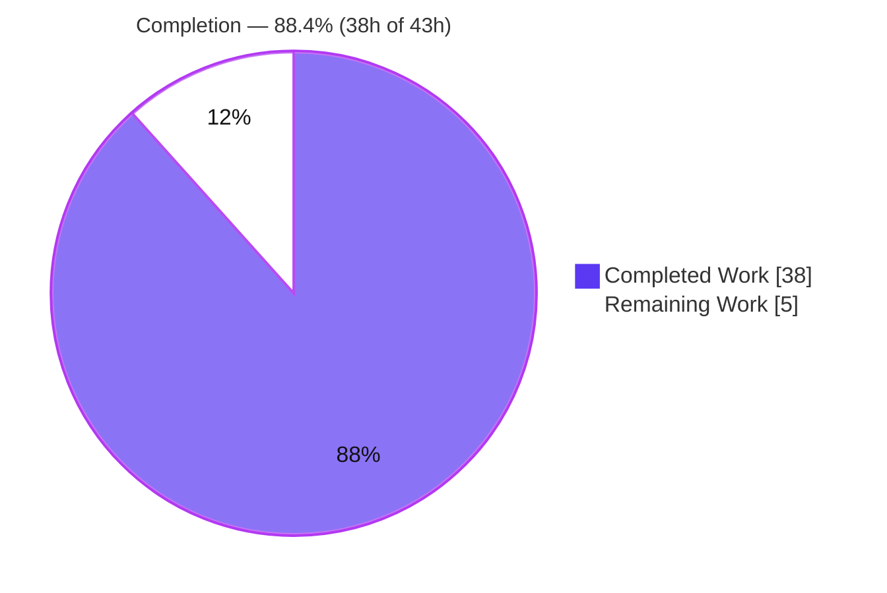
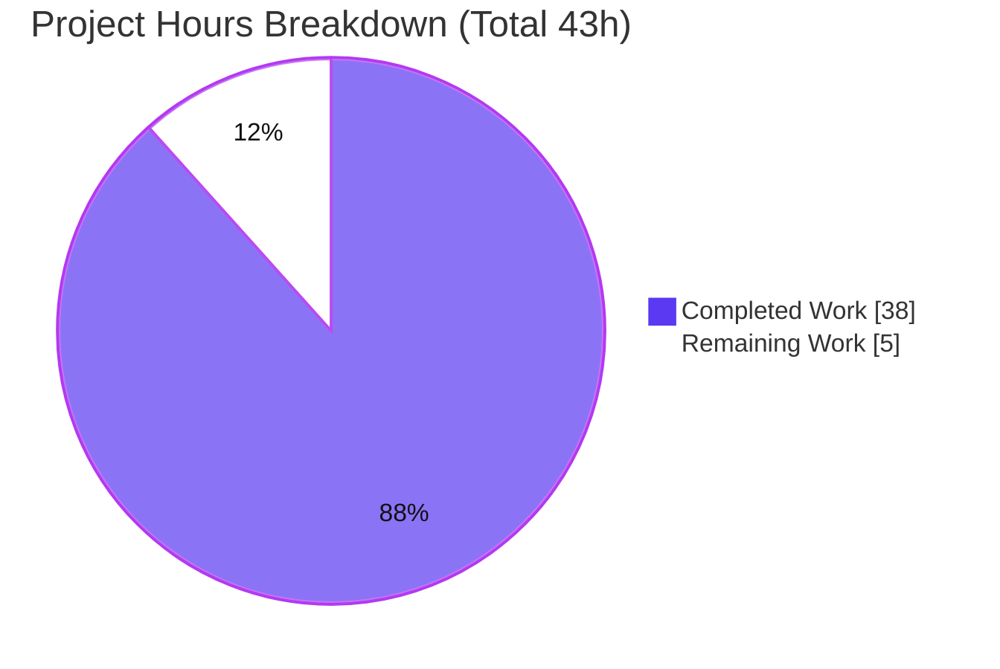
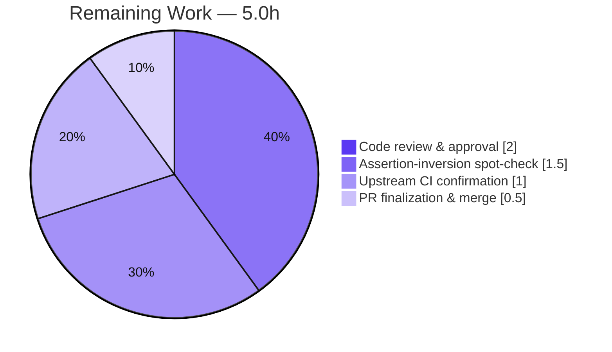

# Blitzy Project Guide — Targeted Unit Tests for Five Control-Plane Security Mechanisms

> **Repository:** `blitzy-kubernetes` (Kubernetes fork, Go 1.25.4) · **Branch:** `blitzy-a8aa76df-4f2d-4cd4-aa46-b075adb8afc7` · **HEAD:** `aed52bbb55a`
>
> **Brand legend:** <span style="color:#5B39F3">■</span> **Completed / AI Work** = Dark Blue `#5B39F3` · <span style="color:#FFFFFF;background:#333">■</span> **Remaining / Not Completed** = White `#FFFFFF` · <span style="color:#B23AF2">■</span> Headings/Accents = Violet-Black `#B23AF2` · <span style="color:#A8FDD9;background:#333">■</span> Highlight = Mint `#A8FDD9`

---

## 1. Executive Summary

### 1.1 Project Overview

This project adds a small, high-value set of **fast, in-process unit tests** to five control-plane security packages of a Kubernetes fork. Prior V1–V8 hardening configured and regression-locked these mechanisms at the *integration* level (with etcd and a live API server); this task complements — never replaces — that suite by locking the same decision logic at the *unit* level, where tests run in milliseconds against client-go fakes. Twelve new `TestXxx` functions cover PodSecurity admission, NodeRestriction admission, RBAC bootstrap policy, ServiceAccount token claims, and the GCE audit-policy generator. The audience is Kubernetes platform maintainers; the impact is a faster, cheaper regression safety-net for least-privilege, pod-security, token-hygiene, and audit-fidelity invariants — delivered under a strict 5,000-line budget with zero production or dependency changes.

### 1.2 Completion Status



| Metric | Hours |
|---|---|
| **Total Hours** | **43.0** |
| Completed Hours (AI + Manual) | 38.0 |
| Remaining Hours | 5.0 |
| **Percent Complete** | **88.4%** |

> Completion is computed per the AAP-scoped, hours-based method (PA1): `38.0 / (38.0 + 5.0) = 88.37% → 88.4%`. 100% of AAP-specified autonomous deliverables, constraints, and quality gates are **Completed**; the remaining 5.0h is exclusively human path-to-production work.

### 1.3 Key Accomplishments

- ✅ **12 new unit tests** added across **6 existing test files** (`+600 / −0` lines) — all five AAP priorities delivered.
- ✅ **50 / 50 top-level tests pass** under the race detector (`-race`), 0 failures, 0 skips (1,048 sub-tests including the audit test's 40 table cases).
- ✅ **Line budget honored:** 600 of 5,000 lines used (12%).
- ✅ **Minimal Change Clause satisfied:** zero production `.go` changes; the single-symbol export escape hatch was **not** needed.
- ✅ **Dependency freeze intact:** `go.mod`, `go.sum`, and `vendor/` untouched.
- ✅ **Frozen tests preserved:** `TestCreateMasterAuditPolicy` and the six integration regression tests unmodified and passing.
- ✅ **Quality gates green:** `gofmt` clean, `golangci-lint` v2.5.0 reports **0 issues**, `go vet` clean.
- ✅ **Framework discipline observed:** `testify` used only in the file that already imports it; no new mocking library; `goleak` not introduced.

### 1.4 Critical Unresolved Issues

| Issue | Impact | Owner | ETA |
|---|---|---|---|
| _None._ No compilation errors, test failures, or blocking defects exist. All autonomous scope is complete and verified. | — | — | — |

### 1.5 Access Issues

| System/Resource | Type of Access | Issue Description | Resolution Status | Owner |
|---|---|---|---|---|
| — | — | **No access issues identified.** All work performed offline against vendored dependencies (`GOPROXY=off`, `-mod=vendor`); no external credentials, registries, or services required. | N/A | — |

### 1.6 Recommended Next Steps

1. **[High]** Perform peer code review of the 6 test-file additions (additive-only; framework discipline; inline AAP citations).
2. **[High]** Run the manual assertion-inversion "can-it-fail" spot-check (AAP §0.10) to confirm no vacuous passes among the 12 new tests.
3. **[Medium]** Finalize and merge the pull request to the target branch.
4. **[Medium]** Confirm the upstream CI/Prow pipeline goes green (all local gates already pass).

---

## 2. Project Hours Breakdown

### 2.1 Completed Work Detail

| Component | Hours | Description |
|---|---|---|
| PodSecurity `Validate()` unit tests (P1 / V2) | 7.0 | 3 tests: `hostNetwork:true` under `enforce=baseline` → `Forbidden`; label-less namespace defaults privileged → admitted; warn-level recorder surfacing. Wires `fake.NewSimpleClientset` + `SharedInformerFactory`; internal `core.Pod` conversion. |
| NodeRestriction `Admit()` node-isolation tests (P2 / V7) | 4.0 | 2 tests: node updating its **own** pod status → admitted; **cross-node** pod status → denied with exact error string. Reuses `admitTestCase`/`makeTest*`. Includes investigation of the Secret-vs-pod-status nuance. |
| RBAC bootstrappolicy wildcard-invariant test (P3 / V1) | 3.0 | 1 test + helper: the set of full `*/*/*` ClusterRoles equals exactly `{cluster-admin}`, and its binding's subject is exactly the `system:masters` group (all subject fields matched). Bidirectional assertion. |
| ServiceAccount `Claims()` + JWT audience tests (P4 / V4) | 10.0 | 5 tests: claim shape (subject/audience/expiry/`kubernetes.io`), expiry boundary at `now+max`, dual-binding error, JWT audience mismatch → error and match → authenticated. Deterministic `now`/`newUUID` stubs; embedded non-secret RSA keys; `saOnlyGetter`. |
| Audit policy generator table test (P5 / V6) | 4.0 | 1 test running the **real** bash generator via `ManifestTestCase`: `configmaps`/`tokenreviews`/catch-all → `Metadata`; RBAC reads → `Request`, writes → `RequestResponse` (40 sub-cases). Uses `testify` (already imported here). |
| AAP analysis, convention discovery & testing-stack validation | 6.0 | Interpreting the AAP; studying each package's existing conventions and integration exemplars; confirming the vendored testing stack (testify v1.11.1, go-cmp v0.7.0, goleak v1.3.0, client-go fakes) is current for Go 1.25.4. |
| Local validation & quality gates | 4.0 | Per-package `-race` runs, single-test isolation runs, `gofmt`, `golangci-lint`, `go vet`, budget check, frozen-test and dependency-freeze verification. |
| **Total Completed** | **38.0** | |

### 2.2 Remaining Work Detail

| Category | Hours | Priority |
|---|---|---|
| Peer code review & approval of the 6 test-file additions | 2.0 | High |
| Manual assertion-inversion "can-it-fail" spot-check (AAP §0.10) | 1.5 | High |
| PR finalization & merge to target branch | 0.5 | Medium |
| Upstream CI/Prow full-pipeline confirmation to green | 1.0 | Medium |
| **Total Remaining** | **5.0** | |

> **Cross-section check:** 2.1 (38.0) + 2.2 (5.0) = **43.0** = Total Hours in §1.2. ✓

---

## 3. Test Results

All tests below originate from Blitzy's autonomous validation logs and were **independently re-executed** for this guide using `go test -race -count=1 -timeout=180s` on the Go 1.25.4 toolchain.

| Test Category | Framework | Total Tests | Passed | Failed | Coverage % | Notes |
|---|---|---|---|---|---|---|
| Unit — RBAC bootstrappolicy | Go `testing` + `go-cmp` | 16 | 16 | 0 | N/A (89.6% observed, not a gate) | Includes new `TestNoWildcardClusterRoleExceptClusterAdmin`. |
| Unit — NodeRestriction admission | Go `testing` | 7 | 7 | 0 | N/A | Includes 2 new node-isolation tests (own-pod-status admit / cross-node deny). |
| Unit — PodSecurity admission | Go `testing` + client-go fakes | 4 | 4 | 0 | N/A | Includes 3 new `Validate()` decision tests. |
| Unit — ServiceAccount | Go `testing` + `go-cmp` | 14 | 14 | 0 | N/A | Includes 5 new `Claims()`/JWT audience tests. |
| Unit/Generator — GCE GCI audit | `testify` + real bash generator | 9 | 9 | 0 | N/A | Includes new audit table test (40 sub-cases via `ManifestTestCase`). |
| **Total** | — | **50** | **50** | **0** | **N/A** | 1,048 sub-tests pass; race detector clean; 0 skips; 0 flakes. |

> **Coverage posture:** The repository runs CI with coverage collection **off by default** (`KUBE_COVER=n`); acceptance is pass/fail regression gating, not a percentage. Coverage is therefore reported as **N/A**, consistent with AAP §0.7.1. (An incidental `go test -cover` on bootstrappolicy showed 89.6% of statements — informational only.)

---

## 4. Runtime Validation & UI Verification

This is a **test-only** task (AAP §0.8.2): no server, integration harness, E2E, or UI is in scope. There is no web front-end to verify.

- ✅ **Operational** — Compilation & linking: all 5 scoped packages build and link (`go vet` exit 0; `go test` build phase clean).
- ✅ **Operational** — Unit decision paths: PodSecurity `Validate()`, NodeRestriction `Admit()`, RBAC enumeration, ServiceAccount `Claims()`/JWT authentication all execute in-process against fakes and assert the intended decision.
- ✅ **Operational** — Real runtime path (audit): the `create-master-audit-policy` **bash generator** (bash 5.2.37) executes for real via `ManifestTestCase` — subprocess + temp-file I/O + policy load & evaluate — 40 sub-cases pass.
- ✅ **Operational** — Determinism/race: all tests pass under `-race`; deterministic time/UUID via stubs; no `time.Sleep`, goroutines, or wall-clock dependence.
- ⚠ **Partial (human)** — Upstream CI/Prow pipeline has not yet gated this branch; all **local** equivalents (gofmt, golangci-lint, `go test -race`) are green.
- ❌ **Failing** — None.

---

## 5. Compliance & Quality Review

Cross-mapping of AAP deliverables and constraints to Blitzy quality/compliance benchmarks. Fixes applied during autonomous validation: **none required** (tests compiled, passed, and were lint-clean on arrival).

| Benchmark / AAP Deliverable | Status | Progress | Evidence |
|---|---|---|---|
| P1 PodSecurity `Validate()` tests (V2) | ✅ Pass | 100% | 3 funcs; `apierrors.IsForbidden`; positive+negative on identical pod. |
| P2 NodeRestriction `Admit()` tests (V7) | ✅ Pass | 100% | 2 funcs; exact denial string; own-pod-status admit. |
| P3 RBAC wildcard invariant (V1) | ✅ Pass | 100% | Role set == `{cluster-admin}`; binding subject == `system:masters`. |
| P4 ServiceAccount `Claims()`/JWT (V4) | ✅ Pass | 100% | 5 funcs; claim shape, expiry boundary, dual-binding error, audience match/mismatch. |
| P5 Audit generator table (V6) | ✅ Pass | 100% | Real bash generator; `Metadata`/`Request`/`RequestResponse` assertions. |
| Both positive & negative paths per decision | ✅ Pass | 100% | Verified in every test. |
| Race-clean, deterministic, independently runnable | ✅ Pass | 100% | `-race` clean; stubs restored via `defer`; `-run '^Name$'` isolation confirmed. |
| Behavior-descriptive names; additive-only | ✅ Pass | 100% | Incl. exact user example `TestPodSecurityWarnLevelSurfacesRestrictedViolation`; `+600/−0`. |
| Non-secret crypto fixtures | ✅ Pass | 100% | Reuses embedded RSA keys labeled "NOT a real credential". |
| Hard line cap ≤ 5,000 | ✅ Pass | 100% | 600 lines used (12%). |
| Minimal Change Clause (≤1 export) | ✅ Pass | 100% | 0 production files touched. |
| Frozen tests unmodified & passing | ✅ Pass | 100% | `TestCreateMasterAuditPolicy` comment-referenced only; passes. |
| Framework discipline (testify only in gci; no new mocks; no goleak) | ✅ Pass | 100% | Verified imports; client-go fakes only. |
| Do-not-fix rule (note, don't fix) | ✅ Pass | 100% | NodeRestriction Secret nuance documented inline, not fixed. |
| Dependency freeze (`go.mod`/`go.sum`/`vendor/`) | ✅ Pass | 100% | Diff confirms untouched. |
| `gofmt` / `golangci-lint` / `go vet` | ✅ Pass | 100% | gofmt clean; golangci-lint v2.5.0 → 0 issues; vet exit 0. |
| Manual assertion-inversion spot-check (AAP §0.10) | ⚠ Pending | 0% | Explicitly a human, non-committed step — see §2.2. |

---

## 6. Risk Assessment

Overall posture: **LOW**. All identified risks are Low severity; most are mitigated or accepted by design.

| Risk | Category | Severity | Probability | Mitigation | Status |
|---|---|---|---|---|---|
| Future upstream rebase evolves frozen test or a production decision function, requiring the behavior-locking tests to be updated | Technical | Low | Medium | Additive tests; conflicts surface clearly; re-run the 5 packages | Open (inherent) |
| PodSecurity test couples to internal `core.Pod` conversion + `DefaultBuildEffectiveVersion` | Technical | Low | Low | Uses plugin public entry points where feasible; documented inline | Mitigated |
| Literal "unrelated-Secret denial" not unit-covered (by design) | Technical | Low | N/A | Enforced by Node authorizer + RBAC / integration; documented inline | Accepted |
| Embedded RSA/ECDSA keys reused in `jwt_test.go` | Security | Low | Low | Pre-existing, labeled "NOT a real credential", test-only; no new key material | Mitigated |
| _(Positive)_ Tests lock security invariants (RBAC confinement, PSS enforcement, audience binding, audit fidelity) | Security | — | — | Reduces future regression risk; no new attack surface (test-only) | Benefit |
| Audit test spawns a real `bash` subprocess via `ManifestTestCase` | Operational | Low | Low | `bash` standard in k8s CI (5.2.37 present); pre-existing harness | Mitigated |
| Test flakiness under CI load | Operational | Low | Low | Deterministic stubs; `-race` clean; in-process; independently runnable | Mitigated |
| Upstream CI/Prow not yet gated on this branch | Integration | Low | Low | No config changes; auto-discovered; all local gates green | Open (human — §2.2) |
| Offline dependency resolution | Integration | Low | Low | `go.work` + `GOPROXY=off` + `-mod=vendor`; no fetch | Mitigated |
| Manual assertion-inversion not yet performed | Quality | Low | Low | Assertions reviewed as substantive (exact strings/levels/sets); listed in §2.2 | Open (human) |

---

## 7. Visual Project Status



**Remaining hours by category (from §2.2):**



> **Integrity:** "Remaining Work" = **5.0h**, identical to §1.2 Remaining Hours and the §2.2 "Hours" sum. "Completed Work" = **38.0h**, identical to §1.2 and §2.1. ✓

---

## 8. Summary & Recommendations

**Achievements.** The project is **88.4% complete** on an AAP-scoped, hours-based basis (38.0h of 43.0h). Every one of the five prioritized targets was delivered as 12 behavior-named, table-driven or focused unit tests that drive the real production decision functions in-process and assert both allow and deny outcomes. Independent re-execution confirms **50/50 top-level tests passing under `-race`** (1,048 sub-tests), with `gofmt`, `golangci-lint` (0 issues), and `go vet` all clean. Every hard constraint holds: the 5,000-line budget (600 used), the Minimal Change Clause (0 production changes), the frozen-test freeze, framework discipline, and the dependency freeze.

**Remaining gaps.** The outstanding **5.0h** is entirely human path-to-production: peer review, the AAP-mandated manual assertion-inversion "can-it-fail" spot-check, PR merge, and upstream CI confirmation. None is a code defect.

**Critical path to production.** Review → assertion-inversion spot-check → merge → CI green. Because all local gates already pass and no config changed, upstream CI is expected to be green on first run.

**Success metrics.** All named AAP behaviors are locked by independently runnable, race-clean unit tests (the repository's pass/fail acceptance model). No numeric coverage target applies.

**Production readiness.** **Ready pending human review.** This is a low-risk, additive, fully-verified test contribution with no blocking issues. Per Blitzy policy, completion is reported below 100% to reserve the final increment for human review and merge.

| Metric | Value |
|---|---|
| AAP-scoped completion | 88.4% |
| Autonomous deliverables complete | 5 / 5 priorities (100%) |
| Tests passing under `-race` | 50 / 50 (0 fail, 0 skip) |
| Line budget used | 600 / 5,000 (12%) |
| Production/dependency files changed | 0 |
| Blocking issues | 0 |

---

## 9. Development Guide

All commands below were executed and verified on this host (Go 1.25.4, Linux). Run from the **repository root** so the `go.work` workspace resolves.

### 9.1 System Prerequisites

- **Go 1.25.4** (matches `.go-version`); verify:
  ```bash
  go version
  # => go version go1.25.4 linux/amd64
  ```
- **bash** 5.x (the audit test invokes a real bash generator) — `bash --version` → 5.2.37 present.
- **git** + **git-lfs** 3.7.1 (pre-push hook).
- Optional: **golangci-lint v2.5.0** for the lint gate.
- OS: Linux/macOS. Disk: the full checkout is ~2.4 GB (vendored).

### 9.2 Environment Setup

Dependencies are fully vendored — **no network fetch required**. Configure a deterministic, offline, non-interactive environment:

```bash
cd /path/to/blitzy-kubernetes            # repository root (contains go.work)
export PATH=/usr/local/go/bin:$HOME/go/bin:$PATH
export GOPROXY=off                       # forbid network module fetches
export GOFLAGS=-mod=vendor               # build from vendored deps
export CI=true                           # non-interactive
```

### 9.3 Dependency Installation

None. `go.mod`, `go.sum`, and `vendor/` are frozen. The build resolves everything from `vendor/` via the `go.work` workspace. (Do **not** run `go mod tidy` or edit vendored files — `hack/verify-vendor.sh` fails CI on drift.)

### 9.4 Running the Tests

Run each scoped package under the race detector (matches CI defaults `-race`, `-timeout=180s`):

```bash
go test -race -count=1 -timeout=180s ./plugin/pkg/admission/security/podsecurity/
go test -race -count=1 -timeout=180s ./plugin/pkg/admission/noderestriction/
go test -race -count=1 -timeout=180s ./plugin/pkg/auth/authorizer/rbac/bootstrappolicy/
go test -race -count=1 -timeout=180s ./pkg/serviceaccount/
go test -race -count=1 -timeout=180s ./cluster/gce/gci/
# each prints: ok  <import-path>  <time>   (exit 0)
```

Repository-runner equivalent:

```bash
make test WHAT=./pkg/serviceaccount KUBE_RACE=-race
# delegates to hack/make-rules/test.sh; honors KUBE_TIMEOUT=-timeout=180s, KUBE_COVER=n
```

### 9.5 Verification Steps

```bash
# Run a single new test verbosely (behavior confirmation)
go test -race -count=1 -run '^TestNoWildcardClusterRoleExceptClusterAdmin$' -v \
  ./plugin/pkg/auth/authorizer/rbac/bootstrappolicy/
# => === RUN / --- PASS / ok

# Compile/vet check (no test execution)
go vet ./pkg/serviceaccount/            # exit 0

# Format gate (must print nothing)
gofmt -l \
  cluster/gce/gci/audit_policy_test.go \
  pkg/serviceaccount/claims_test.go pkg/serviceaccount/jwt_test.go \
  plugin/pkg/admission/noderestriction/admission_test.go \
  plugin/pkg/admission/security/podsecurity/admission_test.go \
  plugin/pkg/auth/authorizer/rbac/bootstrappolicy/policy_test.go

# Lint gate (0 issues)
golangci-lint run --config hack/golangci.yaml \
  ./plugin/pkg/auth/authorizer/rbac/bootstrappolicy/...   # => "0 issues."

# Optional coverage (NOT a gate)
go test -cover ./plugin/pkg/auth/authorizer/rbac/bootstrappolicy/   # e.g. coverage: 89.6%
```

### 9.6 Example Usage — the manual "can-it-fail" spot-check (AAP §0.10)

To confirm a new test is not a vacuous pass, momentarily invert one assertion, run it, confirm it **fails**, then revert (do **not** commit the inversion):

```bash
# 1) Edit one assertion in a new test (e.g. flip an expected error/level).
# 2) Confirm it now fails:
go test -race -count=1 -run '^TestPodSecurityEnforceBaselineRejectsHostNetwork$' -v \
  ./plugin/pkg/admission/security/podsecurity/     # expect FAIL
# 3) git checkout -- <file>   # revert the inversion
```

### 9.7 Troubleshooting

- **`error: externally-managed-environment`** — a Python/pip message; irrelevant to Go. Go deps are vendored.
- **Module fetch attempts / proxy errors** — ensure `GOPROXY=off` and `GOFLAGS=-mod=vendor` are exported.
- **Audit test cannot run generator** — ensure `bash` is on `PATH`; the harness writes to `t.TempDir()`.
- **Vendor verification failures in CI** — do not modify `go.mod`/`go.sum`/`vendor/`.
- **`go.work` errors** — run all commands from the repository root.
- **Slow first `-race` build** — expected; subsequent runs are cached.

---

## 10. Appendices

### A. Command Reference

| Purpose | Command |
|---|---|
| Toolchain version | `go version` |
| Run one package (race) | `go test -race -count=1 -timeout=180s ./<pkg>/` |
| Run one test | `go test -race -count=1 -run '^TestName$' -v ./<pkg>/` |
| Compile/vet | `go vet ./<pkg>/` |
| Format check | `gofmt -l <files>` |
| Lint | `golangci-lint run --config hack/golangci.yaml ./<pkg>/...` |
| Coverage (optional) | `go test -cover ./<pkg>/` |
| Runner equivalent | `make test WHAT=./<pkg> KUBE_RACE=-race` |
| In-scope diff summary | `git diff dc329e1a1469767695cdeeb0fcfd106549e98f5e --stat` |
| Step debug | `dlv test ./<pkg> -- -test.run '^TestName$'` |

### B. Port Reference

Not applicable — no service is started by this task (in-process unit tests only).

### C. Key File Locations

| File | Priority | +Lines | New tests |
|---|---|---|---|
| `plugin/pkg/admission/security/podsecurity/admission_test.go` | P1 / V2 | 154 | `TestPodSecurityEnforceBaselineRejectsHostNetwork`, `TestPodSecurityUnlabeledNamespaceDefaultsPrivileged`, `TestPodSecurityWarnLevelSurfacesRestrictedViolation` |
| `plugin/pkg/admission/noderestriction/admission_test.go` | P2 / V7 | 50 | `TestNodeRestrictionNodeUpdatesOwnPodStatusAdmitted`, `TestNodeRestrictionCrossNodePodStatusDenied` |
| `plugin/pkg/auth/authorizer/rbac/bootstrappolicy/policy_test.go` | P3 / V1 | 75 | `TestNoWildcardClusterRoleExceptClusterAdmin` (+ helper) |
| `pkg/serviceaccount/claims_test.go` | P4 / V4 | 159 | `TestClaimsExpiryBoundary`, `TestClaimsRejectsDualBinding`, `TestClaimsKubernetesSubclaimShape` |
| `pkg/serviceaccount/jwt_test.go` | P4 / V4 | 107 | `TestAuthenticateTokenAudienceMismatch`, `TestAuthenticateTokenAudienceMatch` |
| `cluster/gce/gci/audit_policy_test.go` | P5 / V6 | 55 | `TestAuditPolicyKeepsLowSensitivityResourcesAtMetadata` |
| **Reference runner** | — | — | `hack/make-rules/test.sh`, `hack/golangci.yaml` |

### D. Technology Versions

| Role | Package | Version | Notes |
|---|---|---|---|
| Toolchain | Go `testing` | 1.25.4 | Matches `.go-version`. |
| Fluent assertions | `github.com/stretchr/testify` | v1.11.1 | Used **only** in the gci audit test. |
| Deep equality | `github.com/google/go-cmp` | v0.7.0 | bootstrappolicy / serviceaccount. |
| Leak detection | `go.uber.org/goleak` | v1.3.0 | Present but **not introduced** by this task. |
| Client fakes/informers | `k8s.io/client-go` | in-tree staging (`v0.0.0`) | Admission-plugin isolation. |
| Lint | `golangci-lint` | v2.5.0 | Via `hack/golangci.yaml`. |
| Audit subprocess | `bash` | 5.2.37 | Runs `create-master-audit-policy`. |
| VCS | `git-lfs` | 3.7.1 | Pre-push hook. |

### E. Environment Variable Reference

| Variable | Value | Purpose |
|---|---|---|
| `GOPROXY` | `off` | Forbid network module fetches (vendored build). |
| `GOFLAGS` | `-mod=vendor` | Build from `vendor/`. |
| `CI` | `true` | Non-interactive execution. |
| `PATH` | `/usr/local/go/bin:$HOME/go/bin:$PATH` | Locate the Go 1.25.4 toolchain. |
| `KUBE_RACE` | `-race` | Enable race detector in `make test`. |
| `KUBE_TIMEOUT` | `-timeout=180s` | Per-package timeout (default). |
| `KUBE_COVER` | `n` | Coverage off by default (not a gate). |

### F. Developer Tools Guide

- **Race detector** — always run new/changed tests with `-race`; all 12 additions are race-clean.
- **Single-test isolation** — `-run '^Name$'` proves independence (no shared mutable state / order dependence).
- **`gofmt` / `golangci-lint` / `go vet`** — the format, lint, and vet gates; all currently clean.
- **Delve (`dlv test`)** — step-debug a specific test when investigating a failure.
- **`git diff <merge-base> --stat`** — quickest way to review the additive scope (merge-base `dc329e1a1469767695cdeeb0fcfd106549e98f5e`).

### G. Glossary

| Term | Meaning |
|---|---|
| **AAP** | Agent Action Plan — the authoritative scope for this task. |
| **PSS** | Pod Security Standards (`privileged` / `baseline` / `restricted`). |
| **Admission plugin** | In-process validator/mutator invoked before persisting an API object (`Validate()` / `Admit()`). |
| **NodeRestriction** | Admission plugin confining each kubelet to its own node's objects. |
| **Bootstrap policy** | The built-in RBAC ClusterRoles/Bindings shipped with the control plane. |
| **`*/*/*` rule** | A PolicyRule wildcarding all verbs, API groups, and resources (full cluster-admin power). |
| **Claims** | JWT payload fields for a ServiceAccount token (subject, audience, expiry, `kubernetes.io`). |
| **Audit level** | `None` < `Metadata` < `Request` < `RequestResponse` — how much of a request/response is recorded. |
| **`ManifestTestCase`** | Harness that runs a real bash generator function and captures its output for assertions. |
| **client-go fake** | In-memory `Clientset` (`fake.NewSimpleClientset`) feeding a `SharedInformerFactory` — no API server. |
| **Frozen test** | A pre-existing test that must remain byte-for-byte unchanged and keep passing. |
| **Merge-base** | The common ancestor commit used to compute this task's additive diff. |
