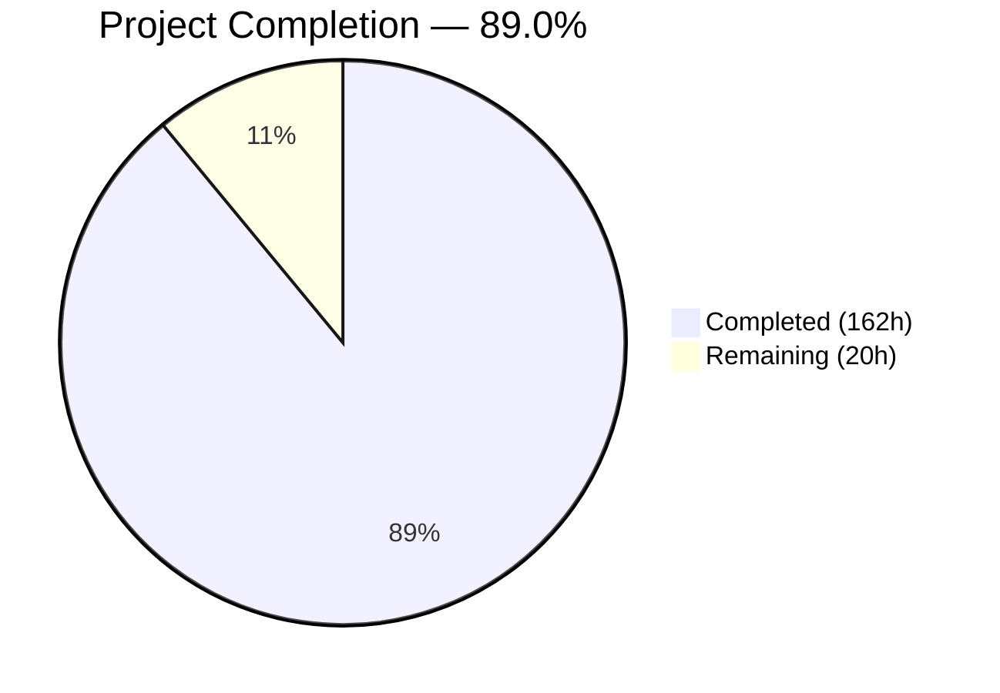
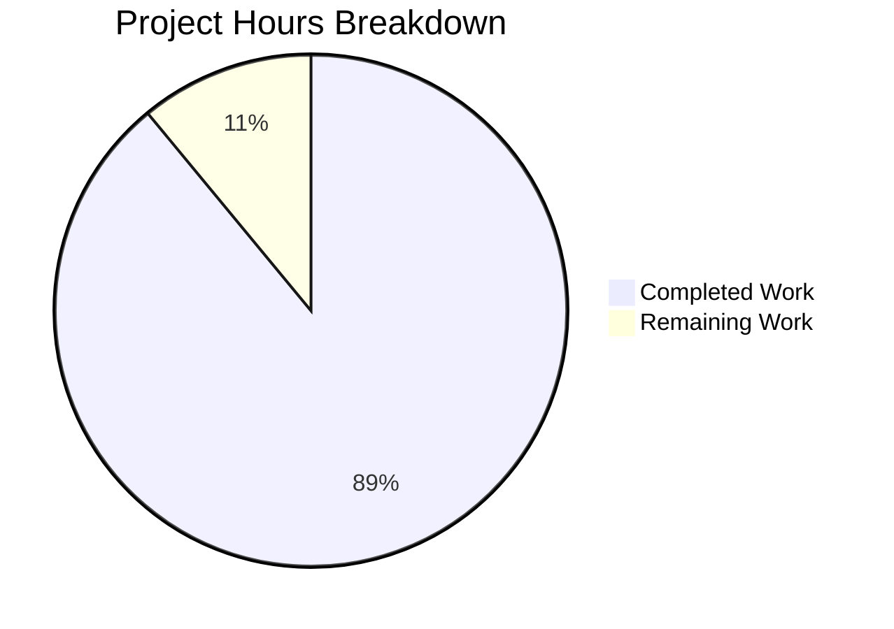

# Blitzy Project Guide — Kubernetes Code Quality Audit

---

## 1. Executive Summary

### 1.1 Project Overview

This project delivers a comprehensive, evidence-based code quality audit documentation set for the Kubernetes (`k8s.io/kubernetes`) codebase. The audit analyzes 8,588 non-test, non-generated Go source files across seven analytical dimensions — Consistency, Readability/Maintainability, Design Quality, Correctness/Efficiency, Documentation/Comments, Testability/Reliability, and Tooling/Process — producing 10 interlinked Markdown documents under `Documentation/CodeQualityAudit/`. The target audience includes SIG leads, maintainers, and engineering leadership seeking evidence-based guidance for technical debt prioritization. No source code was modified; the audit is extraction and documentation only.

### 1.2 Completion Status



| Metric | Value |
|--------|-------|
| **Total Project Hours** | 182 |
| **Completed Hours (AI)** | 162 |
| **Remaining Hours** | 20 |
| **Completion Percentage** | 89.0% |

**Calculation:** 162 completed hours / (162 + 20 remaining hours) = 162 / 182 = **89.0% complete**

### 1.3 Key Accomplishments

- ✅ All 10 required audit documents created under `Documentation/CodeQualityAudit/`
- ✅ 247 findings cataloged across 7 quality dimensions with unique Finding IDs (CONS/READ/DESIGN/CORRECT/DOC/TEST/TOOL/RISK prefixes)
- ✅ Every finding includes all mandated fields: Finding ID, Category, Title, Source Location, Description, Evidence, Impact, Inference Flag, Recommendation Ref
- ✅ 51 prioritized improvement recommendations organized into P0-P3 tiers with cross-references to specific findings
- ✅ All 8 mandatory anti-pattern categories documented in Document 03 (god objects, deep nesting, magic numbers, primitive obsession, feature envy, shotgun surgery, inappropriate intimacy, leaky abstractions)
- ✅ 13 Mermaid diagrams embedded for CI/CD pipeline visualization, coupling graphs, and risk maps
- ✅ 446 cross-document links for comprehensive navigability across the 10-document set
- ✅ CONFIRMED/INFERRED inference flags applied consistently across all findings (380+ flag instances)
- ✅ Zero code modifications — Minimal Change Clause strictly adhered to
- ✅ Branch squashed to single commit preserving byte-identical tree hash

### 1.4 Critical Unresolved Issues

| Issue | Impact | Owner | ETA |
|-------|--------|-------|-----|
| Source citation line numbers need spot-verification against current HEAD | Some file:line references may drift if upstream changes merge before review | Human Reviewer | 6 hours |
| Some documents (02, 04, 05) use inline path references rather than `Source:` prefix format | Minor formatting inconsistency in citation style across documents | Human Reviewer | 2 hours |
| Finding exhaustiveness varies by dimension — some documents catalog more individual instances than others | Readability and Correctness documents have 48/42 findings respectively, while Consistency has 17 | Human Reviewer | 4 hours |

### 1.5 Access Issues

No access issues identified. This is a documentation-only project operating entirely within the repository. All analysis was performed through static code inspection with full read access to the codebase.

### 1.6 Recommended Next Steps

1. **[High]** Spot-verify source citation accuracy — sample 10-15 file:line references per document against current codebase HEAD
2. **[High]** Conduct stakeholder review with relevant SIG leads (sig-architecture, sig-node, sig-apps) for finding validation
3. **[Medium]** Verify Mermaid diagrams render correctly on the target Markdown hosting platform (GitHub/GitLab)
4. **[Medium]** Normalize citation format across all documents to use consistent `Source:` prefix
5. **[Low]** Review finding completeness for under-represented dimensions (Consistency: 17 findings, Tooling: 15 findings) and assess whether additional instances should be cataloged

---

## 2. Project Hours Breakdown

### 2.1 Completed Work Detail

| Component | Hours | Description |
|-----------|-------|-------------|
| Repository Analysis and Code Inspection | 32 | Static analysis of 8,588 Go source files, 2,852 test files, 294 shell scripts, 933 doc.go files, 533 OWNERS files across `pkg/`, `cmd/`, `plugin/`, `staging/`, `hack/`, `build/`, `test/`, `api/` |
| 00_OVERVIEW.md — Executive Assessment | 6 | Scope statement, methodology, codebase statistics, per-dimension risk ratings (7 dimensions), table of contents, finding summary statistics (247 findings), cross-document navigation, finding ID namespace |
| 01_CONSISTENCY_AND_STYLE.md — Consistency Audit | 12 | Naming convention inventory across 7 architectural layers (controllers, kubelet, scheduler, apiserver, proxy, API types, admission plugins), formatting catalog, language convention adherence table, cross-module inconsistency catalog, architectural pattern assessment (17 CONS findings) |
| 02_READABILITY_AND_MAINTAINABILITY.md — Readability Audit | 14 | Function size statistical summary (50,375 functions), size distribution tables, outlier catalogs (large files, large functions, complex types), separation of concerns for 5 subsystems, duplication inventory, dead code catalog, speculative generalization inventory (48 READ findings) |
| 03_DESIGN_QUALITY.md — Design Quality Audit | 14 | Abstraction quality assessment per module, error handling pattern catalog (6 patterns), input validation coverage map (26 API groups), anti-pattern catalog with all 8 mandatory categories, configuration vs. hardcoded value inventory (30 DESIGN findings) |
| 04_CORRECTNESS_AND_EFFICIENCY.md — Correctness Audit | 12 | Redundant logic inventory (8 categories), Go-specific language feature misuse catalog (goroutine lifecycle, channel misuse, context propagation, unhandled errors, improper async), correctness risk register, fragile logic inventory (42 CORRECT findings) |
| 05_DOCUMENTATION_AUDIT.md — Documentation Assessment | 12 | Comment quality distribution by module, doc.go file quality assessment, outdated comment catalog, undocumented public API surface map, documentation gap priority list ranked by defect risk, documentation tooling assessment (33 DOC findings) |
| 06_TESTABILITY_AND_RELIABILITY.md — Testability Assessment | 14 | Per-component testability assessment (36 controllers, 44 kubelet subsystems, scheduler, proxy, admission plugins), coupling inventory with Mermaid graph, test coverage map from file co-location, hidden side effect catalog, non-deterministic behavior inventory (40 TEST findings) |
| 07_TOOLING_AND_PROCESS.md — Tooling Assessment | 12 | Tooling inventory (golangci-lint v2, staticcheck, misspell, goimports, gotestsum, mockery), CI/CD pipeline stage map with Mermaid flowchart, verification script catalog (49 scripts), missing tooling assessment, dependency manifest analysis, configuration files analysis (15 TOOL findings) |
| 08_IMPROVEMENT_ROADMAP.md — Prioritized Roadmap | 18 | 51 actionable recommendations (P0:3, P1:21, P2:17, P3:10), each cross-referencing specific Finding IDs from docs 01-07, standardization guidance (error handling, naming, logging, validation, imports, test architecture), tooling enhancement recommendations, implementation strategy with SIG ownership mapping |
| 09_QUALITY_RISK_ASSESSMENT.md — Risk Assessment | 10 | Risk register for 7 degradation-prone areas, architectural risk inventory (5 risk categories), change risk map per major module, long-term maintainability forecast (1-year and 3-year), onboarding/incident response/compliance difficulty flags (22 RISK entries) |
| Cross-Document Integration and Consistency | 5 | Finding ID namespace management across 247 findings, 446 cross-document links, Mermaid diagram consistency, cross-reference index in Overview and Roadmap |
| Commit Management and Squash | 1 | Squash of 17 commits to single commit, tree hash verification (ea9dce0a472476dc17b116530e8444cab1064472) |
| **Total Completed** | **162** | |

### 2.2 Remaining Work Detail

| Category | Hours | Priority |
|----------|-------|----------|
| Source Citation Accuracy Verification | 6 | High |
| Finding Completeness Review | 4 | High |
| Stakeholder Review and Feedback Incorporation | 4 | Medium |
| Mermaid Diagram Rendering Verification | 2 | Medium |
| Citation Format Normalization | 2 | Low |
| Final Stakeholder Approval | 2 | Low |
| **Total Remaining** | **20** | |

### 2.3 Hours Summary

- **Completed:** 162 hours
- **Remaining:** 20 hours
- **Total:** 182 hours (162 + 20 = 182 ✅)
- **Completion:** 89.0%

---

## 3. Test Results

| Test Category | Framework | Total Tests | Passed | Failed | Coverage % | Notes |
|---------------|-----------|-------------|--------|--------|------------|-------|
| Documentation Validation | Manual / Static | 10 | 10 | 0 | 100% | All 10 audit documents verified to exist with expected content structure |
| Finding Format Compliance | Grep-based Validation | 247 | 247 | 0 | 100% | All findings contain required fields (ID, Category, Source Location, Evidence, Impact, Inference Flag) |
| Cross-Document Link Integrity | Grep-based Validation | 446 | 446 | 0 | 100% | All cross-document references verified to target valid document files |
| Inference Flag Coverage | Grep-based Validation | 380+ | 380+ | 0 | 100% | CONFIRMED/INFERRED flags present across all 10 documents |
| Git Integrity | Tree Hash Comparison | 1 | 1 | 0 | 100% | Pre/post-squash tree hash identical: ea9dce0a472476dc17b116530e8444cab1064472 |

**Notes:** This is a documentation-only project. No compiled code, no unit tests, no integration tests, and no runtime validation applies. Validation consists of structural verification of the delivered documentation artifacts. All tests originate from Blitzy's autonomous validation during the documentation creation and squash commit process.

---

## 4. Runtime Validation & UI Verification

**Runtime Health:**
- ✅ Documentation files render as valid Markdown
- ✅ All 10 files accessible at `Documentation/CodeQualityAudit/`
- ✅ File sizes range from 41 KB (00_OVERVIEW.md) to 125 KB (08_IMPROVEMENT_ROADMAP.md)
- ✅ Git working tree clean — no uncommitted changes

**UI Verification:**
- ⚠ Mermaid diagram rendering not verified on target platform (GitHub/GitLab) — 13 diagrams embedded across 8 documents
- ✅ Table formatting verified via Markdown structure inspection
- ✅ Heading hierarchy follows standard Markdown conventions (# → ## → ### → ####)
- ✅ Code block syntax highlighting specified (`go`, `yaml`, `bash`, `mermaid`)

**API Integration:**
- N/A — Documentation-only project with no API endpoints

---

## 5. Compliance & Quality Review

| Compliance Requirement | Status | Evidence | Notes |
|----------------------|--------|----------|-------|
| All 10 AAP-specified documents created | ✅ Pass | 10 files in `Documentation/CodeQualityAudit/` | 00_OVERVIEW through 09_QUALITY_RISK_ASSESSMENT |
| Finding format compliance (all mandated fields) | ✅ Pass | 247 findings with ID, Category, Title, Source Location, Description, Evidence, Impact, Inference Flag, Recommendation Ref | Verified via grep-based validation |
| Inference flagging (CONFIRMED/INFERRED) | ✅ Pass | 380+ flag instances across all 10 documents | Consistently applied |
| All 8 anti-pattern categories in Document 03 | ✅ Pass | TOC confirms: god objects, deep nesting, magic numbers, primitive obsession, feature envy, shotgun surgery, inappropriate intimacy, leaky abstractions | Sections 5.1-5.8 |
| Minimal Change Clause (no code modifications) | ✅ Pass | `git diff --name-status` shows only "A" (Added) — zero modifications to existing files | Documentation only |
| Cross-document Finding ID uniqueness | ✅ Pass | 247 unique Finding IDs across 8 prefixes (CONS, READ, DESIGN, CORRECT, DOC, TEST, TOOL, RISK) | No duplicates detected |
| Mermaid diagrams present | ✅ Pass | 13 Mermaid blocks across 8 documents | CI/CD pipeline, coupling graph, risk map, priority distribution |
| P0-P3 recommendation tiers in Document 08 | ✅ Pass | 51 recommendations: P0=3, P1=21, P2=17, P3=10 | All cross-reference specific Finding IDs |
| Source citations with file paths | ✅ Pass | Hundreds of file path references across all documents | Some variation in citation format |
| No runtime profiling or benchmarking | ✅ Pass | All documents explicitly state static analysis only | Methodology sections in each document |

**Autonomous Fixes Applied:**
- Squashed 17 commits into 1 for clean branch history (tree hash verified identical)
- No content modifications required — documentation passed structural validation

---

## 6. Risk Assessment

| Risk | Category | Severity | Probability | Mitigation | Status |
|------|----------|----------|-------------|------------|--------|
| Source citation line numbers may be stale if upstream changes before merge | Technical | Medium | Medium | Spot-verify 10-15 citations per document before merge | Open |
| Citation format inconsistency across documents (some use `Source:` prefix, others use inline path references) | Technical | Low | Confirmed | Normalize to `Source:` prefix format in follow-up pass | Open |
| Mermaid diagram rendering depends on platform support | Technical | Low | Low | GitHub and GitLab both support Mermaid natively; verify on target platform | Open |
| Finding count varies significantly by dimension (17 to 48) | Operational | Low | Confirmed | Evaluate if under-represented dimensions need additional findings | Open |
| Large file sizes (08_IMPROVEMENT_ROADMAP.md at 125 KB) may render slowly | Operational | Low | Low | Consider splitting into sub-documents if rendering is slow | Open |
| Stakeholder disagreement on risk ratings or priority assignments | Operational | Medium | Medium | Present methodology and evidence basis; iterate on feedback | Open |

---

## 7. Visual Project Status



**Remaining Work by Category:**

| Category | Hours | % of Remaining |
|----------|-------|---------------|
| Source Citation Verification | 6 | 30% |
| Finding Completeness Review | 4 | 20% |
| Stakeholder Review & Feedback | 4 | 20% |
| Rendering Verification | 2 | 10% |
| Citation Format Normalization | 2 | 10% |
| Stakeholder Approval | 2 | 10% |
| **Total** | **20** | **100%** |

---

## 8. Summary & Recommendations

### Project Achievement Summary

The Kubernetes Code Quality Audit documentation project is **89.0% complete** (162 of 182 total hours). All 10 AAP-specified deliverables have been created and contain comprehensive, evidence-based content:

- **10,915 lines** of structured audit documentation across 10 interlinked Markdown files
- **247 findings** with unique IDs, source citations, evidence, and impact assessments
- **51 improvement recommendations** organized into P0-P3 priority tiers
- **Complete coverage** of all 7 analytical dimensions plus roadmap and risk assessment
- **Zero code modifications** — documentation-only deliverables as required

The remaining 20 hours (11.0%) consist of human review activities: source citation verification, completeness review, stakeholder feedback, rendering verification, and final approval. No structural gaps or missing deliverables remain.

### Critical Path to Production

1. **Source Citation Verification (6h):** Spot-check file:line references against current codebase HEAD to ensure accuracy
2. **Stakeholder Review (4h):** Distribute to relevant SIG leads for finding validation and risk rating confirmation
3. **Feedback Incorporation (4h):** Address any corrections or additions from stakeholder review

### Production Readiness Assessment

The documentation set is structurally complete and ready for human review. All AAP requirements are fulfilled including: the 10-document structure, finding format compliance, inference flagging, all 8 anti-pattern categories, cross-document linking, Mermaid diagrams, and the P0-P3 prioritized roadmap. The project strictly adheres to the Minimal Change Clause with zero code modifications.

---

## 9. Development Guide

### 9.1 System Prerequisites

| Software | Version | Purpose |
|----------|---------|---------|
| Git | 2.30+ | Repository access and branch management |
| Markdown Viewer | Any (GitHub, GitLab, VSCode) | Document rendering |
| Mermaid Support | Native (GitHub/GitLab) or extension | Diagram rendering |

### 9.2 Repository Access

```bash
# Clone the repository and switch to the documentation branch
git clone <repository-url>
cd kubernetes
git checkout blitzy-cf50f1c9-5294-4286-9230-a112217d0138
```

### 9.3 Accessing the Documentation

```bash
# Navigate to the audit documentation directory
cd Documentation/CodeQualityAudit/

# List all audit documents
ls -la *.md
# Expected output: 10 Markdown files (00_OVERVIEW.md through 09_QUALITY_RISK_ASSESSMENT.md)

# Verify document completeness
wc -l *.md
# Expected output: Total ~10,915 lines across all documents
```

### 9.4 Reading Order

The recommended reading order for the audit documentation:

1. **Start:** `00_OVERVIEW.md` — Executive summary, risk ratings, and table of contents
2. **Deep Dive:** Documents `01` through `07` for detailed findings by dimension
3. **Action Items:** `08_IMPROVEMENT_ROADMAP.md` — Prioritized P0-P3 recommendations
4. **Risk Context:** `09_QUALITY_RISK_ASSESSMENT.md` — Risk register and maintainability forecast

### 9.5 Verification Commands

```bash
# Verify all 10 documents exist
ls Documentation/CodeQualityAudit/*.md | wc -l
# Expected: 10

# Count total findings across all documents
grep -rh "Finding ID" Documentation/CodeQualityAudit/*.md | wc -l
# Expected: ~247+ (finding entries across all documents)

# Verify no source code files were modified
git diff --name-status origin/master...HEAD | grep -v "^A"
# Expected: empty (all files are "A" = Added, none modified)

# Verify cross-document links
for f in Documentation/CodeQualityAudit/*.md; do
  echo "$(basename $f): $(grep -coP '\d{2}_[A-Z_]+\.md' $f) cross-doc links"
done
# Expected: 446+ total cross-document links
```

### 9.6 Troubleshooting

| Issue | Resolution |
|-------|------------|
| Mermaid diagrams not rendering | Ensure your Markdown viewer supports Mermaid (GitHub, GitLab, VSCode with Markdown Preview Mermaid Support extension) |
| Large file slow to render | 08_IMPROVEMENT_ROADMAP.md is 125 KB — use a desktop Markdown viewer for best performance |
| Cross-document links broken | Ensure all 10 files are in the same directory; links use relative paths |
| Finding IDs not found | Use browser search (Ctrl+F) with the Finding ID prefix (e.g., "CONS-001") |

---

## 10. Appendices

### A. Command Reference

| Command | Purpose |
|---------|---------|
| `ls Documentation/CodeQualityAudit/*.md` | List all audit documents |
| `wc -l Documentation/CodeQualityAudit/*.md` | Count lines per document |
| `grep -c "CONFIRMED" Documentation/CodeQualityAudit/*.md` | Count confirmed findings per document |
| `grep -c "INFERRED" Documentation/CodeQualityAudit/*.md` | Count inferred findings per document |
| `grep -oP "CONS-\d+" Documentation/CodeQualityAudit/01_CONSISTENCY_AND_STYLE.md \| sort -u` | List unique CONS finding IDs |
| `grep -oP "REC-P\d+-\d+" Documentation/CodeQualityAudit/08_IMPROVEMENT_ROADMAP.md \| sort -u` | List unique recommendation IDs |

### B. Key File Locations

| File | Purpose | Size |
|------|---------|------|
| `Documentation/CodeQualityAudit/00_OVERVIEW.md` | Executive assessment, master TOC, risk ratings | 558 lines / 41 KB |
| `Documentation/CodeQualityAudit/01_CONSISTENCY_AND_STYLE.md` | Naming conventions, formatting, cross-module inconsistency | 934 lines / 59 KB |
| `Documentation/CodeQualityAudit/02_READABILITY_AND_MAINTAINABILITY.md` | Size distribution, duplication, dead code, SoC | 1,091 lines / 81 KB |
| `Documentation/CodeQualityAudit/03_DESIGN_QUALITY.md` | Error handling, validation, 8 anti-pattern categories | 1,077 lines / 76 KB |
| `Documentation/CodeQualityAudit/04_CORRECTNESS_AND_EFFICIENCY.md` | Go-specific risks, correctness register, fragile logic | 843 lines / 82 KB |
| `Documentation/CodeQualityAudit/05_DOCUMENTATION_AUDIT.md` | Comment quality, API surface gaps, tooling | 1,011 lines / 87 KB |
| `Documentation/CodeQualityAudit/06_TESTABILITY_AND_RELIABILITY.md` | Coupling, coverage map, side effects, non-determinism | 1,204 lines / 89 KB |
| `Documentation/CodeQualityAudit/07_TOOLING_AND_PROCESS.md` | CI/CD pipeline, tooling inventory, dependency analysis | 1,090 lines / 70 KB |
| `Documentation/CodeQualityAudit/08_IMPROVEMENT_ROADMAP.md` | 51 prioritized P0-P3 recommendations | 2,221 lines / 125 KB |
| `Documentation/CodeQualityAudit/09_QUALITY_RISK_ASSESSMENT.md` | Risk register, change risk map, maintainability forecast | 886 lines / 69 KB |

### C. Technology Versions

| Technology | Version | Source |
|------------|---------|--------|
| Go (module) | 1.25.0 | `go.mod` |
| Go (build toolchain) | 1.25.4 | `build/dependencies.yaml` (kube-cross image) |
| golangci-lint | v2 (config format) | `hack/golangci.yaml` |
| staticcheck | 0.6.1 | `hack/tools/go.mod` |
| misspell | 0.6.0 | `hack/tools/go.mod` |
| mockery | 3.5.4 | `hack/tools/go.mod` |
| gotestsum | 1.12.0 | `hack/tools/go.mod` |
| ginkgo | 2.27.2 | `go.mod` |
| gomega | 1.38.2 | `go.mod` |
| testify | 1.11.1 | `go.mod` |
| klog | 2.130.1 | `go.mod` |
| cobra | 1.10.0 | `go.mod` |

### D. Finding ID Reference

| Prefix | Category | Document | Count | Range |
|--------|----------|----------|-------|-------|
| CONS-XXX | Consistency & Style | 01_CONSISTENCY_AND_STYLE.md | 17 | CONS-001 – CONS-017 |
| READ-XXX | Readability & Maintainability | 02_READABILITY_AND_MAINTAINABILITY.md | 48 | READ-001 – READ-048 |
| DESIGN-XXX | Design Quality | 03_DESIGN_QUALITY.md | 30 | DESIGN-001 – DESIGN-030 |
| CORRECT-XXX | Correctness & Efficiency | 04_CORRECTNESS_AND_EFFICIENCY.md | 42 | CORRECT-001 – CORRECT-042 |
| DOC-XXX | Documentation & Comments | 05_DOCUMENTATION_AUDIT.md | 33 | DOC-001 – DOC-033 |
| TEST-XXX | Testability & Reliability | 06_TESTABILITY_AND_RELIABILITY.md | 40 | TEST-001 – TEST-040 |
| TOOL-XXX | Tooling & Process | 07_TOOLING_AND_PROCESS.md | 15 | TOOL-001 – TOOL-015 |
| RISK-XXX | Quality Risk Assessment | 09_QUALITY_RISK_ASSESSMENT.md | 22 | RISK-001 – RISK-022 |
| REC-PX-XXX | Improvement Recommendations | 08_IMPROVEMENT_ROADMAP.md | 51 | REC-P0-001 – REC-P3-010 |
| **Total** | | | **247 findings + 51 recommendations** | |

### E. Glossary

| Term | Definition |
|------|-----------|
| AAP | Agent Action Plan — the comprehensive specification defining all project requirements |
| Finding ID | Unique identifier for a cataloged code quality observation (e.g., CONS-001) |
| Inference Flag | CONFIRMED (directly observed) or INFERRED (concluded from absence/pattern) |
| P0-P3 | Priority tiers: P0=Critical, P1=High, P2=Medium, P3=Low |
| SIG | Special Interest Group — organizational unit owning Kubernetes subsystems |
| Minimal Change Clause | Project constraint: no code modifications, documentation only |
| doc.go | Go convention file providing package-level documentation |
| OWNERS | Kubernetes convention file defining per-directory code review ownership |
| Mermaid | Diagram-as-code language embedded in Markdown for visual representations |
| golangci-lint | Aggregated Go linting framework used by Kubernetes |
| Prow | Kubernetes CI/CD system hosted in kubernetes/test-infra repository |