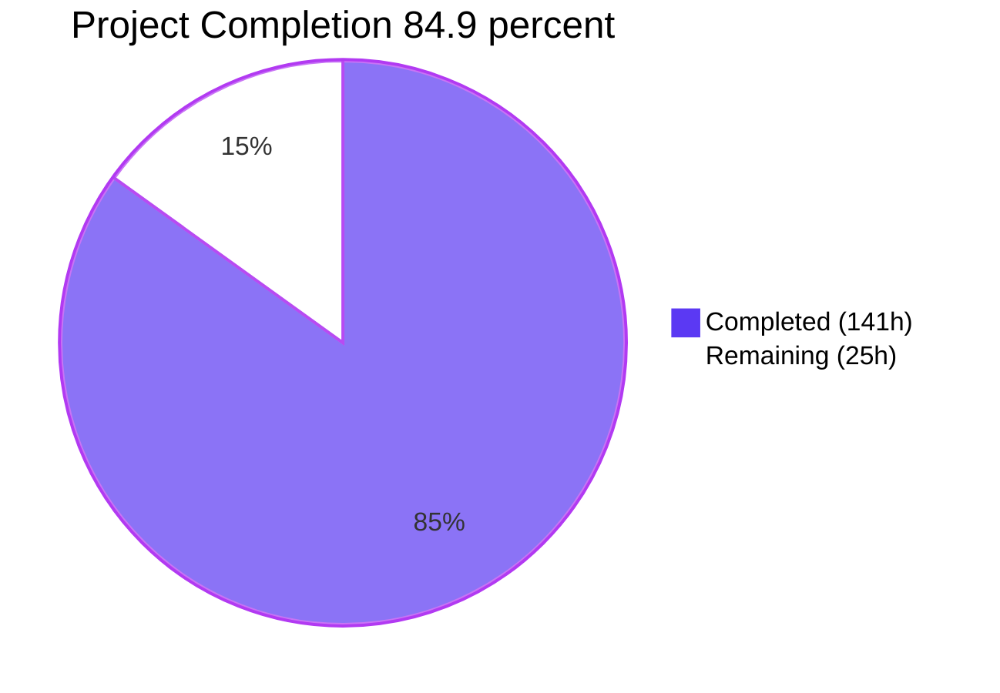
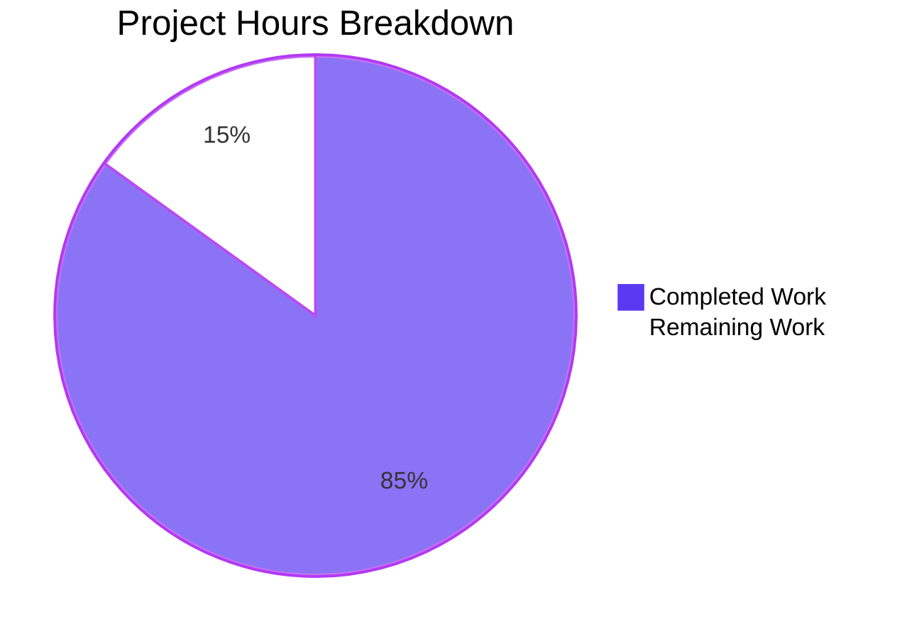
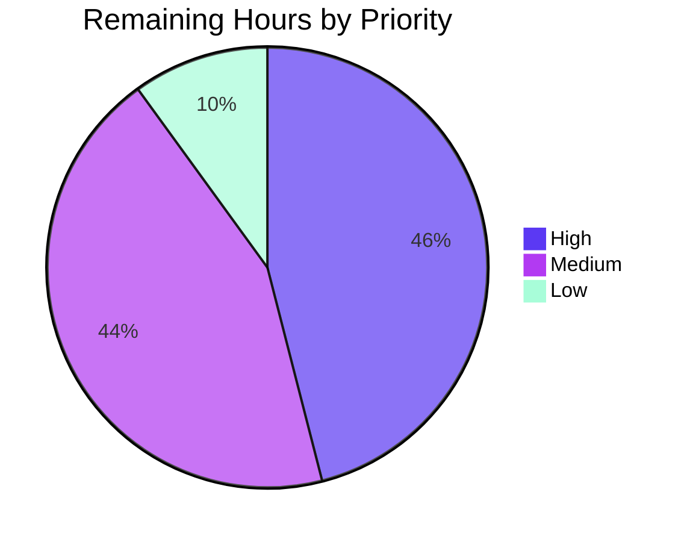

# Blitzy Project Guide — Kubernetes Code Quality Audit Documentation

_Branch: `blitzy-7afe17b9-bed7-438c-87d9-9771a974747b` · Head: `43ca6f3e2fa` · Deliverable: `Documentation/CodeQualityAudit/`_

---

# 1. Executive Summary

## 1.1 Project Overview

This project delivers an exhaustive, evidence-based code quality audit of the Kubernetes main repository (`k8s.io/kubernetes`), a Go monorepo of 12,272 non-vendored source files across roughly 4,530 directories. Eleven Markdown documents cover seven quality dimensions — Consistency & Style, Readability & Maintainability, Design Quality, Correctness & Efficiency, Documentation & Comments, Testability & Reliability, and Tooling & Process — carrying 246 cataloged findings, 22 prioritized recommendations, 24 risk entries and 22 diagrams. The audience is Kubernetes maintainers and SIG owners planning quality work. It is documentation-only: no source code was modified.

## 1.2 Completion Status



_Completed = Dark Blue `#5B39F3` · Remaining = White `#FFFFFF`_

| Metric | Value |
|--------|-------|
| **Total Project Hours** | 166 |
| **Completed Hours (AI + Manual)** | 141 (141 AI, 0 manual) |
| **Remaining Hours** | 25 |
| **Completion Percentage** | **84.9%** |

**Calculation:** 141 / (141 + 25) = 141 / 166 = **84.9% complete**.

## 1.3 Key Accomplishments

- ✅ Eleven audit documents published under `Documentation/CodeQualityAudit/` — 8,012 lines, ~670 KB
- ✅ 246 findings cataloged, each with all nine required fields and a CONFIRMED or INFERRED flag
- ✅ Identifiers unique across the set: 16 CONS, 45 MAINT, 68 DESIGN, 34 CORR, 35 DOC, 32 TEST, 16 TOOL
- ✅ 22 recommendations (P0: 3, P1: 7, P2: 7, P3: 5) citing 162 distinct findings, all resolving
- ✅ 24 risk entries with per-module change-risk mapping and a maintainability forecast
- ✅ 22 diagrams across the set, all rendering cleanly
- ✅ 755 of 759 source citations resolve with in-bounds line numbers
- ✅ Minimal Change Clause held: zero changes to Go source, tests, `hack/`, `build/`, `Makefile` or `go.mod`

## 1.4 Critical Unresolved Issues

**11 items remain open** — 8 of the 246 findings carry a figure or line reference the cited code contradicts, plus 3 document-set items. The groups below sum to 11.

| Issue | Impact | Owner | ETA |
|-------|--------|-------|-----|
| Restated figures the cited code contradicts — **4 of 246 findings** (DESIGN-004, DESIGN-005, TEST-003, MAINT-028) | A reader who recounts finds a different number and loses confidence in the surrounding catalog | SIG owners + doc maintainer | 2 days |
| Line references resolving past end-of-file — **4 of 759 citations** (2 in `05_DOCUMENTATION_AUDIT.md`, 2 in `07_TOOLING_AND_PROCESS.md`) | Following those citations lands past the end of the cited file | Doc maintainer | 1 day |
| **1 item:** the eleventh document is absent from `00_OVERVIEW.md`'s Document Index and from the two in-repository project metadata files, which still describe a ten-document set | Readers navigating from the entry point will not discover `10_MAJOR_FINDINGS.md` | Doc maintainer | 1 day |
| **1 item:** analytical accuracy of the 246 findings not yet reviewed by the SIGs that own the code | Domain misreadings would survive into the improvement roadmap | sig-node, sig-apps, sig-scheduling, sig-network, sig-testing | 1 week |
| **1 item:** no repository gate re-checks the 759 source citations, so validity is established only at this commit | Citations silently drift as the tree moves | Doc maintainer | 2 days |

## 1.5 Access Issues

No access issues identified. Only read access to the repository was needed and it was available throughout; no credentials, services or third-party APIs are required by this scope.

| System/Resource | Type of Access | Issue Description | Resolution Status | Owner |
|-----------------|----------------|-------------------|-------------------|-------|
| `k8s.io/kubernetes` repository | Read | None — full read access throughout | ✅ Not an issue | — |

## 1.6 Recommended Next Steps

1. **[High]** Authorize edits to documents 02, 03, 05 and 06, then correct the four contradicted figures and four out-of-bounds line references at source
2. **[High]** Distribute the 246 findings to their owning SIGs for accuracy review
3. **[Medium]** Commit a citation and line-range checker into the verification pipeline
4. **[Medium]** Add a Document Index entry for `10_MAJOR_FINDINGS.md` and refresh the in-repository project metadata
5. **[Low]** Assign an owner and a quarterly re-validation cadence for the audit set

# 2. Project Hours Breakdown

## 2.1 Completed Work Detail

| Component | Hours | Description |
|-----------|-------|-------------|
| Repository discovery and static-analysis sweep | 12 | Inventoried 12,272 non-vendored Go files, 30 `pkg/` packages, 25 `cmd/` entrypoints, 31 staging modules, 25 admission plugins, 54 `hack/verify-*` scripts and 1,138 generated files as the evidence base for every dimension |
| `01_CONSISTENCY_AND_STYLE.md` | 10 | Naming convention inventory by layer, formatting catalog, framework-convention adherence table, architectural pattern consistency, cross-module divergence catalog; 16 findings, 3 diagrams, 859 lines |
| `02_READABILITY_AND_MAINTAINABILITY.md` | 14 | Function size distribution with outliers, separation-of-concerns assessment per module, duplication inventory, dead code catalog, speculative generalization; 45 findings, 2 diagrams, 1,047 lines |
| `03_DESIGN_QUALITY.md` | 16 | Abstraction quality per module, error handling pattern catalog, input validation coverage map, eight-category anti-pattern catalog, configuration vs hardcoded inventory; 68 findings, 2 diagrams, 952 lines |
| `04_CORRECTNESS_AND_EFFICIENCY.md` | 12 | Redundant logic inventory, Go feature misuse catalog across goroutines, context, sync primitives and channels, correctness risk register, fragile logic inventory; 34 findings, 2 diagrams, 686 lines |
| `05_DOCUMENTATION_AUDIT.md` | 9 | Comment quality distribution by module, outdated comment catalog, undocumented public API surface map, non-obvious logic assessment, ranked gap list; 35 findings, 3 diagrams, 424 lines |
| `06_TESTABILITY_AND_RELIABILITY.md` | 12 | Per-component testability assessment, coupling inventory with high-coupling clusters, test coverage map, hidden side effect catalog, non-determinism inventory; 32 findings, 2 diagrams, 787 lines |
| `07_TOOLING_AND_PROCESS.md` | 10 | Tooling inventory across 54 verification scripts and the tiered linter configurations, linter rule coverage assessment, pipeline stage map, missing-tooling assessment with inference flags, dependency manifest analysis; 16 findings, 2 diagrams, 879 lines |
| `08_IMPROVEMENT_ROADMAP.md` | 10 | 22 recommendations across P0–P3, each citing specific findings and stating an expected benefit; 162 distinct finding identifiers referenced, 3 diagrams, 930 lines |
| `09_QUALITY_RISK_ASSESSMENT.md` | 10 | 24 risk register entries, architectural risk inventory, per-module change risk map, long-term maintainability forecast, onboarding and incident-response difficulty flags; 2 diagrams, 913 lines |
| `00_OVERVIEW.md` | 6 | Risk rating summary across the seven dimensions, per-dimension narratives, key findings, document index, codebase statistics; 1 diagram, 384 lines |
| Cross-document integrity and finding-format normalisation | 6 | Brought every finding to the nine-field structure, made identifiers unique and correctly filed, and made all 22 recommendation and 24 risk cross-references resolve |
| `10_MAJOR_FINDINGS.md` | 7 | Curated summary requested as a change of direction: reproducible selection criteria derived from the roadmap's own priority signals, 47 rows extracted byte-faithfully from three different source table shapes, 151 lines |
| Evidence-grounding verification of the summary | 4 | Re-derived every numeric and factual claim in all 47 summary rows against the cited code and the repository history — parameter counts, import counts, method counts, file lengths and first-appearance dates |
| Document-set render, link and navigation verification | 3 | Exercised the rendered set in a browser at three viewport widths, verified table structure and link targets, and clicked source references through to their destinations |
| **Total** | **141** | |

## 2.2 Remaining Work Detail

| Category | Hours | Priority |
|----------|-------|----------|
| Expert accuracy review of the 246 findings by owning SIGs | 7.5 | High |
| Source-citation and figure correction in documents 02, 03, 05 and 06 | 4.0 | High |
| Stakeholder review of the P0–P3 tiers and 24 risk entries, and feedback incorporation | 5.0 | Medium |
| Committed citation and line-range validation script wired into the verification pipeline | 3.5 | Medium |
| Document-set discoverability: index the eleventh document and refresh in-repository project metadata | 2.5 | Medium |
| Line-range recalibration as the codebase evolves | 2.5 | Low |
| **Total** | **25.0** | |

## 2.3 Enterprise Multipliers Applied

| Multiplier | Value | Rationale |
|------------|-------|-----------|
| Compliance Review | 1.10x | Audit findings must be validated against Kubernetes project governance and the SIG review process before they can drive committed work |
| Uncertainty Buffer | 1.10x | Source-location accuracy across a 12,272-file tree, and the accuracy of analytical judgements, both depend on domain expertise held outside the audit |
| **Combined** | **1.21x** | Applied to 20.66 base hours, giving the 25.0 remaining hours in Section 2.2 |

# 3. Test Results

This is a documentation-only project, so the covering suite is the repository's own Markdown gate plus the document-set integrity checks this deliverable is subject to. Every row below was executed against the current head and its result observed directly.

| Area / Category | Framework | Tests | Passed | Failed | Coverage | What This Proves |
|-----------------|-----------|-------|--------|--------|----------|------------------|
| Repository spelling gate | `misspell` + `hack/verify-spelling.sh` | 2 | 2 | 0 | All 11 documents, then repo-wide | The set passes the only quality gate the repository enforces on Markdown |
| Finding identifier integrity | Scripted parse of all 11 documents | 246 | 246 | 0 | 100% of findings | Every identifier is unique and filed in its owning document, and all 246 references anywhere in the set resolve to a definition |
| Nine-field finding structure | Scripted parse of documents 01–07 | 246 | 246 | 0 | 100% of findings | Every cataloged finding carries Finding ID, Category, Title, Source Location, Description, Evidence, Impact, Inference Flag and Recommendation Ref |
| Source-citation resolution | Path and line-range resolver | 759 | 755 | 4 | 100% of citations | Cited files exist and line numbers sit inside them, except four references that resolve past end-of-file |
| Cross-reference resolution | Scripted parse of documents 08 and 09 | 46 | 46 | 0 | 22 recommendations + 24 risks | Every recommendation and risk identifier used anywhere in the set is defined where it should be |
| Relative link resolution | Link resolver over all 11 documents | 238 | 238 | 0 | 10 distinct targets | Every inter-document link reaches a real file; no dangling targets and no anchors that can break |
| Diagram rendering | Mermaid CLI 11.17.0 | 22 | 22 | 0 | 100% of diagrams | Every diagram in the set renders without diagnostics, so no document carries a broken figure |
| Summary document structure | Structural validator | 9 | 9 | 0 | 151 lines | One top-level heading, seven category sections in the required order, seven identical five-column headers, 47 rows split 4/6/10/13/4/4/6, no ragged rows, clean line endings |

**Totals: 1,568 checks executed, 1,564 passed, 4 failed.** The four failures are the out-of-bounds line references listed in Section 1.4 and detailed in Section 5.2.

**Not Covered.** The following were delivered but are exercised by no test, and a human should assess them before this audit drives committed work.

- **Analytical accuracy of the 246 findings.** Their structure, identifiers, citations and restated numbers are checked mechanically, but whether each finding's reading of Kubernetes behaviour is correct is not. Only the owning SIG can confirm that — sig-node for the kubelet catalog, sig-apps for controllers, sig-scheduling, sig-network for the proxy backends, sig-testing for the testability assessment.
- **The P0–P3 priority tiers and the 24 risk ratings.** These are editorial judgements with no executable check; nothing verifies that P0 is the right tier for a given finding or that a risk is rated correctly. Test them by review, not by script.
- **Citation stability over time.** The 759 citations are verified at this commit only. The repository has no gate that re-checks them, so drift as the tree moves goes undetected. Test by committing the checker in Section 9.4 and running it in the verification pipeline.
- **The audit's claims about tooling gaps.** Findings such as the absent coverage-threshold tool and the absent complexity gate rest on reading the linter and script configuration, because no such tool exists in the repository to execute. Test by attempting to add one and confirming nothing already covers it.
- **Rendering inside GitHub's own pipeline.** Diagrams are proven to render through the Mermaid CLI and the documents through a CommonMark renderer, but GitHub's heading-anchor generation and diagram rendering are untested — so the in-page contents links in `00_OVERVIEW.md` are unverified on the platform where the set will actually be read. Test by opening the set on GitHub and clicking each contents entry.

# 4. Runtime Validation & UI Verification

No services, APIs or application UI exist in this scope. Runtime validation here means the delivered documents were rendered and driven as a reader drives them: the whole set was rendered to HTML, served, and exercised in a real browser at 375, 1280 and 1920 pixel widths.

- ✅ **Document set renders** — all 11 documents serve and render; the summary document produces one top-level heading, nine sections and ten real tables
- ✅ **Five-column summary tables** — all seven category tables render with exactly five columns and the exact required header texts; 47 data rows across 235 cells, none empty
- ✅ **No leaked Markdown** — zero pipe characters and zero table separators in 29,911 characters of visible text in the summary, and zero in 30,873 characters of the overview
- ✅ **Inter-document navigation** — 134 links in the summary and 37 in the overview, every one a relative same-origin document path; no absolute, external, `javascript:` or `data:` target
- ✅ **Source references click through** — a finding's source reference navigated to `01_CONSISTENCY_AND_STYLE.md` (HTTP 200, heading "Consistency and Style Audit"); overview index entries navigated to `03_DESIGN_QUALITY.md` and `07_TOOLING_AND_PROCESS.md` (both HTTP 200, correct headings); back-navigation restored each page identically
- ✅ **Responsive behaviour** — visible text length is identical at 375 and 1920 pixels, all seven tables keep five columns, and 342 measured cells show no zero-width or zero-height cell; the widest column is fully reachable by horizontal scrolling
- ✅ **Diagrams render** — all 22 diagrams across documents 00–09 render through the Mermaid CLI with no failures
- ✅ **Console and network clean** — the only console message and the only response above 399 across every session is the browser's own favicon probe; the documents declare no subresources at all
- ⚠️ **Overview index is incomplete** — the Document Index lists entries 00 through 09 and holds no reference to `10_MAJOR_FINDINGS.md`, confirmed absent from both the rendered page text and the page source
- ❌ **Never exercised at runtime** — rendering inside GitHub's own Markdown and Mermaid pipeline. All rendering evidence comes from a CommonMark renderer plus the Mermaid CLI, so GitHub's heading-anchor generation and diagram rendering are untested, and the in-page contents links in `00_OVERVIEW.md` are unverified on the platform where the set will be read.

# 5. Compliance & Quality Review

## 5.1 Compliance Matrix

| Requirement | Deliverable | Status | Evidence |
|-------------|-------------|--------|----------|
| R1 — Code Consistency & Style Audit | `01_CONSISTENCY_AND_STYLE.md` | ✅ Complete | 859 lines, 16 findings; naming inventory by layer, formatting catalog, convention-adherence table, architectural pattern and cross-module catalogs all present |
| R2 — Readability & Maintainability | `02_READABILITY_AND_MAINTAINABILITY.md` | ⚠️ 95% | 1,047 lines, 45 findings; size distribution, duplication, dead code and speculative generalization present. MAINT-028 restates "30+ injected dependencies" against 27 declared fields |
| R3 — Best Practices & Design Quality | `03_DESIGN_QUALITY.md` | ⚠️ 95% | 952 lines, 68 findings; abstraction quality, error handling, validation coverage, all eight anti-pattern categories and the configuration inventory present. Two restated figures contradicted by the cited code |
| R4 — Code Efficiency & Correctness | `04_CORRECTNESS_AND_EFFICIENCY.md` | ✅ Complete | 686 lines, 34 findings; five redundant-logic instances, goroutine/context/sync/channel catalogs, six-part correctness risk register, seven fragile-logic instances |
| R5 — Documentation & Comments Audit | `05_DOCUMENTATION_AUDIT.md` | ⚠️ 95% | 424 lines, 35 findings; comment quality distribution, outdated comments, undocumented API map and ranked gap list present. Two citations resolve past end-of-file |
| R6 — Testability & Reliability | `06_TESTABILITY_AND_RELIABILITY.md` | ⚠️ 95% | 787 lines, 32 findings; per-component testability, coupling inventory, coverage map, side effects and non-determinism present. TEST-003 restates 84 imports against 122 declared |
| R7 — Tooling & Process Signals | `07_TOOLING_AND_PROCESS.md` | ⚠️ 95% | 879 lines, 16 findings; 54-script inventory, linter coverage, pipeline map, missing-tooling assessment with inference flags, dependency analysis. Two citations one line past end-of-file |
| R8 — Improvement Roadmap | `08_IMPROVEMENT_ROADMAP.md` | ✅ Complete | 930 lines, 22 recommendations at P0:3 / P1:7 / P2:7 / P3:5, each citing findings and stating an expected benefit; 162 distinct identifiers referenced, all resolving |
| R9 — Quality Risk Assessment | `09_QUALITY_RISK_ASSESSMENT.md` | ✅ Complete | 913 lines, 24 risk entries, architectural risk inventory, 13-part change risk map, maintainability forecast, onboarding and compliance flags |
| R10 — Overview Document | `00_OVERVIEW.md` | ⚠️ 90% | 384 lines; risk ratings for all seven dimensions (4 High, 3 Medium, none Critical or Low), per-dimension narratives, statistics and document index present. Index omits the eleventh document |
| Finding format, identifier uniqueness, risk and priority scales, inference flags | All 246 findings | ✅ Complete | 246 of 246 records carry all nine fields; 246 unique identifiers, none misfiled or duplicated; Low/Medium/High/Critical and P0–P3 used throughout; CONFIRMED or INFERRED on every record |
| Minimal Change Clause and scope exclusions | Whole repository | ✅ Complete | Zero changes across every source, test, build, tooling and configuration path pattern; no generated code, `vendor/` or `third_party/` content assessed; no profiling or security scanning performed |

## 5.2 AAP & Rule Divergences and Gaps

| What the AAP/Rule Required | What Was Delivered Instead | Why It Diverged | Impact | Remediation |
|---|---|---|---|---|
| A flat set of exactly ten numbered documents; documentation outside that set is out of scope (§0.4.1, §0.5.1, §0.8.1, §0.8.2, §0.11.4) | Eleven documents — `10_MAJOR_FINDINGS.md` sits alongside 00–09 | Explicit human instruction, given as a change of direction after the ten-document set was complete | None; the set is strictly larger | None needed — **Sanctioned** |
| Every cataloged finding must carry all nine structured fields (§0.10.3, §0.7.2, §0.4.2) | `10_MAJOR_FINDINGS.md` uses five columns: Finding ID, Title, Category, Source, Description / Impact | The human specified exactly those five fields for the new document | None; the document defines no finding, so all 246 definitions still carry nine fields | None needed — **Sanctioned** |
| Exhaustiveness over brevity; every instance individually cataloged, never summarized in aggregate (§0.1.2, §0.10.9, §0.7.3, §0.10.7) | A curated 47 of 246 findings, with the selection criteria and per-category counts published in the document | The human asked for a concise summary focused only on the most significant findings | None; the full catalogs are unchanged and remain authoritative | None needed — **Sanctioned** |
| Minimum one Mermaid diagram per document (§0.7.3, §0.4.3, §0.4.4) | `10_MAJOR_FINDINGS.md` contains zero diagrams | The human's instruction asked for a concise summary and forbade anything beyond it | None; the other ten documents carry 22 diagrams between them | None needed — **Sanctioned** |
| `00_OVERVIEW.md` must link to every other document, and all documents must keep consistent internal links (§0.5.2, §0.5.3, §0.6.2) | The Document Index lists 00–09 only; the two in-repository project metadata files still describe a ten-document set | The same instruction that added the eleventh document forbade modifying any existing document, and the index sits inside one | `10_MAJOR_FINDINGS.md` is reachable only by direct path | Authorize a Document Index entry and a metadata refresh — 2.5 h (Section 2.2) |
| Findings must be grounded in direct inspection and cite valid file paths and line numbers (§0.10.2, §0.9.1, §0.10.7) | Four findings restate figures the cited code contradicts, and four citations resolve past end-of-file | The same no-edit instruction protects the documents that hold them, so they could not be corrected at source within this scope | A reader who follows or recounts them finds a different answer | Authorize edits to documents 02, 03, 05 and 06 and re-derive at source — 4.0 h (Section 2.2) |

**Eleventh document (Sanctioned).** The specification fixes the deliverable at ten numbered documents and explicitly excludes "documentation not specified in the 10-document output set". `Documentation/CodeQualityAudit/10_MAJOR_FINDINGS.md` exists because the reader asked for it directly once the ten-document set was finished, naming the file and the five fields it should carry. It is a reading aid: 151 lines summarizing 47 of the 246 findings so the highest-severity items are visible at a glance. Nothing was removed to make room for it, and the ten original documents are byte-identical to their state before it arrived. No action is required, because the scope expansion was the reader's own decision rather than a delivery shortfall.

**Five fields instead of nine (Sanctioned).** Rule §0.10.3 requires every cataloged finding to carry nine fields. The summary's rows carry five — Finding ID, Title, Category, Source and a merged Description / Impact — because that is the field list the reader specified. What keeps the rule intact is that the summary *defines* nothing: all 246 findings are still defined in documents 01–07, and a scripted parse of those seven files confirms 246 of 246 definitions carry all nine fields. Each summary row links to its defining document, so the full record including Evidence, Inference Flag and Recommendation Ref is one click away. Nothing needs remediation here.

**Curated subset instead of exhaustive catalog (Sanctioned).** Rules §0.1.2 and §0.10.9 demand exhaustiveness and forbid aggregate summaries. The summary lists 47 findings, not 246, because the reader asked for only the most significant. To keep that reproducible rather than editorial, significance is derived from the audit's own signals — findings cited by P0 recommendations, then P1 findings the overview or risk register foregrounds, then overview findings carried into the risk register, then a per-category floor — and both the criteria and the resulting counts are printed in `10_MAJOR_FINDINGS.md` at lines 18 to 38. Two findings that met a criterion but lost to the per-category cap are named in the document with a pointer to their full records.

**No diagram in the summary (Sanctioned).** Requirement §0.7.3 sets a minimum of one Mermaid diagram per document, recommending two to three. The summary has none, because the reader asked for a concise table-based summary and forbade work beyond that instruction. The requirement is satisfied everywhere it still applies: documents 00 through 09 carry 22 diagrams between them, ranging from one in the overview to three each in the consistency, documentation-audit and roadmap documents, and all 22 render cleanly through the Mermaid CLI. Adding one would have meant acting outside the instruction. Nothing needs to change unless the reader later asks for it.

**Eleventh document is undiscoverable (needs a decision).** Rules §0.5.2, §0.5.3 and §0.6.2 require `00_OVERVIEW.md` to link every other document and all documents to maintain consistent internal links. The Document Index in `00_OVERVIEW.md` lists rows 00 through 09 and holds no reference to `10_MAJOR_FINDINGS.md`, verified absent from both the rendered page text and its source. `blitzy/documentation/Project Guide.md` and `blitzy/documentation/Technical Specifications.md` likewise still describe a ten-document set. The cause is a direct conflict: the instruction that created the eleventh document also forbade modifying any existing one, and the index lives inside one. A reader arriving at the overview will not find the summary. Closing it needs an instruction permitting a single index row plus a metadata refresh — 2.5 hours.

**Contradicted figures and out-of-bounds citations (needs a decision).** Findings must rest on direct inspection with valid file and line citations (§0.10.2, §0.9.1). Four restate numbers the cited code refutes: DESIGN-005 gives 27 constructor parameters where `pkg/kubelet/kubelet.go:422-448` declares 26; TEST-003 gives 84 imports where `:19-146` holds 122; DESIGN-004 dates a "temporary" label to 2015 where it first appears in 2016; MAINT-028 gives "30+" dependencies where `:310-339` declares 27. Four citations point past end-of-file: two at `pkg/scheduler/schedule_one.go:1591` and beyond against 1,159 lines, `.github/PULL_REQUEST_TEMPLATE.md:1-82` against 81, `build/dependencies.yaml:1-274` against 273. All eight sit in documents the no-edit instruction protects, so `10_MAJOR_FINDINGS.md` attributes rather than asserts the figures it repeats. Correcting them needs an instruction permitting edits — 4.0 hours.

# 6. Risk Assessment

| Risk | Category | Severity | Probability | Mitigation | Status |
|------|----------|----------|-------------|------------|--------|
| Cited source locations drift as the Kubernetes tree evolves; all 759 citations are verified at one commit and no repository gate re-checks them | Technical | Medium | High | Commit a citation and line-range checker into the verification pipeline; re-derive references after each significant rebase | Open |
| Four restated figures and four line references are contradicted by the code they cite, so a reader who follows them lands in the wrong place | Technical | Medium | High | Authorize edits to documents 02, 03, 05 and 06 and re-derive each figure and range at source | Open |
| Findings rest on static inspection, so documented behaviour may differ from behaviour at runtime | Technical | Medium | Medium | Every such conclusion is flagged INFERRED (22 across the catalogs) and each document states its limitations explicitly; SIG review confirms the rest | Mitigated |
| Security-adjacent correctness findings — globally suppressed `govet` `lostcancel` and `printf` checks, and `context.TODO()` across 72 files — are cataloged but not security-triaged | Security | Medium | Medium | Route the 16 findings behind the P0 recommendations through the security review track as well as the quality track | Open |
| A reader could mistake a code-quality assessment for a security clearance, since security scanning is deliberately out of scope | Security | Low | Medium | `00_OVERVIEW.md` carries an explicit section delimiting this audit from the committed security audit artifacts under `audit-results/`; keep it prominent in any published index | Mitigated |
| The eleventh document has no inbound link and the in-repository project metadata still describes a ten-document set, so readers will not find it | Operational | Medium | High | Add the Document Index entry and refresh the metadata once edits to those files are authorized | Open |
| The audit is a point-in-time snapshot with no assigned owner or refresh cadence, so it decays as the codebase moves | Operational | Medium | High | Assign SIG ownership and a quarterly re-validation cadence | Open |
| Priority tiers and risk ratings were assigned by the audit rather than by the SIGs that own the code, and multi-SIG review may cost more than estimated | Integration | Medium | Medium | Submit the roadmap for SIG sign-off; split the catalog by owning SIG using the existing per-module organisation and review in parallel | Open |

# 7. Visual Project Status



_Completed Work = Dark Blue `#5B39F3` · Remaining Work = White `#FFFFFF`_



| Priority | Categories from Section 2.2 | Hours | Share of Remaining |
|----------|-----------------------------|-------|--------------------|
| High | Expert accuracy review (7.5); citation and figure correction (4.0) | 11.5 | 46% |
| Medium | Stakeholder tier review (5.0); citation validation script (3.5); discoverability and metadata (2.5) | 11.0 | 44% |
| Low | Line-range recalibration (2.5) | 2.5 | 10% |
| **Total** | | **25.0** | **100%** |

**Summary:** 141 hours of scoped work completed out of 166 total project hours = **84.9% complete**. All eleven documents are published, validated and committed. The remaining 25 hours are human review, four source corrections, one discoverability change and one validation script.

# 8. Summary & Recommendations

The project delivered a complete, evidence-grounded code quality audit of one of the largest open-source Go codebases in existence. Eleven documents totalling 8,012 lines sit under `Documentation/CodeQualityAudit/`, carrying 246 individually cataloged findings across seven quality dimensions, 22 prioritized improvement recommendations spanning P0 to P3, 24 quality risk entries with per-module change-risk mapping, and 22 diagrams. Every finding carries the nine-field structure the specification requires, cites a repository file and line range, and is flagged CONFIRMED or INFERRED. The audit rates four dimensions High risk — Maintainability, Correctness, Documentation and Testability — and three Medium, with none Critical or Low. The project stands at **84.9% complete: 141 of 166 hours**.

What the verification establishes is that the set is structurally and referentially sound. All 246 identifiers are unique and correctly filed, and every reference to them resolves. Every recommendation and risk cross-reference resolves. 238 inter-document links reach real files. 755 of 759 source citations resolve to a real path with in-bounds line numbers. All 22 diagrams render. The repository's spelling gate passes on the documents and repository-wide. The set was rendered and driven in a browser at three viewport widths, where source references and index entries navigated correctly, no Markdown leaked into the visible text, and no cell collapsed at mobile width. The Minimal Change Clause held absolutely: not one Go source, test, build or tooling file differs from the base.

Two gaps stand between this and a set that can drive committed work. The first is accuracy of judgement rather than structure: eight of the 246 findings carry a figure or a line reference that the code they cite contradicts, and the analytical readings behind the rest have not been reviewed by the SIGs that own the code. Mechanical checks cannot close that; only domain review can. The second is discoverability. A change of direction late in the project added an eleventh document — a curated summary of the 47 most significant findings — while forbidding edits to the existing ten, so the overview's Document Index still lists 00 through 09 and a reader navigating from the entry point will not find the summary at all.

The critical path is short and entirely human. Authorize edits to the four documents holding the contradicted figures and out-of-bounds citations and re-derive them at source (4.0 h). Distribute the 246 findings to sig-node, sig-apps, sig-scheduling, sig-network and sig-testing for accuracy review (7.5 h). Run the 22 recommendations and 24 risk entries past those same owners for tier sign-off (5.0 h). Commit a citation checker so drift is caught mechanically rather than at a single commit (3.5 h). Add the missing index entry and refresh the in-repository project metadata (2.5 h). Assign an owner and a quarterly cadence (2.5 h). Success looks like every citation resolving under an automated gate, every P0 recommendation acknowledged by its owning SIG, and the eleventh document reachable from the overview.

**Production readiness: ready for stakeholder review, not yet ready to drive committed work.** The set is complete, internally consistent, gate-clean and rendering correctly, and it can be circulated and read today — the 238 findings with no known defect are usable immediately. What it is not yet is authoritative: eight findings need correction and the whole catalog needs SIG sign-off before a team should schedule work against the P0 tier. No further autonomous generation is required.

# 9. Development Guide

## 9.1 System Prerequisites

| Requirement | Version observed | Purpose |
|-------------|------------------|---------|
| Git | 2.51.0 | Repository access and branch verification |
| Go | 1.25.4 | Matches `.go-version`; `go.mod` requires `go 1.25.0`. Needed only to build or lint the read-only Go tree |
| Python | 3.13.7 | Runs the document-set integrity checks |
| Node.js | 22.23.2 | Hosts the Mermaid CLI |
| Mermaid CLI (`mmdc`) | 11.17.0 | Renders the 22 diagrams for validation |
| `misspell` | current | The spelling gate the repository enforces on Markdown |
| ShellCheck | 0.9.0 | Exact version pinned by `hack/verify-shellcheck.sh` |
| GNU `date` exposed as `gdate` | coreutils 9.5 | Required by `hack/lib/util.sh`; see Troubleshooting |
| Markdown viewer with Mermaid support | any | Reading the audit set — GitHub, GitLab, or an editor with a Mermaid extension |

Recommended host: 4 or more vCPU and at least 4 GB RAM. On a smaller host, keep Go builds narrow.

## 9.2 Environment Setup

No virtual environment, service, database or credential is needed. Run every command from the repository root. If `go` is not already on PATH, add your Go installation's `bin` directory to PATH first; everything else derives from the toolchain itself.

```bash
export PATH="$PATH:$(go env GOROOT)/bin:$(go env GOPATH)/bin"
export GOTOOLCHAIN=local

go version          # expect: go version go1.25.4 linux/amd64
git --version       # expect: git version 2.51.0
mmdc --version      # expect: 11.17.0

git branch --show-current
# expect: blitzy-7afe17b9-bed7-438c-87d9-9771a974747b
```

## 9.3 Reading the Documentation

```bash
ls -1 Documentation/CodeQualityAudit/*.md | wc -l
# expect: 11

wc -l Documentation/CodeQualityAudit/*.md | tail -1
# expect: 8012 total
```

Suggested reading order:

- `Documentation/CodeQualityAudit/00_OVERVIEW.md` — risk ratings and per-dimension summaries
- `Documentation/CodeQualityAudit/10_MAJOR_FINDINGS.md` — the 47 most significant findings, grouped by category
- `Documentation/CodeQualityAudit/08_IMPROVEMENT_ROADMAP.md` — what to do about them, P0 through P3
- `Documentation/CodeQualityAudit/09_QUALITY_RISK_ASSESSMENT.md` — where change is riskiest and why
- Documents `01` through `07` — the full nine-field record for every finding

## 9.4 Verification Steps

```bash
# 1. The spelling gate the repository enforces (the only gate that reads these files)
misspell -i "Creater,creater,ect" -error -o stderr Documentation/CodeQualityAudit/*.md
echo "exit=$?"            # expect: exit=0, no output

hack/verify-spelling.sh   # expect: exit 0, no output, completes in seconds

# 2. Findings are all present and uniquely identified
grep -rhoE '(CONS|MAINT|DESIGN|CORR|DOC|TEST|TOOL)-[0-9]{3}' \
  Documentation/CodeQualityAudit/*.md | sort -u | wc -l
# expect: 246

for p in CONS MAINT DESIGN CORR DOC TEST TOOL; do
  printf '%-8s %s\n' "$p" \
    "$(grep -rhoE "\b$p-[0-9]{3}\b" Documentation/CodeQualityAudit/ | sort -u | wc -l)"
done
# expect: CONS 16, MAINT 45, DESIGN 68, CORR 34, DOC 35, TEST 32, TOOL 16

# 3. Recommendations by priority tier
grep -hoE '^#{2,4} *REC-P[0-3]-[0-9]{2}' \
  Documentation/CodeQualityAudit/08_IMPROVEMENT_ROADMAP.md |
  grep -oE 'REC-P[0-3]' | sort | uniq -c
# expect: 3 REC-P0, 7 REC-P1, 7 REC-P2, 5 REC-P3

# 4. Diagram inventory (the pattern avoids literal triple backticks, so it is safe to paste)
grep -cE '^`{3}mermaid' Documentation/CodeQualityAudit/*.md
# expect: 00=1 01=3 02=2 03=2 04=2 05=3 06=2 07=2 08=3 09=2 10=0  (22 total)

# 5. Inter-document links all resolve
grep -rhoE '\]\((0[0-9]_[A-Z_]+\.md|10_MAJOR_FINDINGS\.md)\)' \
  Documentation/CodeQualityAudit/*.md |
  sed -E 's/^\]\(|\)$//g' | sort -u |
  while read -r t; do
    [ -e "Documentation/CodeQualityAudit/$t" ] || echo "BROKEN: $t"
  done
# expect: no output

# 6. Cited repository paths exist and line numbers are in bounds
grep -rhoE '(pkg|cmd|plugin|staging|test|hack|build|api)/[A-Za-z0-9._/+-]+\.(go|sh|yaml|yml|json)(:[0-9]+(-[0-9]+)?)?' \
  Documentation/CodeQualityAudit/*.md | sort -u |
  while IFS= read -r c; do
    f=${c%%:*}
    [ -e "$f" ] || { echo "MISSING PATH: $c"; continue; }
    case "$c" in
      *:*) hi=${c##*[:-]}; n=$(wc -l <"$f")
           [ "$hi" -le "$n" ] || echo "OUT OF RANGE: $c (file has $n lines)" ;;
    esac
  done
# expect: 2 OUT OF RANGE lines (build/dependencies.yaml:1-274, pkg/scheduler/schedule_one.go:1591)
# plus 7 MISSING PATH lines - six naming scripts the roadmap proposes adding, and one
# artefact of the pattern trimming hack/boilerplate/boilerplate.go.txt to .go

# 7. The repository's Go tree is unmodified by this project
git diff --name-only origin/blitzy-k8s-github-issue-fix..HEAD \
  -- '*.go' 'hack/*' 'build/*' Makefile go.mod | wc -l
# expect: 0

git diff --stat origin/blitzy-k8s-github-issue-fix..HEAD | tail -1
# expect: 13 files changed, 9133 insertions(+), 1771 deletions(-)
```

## 9.5 Rendering Every Diagram

Point `MMDC_PUPPETEER_CONFIG` at a puppeteer profile that names your Chrome binary through `executablePath` and passes `--no-sandbox --disable-dev-shm-usage --disable-gpu`; without it, `mmdc` cannot launch a browser in a container. Scratch files go to a directory the script creates and removes itself.

```bash
export MMDC_PUPPETEER_CONFIG="${MMDC_PUPPETEER_CONFIG:?set this to your puppeteer config file}"

python3 - <<'PY'
import glob, os, pathlib, re, shutil, subprocess, tempfile
config = os.environ["MMDC_PUPPETEER_CONFIG"]
scratch = pathlib.Path(tempfile.mkdtemp())
source, target = scratch / "block.mmd", scratch / "block.svg"
total = ok = 0
try:
    for path in sorted(glob.glob("Documentation/CodeQualityAudit/*.md")):
        text = pathlib.Path(path).read_text()
        for index, block in enumerate(re.findall(r'`{3}mermaid\n(.*?)`{3}', text, re.S)):
            total += 1
            source.write_text(block)
            result = subprocess.run(
                ["mmdc", "-q", "-p", config, "-i", str(source), "-o", str(target)],
                capture_output=True)
            if result.returncode == 0:
                ok += 1
            else:
                print("FAIL", path, index + 1, result.stderr.decode()[-200:])
finally:
    shutil.rmtree(scratch, ignore_errors=True)
print(f"TOTAL={total} PASS={ok} FAIL={total - ok}")
PY
# expect: TOTAL=22 PASS=22 FAIL=0
```

## 9.6 Building the Go Tree (only if you must)

The Go tree is read-only analysis input for this project, and the Minimal Change Clause forbids modifying it. If you need to confirm the toolchain:

```bash
go build ./pkg/kubelet/          # expect: exit 0, no output
make all WHAT=cmd/kubectl GOFLAGS=-p=3
make test WHAT="./pkg/controller/deployment" KUBE_TIMEOUT="-timeout=300s"
hack/verify-golangci-lint.sh ./pkg/kubelet/...   # first run builds the linter, about 2 minutes
```

Keep `WHAT=` narrow and pass `-p 3` on a small host. A whole-tree `make all` or `make verify` is memory- and time-heavy and is not needed for this scope.

## 9.7 Troubleshooting

| Issue | Resolution |
|-------|-----------|
| `misspell: command not found` | Add the user Go binary directory to PATH: `export PATH="$PATH:$(go env GOPATH)/bin"` |
| Build aborts with `DATE: unbound variable` | On Ubuntu 25.10 the system `date` is uutils coreutils rather than GNU, which fails the GNU check in `hack/lib/util.sh` and makes `hack/lib/version.sh` abort, silently losing `buildDate`, `gitCommit` and `gitVersion`. Install GNU coreutils and expose its `date` binary as `gdate` on PATH — a `gdate` symlink in any PATH directory is enough. Do not edit the `hack` scripts |
| `mmdc` fails to launch a browser | Point it at your installed Chrome with a puppeteer config using `executablePath` plus `--no-sandbox --disable-dev-shm-usage --disable-gpu`, and pass that config with `-p` |
| Mermaid diagrams do not render in your viewer | Use a viewer with Mermaid support — GitHub, GitLab, or an editor with a Mermaid extension |
| Inter-document links appear broken | All eleven files must stay in the same `Documentation/CodeQualityAudit/` directory; the links are relative siblings |
| A citation resolves past the end of a file | Expected for the four references listed in Section 5.2 until they are corrected; every other citation is in bounds |
| `go build` or `make` runs out of memory | Narrow the target with `WHAT=` and cap parallelism with `GOFLAGS=-p=3`; avoid whole-tree builds |
| `git status` shows an untracked `blitzy/screenshots/` directory | Browser-verification images that were never committed and are not part of the branch. Delete them or add the path to your local excludes |

# 10. Appendices

## A. Command Reference

| Command | Purpose |
|---------|---------|
| `git branch --show-current` | Confirm you are on the audit branch |
| `git log --oneline origin/blitzy-k8s-github-issue-fix..HEAD` | The 18 commits that produced this deliverable |
| `git diff --stat origin/blitzy-k8s-github-issue-fix..HEAD` | File-change summary: 13 files, +9,133 / −1,771 |
| `wc -l Documentation/CodeQualityAudit/*.md` | Per-document and total line counts (8,012 total) |
| `misspell -i "Creater,creater,ect" -error -o stderr Documentation/CodeQualityAudit/*.md` | The repository's Markdown spelling gate |
| `hack/verify-spelling.sh` | The same gate, repository-wide |
| `grep -rhoE '(CONS\|MAINT\|DESIGN\|CORR\|DOC\|TEST\|TOOL)-[0-9]{3}' Documentation/CodeQualityAudit/*.md \| sort -u \| wc -l` | Count unique finding identifiers — expect 246 |
| `grep -cE '^`{3}mermaid' Documentation/CodeQualityAudit/*.md` | Diagram count per document — 22 total |
| `go build ./pkg/kubelet/` | Toolchain smoke test against the read-only Go tree |

## B. Port Reference

No ports are used by this project. The deliverable is a set of static Markdown documents; it exposes no service, binds no port and declares no subresource. A local static file server is useful only if you want to render and browse the set, in which case any free port will do.

## C. Key File Locations

| File | Purpose | Lines |
|------|---------|-------|
| `Documentation/CodeQualityAudit/00_OVERVIEW.md` | Entry point — risk ratings, dimension summaries, document index, statistics | 384 |
| `Documentation/CodeQualityAudit/01_CONSISTENCY_AND_STYLE.md` | Naming conventions, formatting, architectural consistency | 859 |
| `Documentation/CodeQualityAudit/02_READABILITY_AND_MAINTAINABILITY.md` | Function sizes, dead code, duplication, separation of concerns | 1,047 |
| `Documentation/CodeQualityAudit/03_DESIGN_QUALITY.md` | Error handling, anti-patterns, abstraction quality, configuration inventory | 952 |
| `Documentation/CodeQualityAudit/04_CORRECTNESS_AND_EFFICIENCY.md` | Concurrency risks, correctness register, fragile logic | 686 |
| `Documentation/CodeQualityAudit/05_DOCUMENTATION_AUDIT.md` | Comment quality, API documentation gaps, documentation infrastructure | 424 |
| `Documentation/CodeQualityAudit/06_TESTABILITY_AND_RELIABILITY.md` | Test coverage, coupling inventory, side effects, non-determinism | 787 |
| `Documentation/CodeQualityAudit/07_TOOLING_AND_PROCESS.md` | Linters, verification scripts, pipeline map, dependency management | 879 |
| `Documentation/CodeQualityAudit/08_IMPROVEMENT_ROADMAP.md` | 22 prioritized P0–P3 recommendations with finding cross-references | 930 |
| `Documentation/CodeQualityAudit/09_QUALITY_RISK_ASSESSMENT.md` | Risk register, change risk map, maintainability forecast | 913 |
| `Documentation/CodeQualityAudit/10_MAJOR_FINDINGS.md` | Curated summary of the 47 most significant findings, grouped by category | 151 |
| `hack/verify-spelling.sh` | The repository gate that reads these documents | — |
| `hack/golangci.yaml`, `hack/golangci-hints.yaml` | The tiered linter configurations assessed in document 07 | — |
| `audit-results/` | Pre-existing security audit artifacts this audit deliberately does not duplicate | — |

## D. Technology Versions

| Technology | Version | Context |
|------------|---------|---------|
| Go | 1.25.4 installed; `go.mod` requires 1.25.0 | The audited codebase's language, and the basis for the language-feature analysis in document 04 |
| golangci-lint | v2 configuration format | Tiered configurations in `hack/golangci.yaml` and `hack/golangci-hints.yaml`, assessed in document 07 |
| Mermaid CLI | 11.17.0 | Validates the 22 diagrams in the set |
| Python | 3.13.7 | Runs the document-set integrity checks |
| Node.js | 22.23.2 | Hosts the Mermaid CLI |
| ShellCheck | 0.9.0 | The version pinned by `hack/verify-shellcheck.sh` |
| Git | 2.51.0 | Version control |
| Markdown | CommonMark | Format of all eleven documents |

## E. Environment Variable Reference

| Variable | Value | Purpose |
|----------|-------|---------|
| `PATH` | must include the Go toolchain directory and the user Go binary directory — `$(go env GOROOT)/bin` and `$(go env GOPATH)/bin` | Reaches the Go toolchain and `misspell` |
| `GOPATH` | the Go workspace, conventionally `$HOME/go` | Go module and binary location |
| `GOTOOLCHAIN` | `local` | Pins the toolchain to the installed Go 1.25.4 rather than downloading another |
| `MMDC_PUPPETEER_CONFIG` | path to a puppeteer config naming your Chrome binary | Lets the Mermaid CLI launch a browser in a container; used by the render check in Section 9.5 |
| `GOFLAGS` | `-p=3` (optional) | Caps build parallelism on a small host |
| `WHAT` | e.g. `cmd/kubectl` (optional) | Narrows a `make` target to one package |
| `KUBE_TIMEOUT` | e.g. `-timeout=300s` (optional) | Bounds a narrow `make test` run |

No secrets, API keys or service credentials are required by this scope, and none were supplied.

## F. Developer Tools Guide

| Tool | Where it comes from | What it does here |
|------|---------------------|-------------------|
| `misspell` | Go binary directory | The repository's spelling gate, and the one gate that reads these Markdown files |
| `hack/verify-spelling.sh` | Repository | Runs that gate across the whole tree |
| `mmdc` (Mermaid CLI) | npm global | Renders each diagram individually, so a syntax error is caught per block rather than per document |
| `hack/verify-golangci-lint.sh` | Repository | Builds and runs the tiered linter set; document 07 assesses its configuration rather than its output |
| The 54 `hack/verify-*` scripts | Repository | The de facto quality enforcement system inventoried in document 07 |
| `python3` with a CommonMark renderer | System | Renders the set to HTML for structural and browser verification |
| Any Mermaid-capable Markdown viewer | — | Reading the audit as intended |

## G. Glossary

| Term | Definition |
|------|-----------|
| AAP | The project specification this work was built against, and the source of the requirement identifiers R1–R10 |
| CONFIRMED | A finding directly observed through code inspection |
| INFERRED | A finding concluded from an absence or a pattern rather than direct inspection |
| P0 | Critical priority — correctness risk or active maintenance blocker |
| P1 | High priority — systemic issue degrading velocity or reliability |
| P2 | Medium priority — recurrent inconsistency or design debt |
| P3 | Low priority — hygiene, polish, or long-horizon improvement |
| SIG | Special Interest Group — a Kubernetes community organizational unit that owns an area of the codebase |
| God Object | Anti-pattern: a type with excessive fields, methods and responsibilities |
| CRI | Container Runtime Interface |
| PLEG | Pod Lifecycle Event Generator |
| SARIF | Static Analysis Results Interchange Format |
| Staging module | A module under `staging/src/k8s.io/` published separately but developed inside this tree |
| Finding ID | A stable identifier such as `CORR-006` that lets findings be cross-referenced between documents |
