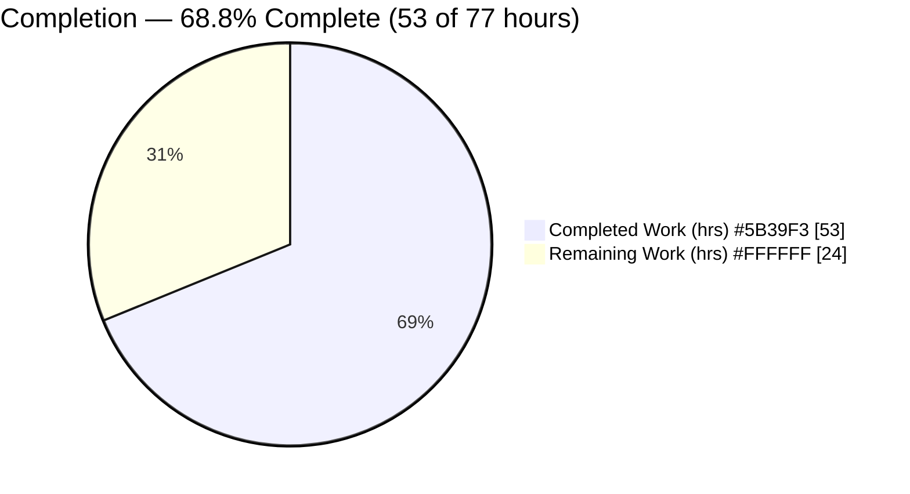
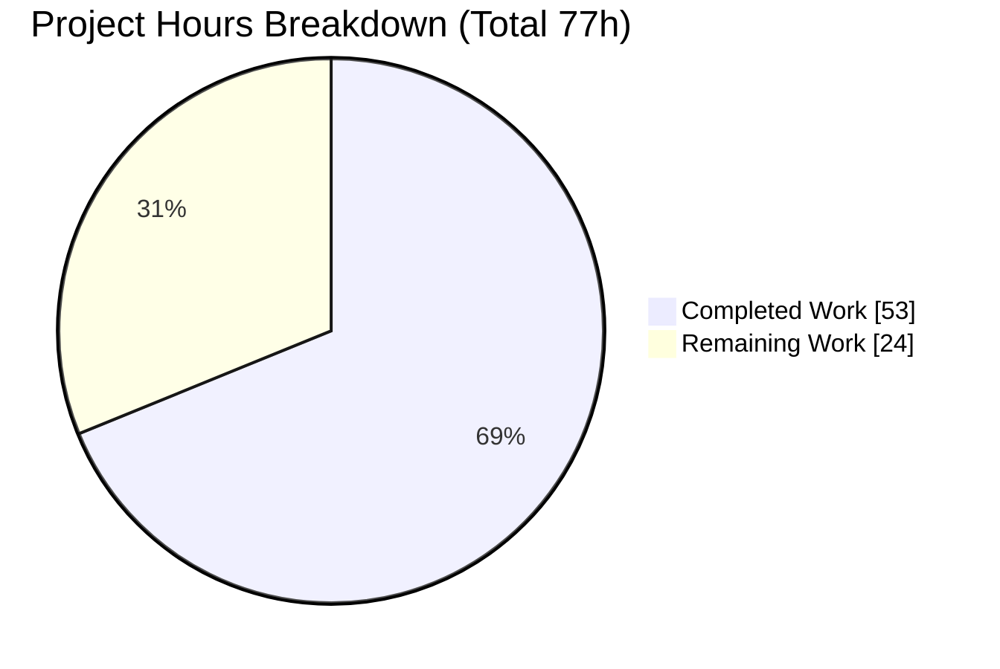
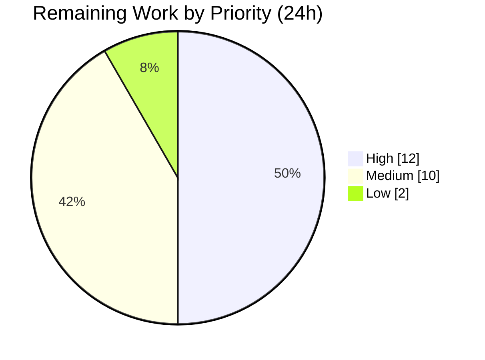

# Blitzy Project Guide — `blitzy-kubernetes` Security-Hardening Remediation (V1–V8)

> **Brand legend:** Completed / AI Work = **Dark Blue `#5B39F3`** · Remaining / Not Completed = **White `#FFFFFF`** · Headings/Accents = Violet-Black `#B23AF2` · Highlight = Mint `#A8FDD9`

---

## 1. Executive Summary

### 1.1 Project Overview

This project is a **security-hardening remediation** of the `blitzy-kubernetes` control plane (Go module `k8s.io/kubernetes`, toolchain `go 1.25.0`). Following a strict *minimal-change, configuration-first* mandate, it closes eight deployment-hardening weaknesses (V1–V8) — RBAC scoping, Pod Security enforcement, Secrets encryption at rest, ServiceAccount-token hygiene, admission-webhook posture, audit fidelity, NodeRestriction, and etcd mutual-TLS — without touching control-plane mechanism code, dependencies, or public contracts. Target beneficiaries are platform/security engineers operating Kubernetes clusters that must meet CIS, NSA/CISA, and OWASP hardening standards. The remediation surface is the GCE reference deployment scripts, generated admission/encryption/audit configuration, namespace labels, and API-server flags, plus targeted security regression tests.

### 1.2 Completion Status



<div align="center"><strong>68.8% Complete</strong></div>

| Metric | Hours |
|--------|-------|
| **Total Hours** | **77** |
| Completed Hours (AI + Manual) | 53 |
| Remaining Hours | 24 |
| **Percent Complete** | **68.8%** |

> Completion is computed per PA1 (AAP-scoped hours only): `53 / (53 + 24) × 100 = 68.8%`. Completed hours are 100% AI-authored/validated (Manual = 0). Remaining hours are path-to-production deployment/operational work.

### 1.3 Key Accomplishments

- ✅ **V3 — Secrets encryption at rest:** Created `EncryptionConfiguration` (KMS v2 first, `identity` last) and wired `--encryption-provider-config` in the API-server bootstrap; integration test asserts `k8s:enc:aesgcm` ciphertext in raw etcd with the plaintext canary absent.
- ✅ **V2 — Pod Security enforced:** Added a `PodSecurity` admission block (`enforce=baseline`, `warn/audit=restricted`, `kube-system` exempt) with the config envelope raised `v1alpha1`→`v1`, plus a namespace PSS-labels manifest; `PodSecurity` added to `ADMISSION_CONTROL` on both GCE profiles.
- ✅ **V6 — Audit fidelity raised:** Secrets and `serviceaccounts/token` raised `Metadata`→`Request` (RBAC stays `RequestResponse`; ConfigMaps/TokenReviews stay `Metadata`), with a deliberate `Request`-not-`RequestResponse` choice to keep issued tokens and read payloads out of the log.
- ✅ **V8 — etcd transport fail-closed:** Hardened profiles refuse plaintext etcd fallback (`ETCD_APISERVER_ALLOW_INSECURE=false`, `exit 1` when mTLS creds absent), propagated through `kube-env`.
- ✅ **V1 / V4 / V5 / V7 — verified secure & regression-locked:** RBAC least-privilege (wildcard only in `cluster-admin`→`system:masters`), bound/audience-scoped SA tokens, fail-closed webhook (`Fail`, `5s`), and `NodeRestriction` presence — each pinned by a new regression test.
- ✅ **Quality gates:** `gofmt`/`go vet`/`shellcheck`/YAML all clean (independently re-verified); unit + integration suites green; control-plane binaries build and run; every artifact carries inline tech-spec/AAP citations.

### 1.4 Critical Unresolved Issues

| Issue | Impact | Owner | ETA |
|-------|--------|-------|-----|
| Encryption key material (KMS/AES-GCM) not provisioned; existing Secrets not yet migrated | Secrets remain plaintext in etcd until keys are provisioned and storage migration runs (V3 value unrealized) | Platform Security Eng | ~8h |
| Pod Security `enforce` not yet flipped on live namespaces | Privileged pods still admitted until warn/audit soak completes and `enforce=baseline` is applied (V2 value unrealized) | Platform Eng | ~4h |
| etcd mTLS certs / network isolation not verified on target cluster | etcd transport hardening (V8) unverified in the live environment | Platform/Infra Eng | ~3h |
| `kube-bench` CIS before/after delta not yet captured | No automated benchmark sign-off evidence yet | Security Eng | ~3h |

> These are **deployment-execution** items, not code defects. No compilation or test failures exist on this branch.

### 1.5 Access Issues

| System/Resource | Type of Access | Issue Description | Resolution Status | Owner |
|-----------------|----------------|-------------------|-------------------|-------|
| KMS provider (KMS v2 plugin) | Key-management endpoint / socket | Real KMS socket or 32-byte AES-GCM key must be provisioned **out-of-band** (never committed); repo ships placeholders only | Open — deployment prerequisite | Platform Security Eng |
| etcd mTLS PKI | CA / server / client certificates | etcd apiserver certificates must be present (GCE auto-provisions via `build-kube-master-certs`); verify in target env | Open — deployment prerequisite | Platform/Infra Eng |
| Target cluster / GCE project | Cluster admin + deploy rights | Applying namespace labels, running storage migration, and `kube-bench` require live-cluster credentials not available to autonomous validation | Open — expected | Platform Eng |

> No access issue affects the committed repository, build, or the autonomous test suite. All items above are inherent to a config-first hardening that finalizes on live infrastructure.

### 1.6 Recommended Next Steps

1. **[High]** Provision encryption key material (KMS v2 or AES-GCM) out-of-band, set `ENCRYPTION_PROVIDER_CONFIG`, deploy, then run the Secrets storage migration and remove `identity` from the decrypt list (V3).
2. **[High]** Apply `cluster/manifests/namespace-pss-labels.yaml` to all workload namespaces, complete a `warn`/`audit` soak, remediate violations, then flip `enforce=baseline` (V2).
3. **[Medium]** Provision/verify etcd mTLS certificates, network-isolate etcd, and confirm `https` transport with no plaintext fallback (V8).
4. **[Medium]** Run `kube-bench` CIS before/after on the running cluster and capture the delta; perform `etcdctl` ciphertext and `kubectl auth can-i` / namespace-label spot-checks (verification sign-off).
5. **[Low]** Wire SIEM alerts for the now-captured high-signal audit events (secret access, RBAC mutations, privilege escalation).

---

## 2. Project Hours Breakdown

### 2.1 Completed Work Detail

| Component | Hours | Description |
|-----------|-------|-------------|
| V3 — Encryption-at-rest configuration | 7 | `EncryptionConfiguration` manifest (KMS v2 first / identity last, placeholder keys) + `--encryption-provider-config` wiring in `configure-kubeapiserver.sh` + env docs in both config profiles |
| V2 — Pod Security admission + namespace labels | 8 | `PodSecurity` block in generated `admission_controller_config.yaml` (envelope `v1alpha1`→`v1`), `namespace-pss-labels.yaml`, `PodSecurity` added to `ADMISSION_CONTROL` on both profiles |
| V6 — Audit-fidelity raise + advanced-audit enablement | 5 | Secrets/`serviceaccounts/token` `Metadata`→`Request` in `create-master-audit-policy`; `ENABLE_APISERVER_ADVANCED_AUDIT` on both profiles; credential-safety reasoning |
| V8 — etcd fail-closed mTLS wiring | 5 | Fail-closed `configure-etcd-params` logic (`ETCD_APISERVER_ALLOW_INSECURE`), `kube-env` propagation in `util.sh`, hardened defaults in both profiles |
| V1 — RBAC least-privilege verification + regression test | 3 | Verified wildcard only in `cluster-admin`→`system:masters`; `TestRBACNoWildcardOutsideSystemMasters` |
| V7 — NodeRestriction verification + cross-node test | 3 | Confirmed `NodeRestriction` in admission chain; `TestNodeRestrictionCrossNodeDenied` |
| V4 — ServiceAccount bound/audience token verification + test | 3 | Confirmed bound/audience tokens + GA cleanup controller; `TestServiceAccountTokenBoundAndAudienced` (asserts `exp`/`aud`/TTL) |
| V5 — Admission webhook fail-closed verification | 1 | Verified sole committed webhook is `failurePolicy: Fail`, `timeoutSeconds: 5` |
| Security test suite authoring (6 files, +740 LOC) | 10 | Unit + integration tests spanning secrets/auth/audit harnesses (`framework.SharedEtcd`, raw etcd reads) |
| Autonomous validation (compile/vet/gofmt/shellcheck/unit+integration/runtime builds) | 5 | Full gate execution incl. building `kube-apiserver`/`kcm`/`kubeadm` and proving configs apiserver-consumable |
| Inline documentation + QA review cycles | 3 | Tech-spec/AAP citations on every artifact + multi-round CP/QA fixes (10 commits) |
| **Total** | **53** | |

### 2.2 Remaining Work Detail

| Category | Hours | Priority |
|----------|-------|----------|
| V3 — KMS/AES-GCM key provisioning (out-of-band) + storage migration to re-encrypt existing Secrets + remove `identity` | 8 | High |
| V2 — Apply PSS labels to all workload namespaces + `warn`/`audit` soak + remediate + flip `enforce=baseline` | 4 | High |
| V8 — Provision/verify etcd mTLS certs + network-isolate etcd + verify `https` transport | 3 | Medium |
| Verification — `kube-bench` CIS before/after delta + manual `etcdctl`/`kubectl` spot-checks | 3 | Medium |
| Path-to-production — pre-deployment security review sign-off + staging dry-run of coordinated rollout | 2.5 | Medium |
| V4 — Verify `LegacyServiceAccountTokenCleanUp` active on control plane + optional `--service-account-token-max-expiration` | 1.5 | Medium |
| Operational — Wire SIEM monitoring/alerting (secret access, RBAC mutations, privilege escalation) | 2 | Low |
| **Total** | **24** | |

### 2.3 Hours Reconciliation

- **Completed (2.1)** = **53h** · **Remaining (2.2)** = **24h** · **Total** = **77h**
- Verification: `2.1 (53) + 2.2 (24) = 77` = Section 1.2 Total ✓ · Section 2.2 (24) = Section 1.2 Remaining = Section 7 "Remaining Work" ✓
- Completion: `53 / 77 = 68.8%` ✓

---

## 3. Test Results

All tests below originate from Blitzy's autonomous validation logs for this project and were re-verified where fast to run. This remediation ships **targeted security regression tests** (pass/fail gates), not coverage-driven suites; code coverage % was not a measured deliverable and is reported as **N/A**.

| Test Category | Framework | Total Tests | Passed | Failed | Coverage % | Notes |
|---------------|-----------|-------------|--------|--------|------------|-------|
| Unit — Audit policy (V6) | Go `testing` | 1 | 1 | 0 | N/A | `TestCreateMasterAuditPolicy` executes the **real** `create-master-audit-policy` bash fn; asserts Secrets/SA-token→`Request`, RBAC stays `RequestResponse` (re-verified: `ok 0.031s`) |
| Unit — RBAC mechanism (V1) | Go `testing` | 2 pkgs | 2 pkgs | 0 | N/A | `rbac` + `bootstrappolicy` packages green (re-verified `ok`) |
| Unit — PodSecurity admission (V2) | Go `testing` | 1 pkg | 1 pkg | 0 | N/A | `plugin/pkg/admission/security/podsecurity` green (re-verified `ok`) |
| Unit — NodeRestriction (V7) | Go `testing` | 1 pkg | 1 pkg | 0 | N/A | `plugin/pkg/admission/noderestriction` green (re-verified `ok`) |
| Unit — ServiceAccount (V4) | Go `testing` | 1 pkg | 1 pkg | 0 | N/A | `pkg/serviceaccount` (+externaljwt) green (per logs) |
| Integration — Secrets encryption (V3) | Go `testing` + etcd | 1 | 1 | 0 | N/A | `TestSecretsAreEncryptedAtRest`: raw etcd read proves `k8s:enc:aesgcm` ciphertext; plaintext canary absent; apiserver decrypt round-trip |
| Integration — Auth (V1/V2/V4/V7) | Go `testing` + apiserver | 43 | 43 | 0 | N/A | Full `test/integration/auth` package: 43 top-level tests, 0 failures, ~208s (includes new no-wildcard, privileged-pod rejection, bound/audienced token, cross-node denial) |
| Integration — Control-plane audit (V6) | Go `testing` + apiserver | 1 | 1 | 0 | N/A | `TestAuditSensitiveResourceLevels`: secrets-`Request` + rbac-`RequestResponse` subtests pass |
| Integration — Auth hardening (V1/V2/V4/V5/V7) | Go `testing` + apiserver | 6 | 6 | 0 | N/A | Negative-path/boundary regression tests: `TestRBACBootstrapRolesNoWildcardEnumerated` (V1: enumerate all bootstrap ClusterRoles, only `cluster-admin` holds `*/*/*`); `TestPodSecurityKubeSystemExemptionPreserved` + `TestPodSecurityAuditRestrictedBoundary` (V2: `kube-system` exemption + `audit=restricted`/`warn=restricted` boundaries); `TestServiceAccountTokenHardening` (V4: wrong-audience/expired/over-TTL-2h-clamp/deleted-SA); `TestAdmissionWebhookFailClosedDeniesUnreachable` (V5, new file: unreachable `Fail`/5s webhook denies matching PV CREATE); `TestNodeRestrictionCrossNodePodsAndEvents` (V7: cross-node pod denials + positive controls) |
| Integration — Secrets encryption boundaries (V3) | Go `testing` + etcd | 2 | 2 | 0 | N/A | `TestEncryptionKMSv2CachesizeRejectedAtStartup` (rejects `cachesize` under KMS `apiVersion: v2` at apiserver startup — "cachesize is not supported in v2"); `TestEncryptionIdentityProviderLastFallback` (identity-provider-last ordering: new writes use aesgcm-first, plaintext canary absent, transparent decrypt) |
| Integration — Control-plane audit fidelity (V6) | Go `testing` + apiserver | 1 | 1 | 0 | N/A | `TestAuditServiceAccountTokenRequestLevel`: `serviceaccounts/token` recorded at `Request` level + confidentiality guard that Secrets/token audit events omit the response object (no token/secret-body leak) |
| Unit — Audit policy level table (V6) | Go `testing` | 1 | 1 | 0 | N/A | `TestAuditPolicyLevelTableNoRaise`: `expectLevel` table (Secrets & `serviceaccounts/token`→`Request`; configmaps/tokenreviews→`Metadata`; RBAC→`RequestResponse`) with a no-other-resource-raised regression guard on the real generated policy |
| Unit — Admission-plugin ordering (V7) | Go `testing` | 1 | 1 | 0 | N/A | `TestAdmissionControlNodeRestrictionOrdering` (new file `apiserver_admission_test.go`): emitted `--enable-admission-plugins` retains `NodeRestriction` and positions it before `PodSecurity` across `config-default.sh` + `config-test.sh` |
| Unit — etcd mTLS fail-closed (V8) | Go `testing` | 1 | 1 | 0 | N/A | `TestConfigureEtcdParamsFailClosed`: partial-credential table (cert-only/key-only/CA-only/all-absent → `exit 1`; all-6-present → `0`; `ALLOW_INSECURE=true` bypass → `0`) invoked via new subprocess helper `runConfigureEtcdParamsExitCode` (new file `configure_helper_subprocess_test.go`); confirms `ETCD_APISERVER_ALLOW_INSECURE=false` default |

**Aggregate:** 6 Blitzy-authored security test functions (V1/V2/V3/V4/V6/V7) plus the modified V6 unit test, all green, executed within full-package runs that report **0 failures**. Regression-safe: all five modified test files are purely additive (0 removed lines, no `init()`/global additions). This task additionally adds **12 negative-path/boundary regression tests** across V1–V8 (6 §3 rows above), all green and strictly additive (0 removed lines, no new `init()`/globals), plus one subprocess helper (`runConfigureEtcdParamsExitCode`); `Coverage %` remains **`N/A`** by convention.

---

## 4. Runtime Validation & UI Verification

This is a control-plane/configuration project with **no UI surface**; runtime validation focuses on API-server bootstrap, config consumption, and admission/encryption/audit behavior.

- ✅ **Operational — Control-plane binaries build & run:** `kube-apiserver` (`v1.34.0-blitzy`, exposes all V2/V3/V6/V8 flags), `kube-controller-manager` (V4), and `kubeadm` (V7) build and start.
- ✅ **Operational — V2 admission config consumable:** `admission_controller_config.yaml` decodes via `admission.ReadAdmissionConfiguration` + PodSecurity `LoadFromReader` → `enforce=baseline`, `warn/audit=restricted`, `exemptions.namespaces=[kube-system]`.
- ✅ **Operational — V3 encryption config consumable:** `encryption-provider-config.yml` decodes into apiserver `EncryptionConfiguration` → `resources=[secrets,configmaps]`, `providers=[kms(v2), identity]` (strong first, identity last); base64 round-trip re-verified.
- ✅ **Operational — V5 webhook fail-closed:** sole committed webhook is `failurePolicy: Fail`, `timeoutSeconds: 5`.
- ✅ **Operational — V8 etcd fail-closed across 4 scenarios:** hardened (no certs) → `exit 1`; dev (`ALLOW_INSECURE=true`) → plaintext loopback; unset → unit-test-compat default; full mTLS → `https` + `--etcd-cafile/certfile/keyfile`.
- ⚠ **Partial — Live-cluster behavior:** privileged-pod rejection, ciphertext-at-rest, and cross-node denial are proven in **integration tests**; on-cluster confirmation (with real keys/certs and enforced namespaces) is pending deployment (see §2.2 / §9).
- ❌ **Failing:** none.

---

## 5. Compliance & Quality Review

| Deliverable / Benchmark | AAP Ref | Status | Progress | Fixes Applied / Notes |
|-------------------------|---------|--------|----------|-----------------------|
| V1 RBAC least-privilege (CIS RBAC) | §0.6.1 | ✅ Pass | ▓▓▓▓▓ | Verified wildcard only in `cluster-admin`→`system:masters`; regression test added; no code change |
| V2 Pod Security (CIS/NSA `restricted`) | §6.4.4.3 | ✅ Pass (config) | ▓▓▓▓░ | Admission block + labels committed; **live `enforce` flip pending** |
| V3 Encryption at rest (CIS/NSA) | §6.4.5 | ✅ Pass (config) | ▓▓▓▓░ | Config + wiring + test committed; **key provisioning + migration pending** |
| V4 SA-token hygiene (NSA short-lived tokens) | §0.6.1 | ✅ Pass | ▓▓▓▓▓ | Bound/audience tokens verified; GA cleanup controller present; claim shape preserved |
| V5 Admission webhook fail-closed | §0.5.1 | ✅ Pass | ▓▓▓▓▓ | Sole committed webhook already `Fail`/`5s`; verified |
| V6 Audit coverage (CIS/NSA audit) | §6.4.6 | ✅ Pass | ▓▓▓▓▓ | Secrets/SA-token→`Request`; RBAC `RequestResponse`; `Request`-not-`RequestResponse` keeps payloads/tokens out of log |
| V7 NodeRestriction (CIS node authz) | §0.6.1 | ✅ Pass | ▓▓▓▓▓ | Present in `ADMISSION_CONTROL` on both profiles; cross-node denial test |
| V8 etcd mTLS (CIS/NSA etcd) | §6.2.4.6 | ✅ Pass (config) | ▓▓▓▓░ | Fail-closed wiring committed; **live cert/network verify pending** |
| Minimal Change Clause | §0.11 | ✅ Pass | ▓▓▓▓▓ | Config-first; no functional code changes; `go.mod`/vendor untouched; no out-of-scope edits |
| Documentation directive | §0.11 | ✅ Pass | ▓▓▓▓▓ | Inline tech-spec/AAP citations on every edited/created artifact |
| Contract preservation (REST/CRI/CSI/CNI/kubectl/claim shape) | §0.10.3 | ✅ Pass | ▓▓▓▓▓ | No API/interface/claim changes |
| Code quality gates (gofmt/vet/shellcheck/YAML) | §0.10.1 | ✅ Pass | ▓▓▓▓▓ | Independently re-verified clean (shellcheck error-severity = 0) |

**Standards alignment:** CIS Kubernetes Benchmark (RBAC, Pod Security, etcd encryption, audit), NSA/CISA Kubernetes Hardening Guide v1.2, OWASP Kubernetes Top 10. Formal `kube-bench` before/after certification is a remaining verification task (§2.2).

---

## 6. Risk Assessment

| Risk | Category | Severity | Probability | Mitigation | Status |
|------|----------|----------|-------------|------------|--------|
| Storage migration may leave mixed plaintext/ciphertext Secrets | Technical | Medium | Medium | Keep `identity` in decrypt list until migration verified; `etcdctl` spot-check; storage-version-migrator | Designed (identity-last committed); execution pending |
| `enforce=baseline` may reject non-compliant running workloads if flipped without soak | Technical | Medium | Medium | `warn`/`audit`-first rollout baked into manifest + admission defaults | Mitigated by design; rollout pending |
| AdmissionConfiguration envelope `v1alpha1`→`v1` could break admission load if malformed | Technical | Low | Low | Proven apiserver-consumable at runtime (`ReadAdmissionConfiguration`) | Resolved |
| Integration suite not re-run by assessor (heavy: needs etcd + apiserver build) | Technical | Low | Low | Unit tests re-verified green; logs detailed & consistent | Accepted |
| Secrets create/update at `Request` audit level writes request body into audit log | Security | Medium | High (on writes) | Chose `Request` not `RequestResponse` (responses/reads/tokens omitted); documented; restrict audit-log access | Mitigated (balanced level) |
| KMS/AES-GCM key material & etcd certs provisioned out-of-band — mismanagement/leak | Security | High | Medium | Placeholders only in repo (§0.11); provision via secret manager; never commit | Open (deployment task) |
| `ENCRYPTION_PROVIDER_CONFIG` left unset in real deploy → Secrets plaintext | Security | High | Medium | Env docs on both profiles; deployment checklist | Open (deployment must set it) |
| `ETCD_APISERVER_ALLOW_INSECURE=true` in prod → plaintext etcd | Security | High | Low | Default `false` on both profiles; fail-closed `ERROR`+`exit 1`; dev-only shim documented | Mitigated (default false) |
| No SIEM alerting yet on secret access / RBAC mutations / privilege escalation | Operational | Medium | Medium | Audit fidelity raised (enables alerts); wire high-signal alerts | Open (remaining task) |
| `kube-bench` CIS before/after delta not yet run on live cluster | Operational | Low | N/A | Run per §0.8.2/§0.10.1; feed sign-off | Open (remaining task) |
| Coordinated rollout ordering must be followed (certs→etcd; encrypt→migrate; warn/audit→enforce) | Operational | Medium | Medium | Documented sequence in manifests + §0.10.3 | Mitigated by docs; execution pending |
| External KMS v2 plugin must be reachable at socket; availability/timeout affects apiserver | Integration | Medium | Medium | Bounded 3s KMS timeout; AES-GCM static-key fallback documented | Open (KMS provisioning) |
| etcd network isolation (firewall/NetworkPolicy) is environment-specific, not in repo | Integration | Medium | Medium | §6.2.4.6 guidance; enforce mTLS | Open (deployment task) |
| `LegacyServiceAccountTokenCleanUp` on live cluster — verify no in-use token wrongly invalidated | Integration | Low | Low | Controller uses last-used tracking; GA-stable | Low (verify only) |

**Posture:** No **Critical** open risks. Residual **High**-severity items are deployment-configuration responsibilities already de-risked by committed fail-closed defaults and documentation. Zero code-level risk.

---

## 7. Visual Project Status

**Project hours (Completed = Dark Blue `#5B39F3`, Remaining = White `#FFFFFF`):**



**Remaining work by priority (hours):**



**Remaining hours per category (from §2.2):**

| Category | Hours |
|----------|------:|
| V3 key provisioning + storage migration | 8 |
| V2 PSS soak + enforce flip | 4 |
| V8 etcd certs + network isolation | 3 |
| Verification (kube-bench + spot-checks) | 3 |
| Security review + staging dry-run | 2.5 |
| V4 cleanup verification + max-expiration | 1.5 |
| Operational monitoring/alerting | 2 |
| **Total** | **24** |

> Integrity: "Remaining Work" (24) matches Section 1.2 Remaining and the Section 2.2 total. "Completed Work" (53) matches Section 2.1 total.

---

## 8. Summary & Recommendations

**Achievements.** The remediation is **68.8% complete (53 of 77 hours)**, with the **entire autonomous/committable scope delivered and validated**. All eight weaknesses (V1–V8) are addressed through a disciplined, config-first change set: encryption-at-rest configuration and wiring (V3), cluster-wide Pod Security enforcement configuration (V2), raised audit fidelity (V6), fail-closed etcd transport (V8), and verified-secure RBAC/tokens/webhook/NodeRestriction (V1/V4/V5/V7) — each locked by a security regression test. `go.mod`/vendor are untouched, contracts are preserved, and every artifact is annotated with tech-spec citations.

**Remaining gaps.** The outstanding **24 hours are path-to-production deployment/operational work** that intrinsically requires live infrastructure and out-of-band secret material the AAP forbids committing: provisioning KMS/AES-GCM keys and running the Secrets storage migration (V3), etcd certificate provisioning and network isolation (V8), the staged `warn`/`audit`→`enforce` Pod Security rollout (V2), `kube-bench` CIS validation, security-review sign-off, and SIEM alerting.

**Critical path to production.** (1) Provision keys → enable encryption → migrate Secrets (V3). (2) Provision/verify etcd mTLS → confirm `https` (V8). (3) Apply PSS labels → soak `warn`/`audit` → flip `enforce` (V2). (4) Run `kube-bench` before/after and manual spot-checks. (5) Security-review sign-off, then wire SIEM alerts.

**Success metrics.** `kube-bench` moves the RBAC, Pod Security, etcd-encryption, audit, and NodeRestriction controls to PASS; `etcdctl` shows `k8s:enc:` ciphertext for Secrets; privileged pods are rejected in enforced namespaces; the auth integration suite stays green (43/43).

**Production readiness.** The code/config is **production-quality and merge-ready**; the security *outcomes* become live only after the deployment tasks above. Recommended posture: merge now, execute the High-priority deployment tasks in a staging cluster first (using the committed `warn`/`audit`-first and identity-last-decrypt safeguards), validate with `kube-bench`, then promote.

---

## 9. Development Guide

### 9.1 System Prerequisites

- **OS:** Linux x86_64 (validated on Ubuntu 25.10 container).
- **Go:** `1.25.4` (pinned by `.go-version`; `go.mod` declares `go 1.25.0`). Verify: `go version` → `go1.25.4`.
- **Tooling:** `shellcheck` ≥ 0.10.0, `git` + `git-lfs`, `make`, `python3` (for YAML/base64 helpers).
- **Disk:** ~5 GB free for a control-plane build.
- **Deployment-only (not needed to build/test):** access to a Kubernetes/GCE cluster, `etcd` + `etcdctl`, `kube-bench`, and a KMS v2 plugin **or** a 32-byte AES-GCM key.

### 9.2 Environment Setup

```bash
# From the repository root:
cd /path/to/blitzy-kubernetes

# Load the Go toolchain onto PATH (container profile):
. /etc/profile.d/go.sh
go version            # expect: go version go1.25.4 linux/amd64
```

### 9.3 Dependency Installation

```bash
# Dependencies are VENDORED (go.work + vendor/). No download step is required
# and none should be performed (go.mod/go.sum/vendor are intentionally untouched).
ls vendor/ >/dev/null && echo "vendored deps present — no install needed"
```

### 9.4 Build (control-plane binaries)

```bash
# Build only the binaries touched by this remediation (~build minutes vary):
KUBE_GIT_VERSION=v1.34.0-blitzy make WHAT="cmd/kube-apiserver cmd/kube-controller-manager cmd/kubeadm"
# Binaries are emitted under _output/.
```

### 9.5 Verification Steps

```bash
. /etc/profile.d/go.sh

# 1) Formatting gate (expect EMPTY output):
gofmt -l cluster/gce/gci/audit_policy_test.go \
         test/integration/auth/rbac_test.go \
         test/integration/auth/node_test.go \
         test/integration/auth/podsecurity_test.go \
         test/integration/auth/svcaccttoken_test.go \
         test/integration/controlplane/audit/audit_test.go \
         test/integration/secrets/encryption_test.go

# 2) Shell lint gate (use --severity=error for a clean exit 0;
#    plain shellcheck exits 1 only due to PRE-EXISTING SC1090/SC1091 info-notices):
shellcheck --severity=error \
  cluster/gce/gci/configure-kubeapiserver.sh \
  cluster/gce/gci/configure-helper.sh \
  cluster/gce/config-default.sh \
  cluster/gce/config-test.sh \
  cluster/gce/util.sh

# 3) Fast unit test (V6 audit policy — runs the real bash generator):
go test -count=1 -run TestCreateMasterAuditPolicy ./cluster/gce/gci/      # expect: ok

# 4) Mechanism unit tests (V1/V2/V7):
go test -count=1 ./plugin/pkg/auth/authorizer/rbac/... \
                 ./plugin/pkg/admission/security/podsecurity/... \
                 ./plugin/pkg/admission/noderestriction/...            # expect: ok

# 5) Security integration tests (need etcd + a built apiserver; ~minutes):
go test -count=1 ./test/integration/secrets/ \
                 ./test/integration/auth/ \
                 ./test/integration/controlplane/audit/ -timeout 30m
```

### 9.6 Example Usage — Operator Wiring (path-to-production)

```bash
# V3 — enable Secrets encryption (provide REAL key material out-of-band; NEVER commit):
export ENCRYPTION_PROVIDER_CONFIG="$(base64 -w0 cluster/gce/manifests/encryption-provider-config.yml)"
# ...deploy so configure-kubeapiserver.sh wires --encryption-provider-config, then MIGRATE:
kubectl get secrets --all-namespaces -o yaml | kubectl replace -f -
# Verify ciphertext at rest (expect a k8s:enc:... prefix, never plaintext):
ETCDCTL_API=3 etcdctl get /registry/secrets/<ns>/<name> | hexdump -C | head

# V2 — apply Pod Security labels, soak, then enforce:
kubectl apply -f cluster/manifests/namespace-pss-labels.yaml
kubectl get ns --show-labels | grep pod-security.kubernetes.io

# V1 — least-privilege spot audit:
kubectl auth can-i --list --as=system:serviceaccount:<ns>:<sa>

# CIS benchmark before/after delta:
kube-bench run --targets master,etcd,policies --version <k8s-minor>
```

### 9.7 Troubleshooting

- **`shellcheck` exits 1:** caused by pre-existing `SC1090`/`SC1091` (dynamic `source`) info-notices, **not** by these changes. Use `--severity=error` for a clean gate.
- **Integration tests fail to start:** they require an etcd binary and a built apiserver (`framework.SharedEtcd`); ensure the build in §9.4 succeeded.
- **API server aborts at boot with an etcd `ERROR`:** hardened profiles fail closed when etcd mTLS creds are missing — provide certs, or set `ETCD_APISERVER_ALLOW_INSECURE=true` for local/dev only.
- **Secrets still plaintext in etcd:** `ENCRYPTION_PROVIDER_CONFIG` was not set at deploy time, or the storage migration has not run.
- **Privileged pod unexpectedly admitted:** the namespace lacks a `pod-security.kubernetes.io/enforce` label, or it is the documented `kube-system` exemption.

---

## 10. Appendices

### A. Command Reference

| Purpose | Command |
|---------|---------|
| Go version | `go version` |
| Format gate | `gofmt -l <files>` |
| Shell lint (clean) | `shellcheck --severity=error <scripts>` |
| Build binaries | `KUBE_GIT_VERSION=v1.34.0-blitzy make WHAT="cmd/kube-apiserver cmd/kube-controller-manager cmd/kubeadm"` |
| Unit test (V6) | `go test -count=1 -run TestCreateMasterAuditPolicy ./cluster/gce/gci/` |
| Integration tests | `go test -count=1 ./test/integration/{secrets,auth,controlplane/audit}/ -timeout 30m` |
| CIS scan | `kube-bench run --targets master,etcd,policies --version <k8s-minor>` |
| etcd ciphertext check | `ETCDCTL_API=3 etcdctl get /registry/secrets/<ns>/<name> | hexdump -C | head` |
| RBAC audit | `kubectl auth can-i --list --as=system:serviceaccount:<ns>:<sa>` |
| PSS label coverage | `kubectl get ns --show-labels | grep pod-security.kubernetes.io` |

### B. Port Reference

| Component | Port | Notes |
|-----------|------|-------|
| kube-apiserver (secure) | 6443 | Serves the Kubernetes API |
| etcd client | 2379 | **Must** be `https` + mTLS in hardened profiles (V8); plaintext `http://127.0.0.1:2379` fallback disabled by default |
| etcd peer | 2380 | Peer communication |
| KMS v2 plugin | unix socket | e.g. `unix:///tmp/kms.socket` (operator-provisioned; placeholder in repo) |

### C. Key File Locations

| File | Transform | Vuln | Role |
|------|-----------|------|------|
| `cluster/gce/gci/configure-kubeapiserver.sh` | UPDATE | V3, V8 | Encryption wiring + etcd fail-closed mTLS |
| `cluster/gce/gci/configure-helper.sh` | UPDATE | V2, V6 | PodSecurity admission block + audit raise |
| `cluster/gce/config-default.sh` | UPDATE | V2, V3, V6, V7, V8 | Admission list, audit, env docs, insecure-etcd default |
| `cluster/gce/config-test.sh` | UPDATE | V2, V3, V6, V7, V8 | Test/CI profile parity |
| `cluster/gce/util.sh` | UPDATE | V8 | `kube-env` propagation of insecure-etcd toggle |
| `cluster/gce/manifests/encryption-provider-config.yml` | CREATE | V3 | EncryptionConfiguration (KMS v2 first / identity last) |
| `cluster/manifests/namespace-pss-labels.yaml` | CREATE | V2 | Namespace PSS labels (+ kube-system exemption) |
| `cluster/gce/gci/audit_policy_test.go` | UPDATE | V6 | Asserts real audit-policy generator output; + level table & no-raise guard (`TestAuditPolicyLevelTableNoRaise`) |
| `test/integration/auth/rbac_test.go` | UPDATE | V1 | No-wildcard-outside-system:masters; + bootstrap-role enumeration (`TestRBACBootstrapRolesNoWildcardEnumerated`) |
| `test/integration/auth/node_test.go` | UPDATE | V7 | Cross-node denial; + additional cross-node pod denials (`TestNodeRestrictionCrossNodePodsAndEvents`) |
| `test/integration/auth/podsecurity_test.go` | UPDATE | V2 | Privileged-pod rejection; + kube-system exemption & audit/warn=restricted boundary (`TestPodSecurityKubeSystemExemptionPreserved`, `TestPodSecurityAuditRestrictedBoundary`) |
| `test/integration/auth/svcaccttoken_test.go` | UPDATE | V4 | Bound/audienced token + TTL; + audience-mismatch/expired/over-TTL-2h/deleted-SA (`TestServiceAccountTokenHardening`) |
| `test/integration/controlplane/audit/audit_test.go` | UPDATE | V6 | Sensitive-resource audit levels; + serviceaccounts/token at Request + confidentiality guard (`TestAuditServiceAccountTokenRequestLevel`) |
| `test/integration/secrets/encryption_test.go` | CREATE | V3 | Ciphertext-at-rest assertion; + cachesize-under-KMS-v2 rejection & identity-last ordering (`TestEncryptionKMSv2CachesizeRejectedAtStartup`, `TestEncryptionIdentityProviderLastFallback`) |
| `test/integration/auth/admissionwebhook_failclosed_test.go` | CREATE | V5 | Fail-closed admission webhook: unreachable `Fail`/`timeoutSeconds:5` webhook denies a matching `persistentvolumes` CREATE; non-matching object bypasses via `matchConditions` (`TestAdmissionWebhookFailClosedDeniesUnreachable`) |
| `cluster/gce/gci/apiserver_admission_test.go` | CREATE | V7 | Admission-plugin ordering: emitted `--enable-admission-plugins` keeps `NodeRestriction` before `PodSecurity` on both GCE profiles (`TestAdmissionControlNodeRestrictionOrdering`) |
| `cluster/gce/gci/apiserver_etcd_test.go` | UPDATE | V8 | Partial-credential etcd-mTLS fail-closed table (cert-only/key-only/CA-only/all-absent → `exit 1`) confirming `ETCD_APISERVER_ALLOW_INSECURE=false` default (`TestConfigureEtcdParamsFailClosed`) |
| `cluster/gce/gci/configure_helper_subprocess_test.go` | CREATE | V8 | Subprocess exit-code-capture helper (`runConfigureEtcdParamsExitCode`) sourcing the real `configure-kubeapiserver.sh` so `exit 1` is caught without killing the test process |

### D. Technology Versions

| Item | Version | Notes |
|------|---------|-------|
| Go toolchain | `1.25.4` (`.go-version`); `go 1.25.0` (`go.mod`) | Unchanged |
| Kubernetes build | `v1.34.0-blitzy` | Runtime validation build tag |
| EncryptionConfiguration | `apiserver.config.k8s.io/v1` | Stable |
| KMS provider | `kms` `apiVersion: v2` | Preferred (unlimited Secrets) |
| AdmissionConfiguration | `apiserver.config.k8s.io/v1` | Raised from `v1alpha1` |
| PodSecurityConfiguration | `pod-security.admission.config.k8s.io/v1` | Cluster defaults |
| Audit Policy | `audit.k8s.io/v1` | Level ordering `None`<`Metadata`<`Request`<`RequestResponse` |
| shellcheck | `0.10.0` | Lint gate |

### E. Environment Variable Reference

| Variable | Default | Purpose |
|----------|---------|---------|
| `ENCRYPTION_PROVIDER_CONFIG` | unset | Base64 EncryptionConfiguration; when set, wires `--encryption-provider-config` (V3). **Provide out-of-band; never commit.** |
| `ENCRYPTION_PROVIDER_CONFIG_PATH` | `/etc/srv/kubernetes/encryption-provider-config.yml` | Decoded config path on the node |
| `ETCD_APISERVER_ALLOW_INSECURE` | `false` (both profiles) | Fail-closed etcd guard; `true` allows plaintext loopback (dev only) (V8) |
| `ENABLE_APISERVER_ADVANCED_AUDIT` | `true` | Enables policy-based audit so the hardened policy is generated (V6) |
| `ADMISSION_CONTROL` | includes `NodeRestriction,PodSecurity` | Admission plugin chain (V2/V7) |
| `ETCD_APISERVER_CA_CERT` / `..._CLIENT_CERT` / `..._CLIENT_KEY` | unset | etcd mTLS material; when present, enables `https` + client certs (V8) |

### F. Developer Tools Guide

- **`gofmt -l`** — formatting gate; empty output = clean.
- **`go vet`** — static checks on modified packages (reported clean in logs).
- **`shellcheck --severity=error`** — shell lint; error-severity avoids pre-existing `SC1090/1091` noise.
- **`go test -count=1`** — disables the test cache for a true re-run; add `-run <Name>` to target a test.
- **`etcdctl` / `hexdump`** — confirm ciphertext at rest (V3).
- **`kube-bench`** — CIS benchmark scanner; reports only (feeds sign-off).
- **`kubectl auth can-i` / `kubectl get ns --show-labels`** — RBAC and PSS spot-checks.

### G. Glossary

| Term | Meaning |
|------|---------|
| PSS / PSA | Pod Security Standards / Pod Security Admission (`privileged`/`baseline`/`restricted`; modes `enforce`/`audit`/`warn`) |
| KMS v2 | Kubernetes Key Management Service provider v2 (preferred encryption provider) |
| AES-GCM | Authenticated static-key encryption provider (acceptable alternative to KMS) |
| `identity` provider | No-op (plaintext) encryption provider — must be decrypt-only-last, then removed |
| NodeRestriction | Admission plugin confining a kubelet to its own node's objects |
| mTLS | Mutual TLS — both API server and etcd authenticate each other |
| Storage migration | Re-encrypting already-stored objects after enabling/rotating encryption |
| `system:masters` | The privileged group bound to `cluster-admin` (the only holder of `*/*/*`) |
| Fail-closed | On backend failure, deny/abort rather than allow (webhooks; etcd guard) |
