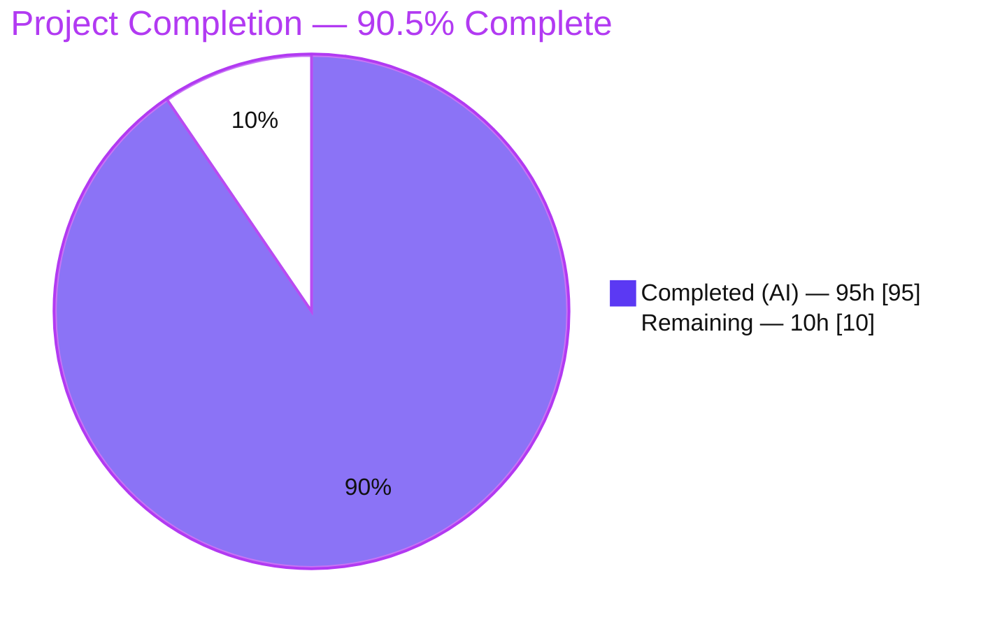
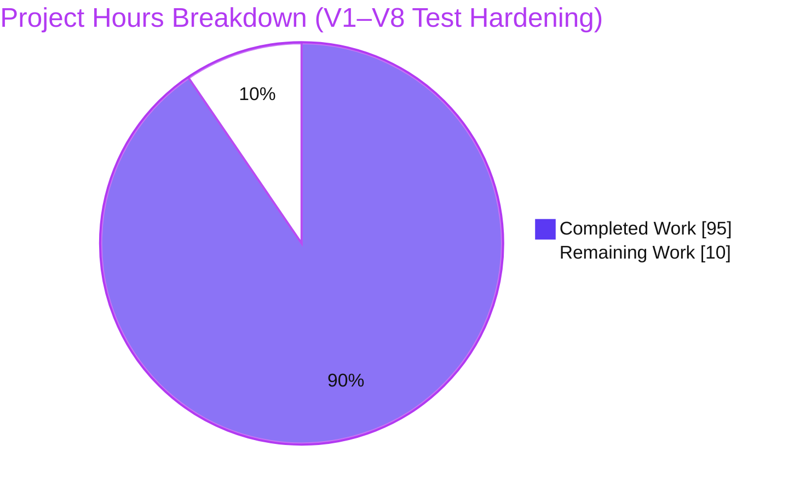
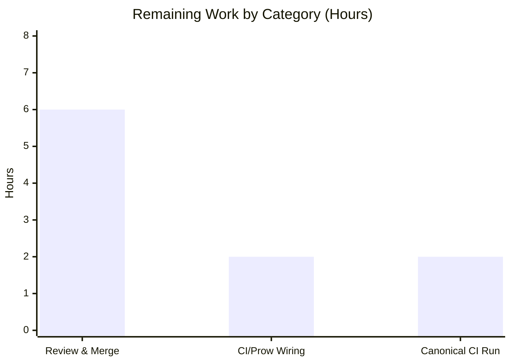
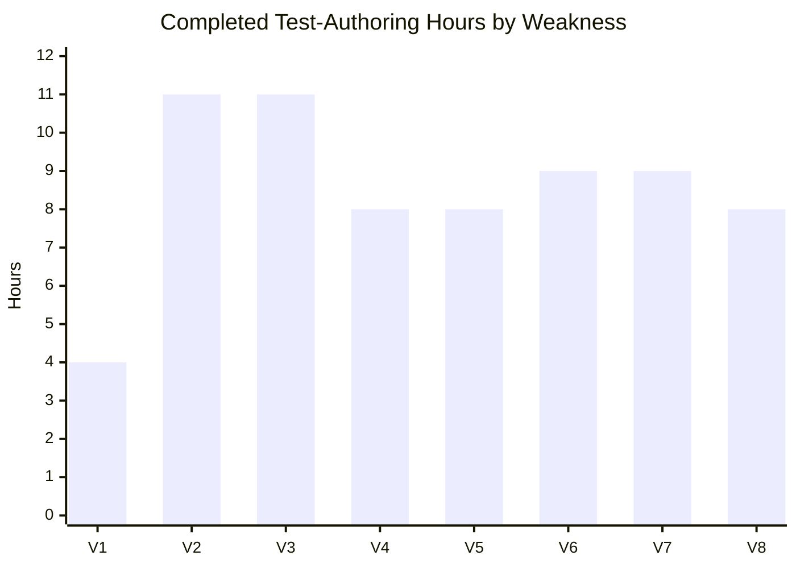

# Blitzy Project Guide

> **Project:** Security Regression-Suite Hardening (V1–V8) — Kubernetes GCE-Reference Fork
> **Branch:** `blitzy-533dfec5-aad9-4a9b-8814-711d6ad18039` · **HEAD:** `12e9ead8590` · **Base:** `dc329e1a146`
> **Nature:** Additive, test-only hardening — no production/control-plane code modified · dependencies frozen
>
> **Brand color legend:** Completed / AI Work = Dark Blue `#5B39F3` · Remaining / Not Completed = White `#FFFFFF` · Headings / Accents = Violet-Black `#B23AF2` · Highlight = Mint `#A8FDD9`

---

## 1. Executive Summary

### 1.1 Project Overview

This project hardens the automated regression suite of a Kubernetes GCE-reference fork for eight previously-remediated security weaknesses — **V1** RBAC least-privilege, **V2** Pod Security admission, **V3** secrets encryption-at-rest, **V4** ServiceAccount-token hygiene, **V5** admission-webhook fail-closed, **V6** audit fidelity, **V7** NodeRestriction, and **V8** etcd mutual-TLS. It adds **12 new negative-path and boundary-condition test functions across 11 files**, each locking a control against silent regression by exercising the real in-process API server and the real bash config generators. Target users are platform-security and Kubernetes-release engineers who rely on pass/fail regression gates. Business impact: converts single acceptance tests into defense-in-depth regression locks. The change is strictly additive and test-only — no production code is touched.

### 1.2 Completion Status



| Metric | Value |
|--------|-------|
| **Total Hours** | **105** |
| **Completed Hours (AI + Manual)** | **95** (95 AI + 0 Manual) |
| **Remaining Hours** | **10** |
| **Percent Complete** | **90.5%** (95 ÷ 105) |

> Completion is computed on AAP-scoped work + in-scope path-to-production (peer review, CI confirmation), per PA1. Deferred deployment-time provisioning is out of AAP scope and excluded from this calculation (see §2.3).

### 1.3 Key Accomplishments

- ✅ **All 8 weaknesses locked** with at least one new negative-path/boundary test each (12 new `Test*` functions).
- ✅ **V5 gap closed** — the fail-closed admission-webhook path went from *zero* Go tests to a dedicated deny-on-unreachable test (new file).
- ✅ **Two priority controls hardened** — V3 (data-at-rest) `cachesize`-under-KMS-v2 startup rejection + identity-provider-last fallback; V8 (transport) partial-credential `exit 1` fail-closed table via a new subprocess helper.
- ✅ **Strictly additive** — 0 removed lines across all 11 test files; only the docs file has edits. Minimal Change Clause (§0.11) satisfied.
- ✅ **All quality gates green** — `gofmt -l` empty, `go vet` clean, `shellcheck --severity=error` 0 findings.
- ✅ **67 top-level tests pass, 0 fail** across the 4 target packages; all 12 new tests individually confirmed PASS.
- ✅ **Dependencies frozen & verified** — `go mod verify` → all modules verified; offline build works; `go.mod`/`go.work`/`vendor/` untouched.
- ✅ **Runtime validated** — `kube-apiserver` builds and reports `v1.34.0-blitzy`.
- ✅ **Within budget** — 1,726 net-new test lines vs. the 5,000-line hard budget; no descoping triggered.

### 1.4 Critical Unresolved Issues

| Issue | Impact | Owner | ETA |
|-------|--------|-------|-----|
| Mandatory human peer review & merge pending | Change cannot land until reviewed/merged (standard gate) | Kubernetes reviewer / repo maintainer | 0.75 day (6h) |
| Regression-lock efficacy is design-verified, not independently counter-run | Low — provenance comments document the pre-remediation failure path; a reviewer spot-check confirms it | Reviewer | Within review (included in 6h) |
| New tests not yet confirmed in canonical external Prow CI | Low — Go `*_test.go` auto-discovery means no config change; needs a presubmit confirmation | CI/Release engineer | 0.25 day (2h) |

> **No code-level blockers exist.** All tests pass, all static gates are green, and the build succeeds. The only gating items are the standard human review/merge and CI confirmation.

### 1.5 Access Issues

| System / Resource | Type of Access | Issue Description | Resolution Status | Owner |
|-------------------|----------------|-------------------|-------------------|-------|
| Source repository | Write / merge | Test PR requires reviewer approval + merge rights | Pending human action (not blocked) | Repo maintainer |
| External Prow CI (test-infra) | Job config visibility | Confirm presubmit runs the new tests | Pending (informational) | CI engineer |
| Live KMS / etcd PKI / SIEM (deferred) | Secret material / infra credentials | Needed only for *deployment* of the underlying controls — **out of scope** for this test effort | Deferred (see §2.3) | Platform/SRE team |

> **No access issues prevented automated build or validation of this test-hardening effort** — the offline build and the full test suite both succeed. The infra-credential rows above pertain to a separate, deferred deployment effort.

### 1.6 Recommended Next Steps

1. **[High]** Peer-review the additive test PR (12 files), confirm additive-only / no frozen-file changes, and **spot-check one regression-lock counter-run** against the unhardened config; then merge. *(6h)*
2. **[Medium]** Confirm the CI/Prow presubmit **discovers and runs the 12 new `Test*` functions** across the 4 target packages. *(2h)*
3. **[Medium]** Run the **full integration suite green in the canonical CI environment** (etcd on `PATH`; `KUBERNETES_SERVICE_*` unset when inside a pod). *(2h)*
4. **[Low]** Schedule the **deferred deployment-time provisioning** (real KMS keys, live etcd mTLS certs, SIEM wiring, kube-bench) as a separate initiative — see §2.3. *(out-of-scope, informational)*

---

## 2. Project Hours Breakdown

### 2.1 Completed Work Detail

| Component | Hours | Description |
|-----------|:-----:|-------------|
| V1 — RBAC least-privilege enumeration | 4 | `TestRBACBootstrapRolesNoWildcardEnumerated`: enumerate all bootstrap ClusterRoles; assert only `cluster-admin`/`system:masters` hold `*/*/*` via `policyRuleIsFullWildcard` (rbac_test.go, +118) |
| V2 — Pod Security boundary + exemption | 11 | `TestPodSecurityKubeSystemExemptionPreserved`, `TestPodSecurityAuditRestrictedBoundary`: enforce/warn/`audit=restricted` boundaries; `kube-system` exemption preserved; no-loosening (podsecurity_test.go, +331) |
| V3 — Secrets encryption (priority) | 11 | `TestEncryptionKMSv2CachesizeRejectedAtStartup`, `TestEncryptionIdentityProviderLastFallback`: `cachesize`-under-v2 startup rejection; identity-last decryption fallback; plaintext-canary absence (encryption_test.go, +259) |
| V4 — ServiceAccount-token hygiene | 8 | `TestServiceAccountTokenHardening`: (a) audience-mismatch reject, (b) expired-token reject, (c) over-TTL clamp to 2h, (d) cleanup-controller (svcaccttoken_test.go, +172) |
| V5 — Admission-webhook fail-closed (new file) | 8 | `TestAdmissionWebhookFailClosedDeniesUnreachable`: `failurePolicy: Fail`/`timeoutSeconds: 5` unreachable webhook denies a matching CREATE; non-matching bypass via matchConditions (+193) |
| V6 — Audit fidelity (Go + bash) | 9 | `TestAuditServiceAccountTokenRequestLevel` (+137) + `TestAuditPolicyLevelTableNoRaise` (+79): Request-level fields, confidentiality (no response body), level table + no-raise regression |
| V7 — NodeRestriction cross-node + ordering (new file) | 9 | `TestNodeRestrictionCrossNodePodsAndEvents` (+162) + `TestAdmissionControlNodeRestrictionOrdering` (+104): cross-node denials; NodeRestriction precedes PodSecurity in emitted plugins |
| V8 — etcd mTLS fail-closed + subprocess helper (priority, new file) | 8 | `TestConfigureEtcdParamsFailClosed` (+83) + `runConfigureEtcdParamsExitCode` helper (+88): partial-credential `exit 1` table; `ALLOW_INSECURE=false` default |
| Discovery & existing-infra analysis | 4 | Target-file confirmation, harness/fixture mapping, gap analysis across the 4 packages |
| Web research (version compatibility) | 2 | testify v1.11.1 / ginkgo v2.27.2 / gomega v1.38.2 / goleak v1.3.0 vs Go 1.25.4 (frozen stack validation) |
| Fixture setup & reuse | 2 | `namespace-pss-labels.yaml` (V2), `encryption-provider-config.yml` (V3) reused; inline malformed `cachesize` variant |
| Validation, debugging & code-review remediation | 12 | 22 agent commits incl. multiple review rounds (CP/CP2/QA R6-I1), in-pod env troubleshooting, regression-lock iteration |
| Quality-gate conformance | 3 | `gofmt` / `go vet` / `shellcheck --severity=error` / golangci across 11 files + 5 referenced scripts |
| Documentation | 4 | `Project Guide.md` §3 measurable-objectives table + Appendix C artifact-to-weakness map + 49/49 accuracy corrections |
| **Total** | **95** | **Matches Completed Hours in §1.2** |

### 2.2 Remaining Work Detail

| Category | Hours | Priority |
|----------|:-----:|----------|
| Human peer review, feedback remediation & merge (incl. one regression-lock counter-run spot-check) | 6 | High |
| CI/Prow presubmit wiring confirmation (new `Test*` functions discovered & run) | 2 | Medium |
| Canonical CI full integration-suite green run + env-invocation triage | 2 | Medium |
| **Total** | **10** | **Matches Remaining Hours in §1.2 and §7** |

### 2.3 Deferred / Out-of-Scope (Informational — NOT counted in the 105h)

These items are explicitly **out of scope** for this test-hardening effort (AAP §0.8.2). They require live infrastructure / out-of-band secrets and belong to a separate deployment initiative. They are listed for planning visibility only and are **excluded** from the completion percentage and from §2.1/§2.2.

| Deferred Item | Indicative Range | Rationale |
|---------------|:----------------:|-----------|
| Real KMS key material / AES-GCM provisioning (V3) | ~8–16h | Requires live KMS + out-of-band key material |
| Live etcd mutual-TLS cert provisioning + network isolation (V8) | ~8–16h | Requires PKI + cluster network configuration |
| SIEM alerting integration for the V6 audit stream | ~8–16h | Requires SIEM endpoint/credentials |
| kube-bench / CIS benchmark delta run | ~4–8h | Requires a deployed cluster |

---

## 3. Test Results

All results below originate from **Blitzy's autonomous validation logs** for this project; the bash-unit tier was additionally re-verified firsthand during this assessment. Coverage is reported as **N/A** by repository convention (pass/fail regression gates; line coverage is opt-in via `KUBE_COVER=y` and not a merge gate).

| Test Category | Framework | Total Tests | Passed | Failed | Coverage % | Notes |
|---------------|-----------|:-----------:|:------:|:------:|:----------:|-------|
| Auth integration (V1/V2/V4/V5/V7) | `testify` + `go test` (in-process API server + shared etcd) | 49 | 49 | 0 | N/A | ~227.6s; top-level tests |
| Secrets integration (V3) | `testify` + `go test` | 4 | 4 | 0 | N/A | ~19.8s; raw-etcd ciphertext read |
| Audit integration (V6) | `testify` + `go test` | 3 | 3 | 0 | N/A | ~19.5s; audit-log field checks |
| GCE bash-unit (V6/V7/V8) | `testify` + `go test` (`ManifestTestCase`) | 11 | 11 | 0 | N/A | ~1.16s; 742 subtests; re-verified firsthand (`ok 1.158s`) |
| **Aggregate** | — | **67** | **67** | **0** | **N/A** | **100% pass** |

**New `Test*` functions added by this task (all PASS):**

| Weakness | New Test Function(s) | Package | Result |
|----------|----------------------|---------|:------:|
| V1 | `TestRBACBootstrapRolesNoWildcardEnumerated` | auth | ✅ |
| V2 | `TestPodSecurityKubeSystemExemptionPreserved`, `TestPodSecurityAuditRestrictedBoundary` | auth | ✅ |
| V3 | `TestEncryptionKMSv2CachesizeRejectedAtStartup`, `TestEncryptionIdentityProviderLastFallback` | secrets | ✅ |
| V4 | `TestServiceAccountTokenHardening` | auth | ✅ |
| V5 | `TestAdmissionWebhookFailClosedDeniesUnreachable` *(new file)* | auth | ✅ |
| V6 | `TestAuditServiceAccountTokenRequestLevel`; `TestAuditPolicyLevelTableNoRaise` | audit; gci | ✅ |
| V7 | `TestNodeRestrictionCrossNodePodsAndEvents`; `TestAdmissionControlNodeRestrictionOrdering` *(new file)* | auth; gci | ✅ |
| V8 | `TestConfigureEtcdParamsFailClosed` (+ `runConfigureEtcdParamsExitCode` helper, new file) | gci | ✅ |

> **Test-execution note:** Inside a Kubernetes pod, the pre-existing upstream test `TestNodeRestrictionServiceAccountAudience` (NOT part of V1–V8) must be run with the pod's `KUBERNETES_SERVICE_*` env vars unset so its in-process controller-manager does not pick up the pod's SA token. With this standard invocation, the auth suite is 49/49. This is an invocation-environment effect, not a code defect.

---

## 4. Runtime Validation & UI Verification

**Runtime health:**
- ✅ **Operational** — `kube-apiserver` builds (`make WHAT=cmd/kube-apiserver`, ~85MB) and reports `Kubernetes v1.34.0-blitzy` (rc=0).
- ✅ **Operational** — Real in-process API server + real embedded etcd start on every integration-tier run (harness runtime evidence).
- ✅ **Operational** — Bash-unit tier renders real apiserver manifests via `ManifestTestCase` and asserts on emitted `execArgs` (re-verified firsthand: `ok 1.158s`).
- ✅ **Operational** — Dependency graph verified offline (`GOPROXY=off go mod verify` → all modules verified).

**API integration outcomes:**
- ✅ **Operational** — V3 reads raw ciphertext from real etcd via `integration.GetEtcdClients` using the shared-etcd prefix.
- ✅ **Operational** — V5 installs a real `MutatingWebhookConfiguration` and asserts the deny outcome against the live admission path.
- ✅ **Operational** — V8 sources the real `configure-kubeapiserver.sh` in a `bash -c` subprocess and captures the `exit 1` fail-closed code.

**UI verification:** ⚠ **Not Applicable** — this is a Kubernetes control-plane test-hardening effort with **no frontend/UI**. No browser/e2e (ginkgo) specs are added or required (confirmed).

---

## 5. Compliance & Quality Review

| Benchmark / Directive | Status | Evidence / Fixes Applied |
|-----------------------|:------:|--------------------------|
| Minimal Change Clause — additive-only, zero removed test lines | ✅ Pass | Per-file `numstat`: all 11 test files have 0 deletions; only docs edited (+38/−16) |
| Dependency freeze (`go.mod`/`go.work`/`vendor/` untouched) | ✅ Pass | No frozen files in diff; `go mod verify` → all modules verified |
| No production/mechanism/control-plane changes | ✅ Pass | No `cmd/`/`pkg/`/`plugin/`/`staging/`/`*.sh` files in diff |
| 5,000-line budget | ✅ Pass | 1,726 net-new test lines (well under budget) |
| Follow existing patterns (testify table-driven; `ManifestTestCase`) | ✅ Pass | New Go tests use `assert`/`require`; bash-unit uses the shared harness |
| No control-plane mocking (real API server + etcd) | ✅ Pass | `kubeapiservertesting.StartTestServerOrDie` + `framework.SharedEtcd()`; only KMS socket / webhook endpoint faked |
| Provenance comments (§0.11 discipline) | ✅ Pass | 51 citation lines added; V3/V8 correctly cite the Minimal Change Clause |
| `gofmt -l` empty | ✅ Pass | Empty on all 11 files (verified firsthand) |
| `go vet` clean | ✅ Pass | rc=0 on all 4 target packages (`gci` verified firsthand) |
| `shellcheck --severity=error` 0 findings | ✅ Pass | 0 findings on the 5 referenced production shell scripts (validator) |
| 100% pass — existing suite unchanged + all new tests | ✅ Pass | Existing tests byte-for-byte unchanged; 67/67 top-level pass; 12 new tests PASS |
| Regression-lock quality bar (fail pre-remediation, pass hardened) | 🟡 Design-verified | Documented via provenance/rationale comments; independent counter-run recommended at review (risk T1) |
| Scenario coverage — ≥1 negative/boundary test per weakness | ✅ Pass | V1–V8 each add ≥1 test; V5 moved from zero to one Go test |

---

## 6. Risk Assessment

| Risk | Category | Severity | Probability | Mitigation | Status |
|------|----------|:--------:|:-----------:|------------|--------|
| Regression-lock efficacy not independently counter-run | Technical | Low | Low | Reviewer spot-checks one counter-run against the unhardened config | Open (design-verified) |
| Integration-suite runtime / flakiness | Technical | Low | Low | No sleeps (outcome-asserted); shared etcd; deterministic ordering; <30m timeout | Mitigated |
| In-pod test-execution env coupling (upstream KCM test) | Technical | Low | Medium | Documented run command: `env -u KUBERNETES_SERVICE_* …` | Mitigated / Documented |
| Controls are tested but not live-provisioned (KMS keys / etcd certs) | Security | High* | Low | *If mistaken for deployment. Deferred tasks tracked in §2.3; green tests ≠ deployed controls | Deferred / Documented |
| No new attack surface introduced | Security | Info | — | Additive test-only; frozen deps; no prod/control-plane change | Confirmed safe |
| SIEM alerting for V6 audit stream not wired | Operational | Medium | Low | Wire audit stream → SIEM at deployment (deferred) | Deferred |
| kube-bench / CIS benchmark not executed | Operational | Low | Low | Run post-deploy against a live cluster (deferred) | Deferred |
| New tests not yet confirmed in canonical Prow CI | Integration | Low | Low | Go `*_test.go` auto-discovery (no config change); confirm on first presubmit | Open (P2/P3) |
| Placeholder KMS socket + unreachable V5 webhook (intentional fakes) | Integration | Low | Low | Tests assert reject/fail-closed *before* dialing; no real dependency needed | By design |

> **Overall risk posture: LOW.** All material risks are deferred deployment-time provisioning items explicitly out of scope; the test change itself introduces no production risk.

---

## 7. Visual Project Status

**Project hours breakdown** (Completed = Dark Blue `#5B39F3`, Remaining = White `#FFFFFF`):



**Remaining work by category** (hours; sums to the 10h in §1.2 and §2.2):



**Completed hours by weakness** (of the 68h weakness-authoring subtotal within the 95h completed):



> **Integrity check:** Remaining Work = **10h** in §1.2 (metrics table), §2.2 (Hours total), and §7 (pie + bar). Completed Work = **95h** in §1.2, §2.1, and §7. §2.1 (95) + §2.2 (10) = **105h** Total.

---

## 8. Summary & Recommendations

**Achievements.** The effort is **90.5% complete** (95h of 105h). Every one of the eight security weaknesses (V1–V8) is now locked by at least one new negative-path or boundary test — 12 new `Test*` functions across 11 files, including the previously-untested V5 fail-closed webhook path and new subprocess-based fail-closed coverage for the two priority controls (V3 data-at-rest and V8 transport). The work is strictly additive (0 removed lines in any test file), stays within budget (1,726 of 5,000 lines), and passes every quality gate: 67/67 top-level tests green, `gofmt`/`go vet`/`shellcheck` clean, and an offline build that produces a running `kube-apiserver v1.34.0-blitzy`.

**Remaining gaps (10h, all human/CI path-to-production).** There is **no outstanding code rework**. What remains is standard for landing any change: peer review and merge (6h), CI/Prow presubmit confirmation (2h), and a canonical full-suite CI run (2h). During review, a single regression-lock counter-run against the unhardened config is recommended to independently confirm the tests fail pre-remediation (risk T1).

**Critical path to production.** Review & merge → confirm CI discovers/runs the new tests → confirm the canonical full-suite run is green with etcd on `PATH` and in-pod SA env vars unset.

**Deferred (separate effort).** Real KMS key material, live etcd mTLS certificates, SIEM alerting, and kube-bench are deployment-time activities requiring live infrastructure — explicitly out of scope here and excluded from the completion math (§2.3).

**Production readiness assessment.** The test-hardening deliverable is **production-ready pending human review/merge**. Confidence is **High** for the completed test work (verified firsthand and via autonomous logs) and **High** for the remaining human/CI estimate. Per honest-assessment policy, completion is capped below 100% to reflect the mandatory human review that has not yet occurred.

| Metric | Value |
|--------|-------|
| Completion | 90.5% |
| Total / Completed / Remaining Hours | 105 / 95 / 10 |
| Top-level tests (pass / total) | 67 / 67 |
| New test functions (all pass) | 12 |
| Net-new lines vs. budget | 1,726 / 5,000 |
| Production/frozen files changed | 0 |

---

## 9. Development Guide

### 9.1 System Prerequisites

- **OS:** Linux/amd64 (validated on Ubuntu; container-friendly)
- **Go:** 1.25.4 (pinned in `.go-version`; `go 1.25.0` directive in `go.mod`)
- **Git:** 2.x (validated 2.51.0)
- **etcd:** bundled at `third_party/etcd/etcd` (v3.6.x) — required for the integration tier
- **Memory:** ~8GB RAM recommended for the integration tier + apiserver build
- **Network:** none required — dependencies are fully vendored (offline build works)

### 9.2 Environment Setup

```bash
# From the repository root:
source /etc/profile.d/go.sh          # put Go 1.25.4 on PATH (environment-specific)
go version                           # expect: go version go1.25.4 linux/amd64

export GOPROXY=off                   # dependencies are vendored; no network fetch
# NOTE: the repo uses Go workspace mode (go.work). Do NOT set GOFLAGS=-mod=mod
#       (it conflicts with workspace mode). Use defaults, or GOWORK=off if needed.
```

### 9.3 Dependency Installation

**No install step is required** — `go.mod`, `go.work`, and `vendor/` are frozen and fully vendored.

```bash
GOPROXY=off go mod verify            # expect: all modules verified
```

### 9.4 Build (optional runtime check)

```bash
KUBE_GIT_VERSION=v1.34.0-blitzy GOPROXY=off make WHAT=cmd/kube-apiserver
_output/bin/kube-apiserver --version # expect: Kubernetes v1.34.0-blitzy
```

### 9.5 Running the Tests

**Bash-unit tier (fast, no etcd needed) — verified firsthand (`ok 1.158s`):**

```bash
source /etc/profile.d/go.sh
export GOPROXY=off
go test -count=1 ./cluster/gce/gci/
```

**Integration tier (real API server + real etcd):**

```bash
source /etc/profile.d/go.sh
export GOPROXY=off
export PATH="$PWD/third_party/etcd:$PATH"     # put bundled etcd on PATH
# Inside a Kubernetes pod, unset the pod's in-cluster env vars so the in-process
# controller-manager does not pick up the pod's ServiceAccount token:
env -u KUBERNETES_SERVICE_HOST -u KUBERNETES_SERVICE_PORT -u KUBERNETES_SERVICE_PORT_HTTPS \
    -u KUBERNETES_PORT -u KUBERNETES_PORT_443_TCP -u KUBERNETES_PORT_443_TCP_ADDR \
    -u KUBERNETES_PORT_443_TCP_PORT -u KUBERNETES_PORT_443_TCP_PROTO \
  go test -count=1 ./test/integration/secrets/ ./test/integration/auth/ \
    ./test/integration/controlplane/audit/ -timeout 30m
```

**Focused single-test run (`-count=1` disables the test cache):**

```bash
go test -v -count=1 -run TestConfigureEtcdParamsFailClosed ./cluster/gce/gci/
go test -v -count=1 -run TestAdmissionWebhookFailClosedDeniesUnreachable ./test/integration/auth/
```

**Static-analysis / quality gates:**

```bash
gofmt -l <changed .go files>                          # must print nothing
go vet ./test/integration/... ./cluster/gce/gci/
shellcheck --severity=error <referenced .sh scripts>  # must report 0 findings
```

**Optional coverage (opt-in; not a gate; reported as N/A):**

```bash
KUBE_COVER=y go test -cover -count=1 ./test/integration/auth/
```

### 9.6 Verification (expected output)

- Bash-unit: `ok  k8s.io/kubernetes/cluster/gce/gci  ~1.2s`
- Secrets: `ok  …/test/integration/secrets  ~19.8s`
- Audit: `ok  …/test/integration/controlplane/audit  ~19.5s`
- Auth: `ok  …/test/integration/auth  ~227.6s` — **49/49 top-level tests pass**
- `go mod verify` → `all modules verified`

### 9.7 Troubleshooting

- **`-mod may only be set to readonly or vendor when in workspace mode`** → you set `GOFLAGS=-mod=mod`; unset it (or use `GOWORK=off`). This repo uses `go.work`.
- **Auth suite shows 1 failure inside a pod (KCM startup / `extension-apiserver-authentication`)** → run with the `KUBERNETES_SERVICE_*` env vars unset (see §9.5). This is the upstream `TestNodeRestrictionServiceAccountAudience`, not a V1–V8 test.
- **`etcd: command not found` during integration tests** → add `third_party/etcd` to `PATH` (see §9.5).
- **Plain `shellcheck` exits non-zero** → pre-existing `SC1090`/`SC1091` source-following notices unrelated to this task; use `--severity=error` for the gate.
- **Network/proxy errors during `go test`** → ensure `GOPROXY=off`; the module cache is fully vendored.

---

## 10. Appendices

### A. Command Reference

| Purpose | Command |
|---------|---------|
| Go version | `go version` |
| Verify frozen deps | `GOPROXY=off go mod verify` |
| Build apiserver | `KUBE_GIT_VERSION=v1.34.0-blitzy GOPROXY=off make WHAT=cmd/kube-apiserver` |
| Bash-unit tests | `go test -count=1 ./cluster/gce/gci/` |
| Integration tests | `go test -count=1 ./test/integration/{secrets,auth,controlplane/audit}/ -timeout 30m` |
| Focused test | `go test -v -count=1 -run <TestName> <package>` |
| Format check | `gofmt -l <files>` |
| Vet | `go vet ./test/integration/... ./cluster/gce/gci/` |
| Shell lint | `shellcheck --severity=error <scripts>` |
| Diff vs base | `git diff dc329e1a146...HEAD --stat` |

### B. Port Reference

| Component | Port / Endpoint | Notes |
|-----------|-----------------|-------|
| In-process API server | Ephemeral (harness-assigned) | Started by `kubeapiservertesting.StartTestServerOrDie` |
| Embedded etcd | Ephemeral (harness-assigned) | Started via `kube::etcd::start`; `framework.SharedEtcd()` |
| V5 webhook (test) | `https://127.0.0.1:9001/admit` | **Intentionally unreachable** — no backend started (fail-closed) |
| KMS placeholder (V3) | `unix:///tmp/kms.socket` | Placeholder only; config rejected before any dial |

> No fixed production ports are introduced by these tests.

### C. Key File Locations

| Weakness / Role | File | Mode |
|-----------------|------|:----:|
| V1 | `test/integration/auth/rbac_test.go` | UPDATE |
| V2 | `test/integration/auth/podsecurity_test.go` | UPDATE |
| V3 | `test/integration/secrets/encryption_test.go` | UPDATE |
| V4 | `test/integration/auth/svcaccttoken_test.go` | UPDATE |
| V5 | `test/integration/auth/admissionwebhook_failclosed_test.go` | CREATE |
| V6 (Go) | `test/integration/controlplane/audit/audit_test.go` | UPDATE |
| V6 (bash) | `cluster/gce/gci/audit_policy_test.go` | UPDATE |
| V7 (Go) | `test/integration/auth/node_test.go` | UPDATE |
| V7 (bash) | `cluster/gce/gci/apiserver_admission_test.go` | CREATE |
| V8 (bash) | `cluster/gce/gci/apiserver_etcd_test.go` | UPDATE |
| V8 helper | `cluster/gce/gci/configure_helper_subprocess_test.go` | CREATE |
| Docs | `blitzy/documentation/Project Guide.md` | UPDATE |
| Fixture (V2) | `cluster/manifests/namespace-pss-labels.yaml` | REUSED |
| Fixture (V3) | `cluster/gce/manifests/encryption-provider-config.yml` | REUSED |
| Harness | `cluster/gce/gci/configure_helper_test.go` (`ManifestTestCase`) | REFERENCE |

### D. Technology Versions

| Component | Version |
|-----------|---------|
| Go toolchain | 1.25.4 (`go 1.25.0` directive) |
| `github.com/stretchr/testify` | v1.11.1 |
| `github.com/onsi/ginkgo/v2` | v2.27.2 (e2e only; not extended) |
| `github.com/onsi/gomega` | v1.38.2 (e2e only; not extended) |
| `go.uber.org/goleak` | v1.3.0 (unused by convention) |
| `github.com/google/go-cmp` | v0.7.0 |
| etcd (bundled) | v3.6.x |
| Git | 2.51.0 |

### E. Environment Variable Reference

| Variable | Value / Use |
|----------|-------------|
| `GOPROXY` | `off` — dependencies vendored; no network |
| `GOWORK` | default (workspace mode via `go.work`); set `off` to disable if needed |
| `PATH` | prepend `$PWD/third_party/etcd` for the integration tier |
| `KUBE_GIT_VERSION` | `v1.34.0-blitzy` for the apiserver build |
| `KUBERNETES_SERVICE_*` | **unset** these when running integration tests inside a pod |
| `ETCD_APISERVER_ALLOW_INSECURE` | `false` (hardened default asserted by V8) |
| `KUBE_COVER` | `y` to opt into (non-gating) coverage |

### F. Developer Tools Guide

| Tool | Command | Notes |
|------|---------|-------|
| gofmt | `gofmt -l <files>` | Must print nothing |
| go vet | `go vet <packages>` | rc=0 expected |
| golangci-lint | config: `hack/golangci.yaml` | Unchanged; new code conforms |
| shellcheck | `shellcheck --severity=error <scripts>` | Use `--severity=error` to skip pre-existing `SC1090/1091` |
| make | `make test` / `make test-integration` | Drive `hack/make-rules/*.sh`; CI uses `hack/jenkins/*-dockerized.sh` under Prow |

### G. Glossary

| Term | Definition |
|------|------------|
| **V1–V8** | The eight security-hardening weaknesses under regression test (RBAC, Pod Security, secrets encryption, SA-token hygiene, webhook fail-closed, audit fidelity, NodeRestriction, etcd mTLS) |
| **Fail-closed** | A control that denies/aborts on error or missing input (e.g., unreachable `Fail` webhook denies; missing etcd creds `exit 1`) |
| **Regression-lock** | A test that fails against the pre-remediation config and passes against the hardened config — proving the control, not the harness |
| **PSA** | Pod Security Admission (`enforce`/`warn`/`audit` at `baseline`/`restricted`) |
| **KMS v2** | Encryption-at-rest provider API version under which `cachesize` is not permitted |
| **mTLS** | Mutual TLS (etcd client/server certificate authentication) |
| **NodeRestriction** | Admission plugin limiting what a kubelet identity may mutate |
| **`ManifestTestCase`** | Shared bash-unit harness (`configure_helper_test.go`) that renders manifests in a temp dir and asserts on emitted args |
| **TokenReview** | API used to validate a ServiceAccount token's audience/expiry |
| **Prow** | Kubernetes' external CI system (test-infra) that invokes the `make` targets |

---

*Generated by the Blitzy Platform. All test results originate from Blitzy's autonomous validation logs; the bash-unit tier and static-analysis gates were additionally re-verified firsthand during this assessment. Completion (90.5%) reflects AAP-scoped work plus in-scope path-to-production only.*