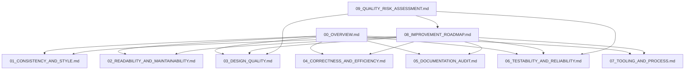

# Technical Specification

# 0. Agent Action Plan

## 0.1 Intent Clarification


### 0.1.1 Core Documentation Objective

Based on the provided requirements, the Blitzy platform understands that the documentation objective is to **produce an exhaustive, evidence-based code quality audit documentation set** for the Kubernetes main repository (`k8s.io/kubernetes`), a large-scale Go monorepo comprising 12,272 Go source files across 4,530+ directories. This is not a surface-level review — it is a permanent engineering artifact intended to serve as the **authoritative reference** for the codebase's current state, systemic risks, and improvement roadmap.

**Request Category:** Create new documentation

**Documentation Type:** Technical code quality audit documentation set — encompassing architecture assessment, code consistency analysis, design quality cataloging, correctness risk inventories, documentation auditing, testability evaluation, tooling assessment, and a prioritized improvement roadmap.

**Documentation Requirements with Enhanced Clarity:**

- **R1 — Code Consistency & Style Audit:** Perform a complete cross-cutting analysis of naming conventions, formatting patterns, language/framework convention adherence, architectural pattern consistency, and cross-module consistency across every module, layer, and file. Each inconsistency must reference specific source locations.
- **R2 — Readability & Maintainability Assessment:** For every significant module, document clarity of intent, function/class size outliers, separation of concerns, reusability/modularity, dead code, and speculative generalization — with individual instances cataloged.
- **R3 — Best Practices & Design Quality Catalog:** Produce a structured inventory of abstraction quality, error handling patterns, input validation coverage, anti-pattern instances (God objects, deep nesting, magic numbers, primitive obsession, feature envy, shotgun surgery, inappropriate intimacy, leaky abstractions), and configuration vs. hardcoded values.
- **R4 — Code Efficiency & Correctness (Static Analysis):** Document redundant logic, unnecessary allocations, language feature misuse (async/await, concurrency constructs), correctness risks depending on undocumented assumptions, and fragile logic paths — without runtime profiling.
- **R5 — Documentation & Comments Audit:** Produce a complete audit of comment quality, outdated comments, public API documentation coverage, non-obvious logic documentation, and documentation gaps ranked by defect introduction risk.
- **R6 — Testability & Reliability Assessment:** Assess unit and integration testability per component, catalog existing test evidence, hidden side effects, non-deterministic behavior, and produce a structured coupling inventory.
- **R7 — Tooling & Process Signals:** Assess all observable tooling (linters, formatters, CI/CD, pre-commit hooks, dependency management) with explicit inference flags where configuration is absent.
- **R8 — Improvement Roadmap:** Create a prioritized, actionable improvement plan where each recommendation references specific findings, states expected benefits, and is assigned P0–P3 priority.
- **R9 — Quality Risk Assessment:** Produce a risk register, architectural risk inventory, change risk map, long-term maintainability forecast, and flag areas creating difficulty for onboarding, incident response, or compliance.
- **R10 — Overview Document:** Summarize all dimensions with qualitative risk ratings (Low/Medium/High/Critical) and provide a table of contents linking all documents.

**Inferred Documentation Needs:**

- The Kubernetes codebase uses staging modules (`staging/src/k8s.io/*`) with in-tree replace directives — the audit documentation must account for the dual-module nature of the repository architecture.
- The `pkg/` directory contains 30 top-level packages with highly variable sizes (from 1 file in `pkg/windows/` to 675 files in `pkg/kubelet/`) — documentation must scale analysis depth proportionally.
- Existing `audit-results/` directory contains security-focused SARIF reports, OWASP compliance, and remediation roadmaps — the new code quality audit documentation must complement but not duplicate this existing security audit work.
- The `hack/` directory contains 50+ verification/update scripts forming a de facto quality enforcement system — these must be inventoried as part of the tooling assessment.
- The `cmd/` directory provides 25+ CLI entrypoints including documentation generators (`gendocs`, `genkubedocs`, `genman`, `genyaml`) — these must be documented as part of the existing documentation infrastructure.

### 0.1.2 Special Instructions and Constraints

**Critical User Directives:**

- **Extraction and documentation only** — Do not modify, refactor, fix, or improve any code as part of this process. Document logic, patterns, and issues exactly as implemented.
- **Exhaustiveness over brevity** — Prioritize completeness, traceability, and precision. This documentation is expected to require significant analytical depth.
- **Evidence-grounded findings** — All findings must be grounded in direct inspection of the code provided. Where conclusions are inferred, this must be explicitly flagged as inferred.
- **Do not generalize beyond observable evidence** — Every finding must reference specific source locations or carry an explicit inference flag.
- **Structured finding format** — Every cataloged finding must include: Finding ID, Category, Title, Source Location, Description, Evidence, Impact, Inference Flag (CONFIRMED/INFERRED), and Recommendation Ref.

**Template Requirements:**

USER PROVIDED TEMPLATE — Finding Format:
```
| Field | Description |
| --- | --- |
| Finding ID | Unique identifier (e.g., CONS-014, DESIGN-007, TEST-023) |
| Category | Consistency / Maintainability / Design / Correctness / Documentation / Testability / Tooling |
| Title | Short, precise description of the finding |
| Source Location | File path and line number or range |
| Description | What was observed, with direct reference to the code |
| Evidence | Quote or paraphrase of the relevant code construct |
| Impact | What goes wrong if this is not addressed |
| Inference Flag | CONFIRMED or INFERRED |
| Recommendation Ref | Cross-reference to 08_IMPROVEMENT_ROADMAP.md |
```

**Style Preferences:**

- Findings reported only where recurrent or cross-cutting; isolated deviations noted but not foregrounded
- Qualitative risk ratings per dimension: Low / Medium / High / Critical
- Priority tiers for recommendations: P0 (Critical), P1 (High), P2 (Medium), P3 (Low)
- Documentation output path: `/Documentation/CodeQualityAudit/`
- Each document is a separate file within the output directory

### 0.1.3 Technical Interpretation

These documentation requirements translate to the following technical documentation strategy:

- To **document code consistency and style** (R1), we will **create** `Documentation/CodeQualityAudit/01_CONSISTENCY_AND_STYLE.md` by analyzing naming conventions, formatting, and architectural patterns across `pkg/`, `cmd/`, `plugin/`, `staging/`, and `test/` directories, referencing specific file paths and line ranges for every divergence.
- To **document readability and maintainability** (R2), we will **create** `Documentation/CodeQualityAudit/02_READABILITY_AND_MAINTAINABILITY.md` by cataloging function/class size outliers, duplication instances, dead code, and separation-of-concerns violations across all 30 `pkg/` sub-packages.
- To **document design quality** (R3), we will **create** `Documentation/CodeQualityAudit/03_DESIGN_QUALITY.md` by producing structured catalogs of error handling patterns, anti-pattern instances, input validation coverage, and abstraction quality across the service, controller, registry, and API layers.
- To **document correctness and efficiency** (R4), we will **create** `Documentation/CodeQualityAudit/04_CORRECTNESS_AND_EFFICIENCY.md` by identifying redundant logic, concurrency construct misuse, and correctness risks across `pkg/controller/`, `pkg/kubelet/`, `pkg/scheduler/`, and `pkg/proxy/`.
- To **audit documentation and comments** (R5), we will **create** `Documentation/CodeQualityAudit/05_DOCUMENTATION_AUDIT.md` by evaluating comment quality, outdated comments, and public API documentation gaps across the entire Go source tree.
- To **assess testability and reliability** (R6), we will **create** `Documentation/CodeQualityAudit/06_TESTABILITY_AND_RELIABILITY.md` by analyzing coupling patterns, test infrastructure in `test/`, hidden side effects, and non-deterministic behavior across all production code paths.
- To **assess tooling and process** (R7), we will **create** `Documentation/CodeQualityAudit/07_TOOLING_AND_PROCESS.md` by inventorying `hack/golangci.yaml`, `hack/verify-*` scripts, `Makefile`, `build/dependencies.yaml`, and CI/CD configurations.
- To **produce the improvement roadmap** (R8), we will **create** `Documentation/CodeQualityAudit/08_IMPROVEMENT_ROADMAP.md` by synthesizing all findings into prioritized P0–P3 recommendations with cross-references to source documents.
- To **produce the risk assessment** (R9), we will **create** `Documentation/CodeQualityAudit/09_QUALITY_RISK_ASSESSMENT.md` by mapping change risk per module, architectural risks, and long-term maintainability forecasts.
- To **produce the overview** (R10), we will **create** `Documentation/CodeQualityAudit/00_OVERVIEW.md` by summarizing findings across all dimensions with qualitative risk ratings and cross-links.


## 0.2 Documentation Discovery and Analysis


### 0.2.1 Existing Documentation Infrastructure Assessment

Repository analysis reveals a **minimal in-repository documentation structure** with documentation primarily distributed as scattered README files, generated API docs tooling, and a separate security audit deliverable set. The `docs/` directory at the repository root contains only `.gitignore` and `OWNERS` files — indicating that canonical Kubernetes documentation is maintained externally (kubernetes.io) rather than in this repository.

**Search Patterns Employed:**
- Documentation files: `README*`, `docs/**`, `*.md`, `*.mdx`, `*.rst`, `wiki/**`
- Documentation generators: `mkdocs.yml`, `docusaurus.config.js`, `sphinx.conf.py`
- Existing documentation for related functionality: `audit-results/*.md`, `CHANGELOG.md`, `CONTRIBUTING.md`
- Documentation templates and style guides: `hack/boilerplate/`, `hack/generate-docs.sh`

**Findings:**

| Category | Details |
|----------|---------|
| Current documentation framework | None (no mkdocs, Sphinx, or Docusaurus detected) |
| Documentation generator config | `hack/update-generated-docs.sh` orchestrates `cmd/gendocs`, `cmd/genkubedocs`, `cmd/genman`, `cmd/genyaml` for CLI and admin documentation |
| API documentation tools | Swagger/OpenAPI generation via `cmd/genswaggertypedocs`; OpenAPI spec at `api/openapi-spec/swagger.json` |
| Diagram tools detected | None (no Mermaid or PlantUML configuration found in-repository) |
| Documentation hosting/deployment | External — kubernetes.io; generated docs are exported, not hosted from this repository |
| Existing documentation files | 309 Markdown files total across the repository (including vendor-adjacent changelogs, READMEs, and license documentation) |
| Security audit documentation | `audit-results/` directory contains OWASP compliance, remediation roadmap, vulnerability reports, SARIF files, and SBOM artifacts |
| Boilerplate templates | `hack/boilerplate/` contains license header templates for `.go`, `.py`, `.sh`, `Dockerfile`, and `Makefile` files |

**Documentation Generator Infrastructure:**

The repository includes built-in documentation generators in `cmd/`:
- `cmd/gendocs/` — Generates kubectl CLI documentation (via `gen_kubectl_docs.go`)
- `cmd/genkubedocs/` — Generates component documentation for kube-apiserver, kube-controller-manager, kube-proxy, kube-scheduler, kubelet, kubeadm (with postprocessing)
- `cmd/genman/` — Generates man pages for all major components
- `cmd/genyaml/` — Generates kubectl YAML examples
- `cmd/genswaggertypedocs/` — Generates Swagger type documentation

The `hack/update-generated-docs.sh` script orchestrates the documentation generation pipeline, invoking these tools and placing output into `docs/user-guide/kubectl/`, `docs/admin/`, and `docs/man/man1/`.

### 0.2.2 Repository Code Analysis for Documentation

**Search Patterns for Code to Document:**

| Pattern | Directories Examined | File Count |
|---------|---------------------|------------|
| Public APIs (exported Go types/functions) | `pkg/**/*.go` | ~3,100 non-test Go files |
| Module interfaces (`pkg/*/`) | 30 top-level packages under `pkg/` | 30 packages |
| Controller implementations | `pkg/controller/**/` | 540 Go files across 30+ controllers |
| Kubelet subsystems | `pkg/kubelet/**/` | 675 Go files across 30+ sub-packages |
| API type definitions | `pkg/apis/**/types.go` | 15+ API group type definitions |
| Registry (REST storage) | `pkg/registry/**/` | 424 Go files across 20+ API groups |
| Scheduler | `pkg/scheduler/**/` | 209 Go files |
| Proxy | `pkg/proxy/**/` | 115 Go files |
| Volume plugins | `pkg/volume/**/` | 195 Go files |
| CLI entrypoints | `cmd/*/` | 25+ commands |
| Staging modules | `staging/src/k8s.io/*/` | 31 staging modules |
| Admission plugins | `plugin/pkg/admission/**/` | 40+ admission controller files |
| E2E test suites | `test/e2e/**/` | 25+ test categories |
| Verification scripts | `hack/verify-*` | 50+ verification scripts |

**Related Documentation Found:**

| File | Content | Relevance |
|------|---------|-----------|
| `README.md` | Project overview, badges, quick-start, community links | High — entry point for new engineers |
| `CONTRIBUTING.md` | Contributor onboarding, CLA instructions | Medium — process documentation |
| `SUPPORT.md` | Support channels (Stack Overflow, Slack, docs) | Low — external references |
| `CHANGELOG.md` | Index to per-release changelogs in `CHANGELOG/` | Medium — release documentation pattern |
| `build/README.md` | Build system documentation | High — build process understanding |
| `cluster/README.md` | Cluster lifecycle documentation | Medium — deployment documentation |
| `hack/README.md` | Developer tooling documentation | High — tooling process documentation |
| `audit-results/owasp-compliance.md` | OWASP Top 10 compliance scorecard | High — existing audit context |
| `audit-results/remediation-roadmap.md` | Security vulnerability remediation plan | High — existing audit context |
| `logo/usage_guidelines.md` | Logo usage guidelines | Low — brand assets |
| `logo/colors.md` | Brand color documentation | Low — brand assets |

### 0.2.3 Web Search Research Conducted

Research was conducted to validate best practices for Go codebase quality audit documentation:

- **Go code audit methodology:** Industry practice includes static analysis via golangci-lint (50+ linters), go vet, gofmt enforcement, gosec security scanning, and manual expert review for architectural and design quality assessment.
- **Audit documentation structure conventions:** Findings should follow structured formats with unique IDs, source locations, evidence, impact ratings, and cross-referenced recommendations. Qualitative risk ratings (Low/Medium/High/Critical) are standard.
- **Tooling for Go code quality:** The Kubernetes project itself uses golangci-lint with tiered configurations (permissive `golangci.yaml` and stricter `golangci-hints.yaml`), both generated from `golangci.yaml.in` — a mature approach supporting incremental quality improvement.
- **Diagram types for architecture documentation:** Mermaid sequence diagrams for workflows, dependency graphs for coupling analysis, and tree diagrams for module hierarchy visualization are recommended for Go monorepo audit documentation.


## 0.3 Documentation Scope Analysis


### 0.3.1 Code-to-Documentation Mapping

The following catalog maps every major codebase area to the audit documentation requirements. Each module is assessed for its audit relevance, current documentation status, and required analysis depth.

**Core Infrastructure Modules:**

- **Module:** `pkg/kubelet/` (675 Go files, 30+ sub-packages)
  - Key sub-packages: `cm/` (146 files), `kuberuntime/` (44 files), `apis/` (47 files), `images/` (25 files), `eviction/` (19 files), `pluginmanager/` (26 files), `container/` (23 files)
  - Current documentation: Package-level comments exist but no consolidated architecture docs
  - Audit documentation needed: Consistency analysis, function size outliers, coupling inventory, error handling patterns, hidden side effects catalog, testability assessment

- **Module:** `pkg/controller/` (540 Go files, 30+ controllers)
  - Key controllers: `volume/` (86 files), `certificates/` (34 files), `nodeipam/` (25 files), `job/` (25 files), `deployment/` (23 files), `garbagecollector/` (23 files), `statefulset/` (21 files)
  - Current documentation: Package-level doc comments (e.g., `deployment_controller.go` has a package-level description)
  - Audit documentation needed: Cross-controller consistency analysis, anti-pattern catalog, design quality per controller, separation of concerns assessment

- **Module:** `pkg/scheduler/` (209 Go files)
  - Key sub-packages: `framework/`, `backend/`, `apis/`, `profile/`, `metrics/`, `util/`
  - Current documentation: Framework plugin interfaces documented in code
  - Audit documentation needed: Abstraction quality assessment, correctness risk register for scheduling decisions, coupling inventory

- **Module:** `pkg/registry/` (424 Go files, 20+ API groups)
  - Key groups: `core/`, `apps/`, `batch/`, `networking/`, `rbac/`, `authentication/`, `certificates/`, `resource/`
  - Current documentation: REST storage strategy patterns with standard interfaces
  - Audit documentation needed: Cross-API-group consistency, input validation coverage map, design pattern adherence

- **Module:** `pkg/proxy/` (115 Go files)
  - Current documentation: Minimal package-level comments
  - Audit documentation needed: Architecture pattern consistency (iptables vs. ipvs vs. nftables), correctness risks, efficiency analysis

- **Module:** `pkg/volume/` (195 Go files)
  - Current documentation: Plugin interface documentation
  - Audit documentation needed: Plugin consistency catalog, dead code inventory (deprecated volume plugins), abstraction quality

- **Module:** `pkg/apis/` (632 Go files, 15+ API groups)
  - Key types files: `pkg/apis/core/types.go`, `pkg/apis/apps/types.go`, `pkg/apis/batch/types.go`, etc.
  - Current documentation: API type documentation via Go doc comments; auto-generated swagger type docs
  - Audit documentation needed: Public API documentation coverage map, comment quality distribution

**CLI and Entry Points:**

- **Module:** `cmd/` (25+ commands)
  - Key binaries: `kube-apiserver`, `kube-controller-manager`, `kube-scheduler`, `kube-proxy`, `kubelet`, `kubeadm`, `kubectl`, `kubectl-convert`, `cloud-controller-manager`, `kubemark`
  - Documentation generators: `gendocs`, `genkubedocs`, `genman`, `genyaml`, `genswaggertypedocs`
  - Utility tools: `clicheck`, `dependencycheck`, `dependencyverifier`, `fieldnamedocscheck`, `importverifier`, `preferredimports`
  - Current documentation: Generated CLI docs via Cobra framework
  - Audit documentation needed: Tooling inventory, documentation generator assessment

**Staging Modules:**

- **Module:** `staging/src/k8s.io/` (31 staging modules)
  - Key modules: `client-go`, `apimachinery`, `apiserver`, `kubectl`, `kubelet`, `api`, `component-base`, `controller-manager`, `code-generator`
  - Current documentation: Separate `README.md` per staging module, publishing policy documentation
  - Audit documentation needed: Cross-module consistency with `pkg/`, interface documentation coverage

**Test Infrastructure:**

- **Module:** `test/` (E2E, integration, conformance, compatibility)
  - Sub-directories: `test/e2e/` (25+ categories), `test/conformance/`, `test/compatibility_lifecycle/`, `test/cmd/`
  - Current documentation: Test ownership files, conformance test data
  - Audit documentation needed: Test coverage map, test infrastructure assessment

**Admission Plugins:**

- **Module:** `plugin/pkg/admission/` (40+ admission controllers)
  - Current documentation: Individual admission controller doc comments
  - Audit documentation needed: Cross-plugin consistency, pattern adherence catalog

**Build and Process Infrastructure:**

- **Module:** `hack/` (50+ verify scripts, 10+ update scripts, library scripts)
  - Current documentation: `hack/README.md`, inline script comments
  - Audit documentation needed: Tooling inventory, quality gate assessment, verification coverage

- **Module:** `build/` (build scripts, Dockerfiles, dependency manifest)
  - Current documentation: `build/README.md`
  - Audit documentation needed: Build process assessment, dependency management analysis

### 0.3.2 Documentation Gap Analysis

Given the requirements and repository analysis, documentation gaps include:

**Undocumented or Under-Documented Areas:**
- No consolidated code quality audit documentation exists at `/Documentation/CodeQualityAudit/` — the entire document set must be created from scratch
- No cross-cutting consistency analysis document exists for the repository
- No anti-pattern catalog or design quality assessment has been produced
- No structured coupling inventory exists
- No documentation gap analysis with prioritized risk has been performed
- No correctness risk register exists for the codebase

**Existing Documentation That Partially Overlaps:**
- `audit-results/owasp-compliance.md` covers security-specific findings but not general code quality
- `audit-results/remediation-roadmap.md` addresses security vulnerabilities but not design debt, consistency, or maintainability
- `hack/golangci.yaml` and `hack/golangci-hints.yaml` encode linting rules but their coverage and effectiveness are not documented

**Key Analysis Dimensions With Zero Existing Coverage:**
- Naming convention inventory by layer/module
- Formatting pattern catalog with source evidence
- Function/class size distribution analysis
- Dead code catalog with removal risk assessment
- Error handling pattern catalog with consistency analysis
- Input validation coverage map
- Anti-pattern instance catalog (God objects, deep nesting, magic values, etc.)
- Configuration vs. hardcoded values inventory
- Comment quality distribution by module
- Per-component testability assessment
- Hidden side effect catalog
- Long-term maintainability forecast


## 0.4 Documentation Implementation Design


### 0.4.1 Documentation Structure Planning

The audit documentation set will be organized as a flat collection of 10 numbered documents under a single output directory, following the user-specified structure. Each document is self-contained but cross-referenced to related findings via Finding IDs and Recommendation Refs.

```
Documentation/
└── CodeQualityAudit/
    ├── 00_OVERVIEW.md
    ├── 01_CONSISTENCY_AND_STYLE.md
    ├── 02_READABILITY_AND_MAINTAINABILITY.md
    ├── 03_DESIGN_QUALITY.md
    ├── 04_CORRECTNESS_AND_EFFICIENCY.md
    ├── 05_DOCUMENTATION_AUDIT.md
    ├── 06_TESTABILITY_AND_RELIABILITY.md
    ├── 07_TOOLING_AND_PROCESS.md
    ├── 08_IMPROVEMENT_ROADMAP.md
    └── 09_QUALITY_RISK_ASSESSMENT.md
```

**Document Dependency Graph:**



### 0.4.2 Content Generation Strategy

**Information Extraction Approach:**

- Extract naming convention patterns from `pkg/`, `cmd/`, `plugin/`, `staging/` by analyzing Go exported identifiers, file names, and directory structures
- Extract error handling patterns by analyzing `if err != nil` blocks, error wrapping with `fmt.Errorf`, and error type assertions across `pkg/controller/`, `pkg/kubelet/`, `pkg/scheduler/`
- Generate function size metrics by analyzing function declarations across all `*.go` files (excluding vendor, third_party, and generated files)
- Identify dead code by cross-referencing exported symbols with import graphs and usage patterns
- Extract test coverage signals by mapping `*_test.go` files against their corresponding production files in `pkg/`
- Catalog admission controller patterns by analyzing `plugin/pkg/admission/**/admission.go` for interface conformance
- Inventory tooling configuration from `hack/golangci.yaml`, `hack/golangci-hints.yaml`, `Makefile`, `hack/verify-*`, and `hack/update-*` scripts
- Extract dependency management signals from `go.mod`, `go.sum`, `go.work.sum`, and `build/dependencies.yaml`
- Generate cross-module inconsistency reports by comparing implementation patterns for common concerns (authentication, validation, logging, error propagation) across different `pkg/` sub-packages

**Finding Format Application:**

Every finding across all documents must use the user-specified structured format:

| Field | Description |
|-------|-------------|
| Finding ID | Prefixed by document area (e.g., CONS-NNN, MAINT-NNN, DESIGN-NNN, CORR-NNN, DOC-NNN, TEST-NNN, TOOL-NNN) |
| Category | One of: Consistency, Maintainability, Design, Correctness, Documentation, Testability, Tooling |
| Title | Short, precise description |
| Source Location | File path and line number or range |
| Description | Observation with direct code reference |
| Evidence | Quote or paraphrase of the relevant code construct |
| Impact | Consequence if unaddressed |
| Inference Flag | CONFIRMED (directly observed) or INFERRED (conclusion from absence/pattern) |
| Recommendation Ref | Cross-reference to `08_IMPROVEMENT_ROADMAP.md` section |

### 0.4.3 Documentation Standards

All documents will adhere to the following formatting standards:

- **Markdown formatting** with proper heading hierarchy (`# Document Title`, `## Major Section`, `### Subsection`, `#### Detail`)
- **Mermaid diagram integration** using fenced code blocks for:
  - Module dependency graphs (for coupling inventory)
  - Error handling flow diagrams (for pattern catalog)
  - Architecture layer diagrams (for consistency assessment)
  - Risk heat maps (for quality risk assessment)
- **Code evidence** using fenced Go code blocks with file path citations:
  ```
  Source: pkg/controller/deployment/deployment_controller.go:25-40
  ```
- **Tables** for structured finding catalogs, convention inventories, and coverage metrics
- **Source citations** as inline references in format: `Source: /path/to/file.go:LineNumber`
- **Consistent terminology** using Kubernetes project-standard naming (pods, controllers, informers, reconciliation loops, etc.)
- **Qualitative risk ratings** standardized as: Low / Medium / High / Critical
- **Priority tiers** standardized as: P0 (Critical) / P1 (High) / P2 (Medium) / P3 (Low)

### 0.4.4 Diagram and Visual Strategy

**Mermaid Diagrams to Create:**

| Document | Diagram Type | Purpose |
|----------|-------------|---------|
| `00_OVERVIEW.md` | Radar/summary chart | Visual overview of quality dimensions |
| `01_CONSISTENCY_AND_STYLE.md` | Tree diagram | Module-by-layer naming convention map |
| `02_READABILITY_AND_MAINTAINABILITY.md` | Bar chart / distribution | Function size distribution visualization |
| `03_DESIGN_QUALITY.md` | Flowchart | Error handling pattern decision tree |
| `04_CORRECTNESS_AND_EFFICIENCY.md` | Sequence diagram | Correctness risk scenario flows |
| `05_DOCUMENTATION_AUDIT.md` | Pie chart / coverage map | Documentation coverage by module |
| `06_TESTABILITY_AND_RELIABILITY.md` | Graph diagram | Inter-module coupling visualization |
| `07_TOOLING_AND_PROCESS.md` | Flowchart | CI/CD pipeline stage map |
| `08_IMPROVEMENT_ROADMAP.md` | Gantt-style priority | Priority tier visualization |
| `09_QUALITY_RISK_ASSESSMENT.md` | Heat map diagram | Change risk map per module |


## 0.5 Documentation File Transformation Mapping


### 0.5.1 File-by-File Documentation Plan

The following exhaustive table maps every documentation file to be created, with its transformation mode, source code dependencies, and content scope. All target files are listed first.

| Target Documentation File | Transformation | Source Code/Docs | Content/Changes |
|---------------------------|----------------|------------------|-----------------|
| `Documentation/CodeQualityAudit/00_OVERVIEW.md` | CREATE | All `pkg/`, `cmd/`, `plugin/`, `staging/`, `test/`, `hack/`, `build/` directories; all other audit documents | High-level codebase quality assessment across all 7 dimensions, summary risk ratings (Low/Medium/High/Critical), analysis scope statement, entry points analyzed, explicit limitations, table of contents linking to all other 9 documents |
| `Documentation/CodeQualityAudit/01_CONSISTENCY_AND_STYLE.md` | CREATE | `pkg/**/*.go`, `cmd/**/*.go`, `plugin/**/*.go`, `staging/src/k8s.io/**/*.go`, `hack/golangci.yaml`, `hack/golangci-hints.yaml`, `.gitattributes` | Complete naming convention inventory by layer (service, controller, registry, API, scheduler, kubelet, proxy, volume), formatting pattern catalog, language/framework convention adherence table, architectural pattern consistency assessment, cross-module inconsistency catalog with source locations |
| `Documentation/CodeQualityAudit/02_READABILITY_AND_MAINTAINABILITY.md` | CREATE | `pkg/**/*.go`, `cmd/**/*.go`, `plugin/pkg/admission/**/*.go` | Function/class size distribution with outliers cataloged, separation of concerns assessment per module, duplication inventory with source locations and divergence risk, dead code catalog with estimated staleness, speculative generalization inventory |
| `Documentation/CodeQualityAudit/03_DESIGN_QUALITY.md` | CREATE | `pkg/**/*.go`, `cmd/**/*.go`, `plugin/pkg/admission/**/*.go`, `staging/src/k8s.io/**/*.go` | Abstraction quality assessment per module, error handling pattern catalog (complete with divergence flagged), input validation coverage map, anti-pattern catalog (God objects, deep nesting, magic numbers, primitive obsession, feature envy, shotgun surgery, inappropriate intimacy, leaky abstractions) with source locations and impact, configuration vs. hardcoded value inventory |
| `Documentation/CodeQualityAudit/04_CORRECTNESS_AND_EFFICIENCY.md` | CREATE | `pkg/controller/**/*.go`, `pkg/kubelet/**/*.go`, `pkg/scheduler/**/*.go`, `pkg/proxy/**/*.go`, `pkg/volume/**/*.go`, `pkg/registry/**/*.go` | Redundant logic inventory, unnecessary allocation patterns, language feature misuse catalog (async/goroutine patterns, channel usage, context handling), correctness risk register (assumption, violation condition, guard status), fragile logic inventory |
| `Documentation/CodeQualityAudit/05_DOCUMENTATION_AUDIT.md` | CREATE | All `*.go` files excluding `vendor/`, `third_party/`, and generated files (`zz_generated.*`, `*.pb.go`, `types_swagger_doc_generated.go`) | Comment quality distribution by file/module, outdated comment catalog, undocumented public API surface map, non-obvious logic documentation assessment, documentation gap priority list ranked by defect introduction risk |
| `Documentation/CodeQualityAudit/06_TESTABILITY_AND_RELIABILITY.md` | CREATE | `pkg/**/*.go`, `test/**/*.go`, `*_test.go` files throughout the repository | Per-component testability assessment (unit and integration), coupling inventory with high-coupling cluster identification, existing test coverage map from test file analysis, hidden side effect catalog, non-deterministic behavior inventory |
| `Documentation/CodeQualityAudit/07_TOOLING_AND_PROCESS.md` | CREATE | `hack/golangci.yaml`, `hack/golangci-hints.yaml`, `hack/golangci.yaml.in`, `hack/verify-*`, `hack/update-*`, `hack/lib/*`, `Makefile`, `hack/make-rules/*`, `build/dependencies.yaml`, `build/common.sh`, `.github/**`, `.gitattributes`, `go.mod`, `go.sum` | Tooling inventory with configuration details, linter rule coverage assessment, CI/CD pipeline stage map, missing tooling assessment with inference flags, pre-commit hook assessment, dependency manifest analysis, verification script inventory |
| `Documentation/CodeQualityAudit/08_IMPROVEMENT_ROADMAP.md` | CREATE | All other audit documents (`01` through `07`), all findings catalogs | Prioritized improvement plan with P0–P3 tiers, each recommendation referencing specific findings by document and section, expected benefit stated, guidance on standardization/refactoring/tooling, no specific code rewrites unless unavoidable |
| `Documentation/CodeQualityAudit/09_QUALITY_RISK_ASSESSMENT.md` | CREATE | All other audit documents, `pkg/` module structure, `test/` coverage signals, `hack/` verification coverage | Risk register for degradation-prone areas, architectural risk inventory (coupling, ownership, implicit contracts), change risk map per major module, long-term maintainability forecast, onboarding/incident-response/compliance difficulty flags |

### 0.5.2 New Documentation Files Detail

**File: `Documentation/CodeQualityAudit/00_OVERVIEW.md`**
- Type: Executive Summary / Index
- Source Code: Entire repository; all other audit documents
- Sections:
  - High-level quality assessment narrative
  - Analysis scope, entry points, and limitations
  - Risk rating summary table (7 dimensions × qualitative scale)
  - Table of contents with links to all 9 other documents
  - Key findings summary per dimension
- Diagrams:
  - Quality dimension summary (Mermaid quadrant or table visualization)
- Key Citations: All `pkg/` subdirectories, `cmd/`, `hack/`, `test/`, `build/`

**File: `Documentation/CodeQualityAudit/01_CONSISTENCY_AND_STYLE.md`**
- Type: Consistency Audit Report
- Source Code: `pkg/**/*.go`, `cmd/**/*.go`, `plugin/**/*.go`, `staging/src/k8s.io/**/*.go`
- Sections:
  - Naming convention inventory organized by layer and type
  - Formatting pattern catalog with source evidence
  - Language and framework convention adherence table
  - Architectural pattern consistency assessment
  - Cross-module inconsistency catalog (concern, Module A impl, Module B impl, impact)
- Diagrams:
  - Module-by-layer naming convention tree
  - Architectural pattern distribution map
- Key Citations: `pkg/controller/`, `pkg/kubelet/`, `pkg/scheduler/`, `pkg/registry/`, `pkg/proxy/`, `hack/golangci.yaml`

**File: `Documentation/CodeQualityAudit/02_READABILITY_AND_MAINTAINABILITY.md`**
- Type: Maintainability Assessment
- Source Code: `pkg/**/*.go`, `cmd/**/*.go`, `plugin/pkg/admission/**/*.go`
- Sections:
  - Function/class size distribution summary with outliers
  - Separation of concerns assessment per module
  - Duplication inventory (logic, source locations, divergence risk)
  - Dead code catalog (path, estimated staleness, removal risk)
  - Speculative generalization inventory
- Diagrams:
  - Function size distribution histogram
  - Duplication heat map by module
- Key Citations: All `pkg/` sub-packages, `plugin/pkg/admission/`

**File: `Documentation/CodeQualityAudit/03_DESIGN_QUALITY.md`**
- Type: Design Quality Assessment
- Source Code: `pkg/**/*.go`, `cmd/**/*.go`, `plugin/pkg/admission/**/*.go`, `staging/src/k8s.io/**/*.go`
- Sections:
  - Abstraction quality assessment per module
  - Error handling pattern catalog (complete, divergence flagged)
  - Input validation coverage map
  - Anti-pattern catalog (structured, with source locations and impact ratings)
  - Configuration vs. hardcoded value inventory
- Diagrams:
  - Error handling pattern decision flowchart
  - Anti-pattern distribution by category and module
- Key Citations: `pkg/controller/`, `pkg/kubelet/`, `pkg/scheduler/`, `pkg/registry/`, `pkg/apis/`

**File: `Documentation/CodeQualityAudit/04_CORRECTNESS_AND_EFFICIENCY.md`**
- Type: Correctness Risk Analysis
- Source Code: `pkg/controller/**/*.go`, `pkg/kubelet/**/*.go`, `pkg/scheduler/**/*.go`, `pkg/proxy/**/*.go`
- Sections:
  - Redundant logic inventory with source locations
  - Language feature misuse catalog (goroutines, channels, context, sync primitives)
  - Correctness risk register (assumption, violation condition, guard status per entry)
  - Fragile logic inventory with risk surface description
- Diagrams:
  - Correctness risk scenario sequence diagrams
- Key Citations: `pkg/controller/job/`, `pkg/kubelet/kuberuntime/`, `pkg/scheduler/framework/`, `pkg/proxy/`

**File: `Documentation/CodeQualityAudit/05_DOCUMENTATION_AUDIT.md`**
- Type: Documentation Coverage Audit
- Source Code: All `*.go` files (excluding vendor, third_party, generated)
- Sections:
  - Comment quality distribution by file/module
  - Outdated comment catalog (comment text, actual behavior, source location)
  - Undocumented public API surface map
  - Non-obvious logic documentation assessment
  - Documentation gap priority list ranked by defect introduction risk
- Diagrams:
  - Documentation coverage pie chart by module
- Key Citations: `pkg/apis/`, `pkg/controller/`, `pkg/kubelet/`, `pkg/scheduler/`

**File: `Documentation/CodeQualityAudit/06_TESTABILITY_AND_RELIABILITY.md`**
- Type: Testability Assessment
- Source Code: `pkg/**/*.go`, `test/**/*.go`, all `*_test.go` files
- Sections:
  - Per-component testability assessment (unit and integration)
  - Coupling inventory with high-coupling cluster identification
  - Existing test coverage map (from test file presence, not runtime coverage)
  - Hidden side effect catalog
  - Non-deterministic behavior inventory
- Diagrams:
  - Inter-module coupling graph
  - Test coverage heat map by package
- Key Citations: `test/e2e/`, `pkg/controller/`, `pkg/kubelet/`, `pkg/scheduler/`

**File: `Documentation/CodeQualityAudit/07_TOOLING_AND_PROCESS.md`**
- Type: Tooling and Process Assessment
- Source Code: `hack/`, `build/`, `.github/`, `Makefile`, `go.mod`
- Sections:
  - Tooling inventory with configuration details (golangci-lint, gofmt, go vet, verify scripts)
  - CI/CD pipeline stage map (build, lint, test, verify stages from Makefile)
  - Missing tooling assessment with inference justification
  - Pre-commit hook assessment (none detected — INFERRED absence)
  - Dependency manifest analysis (go.mod, build/dependencies.yaml)
- Diagrams:
  - CI/CD pipeline stage flowchart
  - Verification script coverage map
- Key Citations: `hack/golangci.yaml`, `hack/verify-*`, `Makefile`, `hack/make-rules/`, `build/dependencies.yaml`

**File: `Documentation/CodeQualityAudit/08_IMPROVEMENT_ROADMAP.md`**
- Type: Improvement Roadmap
- Source Code: All other audit documents
- Sections:
  - P0 (Critical) recommendations — correctness risks, active maintenance blockers
  - P1 (High) recommendations — systemic issues degrading velocity/reliability
  - P2 (Medium) recommendations — recurrent inconsistencies, design debt
  - P3 (Low) recommendations — hygiene, polish, long-horizon improvements
  - Standardization guidance
  - Tooling enhancement recommendations
- Diagrams:
  - Priority distribution visualization
- Key Citations: Cross-references to all findings in documents 01–07

**File: `Documentation/CodeQualityAudit/09_QUALITY_RISK_ASSESSMENT.md`**
- Type: Risk Assessment
- Source Code: All other audit documents, `pkg/` structure, `test/` structure
- Sections:
  - Risk register for degradation-prone areas
  - Architectural risk inventory (coupling, ownership, implicit contracts)
  - Change risk map per major module (what changes are high-risk and why)
  - Long-term maintainability forecast based on observed technical debt trajectory
  - Onboarding, incident response, and compliance difficulty flags
- Diagrams:
  - Risk heat map by module and change category
  - Architectural risk dependency graph
- Key Citations: `pkg/kubelet/`, `pkg/controller/`, `pkg/scheduler/`, `pkg/registry/`, `pkg/volume/`

### 0.5.3 Documentation Configuration Updates

No documentation framework configuration files (mkdocs.yml, docusaurus.config.js, etc.) exist in the repository. The new documentation set is self-contained Markdown requiring no build tooling configuration changes.

**Cross-Documentation Dependencies:**
- `00_OVERVIEW.md` must link to all 9 other documents via relative Markdown links
- `08_IMPROVEMENT_ROADMAP.md` must cross-reference findings by their Finding IDs from documents 01–07
- `09_QUALITY_RISK_ASSESSMENT.md` must reference improvement recommendations from `08_IMPROVEMENT_ROADMAP.md`
- All finding tables must use consistent Finding ID prefix conventions (CONS-, MAINT-, DESIGN-, CORR-, DOC-, TEST-, TOOL-)


## 0.6 Dependency Inventory


### 0.6.1 Documentation Dependencies

The following tools and packages are relevant to this code quality audit documentation exercise. Since the output is pure Markdown files with Mermaid diagrams, no additional documentation framework installation is required. The tools listed below are those already present in the repository that inform the audit analysis, plus standard Markdown rendering support.

**Existing Repository Tools Relevant to Audit:**

| Registry | Package Name | Version | Purpose |
|----------|-------------|---------|---------|
| go.mod | `go` | 1.25.0 | Go runtime version — basis for language feature analysis |
| go.mod | `github.com/spf13/cobra` | v1.10.0 | CLI framework used by all `cmd/` entrypoints — audit target for CLI documentation patterns |
| go.mod | `github.com/spf13/pflag` | v1.0.9 | Flag parsing library — audit target for configuration externalization |
| go.mod | `k8s.io/klog/v2` | v2.130.1 | Structured logging library — audit target for logging consistency |
| go.mod | `k8s.io/gengo/v2` | v2.0.0-20250922181213 | Code generation framework — audit target for generated code identification |
| go.mod | `github.com/onsi/ginkgo/v2` | v2.27.2 | BDD test framework — audit target for test infrastructure assessment |
| go.mod | `github.com/onsi/gomega` | v1.38.2 | Matcher library for Ginkgo — audit target for test assertion patterns |
| go.mod | `github.com/prometheus/client_golang` | v1.23.2 | Prometheus metrics client — audit target for instrumentation patterns |
| go.mod | `github.com/google/go-cmp` | v0.7.0 | Value comparison library — audit target for test utility usage |
| go.mod | `github.com/emicklei/go-restful/v3` | v3.12.2 | REST framework — audit target for API endpoint patterns |
| go.mod | `github.com/go-openapi/jsonreference` | v0.20.2 | OpenAPI reference handling — audit target for API specification |
| go.mod | `github.com/google/cel-go` | v0.26.0 | Common Expression Language — audit target for validation expression patterns |
| hack/ | `golangci-lint` | Config v2 (yaml) | Linter aggregator — primary tooling audit target |
| hack/ | `gofmt` | Go 1.25.0 standard | Go formatting tool — formatting consistency audit target |
| hack/ | `go vet` | Go 1.25.0 standard | Go static analyzer — correctness audit target |
| build/ | `zeitgeist` | v0.5.4 | External dependency version verifier |

**Documentation Output Tools (Standard):**

| Registry | Package Name | Version | Purpose |
|----------|-------------|---------|---------|
| Standard | Markdown | CommonMark | All audit documents authored in Markdown format |
| Standard | Mermaid | Latest (renderer-dependent) | Diagrams embedded as fenced Mermaid code blocks |
| Standard | Git | Repository-native | Version control for documentation output |

### 0.6.2 Documentation Reference Updates

Since this is a new documentation set creation (no existing documentation at `/Documentation/CodeQualityAudit/`), no link transformations are required.

**Internal Cross-Reference Links to Maintain:**

All 10 documents must maintain consistent internal links:
- `00_OVERVIEW.md` → links to `01_*` through `09_*` via relative paths (e.g., `[Consistency](01_CONSISTENCY_AND_STYLE.md)`)
- `08_IMPROVEMENT_ROADMAP.md` → references findings from `01_*` through `07_*` using Finding IDs
- `09_QUALITY_RISK_ASSESSMENT.md` → references both findings and recommendations using Finding IDs and section refs
- All finding tables → `Recommendation Ref` column links to specific sections in `08_IMPROVEMENT_ROADMAP.md`


## 0.7 Coverage and Quality Targets


### 0.7.1 Documentation Coverage Metrics

**Current Coverage Analysis:**

The code quality audit documentation set does not currently exist — coverage for all dimensions starts at 0%. The following metrics reflect the scope of analysis required to achieve comprehensive coverage.

| Dimension | Codebase Scope | Files to Analyze | Current Audit Coverage | Target Audit Coverage |
|-----------|---------------|------------------|----------------------|----------------------|
| Code Consistency & Style | `pkg/`, `cmd/`, `plugin/`, `staging/` | ~12,272 Go files | 0% | 100% of cross-cutting patterns |
| Readability & Maintainability | `pkg/`, `cmd/`, `plugin/` | ~3,500 non-generated Go files | 0% | 100% of significant modules |
| Design Quality | `pkg/`, `cmd/`, `plugin/`, `staging/` | ~3,500 non-generated Go files | 0% | 100% of public APIs and patterns |
| Correctness & Efficiency | `pkg/controller/`, `pkg/kubelet/`, `pkg/scheduler/`, `pkg/proxy/` | ~1,539 Go files in core paths | 0% | 100% of critical code paths |
| Documentation & Comments | All non-vendor/non-generated Go files | ~9,400 source files | 0% | 100% of public API surface |
| Testability & Reliability | All `pkg/` + `test/` | ~3,500 production + 2,847 test files | 0% | 100% of major components |
| Tooling & Process | `hack/`, `build/`, `.github/`, `Makefile` | ~350 config/script files | 0% | 100% of observable tooling |

**Test File Presence Analysis (proxy for testability coverage assessment):**

| Package | Production Go Files | Test Files | Test File Ratio | Assessment Priority |
|---------|-------------------|------------|-----------------|-------------------|
| `pkg/scheduler` | 127 | 82 | 64% | High — core scheduling logic |
| `pkg/volume` | 124 | 71 | 57% | Medium — plugin architecture |
| `pkg/kubelet` | 440 | 235 | 53% | Critical — largest component |
| `pkg/controlplane` | 40 | 21 | 52% | Medium — control plane setup |
| `pkg/registry` | 279 | 145 | 51% | High — API storage layer |
| `pkg/proxy` | 78 | 37 | 47% | High — network proxy |
| `pkg/util` | 51 | 24 | 47% | Medium — shared utilities |
| `pkg/kubeapiserver` | 15 | 5 | 33% | Medium — API server config |
| `pkg/controller` | 420 | 120 | 28% | Critical — controller logic |
| `pkg/apis` | 539 | 93 | 17% | High — API type definitions |
| `pkg/api` | 26 | 28 | 107% | Low — well-covered |

### 0.7.2 Documentation Quality Criteria

**Completeness Requirements:**

- Every cataloged finding must contain all 9 structured fields (Finding ID, Category, Title, Source Location, Description, Evidence, Impact, Inference Flag, Recommendation Ref)
- Every cross-module inconsistency must include Module A implementation reference, Module B implementation reference, and impact of divergence
- Every anti-pattern instance must include source location, description, and impact rating
- Every correctness risk must include assumption, violation condition, and guard status
- Every documentation gap must be ranked by defect introduction risk

**Accuracy Validation:**

- All source locations must reference actual files and line ranges in the repository
- All evidence must be direct quotes or accurate paraphrases of observable code constructs
- Where conclusions are inferred from absence or pattern, the `INFERRED` flag must be explicitly set
- No generic advice — every finding must be grounded in the specific Kubernetes codebase
- The coupling inventory, anti-pattern catalog, and correctness risk register must not be absent or incomplete

**Clarity Standards:**

- Technical accuracy with precise Go-specific terminology (goroutines, channels, interfaces, struct embedding, etc.)
- Progressive disclosure — each document starts with a summary then provides detailed catalogs
- Consistent terminology aligned with Kubernetes project conventions (controllers, informers, reconciliation, admission webhooks, etc.)
- Findings reported only where recurrent or cross-cutting; isolated deviations noted but not foregrounded

**Maintainability:**

- Source citations embedded for every finding to enable traceability
- Finding ID scheme enables stable cross-referencing between documents
- Structured tables enable machine parsing and future automated tracking
- Each document is self-contained while maintaining cross-references via Finding IDs

### 0.7.3 Example and Diagram Requirements

| Requirement | Target |
|-------------|--------|
| Mermaid diagrams per document | Minimum 1, recommended 2–3 |
| Code evidence citations per finding | Minimum 1 source location |
| Anti-pattern instances | Comprehensive catalog — every observed instance |
| Correctness risk entries | Every logic path with undocumented assumptions |
| Cross-module inconsistency entries | Every divergent implementation of common concerns |
| Dead code entries | Every individual dead code path |
| Documentation gap entries | Prioritized by defect risk |
| Improvement recommendations | Cross-referenced to at least 1 finding |


## 0.8 Scope Boundaries


### 0.8.1 Exhaustively In Scope

**New Documentation Files (CREATE):**
- `Documentation/CodeQualityAudit/00_OVERVIEW.md`
- `Documentation/CodeQualityAudit/01_CONSISTENCY_AND_STYLE.md`
- `Documentation/CodeQualityAudit/02_READABILITY_AND_MAINTAINABILITY.md`
- `Documentation/CodeQualityAudit/03_DESIGN_QUALITY.md`
- `Documentation/CodeQualityAudit/04_CORRECTNESS_AND_EFFICIENCY.md`
- `Documentation/CodeQualityAudit/05_DOCUMENTATION_AUDIT.md`
- `Documentation/CodeQualityAudit/06_TESTABILITY_AND_RELIABILITY.md`
- `Documentation/CodeQualityAudit/07_TOOLING_AND_PROCESS.md`
- `Documentation/CodeQualityAudit/08_IMPROVEMENT_ROADMAP.md`
- `Documentation/CodeQualityAudit/09_QUALITY_RISK_ASSESSMENT.md`

**Source Code to Analyze (Read-Only):**
- `pkg/**/*.go` — All Go source files across 30 top-level packages (kubelet, controller, scheduler, registry, proxy, volume, apis, api, auth, controlplane, etc.)
- `cmd/**/*.go` — All CLI entrypoint Go files across 25+ commands
- `plugin/pkg/admission/**/*.go` — All admission controller plugins
- `staging/src/k8s.io/**/*.go` — All 31 staging module source files (for cross-module consistency analysis)
- `test/**/*.go` — All test files (for testability assessment only)
- `*_test.go` — All test files throughout the repository (for coverage mapping)

**Configuration Files to Analyze (Read-Only):**
- `hack/golangci.yaml` — Primary linter configuration
- `hack/golangci-hints.yaml` — Stricter linter configuration
- `hack/golangci.yaml.in` — Linter configuration template
- `hack/verify-*` — All 50+ verification scripts
- `hack/update-*` — All update/generation scripts
- `hack/lib/*.sh` — Build library scripts
- `hack/make-rules/*.sh` — Make rule implementations
- `hack/boilerplate/` — License header templates
- `Makefile` — Root build orchestration
- `build/dependencies.yaml` — External dependency version manifest
- `build/common.sh` — Build helper script
- `.github/**` — Issue templates, PR template, security policy
- `.gitattributes` — Repository attribute configuration
- `go.mod` — Go module manifest with dependency versions
- `go.sum` — Module checksum ledger
- `go.work.sum` — Workspace checksum ledger

**Existing Documentation to Reference (Read-Only):**
- `README.md` — Repository overview
- `CONTRIBUTING.md` — Contribution guidelines
- `SUPPORT.md` — Support channels
- `CHANGELOG.md` — Release changelog index
- `code-of-conduct.md` — Code of conduct
- `build/README.md` — Build system documentation
- `cluster/README.md` — Cluster lifecycle documentation
- `hack/README.md` — Developer tooling documentation
- `audit-results/*.md` — Existing security audit documentation (for complementary context)
- `logo/usage_guidelines.md`, `logo/colors.md` — Brand documentation

**Existing Audit Artifacts to Reference (Read-Only):**
- `audit-results/owasp-compliance.md`
- `audit-results/remediation-roadmap.md`
- `audit-results/vulnerability-report.csv`
- `audit-results/vulnerability-report.sarif`
- `audit-results/sarif/*.sarif` — gosec, semgrep, trivy reports
- `audit-results/dependencies/*.json` — License compliance, SBOM, vulnerable dependencies
- `audit-results/metadata.json`

### 0.8.2 Explicitly Out of Scope

**Per User Instructions — Boundaries:**
- **Source code modifications** — No Go source files will be modified, refactored, fixed, or improved. Documentation only.
- **Infrastructure-as-code** — Cluster configurations under `cluster/`, deployment manifests, and infrastructure scripts are excluded from audit.
- **Generated code** — Files matching `zz_generated.*.go`, `types.generated.go`, `generated.pb.go`, `types_swagger_doc_generated.go`, and files under `api/openapi-spec/` will be noted but not audited for quality.
- **Third-party library internals** — Code under `vendor/` and `third_party/` directories is excluded.
- **Runtime performance profiling** — No runtime benchmarking, memory analysis, or performance measurement will be performed or implied.
- **Security vulnerability scanning** — This is not a security audit (the existing `audit-results/` covers that scope). Correctness risks with security implications will be flagged, but dedicated security scanning is out of scope.
- **Test file modifications** — No test files will be modified; they are analyzed only for testability assessment.
- **Feature additions or code refactoring** — No new features, no refactoring, no code improvements.
- **Deployment configuration changes** — No changes to build or deployment systems.
- **Unrelated documentation** — Documentation not specified in the 10-document output set (e.g., user guides, API tutorials, kubernetes.io content) is excluded.
- **Staging module internal auditing** — Staging modules are analyzed for cross-module consistency with `pkg/`, but deep internal auditing of each staging module individually is out of scope.
- **CHANGELOG content** — Per-release changelog files under `CHANGELOG/` are reference material only, not audit targets.


## 0.9 Execution Parameters


### 0.9.1 Documentation-Specific Instructions

| Parameter | Value |
|-----------|-------|
| Documentation output path | `Documentation/CodeQualityAudit/` |
| Default format | Markdown (CommonMark) with Mermaid diagram blocks |
| Diagram format | Mermaid fenced code blocks (` ```mermaid ... ``` `) |
| Citation requirement | Every finding must reference source file paths and line numbers |
| Style guide | Kubernetes Go conventions; structured finding format per user specification |
| Finding ID scheme | `CONS-NNN`, `MAINT-NNN`, `DESIGN-NNN`, `CORR-NNN`, `DOC-NNN`, `TEST-NNN`, `TOOL-NNN` |
| Risk rating scale | Low / Medium / High / Critical |
| Priority tier scale | P0 (Critical) / P1 (High) / P2 (Medium) / P3 (Low) |
| Inference flag requirement | Every finding tagged as `CONFIRMED` or `INFERRED` |
| Cross-reference format | Finding IDs (e.g., `CONS-014`) and document section references (e.g., `03_DESIGN_QUALITY.md § Anti-Pattern Catalog`) |

### 0.9.2 Analysis Commands and Techniques

Since this is a documentation-only task with a **Minimal Change Clause** (no code modifications), the analysis approach is purely observational. The following read-only analysis techniques inform the audit documentation:

**Static Code Inspection (Read-Only):**
- `grep -rn` and `find` for pattern analysis across Go source files
- AST-level inspection via Go tooling for function size, exported symbol inventory
- `hack/golangci.yaml` rule analysis for understanding enforced quality gates
- `hack/verify-*` script analysis for understanding verification coverage

**Naming Convention Analysis:**
- Extract exported identifiers from `pkg/`, `cmd/`, `plugin/` directories
- Compare naming patterns across layers (controller, registry, API, scheduler, kubelet)
- Identify deviations by module, contributor area, or historical period

**Error Handling Pattern Extraction:**
- Search for `if err != nil` patterns, error wrapping (`fmt.Errorf`), sentinel errors (`errors.Is`, `errors.As`)
- Compare handling strategies across controllers, kubelet subsystems, and API handlers
- Identify silent error swallowing, re-throw without context, and inconsistent patterns

**Test Coverage Signal Mapping:**
- Map `*_test.go` files to their corresponding production files
- Identify packages with low test-to-production file ratios
- Catalog test frameworks in use (Ginkgo, standard `testing`, table-driven patterns)

**Tooling Configuration Analysis:**
- Parse `hack/golangci.yaml` for enabled/disabled linters and exclusion rules
- Inventory `hack/verify-*` scripts for quality gate coverage
- Analyze `Makefile` targets for build/test/lint/verify pipeline stages

### 0.9.3 Documentation Validation

**Validation Criteria (Per User Specification):**

The documentation set is considered incomplete if any of the following are true:
- Any finding is presented without a source location or explicit inference boundary
- Any major issue is identified without a documented impact
- Any recommendation lacks a priority tier or justification
- Any claim about tooling presence or absence lacks observable evidence or an explicit inference flag
- Any document contains generic advice not grounded in the specific codebase
- The coupling inventory, anti-pattern catalog, or correctness risk register is absent or incomplete
- Dead code, duplication, or documentation gaps are described in aggregate without individual instances cataloged

**Quality Checkpoints:**
- Each document reviewed for completeness against its specified section requirements
- Cross-references validated between `08_IMPROVEMENT_ROADMAP.md` finding references and actual findings in `01`–`07` documents
- Finding ID uniqueness verified across all documents
- Source location validity confirmed against actual repository file paths


## 0.10 Rules for Documentation


The following rules are explicitly specified by the user or directly derived from the requirements. These are binding constraints on all documentation output.

### 0.10.1 Minimal Change Clause

**"Extraction and documentation only."** Do not modify, refactor, fix, or improve any code as part of this process. Document logic, patterns, and issues exactly as implemented. Flag inconsistencies, risks, and defects for human review — do not remediate them. If a finding is ambiguous, document the ambiguity explicitly rather than resolving it.

### 0.10.2 Evidence-Grounding Rule

All findings must be grounded in direct inspection of the code provided. Where conclusions are inferred (e.g., absence of tooling config files, undocumented assumptions), this must be explicitly flagged as inferred. Do not generalize beyond what is observable.

### 0.10.3 Structured Finding Format

Every cataloged finding — anti-pattern, inconsistency, correctness risk, documentation gap, or design issue — must follow this exact structure:

| Field | Description |
|-------|-------------|
| Finding ID | Unique identifier (e.g., CONS-014, DESIGN-007, TEST-023) |
| Category | Consistency / Maintainability / Design / Correctness / Documentation / Testability / Tooling |
| Title | Short, precise description of the finding |
| Source Location | File path and line number or range |
| Description | What was observed, with direct reference to the code |
| Evidence | Quote or paraphrase of the relevant code construct (no full rewrites) |
| Impact | What goes wrong if this is not addressed; who is affected |
| Inference Flag | CONFIRMED (directly observed) or INFERRED (conclusion drawn from absence or pattern) |
| Recommendation Ref | Cross-reference to the relevant recommendation in `08_IMPROVEMENT_ROADMAP.md` |

### 0.10.4 Recurrence Over Isolation

Report only recurrent or cross-cutting inconsistencies. Isolated deviations should be noted but not foregrounded. The emphasis is on systemic patterns rather than one-off anomalies.

### 0.10.5 Risk Rating and Priority Tier Standards

- **Risk ratings** (per dimension): Low / Medium / High / Critical
- **Priority tiers** (per recommendation):
  - P0 — Critical: Correctness risk or active maintenance blocker
  - P1 — High: Systemic issue degrading velocity or reliability
  - P2 — Medium: Recurrent inconsistency or design debt
  - P3 — Low: Hygiene, polish, or long-horizon improvement

### 0.10.6 Recommendation Format

Each recommendation in `08_IMPROVEMENT_ROADMAP.md` must:
- Reference one or more specific findings by document and section
- State the expected benefit (reduced defect risk, improved testability, faster onboarding, etc.)
- Be assigned a priority tier (P0–P3)
- Include guidance on standardization, refactoring strategy, and tooling where applicable
- Not prescribe specific code rewrites unless unavoidable for clarity

### 0.10.7 Completeness Validation Rules

The documentation set is considered incomplete if any of the following are true:
- Any finding is presented without a source location or explicit inference boundary
- Any major issue is identified without a documented impact
- Any recommendation lacks a priority tier or justification
- Any claim about tooling presence or absence lacks observable evidence or an explicit inference flag
- Any document contains generic advice not grounded in the specific Kubernetes codebase
- The coupling inventory, anti-pattern catalog, or correctness risk register is absent or incomplete
- Dead code, duplication, or documentation gaps are described in aggregate without individual instances cataloged

### 0.10.8 Scope Exclusion Rules

- Do not audit generated code (`zz_generated.*.go`, `*.pb.go`, `types_swagger_doc_generated.go`, `api/openapi-spec/*.json`) — note its presence but do not assess quality
- Do not audit `vendor/` or `third_party/` directories
- Do not perform or imply runtime benchmarking or profiling
- Do not conduct security vulnerability scanning (defer to existing `audit-results/`)
- Clearly marked machine-generated files should be noted but not included in quality assessments
- When tooling configuration is absent, explicitly state inference basis rather than asserting absence as fact

### 0.10.9 Exhaustiveness Requirement

This documentation is expected to take significant analytical depth to produce. Prioritize exhaustiveness, traceability, and precision over brevity. Every instance of a documented pattern (dead code, duplication, anti-pattern, etc.) must be individually cataloged rather than summarized in aggregate.


## 0.11 References


### 0.11.1 Repository Files and Folders Searched

The following comprehensive inventory documents all files and folders inspected during context gathering to derive the conclusions in this Agent Action Plan.

**Root-Level Files Inspected:**

| File Path | Purpose |
|-----------|---------|
| `go.mod` | Go module manifest — identified Go 1.25.0, godebug=go1.25, 30+ direct dependencies, staging replace directives |
| `go.sum` | Module checksum ledger — confirmed dependency integrity |
| `go.work.sum` | Workspace checksum ledger — confirmed workspace configuration |
| `Makefile` | Root build orchestration — identified targets: all, verify, test-integration, test-cmd, clean, lint, release, ginkgo, update |
| `README.md` | Repository landing page — confirmed Kubernetes project identity, badges, quick-start, community links |
| `CONTRIBUTING.md` | Contribution guidelines — confirmed CLA requirement, external contributor guide reference |
| `SUPPORT.md` | Support channels — noted Stack Overflow, docs, Slack references |
| `CHANGELOG.md` | Release changelog index — confirmed per-release changelog structure |
| `code-of-conduct.md` | Code of conduct reference |
| `.gitattributes` | Repository attributes — confirmed LF line endings, linguist-generated markers for `zz_generated.*`, `*.pb.go`, `types_swagger_doc_generated.go`, OpenAPI JSON |
| `LICENSE` | Apache 2.0 license |

**Directory Structure Inspected:**

| Directory Path | Children Identified | Key Finding |
|---------------|--------------------|-|
| `/` (root) | 17 directories, 11 files | Kubernetes Go monorepo with governance, build, and source directories |
| `.github/` | ISSUE_TEMPLATE/, OWNERS, PULL_REQUEST_TEMPLATE.md, SECURITY.md | Issue forms and PR template; no GitHub Actions workflow files |
| `cmd/` | 25+ command directories | CLI entrypoints including kube-apiserver, kube-controller-manager, kube-scheduler, kube-proxy, kubelet, kubeadm, kubectl, plus doc generators |
| `pkg/` | 30 top-level package directories | Core implementation: kubelet (675), controller (540), apis (632), registry (424), scheduler (209), volume (195), proxy (115) |
| `pkg/controller/` | 30+ controller sub-packages | Deployment, job, statefulset, replicaset, garbagecollector, certificates, nodeipam, etc. |
| `pkg/kubelet/` | 30+ sub-packages | cm (146), kuberuntime (44), apis (47), images (25), eviction (19), pluginmanager (26), etc. |
| `pkg/scheduler/` | 7 sub-packages | framework, backend, apis, profile, metrics, util, testing |
| `pkg/registry/` | 20+ API group sub-packages | core, apps, batch, networking, rbac, authentication, certificates, resource, etc. |
| `hack/` | 50+ verify scripts, 10+ update scripts, lib/, make-rules/, boilerplate/ | Quality enforcement infrastructure: golangci.yaml, verify-gofmt, verify-boilerplate, verify-codegen |
| `build/` | README, common.sh, dependencies.yaml, release scripts, Dockerfiles | Build tooling, external dependency manifest (zeitgeist), container image packaging |
| `test/` | e2e/, conformance/, compatibility_lifecycle/, cmd/ | E2E tests (25+ categories), conformance tests, integration tests |
| `staging/src/k8s.io/` | 31 staging modules | client-go, apimachinery, apiserver, kubectl, kubelet, api, component-base, etc. |
| `plugin/pkg/admission/` | 40+ admission controller directories | Admission plugins with standard interface pattern |
| `api/` | api-rules, discovery, openapi-spec | Generated API discovery and OpenAPI specification files |
| `audit-results/` | OWASP compliance, remediation roadmap, SARIF reports, SBOM, vulnerability data | Existing security audit artifacts |
| `docs/` | .gitignore, OWNERS | Minimal — canonical docs hosted externally at kubernetes.io |
| `CHANGELOG/` | Per-minor-release changelog files | Release note archives |
| `LICENSES/` | LICENSE, OWNERS, third_party/, vendor/ | License texts and third-party license catalogs |
| `logo/` | colors.md, usage_guidelines.md | Brand assets |
| `blitzy/` | documentation/Project Guide.md, documentation/Technical Specifications.md | Blitzy platform metadata |

**Configuration Files Inspected:**

| File Path | Key Content |
|-----------|-------------|
| `hack/golangci.yaml` | golangci-lint v2 config: 30min timeout, gomod relative path, third_party excluded, rules for gocritic, revive, staticcheck, unused, forbidigo; exported docs requirement only for cmd/kubeadm |
| `hack/golangci-hints.yaml` | Stricter configuration (23,950 bytes) — additional checks for code patterns |
| `hack/golangci.yaml.in` | Template generating both golangci.yaml and golangci-hints.yaml |
| `hack/update-generated-docs.sh` | Documentation generator orchestrator — invokes gendocs, genkubedocs, genman, genyaml for kubectl, admin components |
| `hack/verify-gofmt.sh` | Go formatting verification script |
| `build/dependencies.yaml` | External dependency version pinning (zeitgeist v0.5.4, CNI 1.8.0, CoreDNS 1.13.1) |
| `.github/ISSUE_TEMPLATE/*.yaml` | Bug report, enhancement, failing-test, flaking-test issue form templates |
| `.github/PULL_REQUEST_TEMPLATE.md` | PR metadata guidance with /kind markers, test/signoff prompts, release-note blocks |
| `hack/boilerplate/boilerplate.go.txt` | Go license header template |
| `pkg/controller/deployment/deployment_controller.go` | Sample controller — confirmed package-level documentation pattern, import organization |

**Verification Scripts Cataloged:**

50+ scripts under `hack/verify-*` including: verify-gofmt, verify-golangci-lint, verify-boilerplate, verify-codegen, verify-api-groups, verify-cli-conventions, verify-conformance-requirements, verify-deadcode-elimination, verify-e2e-images, verify-e2e-test-ownership, verify-external-dependencies-version, verify-featuregates, verify-fieldname-docs, verify-file-sizes, verify-flags-underscore, verify-generated-docs, verify-generated-stable-metrics, verify-govulncheck, verify-import-aliases, verify-import-boss, verify-imports, verify-internal-modules, verify-licenses, verify-mocks, verify-non-mutating-validation, verify-openapi-spec, verify-owners-fmt, verify-pkg-names, verify-prerelease-lifecycle-tags, verify-prometheus-imports, verify-publishing-bot, verify-readonly-packages, verify-shellcheck, verify-spelling, verify-staging-meta-files, verify-test-code, verify-test-featuregates, verify-test-images, verify-testing-import, verify-typecheck, verify-vendor, verify-vendor-licenses.

### 0.11.2 External Research Sources

| Source | Topic Researched |
|--------|-----------------|
| Go code audit best practices (gopherguides.com, daily.dev, bito.ai) | Methodology for Go codebase quality audits: static analysis with golangci-lint, go vet, gofmt; structured finding format; priority-based recommendations |
| Go static analysis tools (in-com.com) | Ecosystem of 20+ static analysis tools for Go including golangci-lint, gosec, staticcheck, ineffassign, deadcode |
| Code audit general practices (cleveroad.com, gocodeo.com) | Structured audit checklist approach, documentation-driven quality gates, finding format conventions |
| Go code quality standards (medium.com) | Comprehensive QA pipeline: testing, security scanning, code quality analysis for Go projects |

### 0.11.3 Attachments

No attachments were provided by the user for this project. No Figma screens, external files, or supplementary documents are associated with this task.

### 0.11.4 Codebase Statistics Summary

| Metric | Value |
|--------|-------|
| Repository | k8s.io/kubernetes (Kubernetes) |
| Primary language | Go 1.25.0 |
| Total Go files (excl. vendor/third_party) | 12,272 |
| Total test files (*_test.go) | 2,847 |
| Total Markdown files | 309 |
| Total shell scripts | 291 |
| Total YAML files | 5,608 |
| Total directories (excl. vendor/third_party/.git) | 4,530 |
| Top-level pkg/ packages | 30 |
| CLI entrypoints (cmd/) | 25+ |
| Staging modules | 31 |
| Admission controller plugins | 40+ |
| Verification scripts (hack/verify-*) | 50+ |
| Existing security audit artifacts | 26 files in audit-results/ |
| Documentation output target | Documentation/CodeQualityAudit/ (10 documents) |


