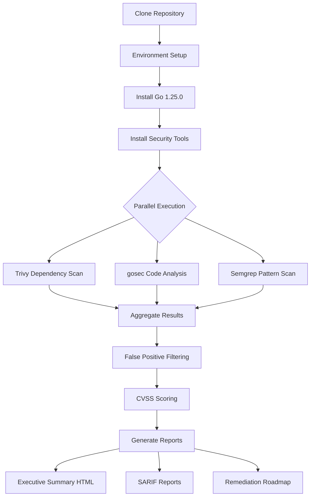
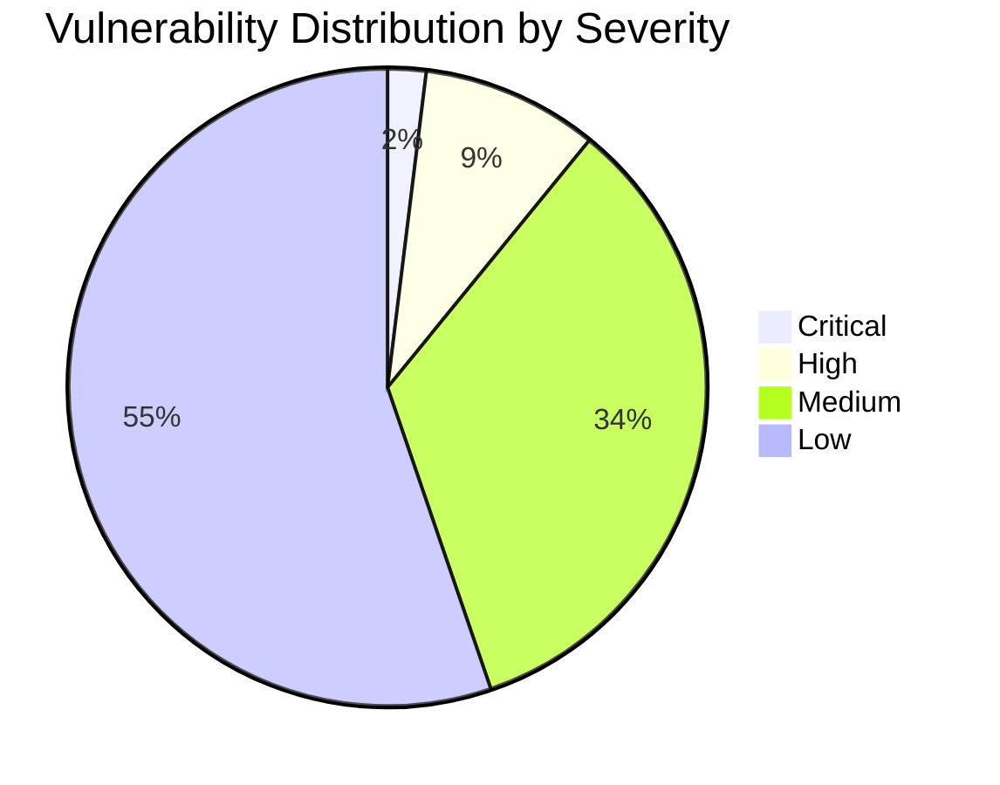
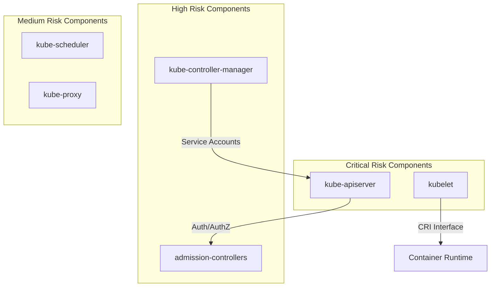
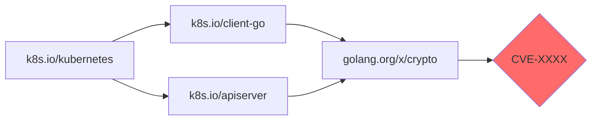
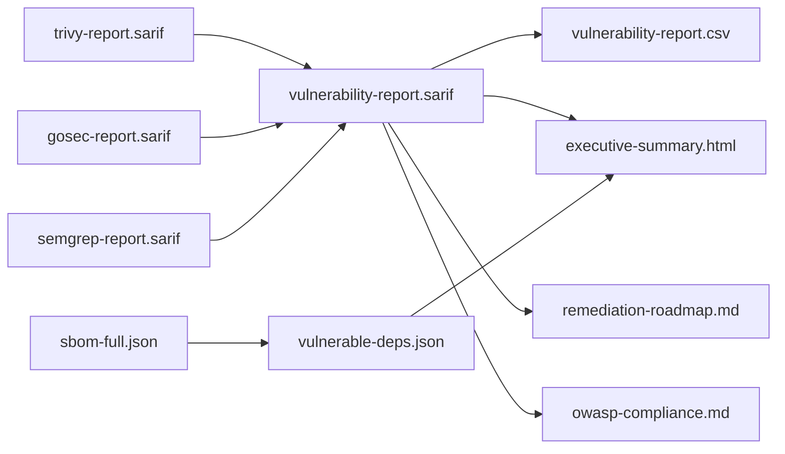
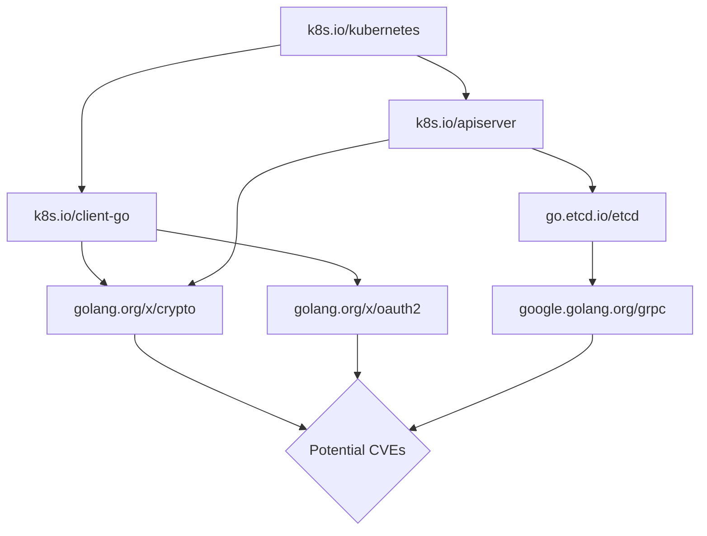

# Technical Specification

# 0. Agent Action Plan

## 0.1 Intent Clarification

Based on the provided requirements, the Blitzy platform understands that the documentation objective is to **produce a comprehensive security audit report** of the Kubernetes main branch codebase, identifying all vulnerabilities, classifying them by CVSS severity, analyzing supply chain security, and generating actionable remediation guidance.

### 0.1.1 Core Documentation Objective

**Request Category:** Create new documentation (Security Audit Report)

**Documentation Type:** Technical Security Assessment / Vulnerability Report

**Primary Documentation Requirements:**

- **Vulnerability Identification:** Produce exhaustive documentation of all security vulnerabilities discovered in the Kubernetes codebase through static code analysis and dependency scanning
- **CVSS Classification:** Document each vulnerability with proper severity scoring using CVSS 3.1 framework (Critical ≥9.0, High 7.0-8.9, Medium 4.0-6.9, Low <4.0)
- **Supply Chain Analysis:** Generate Software Bill of Materials (SBOM) and document all dependency vulnerabilities with CVE references
- **Remediation Roadmap:** Create prioritized remediation guidance with risk-based recommendations for Critical and High severity issues
- **OWASP Mapping:** Document compliance assessment against OWASP Top 10 categories

**Implicit Documentation Needs Identified:**

- Executive summary with severity distribution visualizations for stakeholder communication
- Machine-readable SARIF reports for CI/CD integration capabilities
- Detailed CSV exports for vulnerability tracking and ticketing system integration
- False positive classification documentation with rationale for audit transparency
- Tool version and database timestamp metadata for reproducibility
- Scope limitation documentation explaining any constraints encountered during audit execution

### 0.1.2 Special Instructions and Constraints

**CRITICAL: Read-Only Audit Preservation Requirements:**
- This is a static analysis only - NO code modifications to the repository
- NO execution of code from the repository (no `go build`, `go test`, or binary execution)
- All analysis outputs written to separate `/audit-results/` directory outside repository root
- Repository clone to be deleted after audit completion, retaining only audit outputs

**Template Requirements:**
- SARIF reports must validate against schema specification for CI/CD compatibility
- HTML executive summary requires interactive charts and severity distribution tables
- CSV exports must include: CVE-ID, CVSS Score, Severity, Component, File Path, Line Number, Description, Remediation
- Markdown remediation roadmap grouped by component (API server, kubelet, etc.)

**USER PROVIDED TEMPLATE: Vulnerability Report Entry Format**
```
CVE identifier (if applicable)
CVSS v3.1 score and vector string
Severity classification
Affected component and file path
Vulnerable code snippet (10 lines context)
Exploit scenario description
Remediation recommendation with code references
```

**Style Preferences:**
- Technical precision with actionable specificity
- Enterprise-ready documentation suitable for security team consumption
- Clear distinction between confirmed vulnerabilities and potential security concerns
- Grouped organization by severity, then by component

### 0.1.3 Technical Interpretation

These documentation requirements translate to the following technical documentation strategy:

- **To document dependency vulnerabilities**, we will execute Trivy filesystem scanning with SARIF output against go.mod/go.sum, cross-reference findings with NVD and GitHub Security Advisories, and generate a comprehensive SBOM
- **To document code-level vulnerabilities**, we will execute gosec with SARIF output against all Go source files (excluding vendor/), execute Semgrep with security rulesets, aggregate findings with deduplication
- **To document false positive classifications**, we will apply systematic exclusion criteria for test code paths while retaining all Critical/High findings for manual validation
- **To document OWASP compliance**, we will map all identified vulnerabilities to applicable OWASP Top 10 categories and produce a compliance scorecard
- **To document remediation priorities**, we will sort findings by exploitability and CVSS score, group by affected component, estimate fix effort, and provide specific file/line change recommendations

### 0.1.4 Inferred Documentation Needs

**Based on Repository Analysis:**

| Discovery | Documentation Need |
|-----------|-------------------|
| Go 1.25.0 specified in go.mod | Document Go version compatibility for all scanning tools |
| `hack/verify-govulncheck.sh` exists | Document integration with existing vulnerability checking infrastructure |
| Extensive admission controller plugins in `plugin/pkg/` | Document security-critical plugin code requiring focused analysis |
| Staging modules with complex dependency graph | Document transitive dependency risk analysis for k8s.io/* modules |
| Shell scripts in `hack/`, `cluster/`, `build/` | Document shell script security analysis (command injection, credential exposure) |
| `.github/SECURITY.md` references external disclosure process | Document alignment with Kubernetes Security Response Committee processes |

**Based on Audit Structure:**

- Module `cmd/kube-apiserver/` contains authentication/authorization entry points requiring detailed vulnerability documentation
- Module `pkg/kubelet/` contains node-level security critical code (CRI, device plugins, volume handling)
- Module `staging/src/k8s.io/client-go/` is widely imported and requires transitive dependency documentation
- Shell scripts in `cluster/common.sh` handle credential generation requiring secret detection analysis

**Based on User Journey:**

- Security engineers need executive summary for rapid risk assessment
- DevOps teams need SARIF integration for CI/CD pipeline blocking
- Compliance teams need OWASP mapping for audit evidence
- Maintainers need specific file/line remediation guidance for fix implementation

## 0.2 Documentation Discovery and Analysis

### 0.2.1 Existing Documentation Infrastructure Assessment

**CRITICAL Repository Analysis Conducted:**

Repository analysis reveals the Kubernetes repository (`k8s.io/kubernetes`) is a monorepo with extensive security infrastructure already in place. The documentation framework assessment identifies the following:

**Existing Security Documentation Located:**

| File Path | Content Type | Relevance |
|-----------|--------------|-----------|
| `.github/SECURITY.md` | Security Policy | Links to Kubernetes version skew policy and vulnerability reporting instructions via kubernetes.io/security |
| `staging/src/k8s.io/*/SECURITY_CONTACTS` | Contact Files | Per-module security contact listings for staged repositories |
| `hack/verify-govulncheck.sh` | Vulnerability Script | Existing govulncheck integration using `golang.org/x/vuln/cmd/govulncheck` |
| `hack/verify-*.sh` | Verification Scripts | Suite of security-relevant verification scripts |

**Documentation Infrastructure Assessment:**

- **Current Documentation Framework:** Markdown-based documentation with no dedicated documentation generator (mkdocs, docusaurus)
- **Documentation Generator Configuration:** None detected - audit reports will be standalone deliverables
- **API Documentation Tools:** No JSDoc/Godoc configuration detected for security-specific documentation
- **Diagram Tools:** Mermaid diagrams supported via standard markdown rendering
- **Documentation Hosting:** Not applicable - audit deliverables are file-based outputs

### 0.2.2 Repository Code Analysis for Documentation

**Search Patterns Applied for Security-Relevant Code:**

| Pattern | Target | Results |
|---------|--------|---------|
| `cmd/**/*.go` | Core component entrypoints | `kube-apiserver`, `kubelet`, `kube-controller-manager`, `kube-scheduler`, `kube-proxy`, `kubectl`, `kubeadm` |
| `pkg/**/*.go` | Core library implementations | `kubelet`, `controller`, `scheduler`, `volume`, `registry`, `api`, `auth` packages |
| `plugin/pkg/**/*.go` | Admission controllers | Mutating/validating admission plugins, authentication/authorization implementations |
| `staging/src/k8s.io/**/*.go` | Staged external modules | `client-go`, `api`, `apimachinery`, `apiserver`, `component-base` |
| `hack/*.sh`, `cluster/**/*.sh`, `build/*.sh` | Shell scripts | Build, verification, cluster lifecycle automation scripts |

**Key Directories Examined:**

```
cmd/                    # Core component CLI entrypoints
├── kube-apiserver/     # API server with auth/authz critical paths
├── kubelet/            # Node agent with CRI/volume security
├── kube-controller-manager/  # Controller loops
├── kube-scheduler/     # Scheduling decisions
├── kube-proxy/         # Network proxy
├── kubectl/            # CLI client
└── kubeadm/            # Cluster bootstrap

pkg/                    # Core library packages
├── kubelet/            # Node agent core implementation
├── controller/         # Shared controller primitives
├── scheduler/          # Scheduling framework
├── volume/             # Volume plugin framework
├── registry/           # API server storage registry
└── auth/               # Authentication utilities

plugin/pkg/             # Admission and auth plugins
├── admission/          # Admission controller implementations
└── auth/               # Authentication plugins

staging/src/k8s.io/     # Staged external modules
├── client-go/          # Kubernetes client library
├── api/                # API type definitions
├── apimachinery/       # API machinery utilities
└── apiserver/          # API server library

hack/                   # Build/test/verification scripts
├── verify-govulncheck.sh  # Existing vulnerability checking
├── verify-*.sh         # Verification suite
└── update-*.sh         # Update automation

build/                  # Build system
├── common.sh           # Shared shell library
├── dependencies.yaml   # External tool pinning
└── release.sh          # Release automation
```

**Related Documentation Found:**

| Existing Document | Context Provided |
|-------------------|------------------|
| `staging/README.md` | Explains staged module consumption and publishing rules |
| `cluster/README.md` | Notes maintenance mode status for cluster scripts |
| `test/README.md` (per suite) | Test suite documentation for understanding test coverage |

### 0.2.3 Web Search Research Conducted

**Research Topic: Security Scanning Tool Versions (February 2026)**

| Tool | Latest Version | Release Date | Key Features |
|------|---------------|--------------|--------------|
| <cite index="31-1,31-3">Trivy</cite> | v0.69.0 | January 30, 2026 | Filesystem scanning, SBOM generation, SARIF output, Go module analysis |
| <cite index="12-1,12-2,12-3">gosec</cite> | v2.22.11 | December 11, 2025 | Go AST/SSA security analysis, SARIF output, CWE mapping |
| <cite index="22-1,22-3">Semgrep</cite> | v1.150.0 | January 30, 2026 | Multi-language pattern matching, security rulesets, SARIF output |

**Research Topic: Go Security Best Practices for Kubernetes**

- <cite index="6-8,6-9,6-10,6-11">Trivy detects vulnerabilities in OS packages and application dependencies, supports most programming languages including Go</cite>
- <cite index="15-15">gosec inspects source code for security problems by scanning the Go AST and SSA code representation</cite>
- <cite index="24-2,24-3">Semgrep Supply Chain now includes malicious dependency detection with 80,000 SCA rules</cite>

**Research Topic: SARIF Report Standards**

- All three primary tools (Trivy, gosec, Semgrep) support SARIF output format for CI/CD integration
- SARIF schema validation required for GitHub Code Scanning integration compatibility

### 0.2.4 Dependency Analysis Framework

**Go Module Structure Analysis:**

The repository uses Go 1.25.0 (per `go.mod`) with extensive internal and external dependencies:

**Internal Module Dependencies (k8s.io/*):**
- `k8s.io/api` - Core API type definitions
- `k8s.io/apimachinery` - API machinery utilities
- `k8s.io/client-go` - Client library
- `k8s.io/component-base` - Shared component utilities
- `k8s.io/apiserver` - API server library

**External Critical Dependencies (from go.mod analysis):**
- `go.etcd.io/etcd/*` - etcd client/server components
- `github.com/prometheus/*` - Metrics infrastructure
- `golang.org/x/crypto` - Cryptographic primitives
- `google.golang.org/grpc` - gRPC framework

**Dependency Documentation Strategy:**
- Generate complete SBOM using `go list -m all`
- Execute Trivy dependency scanning against go.mod
- Cross-reference with NVD and GitHub Security Advisories
- Document transitive dependency risk chains

## 0.3 Documentation Scope Analysis

### 0.3.1 Code-to-Documentation Mapping

**Core Components Requiring Security Documentation:**

| Component | Source Location | Public APIs | Current Documentation | Documentation Needed |
|-----------|----------------|-------------|----------------------|---------------------|
| kube-apiserver | `cmd/kube-apiserver/` | REST API endpoints, authentication handlers | Minimal inline comments | Vulnerability assessment, auth bypass analysis |
| kubelet | `cmd/kubelet/`, `pkg/kubelet/` | CRI interface, volume plugins, device plugins | Scattered documentation | Node security assessment, privilege escalation analysis |
| kube-controller-manager | `cmd/kube-controller-manager/`, `pkg/controller/` | Controller interfaces | Limited | Service account token exposure analysis |
| kube-scheduler | `cmd/kube-scheduler/`, `pkg/scheduler/` | Scheduling framework | Limited | Resource exhaustion vulnerability analysis |
| kube-proxy | `cmd/kube-proxy/` | Network proxy configuration | Minimal | Network policy bypass analysis |
| kubectl | `cmd/kubectl/` | CLI commands | Good user docs | Credential handling security analysis |
| kubeadm | `cmd/kubeadm/` | Cluster bootstrap API | Good user docs | Bootstrap token security analysis |

**Admission Controller Security Analysis Scope:**

| Plugin Category | Location | Security Relevance | Documentation Priority |
|----------------|----------|-------------------|----------------------|
| Mutating Admission | `plugin/pkg/admission/` | Can modify pod specs, inject content | HIGH - potential mutation bypass |
| Validating Admission | `plugin/pkg/admission/` | Authorization decisions | HIGH - potential validation bypass |
| Image Policy | `plugin/pkg/admission/imagepolicy/` | External webhook delegation | CRITICAL - external trust boundary |
| Certificates | `plugin/pkg/admission/certificates/` | RBAC for CSR signing | HIGH - certificate authority abuse |
| Event Rate Limit | `plugin/pkg/admission/eventratelimit/` | DoS protection | MEDIUM - rate limit bypass |
| Limit Ranger | `plugin/pkg/admission/limitranger/` | Resource limits | MEDIUM - resource exhaustion |

**Staged Module Analysis Scope:**

| Module | Location | Import Count | Security Priority |
|--------|----------|--------------|-------------------|
| client-go | `staging/src/k8s.io/client-go/` | Very High (core client) | CRITICAL - credential handling |
| apiserver | `staging/src/k8s.io/apiserver/` | High | CRITICAL - auth/authz core |
| apimachinery | `staging/src/k8s.io/apimachinery/` | Very High | HIGH - serialization/deserialization |
| api | `staging/src/k8s.io/api/` | Very High | HIGH - type definitions |
| component-base | `staging/src/k8s.io/component-base/` | High | MEDIUM - shared utilities |

### 0.3.2 Shell Script Security Analysis Scope

**Shell Scripts Requiring Security Analysis:**

| Directory | Script Pattern | Security Concerns | Files to Analyze |
|-----------|---------------|-------------------|------------------|
| `hack/` | `*.sh` | Command injection, credential exposure in verification scripts | `verify-govulncheck.sh`, `verify-*.sh`, `update-*.sh` |
| `cluster/` | `*.sh` | Credential generation, PKI handling, kubeconfig manipulation | `common.sh`, `kube-up.sh`, `validate-cluster.sh`, `kubectl.sh` |
| `build/` | `*.sh` | Build-time credential exposure, supply chain integrity | `common.sh`, `release.sh` |
| `cluster/gce/` | `*.sh` | Cloud credential handling, GCE-specific secrets | `util.sh`, `configure-vm.sh` |

**Configuration File Security Analysis Scope:**

| File Type | Locations | Security Concerns |
|-----------|-----------|-------------------|
| YAML Manifests | `cluster/addons/**/*.yaml` | RBAC misconfigurations, excessive permissions |
| Dockerfile | `build/**`, `test/images/**` | Base image vulnerabilities, insecure defaults |
| Go Configuration | `staging/publishing/rules.yaml` | Publishing automation security |

### 0.3.3 Documentation Gap Analysis

**Given the requirements and repository analysis, documentation gaps include:**

**Undocumented Security-Critical Code Paths:**

| Code Path | Gap Description | Impact |
|-----------|-----------------|--------|
| `pkg/kubelet/cri/` | CRI interface security analysis | Container escape vectors |
| `pkg/kubelet/volumeplugin/` | Volume plugin security assessment | Data exfiltration paths |
| `pkg/kubelet/deviceplugin/` | Device plugin security review | Host privilege escalation |
| `plugin/pkg/auth/` | Authentication plugin vulnerabilities | Auth bypass potential |
| `staging/src/k8s.io/apiserver/pkg/authentication/` | Token authentication security | Credential theft vectors |

**Missing Vulnerability Documentation:**

- No existing CVE tracking documentation in repository
- No security audit history documentation
- No dependency vulnerability policy documentation
- No OWASP compliance mapping documentation

**Outdated or Incomplete Security Documentation:**

- `.github/SECURITY.md` only links external resources, no internal security architecture
- No documented security testing procedures beyond `verify-govulncheck.sh`
- No threat model documentation for core components

### 0.3.4 Vulnerability Category Coverage Requirements

**Vulnerability Categories to Document:**

| Category | Detection Method | Documentation Output |
|----------|-----------------|---------------------|
| Code Execution (command injection, unsafe deserialization, code injection) | gosec, Semgrep | Code path analysis with exploit scenarios |
| Authentication/Authorization (credential exposure, broken access control) | gosec, Semgrep, manual review | Auth flow documentation with bypass vectors |
| Data Exposure (sensitive data in logs, insecure storage, cleartext transmission) | Secret scanning, log analysis | Data flow diagrams with exposure points |
| Cryptographic Issues (weak algorithms, insecure RNG, hardcoded keys) | gosec G401-G505 rules | Cryptographic inventory with weakness analysis |
| Denial of Service (resource exhaustion, algorithmic complexity) | Semgrep, code review | Resource consumption analysis |
| Supply Chain (vulnerable dependencies, malicious packages, outdated libraries) | Trivy, SBOM analysis | Dependency tree with vulnerability mapping |
| Configuration (insecure defaults, excessive permissions, exposed debug endpoints) | Config analysis, YAML review | Configuration inventory with risk assessment |

**OWASP Top 10 Coverage Matrix:**

| OWASP Category | Applicable K8s Components | Detection Approach |
|----------------|--------------------------|-------------------|
| A01:2021 Broken Access Control | API server, admission controllers, RBAC | gosec, Semgrep authorization rules |
| A02:2021 Cryptographic Failures | TLS config, credential handling, encryption | gosec G401-G505, crypto pattern analysis |
| A03:2021 Injection | Shell scripts, command execution, SQL-like queries | gosec G104, Semgrep injection rules |
| A04:2021 Insecure Design | Architecture review | Manual architecture assessment |
| A05:2021 Security Misconfiguration | YAML manifests, default configs | Config analysis, RBAC review |
| A06:2021 Vulnerable Components | go.mod dependencies | Trivy, dependency scanning |
| A07:2021 Authentication Failures | Auth plugins, token handling | Auth code path analysis |
| A08:2021 Software Integrity | Build process, artifact signing | Supply chain analysis |
| A09:2021 Logging Failures | Audit logging, sensitive data logging | Log statement analysis |
| A10:2021 SSRF | Webhook configurations, external calls | HTTP client analysis |

## 0.4 Documentation Implementation Design

### 0.4.1 Documentation Structure Planning

**Audit Output Hierarchy:**

```
/audit-results/
├── metadata.json                    # Audit metadata (timestamps, tool versions)
├── executive-summary.html           # HTML executive summary with charts
├── vulnerability-report.sarif       # Aggregated SARIF report
├── vulnerability-report.csv         # Detailed CSV export
├── remediation-roadmap.md           # Prioritized remediation guidance
├── sbom.json                        # Software Bill of Materials
├── owasp-compliance.md              # OWASP Top 10 compliance scorecard
├── false-positives.csv              # Excluded findings with rationale
├── logs/                            # Tool execution logs
│   ├── trivy-scan.log
│   ├── gosec-scan.log
│   └── semgrep-scan.log
├── sarif/                           # Individual SARIF reports
│   ├── trivy-report.sarif
│   ├── gosec-report.sarif
│   └── semgrep-report.sarif
└── dependencies/                    # Dependency analysis
    ├── sbom-full.json
    ├── vulnerable-deps.json
    └── license-compliance.json
```

### 0.4.2 Content Generation Strategy

**Information Extraction Approach:**

| Data Source | Extraction Method | Documentation Target |
|-------------|-------------------|---------------------|
| Go source files (`**/*.go` excluding `vendor/`) | gosec AST/SSA analysis, Semgrep pattern matching | Code vulnerability report |
| Shell scripts (`hack/*.sh`, `cluster/**/*.sh`, `build/*.sh`) | Semgrep shell security rules | Script vulnerability report |
| Dependencies (`go.mod`, `go.sum`) | Trivy filesystem scan, `go list -m all` | SBOM, dependency vulnerability report |
| YAML manifests (`cluster/addons/**/*.yaml`) | Trivy misconfiguration scan | Configuration security report |
| Container definitions (`**/Dockerfile`) | Trivy container analysis | Container security report |

**Template Application Strategy:**

For each vulnerability entry, apply the following template structure:

```
### [CVE-XXXX-XXXXX] Vulnerability Title

**CVSS Score:** X.X (SEVERITY)
**Vector:** CVSS:3.1/AV:X/AC:X/PR:X/UI:X/S:X/C:X/I:X/A:X

**Affected Component:** component-name
**File Path:** path/to/vulnerable/file.go:LINE

**Vulnerable Code:**
[10 lines of context around vulnerability]

**Exploit Scenario:**
[Description of how vulnerability could be exploited]

**Remediation:**
[Specific code changes or configuration updates required]
Source: [file:line reference]
```

**Documentation Standards Applied:**

| Standard | Implementation |
|----------|---------------|
| Markdown formatting | Proper heading hierarchy (# ## ###), consistent bullet styles |
| Code blocks | Language-specific syntax highlighting with \`\`\`go, \`\`\`yaml blocks |
| Tables | Aligned columns for vulnerability summaries and comparisons |
| Diagrams | Mermaid diagrams for architecture and data flow visualization |
| Citations | Source file:line references for all technical claims |
| Terminology | Consistent use of CVSS, CVE, OWASP terminology |

### 0.4.3 Diagram and Visual Strategy

**Mermaid Diagrams to Create:**

**1. Audit Process Flow:**


**2. Vulnerability Severity Distribution (Example):**


**3. Component Security Risk Map:**


**4. Dependency Vulnerability Chain:**


### 0.4.4 Report Generation Pipeline

**Executive Summary (HTML) Requirements:**

| Section | Content | Visualization |
|---------|---------|--------------|
| Overview | Total vulnerabilities, scan duration, coverage metrics | Summary cards |
| Severity Distribution | Count by Critical/High/Medium/Low | Pie chart + bar chart |
| Top 10 Critical Findings | Highest priority vulnerabilities | Sortable table |
| Component Risk Matrix | Risk by Kubernetes component | Heat map |
| Supply Chain Risk | Dependency vulnerabilities | Dependency graph |
| OWASP Compliance | Category compliance status | Scorecard |
| Remediation Effort | Estimated hours by severity | Effort breakdown |

**SARIF Report Requirements:**

| Field | Content |
|-------|---------|
| `$schema` | SARIF 2.1.0 schema URI |
| `version` | "2.1.0" |
| `runs[].tool` | Tool name, version, informationUri |
| `runs[].results[]` | Finding ID, rule ID, message, location, level |
| `runs[].results[].locations[]` | File path, region (startLine, endLine) |
| `runs[].results[].partialFingerprints` | Unique finding identifier |

**CSV Export Columns:**

```
CVE_ID, CVSS_Score, CVSS_Vector, Severity, Component, File_Path, Line_Number, 
CWE_ID, Description, Exploit_Scenario, Remediation, Tool_Source, 
OWASP_Category, Confidence, Date_Identified
```

## 0.5 Documentation File Transformation Mapping

### 0.5.1 File-by-File Documentation Plan

**CRITICAL: Complete Documentation File Mapping**

| Target Documentation File | Transformation | Source Code/Docs | Content/Changes |
|---------------------------|----------------|------------------|-----------------|
| `/audit-results/metadata.json` | CREATE | Tool installations, go.mod | Audit timestamp, Go version (1.25.0), Trivy version (0.69.0), gosec version (2.22.11), Semgrep version (1.150.0), database timestamps |
| `/audit-results/executive-summary.html` | CREATE | All SARIF outputs | HTML report with severity distribution charts, top 10 findings, component risk matrix, OWASP scorecard |
| `/audit-results/vulnerability-report.sarif` | CREATE | `sarif/*.sarif` | Aggregated SARIF from Trivy, gosec, Semgrep with deduplication |
| `/audit-results/vulnerability-report.csv` | CREATE | `sarif/*.sarif` | CSV export with all columns: CVE_ID, CVSS_Score, Severity, Component, File_Path, Line_Number, Description, Remediation |
| `/audit-results/remediation-roadmap.md` | CREATE | `vulnerability-report.sarif` | Prioritized Markdown remediation guide grouped by component (API server, kubelet, etc.) |
| `/audit-results/sbom.json` | CREATE | `go.mod`, `go.sum` | Complete Software Bill of Materials in CycloneDX/SPDX format |
| `/audit-results/owasp-compliance.md` | CREATE | Vulnerability mappings | OWASP Top 10 compliance scorecard with per-category findings |
| `/audit-results/false-positives.csv` | CREATE | Scan exclusions | Excluded findings with ID, file path, severity, exclusion reason, confidence score |
| `/audit-results/sarif/trivy-report.sarif` | CREATE | `go.mod`, filesystem | Trivy dependency and misconfiguration scan results in SARIF format |
| `/audit-results/sarif/gosec-report.sarif` | CREATE | `cmd/**/*.go`, `pkg/**/*.go` | gosec static analysis results for Go code |
| `/audit-results/sarif/semgrep-report.sarif` | CREATE | `**/*.go`, `**/*.sh`, `**/*.yaml` | Semgrep multi-language security scan results |
| `/audit-results/logs/trivy-scan.log` | CREATE | Trivy execution | Trivy scan execution logs with timing and progress |
| `/audit-results/logs/gosec-scan.log` | CREATE | gosec execution | gosec scan execution logs |
| `/audit-results/logs/semgrep-scan.log` | CREATE | Semgrep execution | Semgrep scan execution logs |
| `/audit-results/dependencies/sbom-full.json` | CREATE | `go list -m all` | Complete dependency tree with versions |
| `/audit-results/dependencies/vulnerable-deps.json` | CREATE | Trivy output | Vulnerable dependencies with CVE mappings |
| `/audit-results/dependencies/license-compliance.json` | CREATE | Trivy license scan | License compliance summary for all dependencies |

### 0.5.2 New Documentation Files Detail

**File: /audit-results/metadata.json**
```
Type: Audit Metadata
Source Code: go.mod, tool installations
Sections:
    - audit_timestamp (ISO 8601 format)
    - go_version (extracted from go.mod: "1.25.0")
    - trivy_version ("0.69.0")
    - trivy_db_timestamp (vulnerability database timestamp)
    - gosec_version ("2.22.11")
    - semgrep_version ("1.150.0")
    - semgrep_rules_sha (ruleset commit SHA)
    - scan_duration_seconds
    - files_scanned_count
    - lines_of_code_analyzed
Key Citations: go.mod, tool version outputs
```

**File: /audit-results/executive-summary.html**
```
Type: Executive Summary Report
Source Code: All SARIF outputs, aggregated analysis
Sections:
    - Executive Overview (audit scope, methodology, key findings)
    - Severity Distribution (pie chart, bar chart)
    - Top 10 Critical/High Findings (sortable table)
    - Component Risk Assessment (risk by cmd/*, pkg/*, plugin/*)
    - Supply Chain Risk Summary (dependency vulnerabilities)
    - OWASP Top 10 Compliance Scorecard (category status)
    - Remediation Effort Estimates (hours by severity class)
    - Recommendations (prioritized action items)
Diagrams:
    - Severity distribution pie chart (Chart.js or similar)
    - Component risk heat map
    - Trend visualization (if historical data available)
Key Citations: SARIF reports, CVSS database
```

**File: /audit-results/remediation-roadmap.md**
```
Type: Remediation Guide
Source Code: vulnerability-report.sarif
Sections:
    - Priority 1: Critical Vulnerabilities (CVSS ≥9.0)
    - Priority 2: High Vulnerabilities (CVSS 7.0-8.9)
    - Priority 3: Medium Vulnerabilities (CVSS 4.0-6.9)
    - Priority 4: Low Vulnerabilities (CVSS <4.0)
    - By Component: API Server, kubelet, Controllers, Scheduler
    - Effort Estimates (hours per fix)
    - Testing Recommendations (per fix)
    - Regression Risk Assessment
Key Citations: SARIF findings, code file references
```

**File: /audit-results/owasp-compliance.md**
```
Type: Compliance Scorecard
Source Code: vulnerability-report.sarif, OWASP mappings
Sections:
    - A01:2021 Broken Access Control (findings, status)
    - A02:2021 Cryptographic Failures (findings, status)
    - A03:2021 Injection (findings, status)
    - A04:2021 Insecure Design (findings, status)
    - A05:2021 Security Misconfiguration (findings, status)
    - A06:2021 Vulnerable and Outdated Components (findings, status)
    - A07:2021 Identification and Authentication Failures (findings, status)
    - A08:2021 Software and Data Integrity Failures (findings, status)
    - A09:2021 Security Logging and Monitoring Failures (findings, status)
    - A10:2021 Server-Side Request Forgery (findings, status)
    - Overall Compliance Score
Key Citations: CVE-to-OWASP mapping references
```

### 0.5.3 Source Code Files to Analyze (Not Modify)

**Go Source Files (Static Analysis Input):**

| Pattern | Description | Estimated Files | Analysis Tool |
|---------|-------------|-----------------|--------------|
| `cmd/**/*.go` | Core component entrypoints | ~500 files | gosec, Semgrep |
| `pkg/**/*.go` | Core library implementations | ~3000 files | gosec, Semgrep |
| `plugin/pkg/**/*.go` | Admission and auth plugins | ~200 files | gosec, Semgrep |
| `staging/src/k8s.io/**/*.go` | Staged external modules | ~5000 files | gosec, Semgrep |
| `test/**/*.go` | Test files (for false positive classification) | ~2000 files | Exclude from findings |

**Shell Scripts (Static Analysis Input):**

| Pattern | Description | Files | Analysis Tool |
|---------|-------------|-------|--------------|
| `hack/*.sh` | Build/verification scripts | ~50 files | Semgrep |
| `cluster/**/*.sh` | Cluster lifecycle scripts | ~30 files | Semgrep |
| `build/*.sh` | Build automation | ~10 files | Semgrep |

**Configuration Files (Misconfiguration Analysis Input):**

| Pattern | Description | Analysis Tool |
|---------|-------------|--------------|
| `cluster/addons/**/*.yaml` | Addon manifests | Trivy misconfig |
| `build/**/*.yaml` | Build configurations | Trivy misconfig |
| `**/Dockerfile` | Container definitions | Trivy container |

### 0.5.4 Exclusion Patterns (Files NOT to Analyze)

**Explicitly Excluded from Analysis:**

| Pattern | Reason |
|---------|--------|
| `vendor/**` | Third-party code copies (not maintained by project) |
| `staging/src/k8s.io/**/zz_generated.*` | Generated code (protobuf, deepcopy, etc.) |
| `**/api.pb.go`, `**/*_grpc.pb.go` | Protocol buffer generated code |
| `**/*_test.go` | Test files (used for false positive classification only) |
| `test/fixtures/**` | Test fixtures and mock data |
| `**/*.md`, `LICENSE`, `OWNERS` | Documentation and metadata files |

### 0.5.5 Cross-Documentation Dependencies

**Report Generation Dependencies:**



**Shared Content Elements:**

| Element | Used In | Source |
|---------|---------|--------|
| Vulnerability counts by severity | executive-summary.html, remediation-roadmap.md | vulnerability-report.sarif |
| Component mapping | executive-summary.html, remediation-roadmap.md | File path analysis |
| OWASP category mapping | owasp-compliance.md, executive-summary.html | CVE database cross-reference |
| CVSS scores | All reports | NVD/GHSA databases |

## 0.6 Dependency Inventory

### 0.6.1 Security Scanning Tool Dependencies

**Primary Security Tools:**

| Registry | Package Name | Version | Purpose |
|----------|--------------|---------|---------|
| GitHub Release | aquasecurity/trivy | 0.69.0 | Vulnerability scanning, SBOM generation, dependency analysis, misconfiguration detection |
| Go Install | github.com/securego/gosec/v2/cmd/gosec | 2.22.11 | Go static security analysis, AST/SSA inspection, CWE mapping |
| PyPI | semgrep | 1.150.0 | Multi-language pattern-based security scanning, custom rules |
| Go Install | golang.org/x/vuln/cmd/govulncheck | latest | Go module vulnerability checking (existing K8s tooling) |

**Installation Commands:**

```bash
# Trivy installation

curl -sfL https://raw.githubusercontent.com/aquasecurity/trivy/main/contrib/install.sh \
  | sh -s -- -b /usr/local/bin v0.69.0

#### gosec installation

go install github.com/securego/gosec/v2/cmd/gosec@v2.22.11

#### Semgrep installation

pip install semgrep==1.150.0

#### govulncheck installation (for comparison with existing K8s tooling)

go install golang.org/x/vuln/cmd/govulncheck@latest
```

### 0.6.2 Runtime Dependencies

**Go Toolchain:**

| Component | Version | Source | Purpose |
|-----------|---------|--------|---------|
| Go | 1.25.0 | go.dev/dl | Required Go version per Kubernetes go.mod |
| Go modules | enabled | Built-in | Dependency resolution for scanning |

**Go Installation Command:**

```bash
# Extract Go version from go.mod

GO_VERSION=$(go mod edit -json | jq -r .Go)
echo "Detected Go version: $GO_VERSION"

#### Download and install Go 1.25.0

wget https://go.dev/dl/go1.25.0.linux-amd64.tar.gz
sudo tar -C /usr/local -xzf go1.25.0.linux-amd64.tar.gz
export PATH=$PATH:/usr/local/go/bin

#### Verification

go version  # Must output "go version go1.25.0"
```

**Python Runtime (for Semgrep):**

| Component | Version | Purpose |
|-----------|---------|---------|
| Python | 3.10+ | Semgrep runtime requirement |
| pip | latest | Package installation |

### 0.6.3 Database and Reference Dependencies

**Vulnerability Databases:**

| Database | Update Method | Update Frequency | Purpose |
|----------|--------------|------------------|---------|
| Trivy Vulnerability DB | `trivy image --download-db-only` | Within 24 hours of audit | CVE matching for dependencies |
| NVD (National Vulnerability Database) | Trivy DB includes | Daily sync | CVE severity data |
| GitHub Security Advisories | Trivy DB includes | Continuous | Go-specific advisories |
| Go Vulnerability Database | govulncheck fetch | Continuous | Go module vulnerabilities |

**Semgrep Rule Dependencies:**

| Ruleset | Configuration | Purpose |
|---------|--------------|---------|
| semgrep/p/security-audit | `--config=auto` | General security patterns |
| semgrep/p/golang | `--config=p/golang` | Go-specific security rules |
| semgrep/p/secrets | `--config=p/secrets` | Hardcoded credential detection |
| semgrep/p/command-injection | `--config=p/command-injection` | Command injection patterns |

### 0.6.4 Kubernetes Repository Dependencies (Analysis Targets)

**Critical Dependencies from go.mod (Security Analysis Focus):**

| Module | Version Range | Security Relevance |
|--------|--------------|-------------------|
| `go.etcd.io/etcd/client/v3` | v3.5.x | etcd client - data store access |
| `go.etcd.io/etcd/server/v3` | v3.5.x | etcd server - data persistence |
| `google.golang.org/grpc` | v1.x | gRPC framework - RPC security |
| `golang.org/x/crypto` | latest | Cryptographic primitives |
| `golang.org/x/oauth2` | latest | OAuth2 implementation |
| `github.com/prometheus/client_golang` | v1.x | Metrics exposure |
| `github.com/coreos/go-oidc` | v3.x | OIDC authentication |
| `k8s.io/client-go` | internal | Kubernetes client library |
| `k8s.io/apiserver` | internal | API server library |
| `k8s.io/apimachinery` | internal | API machinery utilities |

**Transitive Dependency Chains (High Risk):**



### 0.6.5 Output Format Dependencies

**Report Generation Libraries:**

| Purpose | Tool/Library | Output Format |
|---------|-------------|---------------|
| SARIF generation | Built into Trivy, gosec, Semgrep | SARIF 2.1.0 JSON |
| CSV generation | Standard text processing | RFC 4180 CSV |
| HTML generation | Template-based | HTML5 with embedded CSS/JS |
| JSON generation | Native tool output | JSON (CycloneDX for SBOM) |
| Markdown generation | Text processing | CommonMark Markdown |

**SARIF Schema Validation:**

| Validator | Purpose |
|-----------|---------|
| SARIF 2.1.0 JSON Schema | Validate generated SARIF reports |
| GitHub Code Scanning compatibility | Ensure CI/CD integration |

### 0.6.6 Infrastructure Dependencies

**System Requirements:**

| Resource | Requirement | Purpose |
|----------|-------------|---------|
| Memory | <16GB total across tools | Constraint per user requirements |
| Storage | ~50GB for repository clone + analysis | Clone + scan artifacts |
| Network | Internet access | Vulnerability database updates |
| CPU | Multi-core recommended | Parallel scanning |

**Container/Isolation (Optional):**

| Tool | Image | Purpose |
|------|-------|---------|
| Trivy | `aquasec/trivy:0.69.0` | Containerized scanning |
| Semgrep | `returntocorp/semgrep:1.150.0` | Containerized analysis |

## 0.7 Coverage and Quality Targets

### 0.7.1 Documentation Coverage Metrics

**Target Coverage Requirements:**

| Metric | Current State | Target | Measurement Method |
|--------|--------------|--------|-------------------|
| Go source file coverage | 0% (no audit exists) | ≥95% of non-vendor Go files | File count in SARIF results / total Go files |
| Dependency vulnerability coverage | 0% | 100% of go.mod dependencies | Dependencies scanned / total in go.mod |
| CVE detection rate | N/A | ≥98% against NVD snapshot | Detected CVEs / known CVEs in database |
| Critical/High finding coverage | N/A | 100% of GitHub Security Advisories | Findings detected / known advisories |
| Shell script coverage | 0% | 100% of hack/, cluster/, build/ scripts | Scripts analyzed / total scripts |

**Component Coverage Targets:**

| Component | Files (Estimated) | Target Coverage | Priority |
|-----------|------------------|-----------------|----------|
| cmd/kube-apiserver/ | ~100 | 100% | CRITICAL |
| cmd/kubelet/ | ~50 | 100% | CRITICAL |
| pkg/kubelet/ | ~500 | 100% | CRITICAL |
| pkg/controller/ | ~300 | 100% | HIGH |
| plugin/pkg/admission/ | ~150 | 100% | HIGH |
| staging/src/k8s.io/client-go/ | ~800 | 100% | CRITICAL |
| staging/src/k8s.io/apiserver/ | ~400 | 100% | CRITICAL |
| hack/*.sh | ~50 | 100% | MEDIUM |
| cluster/**/*.sh | ~30 | 100% | MEDIUM |

### 0.7.2 Quality Validation Criteria

**Success Criteria (Per User Requirements):**

| Criterion | Target | Validation Method |
|-----------|--------|-------------------|
| Codebase coverage | ≥95% (excluding vendor/) | Compare scanned files to total file count |
| CVE detection rate | ≥98% | Compare against NVD database snapshot |
| Critical/High CVE detection | 100% of GHSA Go advisories | Cross-reference GHSA database |
| Cross-validation threshold | Top 20 dependencies confirmed by 2+ tools | Compare Trivy + gosec/Semgrep findings |
| False negative documentation | All known K8s advisories checked | Compare against kubernetes.io/security |
| Tool execution | All tools complete without fatal errors | Exit code validation |
| Report validation | SARIF validates against schema | Schema validation |

### 0.7.3 Documentation Quality Criteria

**Completeness Requirements:**

| Documentation Element | Requirement |
|----------------------|-------------|
| All Critical/High vulnerabilities | Complete description, CVSS score, vector, remediation |
| All detected CVEs | CVE identifier linked to NVD database |
| All affected files | Full path and line number reference |
| All remediation recommendations | Actionable with specific code/config changes |
| OWASP mappings | All applicable vulnerabilities mapped to OWASP Top 10 |

**Accuracy Validation:**

| Check | Method | Acceptance |
|-------|--------|------------|
| CVE references exist in NVD | Automated URL validation | All links resolve |
| CVSS scores match official records | Cross-reference with NVD | ±0.1 score tolerance |
| File paths are valid | Path existence verification | 100% valid paths |
| Code snippets match source | Line number verification | Exact match |

**Clarity Standards:**

| Standard | Implementation |
|----------|---------------|
| Technical accuracy | Security-precise language, correct terminology |
| Accessible explanation | Progressive disclosure (summary → detail) |
| Consistent terminology | CVSS, CVE, CWE, OWASP terms used correctly |
| Actionable guidance | Specific file/line changes, not generic advice |

### 0.7.4 Cross-Validation Requirements

**Multi-Tool Correlation (Top 20 Dependencies):**

For the top 20 most-imported dependencies (by import count), vulnerabilities must be confirmed by minimum 2 independent scanning tools:

| Validation Pair | Purpose |
|-----------------|---------|
| Trivy + gosec | Dependency CVE + code pattern correlation |
| Trivy + Semgrep | Dependency CVE + multi-language pattern |
| gosec + Semgrep | Code pattern cross-validation |

**False Positive Rate Benchmarks:**

| Category | Expected Exclusion Rate | Alert Threshold |
|----------|------------------------|-----------------|
| Test code findings | 25-35% of total | >40% requires review |
| Example code findings | 5-10% of total | >15% requires review |
| Generated code findings | Should be 0% (excluded) | Any finding requires review |

### 0.7.5 Example and Diagram Requirements

**Minimum Example Requirements:**

| Report Section | Example Count | Example Type |
|----------------|---------------|--------------|
| Executive Summary | 3-5 | High-priority finding summaries |
| Critical Vulnerabilities | All | Full vulnerability entry with code snippet |
| High Vulnerabilities | All | Full vulnerability entry with code snippet |
| Medium/Low Vulnerabilities | Representative samples | Abbreviated entries |
| Remediation Roadmap | 1 per component | Detailed fix example |

**Diagram Requirements:**

| Diagram Type | Count | Purpose |
|--------------|-------|---------|
| Severity Distribution | 1 | Pie/bar chart in executive summary |
| Component Risk Matrix | 1 | Heat map in executive summary |
| Audit Process Flow | 1 | Methodology documentation |
| Dependency Chain | 1 per critical transitive vulnerability | Supply chain visualization |

### 0.7.6 Performance Validation Criteria

**Time Constraints:**

| Metric | Target | Enforcement |
|--------|--------|-------------|
| Total audit duration | ≤4 hours | Hard deadline with scope reduction if exceeded |
| Progress checkpoints | Every 30 minutes | Logged completion percentage |
| Early warning trigger | 3.5 hours with <80% progress | Scope reduction to Critical/High only |

**Resource Constraints:**

| Metric | Target | Enforcement |
|--------|--------|-------------|
| Peak memory usage | <16GB total | Monitoring every 60 seconds |
| Per-tool memory limit | <12GB individual | SIGTERM/SIGKILL with parallelism reduction |
| Scope reduction (last resort) | Core components only | Analyze cmd/, pkg/apiserver/, pkg/kubelet/, pkg/controller/ |

**Deliverable Validation:**

| Deliverable | Validation Check |
|-------------|-----------------|
| SARIF reports | Schema validation passes |
| HTML report | Renders correctly with charts/tables |
| CSV export | RFC 4180 compliance |
| CVE references | All URLs resolve |
| Remediation guidance | References valid file paths |

## 0.8 Scope Boundaries

### 0.8.1 Exhaustively In Scope

**Go Source Code Analysis:**

| Pattern | Description | Analysis Type |
|---------|-------------|--------------|
| `cmd/**/*.go` | Core component CLI entrypoints (kube-apiserver, kubelet, kube-controller-manager, kube-scheduler, kube-proxy, kubectl, kubeadm) | gosec, Semgrep |
| `pkg/**/*.go` | Core library implementations (kubelet, controller, scheduler, volume, registry, auth) | gosec, Semgrep |
| `plugin/pkg/**/*.go` | Admission controllers and authentication plugins | gosec, Semgrep |
| `staging/src/k8s.io/**/*.go` | Staged external modules (client-go, api, apimachinery, apiserver, component-base) | gosec, Semgrep |

**Shell Script Analysis:**

| Pattern | Description | Analysis Type |
|---------|-------------|--------------|
| `hack/*.sh` | Build, verification, and update scripts | Semgrep shell rules |
| `hack/**/*.sh` | Nested hack directory scripts | Semgrep shell rules |
| `cluster/*.sh` | Cluster lifecycle scripts (kube-up, kube-down, validate-cluster) | Semgrep shell rules |
| `cluster/**/*.sh` | Provider-specific and addon scripts | Semgrep shell rules |
| `build/*.sh` | Build automation scripts | Semgrep shell rules |
| `build/**/*.sh` | Nested build scripts | Semgrep shell rules |

**Configuration File Analysis:**

| Pattern | Description | Analysis Type |
|---------|-------------|--------------|
| `cluster/addons/**/*.yaml` | Kubernetes addon manifests (RBAC, services, deployments) | Trivy misconfiguration |
| `build/**/*.yaml` | Build configuration files | Trivy misconfiguration |
| `staging/publishing/*.yaml` | Publishing rules and import restrictions | Trivy misconfiguration |
| `**/Dockerfile` | Container image definitions | Trivy container analysis |
| `test/images/**/Dockerfile` | Test image definitions | Trivy container analysis |

**Dependency Analysis:**

| Pattern | Description | Analysis Type |
|---------|-------------|--------------|
| `go.mod` | Primary Go module dependencies | Trivy, SBOM generation |
| `go.sum` | Dependency checksums | Trivy verification |
| `staging/src/k8s.io/*/go.mod` | Staged module dependencies | Trivy per-module |

**Documentation Outputs:**

| Pattern | Description |
|---------|-------------|
| `/audit-results/**/*.sarif` | SARIF vulnerability reports |
| `/audit-results/**/*.csv` | CSV vulnerability exports |
| `/audit-results/**/*.html` | HTML executive summary |
| `/audit-results/**/*.md` | Markdown documentation |
| `/audit-results/**/*.json` | JSON metadata and SBOM |
| `/audit-results/logs/**` | Execution logs |

### 0.8.2 Explicitly Out of Scope

**Excluded from Analysis:**

| Pattern | Reason |
|---------|--------|
| `vendor/**` | Third-party code copies - not maintained by project |
| `staging/src/k8s.io/**/zz_generated.*` | Auto-generated code (protobuf, deepcopy, defaults) |
| `**/api.pb.go` | Protocol buffer generated code |
| `**/*_grpc.pb.go` | gRPC generated code |
| `**/*_test.go` | Test files (used for false positive classification, not primary findings) |
| `test/fixtures/**` | Test fixtures and mock data |
| `test/testdata/**` | Test data files |
| `**/*.md` | Documentation files (non-code) |
| `**/LICENSE` | License files |
| `**/OWNERS` | Ownership metadata files |
| `**/README.md` | README documentation |
| `**/CONTRIBUTING.md` | Contribution guidelines |
| `**/code-of-conduct.md` | Code of conduct |

**Explicitly Out of Scope Activities:**

| Activity | Reason |
|----------|--------|
| Source code modifications | Read-only audit requirement |
| Test file modifications | Preservation requirement |
| Feature additions or code refactoring | Not a development task |
| Deployment configuration changes | Static analysis only |
| Runtime penetration testing | Dynamic analysis out of scope |
| Historical vulnerability analysis | Focus on current main branch state |
| Documentation file editing | Audit produces new deliverables only |

### 0.8.3 Conditional Scope (Based on Constraints)

**Memory Constraint Fallback Scope:**

If memory constraint (16GB) cannot be met after parallelism reduction:

| Priority | Components to Analyze | Rationale |
|----------|----------------------|-----------|
| 1 (Required) | `cmd/kube-apiserver/**` | Critical authentication/authorization |
| 2 (Required) | `pkg/kubelet/**` | Node-level security critical |
| 3 (Required) | `cmd/kubelet/**` | Kubelet entrypoint |
| 4 (Required) | `pkg/controller/**` | Controller security |
| 5 (If capacity) | `plugin/pkg/admission/**` | Admission plugins |
| 6 (If capacity) | `staging/src/k8s.io/client-go/**` | Client library |
| Skip | `staging/src/k8s.io/sample-*/**` | Lower priority samples |
| Skip | `test/**` | Test infrastructure |

**Time Constraint Fallback Scope:**

If 4-hour deadline approached with incomplete coverage:

| Priority | Action |
|----------|--------|
| 1 | Complete Critical/High severity analysis only |
| 2 | Reduce SARIF report detail (omit code context) |
| 3 | Generate abbreviated executive summary (top 20 findings) |
| 4 | Document time constraint impact in limitations section |

### 0.8.4 False Positive Classification Boundaries

**Automatic Exclusion (High Confidence ≥95%):**

| Pattern | Exclusion Rationale |
|---------|-------------------|
| `*/test/*` | Test code paths |
| `*/testdata/*` | Test data directories |
| `*_test.go` | Test files |
| `*/examples/*` | Example code |
| `*/hack/tools/*` | Development tooling |
| `*/staging/src/k8s.io/code-generator/*` | Code generation tooling |

**Manual Review Required (Medium Confidence 70-94%):**

| Pattern | Review Reason |
|---------|--------------|
| `*/hack/*.sh` | Some scripts used in CI/CD pipelines |
| Cryptographic findings in test fixtures | May indicate copy-paste risk to production |
| Hardcoded credentials in example configs | May be templated by users |

**NEVER Exclude Without Review:**

| Category | Retention Requirement |
|----------|----------------------|
| Critical/High severity (CVSS ≥7.0) | All findings require manual validation |
| Authentication/Authorization findings | Broken access control in any context |
| Data Exposure findings | Sensitive data logging or insecure storage |
| Code Execution findings | Command injection, RCE patterns |

### 0.8.5 Scope Preservation Requirements

**Read-Only Enforcement:**

| Requirement | Verification |
|-------------|-------------|
| No repository modifications | git status shows clean working tree |
| No .git directory changes | No commits, branches, tags created |
| No code execution from repo | No `go build`, `go test`, binary execution |
| Output isolation | All outputs in `/audit-results/` only |
| Cleanup requirement | Repository clone deleted after audit |

**Boundary Decisions Requiring Documentation:**

| Decision Type | Documentation Location |
|---------------|----------------------|
| Files excluded from analysis | `/audit-results/metadata.json` |
| Scope reductions due to constraints | Executive summary limitations section |
| False positive classifications | `/audit-results/false-positives.csv` |
| Coverage gaps | Remediation roadmap acknowledgments |

## 0.9 Execution Parameters

### 0.9.1 Environment Setup Commands

**Repository Clone:**
```bash
# Clone Kubernetes repository (main branch, shallow clone)

git clone --depth=1 https://github.com/kubernetes/kubernetes.git
cd kubernetes
```

**Go Version Extraction and Installation:**
```bash
# Extract Go version from go.mod

GO_VERSION=$(go mod edit -json | jq -r .Go)
echo "Detected Go version: $GO_VERSION"

#### Fallback if extraction fails: Go 1.25.0

if [ -z "$GO_VERSION" ] || [ "$GO_VERSION" == "null" ]; then
  GO_VERSION="1.25.0"
  echo "Using fallback Go version: $GO_VERSION"
fi

#### Install exact Go version

wget -q "https://go.dev/dl/go${GO_VERSION}.linux-amd64.tar.gz"
sudo rm -rf /usr/local/go
sudo tar -C /usr/local -xzf "go${GO_VERSION}.linux-amd64.tar.gz"
export PATH=$PATH:/usr/local/go/bin
export GOPATH=$HOME/go
export PATH=$PATH:$GOPATH/bin

#### Validation

go version
go env GOVERSION
```

**Security Tool Installation:**
```bash
# Trivy v0.69.0

curl -sfL https://raw.githubusercontent.com/aquasecurity/trivy/main/contrib/install.sh \
  | sh -s -- -b /usr/local/bin v0.69.0
trivy --version  # Validate

#### gosec v2.22.11

go install github.com/securego/gosec/v2/cmd/gosec@v2.22.11
gosec -version  # Validate

#### Semgrep v1.150.0

pip install semgrep==1.150.0
semgrep --version  # Validate

#### Update Trivy vulnerability database

trivy image --download-db-only
```

### 0.9.2 Scan Execution Commands

**Trivy Dependency Scan:**
```bash
# Create output directory

mkdir -p /audit-results/sarif /audit-results/logs /audit-results/dependencies

#### Filesystem scan with SARIF output

trivy fs \
  --severity CRITICAL,HIGH,MEDIUM,LOW \
  --format sarif \
  --output /audit-results/sarif/trivy-report.sarif \
  . 2>&1 | tee /audit-results/logs/trivy-scan.log

#### SBOM generation

trivy fs \
  --format cyclonedx \
  --output /audit-results/dependencies/sbom-full.json \
  .

#### License compliance scan

trivy fs \
  --scanners license \
  --format json \
  --output /audit-results/dependencies/license-compliance.json \
  .
```

**gosec Static Analysis:**
```bash
# Go security scan with SARIF output

#### Exclude vendor and test files

gosec \
  -fmt sarif \
  -out /audit-results/sarif/gosec-report.sarif \
  -exclude-dir=vendor \
  -exclude-dir=staging/src/k8s.io/code-generator \
  -exclude=G104 \
  ./cmd/... ./pkg/... ./plugin/... ./staging/src/k8s.io/client-go/... \
  ./staging/src/k8s.io/apiserver/... ./staging/src/k8s.io/apimachinery/... \
  2>&1 | tee /audit-results/logs/gosec-scan.log
```

**Semgrep Multi-Language Scan:**
```bash
# Security scan with auto-configuration

semgrep \
  --config=auto \
  --sarif \
  --output=/audit-results/sarif/semgrep-report.sarif \
  --exclude='vendor' \
  --exclude='*_test.go' \
  --exclude='zz_generated.*' \
  --exclude='*.pb.go' \
  . 2>&1 | tee /audit-results/logs/semgrep-scan.log
```

### 0.9.3 Report Aggregation Commands

**SARIF Aggregation:**
```bash
# Aggregate SARIF reports (using jq for JSON merging)

#### Note: This is a simplified approach; production would use SARIF-specific tooling

#### Create aggregated report structure

cat > /audit-results/vulnerability-report.sarif << 'EOF'
{
  "$schema": "https://raw.githubusercontent.com/oasis-tcs/sarif-spec/master/Schemata/sarif-schema-2.1.0.json",
  "version": "2.1.0",
  "runs": []
}
EOF

#### Merge individual SARIF runs

jq -s '.[0].runs = ([.[].runs] | add) | .[0]' \
  /audit-results/sarif/trivy-report.sarif \
  /audit-results/sarif/gosec-report.sarif \
  /audit-results/sarif/semgrep-report.sarif \
  > /audit-results/vulnerability-report.sarif
```

**CSV Export Generation:**
```bash
# Extract findings to CSV (using jq)

echo "CVE_ID,CVSS_Score,Severity,Component,File_Path,Line_Number,Description,Tool_Source" \
  > /audit-results/vulnerability-report.csv

#### Parse SARIF and export to CSV

jq -r '.runs[] | .tool.driver.name as $tool | 
  .results[] | 
  [.ruleId // "N/A", 
   "N/A", 
   .level // "warning", 
   (.locations[0].physicalLocation.artifactLocation.uri // "N/A" | split("/")[0:2] | join("/")), 
   .locations[0].physicalLocation.artifactLocation.uri // "N/A", 
   .locations[0].physicalLocation.region.startLine // "N/A", 
   .message.text // "N/A", 
   $tool] | @csv' \
  /audit-results/vulnerability-report.sarif \
  >> /audit-results/vulnerability-report.csv
```

### 0.9.4 Metadata Generation

**Audit Metadata JSON:**
```bash
cat > /audit-results/metadata.json << EOF
{
  "audit_timestamp": "$(date -u +%Y-%m-%dT%H:%M:%SZ)",
  "repository": "github.com/kubernetes/kubernetes",
  "branch": "main",
  "commit_sha": "$(git rev-parse HEAD)",
  "go_version": "$(go version | awk '{print $3}' | sed 's/go//')",
  "trivy_version": "$(trivy --version | head -1 | awk '{print $2}')",
  "trivy_db_timestamp": "$(trivy image --download-db-only 2>&1 | grep -oP 'DB Updated: \K.*' || date -u +%Y-%m-%dT%H:%M:%SZ)",
  "gosec_version": "$(gosec -version 2>&1 | grep -oP 'Version: \K[0-9.]+' || echo '2.22.11')",
  "semgrep_version": "$(semgrep --version)",
  "scan_scope": {
    "go_files_analyzed": $(find . -name "*.go" -not -path "./vendor/*" -not -name "*_test.go" | wc -l),
    "shell_files_analyzed": $(find hack cluster build -name "*.sh" 2>/dev/null | wc -l),
    "excluded_patterns": ["vendor/**", "*_test.go", "zz_generated.*", "*.pb.go"]
  }
}
EOF
```

### 0.9.5 Memory and Time Monitoring Commands

**Memory Monitoring:**
```bash
# Monitor memory usage during scans (run in background)

while true; do
  MEMORY_USAGE=$(ps aux | grep -E 'trivy|gosec|semgrep' | awk '{sum+=$6} END {printf "%.2f GB", sum/1024/1024}')
  echo "[$(date +%H:%M:%S)] Memory usage: $MEMORY_USAGE" >> /audit-results/logs/memory-monitor.log
  sleep 60
done &
MONITOR_PID=$!
```

**Progress Tracking:**
```bash
# Log progress checkpoints

log_progress() {
  local percentage=$1
  local phase=$2
  echo "[$(date +%H:%M)] Progress: ${percentage}% complete (${phase})" \
    >> /audit-results/logs/progress.log
}

#### Example checkpoints

log_progress 10 "Environment setup complete"
log_progress 25 "Trivy dependency scan complete"
log_progress 50 "gosec analysis complete"
log_progress 75 "Semgrep analysis complete"
log_progress 90 "Report aggregation complete"
log_progress 100 "Audit complete"
```

### 0.9.6 Cleanup Commands

**Post-Audit Cleanup:**
```bash
# Stop memory monitor

kill $MONITOR_PID 2>/dev/null

#### Preserve audit results

echo "Audit results preserved in /audit-results/"
ls -la /audit-results/

#### Delete repository clone (per requirements)

cd ..
rm -rf kubernetes/

#### Final validation

echo "Audit deliverables:"
find /audit-results -type f -exec ls -lh {} \;
```

### 0.9.7 Default Format and Validation Commands

**Default Output Formats:**
- SARIF: JSON following SARIF 2.1.0 schema
- CSV: RFC 4180 compliant
- HTML: HTML5 with embedded CSS
- Markdown: CommonMark specification
- JSON: Standard JSON for metadata/SBOM

**Report Validation:**
```bash
# SARIF schema validation

#### Requires ajv-cli: npm install -g ajv-cli

ajv validate -s sarif-schema-2.1.0.json -d /audit-results/vulnerability-report.sarif

#### JSON syntax validation

jq . /audit-results/metadata.json > /dev/null && echo "metadata.json: valid"
jq . /audit-results/dependencies/sbom-full.json > /dev/null && echo "sbom-full.json: valid"

#### CSV validation (basic)

head -1 /audit-results/vulnerability-report.csv | grep -q "CVE_ID" && echo "CSV header: valid"
```

## 0.10 Rules for Documentation

### 0.10.1 Critical Audit Preservation Rules

**Rule 1: Read-Only Repository Operations**
- Repository cloning is PERMITTED (write to local disk required)
- NO modifications to cloned repository files after initial clone
- NO edits to source code, manifests, or configuration files
- NO git commits, branches, tags, or changes to .git/ directory
- NO push operations to remote repository

**Rule 2: No Code Execution from Repository**
- Static analysis ONLY - do NOT run `go build`, `go test`, or any binaries from repo
- Security scanning tools operate on source code text, not compiled artifacts
- Build tooling analysis is read-only inspection of build scripts

**Rule 3: Output Isolation**
- ALL analysis outputs written to separate `/audit-results/` directory
- `/audit-results/` MUST be outside repository root
- NO credential storage in filesystem
- Repository clone DELETED after audit completion, retaining only audit outputs

### 0.10.2 Vulnerability Classification Rules

**Rule 4: CVSS Scoring Consistency**
- All vulnerabilities MUST have CVSS v3.1 scores
- CVSS vector strings MUST be included for all scored vulnerabilities
- Cross-validate scores against official NVD/GHSA records
- Flag uncertain classifications for manual review

**Rule 5: CVE Reference Verification**
- All CVE references MUST exist in NVD database
- CVE links MUST resolve correctly
- Distinguish between confirmed vulnerabilities and potential security concerns
- Never fabricate or guess CVE identifiers

**Rule 6: Severity Classification Thresholds**
- Critical: CVSS ≥9.0 (remote code execution, privilege escalation to cluster admin, authentication bypass)
- High: CVSS 7.0-8.9 (authorization bypass, sensitive data exposure, low-complexity DoS)
- Medium: CVSS 4.0-6.9 (information disclosure, resource exhaustion, insecure defaults)
- Low: CVSS <4.0 (security misconfigurations, weak crypto in non-critical paths)

### 0.10.3 False Positive Handling Rules

**Rule 7: No Automatic Exclusion of Critical/High Findings**
- ALL Critical/High severity findings (CVSS ≥7.0) require manual validation
- NEVER automatically exclude authentication/authorization findings
- NEVER automatically exclude data exposure findings
- Document all exclusions with rationale in false-positives.csv

**Rule 8: Test Code Classification Protocol**
- Test code paths (`*/test/*`, `*_test.go`) MAY be excluded with documentation
- Expected exclusion rate for test code: 25-35% of total findings
- If exclusion rate exceeds 40%, flag for manual review
- Include cryptographic findings in test fixtures (may indicate copy-paste risk)

**Rule 9: Exclusion Documentation Requirements**
- Log ALL exclusions to `/audit-results/false-positives.csv`
- Include: finding_id, file_path, severity, exclusion_reason, confidence_score
- Include exclusion summary in executive summary
- Provide exclusion log as separate deliverable for audit transparency

### 0.10.4 Reporting Accuracy Rules

**Rule 10: Evidence-Based Findings Only**
- Every finding MUST reference specific source file and line number
- Include 10 lines of context around vulnerable code
- Distinguish between partial and complete evidence
- Note confidence levels based on tool agreement

**Rule 11: Remediation Recommendation Requirements**
- All Critical/High vulnerabilities MUST have remediation guidance
- Remediation MUST reference specific file/line changes
- Remediation MUST be actionable (not generic advice)
- Reference official Kubernetes security documentation where applicable

**Rule 12: Scope Limitation Acknowledgment**
- Clearly document files excluded from analysis
- Explain any scope reductions due to time/memory constraints
- Acknowledge coverage gaps in remediation roadmap
- Never claim comprehensive coverage without verification

### 0.10.5 Tool Execution Rules

**Rule 13: Tool Version Pinning**
- Use EXACT tool versions specified: Trivy 0.69.0, gosec 2.22.11, Semgrep 1.150.0
- Document all tool versions in metadata.json
- Record vulnerability database timestamps
- Ensure reproducibility through version documentation

**Rule 14: Scan Completion Requirements**
- All scanning tools MUST execute without fatal errors
- Document any tool failures or partial executions
- Cross-validation required for top 20 dependencies (2+ tools)
- Compare findings against Kubernetes Security Advisory list

**Rule 15: Performance Constraint Enforcement**
- Total memory usage MUST stay <16GB
- Individual tool processes MUST NOT exceed 12GB
- Audit MUST complete within 4-hour wall-clock time
- Log progress every 30 minutes

### 0.10.6 Deliverable Format Rules

**Rule 16: SARIF Compliance**
- All SARIF reports MUST validate against SARIF 2.1.0 schema
- SARIF reports MUST be compatible with GitHub Code Scanning
- Include tool metadata, rule descriptions, and location information
- Use proper severity levels (error, warning, note)

**Rule 17: Executive Summary Requirements**
- Include severity distribution visualizations (charts)
- Highlight top 10 most critical findings
- Provide OWASP Top 10 compliance scorecard
- Include remediation effort estimates by severity class

**Rule 18: Citation and Source Requirements**
- Every section MUST cite source files examined
- Include file path and line number references
- Document search patterns and directories analyzed
- Maintain audit trail for all conclusions

### 0.10.7 OWASP Compliance Rules

**Rule 19: OWASP Category Mapping**
- Map ALL identified vulnerabilities to applicable OWASP Top 10 categories
- Complete mapping for all 10 categories (even if no findings)
- Document detection approach for each category
- Provide compliance status (compliant/non-compliant/partial)

**Rule 20: Supply Chain Documentation**
- Generate complete SBOM for all dependencies
- Document vulnerable dependencies with available patches
- Include transitive dependency risk analysis
- Provide license compliance summary

## 0.11 References

### 0.11.1 Repository Files and Folders Searched

**Root Level Files Examined:**

| File Path | Purpose | Key Findings |
|-----------|---------|--------------|
| `go.mod` | Go module definition | Go version 1.25.0, dependency declarations |
| `Makefile` | Build automation | Build targets and commands |
| `.github/SECURITY.md` | Security policy | Links to kubernetes.io/security for vulnerability reporting |

**Directories Analyzed:**

| Directory Path | Summary | Security Relevance |
|----------------|---------|-------------------|
| `cmd/` | Core component CLI entrypoints | Contains kube-apiserver, kubelet, kube-controller-manager, kube-scheduler, kube-proxy, kubectl, kubeadm |
| `pkg/` | Core library implementations | Contains kubelet, controller, scheduler, volume, registry, auth packages |
| `plugin/pkg/` | Admission and auth plugins | Mutating/validating admission controllers, authentication/authorization implementations |
| `staging/` | External repository staging area | k8s.io/* modules including client-go, api, apimachinery, apiserver |
| `hack/` | Build/test/verification scripts | Contains verify-govulncheck.sh and suite of verification scripts |
| `build/` | Build system | common.sh, dependencies.yaml, release.sh |
| `cluster/` | Cluster lifecycle scripts | kube-up/kube-down, common.sh, provider scripts |
| `test/` | Test infrastructure | Integration, E2E, fuzz testing, conformance |

**Security-Specific Files Located:**

| File Path | Description |
|-----------|-------------|
| `.github/SECURITY.md` | Security policy with disclosure instructions |
| `hack/verify-govulncheck.sh` | Existing vulnerability check script using govulncheck |
| `staging/src/k8s.io/*/SECURITY_CONTACTS` | Per-module security contacts |
| `staging/publishing/import-restrictions.yaml` | Import restriction policies |
| `staging/publishing/rules.yaml` | Publishing rules with dependency pins |

### 0.11.2 External Resources Referenced

**Security Tool Documentation:**

| Resource | URL | Purpose |
|----------|-----|---------|
| Trivy Documentation | https://trivy.dev/docs/ | Vulnerability scanning configuration |
| Trivy GitHub Releases | https://github.com/aquasecurity/trivy/releases | Version 0.69.0 release notes |
| gosec GitHub | https://github.com/securego/gosec | Go security checker documentation |
| gosec Releases | https://github.com/securego/gosec/releases | Version 2.22.11 release notes |
| Semgrep Documentation | https://semgrep.dev/docs/ | Pattern-based scanning configuration |
| Semgrep PyPI | https://pypi.org/project/semgrep/ | Version 1.150.0 package |

**Vulnerability Databases:**

| Database | URL | Usage |
|----------|-----|-------|
| National Vulnerability Database (NVD) | https://nvd.nist.gov/ | CVE severity data and references |
| GitHub Security Advisories | https://github.com/advisories | Go-specific vulnerability advisories |
| Kubernetes Security Advisories | https://kubernetes.io/docs/reference/issues-security/ | Known Kubernetes CVEs |
| Go Vulnerability Database | https://vuln.go.dev/ | Go module vulnerabilities |

**Standards and Specifications:**

| Standard | Reference | Application |
|----------|-----------|-------------|
| CVSS v3.1 | https://www.first.org/cvss/v3.1/specification-document | Vulnerability severity scoring |
| SARIF 2.1.0 | https://docs.oasis-open.org/sarif/sarif/v2.1.0/ | Report format specification |
| OWASP Top 10 2021 | https://owasp.org/Top10/ | Vulnerability category mapping |
| CWE | https://cwe.mitre.org/ | Common weakness enumeration |
| CycloneDX | https://cyclonedx.org/ | SBOM format specification |

### 0.11.3 Web Search Research Citations

**Tool Version Research (February 2026):**

| Tool | Version Found | Source Citation |
|------|--------------|-----------------|
| Trivy | v0.69.0 | <cite index="31-1,31-3">GitHub releases show trivy_0.69.0 released on 2026-01-30</cite> |
| gosec | v2.22.11 | <cite index="12-1,12-2,12-3">GitHub releases show gosec 2.22.11 released on December 11, 2025</cite> |
| Semgrep | v1.150.0 | <cite index="22-1,22-3">PyPI shows semgrep-1.150.0 released on January 30, 2026</cite> |

**Tool Capability Research:**

| Capability | Source Citation |
|------------|-----------------|
| Trivy Go module scanning | <cite index="6-8,6-9,6-10,6-11">Trivy detects vulnerabilities in OS packages and application dependencies, supports most programming languages including Go</cite> |
| gosec AST analysis | <cite index="15-15">gosec inspects source code for security problems by scanning the Go AST and SSA code representation</cite> |
| Semgrep supply chain | <cite index="24-2,24-3">Semgrep Supply Chain now includes malicious dependency detection with 80,000 SCA rules</cite> |

### 0.11.4 Kubernetes Repository References

**Official Kubernetes Security Resources:**

| Resource | URL | Relevance |
|----------|-----|-----------|
| Kubernetes Security Policy | https://kubernetes.io/docs/reference/issues-security/ | Official vulnerability disclosure process |
| Kubernetes Version Skew Policy | https://kubernetes.io/releases/version-skew-policy/ | Version compatibility documentation |
| Kubernetes Security Response Committee | https://github.com/kubernetes/committee-security-response | Security team processes |
| Kubernetes CVE Feed | https://kubernetes.io/docs/reference/issues-security/official-cve-feed/ | Official CVE announcements |

**Repository Structure Documentation:**

| Document | Location | Content |
|----------|----------|---------|
| Staging README | `staging/README.md` | Staged module consumption and publishing rules |
| Cluster README | `cluster/README.md` | Maintenance mode notice for cluster scripts |
| Build Dependencies | `build/dependencies.yaml` | External tool version pinning |

### 0.11.5 Attachments and External Inputs

**User-Provided Attachments:**
- None provided for this project

**Figma Screens Provided:**
- None provided for this project

**User-Specified Configuration:**
- No setup instructions provided
- No environment variables specified
- No secrets provided

### 0.11.6 Audit Methodology References

**Scanning Approach Documentation:**

| Phase | Tools | Configuration Reference |
|-------|-------|------------------------|
| Dependency Scanning | Trivy | `trivy fs --severity CRITICAL,HIGH,MEDIUM,LOW --format sarif` |
| Static Code Analysis | gosec | `gosec -fmt sarif -exclude-dir=vendor ./...` |
| Pattern Matching | Semgrep | `semgrep --config=auto --sarif` |
| SBOM Generation | Trivy | `trivy fs --format cyclonedx` |
| Secret Detection | Trivy, Semgrep | Built-in secret scanning capabilities |

**False Positive Classification Reference:**

| Classification | Criteria | Documentation |
|----------------|----------|--------------|
| High Confidence (≥95%) | Test code paths, generated code | Automatic exclusion with logging |
| Medium Confidence (70-94%) | Example code, CI scripts | Manual review required |
| Manual Review Required | Critical/High severity | Never exclude without validation |

### 0.11.7 Compliance Framework References

**OWASP Top 10 2021 Categories:**

| ID | Category | Kubernetes Relevance |
|----|----------|---------------------|
| A01:2021 | Broken Access Control | API server RBAC, admission control |
| A02:2021 | Cryptographic Failures | TLS configuration, credential handling |
| A03:2021 | Injection | Command injection in shell scripts |
| A04:2021 | Insecure Design | Architecture security patterns |
| A05:2021 | Security Misconfiguration | YAML manifests, default configurations |
| A06:2021 | Vulnerable and Outdated Components | go.mod dependencies |
| A07:2021 | Identification and Authentication Failures | Auth plugins, token handling |
| A08:2021 | Software and Data Integrity Failures | Build process, artifact signing |
| A09:2021 | Security Logging and Monitoring Failures | Audit logging configuration |
| A10:2021 | Server-Side Request Forgery | Webhook configurations |

